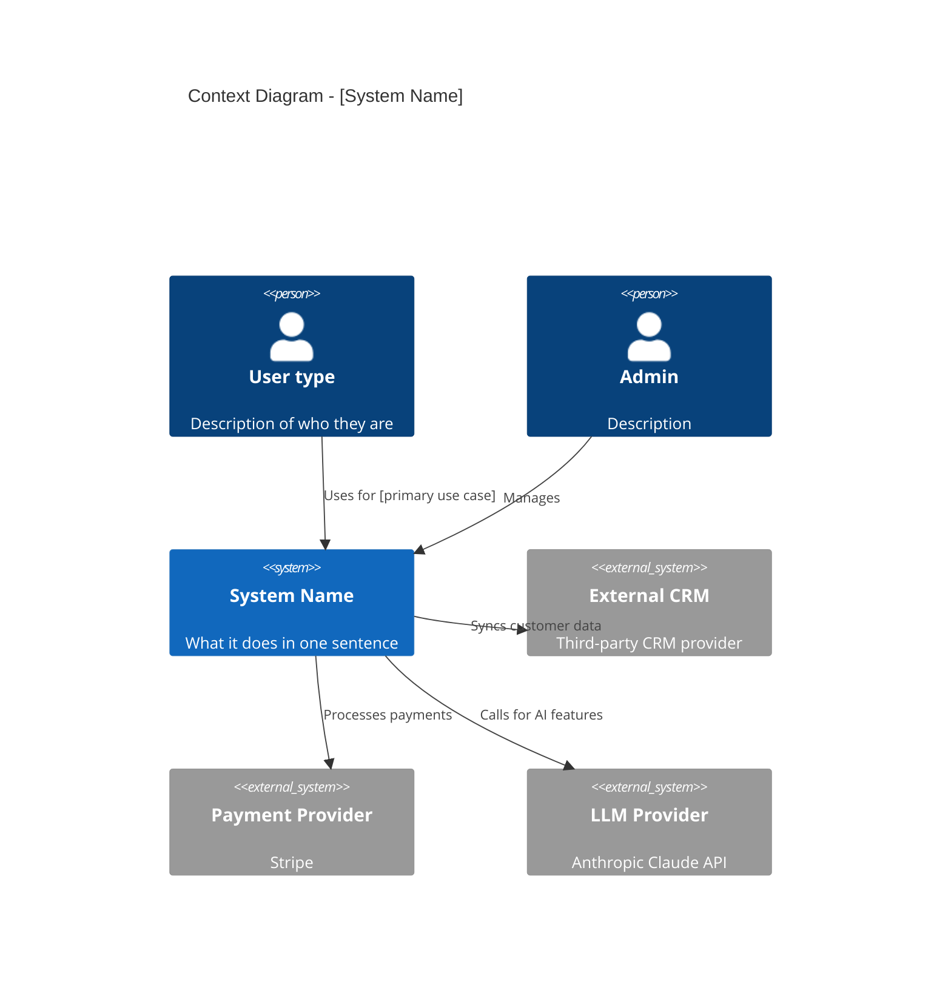
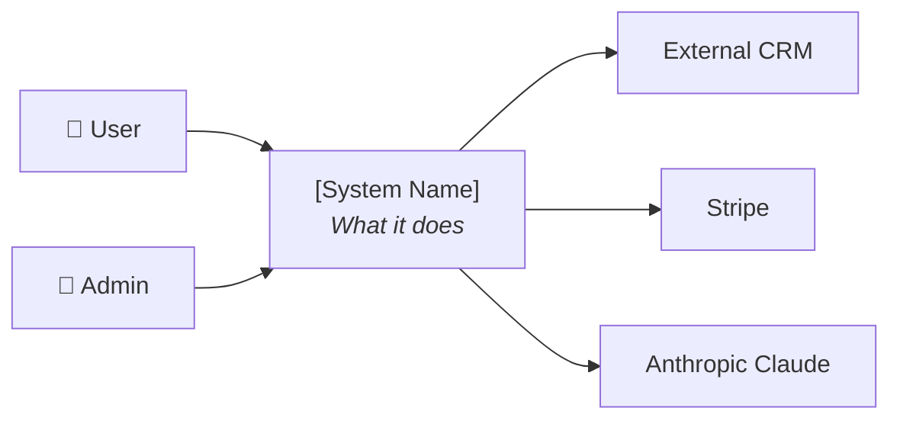
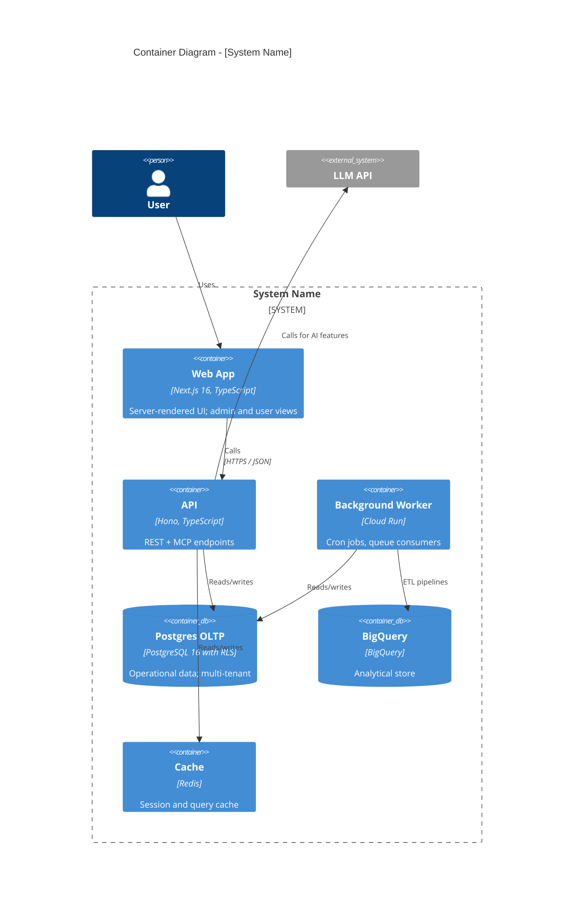
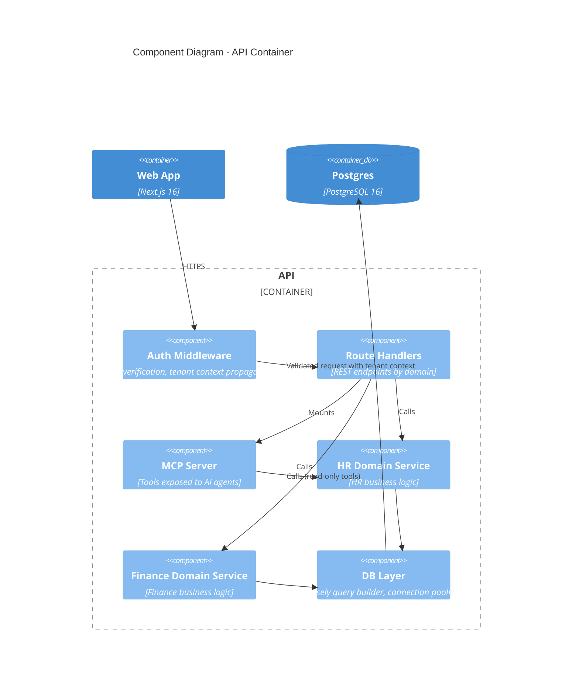
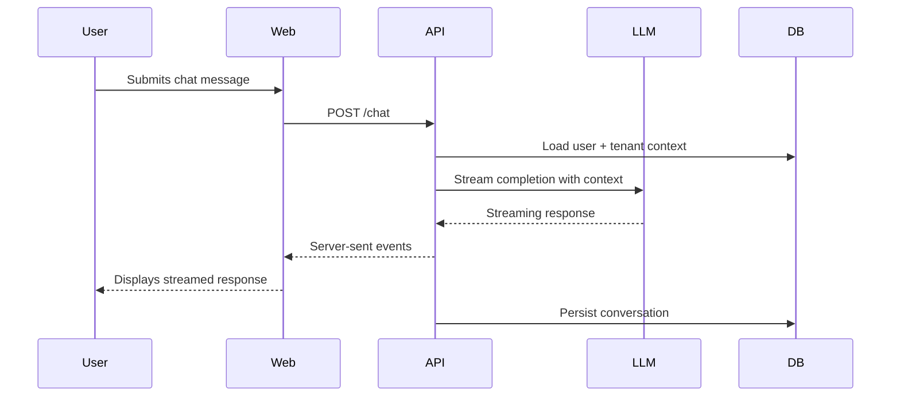
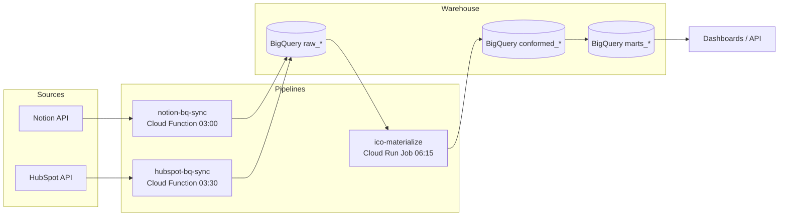
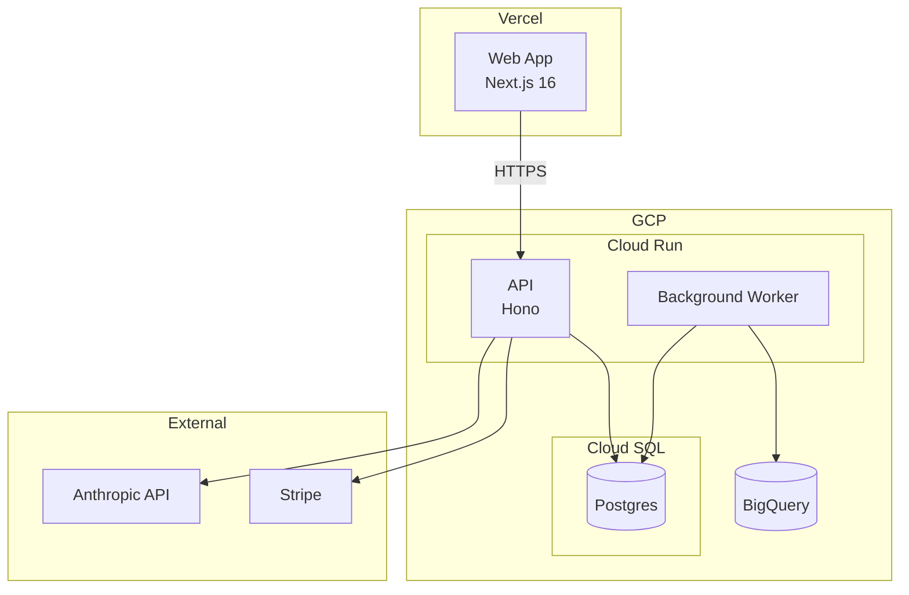

# C4 Diagrams in Mermaid

The C4 model has four levels:

1. **Context (L1)**: the system in its environment — users, external systems
2. **Container (L2)**: major components inside the system (deployable units)
3. **Component (L3)**: pieces inside a container
4. **Code (L4)**: classes / functions — usually skipped in architecture docs

This skill uses **L1 always, L2 always, L3 selectively** (only for the most complex containers). L4 is generated from code, not designed.

Mermaid is the default rendering — it lives in markdown, renders in GitHub / GitLab / VS Code preview / mkdocs, and is editable as text. No tool lock-in.

## Level 1: Context diagram

Shows: the system, the people who use it, the external systems it interacts with.

### Mermaid syntax notes for L1

- `Person(id, "label", "description")` — a user type
- `System(id, "label", "description")` — your system (rendered prominently)
- `System_Ext(id, "label", "description")` — external systems
- `Rel(from, to, "relationship label")` — directional arrow

If the C4 plugin isn't supported in the rendering environment, fall back to a simple `flowchart`:

## Level 2: Container diagram

Shows: the major components inside the system. A container is anything that runs as its own process — frontend, backend, database, worker, scheduler.

### Mermaid syntax notes for L2

- `Container(id, "label", "tech stack", "description")` — a runtime container
- `ContainerDb(id, ...)` — a database container (rendered as a cylinder)
- `ContainerQueue(id, ...)` — a queue or message broker
- `System_Boundary(id, "label") { ... }` — groups containers within a system

For systems too large for one diagram, split L2 by domain (e.g., one diagram per major bounded context).

## Level 3: Component diagram (selective use)

Use only for the 1-2 most complex containers — typically the API or the core service.

## Sequence diagrams for critical flows

C4 doesn't cover dynamic behavior. Add sequence diagrams for the 2-5 most critical flows.

## Data flow diagrams for pipelines

For analytical / data-platform archetypes, show how data moves.

## Deployment diagrams (when needed)

Show how containers map to infrastructure.

## Skill behavior with C4 diagrams

When generating C4 diagrams:

1. **Always produce L1 and L2** for new design mode. L1 shows context; L2 shows the system internals.
2. **Use L3 sparingly** — only for the 1-2 most complex containers. Most systems don't need L3 in the spec.
3. **Use sequence diagrams** for the 2-5 most critical user-facing flows. They explain what static C4 can't.
4. **Use Mermaid by default**: it lives in the repo, renders in most tools, and is editable as text. Only suggest external tools (Structurizr, Lucidchart, draw.io) if the user explicitly asks for richer fidelity.
5. **Keep diagrams legible**: ~7-10 elements per diagram is the upper bound. More than that and you should split.
6. **Update diagrams as the architecture changes**: stale diagrams are worse than no diagrams. Treat them as living documentation, version-controlled with the code.
