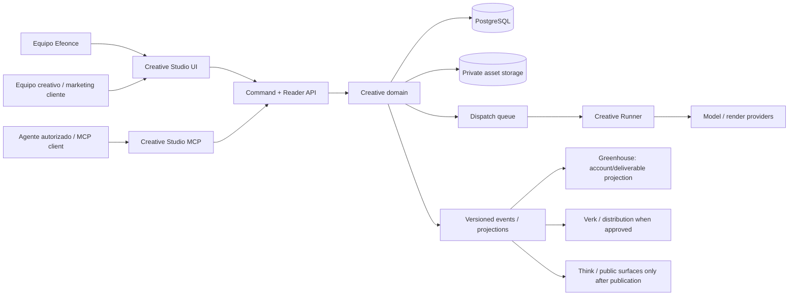
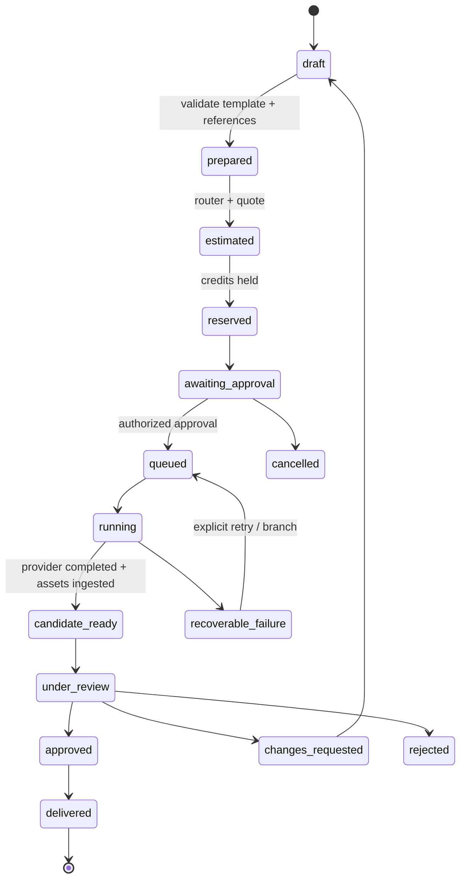
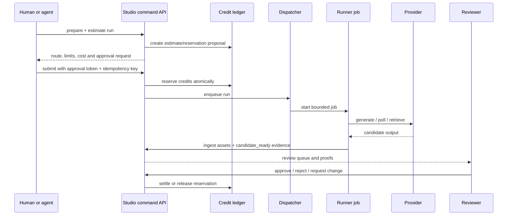

# Efeonce Globe — Creative Studio Agentic Platform Architecture V1

> **Estado:** arquitectura objetivo aprobada; bootstrap inicial ejecutado y foundation runtime pendiente de EPIC-028.
> **ADR:** [Efeonce Creative Studio: plataforma agentic peer con paridad UI + MCP](EFEONCE_CREATIVE_STUDIO_AGENTIC_PLATFORM_DECISION_V1.md)
> **Business model:** [Creative Studio Business Model V1](../business-models/creative-studio/EFEONCE_CREATIVE_STUDIO_BUSINESS_MODEL_V1.md) + [Studio Credit Model V1](../business-models/creative-studio/EFEONCE_CREATIVE_STUDIO_CREDIT_MODEL_V1.md)
> **Audiencia:** Creative Technology, producto, operaciones creativas y futuros integradores de Efeonce.
> **Principio rector:** una capacidad operable por una persona debe ser operable por un agente autorizado mediante el mismo contrato gobernado.
> **Investigación de producto:** [RESEARCH-009 — Creative Operations y workflows agentic](../research/RESEARCH-009-creative-operations-agentic-workflows.md) registra el landscape y las hipótesis de bootstrap; no modifica esta ADR ni autoriza runtime nuevo.
> **Soporte editorial:** [PDR-014 — Creative Workflows](../public-site/decisions/PDR-014-creative-workflows-territorio-editorial-pillar-cluster.md) construye la base científica, conceptual y pública del producto futuro. Sus artículos no son workflows, templates ni especificaciones operativas.

## 1. Resultado que se está construyendo

Efeonce Globe no es una galería de prompts ni un SaaS de generación. Es el **sistema operativo de producción creativa asistida** de Efeonce: convierte una intención aprobable en una corrida trazable de imagen, video, audio o 3D; conserva su evidencia; y deja al equipo y, luego, al cliente operar la misma capacidad desde UI, MCP o agentes. Creative Studio es su descriptor funcional. La persona creativa trabaja con briefs, referencias, tratamientos, candidatos y decisiones; la ingeniería del workflow permanece como infraestructura.

La primera oferta es interna. El modelo de datos, autorización, presupuesto y asset rights nace listo para workspaces de cliente, pero ningún cliente se habilita hasta completar los gates de EPIC-028.

### Principios de arquitectura

| Principio | Implicación concreta |
| --- | --- |
| Agentic by design | El agente planea y propone sobre contracts; no maneja navegador ni secretos de proveedores. |
| UI + MCP parity | La UI llama la misma API/command layer que el MCP server; no hay privilegio oculto de una surface. |
| Agency craft is product | Templates, rúbricas, referencias, decisiones y evaluación son IP versionada, no sólo prompts. |
| Human authority on spend and delivery | Estimar no gasta; reservar no ejecuta; aprobar sí permite una corrida acotada. |
| Fidelity before provider preference | El router recibe un contrato explícito: preserve-set, human-action, exact-text, flexible-style, audio-foley, etc. |
| Exploration before repeatability | El agente puede explorar y proponer planes editables; sólo una decisión creativa humana convierte una hipótesis en template/run repetible. |
| Builder / runner separation | Dirección creativa versiona la receta y sus límites; el runner sólo opera inputs semánticos expuestos, nunca el grafo o secretos internos. |
| Creative-native interaction | El sistema compila acciones creativas aprobadas en recipes/runs; un DAG técnico es una proyección avanzada, no la interfaz inicial. |
| One platform, multiple operating modes | Cliente, Efeonce o ambos operan los mismos aggregates y commands; el modo cambia autoridad y accountability, no el runtime. |
| Progressive autonomy | A mayor ambigüedad, riesgo, costo o complejidad de derechos, mayor gobierno humano/Efeonce; la repetición acotada puede graduarse a operación cliente. |
| Own the durable record | Asset, lineage, review y ledger viven en el Studio aun si la inferencia ocurre en un tercero. |
| Separate runtime, connected ecosystem | Integra por API/evento/deep link; nunca por tablas, credenciales o sesiones compartidas. |

## 2. Contexto de ecosistema y límites

Creative Studio es un backbone peer junto a Greenhouse, Kortex y Verk. Greenhouse sigue siendo el hub de operación de cuenta; Creative Studio es dueño de la producción y la memoria creativa.



### Ownership boundary

| Creative Studio owns | It may expose | It must not own |
| --- | --- | --- |
| Workspace creative projects, briefs, templates, reference packs, runs, asset versions, reviews, provider attempts, credit ledger, usage/cost evidence | Approved assets, run state, delivery references, usage summaries and deep links | Greenhouse Account 360, client commercial record, HR/finance ledger, public publishing, Verk distribution calendar |

Greenhouse's identity/organization can be linked through an explicit external binding, but `studio_workspace_id` remains the local tenant key. A mapping is not a foreign key into Greenhouse's database.

## 3. Archetype and deployment shape

Start as a **modular monolith with a separate worker deployable**, not microservices:

```text
efeonce-globe/                            # private repository
  apps/studio-web/                         # Next.js UI + BFF/API + MCP transport
  apps/creative-runner/                    # TypeScript worker entrypoint / Cloud Run Job
  packages/domain/                         # commands, readers, policies, state machines
  packages/provider-contract/              # provider-neutral capability interfaces
  packages/media-qc/                       # hashes, metadata, contact sheets, waveform helpers
  packages/database/                       # schema, migrations, repositories
  packages/contracts/                      # OpenAPI/MCP schemas/events shared by consumers
  infra/terraform/                         # GCP projects, IAM, storage, Cloud Run, observability
```

| Layer | Initial choice | Why |
| --- | --- | --- |
| Product UI and HTTP API | Next.js App Router + strict TypeScript | Fast internal product delivery and typed contract consumers. |
| Worker | Node.js / TypeScript in Cloud Run Jobs | Long, retryable provider polls/render orchestration must not hold web requests. |
| Durable operational store | Dedicated Cloud SQL for PostgreSQL instance/database | Transactional state, ledger, audit and tenant isolation; no Greenhouse database sharing. |
| Asset store | Private Cloud Storage buckets | Durable originals/derivatives with short-lived signed delivery URLs. |
| Dispatch | Cloud Tasks → fast dispatcher → Cloud Run Job | Reliable hand-off without pretending a 10-minute generation is an HTTP request. |
| Secrets and identity | Secret Manager + least-privilege service accounts | Provider keys are never available to UI/MCP clients. |
| Telemetry | OpenTelemetry traces/metrics/logs plus domain run events | Correlates human, agent, MCP, worker and provider attempts. |

El bootstrap usa un único proyecto GCP aislado, `efeonce-globe`, bajo la organización y billing de Efeonce. Esta postura inicial no mezcla Globe con Greenhouse: separa runtime, IAM, datos, storage y secretos por proyecto. Un proyecto productivo separado se crea sólo cuando el primer release sea reproducible por IaC y tenga presupuesto, seguridad, backup, rollback y promoción de secretos aprobados.

> **Estado — `TASK-1464` IaC aplicada en vivo (2026-07-19).** La reproducibilidad por IaC ya existe:
> `infra/terraform/` codifica la foundation del proyecto no productivo `efeonce-globe`. Los recursos vivos de
> `TASK-1454` (4 service accounts, WIF de Vercel, Artifact Registry, IAM del deployer, bucket de Cloud Build) se
> adoptan con **import blocks** —sin recrear nada—, y se agrega la foundation nueva: GitHub WIF para deploy keyless
> (OIDC → WIF → deployer, sin service-account keys), deployer `run.admin` + act-as, bucket privado de evidencia del
> Lab `efeonce-globe-lab-evidence`, remote state en `gs://efeonce-globe-tfstate`, budget/alertas opt-in y una alerta
> anti-SA-key (invariante keyless). El `tofu apply` supervisado dio `23 imported, 13 added, 0 changed, 0 destroyed`
> (identidad de `TASK-1454` adoptada sin un solo destroy/replace). Protocolo: el apply ocurre sólo tras un `plan` con
> CERO destroy/replace. Runbook: `docs/operations/creative-studio/EFEONCE_GLOBE_IAC_RUNBOOK_V1.md`. Al trabajar sobre
> Globe, invocar la skill `greenhouse-globe`.

## 4. Core domain model

| Aggregate | Responsibility | Key invariants |
| --- | --- | --- |
| `workspace` / `member` / `role_grant` | Tenant, membership and authority | Every domain row is scoped to one workspace. |
| `brand_profile` / `project` | Durable creative context | Brand and rights constraints are versioned, not injected ad hoc into prompts. |
| `creative_template` / `format_spec` | Curated Efeonce workflow and output format | Versioned inputs, fidelity contract, slots/safe areas, export profiles, review gates, allowed providers and cost policy. |
| `composition_spec` / `artifact_manifest` | Repeatable composition and its delivered result | Immutable template + semantic slots/assets/copy input; output files, dimensions, hashes, lineage, render/review evidence and approved delivery use. |
| `reference_asset` / `asset_version` | Original and derived media | Content hash, source, rights, lineage, storage policy and derivative parent are recorded. |
| `creative_run` / `run_step` / `provider_attempt` | Execution, operating-mode assignment and recovery | One logical run has explicit operator/approvers/owners and can have several attempts; a retry or mode escalation never erases evidence. |
| `review_decision` | Craft/rights/delivery approval | Technical completion cannot self-approve a deliverable. |
| `credit_ledger` / `credit_reservation` | Commercial allowance and settlement | Append-only entries; reservation and settlement are idempotent. |
| `command_execution` / `audit_event` | Programmatic safety | Actor, authority, payload fingerprint, outcome and correlation are durable. |

### Cross-format composition boundary

Creative Studio owns the reusable production grammar for **curated formats**, not a free canvas: a
`format_spec` defines output constraints (for example frame ratio/count, safe areas, slot types and export
profiles); a `composition_spec` fixes a selected template plus approved semantic inputs; and an
`artifact_manifest` records each rendered derivative, its hashes, lineage, review evidence and intended
delivery use. The first proving format should be an **Instagram carousel**; posts, stories and deck-like
presentations are subsequent format specs, not separate renderer products.

This boundary deliberately does **not** move Tender Proposal Studio into Creative Studio. Tender owns the
RFP, requirement-set, audience classification, contractual gates and client-facing eligibility. Until a
versioned sister-platform handoff exists, its deterministic `DeckPlan` and `tender-worker` remain its own
specialized path. A future Tender integration may send only an approved, minimized composition request and
receive an `artifact_manifest`; it never synchronizes raw RFPs, internal diagnostics, costs or storage
credentials into Creative Studio by default.

### Run lifecycle



The provider's `succeeded` maps only to `candidate_ready`. The words **approved**, **delivered** and **published** are separate business decisions.

### Operating modes and accountability

Operating mode is a governed property of a project/run, not a separate product or commercial tier:

| Mode | Typical control | Platform implication |
| --- | --- | --- |
| `client-operated` | Client creative/marketing roles direct and run curated templates. | Entitlements expose only approved variables/actions; Efeonce platform support does not imply managed-delivery accountability. |
| `co-operated` | Client owns brand direction while client and Efeonce split execution by lane or stage. | Every active stage has one operator of record; escalation and handback preserve the same run, assets and audit trail. |
| `efeonce-managed` | Efeonce builds/operates the workflow; client retains brief, brand authority and final approval. | Managed delivery can bind OTD/FTR and support commitments to the scope Efeonce controls. |

Before a run may reserve or execute spend, policy must resolve these semantic responsibilities even if the final schema uses different names:

- operator of record;
- creative approver;
- budget approver;
- template authority;
- rights authority;
- delivery owner/approver.

One actor may hold several responsibilities when policy allows, but none may be inferred silently from the UI surface or operating mode. Switching modes never grants additional capability by itself. It changes assignments through an audited command and keeps brief, reference pack, lineage, review and ledger intact.

Autonomy is risk-routed. High creative ambiguity, identity/hero work, restricted assets, expensive routes or uncertain rights default to `efeonce-managed` or a tighter co-operated gate. Approved direction with complex production fits `co-operated`. Low-ambiguity, high-repetition variants can graduate to `client-operated` after evidence proves the template, rubric and escalation path.

## 5. The canonical capability contract

Every command follows this envelope:

```text
actor + workspace scope + capability + idempotency key + command payload
  → authorize → validate policy → audit → domain command
  → projection/event → response with command/run ID
```

Reads are policy-filtered projections. Commands have explicit idempotency and return a stable result or an in-progress/replay response; clients never retry by duplicating provider spend.

### Full API Parity birth contract

Parity is a Definition of Done at the **capability** boundary, not a transport added after UI. Every capability
task must deliver or extend:

1. versioned serializable schemas in `packages/contracts`;
2. a transport-neutral command/reader primitive in `packages/domain`;
3. trusted actor/workspace context derived by server auth/binding, separated from untrusted caller payload;
4. authorization, idempotency/concurrency, audit, canonical errors and observable result/status;
5. a private versioned HTTP mapping and typed SDK path where the capability is executable;
6. a machine-readable coverage record for UI, SDK, MCP/agent, CLI/runbook, worker/event, sister platform and E2E;
7. conformance tests proving every enabled surface reaches the same primitive and audit record.

`available`, `policy-blocked` and `not-applicable` are valid per-surface states. `missing` is not a valid
closure state for an executable business capability. This does **not** imply a public API or simultaneous client
exposure: Model Lab may be internal-only and MCP/UI may remain `policy-blocked` until route promotion. It does
mean that the first billable provider canary is invoked through the canonical API/SDK or conformance harness,
never by direct provider calls from UI, MCP, CLI or task scripts.

The first spine and spoofing-negative harness are owned by `TASK-1481`; `TASK-1457` proves it with the first
safe model canary. Capability tasks extend the spine themselves. `TASK-1473` packages/publishes SDK and MCP
adapters and certifies cross-surface equivalence; it is not where parity or business logic first appears.

### Surface parity matrix

| Capability | UI | MCP / agent | Control point |
| --- | --- | --- | --- |
| Browse templates, assets and run history | Reader API | Read-only tool/resource | Workspace and asset policy |
| Prepare brief/reference pack | Form calls `prepareRun` | `creative.prepare_run` | Validation, rights/classification check |
| Estimate model route and credit spend | UI estimate with provider/model/version, readiness, limitations and fallback | `creative.estimate_run` | Router and commercial policy |
| Reserve and submit a run | Approval dialog | `creative.submit_run` with one-time approval token | Role, budget, idempotency, credit reservation |
| Follow run/review evidence | Run detail | `creative.get_run` / `creative.get_asset` | Scoped projection only |
| Request changes or branch an attempt | Review surface | `creative.branch_run` | Lineage and review policy |
| Approve delivery or publish externally | Controlled human UI | Not autonomous in V1; MCP may create a proposal only | Explicit human authority + destination policy |

The MCP server is a thin protocol adapter. It validates the caller's issued identity and workspace grant, then invokes the same command/reader layer. It never receives database credentials, provider secrets or a privileged cross-workspace role.

### Agent autonomy levels

| Level | Agent may do | Agent may not do |
| --- | --- | --- |
| `read` | Inspect approved workspace context, runs, templates and permitted assets | Retrieve another workspace, private originals or hidden provider keys |
| `propose` (default) | Build brief, select template, propose routing/cost/review plan | Reserve credits, execute generation, approve or publish |
| `prepare` | Create a validated run draft and estimate | Convert an estimate into charge/spend |
| `execute-approved` | Submit only a signed, bounded approval token | Change scope, spend cap, provider policy or delivery target |

## 6. Media production and provider routing

El portafolio curado, lifecycle y states de incorporación viven en
[Enterprise Model Portfolio V1](EFEONCE_CREATIVE_STUDIO_ENTERPRISE_MODEL_PORTFOLIO_V1.md); los agentes leen el
[Capability Registry V1](EFEONCE_CREATIVE_STUDIO_CAPABILITY_REGISTRY_V1.json). En V1.1 es un inventario de
research y candidatos exactos, no una allowlist ejecutable ni un marketplace libre. Sólo el registry runtime
del Studio puede marcar una route/version como `production_approved` después de adapter, eval, policy y carga.

**Provider policy:** cualquier modelo nativo de Google se ejecuta sólo en Google Cloud/Vertex AI; no se enruta
por Fal. Fal atiende modelos no-Google y utilidades especializadas allowlisted. OpenAI se consume directo. El
compositor determinístico permanece bajo ownership del Studio.

`ProviderAdapter` is a capability interface, not a generic lowest-common-denominator wrapper. A template declares what it needs: input/output modality, reference count, camera/action constraint, exact-text sensitivity, foley/audio requirement, allowed transformations, latency ceiling and budget tier.

The router returns a **route proposal**: chosen provider/model/version, readiness, input adapter plan, expected
credit range, known limitations and fallback policy. UI and MCP expose that route before spend approval; this
transparency is part of the product value, not an internal-only diagnostic. Each provider attempt records and
exposes the route actually used. If fallback executes a different route, the run shows proposed and actual
routes without rewriting history. Provider-neutral credits therefore mean stable capability pricing, not a
hidden model.

Cada route candidate tiene dos ejes: `portfolio_tier` (`core | core-scale | specialist | canary | watch |
deprecated | blocked`) y `readiness` (`research_verified | adapter_verified | eval_qualified |
production_approved`). Ausencia de readiness explícito equivale a no ejecutable. Un template y un agente
seleccionan una capability semántica estable y parámetros autorizados; el router resuelve una route candidate.
Nunca reciben un tool genérico `run_endpoint(endpoint, arbitrary_json)`.

> **Estado — stack de proveedores real implementado (2026-07-19, verificado en vivo).** El `ProviderAdapter` de esta
> sección ya tiene implementaciones reales detrás del `creative-runner`, verificadas contra cuentas de proveedor en vivo.
> `TASK-1486` entrega el `VertexCreativeAdapter` (Google-native por Vertex AI, **keyless** vía ADC/WIF). `TASK-1487`
> agrega el `FalCreativeAdapter` (non-Google, queue API) y el `CompositeProviderAdapter`, que rutea entre Vertex y Fal por
> `supports()` + política de proveedor (Google-native → Vertex; non-Google → Fal), materializando la Provider policy de
> arriba. `TASK-1488` cierra 10 capabilities con modelos verificados en vivo (Seedream 5, Recraft, Topaz, Seedance, Seed
> Audio, ElevenLabs, Rodin 3D; regla dura: los IDs de modelos ByteDance sin prefijo `fal-ai/`). `TASK-1459` convierte el
> Still Model Lab en una **recommendation matrix** real (Vertex Nano Banana vs Fal Seedream comparados por
> costo/latencia/objetivo) y corrige un bug de `route_stable`. Invariantes materializados: el ruteo capability→modelo vive
> **dentro del adapter** (no en policy de dominio); `actualRoute` es la ruta del contrato de fidelidad, no el slug; keyless
> para Google-native y keyed-con-secreto-propio para el resto, **nunca un secreto compartido Globe↔Greenhouse** (la key Fal
> compartida del canary es excepción temporal); y la matrix compara motores objetivamente, pero **el harness nunca
> auto-elige un ganador creativo** (craft = decisión humana; promover una ruta a producción sigue siendo un gate separado).
> Pendientes: resolución hash→bytes (desbloquea input-bearing + motion/audio labs), key Fal propia de Globe, deploy de
> `studio-web` y routing por contrato de fidelidad en el Composite. Spec canónica:
> `docs/architecture/creative-studio/EFEONCE_GLOBE_MODEL_LAB_V1.md` (provider seam del Model Lab). Al trabajar sobre Globe,
> invocar la skill `greenhouse-globe`.

The Glitch intro becomes a canonical fixture: a practical `ON AIR` must be born in the scene, the finger performs a strike-and-rebound rather than a button press, and microphone foley must be evaluated as sound-of-contact. The router cannot silently replace this with an overlay or generic tap SFX. The RRSS micro-scenes are a different fixture: synthetic key visuals can be a flexible visual anchor and may route to a different video engine.

### Asset and rights policy

1. Ingest authorized source file → hash, classify, record rights/source → store private original.
2. Create inference adapter only when provider constraints demand it; preserve relation to the original and record every visual/text alteration.
3. Ingest provider output into private storage; provider URL is ephemeral evidence, never source of truth.
4. Generate machine-readable QA evidence where useful (technical metadata, contact sheet, waveform, frame hash); human craft review remains decisive.
5. Use time-limited signed URLs only after authorization. Asset events and logs carry identifiers, not public raw URLs.

### Refinar un candidato (edit/refine) es transversal, no una feature de proveedor

Refinar un candidato ya producido es una capacidad **transversal y transport-neutral** del contrato. El caller
declara una sola intención —"refina el candidato que produjo la corrida X"— sin nombrar paradigma, sesión ni
modelo; y un edit **no** es un command nuevo: es una corrida, con la misma autoridad, el mismo gate de gasto,
la misma state machine y el mismo manifest inmutable. Existen dos paradigmas nativos y ninguno se expresa en
el contrato:

- **stateful** — el proveedor guarda la sesión y el edit se encadena por su id;
- **reference-based** — el output del padre se re-inyecta como base del edit.

El dominio resuelve el candidato padre server-side; el runner elige el paradigma según qué proveedor va a
ejecutar —un handle de sesión sólo significa algo para quien lo emitió— y registra la elección en el manifest
del intento: un cambio de paradigma es evidencia, nunca silencioso.

**La retención de outputs es lo que hace posible el cross-model.** El punto 3 de la asset policy anterior
(ingerir el output del proveedor a storage privado) deja de ser sólo custodia y pasa a ser habilitante: un
candidato retenido content-addressed puede refinarse con **otro** motor, porque la referencia no depende de
ninguna sesión del proveedor. Un derivado tampoco se blanquea como material propio: arrastra los derechos del
padre bajo una postura que un caller no puede declarar por sí mismo.

> **Estado — `TASK-1490` (2026-07-20), verificado en vivo por el seam completo** en cuatro carriles:
> reference-based, cross-model (Seedream → Nano Banana en Vertex), stateful (Gemini Omni) y referencias
> combinadas imagen+vídeo. Contrato, rechazos previos a la reserva de gasto, invariantes de derechos y
> evidencia: `docs/architecture/creative-studio/EFEONCE_GLOBE_MODEL_LAB_V1.md` → §"Edit / refine cross-model".

## 7. Credits and commercial boundary

Provider spend is an internal input; credits are the customer-facing unit of governed generative operations in
an Efeonce capability, not a pass-through token or vendor-cost mirror.

La política económica vigente refina esta frontera: Studio Credits miden sólo operaciones generativas
gobernadas. Dirección, capacidad, gobierno, implementación/IP, deterministic finishing y derechos viven en
líneas separadas; el precio total sí puede empaquetarlas sin ocultar su economía. Canon:
[Studio Credit Model V1](../business-models/creative-studio/EFEONCE_CREATIVE_STUDIO_CREDIT_MODEL_V1.md).

```text
allocation → estimate → reservation hold → approval → execution
  → actual provider cost evidence → settlement | release | refund adjustment
```

- `credit_ledger` is append-only. Balance is a projection, never the only mutable number.
- Reservations expire, are scoped to a run and are idempotent.
- A failed provider attempt settles according to a documented policy; no silent double charge.
- V1 may allocate internal/client credits manually or through the commercial engagement. Checkout, tax, invoicing and self-serve top-ups are explicitly deferred until finance/legal design.

## 8. Security, tenancy and policy

- Start internal-only but enforce `workspace_id`, roles, row policies and asset authorization from the first migration.
- Roles: `agency_admin`, `studio_operator`, `client_creator`, `client_approver`, `client_viewer` are working names; policy defines their effective capabilities rather than hardcoding UI permissions.
- Separate service accounts: web/API, MCP adapter, dispatcher, runner and event/projection publisher. Grant only necessary IAM/resource access.
- Store keys in Secret Manager; never return keys to UI/MCP/agent context and never write prompt/reference contents to broad logs.
- Treat incoming client assets as untrusted. External client upload requires a virus/scanning/quarantine and rights acceptance gate before broad enablement.
- Prompts and outputs inherit workspace classification. Restricted material requires explicit template/provider allowlisting and cannot be silently routed to an unapproved third party.
- Cross-platform integration uses versioned client credentials and explicit bindings under the sister-platform contract. Greenhouse does not get implicit write authority over Studio credits or assets.

## 9. Observability, evaluation and review

Each run produces a correlated record across API, agent/MCP call, queue dispatch, worker, provider attempt, storage ingest and review. Required dimensions include `workspace_id`, `project_id`, `run_id`, `operating_mode`, responsibility assignment IDs, `template_version`, `provider`, `model`, `attempt`, `actor_type`, `credit_reservation_id` and error class (never raw secret or public asset URL).

The user-facing projection includes provider, model display name, exact version/readiness and fallback history.
It excludes provider credentials, privileged endpoints, confidential vendor cost, Efeonce margin and internal
prompt/IP fields not included in the approved transparency policy.

### Quality gates

| Gate | Automated evidence | Human decision |
| --- | --- | --- |
| Technical | File integrity, duration/ratio, codec, hash, ingest completion | Reject if it is unusable despite valid metadata |
| Fidelity | Template-specific evaluators/fixtures, reference pack checks | Direction decides set continuity, anatomy/action and practical authenticity |
| Creative breadth | Similarity/duplication signals and recorded branch coverage | Direction decides whether exploration was meaningfully diverse rather than merely voluminous |
| Audio | Loudness/duration/waveform and sync markers | Sound review decides foley realism, absence of unwanted music/ambience |
| Rights and delivery | Asset policy, destination and approval state | Authorized reviewer approves delivery/publication |
| Economics | Estimate versus reservation versus actual cost | Owner resolves exception before further spend |

Golden fixtures begin with the validated RRSS workflow and the Glitch recovery record. A provider/model is not promoted simply because it returned `completed`; it needs documented performance on the fidelity contract it claims to serve.

## 10. Initial private API shape

All programmatic routes are versioned and authenticated. `TASK-1481` owns the minimal machine-readable
contract spine, trusted-context envelope and conformance harness; `TASK-1457` adds the Model Lab experiment
contract, `TASK-1469` stabilizes the production run lifecycle and `TASK-1473` publishes/certifies SDK/MCP
transports. The semantic boundary is:

> **Estado — `TASK-1481` implementado (2026-07-19).** El contract spine existe y está verde en el repo
> hermano `efeonce-globe`: separación untrusted payload / trusted context branded server-side, `CapabilityRegistry`
> transport-neutral, coverage machine-readable de 3 estados (`missing` irrepresentable), errores canónicos
> (`policy_blocked` ≠ `access_denied` ≠ `not_found`), private HTTP (`/v1/capabilities`, `/v1/commands`, `/v1/readers`)
> + SDK tipado, y un conformance harness manifest-driven (HTTP≡SDK, anti-spoofing). Ships con una capability
> inerte; las creativas quedan `policy-blocked` hasta su task. Spec canónica: `docs/architecture/creative-studio/EFEONCE_GLOBE_API_CONTRACT_SPINE_V1.md`
> (SPEC-001) + runbook y doc funcional en el mismo repo. Al implementar sobre Globe, invocar la skill `greenhouse-globe`.

```text
GET  /v1/templates
GET  /v1/runs/{runId}
GET  /v1/assets/{assetId}
POST /v1/runs:prepare
POST /v1/runs:estimate
POST /v1/runs:submit             # requires approval token + Idempotency-Key
POST /v1/runs/{runId}:branch
POST /v1/runs/{runId}:review
```

MCP tools map to the same commands/readers. A client-facing public API is **not** implied by this initial shape; access starts private and scoped to Efeonce identities/MCP principals.

## 11. Delivery sequence



## 12. Phased delivery and deliberate non-goals

Las fases describen madurez del producto, no una waterfall de implementación. EPIC-028 se ejecuta en paralelo:

- Model Lab prueba rutas reales desde el inicio bajo credenciales gobernadas, hard spend cap, rights de inputs,
  manifest inmutable, ingest privado, aprobación humana y kill switch;
- la plataforma construye tenancy, assets, responsibilities, shadow ledger, commands, workers y surfaces;
- validación comercial empieza con evidencia y un Sample Sprint `efeonce-managed`, sin esperar Studio Access.

`Lab-qualified` no equivale a `production_approved`. UI/MCP sólo consumen rutas que además cumplen aislamiento,
idempotencia, estimate/reservation, approval token, rights/provider policy, eval calificada, observabilidad y
rollback. El execution plan canónico vive en
`docs/operations/creative-studio/EPIC_028_PARALLEL_EXECUTION_PLAN_V1.md`.

> **Estado — `TASK-1457` implementado (2026-07-19, fake canary).** El Model Lab es la primera capability de negocio
> sobre el spine de `TASK-1481`: capability `globe.lab.experiment.run`, commands `prepare`/`execute`/`cancel` +
> readers `get`/`status`/`evidence`, state machine del experimento
> (`prepared → estimated → reserved → running → candidate_ready | failed | cancelled`) con autoridad derivada
> server-side, hard spend fence (`LabSpendFence`, aborta antes de gastar; cap por run y por workspace/día-UTC),
> private-ingest (los inputs cruzan la API sólo como content hash + rights declarados, nunca bytes crudos), kill
> switch fail-closed (fuerza `policy_blocked`) y el provider seam probado end-to-end con un `FakeReferenceAdapter`
> determinístico (cero red, cero gasto, cero infraestructura). El canary con **proveedor real** queda pendiente
> —gated en `TASK-1464` + aprobación explícita— y falta adapter real, secretos de proveedor en Secret Manager,
> Dockerfile de studio-web y `GLOBE_LAB_ENABLED=true` (default OFF). UI/MCP quedan `policy-blocked` hasta la
> promoción. Spec canónica: `docs/architecture/creative-studio/EFEONCE_GLOBE_MODEL_LAB_V1.md`.

La gobernanza de ejecución no se desplaza con el runtime: Greenhouse conserva EPIC-028, `TASK-1456…1481`,
task hooks, Plan Mode, lint, QA, lifecycle, cierre y handoff. Globe posee código, infraestructura, datos y
evidencia técnica; su plan operativo referencia las tasks canónicas y no crea un segundo backlog.

> **Estado — `TASK-1458` implementado (2026-07-19, fake canary).** El Golden Briefs & Evaluation Harness (SPEC-003)
> es la capa versionada que convierte un intento del Model Lab en evidencia repetible por contrato de fidelidad:
> capability `globe.lab.evaluation.run` sobre el mismo spine de `TASK-1481`, comando `evaluate` + readers `fixtures`/`report`.
> **Consume** el Model Lab (`runModelLabExperiment`) —no reimplementa ejecución, spend fence ni provider seam— para
> correr golden briefs versionados con derechos declarados (still `rrss-key-visual-still`, motion `product-motion-loop`,
> audio `glitch-microphone-foley`; fixtures y rúbricas son **dato**) y puntúa el manifest con checks objetivos
> deterministas (`output_present`, `within_hard_cap`, `input_lineage_intact`, `route_stable`, `outcome_candidate`),
> separados de los criterios humanos declarados (nunca auto-respondidos). El verdict **nunca** es un "passed" creativo:
> sólo `objective_fail` u `objective_pass_pending_human`. Emite un `EvaluationReportV1` versionado, scopeado al workspace
> y con limitaciones declaradas (proveedor fake, muestra única). Un report es evidencia técnica, **nunca** aprobación de
> ruta (invariante 9) ni de artefacto (invariante 6). `ui`/`mcp` quedan `policy-blocked`; el juicio humano real y la
> corrida contra proveedor real quedan pendientes del canary de SPEC-002. Spec canónica:
> `docs/architecture/creative-studio/EFEONCE_GLOBE_EVALUATION_HARNESS_V1.md`.

---

> **Estado — `TASK-1465` implementado (2026-07-21, deployed + live-verified).** Globe aterrizó su **primer datastore
> durable**: un Cloud SQL `globe-pg` propio (Postgres 16, `southamerica-west1`, IAM keyless sobre el Cloud SQL
> connector, provisto en Terraform). El §5 de esta arquitectura —*Durable operational store: Dedicated Cloud SQL for
> PostgreSQL*— deja de ser sólo objetivo: seis tablas tenant-scoped + un `audit_log` append-only respaldan, detrás de
> sus ports ya existentes, los cinco stores antes **in-memory / per-proceso** (sesiones, transacciones OAuth,
> experimentos, reportes de evaluación y el spend fence de seguridad). Ambos servicios Cloud Run corren durable en
> `maxScale=3`: esto **levanta el techo de HA** (`maxScale=1`) que ADR-004 hard-gateaba en esta task. **Queda
> diferido:** el modelo rico de workspace/members/grants y el mecanismo exacto de tenancy PostgreSQL/RLS (§13);
> persistir `maxScale` por IaC es `TASK-1508`. Spec canónica:
> `docs/architecture/creative-studio/EFEONCE_GLOBE_DURABLE_PERSISTENCE_V1.md`.

| Phase | Outcome | Explicitly excluded |
| --- | --- | --- |
| 0 — foundation | New repo, project boundaries, tenant/auth, assets, ledger skeleton, audit/telemetry, provider contract, one internal template | Client access, payments, free canvas |
| 1 — prove craft | Image/video/audio runs, route estimate/approval, review, provider evidence, **Instagram carousel** + RRSS/Glitch fixtures | Autonomous publishing, arbitrary model marketplace |
| 2 — client-ready | Scoped client roles, asset intake/rights, client review, co-operated runs and bounded client-operated templates, contracts/events for Greenhouse and Verk | Unbounded self-serve spend, client authoring of arbitrary workflows, cross-tenant collaboration |
| 3 — scale IP | Batch/variants, curated flow composition, evaluation registry, commercial credit allocation | General-purpose automation platform |
| 4 — advanced authoring | Governed canvas/DAG and richer agent collaboration if evidence warrants it | Replacing professional direction/review |

## 13. Architecture decisions deferred to the bootstrap tasks

- Identity issuer and SSO binding for the initial internal team.
- Exact PostgreSQL tenancy enforcement mechanism (RLS policy design and ORM/runtime integration).
- Provider adapter order and contract tests from live accounts, not marketing claims.
- Credit currency, expiry/refund policy, tax/invoicing and commercial packaging.
- Exact responsibility schema, operating-mode entitlements, escalation commands and which metrics/SLA attach to each controlled scope.
- Data retention, licensed asset policy, consent/deepfake policy and external upload scanner.
- Whether an audio-specific runtime later merits Python/GPU tooling. TypeScript/Cloud Run Jobs is the default until evidence proves otherwise.

## 14. External technical references

The infrastructure selections follow managed primitives suitable for this stage: [Cloud Run Jobs](https://cloud.google.com/run/docs/create-jobs), [Cloud Tasks HTTP targets](https://docs.cloud.google.com/tasks/docs/creating-http-target-tasks), [Cloud Run service-to-service authentication](https://docs.cloud.google.com/run/docs/authenticating/service-to-service), [Cloud Storage signed URLs](https://docs.cloud.google.com/storage/docs/access-control/signed-urls), [Cloud SQL for PostgreSQL](https://docs.cloud.google.com/sql/docs/postgres), [Secret Manager](https://docs.cloud.google.com/secret-manager/docs/overview) and [OpenTelemetry JavaScript](https://opentelemetry.io/docs/languages/js/). These are deployment building blocks, not authorization to provision them before EPIC-028 bootstrap approval.
