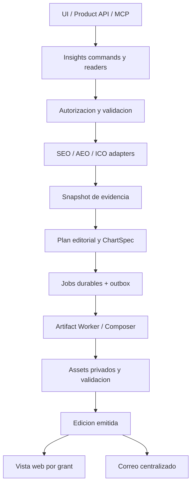

# Efeonce Insights — Architecture V1

> Status: **Diseño para implementación**, 2026-09-08. Dirección aprobada; nada de este documento acredita
> código, migraciones, configuración ni runtime nuevos. Owner: Platform + Client Experience.
> [ADR](EFEONCE_INSIGHTS_PLATFORM_DECISION_V1.md) · [EPIC-045](../epics/to-do/EPIC-045-efeonce-insights-multiformat-intelligence.md).

## 1. Producto y alcance inicial

**Efeonce Insights** convierte evidencia del cliente en una entrega ejecutiva y operativa que puede leerse,
presentarse, compartirse y recuperarse después. Greenhouse conserva biblioteca, encargo, permisos y operación.

- Tres salidas: `deck_pdf` horizontal 16:9; `report_pdf` A4 vertical; `web` responsive.
- Módulos iniciales: SEO, AEO e ICO/delivery (RpA y OTD); combinables en una misma edición.
- Período explícito, zona horaria, comparación, proyectos, audiencia, idioma y profundidad.
- Branding Efeonce obligatorio; logo del cliente opcional y autorizado, con pack/asset versionado.
- ID estable de reporte, versiones inmutables, revisión editorial, enlaces y entrega por correo.
- API, UI y MCP equivalentes; generación asíncrona y programación recurrente gobernada.
- Quedan fuera PPTX/DOCX editables, diseñador libre de slides, métricas nuevas, refresh facturable implícito,
  BI ad hoc, distribución masiva, cambios de fórmula, extracción de repositorio y migración general del Grader.

Efeonce Insights es la biblioteca de entregas; no sustituye el historial de insights de Nexa ni su
`NexaInsightsBlock`. Los hallazgos de Nexa pueden aportar evidencia autorizada mediante un adapter futuro.

## 2. Evidencia actual y reutilización

Inspección local del 2026-09-08; disponibilidad productiva se verifica al ejecutar cada task.

| Pieza existente | Qué se reutiliza | Brecha / dueño |
|---|---|---|
| `src/lib/artifact-composer/` | Selector, slots, validadores, manifest y brand packs | Nuevos catálogos analíticos; TASK-1847 |
| `src/lib/commercial/tenders/proposals/render-jobs.ts` + `services/artifact-worker/main.ts` | Enqueue/outbox, dispatcher, verificación de manifest y assets | Hoy atados a Proposal; adapter Insights sin romper Proposal; TASK-1846 |
| `src/lib/growth/ai-visibility/report/{command,snapshot,short-link}.ts` | Readers, snapshot público, patrón de enlace revocable | Un enlace activo por reporte no satisface múltiples grants; TASK-1848 |
| `src/components/growth/{seo,ai-visibility}/report-artifact/` | Modelos y proyecciones de audiencia existentes | Adaptación semántica, nunca scores vacíos inventados para encajar; TASK-1845 |
| `src/lib/ico-engine/read-metrics.ts` | Métricas canónicas de espacios | Evidencia de ventana y granularidad; TASK-1845 |
| `src/lib/email/delivery.ts`, `types.ts`, `context-resolver.ts` | Entrega, clasificación, dedupe/contexto | Nuevo caso Insights; TASK-1848. Presentación visual del correo: TASK-1849 |
| `src/mcp/greenhouse/tool-manifest.ts` | Inventario federable | Entradas por capability en sus tasks backend, no otra API de reportes |

`TASK-1672` conserva el artefacto especializado de auditoría técnica SEO y `TASK-1673` su entrypoint de
sharing/envío. Adoptan Insights como consumidoras; no duplican motor, snapshot, tokens ni sender. Su gate
de hallazgos de sitio y restricciones de audiencia permanece. `TASK-1644` conserva VisualProfile; co-branding
de Insights usa el brand pack actual y no introduce un segundo registry de skins. EPIC-018 conserva los
dashboards de desempeño; Insights sólo produce entregas congeladas.

## 3. Ownership y topología

Ubicaciones **nuevas propuestas**, no existentes: `src/lib/insights/`, `src/views/greenhouse/insights/`,
`src/components/insights/`, `src/lib/copy/insights.ts`, catálogos `insights-deck` y `insights-report` dentro
del Composer. No crear `apps/*`, `packages/*`, repo, servicio ni pool antes de una decisión independiente.

Los módulos gobiernan hechos y permisos; Insights gobierna edición y distribución; Composer gobierna
composición; Platform gobierna job/asset; Email gobierna transporte. API/MCP/UI no consultan fuentes por su cuenta.

## 4. Modelo de dominio

Nombres lógicos propuestos; TASK-1845 materializa schema/DDL con helpers canónicos y migraciones additive.

| Entidad | Identidad y autoridad | Invariantes |
|---|---|---|
| InsightReport | ID opaco + código legible único, p.ej. `EO-INS-2026-000123`; organización y propósito | Código no es secreto; unicidad atómica, sin `MAX+1`; org inmutable |
| InsightEdition | reportId + versión + encargo + audience | Sólo edición emitida es compartible; editar/corregir crea versión, no muta la emitida |
| EvidenceSnapshot | Hechos mínimos, fuentes y hashes de evidencia | Inmutable al sellar; sólo datos autorizados; sin PII operativa innecesaria |
| EditorialPlan | Secciones, claims, ChartSpec, acciones, referencias | Congela datos y texto final; versiona modelo/prompt si hubo IA, sin chain-of-thought |
| RenderRun / Output | edición + target + manifestHash + assetId | Estado y error por salida; retries sin duplicar archivos finales |
| ShareGrant | edición + hash de token + expiración + downloadPolicy | Muchos por edición, revocación individual; no autoriza biblioteca ni queries libres |
| DeliveryIntent | edición + destinatarios + outputs + autorización | Cada destinatario tiene estado; referencia `email_deliveries`, no segundo transporte |
| InsightSchedule | encargo relativo + zona + frecuencia + autoridad | Resolución de período por ocurrencia; inactive por defecto; generación y envío separados |

Materializar relaciones dentro del dominio con integridad de organización en todas las referencias. Ownership
de nuevos stores: TASK-1845 núcleo; TASK-1846 renders/outputs; TASK-1848 grants/delivery/schedules. Los catálogos
globales tienen ownership explícito de plataforma; logos del cliente quedan ligados a su org y versión.

### Ciclos de vida independientes

- Edición: `draft → collecting → composing → validating → ready_for_review → issued`; `failed` recuperable
  por fase y `withdrawn` para retirada de acceso. Emitir exige los outputs solicitados validados.
- Render por target: `queued → running → succeeded | failed | cancelled`. Lease vencido permite recuperación
  con fencing; un worker antiguo no puede finalizar encima del nuevo.
- Share: `active → revoked | expired`; no se reactiva un token revocado.
- Delivery: `pending → accepted → delivered | bounced | failed`; aceptación HTTP no es entrega ni lectura.
- Schedule: `draft → active → paused | retired`; cambio de audiencia/destinatarios invalida autorización anterior.

UI muestra progreso por fase; no inventa porcentajes. Un PDF listo y otro fallido se muestran separados,
sin emitir una entrega completa ficticia. El usuario puede solicitar una nueva edición con otro output set.

## 5. Contrato de datos y ventana temporal

`InsightRequestV1` propuesto: `organizationId`, `projectIds`, `modules[]`, `period{start,endExclusive,timeZone}`,
`comparison`, `audience`, `locale`, `depth`, `outputs[]`, `brand{efeoncePackVersion,clientBrandRef?}` y
`idempotencyKey`. El actor proviene de la autoridad autenticada; nunca del payload.

Ventanas `[start,end)` se resuelven en zona IANA y se almacenan también en UTC. La UI puede mostrar fechas
inclusivas. Comparación anterior conserva regla de calendario explícita: mes anterior, año anterior o rango
custom; nunca asume que un mes tiene 30 días. Período abierto se etiqueta parcial. El `asOf` de cada fuente
se conserva; el corte del conjunto no implica que todas las fuentes se hayan actualizado al mismo instante.

Cada `ModuleReportAdapterV1` declara:

- version, módulo, capacidades, dimensiones/filtros permitidos y granularidades/ventanas disponibles;
- reader canónico y política de audiencia; queries parametrizadas y sin SQL elegido por un agente;
- hechos: metricId, valor/null, unidad, numerador/denominador cuando aplica, población, fuente, método/version;
- cobertura, freshness, observación/estimación y `evidenceRef`; razones de ausencia o incomparabilidad;
- secciones sugeridas y pares de hechos comparables; ningún componente visual propio ni llamada directa a provider.

**SEO:** consume series/readers existentes; posiciones, tráfico, visibilidad y ETV mantienen su metodología.
No mezcla fórmulas ETV; auditoría técnica hereda gates de TASK-1672. **AEO:** distingue snapshot puntual de
serie comparable por engine/prompt pack/modelo/metodología; no inventa histórico desde el último score.
`review_required`/`insufficient_data` se respetan. **ICO:** RpA y OTD salen del dueño; se mantienen supresión,
cohorte, denominador, período y regla de entrega. Nunca promedia promedios ni porcentajes sin pesos válidos.

Si un reader no sirve una ventana exacta, el adaptador declara `unsupported_window`; puede ofrecer granularidad
compatible explícita, nunca usar el dato actual como histórico. Datos incompletos de un módulo requerido
bloquean la emisión por defecto. Una política explícita `allow_partial` puede emitir omisiones visibles,
pero nunca salta los gates de seguridad, validez del instrumento o auditoría técnica.

## 6. Plan editorial, gráficos y salidas

El plan contiene resumen ejecutivo, capítulos de módulos, hallazgos con evidencia, acciones con owner sólo
si existe, límites y metodología. Cada cifra en texto/gráfico/tabla referencia el mismo hecho; una validación
rechaza discrepancias. La IA recibe exclusivamente evidencia allowlisted, con límites de tokens, costo,
timeout y máximo de reparaciones; sin herramientas de escritura/envío. Fallback determinista produce una
lectura factual cuando no hay modelo, sin inventar explicación. Aprobación ligada al hash final de edición.

`ChartSpecV1` propuesto define relación, series, dimensiones, unidades, escalas, base, etiquetas, referencias
y equivalente tabular. Familias iniciales obligatorias: barras simples/agrupadas/apiladas, líneas, circular/donut
y dispersión. Histogramas, box plots y heatmaps quedan como extensión compatible, no condicionan el primer cierre.
Barras con origen cero; pie/donut sólo partes no superpuestas de un mismo total; dispersión requiere observaciones
pareadas; no causalidad automática; gaps reales no se interpolan silenciosamente; sin 3D ni doble eje engañoso.

- **Deck:** 16:9, relato ejecutivo, una conclusión principal por lámina, gráficos/etiquetas legibles,
  portada con ID/período/versión y contraportada institucional. Pie según norma de decks.
- **Informe vertical:** A4, retícula editorial propia, portada/resumen/índice real para documentos largos,
  capítulos, tablas repetidas y anexos; control de viudas, cortes y continuaciones. URL bubble/contacto/folios
  según norma de informes. Índice, enlaces y texto seleccionable se verifican en el PDF final.
- **Web:** navegación por capítulos, tablas equivalentes, tooltips/selección accesibles, responsive y downloads.
  Sólo filtra el dataset congelado incluido; cambiar período o consultar otro módulo requiere nueva edición
  y autoridad. No replica el PDF como imagen ni convierte el snapshot en un dashboard vivo.

Composer resuelve intención `contentType` a plantilla; autoría no elige CSS ni geometría. La paginación vertical
se resuelve mediante un plan de páginas determinista del catálogo; si un límite genuino exige extender el motor,
TASK-1846 incorpora únicamente la primitive domain-free, y TASK-1847 conserva layout y resolvers. No hay fork.
Versionar y fijar brand pack, fuentes, catálogo, plan y renderer. Fidelidad semántica/visual es obligatoria;
igualdad de bytes PDF sólo si el renderer normaliza metadatos y el benchmark la demuestra.

## 7. API, MCP y autorización

Superficie **propuesta**, naming final de rutas/capabilities se registra durante implementación:

| Operación canónica | API / MCP | Dueña |
|---|---|---|
| list/get/catalog/validateRequest/createEdition/revise/issue | Thin adapters App/Ecosystem; listado paginado y estados compactos | TASK-1845 |
| requestOutputs/getRun/retryOutput/cancelRun | Requests asíncronos, sin esperar Chromium | TASK-1846 |
| createShare/revokeShare/getShare/withdrawEdition | Writes gobernados; token sólo al emitir enlace autorizado | TASK-1848 |
| requestDelivery/getDelivery/createSchedule/pauseSchedule | Autorización exacta por destinatario, modalidad y recurrencia | TASK-1848 |
| resolveSharedEdition/downloadSharedOutput | Token de lectura limitado, sin OAuth ni discovery de módulos | TASK-1848 |

API responde `202` con `reportId/editionId/runId` para trabajo asíncrono. Repetir la misma idempotency key y
payload devuelve el mismo recurso; diferente payload con misma key devuelve conflicto. Todas las escrituras
usan command + audit/outbox; todos los readers verifican scope. Errores sanitizados por causa: forbidden,
invalid_window, unsupported_window, insufficient_data, method_mismatch, not_ready, quota_exceeded,
manifest_drift, expired/revoked/not_found y delivery_failed; integración con errores canónicos, no raw errors.

Views, entitlement Insights y grants de módulos son planos distintos. Revalidar actor/org/módulos al crear,
ejecutar, emitir y distribuir. MCP hereda consentimiento efectivo; base-only read no autoriza create, issue
ni send. Nuevas tools se registran en el manifest Greenhouse, se sincronizan en el gateway por su workflow y
se prueban allow/deny/revocación. TASK-1844 es dependencia condicional para selección multiorganización desde
una misma conexión interna; no bloquea el primer flujo uniorganización ni se reimplementa.

## 8. Acceso web compartido

Tokens opacos aleatorios de al menos 128 bits de entropía; persistir digest, nunca bearer recuperable.
Mostrar URL secreta sólo al crear; después regenerar significa un grant nuevo. La entrega autorizada que
necesite retry conserva el secreto únicamente cifrado y efímero dentro del carril sensible canónico, con
retención mínima; no lo copia en outbox genérico, logs, analytics ni errores. Resolver asset y auth en servidor.

Ruta propuesta `/insights/shared/<token>`: excluir de indexación, `Referrer-Policy: no-referrer`, CSP sin
terceros ni tracking de enlace del proveedor email, redacción del path en observabilidad y
`Cache-Control: private, no-store`. Revocación se comprueba en cada lectura y descarga; no entregar una URL
de storage duradera que permita saltársela. Download por proxy autorizado o mecanismo equivalente con prueba
de revocación, no bucket público. Lo descargado antes no es revocable.

El grant queda ligado a organización/edición/audiencia/outputs, con expiración configurable obligatoria
(default de diseño 30 días, máximo inicial 90; configurables por policy, no por token arbitrario del caller).
Retirada de edición, organización suspendida o revocación de autorización de distribución del módulo corta
acceso incluso con token válido. No requiere sesión individual del visitante. Revalidación en revocación
concurrente tiene punto de autorización antes de servir bytes; una respuesta ya en vuelo no se puede retirar.

Access logs mínimos y retención explícita: distinguir requests de robots/prefetch cuando sea posible; nunca
afirmar persona, lectura o engagement a partir de un hit. Rate limits por origen/grant sin usar token crudo.
Unknown/revoked/expired muestran recuperación segura sin revelar nombre del cliente a un visitante inválido.

## 9. Correo y recurrencia

`DeliveryIntent` congela edición, lista de destinatarios validada, asunto, modalidad y autorización. Enlace
por defecto; PDF adjunto opt-in con consecuencia de irrevocabilidad visible. Resolver remitente/contexto por
`src/lib/email/`; nuevo EmailType/seed disabled, clasificación token-sensitive y footer canónico. Cliente puede
copiar enlace/descargar; envío desde Efeonce exige capability interna separada, sin open relay a direcciones libres.

Intent/outbox antes del efecto externo; dedupe por intent + destinatario + versión + modalidad. Ante timeout
ambiguo consultar ledger/proveedor antes de reenviar; retries limitados, resultado por destinatario y
webhooks idempotentes. Reusar email_deliveries/reconciliación y kill switches. Envío no genera otra edición.

Recurrencia usa scheduler/dispatcher existentes, sin cron nuevo por cliente. Schedule define ventana relativa,
zona, días de consolidación, módulos, output set, política de revisión y autoridad durable. Ocurrencia única por
scheduleVersion + período; dos ticks no duplican. Caída se recupera por política explícita de catch-up acotado
(una ocurrencia pendiente por defecto), no tormenta histórica. Revocar autoridad pausa el schedule. Default:
genera borrador para revisión; autoemisión/envío exige autorización previa explícita, acotada y revocable.

## 10. Fiabilidad, calidad y gates

Contratos objetivo para validar, **no SLOs medidos**: ack de enqueue p95 ≤2 s bajo fixture de prueba; cancelación
impide nuevo trabajo; 2 workers concurrentes producen un output final; revocación niega la siguiente lectura
sin cache de contenido. Benchmark inicial: 15/25 slides, 10/30 páginas A4 y web con 4 familias gráficas, dos
organizaciones sintéticas, 3 runs por caso y una ráfaga de 5 jobs. Medir p50/p95, RSS máximo, tamaño, costo,
queue age y efecto sobre Proposal. TASK-1846 fija presupuesto operativo con esa evidencia antes del rollout.

Configurar límites de período, proyectos, series, filas, páginas, tamaño, concurrencia y costo; exceso produce
rechazo accionable o anexo explícito, nunca truncado silencioso. Retries sólo de errores transitorios; fallos
de método/layout/permiso no se reintentan sin corrección. Dead letter, replay y reconciliación de outputs
huérfanos son parte del worker. Persistencia y eventos atómicos; leases con fencing, cancelación y límites por org.

Validación por capa: fórmulas/fuentes → snapshot → texto/ChartSpec → geometría → PDF/web → acceso → entrega.
Fixtures cubren cero/null, negativos, etiquetas largas, falta de histórico, zonas/DST, cohortes y métodos distintos,
fallo de un módulo/target, redacción interna, revocación y duplicación. PDFs: revisar todas las páginas,
fuentes/texto seleccionable, índice/enlaces, pies, tablas y escala de grises. Web: desktop+390px, teclado,
reduced motion, contraste y `scrollWidth === clientWidth`. No afirmar PDF/UA sin certificación propia.

Retención: snapshots/outputs según policy de cliente y clase de datos; access logs separados. Expirar enlaces
no borra evidencia; eliminación autorizada genera tombstone/audit sin retener PII por el argumento de inmutabilidad.
Definir duración efectiva y cleanup verificable en TASK-1845/1848 antes de primera emisión externa.

## 11. Plan compacto y rollout

| Unidad nueva | Entrega y ownership | Dependencia |
|---|---|---|
| TASK-1845 | Dominio, snapshots, adaptadores SEO/AEO/ICO, plan editorial, API/MCP y permisos | Ninguna task abierta obligatoria; verificar readers y gates |
| TASK-1846 | Render durable multi-consumer, outputs, assets y recuperación sobre Artifact Worker | TASK-1845 |
| TASK-1847 | Biblioteca ChartSpec y catálogos deck/A4 premium; contratos visuales | TASK-1845; integra worker tras TASK-1846 |
| TASK-1848 | Sharing por token, correo, recurrencia y contratos programáticos | TASK-1845, TASK-1846 |
| TASK-1849 | Biblioteca/encargo/revisión en portal, vista web compartida y presentación email | TASK-1845/1846/1847/1848 |

Cinco nuevas unidades; cada una tiene slices, pruebas y rollout propios. TASK-1672/1673 son dos integraciones
especializadas ya en backlog: se coordinan, no se cuentan como nuevas ni se borran. No bloquean un informe
SEO de desempeño sin auditoría técnica; esa sección sólo se habilita cuando sus gates reales estén satisfechos.
El programa completo exige sus adapters si se ofrece dicha sección. No declarar auditoría técnica disponible
por haber terminado las cinco foundations.

Secuencia: foundation → worker y catálogo → distribución → experiencia integrada. Trabajo visual puede
prepararse con fixtures después del contrato foundation; no autoriza agentes paralelos ni editores simultáneos.
Cada task exige /goal y hook antes de implementación; hoy sólo se registra planificación en `develop`.

Gates propuestos independientes: generation, issuance, sharing, delivery y schedules, default OFF. Registrar
env/DB policy canónicos y cada runtime consumidor, no confundir `NODE_ENV` con staging. Promoción: fixtures
locales → integración interna staging → pruebas sintéticas de tenant/recovery/paridad → sign-off y piloto
cliente consentido → ampliación. No reutilizar el canary de identidad como cliente de prueba de Insights.
Rollback por lane: detener nuevos jobs; pausar emisión; revocar grants; detener delivery/schedules; conservar
historia. No borrar migraciones con datos ni reemitir adjuntos. Ensayar compatibilidad Proposal y rollback.

## 12. Fuentes y decisiones de ejecución pendientes

Canon: ADR Insights; Composer/render pipeline; Full API Parity; PostgreSQL tooling/access; entitlements;
MCP router/gateway; EMAIL_CATALOG; Report Brand Delivery; Executive Report Deck Method; UI premium standard.

Pendiente de ejecución: límites medidos/costo, retención por clase, DDL exacto, library de charts server-safe
tras prueba hermética/licencia y mapa final de primitives/rutas. No son preguntas que impidan registrar el
programa: tienen dueña y gate explícitos. La selección de library no se hace por moda ni impone proveedor nuevo.
