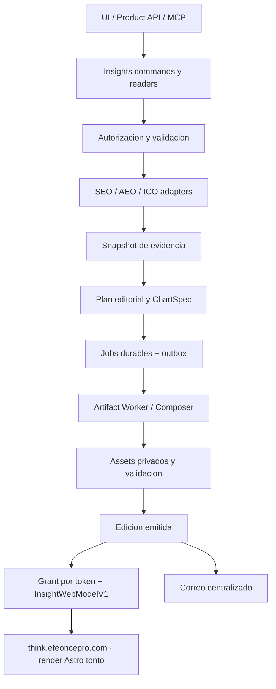

# Efeonce Insights — Architecture V1

> Status: **Foundation implementada y en producción (TASK-1845, 2026-09-15; ver §14)** — generación habilitada en
> staging y producción, emisión e IA apagadas; render en producción (TASK-1846, §14.5); enlaces compartidos, correo
> y recurrencia en producción con flags OFF (TASK-1848, release `bda1cf2cd938`, §14.6); catálogos v1 A4 (`report_pdf`)
> y deck (`insights-deck`) en producción desde el 2026-09-24 (TASK-1847, complete 2026-09-25, §14.7); UI y vista web en
> la vista web compartida en Think está en producción desde el 2026-09-28 (TASK-1875 complete, §14.10) y la UI del portal sigue
> pendiente (TASK-1849); del rediseño premium aprobado el 2026-09-25, el contrato editorial v2 está **en producción y encendido desde el
> 2026-09-26** (TASK-1888 §14.8) y los catálogos premium se registran en TASK-1889 §14.9 (delta de §6); el criterio de
> selección de figuras, la tarjeta de cifra y las páginas PDF de cascada, waffle, dona y barras apiladas están **en
> producción desde el 2026-10-03** (TASK-1974 + TASK-1975, release `36a73e7b7e19`, §14.12 y §15). Los §§1–13 describen el contrato; §14 registra qué existe en código y runtime, el
> rollout verificado, sus límites honestos y las invariantes que un agente debe respetar al tocar el dominio.
> Owner: Platform + Client Experience.
> [ADR](EFEONCE_INSIGHTS_PLATFORM_DECISION_V1.md) · [EPIC-045](../epics/to-do/EPIC-045-efeonce-insights-multiformat-intelligence.md).

## 1. Producto y alcance inicial

**Efeonce Insights** convierte evidencia del cliente en una entrega ejecutiva y operativa que puede leerse,
presentarse, compartirse y recuperarse después. Greenhouse conserva biblioteca, encargo, permisos y operación.

- Tres salidas: `deck_pdf` horizontal 16:9; `report_pdf` A4 vertical; `web` responsive.
- Módulos iniciales: SEO, AEO e ICO/delivery (RpA y OTD); combinables en una misma edición.
- Período explícito, zona horaria, comparación, proyectos, audiencia, idioma y profundidad.
- Branding Efeonce obligatorio; logo del cliente opcional y autorizado, con pack/asset versionado.
- ID estable de reporte, versiones inmutables, revisión editorial, enlaces y entrega por correo.
- API, UI y MCP equivalentes; generación asíncrona y programación recurrente gobernada.
- Dos recorridos autenticados de primera clase: autogestión del cliente y gestión de colaboradores
  internos autorizados; el acceso compartido por token es un tercer recorrido limitado a una edición.
- Quedan fuera PPTX/DOCX editables, diseñador libre de slides, métricas nuevas, refresh facturable implícito,
  BI ad hoc, distribución masiva, cambios de fórmula, extracción de repositorio y migración general del Grader.

Efeonce Insights es la biblioteca de entregas; no sustituye el historial de insights de Nexa ni su
`NexaInsightsBlock`. Los hallazgos de Nexa pueden aportar evidencia autorizada mediante un adapter futuro.

## 2. Evidencia actual y reutilización

Inspección local del 2026-09-08; disponibilidad productiva se verifica al ejecutar cada task.

| Pieza existente | Qué se reutiliza | Brecha / dueño |
|---|---|---|
| `src/lib/artifact-composer/` | Selector, slots, validadores, manifest y brand packs | Nuevos catálogos analíticos; TASK-1847 |
| `src/lib/commercial/tenders/proposals/render-jobs.ts` + `services/artifact-worker/main.ts` | Enqueue/outbox, dispatcher, verificación de manifest y assets | Hoy atados a Proposal; adapter Insights sin romper Proposal; TASK-1846 |
| `src/lib/growth/ai-visibility/report/{command,snapshot,short-link}.ts` | Readers, snapshot público, patrón de enlace revocable | Un enlace activo por reporte no satisface múltiples grants; TASK-1848 |
| `src/components/growth/{seo,ai-visibility}/report-artifact/` | Modelos y proyecciones de audiencia existentes | Adaptación semántica, nunca scores vacíos inventados para encajar; TASK-1845 |
| `src/lib/ico-engine/read-metrics.ts` | Métricas canónicas de espacios | Evidencia de ventana y granularidad; TASK-1845 |
| `src/lib/email/delivery.ts`, `types.ts`, `context-resolver.ts` | Entrega, clasificación, dedupe/contexto | Nuevo caso Insights; TASK-1848. Presentación visual del correo: TASK-1849 |
| `src/mcp/greenhouse/tool-manifest.ts` | Inventario federable | Entradas por capability en sus tasks backend, no otra API de reportes |

`TASK-1672` conserva el artefacto especializado de auditoría técnica SEO y `TASK-1673` su entrypoint de
sharing/envío. Adoptan Insights como consumidoras; no duplican motor, snapshot, tokens ni sender. Su gate
de hallazgos de sitio y restricciones de audiencia permanece. `TASK-1644` conserva VisualProfile; co-branding
de Insights usa el brand pack actual y no introduce un segundo registry de skins. EPIC-018 conserva los
dashboards de desempeño; Insights sólo produce entregas congeladas.

## 3. Ownership y topología

Ubicaciones **nuevas propuestas**, no existentes: `src/lib/insights/`, `src/views/greenhouse/insights/`,
`src/components/insights/`, `src/lib/copy/insights.ts`, catálogos `insights-deck` y `insights-report` dentro
del Composer. No crear `apps/*`, `packages/*`, repo, servicio ni pool antes de una decisión independiente.

```mermaid
flowchart TD
  Clients[UI / Product API / MCP] --> Commands[Insights commands y readers]
  Commands --> Policy[Autorizacion y validacion]
  Policy --> Adapters[SEO / AEO / ICO adapters]
  Adapters --> Evidence[Snapshot de evidencia]
  Evidence --> Plan[Plan editorial y ChartSpec]
  Plan --> Outbox[Jobs durables + outbox]
  Outbox --> Worker[Artifact Worker / Composer]
  Worker --> Outputs[Assets privados y validacion]
  Outputs --> Edition[Edicion emitida]
  Edition --> Share[Grant por token + InsightWebModelV1]
  Share --> Think[think.efeoncepro.com · render Astro tonto]
  Edition --> Delivery[Correo centralizado]
```

Los módulos gobiernan hechos y permisos; Insights gobierna edición y distribución; Composer gobierna
composición; Platform gobierna job/asset; Email gobierna transporte; **Think (`efeonce-think`) gobierna sólo la
presentación de la vista web compartida** (delta ADR 2026-09-15). API/MCP/UI no consultan fuentes por su cuenta.

## 4. Modelo de dominio

Nombres lógicos propuestos; TASK-1845 materializa schema/DDL con helpers canónicos y migraciones additive.

| Entidad | Identidad y autoridad | Invariantes |
|---|---|---|
| InsightReport | ID opaco + código legible único, p.ej. `EO-INS-2026-000123`; organización y propósito | Código no es secreto; unicidad atómica, sin `MAX+1`; org inmutable |
| InsightEdition | reportId + versión + encargo + audience | Sólo edición emitida es compartible; editar/corregir crea versión, no muta la emitida |
| EvidenceSnapshot | Hechos mínimos, fuentes y hashes de evidencia | Inmutable al sellar; sólo datos autorizados; sin PII operativa innecesaria |
| EditorialPlan | Secciones, claims, ChartSpec, acciones, referencias | Congela datos y texto final; versiona modelo/prompt si hubo IA, sin chain-of-thought |
| RenderRun / Output | edición + target + manifestHash + assetId | Estado y error por salida; retries sin duplicar archivos finales |
| ShareGrant | `insight_share_grants` (`ishr-…`): edición + `token_digest` sha256 + `expires_at` + `download_outputs` | Muchos por edición (cupo 20 activos), revocación individual; audiencia `client`; expiración obligatoria ≤ 90 días; inmutable salvo revocación única; no autoriza biblioteca ni queries libres |
| DeliveryIntent | `insight_delivery_intents` (`idlv-…`) + `insight_delivery_recipients` (`idlr-…`): edición + `edition_issued_hash` + modalidad + outputs + autorización | Contenido autorizado inmutable; cada destinatario tiene estado; idempotencia (org, key) + hash; transporte en `email_deliveries`, no segundo transporte |
| InsightSchedule | `insight_schedules` (`isch-…`) + `insight_schedule_occurrences` (`isco-…`): plantilla relativa + zona + cadencia + autoridad | Nace `draft`; ocurrencia única por (schedule, versión, período); V1 sólo genera borrador + render (`review_policy = 'draft_for_review'`) |

Materializar relaciones dentro del dominio con integridad de organización en todas las referencias. Ownership
de nuevos stores: TASK-1845 núcleo; TASK-1846 renders/outputs; TASK-1848 grants/delivery/schedules. Los catálogos
globales tienen ownership explícito de plataforma; logos del cliente quedan ligados a su org y versión.

### Ciclos de vida independientes

- Edición: `draft → collecting → composing → validating → ready_for_review → issued`; `failed` recuperable
  por fase y `withdrawn` para retirada de acceso. Emitir exige los outputs solicitados validados.
- Render por target: `queued → running → succeeded | failed | cancelled`. Lease vencido permite recuperación
  con fencing; un worker antiguo no puede finalizar encima del nuevo.
- Share: `active → revoked | expired`; un trigger impide reactivar, borrar o mutar el grant salvo la revocación
  única. Retirar la edición revoca todos sus grants vivos (`edition_withdrawn`) en la misma transacción.
- Delivery intent: `pending → dispatching → completed | partially_failed | failed`, o `cancelled`. Destinatario:
  `pending → claimed → accepted | failed | ambiguous`, además de `skipped` (con `skip_reason`) y `cancelled`.
  `ambiguous` no se reintenta: se reconcilia contra el ledger. El estado de transporte (`transportStatus`:
  `accepted`, `delivered`, `bounced`, `complained`, `suppressed`…) se lee de `email_deliveries`; aceptación
  HTTP no es entrega y nunca se afirma "leído".
- Schedule: `draft → active → paused | retired`; un retirado no se reactiva. Pausa con motivo `manual`,
  `authority_revoked`, `module_unavailable` o `repeated_failures`. Ocurrencia: `pending → generating →
  generated → render_requested`, o `failed | skipped`. V1 sólo admite la política `draft_for_review`: la
  ocurrencia deja la edición `ready_for_review`; autoemisión y autoenvío no existen.

UI muestra progreso por fase; no inventa porcentajes. Un PDF listo y otro fallido se muestran separados,
sin emitir una entrega completa ficticia. El usuario puede solicitar una nueva edición con otro output set.

## 5. Contrato de datos y ventana temporal

`InsightRequestV1` propuesto: `organizationId`, `projectIds`, `modules[]`, `period{start,endExclusive,timeZone}`,
`comparison`, `audience`, `locale`, `depth`, `outputs[]`, `brand{efeoncePackVersion,clientBrandRef?}` y
`idempotencyKey`. El actor proviene de la autoridad autenticada; nunca del payload.

Ventanas `[start,end)` se resuelven en zona IANA y se almacenan también en UTC. La UI puede mostrar fechas
inclusivas. Comparación anterior conserva regla de calendario explícita: mes anterior, año anterior o rango
custom; nunca asume que un mes tiene 30 días. Período abierto se etiqueta parcial. El `asOf` de cada fuente
se conserva; el corte del conjunto no implica que todas las fuentes se hayan actualizado al mismo instante.

Cada `ModuleReportAdapterV1` declara:

- version, módulo, capacidades, dimensiones/filtros permitidos y granularidades/ventanas disponibles;
- reader canónico y política de audiencia; queries parametrizadas y sin SQL elegido por un agente;
- hechos: metricId, valor/null, unidad, numerador/denominador cuando aplica, población, fuente, método/version;
- cobertura, freshness, observación/estimación y `evidenceRef`; razones de ausencia o incomparabilidad;
- secciones sugeridas y pares de hechos comparables; ningún componente visual propio ni llamada directa a provider.

**SEO:** consume series/readers existentes; posiciones, tráfico, visibilidad y ETV mantienen su metodología.
No mezcla fórmulas ETV; auditoría técnica hereda gates de TASK-1672. **AEO:** distingue snapshot puntual de
serie comparable por engine/prompt pack/modelo/metodología; no inventa histórico desde el último score.
`review_required`/`insufficient_data` se respetan. **ICO:** RpA y OTD salen del dueño; se mantienen supresión,
cohorte, denominador, período y regla de entrega. Nunca promedia promedios ni porcentajes sin pesos válidos.

Si un reader no sirve una ventana exacta, el adaptador declara `unsupported_window`; puede ofrecer granularidad
compatible explícita, nunca usar el dato actual como histórico. Datos incompletos de un módulo requerido
bloquean la emisión por defecto. Una política explícita `allow_partial` puede emitir omisiones visibles,
pero nunca salta los gates de seguridad, validez del instrumento o auditoría técnica.

## 6. Plan editorial, gráficos y salidas

El plan contiene resumen ejecutivo, capítulos de módulos, hallazgos con evidencia, acciones con owner sólo
si existe, límites y metodología. Cada cifra en texto/gráfico/tabla referencia el mismo hecho; una validación
rechaza discrepancias. La IA recibe exclusivamente evidencia allowlisted, con límites de tokens, costo,
timeout y máximo de reparaciones; sin herramientas de escritura/envío. Fallback determinista produce una
lectura factual cuando no hay modelo, sin inventar explicación. Aprobación ligada al hash final de edición.

`ChartSpecV1` propuesto define relación, series, dimensiones, unidades, escalas, base, etiquetas, referencias
y equivalente tabular. Familias iniciales obligatorias: barras simples/agrupadas/apiladas, líneas, circular/donut
y dispersión. Histogramas, box plots y heatmaps quedan como extensión compatible, no condicionan el primer cierre.
Barras con origen cero; pie/donut sólo partes no superpuestas de un mismo total; dispersión requiere observaciones
pareadas; no causalidad automática; gaps reales no se interpolan silenciosamente; sin 3D ni doble eje engañoso.

- **Deck:** 16:9, relato ejecutivo, una conclusión principal por lámina, gráficos/etiquetas legibles,
  portada con ID/período/versión y contraportada institucional. Pie según norma de decks.
- **Informe vertical:** A4, retícula editorial propia, portada/resumen/índice real para documentos largos,
  capítulos, tablas repetidas y anexos; control de viudas, cortes y continuaciones. URL bubble/contacto/folios
  según norma de informes. Índice, enlaces y texto seleccionable se verifican en el PDF final.
- **Web:** navegación por capítulos, tablas equivalentes, tooltips/selección accesibles, responsive y downloads.
  Sólo filtra el dataset congelado incluido; cambiar período o consultar otro módulo requiere nueva edición
  y autoridad. No replica el PDF como imagen ni convierte el snapshot en un dashboard vivo. **La vista
  compartida por token se renderiza en `think.efeoncepro.com` (Astro) desde `InsightWebModelV1`; la
  biblioteca autenticada del portal usa los mismos DTOs en Greenhouse** (§8, delta ADR 2026-09-15).

Composer resuelve intención `contentType` a plantilla; autoría no elige CSS ni geometría. La paginación vertical
se resuelve mediante un plan de páginas determinista del catálogo; si un límite genuino exige extender el motor,
TASK-1846 incorpora únicamente la primitive domain-free, y TASK-1847 conserva layout y resolvers. No hay fork.
Versionar y fijar brand pack, fuentes, catálogo, plan y renderer. Fidelidad semántica/visual es obligatoria;
igualdad de bytes PDF sólo si el renderer normaliza metadatos y el benchmark la demuestra.

### Delta 2026-09-25 — rediseño premium aprobado (contrato en producción, §14.8; catálogos, §14.9)

> **Estado (2026-09-26).** El contrato editorial v2 (TASK-1888) está **en producción y encendido**:
> `INSIGHTS_EDITORIAL_V2_ENABLED` ON en Vercel staging/Production y en el `ops-worker` (estado en §14.8). Las plantillas las
> construye TASK-1889 (`ui-ux`); producción sirve lo que ya está desplegado (§14.7) hasta ese release.
> Dirección visual y copia durable del canvas:
> [`TASK-1889-efeonce-insights-premium-catalogs-direction.md`](../ui/visual-directions/TASK-1889-efeonce-insights-premium-catalogs-direction.md).

- **Aprobación.** El operador aprobó el 2026-09-25, página por página, el canvas «Gráficos de Efeonce Insights»
  (Artifact privado <https://claude.ai/artifact/M2GiA4NdBfgGkiAvwPjZYb>) como el aspecto de todo informe: portadas,
  contraportada con redes/contacto/datos legales, aperturas de capítulo, prosa (resumen, lectura, plan), páginas de
  gráfico premium (cifra principal, conclusión, gráfico, procedencia y panel «Lo que significa / Próximo paso») y logos
  de canal (Google, ChatGPT, Gemini, Claude, Perplexity). Los datos del canvas son de ejemplo y no autorizan familias.
- **Una portada con variantes por módulo, nunca una por servicio.** Navy, o blanca (bloque navy arriba y título sobre
  papel) con variante de visibilidad (`seo`/`aeo`: logos de canal como satélites en la órbita) y variante creativa
  (`ico`: sin logos). La variante blanca la elige el catálogo desde los módulos y `channelId`, sin campo nuevo.
- **Regla de resolución de portada (TASK-1888, en producción).** `resolveInsightCover` (`contracts/cover.ts`): cambio en
  el encargo (`brand.coverTheme`, si ≠ `auto`) > preferencia de la organización (`insight_cover_preferences`, si ≠
  `auto`) > `auto`; `auto` = navy sólo si la organización tiene logo apto para fondo oscuro
  (`organizations.logo_on_dark_asset_id`), si no blanca. Una portada navy **nunca** lleva el logo por defecto: la
  variante oscura o ningún logo. Se resuelve una vez al componer y se **sella** en `plan.cover`: re-renderizar da la
  misma portada; el render nunca la decide con datos vivos. Un encargo sin `coverTheme` conserva el mismo hash.
- **Roles de color de datos.** Actual = navy `#023c70` en papel / teal `#36c8bf` en navy; anterior o referencia = teal
  profundo `#1f9e94` / periwinkle `#8aa8d8`; oportunidad = coral `#d97757` / `#ff7063`; ausencia = rayado, nunca un
  color. Navy manda en tipografía y estructura. Teal y coral tienen la misma luminosidad: nunca son lo único que separa
  dos series. En plantillas estos valores entran como tokens del brand pack (mapeo en la dirección visual), nunca como
  HEX literal.
- **Contrato de fidelidad (TASK-1889).** 41 páginas de referencia a tamaño nativo en
  `docs/ui/visual-directions/TASK-1889-efeonce-insights-premium-catalogs/paginas/` y las fuentes del canvas
  empaquetadas (`fuente-canvas-2026-09-25.tar.gz`, con `render-referencia.mjs`, que reproduce 40/41 páginas byte a
  byte). Cada plantilla renderizada con los datos de ejemplo del canvas debe quedar a **≤ 1 % de píxeles distintos**
  (`pixelmatch`, umbral 0,1) y la aprueba el operador página por página. Portada, apertura y contraportada del **deck**
  no están en el canvas: se derivan de A4 con aprobación del operador.
- **Contrato editorial v2 (TASK-1888), aditivo y en producción.** `ChartSpec` de 7 a 15 familias (las 8 nuevas describen
  sus datos en `data`, tipo discriminado; todo número es un `factId`), con validación estructural en
  `contracts/chart-spec.ts` y de VALOR en `editorial/chart-values.ts`, que llama a la misma `chart-geometry.ts` que
  dibuja. Plan con campos opcionales: `chapter.opening`, `chapter.readings[]` (cifra principal, «Lo que significa»,
  «Próximo paso»), `essentials` (≤ 5), `scopeLines`, `decision`/`measurement`/`ask` (sin productor determinista:
  inventarlos sería redactar sin evidencia), acciones con `impact`/`effort`/`weeks` y `cover`. Todos pasan la misma
  regla de cifras. `channelId` en los hechos de canal; FTR y metas ICO como hechos `role: 'reference'`. `planVersion`
  y `specVersion` no cambian: un plan o spec v1 sellado valida y compone igual.
- **Matriz familia × evidencia (`family_evidence_matrix_v1`, `editorial/family-evidence-matrix.ts`).** Es la autoridad
  de qué puede emitir un productor; `assertChartsAllowed` lanza si el planner emite otra cosa. Verificada contra los
  adapters el 2026-09-25:

  | Familia | Pregunta | Veredicto | Evidencia hoy |
  |---|---|---|---|
  | `bar` / `bar_grouped` | comparar / contra el período anterior | productor ahora | hechos por unidad de cada módulo |
  | `line` | tendencia | productor ahora (seo, ico) | ≥ 3 meses en la ventana: ICO por space y mes; SEO sólo ETV mensual (Search Console entrega totales, sin serie diaria) |
  | `bullet` | resultado contra la meta | productor ahora (ico) | OTD%, FTR% y RpA por space contra el umbral `optimal` de `ICO_METRIC_REGISTRY`; banda «cerca de la meta» (`bandFactId`) = borde de la zona `attention` del mismo registro (OTD 70, FTR 60, RpA 2,5), nunca una fracción de la meta en el render |
  | `gauge` | nivel 0–100 | sin evidencia | el adapter AEO lee sólo el último run del grader: la ventana anterior nunca tiene puntaje propio |
  | `pie` / `donut` | parte de un total | sin evidencia | ningún hecho trae sus partes medidas (derivar «el resto» sería calcular) |
  | `bar_stacked` | composición en el tiempo | sin evidencia | ningún adapter entrega partes por período |
  | `scatter` | relación entre dos métricas | sin evidencia | sin observaciones pareadas |
  | `waterfall`, `funnel`, `heatmap`, `waffle`, `venn_two`, `upset` | descomposición, conversión, matriz, conjuntos | sin evidencia | requieren desgloses, CRM o conjuntos por consulta que ningún adapter expone |

  Cambiar un veredicto exige evidencia nueva en el adapter dueño + productor + test + subir la versión de la matriz.
- **Variación en puntos porcentuales (corregida).** Una métrica que ya es porcentaje varía en pp («+1,8 pp» para OTD
  81,9 % vs 80,1 %, caso Sky); bajo 0,05 pp se imprimen dos decimales para no escribir «0,0 pp» entre dos cifras
  distintas (caso Berel, CTR). Aplica con y sin el flag: es una corrección. Los planes sellados con la variación
  relativa siguen validando.
- **Primeras ediciones con el diseño nuevo:** Berel (`seo`/`aeo`) y Sky (`ico`), como informe **interno**, sin
  compartir con el cliente hasta la revisión del operador.

### 6.1 Anatomía del informe live (Think, vigente desde 2026-09-28)

Render de `InsightWebModelV1` en `efeonce-think` (TASK-1875; estado en §14.10; producción en `main` `544ecd4`). Código:
`src/components/insights/` (`InsightReport.astro`, `ModuleScene.astro`, `ChartFigure.astro`, `FactMark.astro`),
`src/lib/insights-{view,copy,tokens,chart-geometry,fixtures,accept}.ts`, `src/scripts/insights-report.ts`,
`src/styles/insights.css`. `InsightReport.astro` es **el único render** de las dos rutas:
`src/pages/insights/r/[token].astro` (SSR por request, `private, no-store`, `noindex, nofollow`, `no-referrer`; `?logo=1`
y `?descargar=` en la misma URL) y `src/pages/insights/muestra.astro` (fixtures, prerender, `noindex`, fuera del
sitemap). Contratos de UI: `docs/ui/wireframes/TASK-1875-*.md`, `docs/ui/flows/TASK-1875-*-flow.md`,
`docs/ui/motion/TASK-1875-*-motion.md`; dossier `docs/ui/reviews/TASK-1875-efeonce-insights-shared-web-render-think/`.
Referencia visual en el Lab de AXIS: [axis.efeonce.org/references/insights/](https://axis.efeonce.org/references/insights/) (publicada el 2026-09-28, AXIS main `3dfbf0e`; datos para agentes en `/references/insights.json`). Ejemplo vivo del producto, con datos de ejemplo: la muestra
`https://think.efeoncepro.com/insights/muestra`.

> **Hoy producción entrega el modelo web 1.0:** un enlace real muestra los hallazgos del resumen ejecutivo, los
> capítulos con sus gráficos y el plan, pero sin la decisión (bloque y lámina), sin la apertura ni la lectura paso a
> paso de cada capítulo, sin «Qué mide este informe», sin «Cómo lo mediremos / Qué necesitamos», sin logo del cliente
> y sin tasas del embudo. Eso llega con el modelo 1.1 (en staging) en el próximo release de Greenhouse; la muestra ya
> lo enseña.

**Secciones, en orden (`InsightReport.astro`):**

| # | Sección | Qué hace |
|---|---|---|
| 1 | Hero oscuro | Órbita animada; lockup Efeonce \| Insights; chips de estado («Enlace vigente» + «vence el …», o «Muestra con datos de ejemplo»); kicker (título · período); titular = `executiveSummary[0]` (o `reportTitle`) partido por `splitLead`: cabeza peso 740, resto 340 en `ink-soft`; las demás afirmaciones como bajada; logo del cliente sobre placa blanca si `variant = default` (1.1, nunca en la muestra); meta (organización, edición, datos al); cue a `#hallazgos`. ≤ 720 px se ocultan el chip «vence» y el cue |
| 2 | Aviso de período parcial | Sólo si `header.asOfMax` es anterior al cierre del período |
| 3 | Topbar fija | Filtros Todo / SEO / Respuestas de IA / Entrega creativa (View Transitions; si el lector está más abajo, vuelve a `#hallazgos`); «Plan» sólo con acciones; «Presentar»; copiar enlace; «Descargar» la primera salida disponible; la órbita reaparece chica y marca el avance por secciones `[data-section]`. ≤ 720 px las acciones se ocultan |
| 4 | `#hallazgos` «Lo esencial del mes» | Tiles (el primero a todo el ancho, cifra en acento) que se expanden en su lugar: conclusión, gráfico oscuro compacto, «Lo que significa» / «Próximo paso», hechos, Fuente, Datos al; «Copiar enlace a este hallazgo» y «Cerrar»; enlace directo `#h-<claimId>`; uno a la vez, Escape cierra. Cifra ausente = «Sin dato», nunca cero; `FactMark` Medido = anillo sólido, Estimado = punteado. Con 1.0 los tiles son las afirmaciones del resumen que citan hechos; con 1.1, `essentials` |
| 5 | Decisión (sólo 1.1) | Etiqueta «Para decidir en la reunión»; `splitLead` pone la petición grande (Bricolage 680) y la lectura debajo (Poppins 400); enlace «Plan de acción →» |
| 6 | Un `ModuleScene` por capítulo (`#cap-01`, `#cap-02`…) | Apertura del capítulo (1.1); figura principal = la primera con lectura, fija, avanza por pasos (cifra, conclusión, significado, próximo paso) observados con `rootMargin` −40 % / −45 %; el resto como beats alternados con la etiqueta de su familia; afirmaciones, hechos sueltos y límites debajo |
| 7 | `#plan` | Contador; «Cómo lo mediremos» y «Qué necesitamos de ustedes» (1.1); acciones con chip de módulo |
| 8 | `#metodologia` | `
` cerrado «Cómo se midió», bajada «Fuentes, cortes y límites de cada cifra.»; dentro: «Qué mide este informe» (`scopeLines`, sólo 1.1), metodología, «Límites de la edición», «Referencias» |
| 9 | `#conversemos` **o** `#descargas` | Alternativas: `#conversemos` sólo en la muestra; `#descargas` sólo en el enlace compartido (outputs del grant, sin `web`; «No disponible en esta edición» si falta) |
| 10 | Footer | Firma Efeonce, eslogan, contacto, aviso del enlace o de la muestra, línea legal |
| 11 | Dock, modo presentación y toast | Dock sólo ≤ 720 px («Copiar enlace» + «Descargar» si hay descarga); diálogo de presentación; toast «Enlace copiado» (2200 ms) |

**`splitLead`** (`insights-view.ts`): parte en los dos puntos si caen entre los caracteres 12 y 80 y quedan más de 20
después; si no, en la primera oración de 12 a 110 caracteres; si no, todo es cabeza. El texto queda íntegro (`joiner`).

**Modo presentación.** Láminas: portada (lockup negativo, kicker, titular en dos pesos, «Preparado para»), una por
hallazgo, decisión (sólo 1.1), plan (primeras 5 acciones), cierre (logo Efeonce + eslogan). Teclas: flechas, Espacio,
Re Pág / Av Pág, Inicio / Fin, Esc; clic en el escenario avanza; foco atrapado y devuelto al salir. Pantalla completa
sólo ≥ 900 px y sin movimiento reducido; salir de pantalla completa cierra. Contador «n de t», progreso, pista oculta
≤ 720 px. No es alcanzable en móvil (el botón vive en las acciones de la topbar, ocultas ≤ 720 px).

**Estados** (`StatusScreen`, códigos en `[token].astro`, siempre en es-CL): `not_found` 404 (desconocido, vencido, mal
copiado o flag `INSIGHTS_SHARING_ENABLED` OFF, indistinguibles), `gone` 410 (revocado o retirado), `rate_limited` 429,
`error` 502. **Causas de 502:** fallo del fetch; cualquier no-2xx distinto de 404/410/429 (p. ej. 403 del WAF, 500/503);
JSON inválido; major distinto de 1.x; payload sin `model` o `header` (`acceptSharedEdition` en
`src/lib/insights-accept.ts`, la misma puerta para fixtures). Ninguno revela el nombre del cliente. El flag de sharing
gobierna sólo la ruta con token: la muestra nunca llama a Greenhouse.

**Descargas y logo.** `?descargar=` acepta sólo `report_pdf` y `deck_pdf`; sin archivo, 303 de vuelta al informe.
`?logo=1` responde 404 si no hay logo. `x-vercel-protection-bypass` se envía sólo contra staging.

**Gráficos.** `ChartFigure.astro` + `insights-chart-geometry.ts` dibujan las 15 familias de `ChartSpecV1`; el PDF sólo
cuatro (§6.2). Toda cifra impresa sale del `display` del modelo; la geometría sólo produce posiciones y tamaños.
Interruptor «Gráfico» / «Tabla» sólo con JS; grupos de barras como botones con tooltip y `aria-label`; nota «Barras con
origen en cero.»; familia desconocida → «Esta figura se lee en su tabla equivalente.»; embudo «pasa el X» sólo con
`funnelStepRates` (1.1). Color: Think copia 4 roles (actual `#023c70`, anterior `#1f9e94`, actual sobre navy
`#36c8bf`, anterior sobre navy `#8aa8d8`); la 3.ª serie en adelante es `color-mix(actual 45 %)` y la ausencia, trama.

**Motion** (`src/scripts/insights-report.ts`; tiempos en `insights-tokens.ts`): órbita de portada ≈ 2,1 s (anillo
350 ms, recorrido 1100 ms tras 200 ms, halo 800 ms, curva `easeStandard`, todo desde `motion.orbitMs` desde Think
`544ecd4`); anillo «en vivo» 2400 ms en bucle desde los 1600 ms. Entrada del hero 900 ms (retardos 120/220/360/460 ms);
revelados `data-reveal` 32 px / 900 ms y `data-stagger` 24 px / 700 ms con pasos de 70 ms hasta el 6.º hijo
(IntersectionObserver `threshold` 0,12, margen inferior −10 %); conteo 1100 ms (easeOutQuart) que termina exactamente
en `display`; hallazgo que se despliega 520 ms con View Transitions si existe; gráficos 800–1400 ms. Mejora
progresiva: sin JS la página queda completa; si el módulo no monta en 3 s, el failsafe retira **`ins-motion` e
`ins-js`**; `prefers-reduced-motion` conserva la interacción sin animación.

**Responsive, idioma, fuentes e impresión.** Breakpoints 1000 px y 720 px. Idioma sólo del chrome: es-CL por defecto,
en-US cuando `model.locale` empieza por `en`; la muestra siempre es-CL; `og:locale` `es_CL`. Fuentes: Bricolage
Grotesque Variable (opsz) + Poppins 400/500/600/800/800i/900i (7 archivos, 123 KB); `BaseLayout` carga además Geist.
**La impresión es sólo un respaldo; el camino real para papel es el PDF descargable.** `@page` A4 14 mm; oculta
topbar, dock, toast, cue, órbita, interruptor y presentación; repinta las secciones oscuras en blanco con texto navy;
muestra las tablas; fuerza abierto «Cómo se midió»; usa los logos positivos (`.ins-print-only`); la evidencia de los
hallazgos cerrados no se imprime.

**OG y SEO.** `og-insights.png` 1200 × 630 sin datos (`scripts/build-insights-og.mjs`). Canonical `/insights` para la
ruta con token y `/insights/muestra` para la muestra. La ruta con token no carga GTM y lleva `meta referrer
no-referrer`; la muestra sí carga GTM a propósito (no hay token). El sitemap excluye `/insights/*`.

**Muestra.** Organización «Marca de ejemplo», chip «Muestra con datos de ejemplo», aviso en el pie, CTA «Conversemos» →
`mailto:sales@efeoncepro.com?subject=Efeonce Insights`, título «Muestra · Efeonce Insights»; conserva un código
ficticio `EO-INS-000123 · versión 2`.

**Verificación en Think.** `pnpm test:insights` (16 pruebas), `pnpm verify:insights` (incluye el fixture de versión 2 ⇒
502 y la presencia/ausencia de «Qué mide este informe» con 1.1/1.0), `pnpm audit:insights-a11y` (AA y foco a 1440 y
390); `scripts/capture-insights-report.mjs` regenera el dossier de 34 PNG (fuera de `package.json`). Claves de copy sin
uso: `methodologyHeading`, `essentialsTitle`, `backToTop`.

### 6.2 Catálogo de plantillas A4 y deck (vigente desde 2026-09-26)

| `report_pdf` — `insights-report`, A4 794×1123 | Propósito | `deck_pdf` — `insights-deck`, 16:9 1280×720 |
|---|---|---|
| `ReportCoverPage` | Portada navy | `InsightsCoverSlide` (el deck siempre es navy) |
| `ReportCoverLightPage` | Portada blanca con `scopeLines` y logos de canal (visibilidad) o sin ellos (creativa) | — |
| `ReportIndexPage` | Índice con folio real | — |
| `ReportSummaryPage` | Tesis, «Lo esencial» (≤ 5) y decisión | `InsightsSummarySlide` |
| `ReportChapterPage` | Apertura navy: numeral, canales medidos, contenidos | `InsightsChapterSlide` |
| `ReportNarrativePage` | Afirmación, párrafos, pullQuote y evidencia | `InsightsNarrativeSlide` |
| `ReportReadingPage` | Lectura por figura | `InsightsReadingSlide` |
| `ReportTablePage` | Tabla como tablero de barras, con continuación | — |
| `ReportPlanPage` | Plan de acción | `InsightsPlanSlide` |
| `ReportLimitsPage` | «Lo que esta edición no puede afirmar» | `InsightsLimitsSlide` |
| `ReportBackCoverPage` | Contraportada: contacto, mercados, burbuja URL, redes | `InsightsBackCoverSlide` |
| `ReportFigureComparisonPage` | `bar_grouped` con dimensiones métricas | `InsightsFigureComparisonSlide` |
| `ReportFigureColumnsPage` | `bar`, o `bar_grouped` con canales distintos | `InsightsFigureColumnsSlide` |
| `ReportFigureTargetsPage` | `bullet` | `InsightsFigureTargetsSlide` |
| `ReportFigureTrendPage` | `line` | `InsightsFigureTrendSlide` |

15 plantillas A4 y 12 láminas (`insights-deck-mapper.ts` declara `light: null` para la portada del deck). Las otras 11
familias se rechazan en PDF con causa (`render/figure-slots.ts`); TASK-1902 (to-do) suma medidor y mapa de calor.
Compartidos en `catalogs/insights-shared/` (`figure-svg.ts`, `figure-hooks.ts`, `editorial-resolvers.ts`, `channels.ts`,
`layout-hooks.ts`). Fidelidad: 41 PNG de referencia en
`docs/ui/visual-directions/TASK-1889-efeonce-insights-premium-catalogs/paginas/`, tolerancia ≤ 1 % (§14.9).

### 6.3 Marca de producto Insights: dónde se aplica y dónde falta

Construcción y reglas en el manual de marca (`docs/operations/brand-graphic-line/EFEONCE_GRAPHIC_LINE_V1.md` §7.1);
archivos oficiales en `@efeoncepro/axis-brand-assets` 0.4.0 (`insights-logo-*`, `insights-isotype-*`,
`insights-lockup-*`), generados por `scripts/brand/build-insights-logo.mjs`. Efeonce firma siempre; Insights acompaña.

| Superficie | Estado | Dónde |
|---|---|---|
| Informe live (Think) | **Aplicada**: lockup negativo en pantalla, positivo en impresión, también en el modo presentación | `InsightReport.astro`; copias en `efeonce-think/public/branding/insights/` (5 SVG) |
| Imagen al compartir (OG) de Think | **Aplicada** | `public/branding/insights/og-insights.png`, usada en `[token].astro` y `muestra.astro` |
| Portadas y aperturas de capítulo PDF A4 y deck | **Tipográfica, no el archivo oficial**: logo Efeonce + filete + «INSIGHTS» en mayúsculas espaciadas (`text-transform: uppercase`, `letter-spacing: 0.34em`; no son versalitas reales) — clase `.brand-product` en A4 `report-cover*.html`, mini-lockup del pie de `report-chapter.html`; `.product` en deck `insights-cover.html` e `insights-chapter.html` (portada y pie) —, como aprobó el canvas de TASK-1889 | `report-cover.html`, `report-cover-light.html`, `report-chapter.html`, `insights-cover.html`, `insights-chapter.html`; los catálogos sólo traen `assets/brand/logo-*.svg` de Efeonce |
| Correo de entrega | Falta: `EmailLayout` con `brand='efeonce'` | `src/emails/InsightsEditionDeliveryEmail.tsx` |
| Favicon de Think | Falta: favicon genérico del hub | `efeonce-think/src/layouts/BaseLayout.astro` |
| Receta de deck «resultados en vivo» | Usa el isotipo de Efeonce para la ficha de Insights | `deck-recipes/EFEONCE_DECK_SLIDE_RECIPES_V1.json` |
| Portal (S1–S5) y MCP | Sin marca de producto | TASK-1849 (diseño); MCP sin superficie visual |
| Dependencia en Greenhouse | Fija `@efeoncepro/axis-brand-assets` 0.3.5: no trae los assets de Insights | `package.json:419` |

**Pendiente de decisión (gaps, sin regla aprobada):** si el lockup oficial (aprobado el 2026-09-28 en el canvas
«Insights en vivo») reemplaza la composición tipográfica de las portadas PDF/deck; marca en correo, favicon, portal y
receta del deck; tamaño mínimo del lockup (el ledger de la línea sugiere 18 px sólo para el logo). Hasta decidir, cada
superficie sigue como está.

**Decisión abierta — acento de «INSIGHTS» en las portadas navy del PDF.** En la portada A4 (`report-editorial.css:51`)
y en la del deck (`insights-deck/insights-cover.html:40`) la palabra va en el acento (`navyAccent` = teal-500, 12 px),
con proporciones propias (logo Efeonce 32 px, aire 16, filete 1 × 24 al 26 %). Choca con la regla del 2026-09-28
(junto a Efeonce, Insights baja su brillo; sólo la esfera conserva el acento) y con «el acento nunca en texto
< 24 px». Pendiente de decisión del operador; cambiarlo toca el contrato de fidelidad de TASK-1889.

### 6.4 AXIS como casa del sistema de diseño de Insights

**Decisión del operador (2026-10-03):** AXIS es la casa del sistema de diseño de Insights; se retiró la regla de que
AXIS no publicaba UI ni contratos de Insights. Lo primero en llegar (AXIS local, sin push ni tag; §14.12): los tokens
`efeonceInsights` en `@efeoncepro/axis-tokens` 0.3.42, el contrato `efeonce.insights-stat-card` 0.1.0 `candidate` en
`@efeoncepro/axis-ui-contracts` 0.3.42 y la tarjeta con sus roles en el Lab `/references/insights/`. Greenhouse
(catálogos PDF y deck) y Think (web) son sus dos consumidores. Lo que sigue con copias a mano:

- **Roles de color de datos:** `src/lib/artifact-composer/brand-packs/axis/editorial-roles.json` (PDF) copiados en
  `efeonce-think/src/lib/insights-tokens.ts` («valores copiados 1:1 de AXIS … mientras Think no consuma los paquetes
  privados»). Think copia sólo 4 roles (actual, anterior, y ambos sobre navy); oportunidad, ausencia y realce no
  existen allí. La copia llegó a divergir: el dato «anterior» sobre papel era `#0e8c82` en Think; se resolvió el
  2026-09-28 en Think `b3c5820`, que usa `#1f9e94` (`--axis-deck-role-dataPriorOnPaper` / teal-650), igual que los PDF
  (3,29:1 como relleno sobre blanco: sirve para gráficos, nunca para texto chico).
- **Geometría de las 15 familias:** `src/lib/artifact-composer/chart-geometry.ts` + `catalogs/insights-shared/figure-svg.ts`
  (PDF) frente a `efeonce-think/src/lib/insights-chart-geometry.ts` + `ChartFigure.astro` (web), que declara seguir
  «las mismas convenciones».

Los roles de color ya tienen su fuente en AXIS (`efeonceInsights`), pero Think todavía los **copia** de ese token porque
no consume los paquetes privados, y el brand pack de los catálogos sigue en `editorial-roles.json`. La geometría
compartida sigue duplicada (incluido el waffle por unidad: `waffleUnitGeometry` en `chart-geometry.ts` y su par en
`insights-chart-geometry.ts` de Think). Que los consumidores lean el paquete en vez de copiarlo, y extraer la
geometría, quedan para una task propia; mientras tanto la deriva se evita a mano.

## 7. API, MCP y autorización

Superficie **propuesta**, naming final de rutas/capabilities se registra durante implementación:

| Operación canónica | API / MCP | Dueña |
|---|---|---|
| list/get/catalog/validateRequest/createEdition/revise/issue | Thin adapters App/Ecosystem; listado paginado y estados compactos | TASK-1845 |
| requestOutputs/getRun/retryOutput/cancelRun | Requests asíncronos, sin esperar Chromium. **Registrado 2026-09-16:** `POST/GET …/insights/editions/{editionId}/render`, `GET …/insights/render-runs/{renderRunId}`, `POST …/render-runs/{renderRunId}/retry`, `POST …/render-runs/{renderRunId}/cancel` en los lanes app y ecosystem; tools MCP `request_insight_render`, `get_insight_render_run`, `retry_insight_render`, `cancel_insight_render`. Errores nuevos `render_disabled` (503) y `render_rejected` (422). | TASK-1846 |
| createShare/revokeShare/getShare/withdrawEdition | Writes gobernados; token sólo al emitir enlace autorizado. **Registrado 2026-09-18 (en producción con `INSIGHTS_SHARING_ENABLED` OFF, release `bda1cf2cd938`):** `POST/GET …/insights/editions/{editionId}/shares`, `POST …/insights/shares/{shareId}/revoke` en los lanes app y ecosystem (en ecosystem crear/revocar exige binding interno); tools MCP `create_insight_share`, `list_insight_shares`, `revoke_insight_share` (clase write: create/revoke). Capability `insights.share.manage`. Error `sharing_disabled` (503) | TASK-1848 |
| requestDelivery/getDelivery/createSchedule/pauseSchedule | Autorización exacta por destinatario, modalidad y recurrencia. **Registrado 2026-09-18 (en producción con flags OFF, release `bda1cf2cd938`).** Envío — app: `POST/GET …/editions/{editionId}/deliveries`, `GET …/deliveries/{deliveryId}`, `POST …/deliveries/{deliveryId}/cancel\|retry`, `POST …/delivery-recipients/{recipientId}/reconcile`; ecosystem: sólo los dos `GET`; MCP `list_insight_deliveries`, `get_insight_delivery`. Recurrencia — app: `POST/GET …/insights/schedules`, `GET …/schedules/{scheduleId}`, `POST …/schedules/{scheduleId}/activate\|pause\|retire`; ecosystem: sólo `GET`; MCP `list_insight_schedules`, `get_insight_schedule`. **Envío, cancelación, reintento, reconciliación y escrituras de recurrencia son sólo lane App (persona interna); ecosystem y MCP son de lectura.** La modalidad `portal_link` responde `not_ready` hasta que TASK-1849 construya la ruta de la edición en el portal. Capabilities `insights.delivery.send` e `insights.schedule.manage`. Errores `delivery_disabled` y `schedules_disabled` (503); `quota_exceeded` (429) | TASK-1848 |
| resolveSharedEdition/downloadSharedOutput | Token de lectura limitado, sin OAuth ni discovery de módulos. **Registrado 2026-09-18:** `GET /api/public/insights/shared/[token]` y `GET /api/public/insights/shared/[token]/outputs/[output]` (§8) | TASK-1848 |

API responde `202` con `reportId/editionId/runId` para trabajo asíncrono. Repetir la misma idempotency key y
payload devuelve el mismo recurso; diferente payload con misma key devuelve conflicto. Todas las escrituras
usan command + audit/outbox; todos los readers verifican scope. Errores sanitizados por causa: forbidden,
invalid_window, unsupported_window, insufficient_data, method_mismatch, not_ready, quota_exceeded,
manifest_drift, expired/revoked/not_found y delivery_failed; integración con errores canónicos, no raw errors.

Views, entitlement Insights y grants de módulos son planos distintos. Revalidar actor/org/módulos al crear,
ejecutar, emitir y distribuir. MCP hereda consentimiento efectivo; base-only read no autoriza create, issue
ni send. Nuevas tools se registran en el manifest Greenhouse, se sincronizan en el gateway por su workflow y
se prueban allow/deny/revocación. TASK-1844 completó la base de selección multiorganización interna; su
adapter inicial sólo delega `growth.seo.observation.read`, por lo que **no autoriza capabilities Insights**.
Insights debe incorporar su contrato y policy de target propios al federarse, reutilizando ese reader y
sin reimplementar OAuth. No bloquea el primer flujo uniorganización ni acredita sus writes.

### 7.1 Contrato de audiencias autenticadas — integración EPIC-046

Decisión del operador 2026-09-09. [EPIC-046](../epics/to-do/EPIC-046-client-services-visibility-and-self-service.md)
integra Insights como capacidad del portal cliente y del trabajo del equipo, no sólo como enlace a un PDF.
El actor autenticado y la audiencia del artefacto son dimensiones distintas: un colaborador puede crear
una edición para cliente, pero eso no autoriza incluir su evidencia interna en esa edición.

| Recorrido | Acciones previstas | Frontera obligatoria |
|---|---|---|
| Cliente autenticado | Biblioteca propia, elegir servicio/período/formato, solicitar/generar ediciones de plantillas permitidas, consultar progreso/historial y descargar salidas autorizadas | Organización desde sesión; módulos, proyectos, plantillas, formatos y cupos permitidos; sin selector libre de otras cuentas ni editor de evidencia/fórmulas |
| Colaborador interno autorizado | Gestionar las cuentas a su cargo, preparar/revisar/emitir ediciones, recuperar jobs, compartir, entregar y programar según capability | Ser interno no concede todas las cuentas ni todos los verbos; target y permisos se revalidan en cada command |
| Destinatario de enlace | Leer/descargar la edición emitida permitida | El ShareGrant no abre biblioteca, crea ediciones, envía correo ni actúa como identidad del cliente |

La autogestión no queda reducida a descarga: el cliente puede iniciar generación gobernada con datos ya
disponibles y ver su resultado. `createEdition` no equivale a `issue`: si la policy exige revisión,
queda `ready_for_review` con owner; emitir siempre requiere autoridad explícita. Sólo se habilitan
plantillas y proyecciones cliente seguras. Ningún caller puede pedir `audience=internal` para ampliar acceso.
Un borrador de trabajo interno no aparece al cliente por compartir organización; éste ve sus solicitudes
con estado redactado y las ediciones que la policy autoriza. Reutilizar edición o output exige coincidencia
de audiencia/proyección y autoridad: nunca deduplicar por org/período omitiendo esos ejes.

Descargar, crear/revocar enlace, emitir, enviar desde Efeonce y programar son permisos independientes.
Un cliente puede compartir mediante grant sólo si tiene esa capability explícita y edición elegible;
no adquiere envío corporativo ni programación por generar un informe. Si se habilita una recurrencia
cliente, tiene alcance propio y autorización revalidada por ocurrencia, sin refresh facturable implícito.

TASK-1845 posee catálogo elegible, projection/autoridad, autoría y estados; TASK-1846 revalida la
autoridad en ejecución y no reutiliza outputs de otra audiencia; TASK-1848 posee distribución/recurrencia;
TASK-1849 compone ambos recorridos y shared con componentes comunes y acciones devueltas por el servidor.
El menú cliente usa el primitive module-driven vigente, con un destino Insights canónico y accesos
contextuales desde Inicio/Mis servicios/SEO/Delivery, sin builders o bibliotecas duplicadas por módulo.

Berel combina SEO y marketing de contenidos; Sky usa diseño digital/ICO. Los adapters consumen los
readers de los dominios productores, jamás importan del BFF `client-portal`. Si P02 de EPIC-046 descubre
un campo reusable, lo añade en su dominio dueño y ambos consumers lo usan. AEO sólo se incorpora cuando
el alcance y permisos lo habiliten. Dashboard actual e informe congelado comparten fórmula/fuente, pero
pueden tener distinto corte; mostrar fecha/período explica la diferencia, no forzar igualdad fuera del snapshot.

## 8. Acceso web compartido

Tokens opacos aleatorios de al menos 128 bits de entropía; persistir digest, nunca bearer recuperable.
Mostrar URL secreta sólo al crear; después regenerar significa un grant nuevo. **El bearer nunca se persiste,
ni cifrado** (decisión del operador 2026-09-18): en el envío por correo vive sólo en memoria; un fallo definitivo
revoca el grant y el reintento emite uno nuevo. No se copia en outbox, logs, analytics ni errores. Resolver asset
y auth en servidor.

**Contrato materializado (TASK-1848, code complete 2026-09-18; en producción con flag OFF desde el release `bda1cf2cd938`, §14.6).**

- **Token:** `isg_` + 32 bytes aleatorios base64url (256 bits), `src/lib/efeonce-insights/sharing/token.ts`; se
  guarda sólo el digest sha256 (`token_digest` UNIQUE). URL: `${INSIGHTS_SHARE_PUBLIC_BASE_URL ??
  'https://think.efeoncepro.com'}/insights/r/<token>`, devuelta una única vez al crear.
- **Respuesta:** `InsightSharedEditionResponseV1 {modelVersion, header, model, downloads, expiresAt}`, con
  `InsightWebModelV1` (`contracts/web-model.ts`): resumen, capítulos (claims, `ChartSpecV1` +
  tabla resuelta, tablas, límites), acciones sin `ownerRef`, metodología, referencias sin `evidenceRef` y hechos
  formateados por locale. Nunca `authoringMode`, `modelId`, prompts, historial ni ids de actor.
- **`modelVersion` 1.1, aditiva sobre 1.0 (TASK-1875; en staging, sale a producción con el próximo release de Greenhouse —
  producción sirve 1.0, que Think también acepta):**
  `INSIGHT_WEB_MODEL_VERSION = '1.1'`. Suma, todos opcionales y sólo cuando el plan sellado es editorial v2 (§14.8):
  `chapter.opening`, `chapter.readings[]` (`InsightWebReadingV1 {chartId, keyFigure?, conclusion?, meaning?,
  nextStep}`, a lo más una por figura), `essentials`, `decision`, `measurement`, `ask`, `scopeLines`,
  `chart.derived.funnelStepRates` (`{stageId, display}`, calculadas en `sharing/web-model.ts` con la misma
  `funnelGeometry` de los PDF y `formatFactValue(…, 'percent', locale)`; la primera etapa va con `display: null` y un
  embudo que crece no lleva tasas) y `header.clientLogo {href, variant: 'on_dark'|'default'}`. Un plan v1 se proyecta
  igual que antes (spreads condicionales) y un consumidor 1.0 ignora lo nuevo; Think acepta cualquier `1.x`.
- **Logo del cliente:** `GET /api/public/insights/shared/[token]/logo` sirve el logo sellado en `plan.cover` por
  `downloadPrivateAsset`, con el mismo gate que la vista (`readSharedInsightClientLogo` en `sharing/public.ts`) y las
  mismas cabeceras anti-cache/anti-índice. `header.clientLogo` sólo aparece si la portada sellada trae `logoAssetId` y
  `logoVariant`.
- **Semántica:** `404` = token desconocido, mal formado, expirado, flag OFF, org suspendida o módulo retirado
  (indistinguibles entre sí); `410` = revocado o edición retirada; `429` = rate limit; `503` sanitizado.
- **Rate limit** (`insight_share_rate_buckets`, ventana por minuto sobre sujeto hasheado, UPSERT atómico): por IP
  300 vistas / 60 descargas por minuto; por grant 60 / 20. Si la base no responde, **falla cerrado**.
- **Guard en el borde (TASK-1876, aplicado en staging 2026-09-28; producción en observe hasta el cutover):** delante de todo
  `/api/public/**` —lector y proxy de descarga incluidos— hay un rate limit del Firewall de Vercel de 20 req / 10 s
  por IP: `enforce` en staging/preview (429 desde el borde, sin invocar la función ni abrir conexión PostgreSQL) y
  `observe` (sólo registro) en producción. Reglas versionadas en `src/lib/security/public-burst-guard/firewall-rules.ts`,
  sincronizadas con `pnpm security:public-burst-guard [--apply]`. El rate limit del dominio (arriba; su 429 lleva
  `Retry-After: 60` y deja evento `rate_limited`) sigue detrás sin cambios; el 429 del borde no trae ni lo uno ni lo
  otro. El consumidor server-side de Think (TASK-1875) se exceptúa con una **condición explícita** en esas reglas,
  nunca subiendo el límite para todos: la cabecera `x-efeonce-think-key` igual a la llave de Think no cuenta
  (`buildPublicBurstGuardRule(spec, {thinkKey})` agrega la condición negada; `planPublicBurstGuardChanges` marca drift
  si la regla viva no la tiene). La llave llega al script como `PUBLIC_BURST_GUARD_THINK_KEY` y a Think como
  `GREENHOUSE_THINK_KEY`; nunca se imprime (aplicado el 2026-09-28: reglas releídas sin drift con la condición negada, según el cierre de TASK-1875).
  Complemento: las sesiones PG de Vercel piden `idle_session_timeout=60s`.
- **Cabeceras:** `Cache-Control: private, no-store, max-age=0`, `Pragma: no-cache`, `Referrer-Policy: no-referrer`,
  `X-Content-Type-Options: nosniff`, `X-Frame-Options: DENY`, `X-Robots-Tag: noindex, nofollow, noarchive`, CSP
  `default-src 'none'; frame-ancestors 'none'`.
- **Descarga:** proxy vía `downloadPrivateAsset({actorUserId: null, accessMetadata: {accessChannel:
  'insights_share_grant', shareGrantId}})` (firma ampliada a `string | null`), revalidando el grant justo antes
  de leer bytes.
- **Access log:** `insight_share_access_events`, append-only, sin token ni IP cruda (`subject_hash`, `client_hint`
  `unknown|robot|prefetch`, outcome `served|not_found|revoked|expired|withdrawn|unavailable|rate_limited`).
  Retención 180 días; los rate buckets se purgan pasado 1 día (lo hace el tick de schedules, aun con flag OFF).
- **Observabilidad:** `redact.ts` (patrones `insights_share_path` e `insights_share_token`) y
  `src/lib/observability/sentry-server-event-scrub.ts`, cableado en `sentry.server.config.ts` y
  `sentry.edge.config.ts` (`beforeSend` + `beforeSendTransaction`: URL, query string, transaction, breadcrumbs, spans).
- **Quién comparte:** capability `insights.share.manage`; EFEONCE_ADMIN y EFEONCE_ACCOUNT (tenant),
  CLIENT_EXECUTIVE (own). CLIENT_MANAGER no comparte. TTL 1–90 días (default 30).

**Deliberadamente distinto del Grader:** el enlace del Grader guarda el token en claro y se sirve con
`public, max-age=300` sin cabeceras anti-índice; no es modelo. El modelo es el token del talent pool (sólo digest)
más las cabeceras de `hiring/assessment/public-session/http.ts`.

**Dónde se renderiza (delta ADR 2026-09-15):** la vista compartida vive en el hub público `efeonce-think`
(`think.efeoncepro.com`; ruta `/insights/r/<token>`, hermana de `/brand-visibility/r/<token>` del Grader,
implementada por TASK-1875 como ruta SSR `src/pages/insights/r/[token].astro` — en producción desde el 2026-09-28; anatomía en §6.1). Greenhouse expone dos endpoints públicos sin sesión que TASK-1848 materializa: `resolveSharedEdition`
(`GET /api/public/insights/shared/[token]` → `InsightWebModelV1`, proyección client-facing versionada del plan
y el snapshot: capítulos, claims, `ChartSpecV1`, tablas, límites, metodología, referencias; nunca evidencia
interna, prompts ni ids de actor) y `downloadSharedOutput` (proxy de PDF con chequeo de revocación). Think hace
fetch **server-side por request** (el token no llega al browser, no hay pre-render ni cache), no re-deriva
cifras ni consulta productores, y responde `not_found`/`gone` con pantallas seguras sin nombre de cliente. El
cliente de Think (`src/lib/insights.ts`) envía server-side `x-efeonce-think-key` (`GREENHOUSE_THINK_KEY`) y, contra
un deployment protegido, `x-vercel-protection-bypass` (`GREENHOUSE_API_BYPASS`); nunca registra el token. Descargas
(`?descargar=<output>`) y logo (`?logo=1`) son relativos a la misma URL de Think, así que el token tampoco aparece en
el HTML. El enlace sale de `buildInsightShareUrl` (correo en `delivery/dispatch.ts`, respuesta de creación en
`sharing/commands.ts`) y por defecto apunta a Think de producción, que lee Greenhouse de producción: un token de
staging da 404 allí; staging se prueba con Think local apuntando (`GREENHOUSE_API_BASE`) al `.vercel.app` de staging.
Contrato de marca: tokens AXIS en Tailwind (mismo mecanismo del Grader), sin MUI. Cambiar el modelo web es
bump de `modelVersion` con compatibilidad hacia atrás, como el `ReportArtifactModel` público del Grader.

Cabeceras y política, en Greenhouse y en Think: excluir de indexación, `Referrer-Policy: no-referrer`, CSP sin
terceros ni tracking de enlace del proveedor email, redacción del path en observabilidad y
`Cache-Control: private, no-store`. Revocación se comprueba en cada lectura y descarga; no entregar una URL
de storage duradera que permita saltársela. Download por proxy autorizado o mecanismo equivalente con prueba
de revocación, no bucket público. Lo descargado antes no es revocable.

El grant queda ligado a organización/edición/audiencia/outputs, con expiración configurable obligatoria
(default de diseño 30 días, máximo inicial 90; configurables por policy, no por token arbitrario del caller).
Retirada de edición, organización suspendida o revocación de autorización de distribución del módulo corta
acceso incluso con token válido. No requiere sesión individual del visitante. Revalidación en revocación
concurrente tiene punto de autorización antes de servir bytes; una respuesta ya en vuelo no se puede retirar.

Access logs mínimos y retención explícita: distinguir requests de robots/prefetch cuando sea posible; nunca
afirmar persona, lectura o engagement a partir de un hit. Rate limits por origen/grant sin usar token crudo.
Unknown/revoked/expired muestran recuperación segura sin revelar nombre del cliente a un visitante inválido.

## 9. Correo y recurrencia

`DeliveryIntent` congela edición, lista de destinatarios validada, asunto, modalidad y autorización. Enlace
por defecto al portal autenticado para sus usuarios; ShareGrant explícito para distribución compartida.
PDF adjunto opt-in con consecuencia de irrevocabilidad visible. Resolver remitente/contexto por
`src/lib/email/`; nuevo EmailType/seed disabled, sensibilidad según payload y footer canónico. Todo correo
con ShareGrant es token-sensitive; un deep link autenticado no necesita bearer. Cliente puede
copiar enlace/descargar; envío desde Efeonce exige capability interna separada, sin open relay a direcciones libres.

Intent/outbox antes del efecto externo; dedupe por intent + destinatario + versión + modalidad. Ante timeout
ambiguo consultar ledger/proveedor antes de reenviar; retries limitados, resultado por destinatario y
webhooks idempotentes. Reusar email_deliveries/reconciliación y kill switches. Envío no genera otra edición.

Recurrencia usa scheduler/dispatcher existentes, sin cron nuevo por cliente. Schedule define ventana relativa,
zona, días de consolidación, módulos, output set, política de revisión y autoridad durable. Ocurrencia única por
scheduleVersion + período; dos ticks no duplican. Caída se recupera por política explícita de catch-up acotado
(una ocurrencia pendiente por defecto), no tormenta histórica. Revocar autoridad pausa el schedule. Default:
genera borrador para revisión; autoemisión/envío exige autorización previa explícita, acotada y revocable.

**Materializado por TASK-1848 (code complete 2026-09-18; en producción con flags OFF desde el release `bda1cf2cd938`, §14.6).**

- **Modalidades vivas V1:** `share_link` y `attachment`. `portal_link` se rechaza `not_ready` hasta que TASK-1849
  construya la ruta de la edición en el portal (`INSIGHT_PORTAL_EDITION_ROUTE_AVAILABLE = false` en
  `delivery/contracts.ts`; al activarla se registra el deep link `insights_edition`).
- **Destinatarios:** sólo user ids de personas activas de la org (cliente) o internas activas; 1–50; nunca correos
  libres. Asunto 3–200, mensaje ≤ 2000. Capability `insights.delivery.send` (sin scope `own`: un cliente nunca
  envía); EFEONCE_ADMIN y EFEONCE_ACCOUNT.
- **Correo:** EmailTypes `insights_edition_delivery` (token-sensitive, sin adjuntos, sin replay genérico) e
  `insights_edition_delivery_attachment` (estándar, con PDF; exige `acknowledgeIrrevocableAttachment=true`).
  Dominio de correo `insights`, marca Efeonce. Ambos sembrados `enabled=false` en `email_type_config`, que falla
  abierto si falta la fila. Template funcional `src/emails/InsightsEditionDeliveryEmail.tsx` (presentación: 1849).
- **Presentación aprobada (2026-09-29), sin implementar.** El operador aprobó el diseño del correo de entrega (canvas
  v21: enlace en escritorio y celular, y PDF adjunto) y lo declaró **una aplicación** de los módulos canónicos de correo
  Efeonce —pie oscuro, CTA principal, tarjeta de agenda «Agendar una reunión» y bloque de marca con «Empower your
  Growth»—, no la plantilla de los demás correos. Dirección:
  `docs/ui/visual-directions/EFEONCE_EMAIL_MODULES_V1-direction.md`; canon en AXIS `v0.3.38` (contrato
  `efeonce.email-modules` 0.1.0). El template actual no cambia hasta
  [TASK-1944](../tasks/to-do/TASK-1944-efeonce-email-modules-adoption.md), que construye los módulos y la
  presentación; TASK-1849 conserva el cableado de los datos de la edición (hallazgos, cifras, tarjeta de decisión).
  **Propósito decidido (operador, 2026-09-29):** los dos `EmailType` van a clientes y son `relationship_transactional`,
  con la **excepción explícita** `efeonce-insights-delivery` que conserva el pie aprobado completo (agenda, redes,
  preferencias y baja «Dejar de recibir estos informes»); los demás correos siguen la política de presentación. La
  excepción se declara con aprobador, fecha y motivo en el registro de política (TASK-1764) y viaja al contrato
  `efeonce.email-modules` `0.2.0` como `purpose` + `application` (publicado en `v0.3.39`, commit `1c18a2e`). Antes del primer envío la
  baja tiene que funcionar (TASK-1774).
- **Despacho:** projection `insights_delivery_dispatch` (lane `ops-reactive-notifications`) →
  `dispatchInsightDeliveryIntent`: claim atómico, revalida edición/persona/buzón; `share_link` usa
  `claimTokenSensitiveEmailIntent`, que crea la fila de `email_deliveries` y el grant (`source='delivery'`) en la
  misma transacción (índice `uq_email_deliveries_token_intent_v3`).
- **Dedupe:** índice único parcial por (org, edición, issued_hash, modalidad, persona) mientras el destinatario
  está `pending|claimed|accepted|ambiguous`; el duplicado queda `skipped` (`duplicate_delivery`).
- **Correlación por intento:** `idlr-<uuid>` en el primero y `idlr-<uuid>:aN` en los reintentos (N = 2..5), porque
  el índice de la plataforma de correo es único por (tipo, source_event_id).
- **Ambiguo → reconciliar:** un resultado incierto deja al destinatario `ambiguous` y no se reintenta.
  `reconcileInsightDeliveryRecipient` lee el ledger del intento exacto: enviado/entregado/`resend_id` ⇒ `accepted`;
  sin fila o `failed` sin `dispatch_unknown` ⇒ `failed` y revoca el grant; `pending`/`dispatch_unknown` ⇒
  `unresolved` salvo `operatorDecision` + `reason` (≥ 10 caracteres). Reintento sólo de `failed`, máximo 5 intentos.
  Señal `insights.delivery.ambiguous` (steady 0; warning 1–3, error > 3; cuenta ambiguos + `claimed` > 30 min).
- **Recurrencia:** un solo Cloud Scheduler `ops-insights-schedules-tick` (`20 * * * *`) para todas las orgs →
  `ops-worker` `POST /insights/schedules/tick` (`runInsightSchedulesTick`). Revalida la autoridad con
  `session_360` y `assertInsightsAccess`; si falla, pausa. Períodos cerrados y consolidados (`window.ts`: mes
  calendario, semana ISO lunes-lunes, día civil de la zona) con fin posterior a la activación: sin ediciones
  retroactivas. Claim con reintento (máx 3); idempotencyKey `sched-<scheduleId>-v<version>-<periodStart>`; pide
  render de los outputs renderizables (hoy `deck_pdf`). Tres fallos seguidos ⇒ pausa `repeated_failures`.
  Máximo 10 schedules activos por org; `consolidation_days` 0–15 (default 3), `catch_up_limit` 1–3 (default 1).

### 9.1 Activación y retorno al portal — EPIC-046

Decisión de producto del operador, 2026-09-09: Insights debe llegar por correo con valor útil y deep links;
notificaciones por email, in-app y Teamsbot acompañan el servicio desde esta fase. La app móvil y su
adapter push quedan para una fase posterior. Este contrato describe el resultado exigido, no un envío
habilitado ni la disponibilidad actual del Hub.

**Gap vigente (2026-09-18): in-app y Teams no están implementados.** TASK-1848 entrega sólo correo.
`NotificationService.dispatch` (categoría `report_ready`) no permite restringir canales y dispararía su propio
correo genérico `notification`: doble envío sin dedupe. El resolver de Teams sólo resuelve members, así que para
clientes no está disponible. Dueños: TASK-690–693 (Hub y preferencias) y TASK-1849 (experiencia). Hasta que se
cierre, la "primera entrega cliente con email + in-app verificables" de este contrato sigue pendiente.

**Recorrido:** hecho relevante → destinatario autorizado → aviso útil → destino exacto del portal →
acción/consulta → seguimiento. No enviar recordatorios genéricos para inflar visitas. El correo muestra
un resumen suficiente para comprender el hallazgo: período, fuente/corte, puntos principales y próximo
paso. Su CTA lleva a la edición o pendiente concreto; no obliga a entrar sólo para descubrir qué ocurrió.

| Momento verificable | Destinatario y canales | Destino / condición |
|---|---|---|
| Edición emitida y elegible para el cliente | Destinatarios validados; email de Insights + in-app; Teamsbot si el destino está habilitado | Edición exacta, con resumen de resultados y CTA al portal. No notificar un draft como informe disponible |
| Pieza lista para revisión o información requerida | Responsable real de revisión/brief; in-app + email accionable; Teamsbot según preferencias y disponibilidad | Pieza, revisión o solicitud concreta; conserva el proveedor dueño cuando la acción ocurre fuera |
| Solicitud recibida, respuesta o cambio material de estado | Solicitante y responsables autorizados; in-app, email según tipo/importancia | Detalle e historial. Acuse no significa aceptación ni entrega |
| Informe pendiente de revisión interna o fallo de entrega | Colaborador responsable; in-app + Teamsbot y email según policy | Revisión/recuperación interna; no exponer diagnóstico ni borrador al cliente |
| Resumen periódico de progreso y pendientes | Suscriptores elegibles; email e in-app, Teamsbot configurado | Insights/ciclo del servicio. Cadencia por cuenta y zona, pendiente de validar; sin resumen vacío ni reenvío de la misma edición |

Estos momentos son semántica de producto, **no nombres nuevos de eventos ya registrados**. Cada dueña
mapea el hecho al catálogo/outbox existente, o propone el evento faltante, antes de implementarlo.
Berel prioriza SEO, avances editoriales y revisiones; Sky, diseño digital, entregables y feedback.
No incluir AEO por inferencia ni alertas de umbral sin método y configuración verificados.

**Deep links y autoridad.** El destino se construye con el origen de entorno y rutas canónicas resueltas
en servidor. Conserva edición/servicio/objeto y período al completar login. El retorno sólo acepta destinos
internos permitidos; no hay open redirect. La sesión revalida organización, pertenencia, módulo y acción:
el enlace no concede acceso ni cambia de cuenta silenciosamente. Otra cuenta, permiso revocado o edición
retirada llevan a un estado seguro sin exponer el objeto. GET, preview del correo y escáneres no aprueban,
no marcan leído ni ejecutan commands. Un enlace ShareGrant sigue el contrato separado de §8 y nunca abre
la biblioteca privada. No incluir bearer/PII en analytics ni resolver tracking mediante tokens de acceso.

**Canales y preferencias.** El hecho tiene correlación común y resultado independiente por destinatario
y canal. Reutilizar Notification Hub y los adapters canónicos: email por `sendEmail()` y
`greenhouse_notifications.email_deliveries`; in-app por el servicio existente; Teamsbot por su dispatcher.
El destinatario es la persona/usuario canónico con contexto de organización, no obligatoriamente un
`member_id` laboral: no crear colaboradores ficticios para notificar a clientes. La audiencia y el
contenido se calculan con permisos y responsabilidad; los defaults por rol no confieren acceso.

Teamsbot entra ahora para colaboradores y destinos cliente realmente habilitados. P01 verifica tenant,
instalación, identidad y conversación autorizada por cuenta; no se asume que Berel o Sky pueden recibirlo.
Un canal compartido requiere audiencia permitida y payload mínimo; no publicar allí informes privados o
datos internos. Destino ausente queda como no disponible y conserva email/in-app según policy. La
habilitación externa necesaria queda con owner y evidencia, sin convertirse en bypass de aislamiento.

Preferencias por categoría/canal, zona horaria, horario de silencio, agrupación y límite de recordatorios.
Separar avisos operativos de suscripciones opcionales: resumen periódico opcional exige preferencia/baja
funcional; no habilitarlo antes de TASK-1774 y la policy de EPIC-042 cuando corresponda. Un cambio material
puede justificar aviso; un comentario menor puede entrar al digest. Revalidar objeto/responsable antes de
recordar y detener pendientes resueltos. Leer un aviso no equivale a resolver la revisión. No sustituir
automáticamente un canal silenciado por otro sin preferencia/policy que lo permita.

**Ownership y entrega incremental.** TASK-1848 posee eventos/intents de distribución Insights, recurrencia
y enlace autorizado; TASK-1849 su correo/preview y recorrido visible. P06 emite hechos de solicitudes;
P05 conserva revisión con su dueña. TASK-690/691/692 poseen Hub, shadow y cutover; TASK-693 preferencias y
experiencia de notificaciones; TASK-303 audiencia; TASK-387 digest; TASK-694 medición avanzada. EPIC-046
coordina estas dependencias, sin crear otro Hub ni sender. Los contratos legacy de esas tasks se reconcilian
con identidad/schema vigentes antes de ejecutar. TASK-1759 conserva la migración del self-webhook.

Antes del cutover del Hub, los eventos nuevos se integran en la projection reactiva existente y los
servicios canónicos con un único owner de envío por evento/canal; no crear otra projection, self-webhook
ni scheduler por cuenta. Si falta una garantía mínima, resolverla en la dueña antes de habilitar esa
cohorte. La transición al Hub conserva correlación/dedupe y preferencias y demuestra ausencia de doble
envío. La primera entrega cliente requiere email + in-app verificables; Teamsbot se certifica por destino.
El programa no se cierra sin registrar y resolver su matriz de canales, excepciones y responsables.

**Medición y cierre.** Distinguir evento elegible, intento, aceptación del proveedor, entrega, entrada
autenticada y acción completada. Cohortes por cuenta/categoría/canal con período y denominador explícitos;
medir consulta útil de Insights, retorno y resolución, además de fallos, rebotes y bajas. Aperturas/píxeles
o clicks de escáner no prueban adopción humana. TASK-694 conserva métricas avanzadas; cada primer flujo
ya exige correlación y evidencia de entrega → sesión autorizada → consulta/acción, con fixture técnico y
piloto cliente autorizados por separado. Retry, doble tick, revocación, pendiente resuelto y fallo parcial
de canal forman parte de la verificación. Un canal exitoso no convierte los otros en entregados.

## 10. Fiabilidad, calidad y gates

Contratos objetivo para validar, **no SLOs medidos**: ack de enqueue p95 ≤2 s bajo fixture de prueba; cancelación
impide nuevo trabajo; 2 workers concurrentes producen un output final; revocación niega la siguiente lectura
sin cache de contenido. Benchmark inicial: 15/25 slides, 10/30 páginas A4 y web con 4 familias gráficas, dos
organizaciones sintéticas, 3 runs por caso y una ráfaga de 5 jobs. Medir p50/p95, RSS máximo, tamaño, costo,
queue age y efecto sobre Proposal. TASK-1846 fija presupuesto operativo con esa evidencia antes del rollout.

Configurar límites de período, proyectos, series, filas, páginas, tamaño, concurrencia y costo; exceso produce
rechazo accionable o anexo explícito, nunca truncado silencioso. Retries sólo de errores transitorios; fallos
de método/layout/permiso no se reintentan sin corrección. Dead letter, replay y reconciliación de outputs
huérfanos son parte del worker. Persistencia y eventos atómicos; leases con fencing, cancelación y límites por org.

Validación por capa: fórmulas/fuentes → snapshot → texto/ChartSpec → geometría → PDF/web → acceso → entrega.
Fixtures cubren cero/null, negativos, etiquetas largas, falta de histórico, zonas/DST, cohortes y métodos distintos,
fallo de un módulo/target, redacción interna, revocación y duplicación. PDFs: revisar todas las páginas,
fuentes/texto seleccionable, índice/enlaces, pies, tablas y escala de grises. Web: desktop+390px, teclado,
reduced motion, contraste y `scrollWidth === clientWidth`. No afirmar PDF/UA sin certificación propia.

Retención: snapshots/outputs según policy de cliente y clase de datos; access logs separados. Expirar enlaces
no borra evidencia; eliminación autorizada genera tombstone/audit sin retener PII por el argumento de inmutabilidad.
Definir duración efectiva y cleanup verificable en TASK-1845/1848 antes de primera emisión externa. TASK-1848
fija la de su dominio: access events de enlaces 180 días y rate buckets 1 día, purgados por el tick de schedules.

## 11. Plan compacto y rollout

| Unidad nueva | Entrega y ownership | Dependencia |
|---|---|---|
| TASK-1845 | Dominio, snapshots, adaptadores SEO/AEO/ICO, plan editorial, API/MCP y permisos | Ninguna task abierta obligatoria; verificar readers y gates |
| TASK-1846 | Render durable multi-consumer, outputs, assets y recuperación sobre Artifact Worker | TASK-1845 |
| TASK-1847 | Biblioteca ChartSpec y catálogos deck/A4 premium; contratos visuales | TASK-1845; integra worker tras TASK-1846 |
| TASK-1848 | Sharing por token (grants + `resolveSharedEdition`/`downloadSharedOutput` + `InsightWebModelV1`), correo, recurrencia y contratos programáticos | TASK-1845, TASK-1846 |
| TASK-1849 | Biblioteca/encargo/revisión en el portal Greenhouse y presentación email | TASK-1845/1846/1847/1848 |
| TASK-1875 | Vista web compartida por token **renderizada en `efeonce-think`** (`/insights/r/<token>`, render tonto de `InsightWebModelV1`, revocación por request, GVC del hub) | TASK-1848 |

> **Nota 2026-09-25 (estado y unidades nuevas).** TASK-1845 y TASK-1846 cerraron el 2026-09-16 y TASK-1847 el
> 2026-09-25 (catálogos v1 en producción desde el 2026-09-24); TASK-1848 sigue `in-progress`, en producción con flags
> OFF. El rediseño premium aprobado el 2026-09-25 (§6, delta) suma dos unidades que la tabla de arriba no tenía:
> **TASK-1888** — contrato editorial v2 y portada por cliente (`backend-data`, `to-do`, sin blockers) — y
> **TASK-1889** — catálogos premium A4 y deck (`ui-ux`, `to-do`; sus Slices 3–5 dependen del contrato de TASK-1888).
> TASK-1849, TASK-1875 y TASK-1672 son consumers de ambas.

Cinco nuevas unidades; cada una tiene slices, pruebas y rollout propios. TASK-1672/1673 son dos integraciones
especializadas ya en backlog: se coordinan, no se cuentan como nuevas ni se borran. No bloquean un informe
SEO de desempeño sin auditoría técnica; esa sección sólo se habilita cuando sus gates reales estén satisfechos.
El programa completo exige sus adapters si se ofrece dicha sección. No declarar auditoría técnica disponible
por haber terminado las cinco foundations.

Secuencia: foundation → worker y catálogo → distribución → experiencia integrada. Trabajo visual puede
prepararse con fixtures después del contrato foundation; no autoriza agentes paralelos ni editores simultáneos.
Cada task exige /goal y hook antes de implementación; hoy sólo se registra planificación en `develop`.

Gates propuestos independientes: generation, issuance, sharing, delivery y schedules, default OFF. Registrar
env/DB policy canónicos y cada runtime consumidor, no confundir `NODE_ENV` con staging. Promoción: fixtures
locales → integración interna staging → pruebas sintéticas de tenant/recovery/paridad → sign-off y piloto
cliente consentido → ampliación. No reutilizar el canary de identidad como cliente de prueba de Insights.
Rollback por lane: detener nuevos jobs; pausar emisión; revocar grants; detener delivery/schedules; conservar
historia. No borrar migraciones con datos ni reemitir adjuntos. Ensayar compatibilidad Proposal y rollback.

## 12. Fuentes y decisiones de ejecución pendientes

Canon: ADR Insights; Composer/render pipeline; Full API Parity; PostgreSQL tooling/access; entitlements;
MCP router/gateway; EMAIL_CATALOG; Report Brand Delivery; Executive Report Deck Method; UI premium standard.

Pendiente de ejecución: límites medidos/costo, retención por clase, DDL exacto, library de charts server-safe
tras prueba hermética/licencia y mapa final de primitives/rutas. No son preguntas que impidan registrar el
programa: tienen dueña y gate explícitos. La selección de library no se hace por moda ni impone proveedor nuevo.

> **Nota 2026-09-25.** DDL exacto, retención por clase y mapa de primitives/rutas se resolvieron en TASK-1845 (§14.3).
> La library de charts se resolvió **sin proveedor nuevo**: geometría propia, domain-free, en
> `src/lib/artifact-composer/chart-geometry.ts` (TASK-1847, §14.7). Sigue pendiente registrar límites medidos y costo
> del informe A4 largo: el QA de 30 páginas de TASK-1847 fue una exportación sintética local que verificó formato
> (A4, fuentes, pie y folio), no tiempos ni costo.

## 13. Habilitación de agentes: skill operativa y distribución

Requisito agregado por el operador el 2026-09-08: una vez construida y verificada la capacidad, cualquier
agente autorizado que llegue por MCP o harness debe poder descubrir cómo usarla correctamente sin depender
de esta conversación. Es parte del cierre de las cinco tasks, no un follow-up opcional ni una sexta task.

**Skill propuesta `efeonce-insights`.** TASK-1845 es dueña del contenido operativo canónico y de su conexión
al catálogo MCP; TASK-1848 aporta distribución/recurrencia; TASK-1849 certifica el recorrido completo y la
instalación/descubrimiento desde harness. Preparar el contenido al implementar cada command; publicar sólo
instrucciones verificadas y compatibles con la superficie disponible. Una skill no concede permisos.

- Manual servido: `docs/mcp/skills/efeonce-insights/SKILL.md` (ruta nueva propuesta), registrado en
  `src/mcp/greenhouse/skill-manifest.ts` con `appliesTo` ligado a tools reales y audience autorizada.
  Reusar el catálogo, `get_greenhouse_skill` y los recursos existentes; no un segundo distribuidor.
- Harness: skill local en `.codex/skills/efeonce-insights/` y `.claude/skills/efeonce-insights/` (propuestas),
  con mirrors y routing explícito. Compartir una fuente de instrucciones operativas mediante generación o
  sincronización comprobable; un wrapper local no depende de un archivo inaccesible fuera del repo.
- El manual MCP es autosuficiente para operación remota: no requiere shell, rutas locales, secretos,
  acceso directo a PG ni leer skills privadas. Su audiencia sigue la policy efectiva de catálogo/tool;
  habilitarlo para clientes requiere verificación propia, nunca publicar instrucciones internas a todos.
- Las descripciones de tools disparan la carga del manual antes de acciones relevantes. Harness y MCP
  reciben entradas compactas y detalle bajo demanda; conectar un cliente no garantiza que cargue una skill.
  Verificar discovery, lectura y uso, no sólo que el archivo exista.

Contenido mínimo: cuándo usar Insights y elegir deck/A4/web; discovery de módulos y ventanas; scope de
organización y permisos; ejemplos de encargo simple y multimódulo; comparaciones, cobertura y límites de
SEO/AEO/ICO; selección honesta de gráficos; narrativa y revisión; branding; IDs/versiones; seguimiento
asíncrono, idempotencia, cancelación y recuperación parcial; emisión, tokens, descargas, correo y schedules;
estados de entrega, costos/cuotas, diagnóstico de errores y referencias de evidencia. Diferenciar acciones
permitidas, aprobación necesaria y capacidades todavía no disponibles. Ejemplos sanitizados, sin datos
reales de clientes ni tokens reutilizables.

**Evaluación obligatoria con agente sin historial:** descubrir/cargar la skill y crear una edición válida;
seleccionar ventana/comparación y formato; resolver falta de histórico; recuperar un output fallido sin
regenerar el exitoso; identificar que read no autoriza send; negar otro tenant; revocar enlace; diferenciar
accepted de delivered y generación de emisión. Ejecutar por MCP servido y harness local en perfiles de
prueba, con fixtures sintéticos y evidencia de las llamadas y sus resultados. No contar una respuesta textual
correcta como prueba de que se ejecutó la operación.

Versionar manual con los contratos y catálogos que enseña. Cada cambio de tool/schema/error/permiso actualiza
su receta y sus evaluaciones en el mismo cambio; checks de manifest/referencias/mirrors y canary servido
impiden publicar documentación de capacidades inexistentes. Report Studio, Deck Studio y las skills de
módulo aportan oficio; la skill Insights enseña a operar el producto sin duplicar sus fórmulas ni sus contratos.

## 14. Estado de implementación y rollout — TASK-1845 (2026-09-15)

> Registro exhaustivo de construcción y despliegue (inventario archivo por archivo, schema tabla por tabla, contratos, superficies, verificación y matriz «qué corre dónde»): [EFEONCE_INSIGHTS_IMPLEMENTATION_RECORD_V1.md](EFEONCE_INSIGHTS_IMPLEMENTATION_RECORD_V1.md). Esta sección es el resumen; ante duda, manda el registro.

Qué existe en código y en runtime, con la evidencia del rollout, qué límites tiene hoy y qué sigue diseñado.
Fuente de código: commits `e6e8a5dfe` (Slice 1), `a21e424fa` (Slice 2), `ca17c93da` (Slice 3) en `develop`;
release a producción el 2026-09-15 por el control plane (§14.2). TASK-1845 sigue `in-progress` por dos
evidencias pendientes (§14.3); el estado honesto es **code complete + en producción, cierre pendiente**.

### 14.1 Qué existe (código y runtime)

**Schema `greenhouse_insights`** (migración `20260915100154428_task-1845-insights-foundation.sql`, aplicada
el 2026-09-15 10:06Z en la única instancia Cloud SQL, compartida por dev/staging/prod, y verificada por readback):
`insight_reports` (código legible `EO-INS-000001` por secuencia `insight_report_code_seq` + función
`next_insight_report_code()` con `lpad(n, GREATEST(6, len))`, sin truncado), `insight_editions` (versión por
reporte bajo lock; `request_json` + `request_hash`; UNIQUE parcial `(organization_id, idempotency_key)`; ventana
en zona IANA y UTC; emitida sólo puede retirarse), `insight_edition_state_matrix` (14 transiciones, paridad con
`edition-state-machine.ts`), `insight_edition_transitions` (append-only; gate humano exige `member`/`client_user`
con `actor_user_id`), `insight_evidence_snapshots` (uno por edición; inmutable al sellar;
`facts/sources/rejections_json`), `insight_editorial_plans` (uno por edición sobre snapshot SELLADO; congelado con
hash; provenance IA), `insight_retention_classes` (3 clases, 1095 días). Triggers de inmutabilidad y no-delete.
Decisión del operador: prefijo `greenhouse_` como los otros 18 schemas; la marca vive en el código, el módulo
`insights_v1` y la skill.

**Dominio `src/lib/efeonce-insights/`** (path con marca; `insights` a secas colisiona con Nexa): contratos
browser-safe (`InsightRequestV1` `insight_request_v1`, `EvidenceFactV1`, `ChartSpecV1`, `EditorialPlanV1`),
ventanas (`window.ts`: `[start, endExclusive)` en zona IANA, DST en dos pasadas, mes anterior ≠ 30 días,
29-feb → 28-feb, máximo `MAX_INSIGHT_WINDOW_DAYS = 400`, sin inicio en el futuro), adapters `seo`/`aeo`/`ico`
sobre readers dueños (SEO: `readSeoOverviewKpisForWindow` nuevo en `src/lib/growth/seo/overview/read-overview-kpis.ts`
con la misma agregación; AEO: sólo un run cuyo `asOfDate` cae en la ventana; ICO: spaces por org, meses completos,
hereda supresión RpA y numerador/denominador OTD), registry con fixture, planner determinista + validación de
cifras + IA acotada (Gemini) tras flag con fallback determinista, authz de tres planos (`assertInsightsAccess`),
catálogo elegible, commands (`validate/create/revise/issue/withdraw/recover`) con generación por fases
`draft → collecting → composing → validating → ready_for_review` (fallo ⇒ `failed` con `failedPhase`) y readers
con proyección por audiencia (`readers/projection.ts`: el cliente ve evidencia/plan sólo de ediciones EMITIDAS;
el interno siempre). Idempotencia en el dominio: `(organization_id, idempotency_key)` + `request_hash`; misma
key + mismo payload ⇒ misma edición con `idempotent: true`; payload distinto ⇒ `409 idempotency_conflict`.
Puertos `InsightOutputsPort` (TASK-1846) e `InsightSharePort` (TASK-1848) declarados y sin conectar: **emitir
falla cerrado (`not_ready`) hasta que el render valide outputs**.

**Superficies:** lanes `app` y `ecosystem` con la misma tabla de errores
(`src/lib/api-platform/resources/{app-insights,ecosystem-insights,insights-errors}.ts`; desde ISSUE-177 cada lane separa
lectura —`*-insights-read.ts`, que nunca carga commands ni render— de comandos —`*-insights.ts`, que importa el barrel
de commands y así conecta el puerto de outputs— con helpers en `*-insights-scope.ts`). Rutas
`platform/app/insights/{catalog, reports, reports/[id], editions, editions/[id], editions/[id]/{issue,revise,withdraw,recover}}`
y `platform/ecosystem/insights/{catalog, reports, reports/[id], editions, editions/[id], editions/[id]/{revise,recover}}`
(ecosystem NO emite ni retira; exige `externalScopeType`/`externalScopeId` + `organizationId` para bindings
internos). Detalle con `?include=evidence`. MCP interno (`src/mcp/greenhouse/`): dominio `insights`, tools
`get_insights_catalog`, `list_insight_editions`, `get_insight_edition`, `create_insight_edition` (`writes: true`;
ningún binding emite); manifest de 51 tools. Manual servido `efeonce-insights` (audiencia interna; test de fuga)
+ skill local espejada (`.claude/` = `.codex/`). Capabilities `insights.report.read`, `insights.edition.create`,
`insights.edition.review`, `insights.edition.issue` con grants en `src/lib/entitlements/runtime.ts`
(EFEONCE_ADMIN/EFEONCE_ACCOUNT las cuatro; EFEONCE_OPERATIONS read+create+review; roles cliente `report.read`;
CLIENT_EXECUTIVE/CLIENT_MANAGER además `edition.create`); catálogo `src/config/entitlements-catalog.ts` módulo
`insights`. Módulo per-ORG `insights_v1` (seed en la migración) asignado por `enableClientPortalModule`; script
operativo `scripts/insights/assign-insights-module.ts --org=<id> [--apply]` (dry-run por defecto). Scope de
escritura `efeonce.mcp.insights.write` en `EFEONCE_MCP_WRITE_SCOPES` (`src/lib/auth-server/oauth/scopes.ts`).

**Eventos y observabilidad:** 5 eventos `insights.*` en `src/lib/sync/event-catalog.ts` (incluye
`insights.edition.created`, `insights.evidence.sealed`, `insights.edition.issued`); dominio `insights` en
`captureWithDomain`; módulo `insights` en el registry de reliability con señales
`insights.editions.failed_recent` y `insights.editions.stuck_generation`
(`src/lib/reliability/queries/insights-edition-signals.ts`, steady 0); data source `insights` en el
reader-meta/parity del client portal.

**Federación en el gateway `efeonce-mcp`:** provider `greenhouse-insights` cabalga la configuración del provider
SEO (misma lane ecosystem y service identity, binding de scope `internal`); versión 1.4.0 → 1.5.0 (aditivo),
superficie 43 → 47 tools, 8 clases de scope (`read`, `globe.read`, `hiring.read`, `globe.credits.funding.ensure`,
`seo.write`, `identity.write`, `client_services.write`, `insights.write`). Las tres de lectura usan el scope base
`efeonce.mcp.read`; `create_insight_edition` exige la clase `efeonce.mcp.insights.write` y viaja con header de
idempotencia `insights-create-<key>`. Políticas de autoridad nativa: las 4 tools `unsupported`
(`insights_native_policy_missing`) ⇒ fail-closed para autoridad nativa/v2. Canary de lectura
`scripts/greenhouse-insights-canary.mjs` (catálogo/lista/edición + negativo; nunca crea). Scope
`efeonce.mcp.insights.write` creado en Entra el 2026-09-15 en la app recurso «Efeonce MCP Resource» (readback: 7
scopes, los 6 previos intactos); ningún cliente lo porta todavía.

**Flags** (default OFF; ledger `docs/operations/FEATURE_FLAG_STATE_LEDGER.md`; leídos sólo en Vercel):
`INSIGHTS_GENERATION_ENABLED` (crear/revisar; sin él, `503 service_unavailable` / `generation_disabled`),
`INSIGHTS_ISSUANCE_ENABLED` (emitir), `INSIGHTS_AUTHORING_AI_ENABLED` (Gemini). Estado real por target en §14.2.

### 14.2 Rollout verificado (2026-09-15)

| Target | Generación | Emisión | IA | Evidencia |
|---|---|---|---|---|
| Staging (Vercel `staging`) | **ON** (~20:00Z; requirió `vercel redeploy` porque la deployment previa nació antes del env var) | OFF | OFF | `insights_v1` asignado a la org sintética Greenhouse Demo. Lane app: catálogo 200 (`seo`/`aeo` `module_not_assigned`, `ico` disponible); create `202` → `EO-INS-000012` `ready_for_review`; replay `200` `idempotent: true`; `409 idempotency_conflict` con `depth` distinto; el cliente ve `evidence`/`plan` `null` por diseño. Lane ecosystem: catálogo/lista/detalle con evidencia (snapshot sellado, plan congelado, 4 transiciones); create `202` → `EO-INS-000013`; org sin módulo ⇒ `404` anti-oracle. |
| Producción (Vercel `production`) | **ON** (`vercel env add` + `vercel redeploy` → deployment `greenhouse-h2030d3bz` Ready ~23:10Z; valor verificado con `vercel env pull`) | OFF | OFF | Release PR #236 → `main` `9c094688309d345b9780b563968ecd1c5c96afd4`, orquestador run 35032358217 (un intento, dos gates Production aprobados), manifest `9c094688309d-500ec9e7-3f22-4229-b152-e70a197ee1af` `released` 22:55:13Z; Vercel `greenhouse-e8i8fkqbd` READY; watchdog `ok`, 5/5 workers synced (ops-worker y auth-server retienen `0a05c8dc8267`, diff docs-only, skip legítimo). Canary por lane ecosystem: create `202` → `EO-INS-000014` `ready_for_review`; replay con la misma idempotency-key de lane devuelve la misma edición. |
| Preview | OFF | OFF | OFF | Sin canary. |
| Gateway `efeonce-mcp` | — | — | — | PR #12 → `main` `cad57b31d`; deploy 21:46Z (run 35027446001 success), revisión Cloud Run `efeonce-mcp-gateway-00053-dsk` al 100 %; PRM 200, `/health` 200, `/mcp` 401 sin token. |

Las mutaciones que el clasificador de permisos bloquea al agente Claude (Entra vía `az rest`, push/PR/merge/dispatch
en `efeonce-mcp`, `vercel env add`/`redeploy` en Production) las ejecutó Codex; el resto (push HTTPS, PR/merge en
greenhouse-eo, dispatch del orquestador, aprobación de gates, env/redeploy en staging) lo ejecutó Claude.

### 14.3 Límites honestos y pendientes

> **Nota de vigencia 2026-09-25.** Esta lista registra el estado al 2026-09-15 y varios puntos quedaron superados:
> TASK-1845 cerró el 2026-09-16 (ensayo `migrate:down` + `up` ejecutado ese día con readbacks; `tools/list` por sesión
> humana quedó como verificación opcional), así que el «cierre pendiente» de la introducción de §14 ya no aplica.
> TASK-1846 cerró el 2026-09-16 y TASK-1847 el 2026-09-25: `renderableOutputs` declara `deck_pdf` y `report_pdf`
> desde el release `ebb9212a32ce` (2026-09-24). El camino con datos reales ya se ejercitó en producción: edición
> interna de Sky Airlines `EO-INS-000022` (ICO, agosto contra julio 2026), deck y A4 al primer intento con cifras
> iguales a BigQuery (§14.7). La org sandbox «Greenhouse Demo» sigue sin filas en
> `ico_engine.metric_snapshots_monthly`: una edición ICO suya falla en `validating` con `evidence_rejected`, por diseño.
> Sigue sin emitirse ninguna edición: emisión y sharing continúan OFF en producción.

- **La evidencia del canary tiene 0 hechos.** La org sintética no tiene snapshots ICO en 2026-07/08: el snapshot
  sellado trae 4 rechazos `no_data` y el plan congelado declara los límites. Se ejercitó el camino "sin datos
  declarados", no el de un cliente con datos reales.
- **El cliente ve `evidence`/`plan` `null` hasta emitir.** Desde 2026-09-16 `InsightOutputsPort` está conectado
  (TASK-1846): `issue` ya no falla por "puerto sin conectar" sino por **outputs sin completar** (`not_ready` con
  `missing`/`pending`); `renderableOutputs` del catálogo declara `deck_pdf`. Ninguna edición se ha emitido aún:
  el render está **vivo en staging y en producción** desde 2026-09-16 (§14.5, delta de producción).
- **`create_insight_edition` por el gateway responde `insufficient_scope`** hasta que un consentimiento/grant
  gobernado otorgue `efeonce.mcp.insights.write` a un cliente; el cliente PKCE compartido no se tocó.
- `plan.limits` repite «ico: sin datos.» una vez por rechazo en el plan CONGELADO (fiel al snapshot); el render lo deduplica (TASK-1846, `render/plan-limits.ts`) sin tocar el plan ni su hash.
- Pendientes para mover TASK-1845 a `complete`: ensayo de `migrate:down` en la instancia compartida (conservando
  `pgmigrations.run_on` original y las ediciones intactas) y `tools/list` por una sesión MCP servida con token
  humano (evidencia de 47 tools + skill `efeonce-insights` desde un cliente real).
- Pendiente de otras unidades: render/outputs (TASK-1846), catálogos visuales (TASK-1847), share/delivery/schedules
  y resolver público `InsightWebModelV1` (TASK-1848), biblioteca/portal (TASK-1849), render en Think (TASK-1875).
  Pendientes de §12 resueltos aquí: DDL exacto, retención por clase (1095 días), mapa de primitives/rutas. Siguen
  pendientes: límites medidos/costo y library de charts (TASK-1847).

### 14.4 Invariantes operativos para agentes

- **NUNCA** derivar una ventana a mano: toda ventana es `[start, endExclusive)` en zona IANA resuelta por
  `window.ts` (DST, mes anterior ≠ 30 días, 29-feb, máximo 400 días, sin futuro). Una fuente que no sirve el
  grano declara `unsupported_window`; ausencia ≠ cero (rechazo con motivo).
- **NUNCA** crear una edición fuera de la idempotencia del dominio `(organization_id, idempotency_key)` +
  `request_hash`; misma key + payload distinto es `409 idempotency_conflict` por diseño, no un bug a rodear.
- **NUNCA** un adapter recalcula fórmulas ni lee tablas del productor: consume SOLO readers dueños
  (`growth/seo`, `growth/ai-visibility`, `ico-engine`), nunca `client-portal` (hoja del DAG) ni `probes/**`.
- **NUNCA** mutar `insight_evidence_snapshots` ni `insight_editorial_plans` sellados/congelados: corregir es
  `revise` (versión nueva); una emitida sólo se retira. Cambiar la matriz de estados exige migración + TS juntos.
- **NUNCA** cruzar un gate de flag desde un solo runtime ni asumir que un env var nuevo llega a una deployment
  ya construida: generación, emisión e IA son gates independientes que se prenden por target en Vercel y
  **requieren `vercel redeploy`**. `INSIGHTS_RENDER_ENABLED` (TASK-1846) se lee en **TRES runtimes** — Vercel
  (encolar, `requestInsightRender`), el artifact-worker Cloud Run Job (reclamar) y el `ops-worker` (dispatcher
  `/artifact-render/dispatch` que lanza el Job) — y debe estar ON en los tres; en Cloud Run el SoT es el
  `deploy.sh` de cada servicio (`--set-env-vars` destructivo). Job y ops-worker son únicos para staging y
  producción: la puerta de producto por ambiente es el encolado en Vercel. El ledger registra el estado.
- **NUNCA** responder `403` a una org sin módulo `insights_v1` ni a un cliente que apunta a otra org: es `404`
  anti-oracle (`assertInsightsAccess`); `audience=internal` nunca se concede a un cliente.
- **NUNCA** emitir desde una máquina ni saltar `InsightOutputsPort`: emitir es gate humano con
  `insights.edition.issue`, `INSIGHTS_ISSUANCE_ENABLED` y outputs validados. El puerto real (TASK-1846) valida
  SÓLO outputs `completed` con asset de la MISMA audiencia de la edición: un output interno jamás valida una
  edición de cliente; faltar uno es `not_ready` con `missing`.
- **NUNCA** encolar un output que el motor no puede producir (`INSIGHT_RENDERABLE_OUTPUTS`: `deck_pdf` y, desde el
  2026-09-24, `report_pdf`; pedir `web` se rechaza, porque la vista web la dibuja Think desde `InsightWebModelV1`):
  se rechaza `render_rejected`, nunca "queda para después". **NUNCA** truncar una cifra o una afirmación para
  que quepa en un slot del catálogo: el mapper rechaza con causa; sólo un label/título se acorta con elipsis.
- **NUNCA** separar lease de fencing en el motor de render: el reclamo por lease vencido abre una ventana de
  doble finalización que hoy no existe y el fence token es el único candado (`InsightRenderFenceLostError`).
- **SIEMPRE** que se agregue una tool MCP interna, federarla en `efeonce-mcp` (provider + paridad + política de
  autoridad nativa + scope si escribe) y verificar el gateway construido; registrar una tool aquí no la publica.
- **NUNCA** emitir una familia de gráfico que la matriz familia × evidencia no autoriza para el módulo
  (`editorial/family-evidence-matrix.ts`; `assertChartsAllowed` lanza). Los datos del canvas no autorizan nada.
- **NUNCA** escribir un umbral ICO como literal: la meta es un hecho `role: 'reference'` leído de `ICO_METRIC_REGISTRY`
  por el adapter. Un hecho de referencia no genera claims ni tablas y no cuenta como evidencia del módulo.
- **NUNCA** decidir la portada en el render ni poner el logo por defecto sobre navy: la resuelve `resolveInsightCover`
  al componer y queda sellada en `plan.cover`; la variante oscura del logo se escribe sólo por
  `attachOrganizationLogoAsset({ variant: 'on_dark' })` (account-360).
- **NUNCA** importar `@/lib/artifact-composer/pure` desde `contracts/**`: arrastra el módulo crypto de Node y los
  contratos son browser-safe. Las invariantes de valor que necesitan la geometría viven en `editorial/chart-values.ts`.

### 14.5 Estado de TASK-1846 — render durable (complete 2026-09-16, en producción)

> Los párrafos siguientes describen el cierre del código; el estado de runtime vigente está en el **Delta
> 2026-09-16 — producción** al final de esta sección y prevalece sobre las menciones a "sin deploy", "flag OFF"
> o "pendiente en producción" de los bloques anteriores, que se conservan como historia del staging.

**Existe en código (develop):**
- Schema: `insight_render_runs` (solicitud por edición), `insight_outputs` (unidad reclamable por target, UNIQUE
  `(org, edición, output, audiencia)`), `insight_render_events` (append-only); columnas `lease_expires_at` +
  `fence_token` en `insight_outputs` **y** en `proposal_render_jobs` (additive; el reclamo de Proposal queda apagado).
- Motor: `services/artifact-worker` despacha por `RenderConsumer` (registry con Proposal e Insights); claim
  atómico con lease, reclamo de lease vencido, fencing en la finalización, cuota por org, retry sólo de fallidos,
  cancelación honesta, señal `insights.render.orphaned_output` (steady 0).
- Entrada/salida: `requestInsightRender` (+ retry/cancel, readers de runs) y `InsightOutputsPort` real conectado
  al barrel de commands. Lanes app/ecosystem y 4 tools MCP (manifiesto 55 tools). Eventos `insights.render.*`.
- Mapper V1 plan congelado → `deck-axis` (`render/deck-mapper.ts`); el catálogo A4 y los gráficos son TASK-1847.

**Verificado:** 5 live tests contra PostgreSQL real (fencing rechaza la finalización vieja sin escribir; retry no
duplica; cancelación no miente; SQL de señal y de encolado), 1006 unitarios, `composer:visual-gate` 61 frames a
cero píxeles (Proposal intacto), `pnpm test` completo y `pnpm build` de producción con estos cambios en el árbol.

**NO hecho / límites honestos:** target `web` y catálogo A4 (1847/1848); descarga autorizada del asset (1848); el render
corre en producción desde 2026-09-16 (ver delta de producción); el defecto visual del slot `unit` de `MetricsSplit` es anterior y afecta decks ya entregados (issue aparte).

#### Delta 2026-09-16 — runtime real, benchmark en Cloud Run y auditoría del actor

> Estado al escribir este bloque: vivo en staging, pendiente en producción. **Superado** por el delta de producción
> al final de la sección: hoy todo lo que sigue corre también en producción.

**Runtime de despacho (verificado en código y en staging).** El artifact-worker es un Cloud Run **Job**, no un
servicio que escucha la cola: lo lanza el dispatcher `src/lib/efeonce-insights/render/dispatch.ts`, invocado por
el `ops-worker` en `/artifact-render/dispatch` desde Cloud Scheduler `ops-artifact-render-dispatch` **cada 2
minutos**. El lanzador del Job es domain-free (`src/lib/render-dispatch/job-runner.ts`). En un mismo tick Proposal
tiene prioridad: si Proposal lanzó una ejecución, Insights espera al tick siguiente. El consumer Insights del Job
es `services/artifact-worker/consumers/insights.ts`. El Job quedó integrado al release control plane de producción;
su primer deploy productivo ocurrió en el release `917491fd02e4` del 2026-09-16 (change-gated). El bucket de assets del Job está fijo en `staging`
(`efeonce-group-greenhouse-private-assets-staging`); cada asset guarda `bucket_name` por fila, así que un cambio de
bucket no rompe la lectura de assets previos.

**Flag en tres runtimes — estado vivo 2026-09-16 (tras el release; staging y producción):**

| Runtime | Rol | Estado |
|---|---|---|
| Vercel `staging` | encolar (`requestInsightRender`) | ON |
| Vercel Production | encolar | ON desde 2026-09-16 (redeploy `greenhouse-d6l33zils`) |
| Cloud Run Job `artifact-worker` | reclamar y renderizar | ON (default `true` en `deploy.sh`) |
| Cloud Run `ops-worker` | dispatcher | ON desde la revisión `ops-worker-00690-xhl` (default `true` en `deploy.sh`) |

Hallazgo: antes del 2026-09-16 el `ops-worker` no tenía el flag. El canary de las 13:00Z se lanzó ejecutando el Job
a mano y ocultó la falta: los logs del dispatcher de las 13:02Z muestran `insightsQueued=0` con un output en cola.

**Lanes y MCP (código en `origin/develop`).** `POST …/insights/editions/{editionId}/render` (202, o 200 idempotente),
`GET …/render-runs/{id}`, `POST …/render-runs/{id}/retry|cancel`; errores `render_disabled` 503, `render_rejected`
422 (hoy sólo `deck_pdf` es renderizable; `report_pdf` → TASK-1847, `web` → TASK-1848) y 404 anti-oráculo. Cuatro
tools MCP (`request_insight_render`, `get_insight_render_run`, `retry_insight_render`, `cancel_insight_render`).
Gateway `efeonce-mcp`: PR #14 mergeado (`da8295a`), v1.6.0, 51 tools, escrituras con scope
`efeonce.mcp.insights.write`; **desplegado en producción el 2026-09-16** (revisión `efeonce-mcp-gateway-00054-n78`).

**Auditoría del actor.** Migración `20260916201127095_task-1846-insights-render-client-user-actor` (expand,
aplicada): runs y eventos aceptan `client_user`, y el actor humano viaja al run, al evento de encolado, al retry y
a la cancelación. Antes todo quedaba registrado como `system`.

**Benchmark en Cloud Run staging (2026-09-16, org sandbox `Greenhouse Demo`, persona `agent-client`).**

| Medición | Resultado |
|---|---|
| Ráfaga | 5 ediciones seo+ico, `deck_pdf`, encoladas 20:09:33–20:09:41Z; arranques 20:12:51, 20:14:49, 20:16:46, 20:18:45, 20:20:51; las 5 `completed` al primer intento |
| Render (started → finished) | 6,3–7,3 s; PDF ~330 KB |
| Edad en cola | 3m18s → 11m10s |
| **Throughput** | **1 output por tick de 2 min** (una ejecución por tick, Job `parallelism=1`): una ráfaga de N outputs tarda ≈ 2·N min |
| Arranque de la ejecución | 3,9 s en caliente; 42 s la primera tras un deploy; 154 s en frío (13:00Z) |
| Duración total de la tarea | 50–58 s (Chromium + claim + render + upload) |
| Retry real | Un output fallido con manifest sellado antes del fix: el dispatcher lo lanzó solo en el tick de 20:10, volvió a fallar honesto `render_error` (validación de slots `sectionItems`), intentos 1 → 2 de 3; los outputs completados no se tocaron |
| Cancelación real | Run encolado → `cancel` 200 → run y output `cancelled`, 0 intentos, nunca arrancó; `retry` sobre un cancelado responde 200 sin re-encolar (cancelado es terminal: se re-encarga) |
| Negativo de audiencia | Edición `internal` creada por superadmin; `agent-client` pide render → 404 y GET → 404; 0 outputs creados |
| Live tests | `pnpm test:live src/lib/efeonce-insights/render` 4/4 contra PostgreSQL real |

Benchmark **local** previo: 15 láminas 4,44–4,72 s (RSS 300–328 MB, PDF 5,4 MB); 25 láminas 7,07–7,42 s (RSS
355–365 MB, PDF 12,6 MB); ráfaga 5×15 en 23,3 s. No medido: A4 de 10/30 páginas (TASK-1847) ni la competencia de
cola con Proposal activo (por diseño Proposal gana el tick).

**Pendiente al escribir este bloque** (hecho en el delta siguiente): release, flag en Vercel Production, gateway y
canary productivo. Los huérfanos en `running` sin lease requieren decisión humana (señal
`insights.render.orphaned_output`, steady 0).

#### Delta 2026-09-16 — producción

- **Release:** PR #237 → `main` `917491fd02e4`, orquestador run `35154555317`, manifest
  `917491fd02e4-9231b87b-20da-43c3-abce-4348dccdda99` `released` 22:02:41Z en un intento (break-glass planificado:
  las migraciones Insights ya estaban aplicadas; `cloud_release`). **Primer deploy productivo del Cloud Run Job
  `artifact-worker`** vía `deploy-artifact-worker`, change-gated (sirve `f6551157e`: su árbol difiere del target sólo
  en `Handoff.md`/`project_context.md`). Watchdog `ok` 6/6 synced.
- **Flag:** `INSIGHTS_RENDER_ENABLED=true` en Vercel Production (leído con `vercel env pull`) + redeploy
  `greenhouse-d6l33zils` aliased a `greenhouse.efeoncepro.com`. Job y `ops-worker` ya lo tenían ON. Queda **ON en
  los tres runtimes lectores, en staging y producción** (tabla de arriba). `pnpm flags:audit --strict`: 0 flags ON
  en Production sin código en `main`, 0 con lector distinto.
- **Gateway:** `efeonce-mcp` v1.6.0 desplegado (run `35156353046`, revisión `efeonce-mcp-gateway-00054-n78` al 100 %,
  `/health` ok, 51 tools).
- **Canary productivo** (lane ecosystem con el token consumer del gateway, org sandbox `Greenhouse Demo`): create
  `202` (`insed-83c23534…`) → `POST …/render` `202` (run `irun-e275767b-a6a8-4587-9579-d9bbba713181`,
  `requestedByKind: member`) → el dispatcher del `ops-worker` lanzó el Job solo → `deck_pdf` `completed` al primer
  intento (render 22:14:46→22:14:52Z, asset `asset-acf726a0-3c02-4172-b0cd-1141468a8a97`); pedir `web` → `422
  render_rejected`. Canary del provider en `efeonce-mcp` (`scripts/greenhouse-insights-canary.mjs --render-run`):
  catalog (renderable=1), list, render run `completed` y deny `404` verdes.
- **Comportamiento conocido — doble ejecución en frío:** con el Job en frío (~2 min de arranque) el dispatcher lanzó
  **dos ejecuciones para un solo output** (ticks 22:12 y 22:14): la primera aún no había reclamado cuando llegó el
  tick siguiente, que vio el output todavía en cola. Una sola finalizó (claim atómico `FOR UPDATE SKIP LOCKED` +
  fencing) y la otra no encontró trabajo y terminó. Inocuo para la integridad; costo menor (una ejecución de Job
  vacía). No es un bug de doble finalización; si el costo importara, la corrección es que el dispatcher cuente las
  ejecuciones del Job aún en curso antes de lanzar otra.
- **Sigue fuera:** `INSIGHTS_ISSUANCE_ENABLED` OFF (paso de producto); `report_pdf` → TASK-1847; `web` → TASK-1848.

### 14.7 Estado de TASK-1847 — catálogos y gráficos (complete 2026-09-25, en producción desde 2026-09-24)

> Los bloques siguientes se escribieron cuando los catálogos estaban sólo en staging (2026-09-22) y se conservan como
> historia; el estado vigente está en los deltas del 2026-09-24 («en producción») y del 2026-09-25 («cierre») al final
> de esta sección, que prevalecen sobre las menciones a «no en producción».

**Qué existe y está probado** (424 tests verdes entre `efeonce-insights` y `artifact-composer`,
typecheck limpio, gates del worker OK):

- **Decisión de paginación:** `GREENHOUSE_ARTIFACT_VERTICAL_PAGINATION_DECISION_V1.md` (`Accepted`).
  El motor no pagina pero ya sabía medir: `measureSlideFit()` expone esa medición como consulta y
  `assertSlideFitsCanvas` pasa a consumirla. `paginateFlow()` es **puro** —recibe capacidades, no
  toca el navegador— y vive domain-free en el composer para que un segundo informe vertical
  (TASK-1672) pueda usarlo sin copiarlo.
- **Geometría de 15 familias** en `artifact-composer/chart-geometry.ts`, domain-free: barras
  (simple/agrupada/apilada), línea, circular/dona con techo de 3 porciones, dispersión, bullet,
  embudo, cascada, medidor, heatmap, waffle, Venn de dos conjuntos con áreas proporcionales reales
  y UpSet. Venn de tres NO se implementa: con tres conjuntos las áreas proporcionales exactas en
  general no existen, y uno que las aparente miente.
- **Marca:** `compile-catalog-tokens.ts` compila una vez para N catálogos. `deck-axis` recompila
  byte-idéntico.
- **Catálogos nuevos:** `insights-report` (A4 794×1123, 5 plantillas + molde compartido) e
  `insights-deck` (16:9, 4 composiciones + molde). Ambos con brand pack `axis`, sin HEX literal y
  con contraste WCAG AA verificado.
- **Copy:** `src/lib/copy/insights.ts` es SSOT y cierra un drift real — el planner y el mapper
  tenían títulos de módulo **distintos**, de modo que el plan sellado y su render se contradecían.
- **`report_pdf` admitido:** el catálogo se resuelve **por output** (era una constante única, y eso
  era lo que impedía una segunda salida), cada salida sella su propio manifest, el evento del run
  sella el hash del conjunto, y el worker registra los dos catálogos nuevos.

**Rollout a staging y canary con datos reales (2026-09-22).** Desplegado en `develop` (staging + Job
`artifact-worker`); **no en producción**. Canary interno y sin emitir sobre Berel (SEO+AEO) y Sky (ICO), con
`insights_v1` asignado a ambas orgs. Lo que encontró y quedó cerrado:

- **Validador de cifras** (`editorial/plan-validation.ts`, `format.ts`): una fecha ISO es un solo token, y la
  etiqueta LITERAL de un hecho referenciado se enmascara antes de leer cifras (sus números son identidad del hecho,
  no afirmación). La guarda no se relajó: una cifra fuera de la etiqueta, o la etiqueta de un hecho no referenciado,
  sigue rechazándose.
- **Texto del plan sin identificadores internos:** límites, metodología, títulos de gráfico y unidades salen de
  `GH_INSIGHTS` (`metrics`, `sources`, `units`); el `detail` del adapter y el reader quedan en el snapshot. AEO usa el
  copy es-CL del grader (`GH_GROWTH_AI_VISIBILITY`). Un conteo parte de un total se escribe «21 de 31».
- **ICO:** el adapter leía `otd` y el registro dueño lo llama `otd_pct` — OTD nunca llegó a un informe. Los ids leídos
  viven en `ICO_SNAPSHOT_METRIC_IDS`, cruzados por test con `ICO_METRIC_REGISTRY`; una métrica esperada ausente se
  narra como límite.
- **Figuras compartidas** (`render/figure-pages.ts` + `artifact-composer/bar-figure.ts`): formato canónico, barra
  nombrada por su métrica, comparación de períodos en pares con escala propia (`scaleGroup`), paginación sin partir
  pares ni recortar, guarda barra↔etiqueta con tolerancia de redondeo (media unidad del último decimal impreso) y
  tono con espacio de nombres propio (`tone-lead`/`tone-rest`: `lead` chocaba con el `.lead` tipográfico del molde y
  la barra destacada quedaba invisible).
- **Cutover de `deck_pdf` a `insights-deck`** (`render/insights-deck-mapper.ts`): `deck-axis` recortaba con «…»,
  duplicaba filas y callaba métricas. Toda afirmación del plan aparece en alguna lámina; nada se recorta. Lo ya
  encolado con `deck-axis` compone con su input sellado. Proposal sigue en `deck-axis`, intacto.
- **Rótulo de período** (`render/labels.ts`): desde la ventana civil medida («1–20 de septiembre de 2026»), no desde
  el mes de inicio, dentro del presupuesto de 28.

- **Alcance del rechazo** (`EvidenceRejectionV1.scope?: 'current' | 'comparison'`, opcional y aditivo; ausente = ventana
  actual): los adapters marcan lo recolectado para la comparación (`asComparisonRejections`) y el planner lo redacta
  «en el período anterior, …». Antes, un rechazo de la comparación se leía como falta de la ventana actual.

Verificado en el runtime de staging: las revisiones v2 de Berel (deck `insights-deck` 13 láminas + A4 15 páginas) y Sky
(deck 5 + A4 7, con OTD) completaron al primer intento, idénticas a la vista previa local
(`scripts/insights/preview-edition.ts`). **Falta:** baseline visual (ISSUE-122) y promoción a producción.

**Delta 2026-09-24 — QA A4 y estado del release.** La paginación/índice A4 ya está implementada y se verificó con una
exportación sintética local de 30 páginas: `pdfinfo` reporta A4 (595.92 × 842.88 pt), `pdffonts` encuentra 120/120
recursos embebidos, `pdftotext` confirma pie y folio en 30/30 páginas y el renderer carga fuentes locales y aborta
solicitudes HTTP(S). La hoja de contacto de las 30 páginas en gris quedó en el dossier de TASK-1847; esto es evidencia
local sintética, no de disponibilidad productiva. Las suites focales de ChartSpec/geometría/render (83 pruebas) y
API/tenant/errores (31) pasan; `task:lint`, `epic:lint`, `design-contract:lint`, `ui:quality`, `composer:brand-pack
--check`, `skills:mirrors` y `docs:context-check:strict` también pasan.

El baseline visual de los catálogos Insights se promueve y verifica con `pnpm composer:visual-gate
--catalog=insights`; su freeze preserva el resto del manifest. En el snapshot del candidato `ef1a5c8`, los diez
frames pasan determinismo y comparación a cero píxeles. El gate global continúa mostrando drift previo en `deck-axis`
y SKY, registrado en ISSUE-122; esta task no rebaselina esos frames. El baseline scoped queda ligado al commit que
incluye catálogo y PNGs.

**Delta 2026-09-24 — en producción.** El release salió acotado a TASK-1847 desde `release/task-1847-insights-catalogs`
(sobre `main`, PR #239 → `ebb9212a3`); manifest `ebb9212a32ce-388b8af7-e133-4ea3-9441-2bbf00a157b7` en `released`.
Producción rinde `report_pdf` con `insights-report` y `deck_pdf` con `insights-deck`; el canary de contrato del lane
ecosystem devolvió `renderableOutputs` = `["deck_pdf","report_pdf"]`. El primer render productivo de esos catálogos
todavía no se ejercitó. `develop` recibió el código del release en `6d78817bb` (antes `e15d71648`).

**Límite honesto de las familias:** el planner determinista emite `bar` y `bar_grouped`. Las otras
13 tienen geometría probada con fixtures y **ningún productor**; no se ofrecen como disponibles.

**Delta 2026-09-25 — cierre de TASK-1847.** Primer render productivo de los dos catálogos: edición interna de
Sky Airlines `EO-INS-000022` (ICO, agosto contra julio 2026) → `deck_pdf` 5 láminas con `insights-deck` y
`report_pdf` 8 páginas A4 con `insights-report`, primer intento, cifras iguales al snapshot ICO de BigQuery. La org
sandbox «Greenhouse Demo» no sirve para este canary: sus espacios no tienen filas en
`ico_engine.metric_snapshots_monthly`, y una edición sin hechos falla en `validating` con `evidence_rejected`
(correcto). El render es idempotente por salida viva: una edición ya renderizada devuelve su run anterior.
El rediseño premium aprobado por el operador sigue en TASK-1888 (contrato) y TASK-1889 (catálogos).

### 14.6 Estado de TASK-1848 — sharing, correo y recurrencia (en producción; sharing ON desde 2026-09-28)

> **Estado vigente (2026-09-28).** `INSIGHTS_SHARING_ENABLED` ON en Vercel Production desde 2026-09-28 (redeploy
> `greenhouse-cssemzyzb`, canary de TASK-1875 verde, §14.10); correo (`INSIGHTS_DELIVERY_ENABLED`), recurrencia
> (`INSIGHTS_SCHEDULES_ENABLED`) y emisión siguen OFF en producción. Las líneas «flags OFF en producción» de abajo son
> el estado del 2026-09-18.

> Los bloques «Construido» y «Pendiente» de abajo registran el estado al cerrar el código (commits locales, sin
> deploy). **Superados** por el delta de producción al final de esta sección; se conservan como historia.

**Construido (al escribir: commits locales en `develop`, sin push ni deploy):**
- Slice 1 — ShareGrant + reader público: token `isg_` con sólo digest, commands `createInsightShare` /
  `revokeInsightShare` / `readInsightShares`, retirada de edición que revoca grants y cancela envíos pendientes,
  `InsightWebModelV1`, `GET /api/public/insights/shared/[token]` (+ `/outputs/[output]`), cabeceras y rate limit
  de §8, scrub de Sentry. Eventos `insights.share.created|revoked`.
- Slice 2 — envío por correo: intents + destinatarios + eventos, dos EmailTypes, projection de despacho,
  reconciliación de ambiguos, reintento y cancelación (§9). Evento `insights.delivery.requested`; señal
  `insights.delivery.ambiguous` cableada en `get-reliability-overview`.
- Slice 3 — recurrencia: schedules + ocurrencias, `window.ts`, tick en `ops-worker` con Cloud Scheduler
  `ops-insights-schedules-tick` (`20 * * * *`). Eventos `insights.schedule.changed|occurrence_generated`.
- Lanes App/Ecosystem y MCP de §7: manifest 62 tools (antes 55), hash `9fc46c8d90d3`.

**Migraciones aplicadas** en la instancia Cloud SQL única (dev/staging/prod comparten base), con readback:
`20260918094614053_task-1848-insights-share-grants`, `20260918100238745_task-1848-insights-delivery-intents`,
`20260918100811735_…-skip-reason-edition`, `20260918101834425_task-1848-insights-schedules`.

**Flags y runtimes lectores:**

| Flag | Vercel | ops-worker |
|---|---|---|
| `INSIGHTS_SHARING_ENABLED` | crear enlace y reader público; default OFF | — |
| `INSIGHTS_DELIVERY_ENABLED` | crear intent; default OFF | despacho; default `true` en `deploy.sh` |
| `INSIGHTS_SCHEDULES_ENABLED` | escrituras de schedule; default OFF | tick; default `true` en `deploy.sh` |
| `INSIGHTS_GENERATION_ENABLED` | ya existente | ahora también se lee aquí; default `true` en `deploy.sh` |

Revocar, cancelar, pausar y retirar funcionan con el flag OFF. Kill switch adicional por EmailType en
`email_type_config` (ambos sembrados `enabled=false`). `INSIGHTS_AUTHORING_AI_ENABLED` no se declara en el worker.

**Verificado:** suites focales (último barrido 1147 tests), live tests `sharing`, `delivery` y `schedules` 3/3
contra PostgreSQL real (transacción revertida), `pnpm worker:runtime-deps-gate` y `pnpm mcp:manifest:check`.

**Pendiente al escribir este bloque (ver delta de producción):**
- `pnpm test` completo y `pnpm build` de producción sobre el último commit.
- Push a `develop`, flags en Vercel staging, deploy del `ops-worker` y del Cloud Scheduler, canary sintético.
- Federación de las tools en el gateway `efeonce-mcp` (fuera de esta sesión).
- TASK-1875 (Think): consumidor de `/insights/r/<token>`; sin él el enlace compartido no tiene pantalla pública.
- Producción y release quedan fuera de la frontera de esta sesión.
- Gaps de producto: `portal_link` (TASK-1849), in-app/Teams (TASK-690–693 / TASK-1849), presentación final del correo.

#### Delta 2026-09-18 — staging, producción y gateway

- **Staging:** `INSIGHTS_SHARING/DELIVERY/SCHEDULES/ISSUANCE_ENABLED=true` en Vercel staging; `ops-worker` con
  DELIVERY/SCHEDULES/GENERATION. Canary sintético completo en la org sandbox (`EO-INS-000015`); los dos correos
  reales llegaron al buzón autorizado del operador (evidencia humana: Resend no reporta `delivered`, ISSUE-160).
- **Producción:** release `bda1cf2cd938` (PR #238, orquestador `35349506106`, `released` 13:41Z, sin retry).
  **Flags OFF en producción** (sharing, delivery, schedules; emisión también OFF) hasta que exista el lector de Think
  (TASK-1875). Canary de contrato secuencial: crear enlace ⇒ `503 sharing_disabled`; lector público con token
  inexistente ⇒ 404; sin token ⇒ 401.
- **Gateway `efeonce-mcp` 1.7.0** (PR #16 `4c9d7c44`, deploy `35351850324`, revisión
  `efeonce-mcp-gateway-00055-gk6` al 100 %, front door 200/200/401): provider `greenhouse-insights` contrato
  `task-1848-v1`, superficie 51 → 58 tools. Crear/revocar enlace exigen `efeonce.mcp.insights.write` (ningún cliente
  la porta ⇒ fail-closed); las 5 lecturas van con el scope base. Enviar correo y programar no existen por MCP.
  Canary del provider contra producción verde (schedules 1, shares 3, deliveries 3).
- **Incidente durante el canary — ISSUE-174:** una ráfaga concurrente de 64 requests al lector público dejó 86–88
  conexiones ociosas en la instancia Cloud SQL compartida durante 5 min. Corrección: TASK-1876 (P1, to-do). Regla:
  nunca probar límites con ráfagas concurrentes contra la base compartida.
  *Delta 2026-09-28:* TASK-1876 aplicó el guard en el borde descrito en §8 (staging en `enforce`, verificado con
  ráfaga controlada; producción en `observe` hasta el cutover a `enforce`, ≥ 2026-10-05).
- **Sigue abierto:** lector web en Think (TASK-1875, ya desbloqueada: `InsightWebModelV1` y el resolver existen);
  `portal_link` `not_ready` (TASK-1849); in-app/Teams (TASK-690–693 / TASK-1849); recordatorios, preferencias y baja
  no existen en V1; TASK-1876. El encendido en producción espera a TASK-1875.

### 14.8 Estado de TASK-1888 — contrato editorial v2 (complete 2026-09-26, en producción y encendido)

**Qué existe (en producción desde el release `0e87c7a443a2`, 2026-09-26).**

| Pieza | Dónde | Estado |
|---|---|---|
| 15 familias + datos por familia + validación estructural | `contracts/chart-spec.ts` | construido; `specVersion` sin cambio |
| Invariantes de valor por la geometría | `editorial/chart-values.ts` | construido (vía `artifact-composer/pure`) |
| Identidad de canal | `contracts/channels.ts` (`google`, `google_ai_overview`, `chatgpt`, `gemini`, `claude`, `perplexity`) | construido; AEO y SEO la sellan en sus hechos |
| Matriz familia × evidencia | `editorial/family-evidence-matrix.ts` (`family_evidence_matrix_v1`) | construida; tabla en §6 |
| Plan v2 (lectura por figura, esenciales, alcance, apertura, portada, acciones) | `contracts/plan.ts`, `editorial/editorial-v2.ts`, `editorial/plan-validation.ts` | construido; campos opcionales |
| FTR + metas ICO | `adapters/ico-adapter.ts` (`ftr_pct`, `icoOfficialTarget`) | construido; sólo con el flag |
| Autoría IA v2 | `editorial/ai-authoring.ts` (`insights-authoring-v2`) | construida; también reescribe la lectura por figura |
| Preferencia de portada | tabla `greenhouse_insights.insight_cover_preferences`, `commands/cover-preference.ts`, `stores/cover-preference-store.ts` | migración **aplicada** 2026-09-25 (instancia compartida, verificada en `information_schema`) |
| Variante de logo oscuro | `organizations.logo_on_dark_asset_id`, `attachOrganizationLogoAsset({ variant })`, `account-360/organization-logo-variants-reader.ts` | construido; ninguna organización la tiene cargada todavía |
| Capability | `insights.cover_preference.manage` (Admin + Account); leer = `insights.report.read` | seed en `capabilities_registry` + grant |
| Evento | `insights.cover_preference.updated` (`insight_cover_preference`) | catálogo actualizado |
| Lanes | `GET/POST /api/platform/{app,ecosystem}/insights/cover-preference` | construidos (escritura ecosystem sólo binding interno) |
| MCP | `get_insight_cover_preference`, `set_insight_cover_preference` (manifest 64 tools, hash `a08f649aab8f`) | en Greenhouse; federadas por [`efeonce-mcp#18`](https://github.com/efeoncepro/efeonce-mcp/pull/18) (gateway 1.9.0 sobre Marketing Studio 1.8.0, superficie 70 → 72; lectura con el scope base y escritura con `efeonce.mcp.insights.write` reusado, sin scope ni Entra nuevos): mergeado `2cf78af91`, desplegado 2026-09-26 (run `36226550358`, revisión `efeonce-mcp-gateway-00062-ct5` al 100 %) |
| Flag | `INSIGHTS_EDITORIAL_V2_ENABLED` (Vercel + `ops-worker`; el Job de render no lo lee) | **ON** desde 2026-09-26: Vercel staging, Vercel Production (`greenhouse-8hl5hf54w`) y `ops-worker-00719-gbm` (`deploy.sh` default `:-true`) |
| Preview | `scripts/insights/preview-edition.ts --editorial-v2 --plan-only` | construido |

**Verificado con datos reales (2026-09-25, sólo lectura, flag simulado ON en local).** Sky Airlines `EO-INS-000022`
(`ico`, agosto): 9 hechos (RpA, OTD, FTR actual y anterior + 3 metas), 0 violaciones; bullets OTD 81,9 % bajo la meta de
90,0 %, FTR 90,9 % sobre 80,0 %, RpA 1,33 bajo 1,50; «+1,8 pp». Grupo Berel `EO-INS-000019` (`seo`+`aeo`, septiembre):
24 hechos, 0 violaciones; sin línea (ventana de un mes parcial) y sin medidor (sin run AEO anterior), como dice la
matriz. Ambas portadas resuelven blanca por `auto`: ninguna tiene logo para fondo oscuro.

**Rollout 2026-09-26 (verificado).** Release `0e87c7a443a2` (código, flag OFF; canary de la lane ecosystem
`cover-preference` 200) → gateway v1.9.0 → flag ON en Vercel staging, con ediciones internas v2 de Berel (`seo`+`aeo`) y
Sky (`ico`) en `ready_for_review` sin emitir → fix del empate (la cifra principal de un empate es el valor empatado) →
release `2add63c61fd6` **abortado** (al deploy del `ops-worker` le faltaba `DATAFORSEO_API_LOGIN`; rollback del flag
verificado) → secretos del `ops-worker` reenviados por el release → release `f9257b9c94af` `released` → flag ON en
Vercel Production y `ops-worker`. La primera canary de producción selló un plan v1: el valor de la var tenía, según
Codex, un salto de línea final (el flag compara `=== 'true'`); corregido a `true` exacto y con redeploy, la canary
sintética selló el plan v2 (3 `scopeLines`, `cover`, apertura en los 3 capítulos; `failed` en `validating` por snapshot
vacío, como corresponde). Emisión, sharing y correo siguen OFF en Vercel Production. **Rollback:** flag OFF en los dos
runtimes (`vercel env rm` + redeploy; `--update-env-vars INSIGHTS_EDITORIAL_V2_ENABLED=false` + `:-false` en
`deploy.sh`). La preferencia de portada de Berel y Sky y los logos aptos para fondo oscuro los fija el operador cuando
quiera; sin ellos, `auto` resuelve blanca.

**Metas ICO: el registro manda.** La meta impresa sale de `ICO_METRIC_REGISTRY` (OTD ≥ 90, FTR ≥ 80, RpA ≤ 1,5),
que es lo que calcula el motor. El 2026-09-25 el operador lo fijó como fuente única del semáforo y la documentación
ICO se alineó (glosario §C, Delta en las specs V1 y en el contrato, cuyo §7.1 queda como benchmark externo); el bono
de payroll conserva umbrales propios en `payroll_bonus_config`. Los semáforos del portal aún escritos a mano migran en
TASK-1900. Si el registro cambia, el informe lo sigue sin tocar este dominio.

**Límites honestos.** `decision`, `measurement` y `ask` no tienen productor determinista; la conclusión de página
(`reading.conclusion`) tampoco. El medidor necesita que el adapter AEO elija el run por ventana (follow-up en el
dominio del grader). Métricas por página o keyword de SEO, conjuntos por consulta de IA y embudo CRM siguen fuera.

### 14.9 Estado de TASK-1889 — catálogos premium del canvas (complete 2026-09-26, en producción)

> **Estado verificado 2026-09-26.** El código salió en el release `0e87c7a443a2` y quedó completo en producción con
> `f9257b9c94af` (run `36236940651`, success, con el Job `artifact-worker` desplegado). El código de Insights en
> `origin/main` es idéntico al de `develop` (blobs comparados; los releases son squash, así que la ancestría no sirve).
> El operador aprobó el 2026-09-25 los PDFs internos de Berel y Sky y la estructura del deck. **Render real en
> producción:** primeras ediciones internas renderizadas en producción con el diseño nuevo el 2026-09-26 — Berel `insed-7d470d9f-7119-4a84-b8af-c3fb584ceb92` (run `irun-dcd1fbed…`: A4 16 páginas + deck 15 láminas) y Sky `insed-9370d0cc-eb60-43c5-a547-70f10e011309` (run `irun-e5882459…`: A4 12 + deck 10), los cuatro PDF al primer intento (dispatcher 13:00Z, ejecución `artifact-worker-j47zl`). Emitir y compartir siguen OFF en producción.
> `artifact-composer/chart-figure.ts` quedó retirado.

**Qué se construyó (commits en `develop`).** Commits: Slices 1–2 `61d1ef690` (antes `d357e0224`), `4a4c77748` (antes `b649080c7`); Slice 3
`5c2bcb5a1` (antes `4ff72fe3a`) (+ evidencia `8075a2930` (antes `2410e5156`)); Slice 4 `f0b0d78cc` (antes `3fa493efe`) (plantillas de figura) y `30c11aba7` (antes `85785e7fc`) (mappers + retiro del
legado), docs `29a54885e` (antes `1120e86e4`)/`3709d9424` (antes `5968e35e8`); excepción aprobada `7ab466c88` (antes `289b6eca4`); «Lo esencial» `ae2c34b59` (antes `738ceb748`); correcciones por
ediciones reales `198ce883a` (antes `b88fd447c`); dossier + scorecard `2f0776e0f` (antes `9529a1b25`).

| Pieza | Dónde | Estado |
|---|---|---|
| Catálogos editoriales v2 | `artifact-composer/catalogs/insights-report` (A4 794×1123) e `insights-deck` (1280×720) | construidos; **sólo** diseño editorial v2 — la guarda `__tests__/insights-catalogs-v2-only.test.ts` no admite legado |
| Legado retirado | `ReportAnalysisPage`, `InsightsEvidenceSlide`, `report-mold.css`, `deck-mold.css`, `efeonce-insights/render/figure-pages.ts` y los resolvers v1 de barra/familia/path | borrado. `artifact-composer/chart-figure.ts` y su test, retirados el 2026-09-26 (sin consumidores) |
| Páginas de figura (A4) | `report-figure-{comparison,columns,targets,trend}` → `ReportFigure{Comparison,Columns,Targets,Trend}Page` | construidas |
| Láminas de figura (deck) | `insights-figure-{comparison,columns,targets,trend}` → `InsightsFigure{Comparison,Columns,Targets,Trend}Slide` | construidas |
| Regla de familia (compartida por `report-mapper` e `insights-deck-mapper`) | `efeonce-insights/render/figure-slots.ts` | construida (ver abajo) |
| Geometría pura | `catalogs/insights-shared/figure-svg.ts` (`niceAxis`, `groupedColumnsSvg`, `lineChartSvg`, `wrapLabel`; cajas `REPORT_/DECK_COLUMNS_BOX`, `REPORT_/DECK_LINES_BOX`) | construida |
| Hooks que dibujan | `catalogs/insights-shared/figure-hooks.ts` (`makeColumnsHook`, `makeLinesHook`, `withDeckFigureSize`) y `layout-hooks.ts` (`narrativeDropCapHook`) | construidos |
| Resolvers editoriales | `catalogs/insights-shared/editorial-resolvers.ts` con prefijo `report-`/`deck-`: `icon`, `delta-tone`, `pair-bars`, `bullet-row`, `line-role` | construidos |
| Portada blanca/navy + logo del cliente | `efeonce-insights/render/cover.ts`, `ReportCoverLightPage`, `storage/greenhouse-assets.ts` (`readOrganizationLogoForRender`), `services/artifact-worker/consumers/insights.ts`, `classify-failure.ts` | construido; el deck es siempre navy |
| «Lo esencial» del plan v2 | `report-summary` / `insights-summary` vía `report-mapper.ts` e `insights-deck-mapper.ts` | construido |
| Motor compartido | `artifact-composer/render.ts` (espera `img.decode()` antes de capturar), `synthesize.ts` + `contracts.ts` (`example?` del contrato) | construido |
| Gate de fidelidad al canvas | `pnpm insights:canvas-fidelity [--gray]` (`scripts/insights/canvas-fidelity.ts`, fixtures `scripts/insights/canvas-fixtures/{report,deck}`) | 20/21 dentro de ≤1 %; ver excepción |

**Regla de familia.** `bar_grouped` cuyas dimensiones son **métricas** → comparación (cada métrica en su escala);
`bar`, o `bar_grouped` cuyas dimensiones son **canales distintos** (`dimensionChannelIds` todos no nulos y distintos)
→ columnas sobre un eje; `bullet` → metas; `line` → tendencia (hasta 3 series por rol `primary`/`reference`/`detail`).
Una familia sin página lanza `InsightsRenderRejectedError` con causa; una figura sin hechos suficientes no se emite
(el capítulo la narra). Reparto equilibrado entre páginas (`balancedPages`: 7 grupos → 4+3). Capacidades
(`FIGURE_CAPACITY`): A4 `metrics 5, groups 6, bulletRows 6`; deck `metrics 4, groups 4, bulletRows 5`.

**Contenido de la figura.** Cifra principal, conclusión y cierre «Lo que significa / Próximo paso» salen de
`chapter.readings` (TASK-1888); sin lectura (plan v1), el primer hecho y la afirmación que cita la figura. La única
cifra derivada es el porcentaje de la meta (logrado ÷ meta, entero).

**Geometría y color.** El SVG es puro y lo dibujan los hooks; `wrapLabel` parte etiquetas en hasta 3 líneas y la
figura crece. `withDeckFigureSize` elige 132/112/104 px según el largo de la cifra. El color sale sólo de clases
`fig-*` que pinta cada catálogo: cero HEX en código. `delta-tone` expresa dirección, no juicio.

**Metas (`bullet`).** Escala propia por fila (1,1 × máximo), marca de meta y «mayor brecha» decidida con todas las
filas y la dirección. La zona de atención se dibuja **sólo** desde `band` = `bandFactId` (límite del registro ICO,
emitido por TASK-1888, `1a1d70cf2` (antes `80952ed7f`)); sin banda, pista única. Nunca un umbral a mano: se quitó un `0,85 × meta` tras
la revisión de la sesión de TASK-1846. `lower_is_better` usa la clase `bullet--lower`, que invierte el lado oscuro.

**«Lo esencial» (`plan.essentials` v2).** `report-summary` / `insights-summary` con tesis, bajada y hasta 5
esenciales (cifra = hecho principal formateado, título = métrica, detalle A4 = afirmación); el folio es real: la
primera página que dibuja el hecho o la apertura del capítulo. Decisión «Para decidir en la reunión» (A4) / «Para
decidir» (deck). Sin esenciales, el resumen narrado de antes.

**Portada y logo (Slice 3).** Blanca (`ReportCoverLightPage`) o navy según `plan.cover`. El logo privado viaja como
`asset-ref:org-logo:<id>` sellado; los bytes entran por `ComposeOptions.externalAssets`. El `artifact-worker` los lee
con `readOrganizationLogoForRender` (sólo el logo adjunto de **esa** organización, imagen, ≤ 2 MB, con access log);
sin bytes, falla cerrado; logo no incrustable = `semantic_rejected` (`services/artifact-worker/classify-failure.ts`).

**Gates y fidelidad.** `pnpm insights:canvas-fidelity`: 20/21 dentro de ≤ 1 %; `Deck-Agrupadas` da 2,2 % por un
corrimiento de 3 px del propio canvas — excepción **aprobada por el operador el 2026-09-25** (fixture con
`approvedException`, techo 2,5 %; el gate la reporta con ⚠). `pnpm composer:visual-gate --catalog=insights`: 27
frames a 0 px (deltas g, h, i, j en `scripts/frontend/baselines/artifact-composer/BASELINE_DELTAS.md`). El
`img.decode()` de `render.ts` se probó con A/B: no mueve `deck-axis` ni SKY (la deriva global de 59 frames es
ISSUE-122). `ui:quality` PASS 4,59 (piso 4,2 en densidad: una figura ICO de una fila deja espacio). Dossier:
`docs/ui/reviews/TASK-1889-efeonce-insights-premium-catalogs/README.md`.

**Verificado con ediciones reales (local).** `scripts/insights/preview-edition.ts --editorial-v2` entrega el logo con
el mismo lector del worker (su única escritura es el access log): Berel SEO+AEO `EO-INS-000019` (16 páginas / 13
láminas) y Sky ICO `EO-INS-000022` (12 / 9). Revelaron y quedó corregido en `198ce883a` (antes `b88fd447c`): métricas SEO con el mismo
canal `google` iban a un eje común (ahora comparación); la capitular quedaba suelta en párrafos cortos (ahora
`narrativeDropCapHook`, sólo con ≥ 3 líneas); presupuestos de texto — `runningSection` A4 44, sección del deck 44,
`figureTitle` del deck 56, nombre de métrica en 2 líneas, etiqueta de columna hasta 3 líneas.

**Pendiente de rollout (no es «listo»).** Push; staging con `INSIGHTS_EDITORIAL_V2_ENABLED` de TASK-1888; release por
el control plane (el Job `artifact-worker` es único para staging y producción, así que el render nuevo llega a ambos
con el release); aprobación del operador de las piezas derivadas y de los PDFs reales; una edición interna en
producción antes de compartir con un cliente.

### 14.10 Estado de TASK-1875 — vista web compartida en Think (complete 2026-09-28, en producción)

> **Estado vigente (2026-09-28).** Task cerrada (`df6f37ccd`: `pnpm test` completo 16 474 en verde + `pnpm build` de
> producción). Think en producción con `efeonce-think` `main` `544ecd4` (`/insights/r/<token>` y la muestra
> `/insights/muestra`; después de `7485e32` entraron `b3c5820`, color del dato «anterior» igual al PDF, y `544ecd4`,
> tiempos de la órbita desde tokens y «Qué mide este informe»); `INSIGHTS_SHARING_ENABLED=true` en Vercel Production (redeploy `greenhouse-cssemzyzb`);
> WAF releído sin drift con la condición `x-efeonce-think-key`; canary de producción sobre `EO-INS-000014` verde (crear,
> leer en Think, descargar por el proxy, revocar ⇒ 410, descarga ⇒ 303); major no soportado ⇒ 502 probado. Producción
> de Greenhouse sirve `InsightWebModelV1` 1.0; el 1.1 queda en staging hasta el próximo release. Fuente:
> `docs/tasks/complete/TASK-1875-efeonce-insights-shared-web-render-think.md` (Delta 2026-09-28 y Status real). Lo que
> sigue abajo es el registro previo al despliegue y el orden de rollout que se ejecutó.

**Estado al 2026-09-28 (histórico, antes del rollout; superado por el bloque de arriba):** código terminado en local, **nada desplegado**. Los commits de Greenhouse (`d45fc780f`,
`27b458aec`) están en `develop` local sin push; los de `efeonce-think` están en su `main` local sin push (ese `main`
despliega producción automáticamente). `INSIGHTS_SHARING_ENABLED` sigue igual: ON en staging, OFF en producción.

**Greenhouse:**
- `InsightWebModelV1` 1.1 aditivo (§8): campos editoriales v2 opcionales, tasas de paso del embudo derivadas con la
  geometría de los PDF y `header.clientLogo`; ruta `GET /api/public/insights/shared/[token]/logo`. Tests:
  `sharing.test.ts` +3 (plan v1 intacto; proyección v2 con tasas `[{a, null}, {b, '25,0 %'}]`; embudo que crece sin
  `derived`); suite de sharing 21, dominio Insights 264, typecheck en 0.
- Excepción de Think en el guard de `/api/public/**` por la cabecera `x-efeonce-think-key` (§8); 14 tests.

**Think (`efeonce-think`):** ruta SSR `src/pages/insights/r/[token].astro`; modo presentación, impresión con
respaldo, en-US, logo del cliente, tests (`pnpm test:insights`), auditoría AA y fuentes; scripts
`verify-insights-report.mjs`, `audit-insights-a11y.mjs`, `capture-insights-report.mjs`. Dossier de UI en Greenhouse:
`docs/ui/reviews/TASK-1875-efeonce-insights-shared-web-render-think/` (scorecard promedio 4,56).

**Rollout pendiente, en este orden y con gate del operador:**
1. Generar la llave de Think; `GREENHOUSE_THINK_KEY` en el env de producción del proyecto Vercel de Think y
   `PUBLIC_BURST_GUARD_THINK_KEY=… pnpm security:public-burst-guard --apply` (lo corre el operador) para que la regla
   del WAF lleve la excepción ANTES de que Think salga.
2. Push de `develop` → staging; verificar el modelo 1.1 con un grant sintético sobre la edición sandbox (crear →
   render en Think local → revocar → 410 → descarga por el proxy).
3. Release de Greenhouse a producción por el control plane.
4. Push del `main` de Think (despliega producción).
5. Encender `INSIGHTS_SHARING_ENABLED` en producción sólo con aprobación del operador.

### 14.11 Estado de TASK-1957 — contrato de presentación apto para cliente (code complete local, 2026-10-02)

**Decisión.** La frontera entre evidencia interna y documento de cliente tiene dueño y gate. El vocabulario de cara al
lector (fuente, unidad, corte, ventana, título) vive en `src/lib/efeonce-insights/presentation/vocabulary.ts` y lo
comparten el modelo web y el PDF; antes el PDF traducía la fuente en el render y el modelo web proyectaba la tabla
lectora (`greenhouse_growth.seo_gsc_daily`) aunque su contrato decía «fuente legible». Think sigue siendo render tonto.

- **Modelo web 1.2** (aditivo, compatible con Think 1.x): `source` legible, `unitLabel`/`asOfLabel`, `unitLabel` por
  figura y `role` (`finding`|`backing`) en claims de capítulo.
- **Planner**: límites en lenguaje del lector y una línea por tema (`GH_INSIGHTS.readerLimits`); referencias y corte
  sin fechas ISO; elegibilidad de figuras (sin varianza ⇒ sin figura; posición media nunca en barras desde cero; «n de
  m» sólo junto a otros del mismo total; bandas de magnitud en unidades sin tope); hasta 5 hallazgos materiales por
  capítulo (1 pp · 0,5 pos. · 5 % relativo).
- **Gate client-fit** (`presentation/client-fit-gate.ts`): reglas derivadas del payload y del copy; `issueInsightEdition`
  lo corre para audiencia cliente y responde `409 not_ready` con `details.reason=client_fit`.
- **Indicadores AEO estándar** (adapter `aeo_report_adapter_v2`): tasa de mención por motor (`mention_rate.<proveedor>`,
  % de respuestas con canal), `share_of_model`, Share of Voice frente a competidores (`sov.brand` + `sov.competitor.*`,
  vía `buildCompetitiveBenchmark` del Grader) y `citation_share`, todos con numerador/denominador; reemplazan los
  conteos `presence.*`. Sin competidores en el panel, Share of Voice es un límite declarado. Cada familia es su figura;
  Share of Model y citas son hallazgos con su base de respuestas, nunca barras comparadas entre sí.
- **Puntaje del Grader sin competidores**: `competitive_sov` vale 100 cuando el panel no detecta competidores
  (marca / (marca + 0)) y pesa 15 % del global. En ese caso el adapter no emite la dimensión ni el puntaje global
  (límite declarado) hasta que el Grader lo corrija.
- **Escala por dimensión** (`ChartScaleV1.perDimension`, aditivo): métricas distintas de un canal, cada una contra su
  período anterior, son UNA figura que se lee fila por fila en su escala (la página «comparación» del PDF; Think lo
  adopta en TASK-1958). La separación por magnitud aplica sólo a figuras con eje compartido y nunca deja figuras de una
  cifra: sin página no hay lectura y el capítulo pierde sus conclusiones. El gate suma `shared_axis_incomparable`.
- **Título por defecto**: «Módulo · mes» (`defaultReportTitle`), no `Insights ico 2026-08-01–2026-09-01`. Los
  informes ya creados conservan su título: no existe comando de renombre.

Estado: commit local `c56f62d09` sin push; 280 pruebas, typecheck, lint e `insights:canvas-fidelity` verdes; planes
regenerados de Berel y Sky sobre su evidencia sellada validan y pasan el gate. Pendiente: release, canary 1.2 en
producción, regenerar con `revise` las ediciones internas antes de emitir, y TASK-1958 (jerarquía visual).

### 14.12 Estado de TASK-1974 + TASK-1975 — criterio de selección y páginas de figura nuevas (en producción, 2026-10-03)

**Qué hace.** El planner elige la figura por la pregunta del lector
([criterio](EFEONCE_INSIGHTS_CHART_SELECTION_CRITERIA_V1.md)), abre cada capítulo con la tarjeta de cifra y los catálogos
PDF y deck dibujan cascada, waffle, dona, barras apiladas y la tarjeta. El contrato vigente está en §15.

- **TASK-1974 (planner, contrato y modelo web).** `ChartSpecV1.question` (`FIGURE_QUESTIONS`, `QUESTION_FAMILIES`);
  `editorial/figure-selection.ts` y `editorial/criterion-figures.ts`; `PlanStatFigureV1` (`chapter.stats`) y la regla
  `duplicated_fact` en `plan-validation.ts`; `presentation/stat-card.ts` (`statItemView`, una sola resolución para PDF,
  deck y web); matriz `family_evidence_matrix_v3` (dona y barras apiladas `producer_now`); modelo web **1.4**. Una sola
  figura de bullets con todas las metas del capítulo (dirección por fila); lectura propia de la cascada.
- **TASK-1975 (render y diseño).** Diez plantillas (`report-figure-{stat,waterfall,waffle,donut,stacked}` en
  `insights-report`, `insights-figure-{…}` en `insights-deck`), geometría en `insights-shared/figure-*.ts`,
  `waffleUnitGeometry` en `chart-geometry.ts`, roles AXIS nuevos en `brand-packs/axis/editorial-roles.json` y
  `chapterFigureSlides` (cifras primero) compartido por los dos mappers. Think (`efeonce-think`): `StatCard.astro`, waffle
  por unidad, tipos 1.4 y el motion aprobado.
- **Verificado en local.** `pnpm insights:canvas-fidelity`: 31 hojas dentro del umbral (Deck-Agrupadas con su excepción
  aprobada, 2,2 % con techo 2,5 %); `pnpm composer:visual-gate --catalog=insights`: 37 frames a 0 px (sección (v) de
  `BASELINE_DELTAS.md`); vista previa real de septiembre 2026 con `scripts/insights/preview-edition.ts --editorial-v2`
  (Berel 22 páginas + 18 láminas; Sky 10 + 8). Think: `test:insights` 25/25, `verify:insights`, `audit:insights-a11y`
  AA y `build` verdes.
- **Verificado con datos reales de GA4 (2026-10-03).** Vista previa de Berel (`EO-INS-000027`, 26 páginas + 20
  láminas) con la conexión GA4 activa de la organización: barras apiladas de sesiones con interacción (p. 8) y dona de
  sesiones desde asistentes de IA (p. 17, ChatGPT 1.648 de 1.686). La revisión destapó dos defectos, corregidos: una
  parte con valor que redondea a 0 % ahora se lee «<1 %» (`shareLabel` en `figure-slots.ts`, copy
  `catalog.shareUnderOne`) y la cifra se une a su unidad con espacio duro en los slots del PDF y el deck
  (`bindUnitSpaces` en `composition-helpers.ts`: «(−17,0 %)» ya no deja el «%» solo en la línea siguiente; es
  presentación, el plan sellado no cambia). Evidencia en `docs/ui/reviews/TASK-1975-efeonce-insights-new-figure-pages/`.

**Rollout aplicado.** AXIS `v0.3.42` publicado (paquetes + axis.efeonce.org); Think `0c5701a` en producción; Greenhouse
en producción con el release `36a73e7b7e19` (orquestador `37158679961`, PR #250, manifest `released`, watchdog OK).
Ningún flag nuevo: el render ya estaba encendido. Las ediciones internas de Berel y Sky se revisan antes de compartirlas
(la emisión está encendida en producción desde el 2026-09-28; el gate humano es esa revisión).

**Abierto.** Color por orden en waffle y dona cuando la parte no declara rol (el plan aún no declara `role`): en la dona
real de Berel, Gemini queda pintado con el color del rol «oportunidad». Decisión del operador pendiente. Las tarjetas
con isotipo de canal se aprobaron el 2026-10-03 y se implementaron en TASK-1990/TASK-1996.

## 15. Contrato de contenido del informe (TASK-1962)

Un informe de Insights responde ocho preguntas del cliente, en este orden. El registro canónico es
`src/lib/efeonce-insights/presentation/content-contract.ts` (`CONTENT_CONTRACT_VERSION`), browser-safe.

| # | Pregunta | Sección del plan | SEO | AEO | ICO |
|---|---|---|---|---|---|
| 1 | ¿Cómo nos fue? | resumen, esenciales, capítulos | productor | productor | productor |
| 2 | ¿Por qué cambió? | capítulo | productor (consultas y páginas que más movieron los clics) | productor (sitios que más citan los motores y tipo de fuente) | sin evidencia por cliente |
| 3 | ¿Cómo estamos frente a la competencia? | capítulo | **bloqueada por política** (comparativa SEO nunca client-facing, auditoría §7 del módulo SEO) | productor (Share of Voice) | no aplica |
| 4 | ¿Qué hicimos este mes? | capítulo | necesita registro de entregables | necesita registro de entregables | productor (piezas completadas, throughput) |
| 5 | ¿Qué recomendamos? | `actions` | productor (cola SEO, sólo orígenes propios) | agente redactor (TASK-1903) | agente redactor |
| 6 | ¿Qué necesitamos de ustedes? | `ask` | productor (Search Console o GA4 sin conectar) | productor (GA4 sin conectar); lo demás, persona en la revisión | persona en la revisión |
| 7 | ¿Cómo lo mediremos? | `measurement` | necesita metas pactadas | necesita metas pactadas | productor (metas oficiales) |
| 8 | ¿Qué no podemos afirmar? | `limits` | productor | productor | productor |

Veredictos: `producer_now`, `no_evidence`, `policy_blocked`, `needs_input` (dato que pone una persona) y `agent_task`
(redacción con aceptación humana). Una pregunta sin respuesta se declara; nunca se rellena con texto genérico.

**Contrato de mantenimiento.** El contrato de contenido es hermano de la matriz familia × evidencia
(`editorial/family-evidence-matrix.ts`): una dice qué figuras puede dibujar un productor, la otra qué preguntas
responde. Agregar un dato nuevo al informe exige, en el mismo cambio:

1. el hecho en el adapter del dominio dueño, leído de un reader dueño;
2. su regla en `CONTENT_METRIC_RULES` (nombre exacto o espacio de nombres terminado en «.»);
3. el veredicto `producer_now` de esa pregunta y módulo, con su evidencia;
4. el productor del planner, y la fila de la matriz de familias si dibuja una figura nueva;
5. subir `CONTENT_CONTRACT_VERSION`.

Gate mecánico: `presentation/content-contract.test.ts` exige consistencia en las dos direcciones (ninguna regla apunta a
una pregunta sin productor; ninguna pregunta de hechos con productor queda sin métrica) y `adapters/adapters.test.ts`
(`expectContentContract`) ejercita los adapters reales: un hecho emitido sin regla rompe el test. `contentCoverageOf`
calcula la cobertura de una edición (qué responde y por qué no lo demás) para la revisión interna y el agente
redactor; nunca llega al cliente.

**Productores de esta task (TASK-1962), todos con contrato editorial v2:**

- **Causas SEO** (`driver.<query|page>.clicks`): reader dueño `readSeoWindowMovers`
  (`src/lib/growth/seo/overview/read-window-movers.ts`) sobre `seo_gsc_daily`, la misma suma que los clics del
  informe. El planner arma, por dimensión, un hallazgo de descomposición («La consulta que más cambió fue…», nunca una
  causa), una figura sólo con las que comparten escala con la de mayor pico (10×) y una tabla única con bajada propia
  (`PlanTableV1.lead`). La lectura de la figura sale del mismo productor que el hallazgo (más clics movidos, no el mayor
  cambio relativo) y las causas van detrás del resultado en la tesis (rango de `.drivers.` en `conclusionsOf`).
- **Lo que el Grader ya mide** (`cited_source.<n>`, `source_type.<tipo>`, `sentiment.<tono>`, del mismo
  `readClientGraderReport`): hallazgos propios («El sitio más citado por los motores es «chocale.cl»: 11 de 246
  citas», «Los motores citan más medios de noticias (16) que sitios propios (3)», «De 16 respuestas evaluadas, 3 son
  positivas y 3 negativas»), figuras de tipo de fuente y tono (sin «sin clasificar»; los dominios no van en columnas
  porque una palabra larga no se parte y el render falla cerrado) y una tabla aparte. El Share of Voice se dice
  comparando con quien concentra las menciones y su base son menciones. El gate client-fit admite exactamente los
  dominios citados. El mapper A4 reparte las filas de tabla por altura (una etiqueta de más de 26 caracteres pesa doble).
- **Trabajo entregado ICO** (`delivered.completed`): piezas completadas por space y mes, del mismo snapshot
  (`context.completedTasks`).
- **Plan de acción** (`opportunity.<n>.*`, hechos de PLAN que no compiten como hallazgo ni van a tablas): la cola SEO
  priorizada (`readSeoWorkQueue`) filtrada a orígenes propios (`gsc_striking_distance`, `consolidation`,
  `declared_target`; nunca `competitor_gap` ni `discovery_candidate`), máximo 5, en su orden. Cada acción cita
  impresiones y posición medidas, la posición objetivo (referencia) y el techo estimado de la banda 1; sin techo no
  promete cifra. Depende de `GROWTH_SEO_WORK_QUEUE_ENABLED` (Vercel, ON en staging y Production).
- **GA4 en el Search Visibility 360** (`content_contract_v4`, `adapters/ga4-site-facts.ts`): una consulta por ventana al
  reader dueño `readGa4Analytics` (conexión OAuth por organización de TASK-1284) con la agrupación de canales por defecto
  de GA4. SEO recibe `site.organic_sessions` y `site.organic_engaged_sessions` (canal Organic Search, todos los
  buscadores: sin canal `google`), en figura propia que no comparte eje con los clics de Search Console. AEO recibe
  `ai_sessions` (canal AI Assistant; hallazgo siempre, como el Share of Model) y `ai_source.<asistente>` (partes del
  total con isotipo; varios hosts de un asistente son una fila). La figura por asistente va completa o no va (si las
  bandas de magnitud la parten queda el hallazgo «ChatGPT trae la mayoría…: 1.648 de 1.686» y la tabla). Flag apagado
  en el runtime ⇒ sin hechos ni límite; sin conexión ⇒ rechazo `ga4` `not_connected` y petición; fallo ⇒
  `insufficient_data`. Lo leen Vercel y el `ops-worker` (ediciones programadas; declarado en su `deploy.sh`).
- **Petición** (`ask`): Search Console y/o GA4 sin conectar (rechazos `gsc`/`ga4` `not_connected`, límite «falta
  conectar la fuente»), en una sola frase si faltan los dos. Lo que falta por configuración interna (perfil del Grader,
  spaces, target SEO) no se le pide al cliente.
- **Línea semanal**: la lectura compara sólo bloques COMPLETOS de 7 días (el último del mes puede ser de 2 o 3 días y
  se leía como caída); la figura sigue mostrando el bloque corto con su etiqueta.

**Modelo web 1.3 — las decisiones de contenido viven en el API.** Cada frase del resumen y de las esenciales trae
`module` y `evidence {chapterId, chartId}`; el modelo trae `essentialsByModule` (incluido 0), cada capítulo su `label`
corto (`GH_INSIGHTS.modules[*].navLabel`), cada figura su `note`, cada hecho su `priorLabel` («período anterior: X»),
cada acción su `module` y cada tabla su `lead`. Think resuelve referencias y dibuja; no deduce. La única
transformación de texto que queda en Think es tipográfica (partir el titular en negrita y resto, TASK-1958).

**Familias de gráfico (matriz v3, `family_evidence_matrix_v3`).** Con evidencia hoy: barras y barras agrupadas, línea
(ICO mensual, ETV mensual y clics por bloque de 7 días contra el mismo bloque del período anterior), bullet (metas ICO,
todas las del capítulo en una figura con dirección por fila), cascada (aporte de cada consulta al cambio de clics, más
el resto), waffle (tono de las respuestas del Grader), dona (visitas desde IA por asistente de GA4: los dos que más traen
+ «Otros asistentes») y barras apiladas (visitas orgánicas con y sin interacción de GA4, este período y el anterior).

**Figuras con página PDF.** `PDF_FIGURE_FAMILIES` (`render/figure-slots.ts`) contiene `bar`, `bar_grouped`, `line`,
`bullet`, `waterfall`, `waffle`, `donut` y `bar_stacked`; además, la **tarjeta de cifra** (`chapter.stats`) tiene su
página (`report-figure-stat` en `insights-report`, `insights-figure-stat` en `insights-deck`). `chapterFigureSlides`,
compartido por los dos mappers, pone la página de cifras primero y después los gráficos en el orden de su pregunta. Una
familia fuera del conjunto se OMITE a propósito del PDF (la web la dibuja; el PDF conserva el hallazgo y la tabla), en
vez de rechazar el informe entero; sumar una exige su plantilla en los dos catálogos y el alta en ese conjunto. Reglas
del render, que rechazan con causa (`InsightsRenderRejectedError`) en vez de dibujar algo que mienta:

- **Cascada:** del total anterior al actual; si inicial + Σ aportes ≠ final, «no cuadra» y se rechaza.
- **Waffle por unidad:** cada cuadro es una unidad contable (`waffleUnitGeometry`: 5 columnas hasta 30 unidades, 10
  hasta 100); hasta 4 partes y conteos enteros que suman entre 1 y 100 (fuera de eso no tiene página); si las partes no
  suman el total medido, se rechaza.
- **Dona:** 2–3 partes; la participación se reparte por restos mayores; el centro muestra la participación de la parte
  principal si la métrica total ya tiene tarjeta, y el total si no.
- **Barras apiladas:** el total del período es la suma de sus segmentos (hasta 4).
- **Tarjeta:** hasta 6 cifras por página en A4 y deck (`FIGURE_CAPACITY`), con más en páginas equilibradas seguidas;
  un nombre de más de 3 palabras o 24 caracteres se rechaza. La cifra principal del deck se mide por ancho visible
  (sin espacios ni signo). La cifra única de la lámina de cifras también: baja de 112 a 96, 80 o 66 px según sus
  caracteres visibles (`deckSingleStatHook`, TASK-1996); con 12 el encaje rechaza con causa.

**Tono semántico de la variación, por fondo.** Verde si el cambio es mejor, rojo si es peor y gris si es neutro, con la
dirección declarada por métrica (`METRIC_DIRECTIONS` en `editorial/figure-selection.ts`; «Menor es mejor» se imprime
sólo cuando subir es malo). Sobre **papel** (variante A) la variación va en píldora teñida; sobre **navy** (variante C)
no hay píldora rellena: el tono va sólo en el triángulo y la cifra en tinta suave (`navyLead`), porque en navy el rojo de
«empeoró» coincidía con el coral de «oportunidad». El triángulo tiene las puntas redondeadas en todas las superficies.
Roles en `brand-packs/axis/editorial-roles.json`: `deltaBetterOnPaper`/`deltaWorseOnPaper`, `deltaBetterOnNavy`/
`deltaWorseOnNavy` y `dataStepOnPaper`/`dataStepOnNavy` (paso «Sumó» de la cascada y 4.ª parte de waffle y apiladas). La
fuente de esos valores es AXIS (`efeonceInsights`, §6.4). Las series nunca se pintan de verde o rojo por subir o bajar:
usan roles de dato.

**Modelo web 1.4 (aditivo, TASK-1974).** Cada capítulo trae `stats` (tarjetas de cifra, `question: 'value_change'`,
antes de los gráficos) y sus gráficos ordenados por `spec.question`. Cada cifra (`InsightWebStatItemV1`) llega resuelta:
`display`, `estimated`, `direction`, `change {display, direction, tone}` (variación sin signo), `versus` («vs 16.390 en
agosto de 2026») y sus piezas `comparison {display, period}`, `firstPeriod` («Primer período medido»), `noData`,
`lowerIsBetter`, `parts` (cifra grande y unidad pequeña) y `count {from, to, decimals}`. Think imprime esos textos tal
cual; nunca calcula la variación, su tono ni el período. La resolución es `statItemView` (`presentation/stat-card.ts`),
la misma para PDF, deck y web.

**Isotipo de canal en la tarjeta (TASK-1990/1996, aditivo en 1.4).** La plataforma de una cifra sale del hecho sellado
(la fuente manda: Search Console, GA4 e ICO tienen su isotipo; si no, el `channelId`), con el vocabulario de 19 ids de
`INSIGHT_CHANNEL_IDS`, igual a `AXIS_PLATFORM_ASSETS` (test de drift contra el paquete instalado); `channelForDomain`
traduce un dominio citado a su plataforma. Tablero de las mismas plataformas: `stats[].titlePlatforms` (hasta 3,
Search Console primero) y cada celda conserva su ícono. Tablero que mezcla motores de respuesta: cada celda trae
`channel {platform, name}` y `context` (la métrica bajo la cifra). Isotipo o ícono, nunca los dos; título o celdas,
nunca los dos: lo garantiza el resolver y lo prueban `stat-card-channels.test.ts` y `figure-slots.test.ts`. Pendiente:
`metricIcon` (glifos Trazo de clics, impresiones, CTR y posición, TASK-1996) y la regla por defecto de visitas por
asistente entre tarjetas y dona (decisión del operador, criterio §11).

**Motion de la tarjeta, sólo en el Live.** En Think la cifra recorre del valor anterior al actual (`count`) y después la
variación pasa de gris a su tono y el triángulo entra en su dirección; con `prefers-reduced-motion` se muestra el estado
final. El PDF A4 y el deck son estáticos. Contrato:
[`TASK-1975-efeonce-insights-stat-card-motion.md`](../ui/motion/TASK-1975-efeonce-insights-stat-card-motion.md).

**Criterio de selección (aprobado 2026-10-03; code complete en TASK-1974 + TASK-1975, rollout pendiente, §14.12).** Qué
familia usar para cada dato lo decide
[`EFEONCE_INSIGHTS_CHART_SELECTION_CRITERIA_V1.md`](EFEONCE_INSIGHTS_CHART_SELECTION_CRITERIA_V1.md); la matriz de
arriba sólo dice qué familias tienen evidencia. Tres reglas, en este orden:

1. **La pregunta decide la familia** (`QUESTION_FAMILIES`; la tarjeta de cifra responde «¿cuánto es y cómo cambió?»).
2. **Un dato no se muestra dos veces:** con meta, gana el bullet y la métrica no lleva tarjeta; `plan-validation.ts`
   rechaza el plan con `duplicated_fact` (los totales de la cascada son la excepción de ancla).
3. **La variedad sólo desempata:** nunca justifica una figura peor.

Orden del capítulo: cifras → metas → evolución → explicación → composición → subconjunto → comparación.

**Pendiente de render:** los catálogos PDF (`insights-report`, `insights-deck`) no dibujan todavía el plan de acción
ni la petición (sólo la decisión); Think sí. La página de plan en los PDF queda como follow-up de UI.
