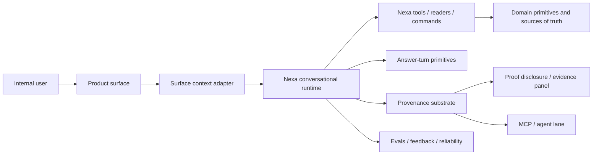
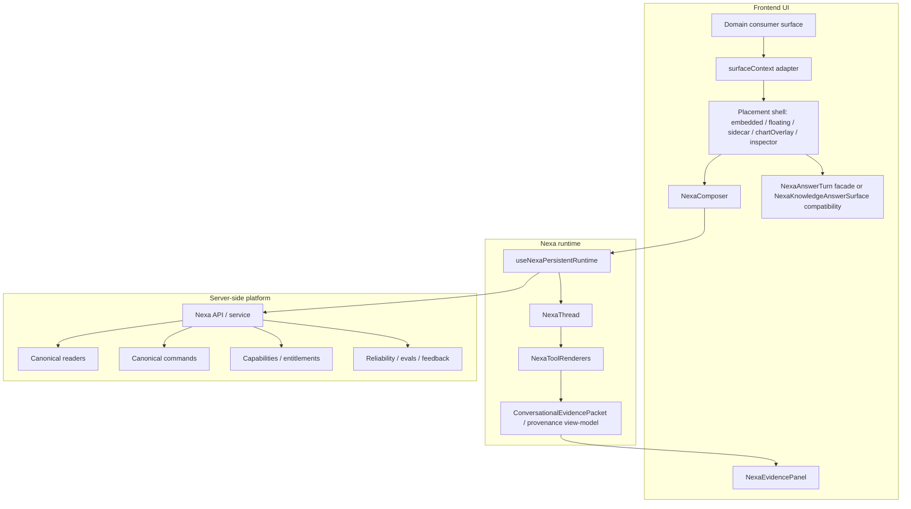

# Greenhouse Conversational Experience Platform V2

> Tipo de documento: Spec de arquitectura
> Status: Proposed
> Version: V2 draft
> Creado: 2026-06-12
> Owner: Nexa / UI Platform / API Platform
> Related tasks: TASK-1095, TASK-1096
> ADR: GREENHOUSE_CONVERSATIONAL_EXPERIENCE_PLATFORM_DECISION_V1.md
> Validated as of: 2026-06-12 against local repo docs and runtime contracts

## 1. Purpose

This document defines the candidate V2 architecture for the Nexa conversational experience as a multi-surface platform, not a Knowledge-only screen and not a set of per-module chats.

The platform must be consumable by:

- Nexa Chat in Home / floating panel
- Nexa Insights moments
- Knowledge
- Finance and chart intelligence
- Agency
- Personas / Person 360
- Commercial
- Home / floating Nexa
- future sidecars, MCP resources and operational inspectors

Knowledge is the first serious reference consumer. It is not the owner of the pattern.

The broader product rule:

> Every AI moment in Greenhouse should either consume the conversational platform directly, or be able to escalate into it with context, provenance and trust preserved.

## 2. Architecture thesis

Nexa Conversational Experience V2 is a shared platform contract composed of:

1. `surfaceContext`: typed context contributed by each product surface.
2. conversational runtime: thread, state, history, model/tool orchestration and follow-up continuity.
3. answer-turn: reusable presentation of user prompt, Nexa answer, actions, trust cue and optional proof.
4. provenance substrate: hidden runtime packet for rehydration, evals, feedback, MCP and reliability.
5. placement shells: embedded, floating, sidecar, chart overlay or inspector placement owned by UI platform primitives.

The invariant:

> Domain surfaces contribute context, capabilities and provenance references. They do not own a custom chat implementation.

## 3. Non-goals

- Do not create `FinanceNexaChat`, `AgencyNexaChat`, `PersonNexaChat` or other domain-local chat forks.
- Do not make Knowledge document citations the universal evidence model.
- Do not expose proof/evidence as the default body of every answer.
- Do not infer business authorization from route, role label or UI visibility.
- Do not make the UI query tables, run retrieval or duplicate domain readers.
- Do not replace `NexaThread`, `NexaFloatingPanel`, `NexaComposer`, `NexaKnowledgeAnswerSurface` or `NexaEvidencePanel` without a migration path.

## 4. Existing contracts this extends

- `GREENHOUSE_NEXA_ARCHITECTURE_V1.md`: Nexa is a grounded operational assistant, not a generic chatbot.
- `GREENHOUSE_NEXA_AGENT_SYSTEM_V1.md`: domain tools and agentic evolution must preserve server-side tenant and tool boundaries.
- `GREENHOUSE_NEXA_INSIGHTS_LAYER_V1.md`: Nexa Insights is an advisory, cross-domain signal/narrative layer with canonical top-level routing and honest degradation.
- `GREENHOUSE_API_PLATFORM_ARCHITECTURE_V1.md`: UI must converge on readers, commands and platform contracts, not route-local logic.
- `GREENHOUSE_FULL_API_PARITY_DECISION_V1.md`: product capabilities need programmatic equivalents when operationally meaningful.
- `GREENHOUSE_ENTITLEMENTS_AUTHORIZATION_ARCHITECTURE_V1.md`: permissions are resolved through views, entitlements and capabilities, not ad hoc UI checks.
- `GREENHOUSE_MCP_ARCHITECTURE_V1.md`: MCP is a technical/resource lane, not a human chat surface.
- `GREENHOUSE_UI_PRIMITIVE_VARIANTS_DECISION_V1.md`: reusable UI must follow primitive + variants + kinds.
- `GREENHOUSE_ADAPTIVE_SIDECAR_UI_PLATFORM_V1.md`: contextual assistant lanes use Adaptive Sidecar, not custom drawers.
- `GREENHOUSE_KNOWLEDGE_PLATFORM_ARCHITECTURE_V1.md`: Knowledge provides the first retrieval-backed consumer.

## 5. C4 context



## 6. Container view



## 7. Surface context contract

`surfaceContext` is the boundary between a product surface and the shared conversational platform.

It must be serializable, redaction-aware and safe to persist in conversational state. It must contain references and resolved policy outputs, not raw private records.

```ts
type NexaSurfaceDomain =
  | 'knowledge'
  | 'nexa_chat'
  | 'nexa_insight'
  | 'finance'
  | 'chart'
  | 'agency'
  | 'person'
  | 'commercial'
  | 'home'
  | 'generic'

type NexaSurfacePlacement =
  | 'embedded'
  | 'floating'
  | 'sidecar'
  | 'chartOverlay'
  | 'inspector'

type NexaDataReality =
  | 'strong'
  | 'partial'
  | 'delayed'
  | 'inferred'
  | 'degraded'
  | 'unknown'

type NexaSensitivityTier =
  | 'public_internal'
  | 'tenant_internal'
  | 'restricted'
  | 'confidential'
  | 'redacted'

interface NexaSurfaceContext {
  surfaceId: string
  domain: NexaSurfaceDomain
  placement: NexaSurfacePlacement
  entityRefs: Array<{
    kind: string
    id: string
    label?: string
  }>
  timeRange?: {
    from: string
    to: string
    grain?: 'day' | 'week' | 'month' | 'quarter' | 'year'
  }
  dataReality: NexaDataReality
  capabilities: Array<{
    capability: string
    action: 'read' | 'suggest' | 'draft' | 'execute'
    scope: string
  }>
  provenanceRefs: Array<{
    kind: string
    ref: string
    version: string
  }>
  sensitivity: NexaSensitivityTier
  trustCueInputs?: {
    sourceCount?: number
    freshness?: 'current' | 'stale' | 'unknown'
    confidence?: 'high' | 'medium' | 'low' | 'none'
    restrictions?: string[]
  }
}
```

### 7.1 Invariants

- `surfaceId` is stable and describes the consumer, not the route only.
- `entityRefs` are safe references. They are not raw records from finance, payroll, HR, HubSpot or Notion.
- `capabilities` are resolved server-side or by canonical policy helpers. The UI cannot infer them from route, role or visible tab.
- `dataReality` is mandatory so partial, delayed or inferred context cannot look complete.
- `sensitivity` is mandatory and drives redaction in trust cues, proof detail and MCP.
- `provenanceRefs` point to versioned packets or safe references. They do not contain raw provider payloads.

## 8. Consumer profiles

| Consumer | Primary job | Required context | Default conversational behavior |
| --- | --- | --- | --- |
| Nexa Chat | Broad conversational entrypoint | tenant/session context, capability summary, recent signals, optional selected context | primary chat shell with safe tool routing and history continuity |
| Nexa Insights | Surface an advisory signal, root cause or recommendation | signal id, enrichment id, domain, severity, lifecycle state, provenance refs | not chat by default; can promote into conversation with the insight as `surfaceContext` |
| Knowledge Nexa lens | Ask grounded questions over corpus | document refs, source freshness, citation/provenance refs | clean composer, answer-first, compact source cue, proof on demand |
| Finance/chart insight | Explain a metric, movement or anomaly | metric id, period, comparison, calculation provenance, finance capability refs | answer anchored to chart context, honest if drilldown reader is unavailable |
| Agency account surface | Explain account health or next action | organization/account refs, engagement status, risk signals, allowed actions | recommendation/action-first with provenance behind cue |
| Person profile | Explain workforce/person context | person ref, relationship context, sensitivity tier, HR/payroll access constraints | redaction-aware, avoids leaking restricted detail |
| Commercial pipeline | Explain deal/client lifecycle movement | deal/org refs, stage, HubSpot/Bow-tie context, freshness | next-best-action orientation with source freshness when relevant |
| Home/floating Nexa | Broad workspace conversation | tenant/session context, capability summary, recent signals | global assistant mode with contextual prompts and safe tool routing |

## 8.1 AI experience ecosystem

Conversational Experience V2 is not the entire AI product surface. It is the shared substrate for AI moments that need dialogue, follow-up, grounding, action suggestions or proof inspection.

| AI moment | Owns | Relationship to Conversational Experience |
| --- | --- | --- |
| Nexa Chat | Primary conversational shell, thread history, broad prompts | Direct consumer of runtime, composer, answer-turn and provenance substrate |
| Nexa Insights | Advisory signals, narratives, root cause, recommendations, detail/list pages | Conversationally promotable: an insight can open a contextual conversation seeded by signal/enrichment refs |
| Knowledge Nexa lens | Grounded corpus Q&A | Reference embedded consumer with retrieval provenance |
| Chart explainers | Explain selected metric, trend or anomaly | Embedded consumer with chart/metric `surfaceContext` |
| AI summaries in domain pages | Read-only narrative summary over current object | May stay non-conversational; should expose "ask Nexa about this" when follow-up is useful |
| MCP resources/tools | Technical inspection and agent access | Uses Layer 3 provenance/packet, not human chat UI |
| Notification/email AI moments | Digest, alert or recommendation outside the portal | Deep-link into canonical detail or conversation with context, never embed raw chat state in email |

### Nexa Insights boundary

Nexa Insights should not automatically become a chat surface.

It remains an advisory signal layer with:

- signal/enrichment identity,
- root cause narrative,
- recommended action,
- lifecycle/timeline state,
- honest degradation states,
- top-level detail routing under `/nexa/insights`.

The synergy with Conversational Experience is escalation:

1. The user sees an insight in Home, Agency, Person 360, Space 360, Finance or a digest.
2. The insight offers a contextual action such as "Preguntar a Nexa sobre esto" when conversation is useful.
3. That action builds a `surfaceContext` with `domain='nexa_insight'`, signal/enrichment refs, related entity refs, severity, data reality, capabilities and provenance refs.
4. Nexa opens in the appropriate placement and answers with the insight already grounded.
5. Follow-ups continue from that context without reprinting the whole insight/proof.

This keeps Insights as a compact advisory system while giving users a direct path into deeper conversation.

## 9. Conversational state contract

The shared state machine:

| State | Meaning | UI contract |
| --- | --- | --- |
| `idle` | No prompt in this surface/session | clean composer or empty state only |
| `composing` | User is editing | no proof/retrieval UI |
| `submitted` | Prompt accepted | user prompt bubble renders before Nexa |
| `thinking` | Runtime/tool/model is working | Nexa identity plus one thinking signal |
| `answered` | Answer content exists | answer first, compact trust cue, actions, follow-up composer |
| `degraded` | Runtime/evidence/context unavailable or stale | readable answer or limitation with honest degraded copy |

No consumer may redefine these states locally.

## 10. Answer-turn contract

The answer-turn is not a placement shell. It is the reusable body of a conversational response.

Required order:

1. user question bubble
2. Nexa identity/avatar
3. answer content
4. compact trust cue when useful
5. actions or suggested next step
6. follow-up composer
7. proof detail only on demand

`NexaKnowledgeAnswerSurface` is the current implementation candidate. V2 should either:

- introduce a facade such as `NexaAnswerTurn` that delegates to it, or
- keep the current name temporarily and document it as the answer-turn of record until a mechanical rename.

A second independent answer-turn implementation is forbidden.

## 11. Provenance and trust layers

Evidence is a runtime substrate. It supports trust, rehydration, feedback, MCP and evals. It is not the main character of the human conversation.

| Layer | Audience | Visibility | Purpose |
| --- | --- | --- | --- |
| Layer 0 runtime substrate | runtime, evals, reliability | hidden | rehydration, feedback, provenance, observability |
| Layer 1 trust cue | human user | compact/default when useful | quick confidence signal |
| Layer 2 proof detail | human inspector | on demand | sources, freshness, limitations, filtered count, feedback |
| Layer 3 MCP/agent packet | agent / technical lane | explicit technical surface | sanitized machine-readable trace |

Trust cues must not collapse retrieval confidence, answer confidence, source freshness and policy/runtime restrictions into one raw score.

## 12. Placement ownership

| Placement | Owner | Rule |
| --- | --- | --- |
| `embedded` | product surface + answer-turn | used inside Knowledge, inspectors and future module surfaces |
| `floating` | `NexaFloatingPanel` | global assistant shell |
| `sidecar` | `AdaptiveSidecarLayout variant='assistant'` | contextual assistant lane, not a custom drawer |
| `chartOverlay` | chart surface + answer-turn | explain selected metric without forking chat |
| `inspector` | domain inspector surface | object-local explanation and next action |

Placement owns container and ergonomics. Answer-turn owns conversational content. Composer owns input. Provenance owns proof detail.

## 13. Authorization and privacy boundary

The conversational platform is not an authorization oracle.

Rules:

- Server-side readers/commands remain the source of business permission enforcement.
- `surfaceContext.capabilities` is an input to UI affordances, not a bypass.
- The model/tool layer must receive tenant-safe context from server-side primitives.
- Sensitive domains such as finance, HR/payroll, people, commercial contracts and HubSpot data must pass safe refs and sensitivity tiers, not raw records.
- If a domain cannot provide safe context, the surface must degrade honestly.

## 14. Tooling and API boundary

The UI layer does not query domain tables, run retrieval or compute domain facts.

Surfaces should connect through:

- canonical readers
- canonical commands
- API Platform app/ecosystem lanes when applicable
- Nexa tools with server-side `NexaToolContext`
- MCP resources only in explicit technical lanes

New domain consumers must declare the programmatic contract they rely on or create a follow-up task for missing parity.

## 15. Observability, evals and feedback

Minimum signals:

- surface id and domain for each conversation turn
- model/provider id already surfaced through Nexa response metadata
- tool calls and degraded tool states
- provenance packet version
- trust cue state
- proof expanded/collapsed interaction
- feedback target
- redaction/degradation reason when safe

Evals should include:

- Knowledge grounded answers
- finance/chart explanations with missing drilldown reader
- person/HR restricted context
- commercial next-best-action copy
- follow-up continuity without proof reprint

## 16. Migration plan

### Phase A: Architecture gate

- Accept or revise this architecture and ADR.
- Confirm `NexaKnowledgeAnswerSurface` compatibility strategy.
- Define `surfaceContext` types and fixtures.
- Confirm the pre-implementation checklist in Section 17.

### Phase B: Platform contract

- Add state/view-model controller.
- Add `surfaceContext` adapter boundary.
- Add fixtures for Knowledge, finance/chart and one operational domain.
- Add tests that prove non-Knowledge contexts do not require document citations.

### Phase C: Knowledge reference consumer

- Use V2 in `/knowledge` Nexa lens.
- Preserve `/knowledge/mockup/answer-trace` as lab/baseline.
- Keep Humano and MCP as distinct lenses.

### Phase D: First non-Knowledge pilot

- Pick one small consumer after V2 lands.
- Default recommendation: finance/chart insight explanation because it tests metric context, time range, provenance and degraded drilldown without HR/payroll sensitivity.
- Alternative: Agency account health if product wants a more operational next-best-action pilot.
- Scope only read/explain/suggest, no writes.

## 17. Pre-implementation checklist

Before runtime work starts, TASK-1095 must resolve or explicitly defer these items:

| Topic | Decision needed | Recommended stance |
| --- | --- | --- |
| Delivery boundary | What does TASK-1095 ship? | Platform foundation + support contracts. TASK-1096 owns the Nexa Answers product/UI choreography. First real non-Knowledge product rollout becomes child follow-up. |
| First child pilot | Which non-Knowledge surface validates the platform in product? | Default: finance/chart insight explanation. Alternative: Agency account health. |
| `surfaceContext` home | Where does the type live? | Start in `src/lib/nexa/surface-context.ts`; keep naming generic enough to move later if an AI Experience package emerges. |
| Answer surface naming | Facade or rename? | TASK-1096 should define `NexaAnswersSurface` as the embedded contextual surface. Internally it may use an answer-turn facade over `NexaKnowledgeAnswerSurface`; defer mechanical rename if risky. |
| AI moments registry | How are Nexa Chat, Insights, Knowledge, digests, summaries and MCP mapped? | Create a minimal registry/view-model during Slice 2; do not make every AI moment conversational by default. |
| Trust cue copy | Which labels are canonical? | Define in `src/lib/copy/nexa.ts` before JSX. |
| Sensitivity tiers | How do tiers map to real access? | Map `public_internal`, `tenant_internal`, `restricted`, `confidential`, `redacted` to capabilities/entitlements before Person/Finance pilots. |
| Observability | What is logged from V1? | Capture surface id/domain, trust cue state, proof open/collapse, degraded reason, feedback target and model/provider id. |
| Autonomy | Are actions executable? | Keep V2 read/explain/suggest. Draft/execute requires follow-up ADR or delta. |
| Context persistence | What is stored in thread history? | Persist safe refs and metadata only; never raw domain payloads. |
| Nexa Insights promotion | What does "ask Nexa about this" carry? | Signal/enrichment refs, lifecycle state, entity refs, severity, provenance refs and sensitivity tier. |
| GVC specimens | What must be visually checked before closing? | Global chat, Knowledge, Insight promoted, finance/chart fixture, expanded proof. |

## 18. Recommended execution boundary

TASK-1095 should not attempt to ship the first real non-Knowledge product rollout. That would mix platform foundation with domain-specific product QA.

Recommended split:

1. TASK-1095 ships the platform contract, architecture/ADR, `surfaceContext`, AI moments map, provenance/trust cue layers and support primitives.
2. TASK-1096 ships the Nexa Answers product/UI contract: embedded contextual surface, choreography, Knowledge reference consumer and representative fixtures/specimens for non-Knowledge domains.
3. A later child follow-up task ships the first real non-Knowledge pilot. Default candidate: finance/chart insight explanation. It should be read/explain/suggest only.

## 19. What this reveals is missing

- A formal `surfaceContext` type/module does not exist yet.
- No consumer adapter pattern exists yet.
- No explicit AI experience moment registry exists yet to map Nexa Chat, Nexa Insights, Knowledge, charts, domain summaries, digests and MCP lanes into one product system.
- Nexa Insights does not yet have a formal "promote to conversation" contract that preserves signal/enrichment identity, lifecycle state and provenance refs.
- `ConversationalEvidencePacket` is still Knowledge-shaped.
- `NexaKnowledgeAnswerSurface` is doing generic Nexa Answers work under a Knowledge-specific name.
- UI platform docs do not yet name conversational answer-turn as a primitive/pattern.
- Non-Knowledge sample fixtures do not exist.
- Confidence semantics are not separated enough for finance/person/commercial risk.
- Observability for proof expansion, trust cue state and surface-specific degraded modes is not yet formalized.
- The first non-Knowledge pilot is not selected.

## 20. Deep discovery snapshot — 2026-06-12

This discovery was performed against the local repo on `develop` after TASK-1090 landed the Knowledge lenses/AnswerSurface coherence. It is intentionally discovery-only: no runtime implementation is implied by this section.

### What exists today

- `NexaKnowledgeAnswerSurface` already contains the approved Knowledge choreography foundation: clean idle when `conversationStarted=false`, question bubble, Nexa identity, answer, lowered follow-up composer and proof panel.
- `/knowledge` consumes that surface in the Nexa lens while the parent route owns the common **Humano | Nexa | MCP** selector.
- `NexaComposer` is already reusable enough to be part of the platform foundation; its `inlineFollowUp` kind is the correct starting point for composer descent.
- `ConversationalEvidencePacket` and `NexaEvidencePanel` provide a first proof/provenance view-model and renderer for Knowledge search packets.
- Nexa Chat already has a persistent assistant-ui runtime through `useNexaPersistentRuntime`, `/api/home/nexa`, `NexaThread`, `NexaFloatingPanel`, persisted threads and tool-call rehydration.
- GVC already covers the current Knowledge baseline with `knowledge-answer-trace`, `knowledge-lenses`, `design-system-nexa-chat` and `nexa-floating-chat`.

### Gaps confirmed in code

- `surfaceContext` does not exist in code. Current page context is too shallow for multi-surface answers because it only carries labels such as entity/context key, not safe refs, capability outputs, data reality, sensitivity tier or provenance refs.
- The runtime is still Home/Nexa Chat shaped. `useNexaPersistentRuntime` posts to `/api/home/nexa`, and `NexaService` receives a `HomeSnapshot`; no embedded contextual answer endpoint or input contract exists yet.
- The Knowledge Nexa lens does not yet call the Nexa conversational runtime for answer generation. It currently runs `runKnowledgeSearch(..., 'agentic')` and derives answer steps locally from the packet/evidence.
- `ConversationalEvidencePacket` is still Knowledge-shaped (`kind='knowledge'`). It cannot yet represent metric calculation provenance, insight enrichment provenance, operational tool degradation or unsupported proof states without ad hoc extensions.
- `NexaEvidencePanel` is a good expanded proof renderer, but the platform lacks a compact trust cue view-model distinct from the proof panel.
- `NexaKnowledgeAnswerSurface` is doing generic Nexa Answers work under a Knowledge-specific name. The safest next step is a facade/compatibility strategy, not a risky mechanical rename.
- Nexa Insights has no formal "promote to conversation" contract. The missing payload is signal/enrichment identity, lifecycle state, entity refs, severity, sensitivity and provenance refs.
- UI platform docs contained drift after TASK-1090: older pattern text still described the pre-submit trace/proof-heavy surface. That drift must stay visible until TASK-1096 finalizes the Nexa Answers pattern.

### Delivery implication

TASK-1095 must create the platform substrate first: typed `surfaceContext`, adapters, state/answer-turn contract, trust/proof/provenance layering, observability/evals and compatibility with current Knowledge.

TASK-1096 must then create the product/UI experience: `Nexa Answers` as an embedded contextual surface, the exact choreography, proof-on-demand, compact follow-ups, Design System specimens and GVC coverage.

The first real non-Knowledge rollout should remain a child follow-up. The recommended pilot is still finance/chart explanation because it validates metric context, period, calculation provenance and degraded drilldown without starting in a higher-sensitivity HR/payroll surface.

## 21. Revisit triggers

Revisit this architecture when:

- a second non-Knowledge consumer adopts the platform,
- Nexa gains write/action execution in an embedded surface,
- MCP needs to expose conversational provenance beyond Knowledge,
- a domain needs stronger redaction than the current sensitivity tiers,
- model/provider routing changes the answer-turn contract,
- sidecar lane C becomes the primary assistant placement.

## 22. 12-month self-critique

Most likely failure mode: `surfaceContext` becomes a loose bag of optional fields. If so, each domain will smuggle its own semantics into the shared runtime and V2 will become a soft fork.

Mitigation:

- typed domain adapters
- fixture coverage per domain
- lint/test rule for raw payload leakage
- docs that distinguish references from records

## 23. 36-month self-critique

Most likely failure mode: the platform accumulates too many UI placements and autonomy tiers without a clearer agent/action governance layer.

Mitigation:

- keep answer-turn separate from placement
- keep writes behind commands and capability gates
- add a V3 ADR before autonomous actions become default

## 23. Cognitive debt risk

The largest cognitive debt risk is naming. If the generic answer-turn continues to be called `NexaKnowledgeAnswerSurface`, future agents will keep treating Knowledge as the owner. V2 should add a facade or rename plan early.

## 24. Lock-in assessment

- Low lock-in to a specific visual implementation if the answer-turn facade is introduced.
- Medium lock-in to assistant-ui runtime because Home/floating already depend on it, but current architecture treats composer/answer-turn as Greenhouse primitives.
- High product lock-in to `surfaceContext` semantics once adopted across domains; this is why the ADR is required.

## 25. Open questions

- Should `surfaceContext` live under `src/lib/nexa/` or a broader UI platform context module?
- What is the first non-Knowledge pilot after Knowledge: finance chart or agency account health?
- Should proof expansion analytics be a reliability signal, a product analytics event, or both?
- Which sensitivity tiers map exactly to current entitlement/capability catalogs?
