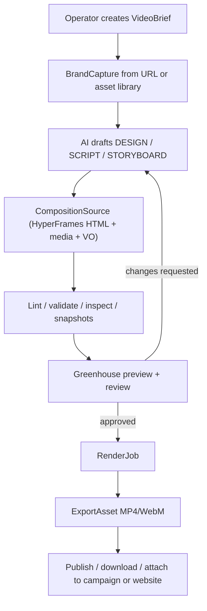

# Greenhouse Creative Video Studio V1

> **Tipo de documento:** Spec de arquitectura / ADR propuesto
> **Status:** Proposed
> **Date:** 2026-06-02
> **Owner:** Platform / Creative Operations / AI Tooling
> **Scope:** Video generation, brand capture, HyperFrames compositions, asset library, approval workflow, render jobs
> **Reversibility:** two-way-but-slow
> **Confidence:** medium
> **Validated as of:** 2026-06-02
> **Task:** TASK-996 — Greenhouse Creative Video Studio

---

## 1. Purpose

Definir como Greenhouse puede incorporar una capacidad interna de **generacion de videos de marca** a partir de una web, brief, asset library, campana, case study o producto.

El piloto `videos/efeoncepro-promo/` demostro que una URL publica puede transformarse en:

- captura de marca y assets;
- `DESIGN.md`;
- guion narrado;
- storyboard;
- composicion HTML animada;
- voz en off;
- snapshots de QA;
- preview en HyperFrames Studio;
- export futuro a MP4/WebM.

La decision propuesta es productizar esa capacidad como modulo Greenhouse, usando Greenhouse como control plane de producto y HyperFrames como motor de composicion/render.

---

## 2. Context

El usuario pidio convertir `efeoncepro.com` en un promo de producto de 20 segundos. El piloto se construyo con HyperFrames y produjo un HTML animado con GSAP, assets capturados de la web, VO en WAV, transcript y snapshots. El resultado se puede revisar como Studio preview y se puede exportar a MP4/WebM cuando el corte este aprobado.

La pregunta de producto resultante es: si esto ya funciona como workflow asistido por agente, Greenhouse deberia tenerlo como capacidad nativa para Efeonce y, eventualmente, para clientes.

Este dominio toca multiples planos:

- AI/agentic workflow;
- captura de websites y brand systems;
- asset library;
- storage/render jobs;
- permisos y aprobaciones;
- publication/export;
- costo y reliability de renders;
- posible uso de voz, avatar, subtitulos y variantes por idioma.

Por eso requiere ADR/task antes de runtime.

---

## 3. Decision Proposed

Greenhouse debe crear un modulo **Creative Video Studio** que permita generar, revisar, versionar y exportar videos de marca.

La frontera canonica:

- **Greenhouse owns product workflow**: briefs, permisos, proyectos, metadata, revision, aprobacion, storage, relacion con clientes/campanas y lifecycle.
- **HyperFrames owns composition/render engine**: HTML timeline, GSAP animation, media sync, lint, validate, inspect, snapshot, preview y render MP4/WebM.
- **AI providers own generation primitives**: texto, imagen, voz o avatar segun el canal configurado. Greenhouse debe encapsularlos, no llamar proveedores desde scripts sueltos.
- **Exported video is the production artifact**: para web publica y redes, MP4/WebM comprimido es el output recomendado. El HTML animado queda como source editable/versionable, no como embed publico por defecto.

---

## 4. Core Objects

| Object | Purpose |
| --- | --- |
| `VideoProject` | Contenedor canonico del trabajo: owner, tenant/client, status, format, duration, language, source URL/assets, current version. |
| `VideoBrief` | Input humano/AI: objetivo, audiencia, CTA, duracion, formato, tono, constraints, canales de salida. |
| `BrandCapture` | Snapshot de la fuente: screenshots, assets, tokens, visible text, fonts, extracted claims. |
| `VideoScript` | Guion narrado y copy en pantalla, con locale y pronunciation substitutions. |
| `Storyboard` | Direccion beat-by-beat: timing, assets, motion, transitions, SFX, QA notes. |
| `CompositionSource` | Proyecto HyperFrames o equivalente: HTML, CSS, JS, media references, narration, transcript. |
| `RenderJob` | Trabajo asincrono de render/export: status, requested format, worker evidence, logs, output asset. |
| `ExportAsset` | MP4/WebM/GIF/subtitles/snapshot contact sheet almacenado en asset library con metadata. |
| `VideoApproval` | Revision humana: draft, requested changes, approved, rejected, comments, approver. |

V1 puede persistir parte de estos objetos como metadata + private assets antes de crear tablas dedicadas. La task debe decidir schema concreto.

---

## 5. Architecture

### Control plane

Greenhouse should expose the user-facing workflow:

- create project;
- attach source URL/assets;
- generate draft;
- preview/scrub;
- request changes;
- approve;
- export;
- attach output to client/campaign/brand asset library.

### Render plane

HyperFrames should run as a bounded local/worker engine:

- `capture`;
- `tts` / external TTS adapter;
- `transcribe`;
- `lint`;
- `validate`;
- `inspect`;
- `snapshot`;
- `preview`;
- `render`.

V1 should start with internal/operator-triggered jobs. Scheduled or customer-facing self-service generation is out of scope until cost, queueing and policy controls are proven.

---

## 6. Runtime Contract

### Recommended routes

Candidate routes, subject to task discovery:

- `/creative/video-studio`
- `/creative/video-studio/[projectId]`
- `/creative/video-studio/[projectId]/preview`
- `/creative/video-studio/[projectId]/renders`

If the module is initially admin/internal only, the task may place it under `/admin/creative-video` or another route, but it must remain reachable under the navigation reachability gate.

### Access model

V1 must use dual-plane access:

- visible view: candidate `creative.video_studio`;
- capabilities:
  - `creative.video_project.read`
  - `creative.video_project.create`
  - `creative.video_project.generate`
  - `creative.video_project.review`
  - `creative.video_project.approve`
  - `creative.video_project.render`
  - `creative.video_project.publish`

Default V1 audience should be internal Efeonce operators. Client-facing access requires a separate decision.

### Storage

V1 must not store generated projects only on local disk.

The task must choose a canonical storage model, likely:

- private asset storage for captures, source files and exported renders;
- metadata in Postgres;
- signed URLs for preview/download;
- retention policy for intermediate capture artifacts;
- explicit owner/client/project metadata.

### Outputs

V1 must distinguish:

- **Source editable**: HyperFrames project / HTML timeline / media / VO / transcript.
- **Review artifacts**: snapshots, contact sheet, lint/inspect evidence.
- **Production artifact**: MP4/WebM/GIF/subtitle files.

For public web embed, default recommendation is exported MP4/WebM, not runtime HTML embed.

---

## 7. Workflow V1

1. Operator creates a `VideoBrief`.
2. Greenhouse captures a URL or selects existing assets.
3. AI drafts `DESIGN.md`, `SCRIPT.md`, `STORYBOARD.md`.
4. Greenhouse builds a composition source.
5. System generates or attaches narration and transcript.
6. System runs lint, validate, inspect and snapshots.
7. Operator reviews preview and requests changes.
8. Operator approves draft.
9. Render job exports MP4/WebM.
10. Export asset is stored and attached to campaign/client/website as needed.

---

## 8. Guardrails

- Do not publish HTML animation as default public embed. Export MP4/WebM first.
- Do not call AI image/video/TTS providers from ad-hoc scripts in production runtime.
- Do not store source projects only under repo-local `videos/`.
- Do not let client users generate arbitrary website captures without policy, quota and abuse controls.
- Do not bypass Greenhouse asset permissions when previewing/download renders.
- Do not treat generated copy/claims as approved client-facing content without review.
- Do not render production jobs synchronously in a request/response route.
- Do not hide failed lint/validate/inspect; preview must expose degraded state honestly.
- Do not mix Efeonce institutional brand and Greenhouse app brand incorrectly in generated templates.

---

## 9. Reliability Signals

Candidate V1 signals:

| Signal | Kind | Steady state | Purpose |
| --- | --- | --- | --- |
| `creative.video.render_failed` | failure | 0 | Render jobs failing after retry budget. |
| `creative.video.render_queue_lag` | lag | below threshold | Jobs waiting too long for worker capacity. |
| `creative.video.capture_failed` | failure | 0 | URL capture failed or returned incomplete artifacts. |
| `creative.video.validation_failed` | drift | 0 | Lint/validate/inspect failures in generated source. |
| `creative.video.unapproved_publish_attempt` | security | 0 | Attempt to export/publish without approval. |
| `creative.video.asset_missing` | data_quality | 0 | Source composition references missing assets. |

---

## 10. Alternatives Considered

### A. Keep it as local agent workflow only

Rejected as the long-term product direction. It is useful for pilots, but loses Greenhouse ownership over permissions, storage, approval, metadata, discoverability and repeatability.

### B. Upload final MP4 manually to Greenhouse

Useful as a short-term bridge, but not a product capability. It does not preserve source composition, generation evidence, versioning, review lifecycle or reusable templates.

### C. Embed HyperFrames Studio directly as the product UI

Rejected for V1 as default. Studio is excellent for preview/scrub, but Greenhouse should own the workflow, permissions and metadata. A Studio link or embedded preview can be used behind internal auth.

### D. Build a proprietary render engine

Rejected for V1. HyperFrames already supplies deterministic HTML-to-video primitives, lint, validate, inspect, snapshot and render. Greenhouse should productize around it before replacing it.

---

## 11. Consequences

### Benefits

- Turns Efeonce creative production into a repeatable internal capability.
- Enables videos from websites, campaigns, case studies, reports and product launches.
- Creates reusable templates for Efeonce and later client brands.
- Preserves source files and approval history instead of one-off MP4s.
- Can attach exports to campaigns, website hero sections, sales collateral or client reports.

### Costs / Risks

- Render jobs can be CPU/GPU and storage intensive.
- Website capture may pull many assets and needs retention limits.
- Generated claims must be reviewed before publication.
- External providers (TTS, image/video/avatar) need secrets, cost guardrails and fallback.
- Public/client-facing self-service has abuse and brand-safety implications.

---

## 12. Revisit When

Reopen this decision if:

- HyperFrames no longer fits rendering needs or licensing/runtime constraints.
- Greenhouse needs real-time interactive animation embeds instead of exported video.
- Client-facing generation becomes a requirement.
- HeyGen avatar/video agent becomes the primary output channel rather than optional enhancement.
- Render cost or queueing exceeds internal operating thresholds.
- Legal/commercial review requires stricter approval or watermarking controls.

---

## 13. Pilot Evidence

Pilot artifact:

- `videos/efeoncepro-promo/`

Pilot outputs:

- captured website assets from `efeoncepro.com`;
- `DESIGN.md`;
- `SCRIPT.md`;
- `STORYBOARD.md`;
- `narration.wav`;
- `transcript.json`;
- `index.html`;
- snapshots/contact sheet;
- HyperFrames Studio preview.

Pilot verification:

- HyperFrames lint: `0 errors, 0 warnings`;
- HyperFrames validate: no console errors;
- HyperFrames inspect: `0 layout issues`;
- snapshots captured for four beats.

