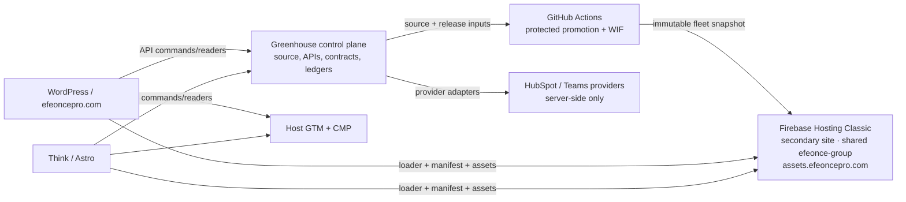

# Greenhouse Efeonce Embed Runtime Architecture V1

- Status: Target architecture; implementation tracked by `EPIC-035`
- Date: 2026-07-22
- Owner: Growth / Public Site / Platform
- Decision: [Efeonce Embed Runtime Delivery Decision V1](GREENHOUSE_EFEONCE_EMBED_RUNTIME_DELIVERY_DECISION_V1.md)
- Consumers: Efeonce WordPress, Think/Astro and future explicitly registered public hosts

## 1. Purpose

Define a portable, provider-neutral runtime for Efeonce Growth Forms, CTAs and Meetings whose presentation can be released independently from the Greenhouse application while Greenhouse remains authority for APIs, contracts, consent and business state.

This document governs static delivery, compatibility, host integration, release, telemetry and migration. Product-domain rules remain in the Forms, CTA and Meetings architecture documents.

## 2. Current State and Problem

| Product  | Current asset lane                                           | Current consumer examples                 | Principal gap                                                                                              |
| -------- | ------------------------------------------------------------ | ----------------------------------------- | ---------------------------------------------------------------------------------------------------------- |
| Forms    | Greenhouse build; mutable `/growth-forms/renderer-latest.js` | WordPress widgets and Think docks         | Visual delivery is coupled to the Greenhouse application release.                                          |
| CTAs     | Greenhouse build; mutable `/growth-cta/renderer-latest.js`   | Think `GrowthCtaDock` and public surfaces | Same coupling; action code derives Forms and hardcodes Meetings asset locations.                           |
| Meetings | Dedicated `efeonce-public-renderers` Vercel project          | WordPress `/agenda/`, CTA meeting action  | Independent lane exists, but local promotion and incomplete release retention allow a manifest/asset race. |

`package.json` currently builds all three renderers during Greenhouse `prebuild`. Forms and CTAs copy a channel-specific artifact to `renderer-latest.js`. Meetings has content-addressed releases but a site build contains only the current release: if the stable alias changes between fetching a manifest and its relative asset, the browser can request the prior release from the new deployment and receive 404.

## 3. Architectural Principles

1. **Control plane is not delivery plane.** Greenhouse governs; Firebase Hosting distributes bytes.
2. **One protocol, independent products.** Share loaders, manifest schema and gates, not bundle lifecycle.
3. **Build once, promote exact bytes.** Rebuild on production promotion is forbidden.
4. **Immutable assets, explicit mutable pointers.** Mutability is restricted to channel and health metadata.
5. **Host-owned page concerns.** GTM, CMP, consent UI, navigation and global layout remain with WordPress/Astro.
6. **Server truth beats browser claims.** Renderer events aid measurement; server ledgers confirm conversion.
7. **Fail contained.** A blocked or incompatible renderer must not break the host page.
8. **Provider exit is a normal operation.** Public contracts never expose Firebase-specific APIs.

## 4. System Context



## 5. Boundaries and Ownership

### 5.1 Greenhouse owns

- renderer source and browser-safe shared contracts;
- Forms, CTA and Meetings APIs, commands/readers and authorization/origin policy;
- submissions, booking attempts, confirmed outcomes and audit evidence;
- public host registry, CORS/Turnstile policy and consent semantics;
- release policy, compatibility matrix, kill switches and health signals;
- canonical preview data and real-host verification scenarios.

### 5.2 Firebase Hosting owns

- static JS/CSS/JSON delivery through `assets.efeoncepro.com`;
- CDN caching, TLS/custom-domain termination, preview channels and version history;
- no server functions, database, authentication, PII, tokens or business decisions.
- The secondary Hosting site is a delivery boundary, not a security project boundary; IAM, billing, quotas and
  project Owners/Editors remain shared with `efeonce-group`.

### 5.3 Host applications own

- page header/footer/navigation, layout and SEO;
- loading the approved Embed Runtime entry point;
- GTM container, CMP/consent state and `dataLayer` collection;
- host tokens explicitly exposed by the renderer contract;
- CSP directives and approved origins;
- recovery copy when a renderer cannot load.

## 6. Public Path and Artifact Contract

Canonical origin:

```text
https://assets.efeoncepro.com
```

Logical layout:

```text
/embed-runtime/protocol/v1/schema.json
/forms/loader.js
/forms/channels/stable.json
/forms/releases/<releaseId>/renderer.js
/forms/releases/<releaseId>/renderer.css
/forms/releases/<releaseId>/manifest.json
/ctas/...
/meetings/...
/health.json
```

Each product has its own `releaseId`, renderer semantic version, channel pointer and rollback history. A shared Hosting deployment is a **fleet snapshot**: promoting one product changes only its pointer and adds its immutable release while carrying forward the unchanged products and retained historical releases.

No build may delete every previous release. Each live snapshot retains at minimum:

- the candidate stable release;
- the previous stable release;
- every release referenced by an active preview or rollback target;
- releases published in the preceding 30 days, unless a longer declared support window applies.

Garbage collection is a separate, evidenced operation and cannot run in the product build step.

## 7. Manifest Protocol

Minimum channel manifest:

```json
{
  "product": "meetings",
  "protocolVersion": "1",
  "channel": "stable",
  "rendererVersion": "1.3.0",
  "releaseId": "sha256-prefix",
  "sourceSha": "full-git-sha",
  "contractVersion": "meetings-renderer.v1",
  "apiCompatibility": { "min": "v1", "max": "v2" },
  "assets": {
    "script": {
      "url": "/meetings/releases/sha256-prefix/renderer.js",
      "sha256": "...",
      "sri": "sha384-..."
    },
    "style": {
      "url": "/meetings/releases/sha256-prefix/renderer.css",
      "sha256": "...",
      "sri": "sha384-..."
    }
  },
  "dependencies": []
}
```

Rules:

- unknown major `protocolVersion` fails closed into host recovery UI;
- asset URLs resolve against `asset-base-url`, never `api-base-url`;
- a loader installs CSS and JS from the same manifest only;
- manifest validation occurs in build, preview synthetics and browser runtime;
- SRI protects accidental byte drift but is not the trust root when loader and manifest share an origin; protected CI identity, review gates, CSP and provenance are primary;
- manifests and health resources contain no secrets or environment credentials.

## 8. Loader and Embedding Contract

Hosts provide configuration through documented element attributes/properties or a typed initialization object:

```html
<script
  src="https://assets.efeoncepro.com/meetings/loader.js"
  data-channel="stable"
  data-api-base-url="https://greenhouse.efeoncepro.com"
  data-asset-base-url="https://assets.efeoncepro.com"
  defer
></script>
```

The exact custom element remains product-owned. The common loader must:

1. deduplicate repeated installation;
2. fetch its channel manifest with revalidation;
3. validate protocol/product/compatibility;
4. install matching style and script with integrity/cross-origin settings;
5. expose product/release markers for diagnostics without PII;
6. dispatch a namespaced load/error event;
7. time out and leave the host page interactive;
8. avoid animation when `prefers-reduced-motion: reduce` applies.

WordPress and Astro adapters are thin. They cannot fork renderer business logic or patch internal DOM. Host customization uses documented CSS custom properties, slots and stable parts only. Existing `.ghf-*` or similar deep selectors are inventoried, migrated or promoted explicitly into the compatibility contract before markup changes.

## 9. Cross-product Composition

CTA may invoke Forms or Meetings, but it does not own or inline them.

- CTA action definitions identify a product and contract, not a vendor URL.
- The runtime registry resolves the product loader under `asset-base-url`.
- Forms and Meetings own their API inputs, validation, success state and conversion truth.
- Circular dependencies are invalid.
- A dependency range is declared in the CTA release manifest and tested before promotion.

This removes the current derivation of Forms assets from the API origin and the hardcoded Meetings Vercel URL.

## 10. Caching and Race Prevention

| Resource           | Required posture                                                  |
| ------------------ | ----------------------------------------------------------------- |
| `/releases/<id>/*` | `public, max-age=31536000, immutable`                             |
| `/channels/*.json` | `no-cache` or short TTL with mandatory revalidation               |
| `/loader.js`       | short TTL/revalidation; backward-compatible within protocol major |
| `/health.json`     | `no-store` or short TTL; diagnostic only                          |

The release race is prevented structurally: the new live fleet snapshot includes both the newly selected release and previously reachable releases. Atomic channel pointer change without retained assets is not sufficient.

## 11. Release and Promotion Workflow

```mermaid
flowchart LR
  A["Build one product"] --> B["Validate manifest, hashes, size"]
  B --> C["Compose retained fleet snapshot"]
  C --> D["Deploy Firebase preview channel"]
  D --> E["WordPress + Think synthetics"]
  E --> F["baseFleetDigest == current live digest"]
  F --> G["Protected human promotion gate"]
  G --> H["Exact hosting:clone to live"]
  H --> I["Live health + real-host smoke"]
  I --> J["Evidence + release receipt"]
```



### 11.1 Identity and provenance

- GitHub Actions authenticates through OIDC to Google Workload Identity Federation.
- Long-lived service-account JSON keys are forbidden.
- The deploy principal receives only the Firebase Hosting permissions required by the approved project/site.
- Production uses a protected GitHub environment and records actor, source SHA, workflow run, preview channel, fleet digest and promoted Firebase version.
- The approved project is `efeonce-group`. TASK-1515 enables Firebase and provisions a dedicated Hosting site while
  reusing the existing organization, billing and WIF boundary. Discovery verifies the exact site ID and least-privilege
  IAM bindings; it does not create a parallel GCP project.

### 11.2 Rollback

Per-product rollback is not a native Firebase rollback: it composes a new fleet snapshot from current live, points
only the affected product to a previously verified release, deploys it to preview, runs the minimum smoke and clones
it to live after the concurrency gate. Full-site rollback clones a prior site version and reverts all products; it is
reserved for fleet-wide pipeline corruption.

## 12. Compatibility Policy

- Protocol changes follow semantic major compatibility.
- Greenhouse public APIs support current and previous compatible renderer contract during an announced migration window.
- Additive API changes ship before a renderer begins using them.
- Removal occurs only after host inventory shows no consumers on the old contract and the rollback window closes.
- Loaders tolerate additive manifest fields and reject incompatible majors.
- WordPress and Think fixtures are first-class compatibility tests, not manual afterthoughts.

## 13. GTM, Consent and Privacy

The CDN move does not break GTM because the web components execute in the host document rather than an iframe.

- Hosts load and own GTM/CMP.
- Renderers dispatch the existing approved `CustomEvent` and `dataLayer` events.
- Consent state is passed/derived through the declared host contract; a renderer never treats GTM presence as consent.
- No event includes email, phone, exact appointment slot, Teams join URL, provider identifiers or free-text form values.
- GA4/browser events are directional and may be blocked or forged.
- Accepted form submission and confirmed meeting booking remain server-ledger truth.
- Promotion checks both the expected `dataLayer` event and, where consent permits, the host `/g/collect` request.

## 14. Security Contract

- Strict MIME types and `X-Content-Type-Options: nosniff`.
- CORS only where cross-origin resource loading requires it; API CORS remains Greenhouse-owned and host-allowlisted.
- Host CSP explicitly allows `assets.efeoncepro.com`; no wildcard cloud-provider origins.
- No inline arbitrary script, eval, remote module import, user-authored HTML/JS or runtime dependency download.
- Public manifests are allowlisted, schema-validated data.
- Turnstile site keys and origin checks continue to follow Forms server policy.
- Compromise response can freeze promotion, roll back channel pointers and disable a product loader without disabling the host page.

## 15. Observability and SLO

`health.json` is necessary but insufficient. It reports fleet digest, product release IDs, source SHAs and generation time; it cannot claim end-to-end health.

Minimum signals:

- loader/manifest/asset HTTP success by product and channel;
- manifest schema, hash and SRI consistency;
- custom element registration and first-render latency;
- Greenhouse API compatibility response;
- WordPress and Think smoke success;
- CTA→Form and CTA→Meeting composition success;
- dataLayer event presence and consent-aware measurement request;
- rollback drill age and last known verified release;
- Firebase transfer/storage cost and budget threshold.

Initial targets:

- static asset availability: 99.9% monthly;
- loader-to-first-render p95: under 1.5 seconds on the agreed mobile test profile, excluding API-dependent content;
- no renderer-caused horizontal page overflow at 390 px;
- rollback to a previously verified release: under 15 minutes from decision;
- zero release promotions without both host fixtures passing.

## 16. Verification Matrix

Every product promotion runs applicable rows:

| Scenario                                     | WordPress           | Think/Astro         |
| -------------------------------------------- | ------------------- | ------------------- |
| Direct Forms render + valid/invalid submit   | Required            | Required            |
| Direct CTA render/action                     | Required when bound | Required            |
| Direct Meetings render/select/book recovery  | Required            | Required when bound |
| CTA → Form                                   | Required when bound | Required            |
| CTA → Meetings                               | Required when bound | Required            |
| Keyboard-only, focus order and visible focus | Required            | Required            |
| `prefers-reduced-motion`                     | Required            | Required            |
| 390 px and desktop overflow                  | Required            | Required            |
| GTM/dataLayer with consent states            | Required            | Required            |
| Loader blocked/incompatible/timeout          | Required            | Required            |
| Rollback to previous release                 | One live-like host  | One live-like host  |

## 17. Cost and Capacity

The measured compressed fleet is approximately 76 KB: Forms 35,453 bytes, CTA 14,151 bytes and Meetings 25,128 bytes plus 1,248 bytes of icons. Storage is negligible; transfer dominates.

Operational thresholds:

- existing `efeonce-group` billing/Blaze posture; no billing relink;
- Hosting SKU/transfer/storage view plus project-wide alerts as secondary defense, not a site budget;
- monthly provider comparison after 250 GB transfer;
- architecture review if traffic, number of products or release retention makes snapshot composition slow or expensive.

## 18. Migration Plan

### F0 — Stabilize the current Meetings lane

- retain prior release assets across Vercel deployments;
- make manifest asset URLs race-safe;
- extend health beyond release ID;
- automate release receipts and real-host smoke.

### F1 — Common protocol and fixtures

- define manifest schema, registry, cache contract and host adapters;
- add separate API/asset base URLs;
- inventory host CSS/DOM dependencies;
- build WordPress and Think fixtures plus telemetry/consent tests.

### F2 — Firebase spike

- enable Firebase in `efeonce-group` and provision a dedicated Hosting site with neutral-domain candidate;
- prove WIF, preview deployment, exact clone, headers, rollback and cost export;
- run Meetings without changing the production stable URL;
- record go/no-go evidence.

### F3 — Dual-publish Meetings

- publish identical Meetings release to Vercel and Firebase;
- compare hashes, rendering, GTM and API behavior;
- switch `assets.efeoncepro.com` only after an observed soak;
- preserve Vercel rollback and the old loader URL.

### F4 — Migrate Forms

- remove Greenhouse app-release ownership of the stable Forms artifact;
- preserve legacy shim and Turnstile/origin behavior;
- cut over WordPress and Think consumers with real submission evidence.

### F5 — Migrate CTAs

- replace hardcoded/derived dependencies with the runtime registry;
- prove direct CTA, CTA→Form and CTA→Meetings flows;
- cut over last because CTA composes both other products.

### F6 — Retire legacy rails

- observe legacy URL traffic for the declared compatibility window;
- verify rollback drills, docs and operator ownership;
- remove Vercel or Greenhouse stable artifacts only through an explicit retirement task.

## 19. Failure Modes and Recovery

| Failure                           | Containment                                                   | Recovery                                                        |
| --------------------------------- | ------------------------------------------------------------- | --------------------------------------------------------------- |
| Bad product renderer              | Other product pointers unchanged                              | Per-product rollback snapshot                                   |
| Bad common loader                 | Host recovery UI; old cached loader remains compatible        | Full-site rollback                                              |
| Manifest references missing asset | Promotion gate fails; retained releases prevent live race     | Restore fleet snapshot, then fix composer                       |
| Firebase outage or IAM failure    | No host business state lost; current assets may remain cached | Freeze promotion; use verified Vercel fallback if threshold met |
| Greenhouse API incompatibility    | Renderer shows controlled unavailable state                   | Roll back renderer or API within compatibility window           |
| GTM blocked                       | Booking/submission still operates                             | Browser metrics degrade; server ledger remains truth            |
| Host CSS drift                    | Fixture/GVC gate blocks promotion                             | Revert host adapter or renderer contract change                 |

## 20. Self-critique

### What breaks in 12 months?

A single fleet snapshot composer may become cumbersome as products and retained releases grow. The shared GCP project
is the main blast-radius risk: more Hosting sites inside `efeonce-group` do not isolate IAM or billing. Revisit a
dedicated project when more teams/third-party consumers, compliance, repeated IAM conflicts, autonomous releases or
project-level quota/SLA boundaries appear.

### What breaks in 36 months?

If third parties beyond Efeonce-owned hosts consume the runtime, unsigned mutable loaders and informal support windows become insufficient. Add signed provenance, public lifecycle policy and stronger isolation through a new ADR.

### Cognitive debt risk

Teams may confuse shared delivery with shared product ownership. Keep product manifests, releases, tests and owners separate; the runtime platform owns only protocol and distribution.

### Lock-in

Firebase-specific configuration exists in the pipeline, but runtime artifacts are plain JS/CSS/JSON and public URLs use a neutral domain. A provider migration should require pipeline/infra change, not host markup or product code change.

### Observability gap

CDN health cannot prove booking/submission or GTM success. Real-host synthetics and Greenhouse ledger reconciliation are mandatory.

## 21. Related Documents

- [Growth Public Forms Engine Architecture V1](GREENHOUSE_GROWTH_PUBLIC_FORMS_ENGINE_ARCHITECTURE_V1.md)
- [Growth CTA & Popup Engine Architecture V1](GREENHOUSE_GROWTH_CTA_POPUP_ENGINE_ARCHITECTURE_V1.md)
- [Growth Meetings Scheduler Architecture V1](GREENHOUSE_GROWTH_MEETINGS_SCHEDULER_ARCHITECTURE_V1.md)
- [Public Renderer Artifact Delivery Decision V1](GREENHOUSE_PUBLIC_RENDERER_ARTIFACT_DELIVERY_DECISION_V1.md) — superseded historical decision
- [Greenhouse Release Control Plane V1](GREENHOUSE_RELEASE_CONTROL_PLANE_V1.md)
- [EPIC-035 — Efeonce Embed Runtime](../epics/to-do/EPIC-035-efeonce-embed-runtime.md)
