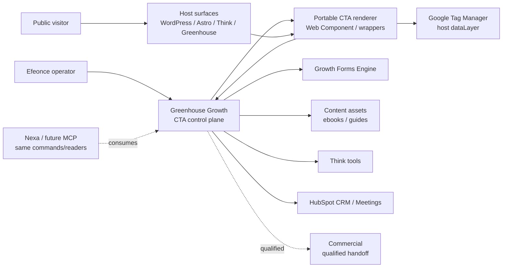
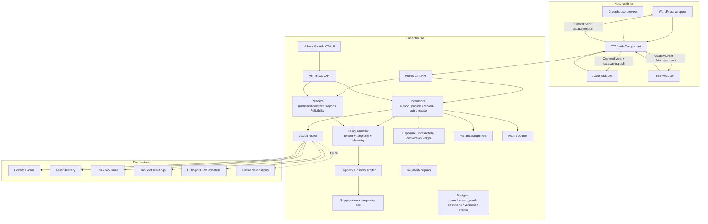

# Greenhouse Growth CTA & Popup Engine Architecture V1

> Tipo de documento: arquitectura de producto/plataforma  
> Status: Accepted direction -- no runtime changes yet  
> Version: V1  
> Fecha: 2026-07-04  
> Owner: Product / Platform Architecture / Growth / Marketing Operations / CRO  
> ADR: `GREENHOUSE_GROWTH_CTA_POPUP_ENGINE_DECISION_V1.md`  
> Domain: `growth` (`GREENHOUSE_GROWTH_DOMAIN_ARCHITECTURE_V1.md`)  
> Runtime contract: `greenhouse-growth-cta-popup.v1` (planned)

## 1. Purpose

This document defines the target architecture for a Greenhouse-owned CTA and popup engine that can render high-quality conversion prompts across Greenhouse, Efeonce public site, Think and future surfaces.

Canonical flow:

```text
Greenhouse CTA definition
  -> published targeting + render contract
  -> portable renderer
  -> eligibility / priority / suppression
  -> GTM dataLayer event + Greenhouse event ledger
  -> governed action
  -> Growth Form / asset / Think tool / meeting / HubSpot handoff
```

The core decision:

```text
Greenhouse owns CTA policy, rendering contract, actions and evidence;
public surfaces host the prompt;
HubSpot/GTM/GA are destinations or measurement surfaces, not the source of truth.
```

## 2. Product thesis

CTAs and popups are not decorative marketing widgets. In Growth they are CRO primitives:

- lead magnet discovery and download;
- context-aware next step after public reports;
- route to Think tools;
- launch or embed Growth Forms;
- book meetings;
- capture campaign intent;
- test value proposition, social proof and friction reduction;
- preserve first-party conversion evidence before Commercial handoff.

The engine must support enterprise CRO without dark patterns. A good CTA reduces uncertainty, improves relevance, clarifies value and invites a useful next step. A bad CTA interrupts the user, inflates vanity metrics or burns trust.

## 3. Archetype

Primary archetype: **B2B SaaS multi-tenant + public acquisition surface**.

Dominant risk: internet-facing conversion prompts can degrade trust, privacy, accessibility and measurement quality if targeting, suppression and telemetry are page-local.

Secondary archetypes:

- **Headless content/public site**: renderers live in WordPress, Astro, Think and future runtimes.
- **Internal tool/admin**: operators author, review, publish, pause and inspect CTAs.
- **Event-driven/retry workflow**: actions and destination handoffs need audit, retries and reconciliation.
- **Experimentation platform**: variants require stable assignment and honest statistical interpretation.

## 4. System context



## 5. Container view



## 6. Source-of-truth boundaries

| Concern | Source of truth | Notes |
| --- | --- | --- |
| Public page route/content | Host surface | WordPress/Astro/Think owns placement in the page, not CTA logic. |
| CTA definition/version | Greenhouse Growth | Copy refs, visual kind, placement, action, lifecycle. |
| Targeting/suppression policy | Greenhouse Growth | Compiled server-side; public renderer receives only safe rules. |
| Published render contract | Greenhouse Growth | Immutable browser-safe contract. |
| Portable renderer package | Greenhouse Growth | Framework-light; wrappers adapt host loading. |
| Form schema/submissions | Growth Forms | CTA can open/embed a form but never owns form fields/validation. |
| Internal conversion evidence | Greenhouse Growth | Exposure/interaction/action ledger. |
| GTM/GA4 events | Host GTM container | Measurement surface, not canonical policy. |
| CRM identity/lifecycle | HubSpot | Receives routed outcomes; does not own CTA engine. |
| Qualified revenue motion | `commercial` | Starts after explicit handoff/acceptance. |

## 7. Canonical placement

| Concern | Value |
| --- | --- |
| Module key | `growth` |
| Subdomain | `growth.cta` |
| PostgreSQL schema | `greenhouse_growth` |
| TypeScript root | `src/lib/growth/ctas/` |
| Public API family | `/api/public/growth/ctas/**` |
| Admin API family | `/api/admin/growth/ctas/**` |
| Admin UI family | `/admin/growth/ctas` |
| Capability prefix | `growth.cta.*` |
| Event prefix | `growth.cta.*` |
| Signal prefix | `growth.cta.*` |
| Contract prefix | `greenhouse-growth-cta-popup-*` |

Do not place this under `public_site`, `commercial`, `platform` or `growth.forms`. Those are consumers/participants.

The versioned runtime contract id is `greenhouse-growth-cta-popup.v1`; `greenhouse-growth-cta-popup-*` is the contract family prefix. Both refer to the same contract lineage.

## 8. Terminology

| Term | Meaning | Examples |
| --- | --- | --- |
| `cta_definition` | Durable identity of a CTA/campaign prompt. | `ai_visibility_report_followup`, `ebook_demand_gen_banner`. |
| `cta_version` | Immutable shape/policy of a published CTA. | Copy, placement, style, action, targeting, analytics. |
| `placement` | How the prompt appears. | `embedded`, `sticky_banner`, `slide_in`, `popup_modal`, `floating_button`, `inline_banner`. |
| `trigger` | Condition that makes the CTA eligible. | route, scroll, time, click, exit-intent desktop, form success, UTM, report state. |
| `surface` | Runtime where the CTA appears. | WordPress public site, Think, Greenhouse preview. |
| `action` | What happens when the visitor acts. | open form, download ebook, open Think tool, book meeting. |
| `suppression` | Why it should not appear. | dismissed, frequency cap, converted, no consent, lower priority. |
| `variant` | Experiment or message/design alternative. | value prop A vs B, banner vs slide-in. |

## 9. Core domain model

### 9.1 Aggregate: `cta_definition`

Fields:

- `cta_id`
- `slug`
- `name`
- `purpose`
- `owner_team`
- `campaign_slug`
- `status`
- `default_locale`
- `created_by`, `created_at`

Rules:

- `slug` is stable and used by embeds/admin references.
- Deleting is archival once events exist.
- One definition can have many versions.

### 9.2 Aggregate: `cta_version`

Fields:

- `cta_version_id`
- `cta_id`
- `version`
- `status`: `draft | review | published | paused | deprecated | archived`
- `locale`
- `placement`
- `style_variant`
- `copy_refs_json`
- `content_json`
- `visual_asset_ref`
- `action_policy_json`
- `targeting_policy_json`
- `suppression_policy_json`
- `priority_policy_json`
- `analytics_policy_json`
- `experiment_policy_json`
- `published_at`

Rules:

- Published versions are immutable.
- Copy should reference canonical copy when reusable.
- Public content must not expose internal campaign notes, scoring logic, destination mapping or PII.

### 9.3 Aggregate: `cta_surface_binding`

Fields:

- `surface_id`
- `surface_kind`: `wordpress | astro | think | nextjs | generic_html`
- `origin_allowlist`
- `allowed_cta_slugs`
- `embed_key_id`
- `renderer_channel`: `stable | beta | preview`
- `status`: `active | paused | archived`

Rules:

- Public calls validate surface binding and origin.
- The same CTA can render on multiple surfaces with separate rollout and telemetry.
- Surface controls where a CTA can render; action policy controls what it can do.

### 9.4 Event evidence — two tiers, not one table

CTA events span two very different volume/trust profiles and **must not** live in a single Postgres table. `eligible`, `suppressed` and `viewed` fire on nearly every public pageview (high cardinality, low individual value, browser-reported → untrusted). `clicked`, `action_started`, `action_completed`, `form_submitted` are conversion evidence (low volume, audit-grade). Collapsing both into one synchronous append-only Postgres table breaks the dual-store posture (PG = OLTP, BQ = analytical) and inflates `greenhouse_growth` without bound. This mirrors the Growth Forms decision: the server conversion ledger is authoritative and small; behavioral exposure is analytical.

**Tier A — conversion evidence ledger (`cta_conversion_event`, Postgres, audit-grade).**

Low-volume, server-attributable outcomes only. Append-only in `greenhouse_growth`.

Event kinds: `clicked`, `action_started`, `action_completed`, `form_opened`, `form_submitted`, `dismissed`, `error`.

Fields:

- `event_id`
- `cta_id`, `cta_version_id`
- `surface_id`, `page_uri`, `placement`, `trigger`, `variant_id`, `action_kind`
- `visitor_key_hash`, `session_key_hash`
- `consent_state`, `consent_source`
- `utm_json`, `referrer_domain`
- `trust_level`: `browser_reported | server_confirmed`
- `event_payload_json` (allowlisted, no raw PII)
- `created_at`

**Tier B — exposure telemetry (`cta_exposure`, high-volume analytical).**

`eligible`, `suppressed`, `viewed` and other exposure signals. These do **not** land synchronously in OLTP Postgres. V1 options, decided at foundation time (do not defer silently):

1. Route through the outbox → BQ analytical sink (preferred if the exposure rate is bounded), OR
2. Emit into the future Tracking Engine envelope (`greenhouse-tracking-events.v1`) once it is accepted/runtime, OR
3. Sample and aggregate at the edge/renderer before ingest when raw exposure volume would overwhelm the sink.

Until the Tracking Engine is runtime, V1 owns a thin, rate-limited, **sampled** exposure ingest and writes aggregates, never one PG row per pageview.

Rules (both tiers):

- Both ledgers are append-only; no `UPDATE`/`DELETE` (supersede/aggregate only).
- PII is never allowed in browser telemetry or any event payload.
- **Browser-reported events are untrusted for experiment interpretation.** Only `trust_level='server_confirmed'` outcomes (server-confirmed via §9.5 `cta_action_attempt`, or joined to a Growth Forms server-accepted submission) count toward experiment primary metrics and conversion truth. Browser `clicked`/`viewed` are directional telemetry, not conversion authority.
- If a Growth Form submission happens, the **form submission ledger remains conversion authority**; the CTA stores only the relationship (submission id join).
- Retention is explicit and different per tier: conversion evidence is long-lived/audit-grade; raw exposure is short-lived and superseded by aggregates.

### 9.5 Aggregate: `cta_action_attempt`

Tracks action delivery/routing when action requires server confirmation.

Examples:

- gated ebook access;
- Growth Form launch/submit relationship;
- HubSpot handoff;
- meeting link resolution;
- Think tool route generation.

Fields:

- `attempt_id`
- `event_id`
- `action_kind`
- `destination_ref`
- `status`: `pending | succeeded | failed | skipped | dead_lettered`
- `idempotency_key`
- `error_code`
- `created_at`, `completed_at`

## 10. Placement and interaction contract

V1 placement families:

| Placement | Use when | Contract |
| --- | --- | --- |
| `embedded` | CTA lives in content flow. | No overlay; keyboard path follows DOM order. |
| `inline_banner` | Section-level prompt. | Non-modal; no focus trap. |
| `sticky_banner` | Persistent offer at top/bottom. | Dismissible; safe-area aware; no content overlap. |
| `slide_in` | Contextual secondary prompt. | Non-blocking; collision-safe; mobile cautious. |
| `popup_modal` | High-intent or gated offer. | Modal semantics, focus trap, close/escape, frequency cap. |
| `floating_button` | Persistent helper/CTA launcher. | Small affordance; never blocks content; target size accessible. |

Hard rules:

- No stacked CTAs. The priority arbiter chooses one active interruptive prompt per page/session.
- No false scarcity, countdown resets, confirmshaming, hidden close controls or pre-checked opt-ins.
- Exit-intent is desktop-only and must be frequency-capped.
- Mobile popups must be rare, dismissible and must not cover essential form fields or navigation.
- Reduced motion must preserve final state and meaning.

## 11. Targeting, suppression and priority

Targeting inputs allowed in V1:

- route/page pattern;
- surface id;
- UTM/campaign/source/medium/content;
- referrer domain;
- device class and viewport family;
- scroll depth;
- time on page;
- click trigger;
- Growth Form outcome;
- public report state or Think tool state;
- prior CTA dismissal/conversion state;
- consent state;
- coarse segment flags explicitly passed by host surface.

Targeting inputs forbidden in V1:

- raw email, name, phone, RUT or direct personal identifiers;
- inferred sensitive attributes;
- opaque third-party audience segments without documented consent;
- DOM scraping of arbitrary page text for personalization.

Suppression policy:

- dismissed by visitor;
- converted via this CTA/action;
- frequency cap exceeded;
- priority loser against a higher-priority CTA;
- missing consent for a targeting/measurement rule;
- surface not authorized;
- unsupported viewport/placement combination;
- experiment mutual exclusion.

Priority policy:

```text
eligibility -> suppression -> mutual exclusion -> priority score -> placement constraints -> render
```

**Arbitration is a server-side decision, not a client one.** Following the same reasoning that rejects Alternative D (browser-only policy), the priority arbiter runs in Greenhouse. The renderer asks *"what should show on this surface + route + visitor context?"* and receives the resolved answer: at most **one** interruptive prompt plus N non-interruptive placements. The browser never receives the full candidate set or the priority policy — that would leak targeting logic and drift toward per-surface snippets. The public read endpoint returns the already-arbitrated render contract(s).

**Visitor state store.** Suppression ("already dismissed", "already converted", frequency cap) requires per-visitor state keyed on `visitor_key_hash`/`session_key_hash`. This is a hot public read on every eligibility check, so it must be served fast (edge/cache friendly, short-TTL) and be pseudonymous (hashes only, no PII, consent-gated). It is a first-party, cookie/consent-based state — never a third-party audience segment. Cache TTL is bounded so a paused/killed CTA stops appearing within the kill-switch window (§16).

## 12. Action routing

Supported action kinds:

| Action | Owner | Notes |
| --- | --- | --- |
| `link_url` | CTA engine | External/internal URL with UTM governance. |
| `download_asset` | CTA engine + asset registry | Gated or ungated ebooks/guides; no raw file URLs if gated. |
| `open_growth_form` | Growth Forms | CTA opens an existing form contract. |
| `embed_growth_form` | Growth Forms | CTA displays a form in-place/modal; form owns submit. |
| `open_think_tool` | Think + CTA engine | Routes to tools with campaign context. |
| `book_meeting` | HubSpot Meetings | Link destination; no CRM mutation by click alone. |
| `hubspot_handoff` | HubSpot adapter | Server-side, audited, bounded. |
| `dismiss` | CTA engine | Records suppression. |

Rules:

- The CTA engine never duplicates Growth Form field schema, validation or consent.
- Ebook/download access can be conditioned on a Growth Form submission, but the form remains the conversion authority.
- Think routes receive campaign context, not raw PII.
- HubSpot handoff is explicit and bounded; no silent deal creation.

## 13. Telemetry contract

The renderer emits both browser events and server-side evidence.

Browser event shape:

```js
window.dataLayer = window.dataLayer || []
window.dataLayer.push({
  event: 'greenhouse_cta_viewed',
  cta_id: '...',
  cta_version_id: '...',
  cta_slug: '...',
  campaign_slug: '...',
  surface_id: '...',
  placement: 'popup_modal',
  trigger: 'scroll_depth',
  variant_id: 'control',
  action_kind: 'open_growth_form'
})
```

Canonical browser events:

- `greenhouse_cta_eligible`
- `greenhouse_cta_suppressed`
- `greenhouse_cta_viewed`
- `greenhouse_cta_dismissed`
- `greenhouse_cta_clicked`
- `greenhouse_cta_action_started`
- `greenhouse_cta_action_completed`
- `greenhouse_cta_form_opened`
- `greenhouse_cta_form_submitted`
- `greenhouse_cta_error`

Telemetry rules:

- No raw PII in `dataLayer`, `CustomEvent.detail`, logs or query strings.
- Event/property names are stable and snake_case.
- **The two event namespaces are deliberate, not to be "harmonized":** browser/host-facing events use `greenhouse_cta_*` (dataLayer/GTM); internal event, signal and capability keys use `growth.cta.*`. They serve different consumers (host measurement vs internal outbox/policy) and must not be collapsed.
- **Browser events are directional, not authoritative.** Experiment primary metrics and conversion truth read only server-confirmed outcomes (§9.4). GTM is a measurement/activation surface; Greenhouse remains the policy/evidence source.
- If `GREENHOUSE_TRACKING_ENGINE_ARCHITECTURE_V1.md` becomes accepted/runtime, CTA events should route into its envelope instead of inventing a parallel behavioral warehouse.
- CTA events must reconcile with Growth Forms submission IDs where a CTA opens or embeds a form.

## 14. Experimentation contract

> **V1 scope:** this contract governs experimentation **when it is built**, which is **deferred out of V1** (§18). V1 records variant metadata and emits events only; the powered assignment/SRM/guardrail engine graduates later (candidate `growth.experiment`). No CTA winner may be declared until then.

The engine may assign variants; it must not overclaim experiment results.

Required experiment fields:

- `experiment_id`
- `hypothesis`
- `primary_metric`
- `guardrail_metrics`
- `unit_of_randomization`
- `allocation`
- `mde`
- `sample_size_plan`
- `start_at`, `stop_at`
- `decision_rule`

Rules:

- If traffic is insufficient for a powered A/B test within a reasonable window, ship as a high-confidence CRO change or run qualitative research instead.
- Variant assignment must be stable per chosen unit.
- Sample ratio mismatch is a blocking finding for result interpretation.
- Winning a click metric is not enough if lead quality, form completion, meeting quality or downstream revenue guardrails degrade.

## 15. UI, motion and accessibility

Admin UI:

- Use `CompositionShell` as the default surface substrate.
- Use `AdaptiveSidecarLayout` for inspect/review/publish context.
- Use `GreenhouseFloatingSurface` for anchored previews, validation bubbles and action menus.
- Use canonical breadcrumbs/buttons/chips/copy.
- Create wireframe/flow/motion contracts before JSX for material UI.

Portable public renderer:

- Framework-light Web Component/custom element as default.
- Thin wrappers for WordPress, Astro, Think and Greenhouse preview.
- No MUI/Vuexy dependency in public renderer.
- Design tokens are compiled into a public renderer token layer; do not hardcode visual values per page.

Motion:

- Hover/focus/press use CSS Tier 1/token motion.
- Popup/slide-in enter/exit use short, placement-aware motion; no theatrical choreography.
- Reduced motion removes transform/animation and preserves visible state.
- GSAP is not used for ordinary CTA microinteractions.

Layout stability and Core Web Vitals:

- Injected banners/slide-ins **must not cause layout shift**. Reserve space or animate via `transform`/overlay so the host page CLS is not degraded — the CTA engine shares public surfaces with the SEO/AEO work, which is CLS-sensitive. Reuse the Growth Forms renderer's skeleton anti-CLS precedent (`src/growth-forms-renderer/styles.ts`).
- **Mobile intrusive-interstitial guideline is a targeting constraint, not just a taste rule.** Interruptive `popup_modal` on mobile is penalized by search engines and hostile to users; exit-intent is desktop-only (§10) and mobile interruptive placements are restricted by policy, dismissible, and never cover essential content, forms or navigation.

Preview parity:

- The admin/preview renderer (MUI `GreenhouseFloatingSurface`) and the public renderer (framework-light Web Component) are two implementations of the same contract. A **render-contract parity test** must assert preview and public render the same governed contract (replicate `src/lib/growth/forms/__tests__/renderer-contract-parity.test.ts`). Preview fidelity must not silently diverge from production.

Accessibility:

- Popup modal uses correct dialog semantics, focus trap, close button, escape dismissal and focus return.
- Non-modal banners/slide-ins do not claim `aria-modal`.
- Every interactive control has an accessible name and visible focus.
- Dismissal must be keyboard accessible.
- CTA content must not depend on color, animation or image-only text.

## 16. Security, privacy and compliance

- Public endpoints validate surface, origin/embed key and allowed CTA slug.
- Renderer contracts expose only browser-safe fields.
- No secrets, provider mappings or HubSpot internals are sent to the browser.
- Event ingestion is rate-limited and idempotent where practical.
- Visitor/session identifiers are pseudonymous hashes; raw identifiers do not enter telemetry.
- Retention policy is explicit for event and suppression records (per-tier, §9.4).
- Chile Ley 21.719/GDPR-style posture applies to PII and consent.

### 16.1 The public ingest is a forgeable write — treat it as untrusted

The embed key lives in the browser, so it authenticates the **surface**, not the **visitor**. Anyone can read it and forge `viewed`/`clicked`/`action_completed` events. Left undefended, forged events inflate the ledger and — worse — poison experiment interpretation (fake conversions, broken SRM). Defense in depth:

- The public ingest endpoint validates surface binding, origin allowlist and embed key, and **cross-checks** that the reported `cta_version` actually targets the reported `surface_id` (reject mismatches).
- Rate-limit and idempotency-key per visitor/session hash; drop implausible bursts.
- Basic bot/abuse filtering on the ingest path; suspicious traffic is flagged, not counted.
- **Conversion truth never trusts the browser.** Only `trust_level='server_confirmed'` outcomes (§9.4/§9.5) or Growth Forms server-accepted submissions count as conversions or feed experiment primary metrics. `clicked`/`viewed` remain directional.
- Signal `growth.cta.surface_unauthorized_attempt` (§17) surfaces forged/unauthorized ingest attempts.

### 16.2 Consent state — source of truth is declared, not implied

`consent_state` gates tracking/personalization rules, but V1 must declare **where consent comes from** (field `consent_source` on events). CTA exposure telemetry has its own consent basis — it does **not** inherit a Growth Forms submission consent (that consent covers form submission, not popup tracking). V1 reads consent from the host consent surface (e.g. GTM consent mode / host CMP) passed explicitly by the wrapper, and records `consent_source`. When consent is absent for a tracking/personalization rule, the rule is suppressed (§11), not silently applied.

### 16.3 Global kill switch (blast-radius control)

A public interruptive-popup engine needs an emergency stop faster than a redeploy. Beyond per-version `paused` and per-surface `paused`, V1 must provide a **global/per-surface emergency disable** that the renderer honors within a bounded window (tied to the render-contract cache TTL, §11). If a CTA breaks accessibility, covers content, or triggers a consent incident on the public site, an operator can take it down sub-minute without shipping code. This is a hard requirement, not an enhancement.

## 17. Reliability and observability

Initial signals:

- `growth.cta.render_error_rate`
- `growth.cta.event_ingest_error_rate`
- `growth.cta.event_ingest_backpressure` (exposure ingest volume vs sink capacity; detects the §9.4 Tier B overflow risk)
- `growth.cta.action_failed`
- `growth.cta.surface_unauthorized_attempt` (forged/unauthorized ingest, §16.1)
- `growth.cta.gtm_event_missing`
- `growth.cta.form_handoff_failed`
- `growth.cta.experiment_srm_detected`
- `growth.cta.priority_collision`
- `growth.cta.kill_switch_active` (steady = 0; non-zero means an emergency disable is live and should be visible, §16.3)

Operational dashboards should answer:

- Which CTAs are live by surface/campaign?
- Which prompts are suppressed and why?
- Which actions are failing?
- Which CTAs drive form submissions, downloads, meetings or Think tool starts?
- Which experiments have enough evidence to interpret?

## 18. MVP sequencing

**Vertical slice first, not a horizontal platform.** The self-critique (§19) warns against building the platform before the first user. A pure backend-foundation phase with no visible renderer builds a large speculative surface before a single real CTA renders. Instead, V1 proves **one real CTA end-to-end**, then widens. The slice is thin on the *placement* and *action* axes — but it is **not** thin on **portability**, which is the engine's thesis (rejecting Alternative B / page-local snippets). A slice that renders on a single surface would not prove the engine.

**First surfaces are co-equal: the live public WordPress site AND Think.** Both are first-class V1 surfaces, not a surface followed by a deferred one. The renderer proves the *same published contract* rendering on both hosts (mirrors the Growth Forms precedent TASK-1231: WordPress first host + Astro/Think parity wrapper).

1. **Vertical slice (thin on placement/action, honest on portability):** one real CTA rendered from a single published immutable contract on **both** the public WordPress host **and** Think, with **one** action (`open_growth_form`) and **one** embedded/banner placement, end-to-end — minimal `cta_definition`/`cta_version`, surface bindings for both surfaces, server-side arbitration, Tier A conversion ledger, GTM/dataLayer events, one reliability signal, preview↔public parity + GVC/Playwright evidence. This forces the whole spine (compile → arbitrate → render → event → action) through real user paths on two different host runtimes.
2. **Widen the placement axis:** add one interruptive placement (`popup_modal` or `slide_in`) with full a11y/motion/CLS contract, on the surfaces already wired.
3. **Exposure tier + suppression at scale:** Tier B exposure ingest (sampled/BQ per §9.4), visitor-state store, frequency capping, kill switch.
4. **Action breadth:** `embed_growth_form`, `download_asset`, `book_meeting`, bounded `hubspot_handoff`.
5. **Admin cockpit:** `/admin/growth/ctas` author/review/publish/pause/report, Composition Shell + sidecar, preview-parity test.

**Experimentation is explicitly deferred out of V1.** As §14 concedes, if public traffic is underpowered a powered A/B test is not viable; building the full assignment/SRM/guardrail layer before there is traffic to test is premature. V1 ships high-confidence CRO changes and records variant metadata only; the powered-experiment engine graduates to a later phase (candidate `growth.experiment` split, §19). Until then, no CTA "winner" may be declared.

## 19. Self-critique

### What breaks in 12 months?

If many CTAs launch without priority/suppression discipline, public pages become noisy and conversion quality drops. Mitigation: one interruptive CTA per page/session, strict suppression reports and CRO governance.

### What breaks in 36 months?

If personalization grows beyond coarse context, `growth.cta` may become a segmentation/experimentation platform. Mitigation: split `growth.experiment` or `growth.personalization` when rules become shared across more capabilities.

### Cognitive debt risk

The system spans Growth Forms, public site, Think, GTM, HubSpot and future Tracking Engine. The docs must keep diagrams, event taxonomy and source-of-truth boundaries current or agents will recreate snippets per surface.

### Lock-in

GTM is a measurement surface, not a runtime dependency. HubSpot is a destination, not source of truth. The portable renderer avoids lock-in to WordPress or Astro.

### Observability gaps

Browser dataLayer pushes can be blocked or misconfigured. Greenhouse needs server-side event evidence and a `gtm_event_missing`/smoke workflow to detect broken tags.

### Privacy/compliance gap

Targeting and personalization can drift into sensitive profiling. V1 only allows coarse, consent-aware inputs and forbids raw PII/sensitive attributes in targeting.

## 20. Hard rules (NUNCA / SIEMPRE)

- **NUNCA** almacenar exposición de alto volumen (`eligible`/`suppressed`/`viewed`) como filas OLTP síncronas en Postgres — va a la Tier B analítica/sampleada (§9.4). El ledger PG es solo evidencia de conversión audit-grade.
- **NUNCA** tratar un evento browser (`clicked`/`viewed`/`action_completed` reportado por el cliente) como verdad de conversión ni como métrica primaria de experimento. Solo `server_confirmed` o submission server-aceptada de Growth Forms cuentan (§9.4/§16.1).
- **NUNCA** arbitrar prioridad o resolver suppression en el cliente. La arbitración es server-side; el renderer recibe 0–1 interruptivo + N no-interruptivos ya resueltos (§11).
- **NUNCA** duplicar schema/validación/consent de Growth Forms dentro del motor de CTA — el CTA abre/embebe un form; el form es la autoridad de submit (§12).
- **NUNCA** enviar secretos, mapeos de provider o internals de HubSpot al browser; el render contract expone solo campos browser-safe.
- **NUNCA** aplicar una regla de tracking/personalización sin `consent_state` válido y `consent_source` declarado (§16.2).
- **NUNCA** declarar un "winner" de CTA sin métrica primaria, MDE/sample-size, guardrails y chequeo SRM (§14); experimentación powered está diferida fuera de V1 (§18).
- **NUNCA** shippear un placement interruptivo sin dialog semantics, focus trap/return, escape, dismissal por teclado, reduced-motion y anti-CLS (§15).
- **SIEMPRE** proveer kill switch global/por-surface que el renderer honra dentro del TTL del contrato (§16.3).
- **SIEMPRE** cross-check `cta_version ↔ surface_id` en el ingest público y emitir `growth.cta.surface_unauthorized_attempt` ante mismatch (§16.1).
- **SIEMPRE** mantener paridad preview↔público con un test de contrato (§15), replicando `renderer-contract-parity.test.ts` de Growth Forms.
- **SIEMPRE** exponer cada capability vía contrato gobernado (Full API Parity): un primitive, muchos consumers (UI, Nexa, MCP, CLI).

## 21. Delta 2026-07-04 — hardening review

Revisión de arquitectura + product design sobre el ADR/spec aceptados. Cambios incorporados:

- **Event ledger partido en dos tiers** (§9.4): conversión audit-grade en PG vs exposición alto-volumen analítica/sampleada — alinea con el dual-store (PG OLTP / BQ analítico) y cierra el gap de scalability.
- **Ingest público tratado como write forjable** (§16.1): cross-check version↔surface, bot filtering, y `trust_level` server-confirmed como única autoridad de conversión/experimento — cierra el gap de integridad de experimentos (SRM envenenado).
- **Arbitración server-side + visitor-state store** explícitos (§11).
- **Consent SoT declarado** (`consent_source`, §16.2) y **kill switch global** como requisito duro (§16.3).
- **CLS/anti-shift, constraint de interstitial móvil y test de paridad preview↔público** (§15); señales de backpressure y kill switch (§17).
- **Secuenciación reescrita a vertical-slice-first** contra el reporte AI Visibility en Think; **experimentación powered diferida fuera de V1** (§18).
- Namespaces `greenhouse_cta_*` (browser) vs `growth.cta.*` (interno) declarados deliberados (§13); naming de contrato aclarado (§7).

Sin cambios de runtime, migraciones, GTM ni deploy autorizados por esta revisión.

## 22. Related documents

- `GREENHOUSE_GROWTH_CTA_POPUP_ENGINE_DECISION_V1.md`
- `GREENHOUSE_GROWTH_DOMAIN_ARCHITECTURE_V1.md`
- `GREENHOUSE_GROWTH_PUBLIC_FORMS_ENGINE_ARCHITECTURE_V1.md`
- `GREENHOUSE_TRACKING_ENGINE_ARCHITECTURE_V1.md`
- `GREENHOUSE_FULL_API_PARITY_DECISION_V1.md`
- `GREENHOUSE_FLOATING_SURFACE_DECISION_V1.md`
- `docs/context/08_estrategia-comercial.md`
- `docs/context/11_hubspot-bowtie.md`
