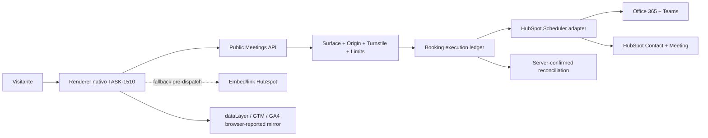
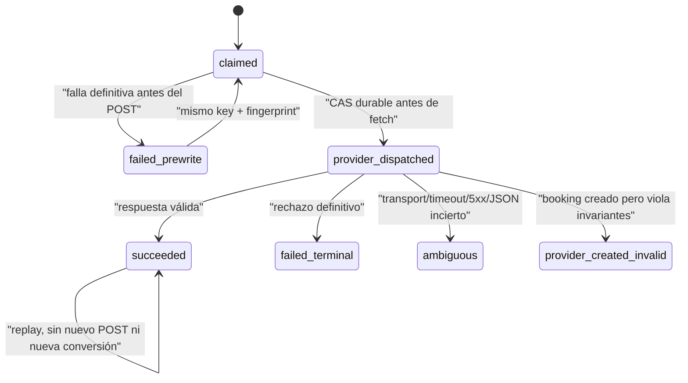
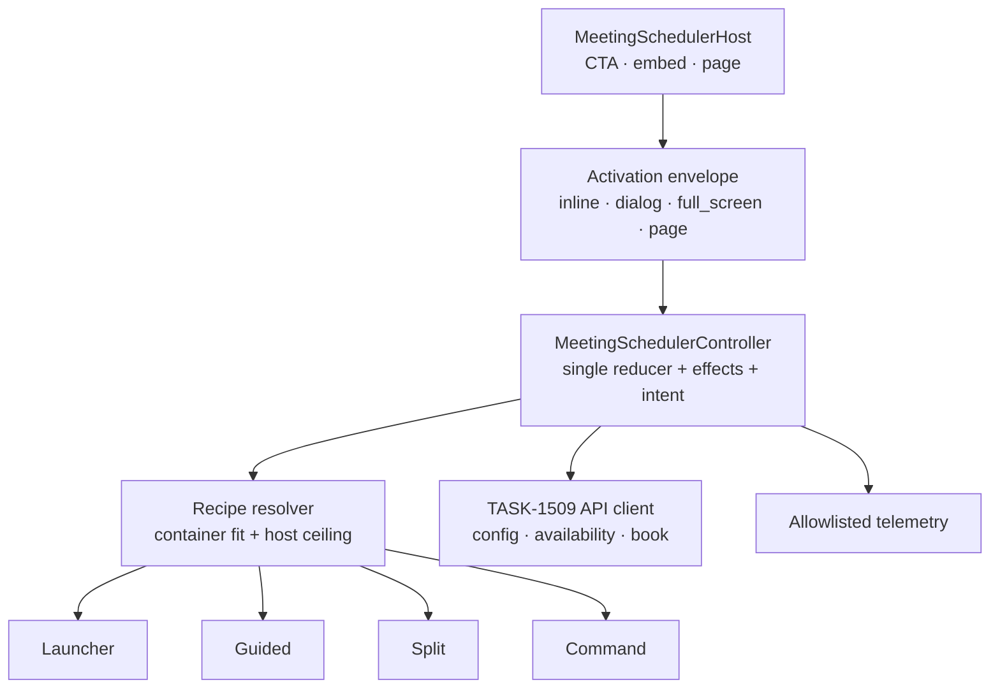

# GREENHOUSE GROWTH MEETINGS SCHEDULER ARCHITECTURE V1

## Architecture Decision 2026-07-21 — Scheduler nativo con boundary seguro y fallback HubSpot

- Status: Accepted
- Date: 2026-07-21
- Owner: Growth / Public Site / CRM / Data
- Scope: `src/lib/growth/meetings/**`, `/api/public/growth/meetings/**`, `greenhouse_growth.meeting_*`, GTM/GA4 meeting contract
- Reversibility: two-way
- Confidence: high para el rail Efeonce de un organizador; medium para configuraciones HubSpot multiusuario no verificadas
- Validated as of: 2026-07-21, Scheduler API `2026-03` y scheduling page `efeoncepro/agenda-discovery`
- Implements: TASK-1509; consumed by TASK-1510

### Context

TASK-1366 probó una reserva real con HubSpot, Office 365, Teams, Contact y Meeting. El embed existente funciona, pero no ofrece la composición visual ni el funnel gobernado que requiere Efeonce. Exponer Scheduler API al browser filtraría el private-app token y dejaría duplicados, abuso, consentimiento y degradación sin autoridad server-side.

La escritura externa no es transaccional ni documenta idempotencia nativa. Un timeout después de enviar el POST puede haber creado la reunión aunque Greenhouse no reciba respuesta. Por eso el scheduler no puede modelar todo fallo como reintentable.

### Decision

Greenhouse ofrece un contrato provider-neutral, con HubSpot Scheduler como adapter inicial y fuente de verdad de configuración, disponibilidad y reserva. El browser sólo consume DTOs allowlisted. La scheduling page y el iframe/link oficial continúan como fallback y rollback.

La idempotencia usa un ledger dedicado `greenhouse_growth.meeting_booking_execution`; no reutiliza `greenhouse_core.api_platform_command_executions`. El ledger genérico no admite una principal pública anónima, su CHECK no admite lane `public` y su estado `failed` se puede reclamar, lo que sería inseguro después de un write ambiguo.

La autoridad de host reutiliza `greenhouse_growth.form_host_surface` y su allowlist de origin mediante `meeting_surface_binding`. Esto evita un tercer registry de origins; el naming form-specific queda como deuda explícita para una futura generalización de public surfaces.

### Runtime Contract

- `GET config`: configuración browser-safe, sin link/user/provider IDs.
- El config incluye sólo la site key pública y action fija de Turnstile; el secret permanece server-side. Sin site key, el estado es `fallback_only`.
- `GET availability`: slots normalizados y acotados; no se persiste un calendario paralelo.
- `POST verify-email`: adapter browser-safe y rate-limited que reutiliza la política y datasets canónicos de
  Growth Forms para feedback debounced. Requiere la misma surface/origin; nunca es la autoridad final.
- `POST book`: valida shape, surface/origin, Turnstile, límites, slot fresco, consentimiento e idempotencia antes de un único POST provider.
- `POST book` reejecuta el gate corporativo después de autorizar la surface y antes de Turnstile, lectura de
  disponibilidad, claim o write. Correo personal/desechable falla cerrado como `validation_failed`; una falla del
  verificador degrada al fallback y nunca concede una aprobación implícita.
- La zona de presentación/reserva es la IANA detectada en el navegador. `defaultTimezone` de la surface es sólo
  fallback seguro cuando la detección falla; nunca actúa como allowlist del visitante. Config, availability y book
  usan la misma zona canónica y el adapter exige equivalencia canónica de `bookingTimezone` en la respuesta.
- Sólo se aceptan nombres IANA válidos y acotados; aliases como `US/Pacific` se canonizan antes de comparar. Fechas
  date-only se preservan como fecha civil y horas repetidas por DST incluyen offset para seguir siendo inequívocas.
- El token se resuelve sólo por `src/lib/hubspot/access-token.ts`.
- El adapter tolera campos vendor aditivos pero falla cerrado si falta o cambia un campo utilizado.
- Éxito exige `isOffline=false`, slot/duración/timezone canónica exactos, `calendarEventId`, `contactId` y URL HTTPS con host exacto `teams.microsoft.com`.
- La UI no recibe provider IDs ni Teams URL; la invitación oficial es el canal de acceso a la reunión.

### State machine e idempotencia

- `Idempotency-Key` es requerido, 8–128 caracteres `[A-Za-z0-9_-]`, y se almacena sólo como HMAC.
- El request fingerprint cubre todos los campos semánticos normalizados, incluido consentimiento; no sólo email y slot.
- Una unique adicional por booking fingerprint bloquea un segundo key para la misma reserva cuando ya puede existir side effect.
- Sólo `failed_prewrite` es reclaimable automáticamente.
- `ambiguous` y `provider_created_invalid` requieren reconciliación humana/provider; no abren fallback automático porque eso puede duplicar la reunión.
- El receipt es aleatorio, se persiste sólo como hash y se entrega únicamente en la primera respuesta confirmada. Un replay conserva el outcome pero no vuelve a habilitar la emisión de conversión.
- No existe atomicidad distribuida entre PostgreSQL y HubSpot. El ledger reduce el riesgo mediante transiciones durables y fail-closed; no promete exactamente-once absoluto ante una caída posterior al provider y anterior al commit final.

### Security, privacy y threat model

| Amenaza | Control |
|---|---|
| Token/provider IDs en browser | adapter server-only + DTO closed allowlist |
| Reserva duplicada | claim atómico, booking fingerprint y cero retry POST |
| Timeout con outcome desconocido | estado `ambiguous`, reconcile-before-retry |
| Bypass de origin/CORS | surface activa + binding + Origin exacto; CORS no concede autoridad |
| Bots o burst concurrente | Turnstile con action/hostname + buckets PostgreSQL atómicos |
| Correo personal/desechable o bypass del browser | policy canónica Growth Forms + revalidación server-side pre-provider |
| Enumeración de email/IP | HMAC-SHA256 con secret versionado y domain separation |
| PII en logs/analytics | categorías cerradas; negative tests; no payload/body/provider message |
| Conversión forjada en consola | GA es mirror browser-reported; ledger server-confirmed es SoT de reconciliación |

El secret HMAC es obligatorio en producción. Los buckets de rate limit se consumen atómicamente en PostgreSQL; los wrappers COUNT→INSERT existentes de Forms/CTA no se reutilizan para este write crítico.

### Measurement contract

- Funnel no-conversión: `gh_meeting_step_reached` → evento GA4 custom del mismo nombre, nunca key event.
- `meeting_step`: `viewed|availability_loaded|availability_failed|date_selected|slot_selected|details_started|validation_failed|booking_started|booking_failed|fallback_opened`.
- Conversión: `gh_meeting_booking_confirmed` existe sólo en `dataLayer`; GTM lo transforma a `generate_lead` con `lead_source=meeting_booking` y no envía además el custom a GA4.
- `stage` se rechaza porque duplica `meeting_step` y permite pares contradictorios.
- Parámetros allowlisted: `meeting_step`, `scheduler_key`, `surface_id`, `placement`, `availability_state`, `days_ahead_bucket`, `time_of_day_bucket`, `error_category`; `renderer_version` y `contract_version` se validan en el renderer pero no requieren dimensión.
- Nunca se envían PII, slot/timestamp/timezone exactos, receipt, idempotency/correlation/provider IDs, Teams URL, UTMs crudos ni provider errors.
- El receipt evita éxito optimista en la implementación, pero no vuelve infalsificable el `dataLayer`. Reconciliación diaria compara `generate_lead(lead_source=meeting_booking)` contra `succeeded` server-side.
- GTM/GA4 sigue workspace → preview → confirmación humana explícita → publish → snapshot/live verification.

### Alternatives Considered

1. **Mantener sólo el iframe.** Seguro y simple, pero no logra la dirección Time Horizon ni un funnel propio consistente.
2. **Llamar Scheduler API desde el browser.** Rechazado por secreto, abuso, invariantes y ausencia de idempotencia.
3. **Reutilizar `api_platform_command_executions`.** Rechazado por principal/lane incompatibles, estados insuficientes y reclaim inseguro.
4. **Crear un registry de origins para meetings.** Rechazado; se reutiliza `form_host_surface` con binding específico.
5. **Usar click/slot como conversión.** Rechazado; sólo booking confirmado genera `generate_lead`.

### Consequences

- Beneficio: UI y medición propias sin reemplazar calendario/CRM/Teams de HubSpot.
- Costo: schema y reconciliación dedicados para una escritura externa no transaccional.
- Riesgo residual: una caída entre respuesta válida de HubSpot y commit final puede dejar `provider_dispatched`; se bloquea el retry y se resuelve por read-back/manual.
- Lock-in acotado: el contrato público es provider-neutral, pero el adapter V1 valida la configuración Efeonce `GROUP_CALENDAR` + Office 365 + Teams.
- No hay backfill. Rollback es flags OFF y fallback; nunca se elimina una reunión como rollback técnico.

### Rollout

1. Flags `GROWTH_NATIVE_MEETING_SCHEDULER_READ_ENABLED=false` y `GROWTH_NATIVE_MEETING_SCHEDULER_ENABLED=false` por defecto.
2. Contratos/provider y suites locales.
3. Schema additive + shadow de config/availability.
4. Booking controlado y replay con read-back HubSpot/Outlook/Teams.
5. TASK-1510 + GTM Preview, manteniendo fallback.
6. Pilot allowlisted; producción sólo tras evidencia y confirmaciones humanas de flag/GTM.

### Revisit When

- HubSpot publique idempotencia o status lookup por client key.
- Efeonce use round-robin/grupo con más de un organizador.
- `form_host_surface` se generalice a un registry canónico de public surfaces.
- Aparezca un segundo provider de scheduling.
- La reconciliación muestre GA > server o una tasa material de outcomes ambiguos.

## Architecture Decision 2026-07-21 — Adaptive presentation recipes

### Status and scope

- Status: `Accepted` for TASK-1510 implementation.
- Scope: presentation and host integration only. TASK-1509 remains the single booking, privacy, idempotency and receipt authority.
- Confidence: high for the separation of concerns; medium for the initial size thresholds until the public pilot is measured.
- Reversibility: recipe thresholds and host activation modes are two-way decisions. Duplicating booking state across independent renderers is rejected because it creates one-way product and measurement debt.

### Decision

The scheduler is one product capability with one controller and several presentation recipes. It does not scale a desktop composition down, and a compact Growth CTA never expands into a large inline application after activation.

Three independent axes replace a combinatorial `appearance` attribute:

1. **Domain phase:** availability, slot selection, details, pending, confirmed or recovery. This is the authoritative state machine and survives every layout change.
2. **Host activation mode:** `inline`, `dialog`, `full_screen` or `page`. The host owns placement, focus boundary and close behavior.
3. **Resolved layout recipe:** `launcher`, `guided`, `split` or `command`. The component resolves this from its container and available height; the host may set a maximum recipe but may not force overflow.

### Product recipes

Thresholds are initial hypotheses, expressed against the component container rather than the viewport. They must be tuned with GVC at real host widths and zoom levels.

| Recipe | Initial fit | Product behavior | Appropriate hosts |
|---|---:|---|---|
| `launcher` | below 320 px or collapsed CTA | Promise, duration/platform context and one action. No calendar and no availability fetch by default. | Narrow Growth CTA, banner, editorial rail |
| `guided` | 320–559 px | One task plane at a time: date → slots → details. A compact date strip leads the flow and “Ver mes” exposes the semantic month calendar. | Mobile/full-screen surface, narrow embed |
| `split` | 560–959 px | Month and selected-day agenda together; context compresses into an operational header. | Dialog, medium embed, tablet |
| `command` | 960 px+ with sufficient height | Context rail, month and agenda visible as the current Calendar Command Center. | Full-width section or dedicated page |

Pure CSS container queries own layout-only changes. A bounded `ResizeObserver` may select a different semantic recipe when the information architecture changes; it calls a pure resolver with hysteresis to avoid oscillation near a threshold. A resize never creates a new booking intent, emits a funnel step, clears form data or remounts provider/Turnstile effects.

### Growth CTA integration

- The CTA engine owns the launcher and task surface. The scheduler owns the booking flow inside it.
- `book_meeting` remains navigation-only under its current contract. Native activation requires a separately versioned adapter/action; it must not silently change existing CTA behavior.
- Narrow hosts open a bounded accessible dialog on desktop and a full-screen dialog on mobile. The parent CTA keeps its original dimensions.
- Wide editorial hosts may choose `inline`, but the recipe resolver still clamps the requested maximum to actual fit.
- The scheduler bundle and availability request load on activation or strong user intent, not on every collapsed CTA impression. Optional prefetch must respect Save-Data.
- Once the provider request is dispatched, closing hides rather than destroys the controller. Reopening exposes pending, check-email or terminal state and cannot silently produce a second intent.

### Controller and view contract

`MeetingSchedulerController` owns normalized config/availability, selected date and slot, attendee draft, stable idempotency key, command status, Turnstile lifecycle, telemetry dedupe and the server-confirmed receipt transition. Views are stateless projections with typed user intents:

- `LauncherView`
- `GuidedSchedulerView`
- `SplitSchedulerView`
- `CommandCenterView`
- shared `CalendarGrid`, `DateStrip`, `SlotAgenda`, `AppointmentSummary`, `BookingDetailsForm` and `RecoverySurface`

Recipes must not have separate reducers, API clients or booking commands. User-entered PII remains only in memory; presentation switching does not persist it to browser storage.

### Accessibility and motion

- The dialog envelope follows the modal-dialog focus contract: focus enters the surface, Tab remains contained, Escape closes when safe and focus returns to the invoker.
- Logical heading and reading order remain equivalent across recipes. Selected date, slot and focused control survive a recipe change.
- The compact recipe cannot hide bookable dates without a discoverable “Ver mes” path.
- Sticky actions must not obscure the focused element, errors, fallback or legal copy.
- Activation and phase changes use transform/opacity and directional motion only when forward/back semantics are real. Reduced motion uses an instant change or restrained crossfade.
- A tiny CTA never morphs spatially into the full scheduler; the envelope transition establishes the new task context first.

### Measurement amendment

Before GTM publish, add two safe, low-cardinality dimensions:

- `presentation_variant`: `launcher|guided|split|command`
- `activation_mode`: `inline|dialog|full_screen|page`

They describe exposure context, not identity. A recipe change is diagnostic state, not a funnel step. Funnel dedupe belongs to the controller and booking intent, so rerendering or resizing cannot emit `date_selected`, `slot_selected` or confirmation again. Defaulting to the first available date may aid display, but it must not emit `date_selected` until the user acts.

### Consequences and rejected alternatives

- **Benefit:** the same scheduler can live in Growth CTA, dialog, embedded content or a complete page without product forks.
- **Benefit:** host teams compose placement while booking correctness and analytics remain centralized.
- **Cost:** recipe resolution and focus continuity require explicit tests beyond ordinary responsive CSS.
- **Rejected:** shrinking the three-plane desktop view into a card; it preserves pixels, not usability.
- **Rejected:** expanding the CTA inline after click; it causes layout shift and turns a small host into an unexpected application.
- **Rejected:** independent compact and full scheduler components; their state, consent, idempotency and telemetry would drift.
- **Rejected:** viewport media queries as the primary resolver; an embedded component must respond to its containing surface.

### Verification matrix

Each recipe is captured at its lower bound, midpoint and one pixel around a threshold, plus 200% zoom where practical. GVC must verify keyboard flow, focus return, reduced motion, zero horizontal overflow, stable selection across resize and exactly-once telemetry. The current `appearance` observation without recipe consumption and full `replaceChildren` rendering are implementation gaps, not the target architecture.
