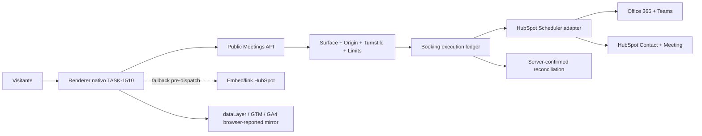
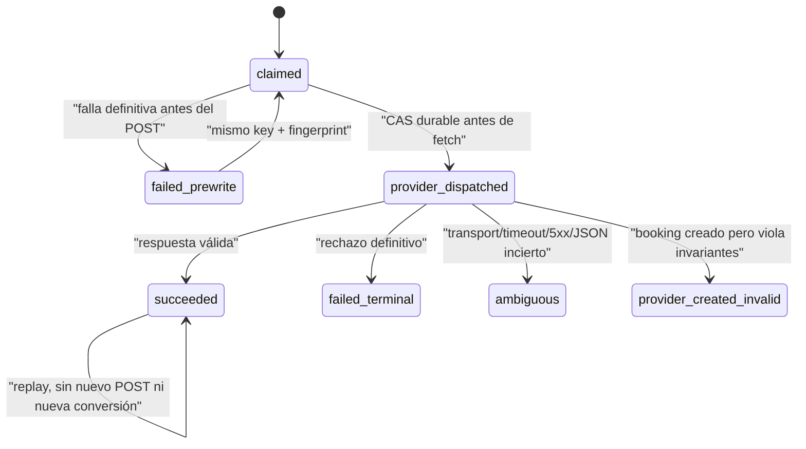

# GREENHOUSE GROWTH MEETINGS SCHEDULER ARCHITECTURE V1

## Architecture Decision 2026-07-21 — Scheduler nativo con boundary seguro y fallback HubSpot

- Status: Accepted
- Date: 2026-07-21
- Owner: Growth / Public Site / CRM / Data
- Scope: `src/lib/growth/meetings/**`, `/api/public/growth/meetings/**`, `greenhouse_growth.meeting_*`, GTM/GA4 meeting contract
- Reversibility: two-way
- Confidence: high para el rail Efeonce de un organizador; medium para configuraciones HubSpot multiusuario no verificadas
- Validated as of: 2026-07-21, Scheduler API `2026-03` y scheduling page `efeoncepro/agenda-discovery`
- Implements: TASK-1509; consumed by TASK-1510

### Context

TASK-1366 probó una reserva real con HubSpot, Office 365, Teams, Contact y Meeting. El embed existente funciona, pero no ofrece la composición visual ni el funnel gobernado que requiere Efeonce. Exponer Scheduler API al browser filtraría el private-app token y dejaría duplicados, abuso, consentimiento y degradación sin autoridad server-side.

La escritura externa no es transaccional ni documenta idempotencia nativa. Un timeout después de enviar el POST puede haber creado la reunión aunque Greenhouse no reciba respuesta. Por eso el scheduler no puede modelar todo fallo como reintentable.

### Decision

Greenhouse ofrece un contrato provider-neutral, con HubSpot Scheduler como adapter inicial y fuente de verdad de configuración, disponibilidad y reserva. El browser sólo consume DTOs allowlisted. La scheduling page y el iframe/link oficial continúan como fallback y rollback.

La idempotencia usa un ledger dedicado `greenhouse_growth.meeting_booking_execution`; no reutiliza `greenhouse_core.api_platform_command_executions`. El ledger genérico no admite una principal pública anónima, su CHECK no admite lane `public` y su estado `failed` se puede reclamar, lo que sería inseguro después de un write ambiguo.

La autoridad de host reutiliza `greenhouse_growth.form_host_surface` y su allowlist de origin mediante `meeting_surface_binding`. Esto evita un tercer registry de origins; el naming form-specific queda como deuda explícita para una futura generalización de public surfaces.

### Runtime Contract

- `GET config`: configuración browser-safe, sin link/user/provider IDs.
- `GET availability`: slots normalizados y acotados; no se persiste un calendario paralelo.
- `POST book`: valida shape, surface/origin, Turnstile, límites, slot fresco, consentimiento e idempotencia antes de un único POST provider.
- El token se resuelve sólo por `src/lib/hubspot/access-token.ts`.
- El adapter tolera campos vendor aditivos pero falla cerrado si falta o cambia un campo utilizado.
- Éxito exige `isOffline=false`, slot/duración/timezone exactos, `calendarEventId`, `contactId` y URL HTTPS con host exacto `teams.microsoft.com`.
- La UI no recibe provider IDs ni Teams URL; la invitación oficial es el canal de acceso a la reunión.

### State machine e idempotencia

- `Idempotency-Key` es requerido, 8–128 caracteres `[A-Za-z0-9_-]`, y se almacena sólo como HMAC.
- El request fingerprint cubre todos los campos semánticos normalizados, incluido consentimiento; no sólo email y slot.
- Una unique adicional por booking fingerprint bloquea un segundo key para la misma reserva cuando ya puede existir side effect.
- Sólo `failed_prewrite` es reclaimable automáticamente.
- `ambiguous` y `provider_created_invalid` requieren reconciliación humana/provider; no abren fallback automático porque eso puede duplicar la reunión.
- El receipt es aleatorio, se persiste sólo como hash y se entrega únicamente en la primera respuesta confirmada. Un replay conserva el outcome pero no vuelve a habilitar la emisión de conversión.
- No existe atomicidad distribuida entre PostgreSQL y HubSpot. El ledger reduce el riesgo mediante transiciones durables y fail-closed; no promete exactamente-once absoluto ante una caída posterior al provider y anterior al commit final.

### Security, privacy y threat model

| Amenaza | Control |
|---|---|
| Token/provider IDs en browser | adapter server-only + DTO closed allowlist |
| Reserva duplicada | claim atómico, booking fingerprint y cero retry POST |
| Timeout con outcome desconocido | estado `ambiguous`, reconcile-before-retry |
| Bypass de origin/CORS | surface activa + binding + Origin exacto; CORS no concede autoridad |
| Bots o burst concurrente | Turnstile con action/hostname + buckets PostgreSQL atómicos |
| Enumeración de email/IP | HMAC-SHA256 con secret versionado y domain separation |
| PII en logs/analytics | categorías cerradas; negative tests; no payload/body/provider message |
| Conversión forjada en consola | GA es mirror browser-reported; ledger server-confirmed es SoT de reconciliación |

El secret HMAC es obligatorio en producción. Los buckets de rate limit se consumen atómicamente en PostgreSQL; los wrappers COUNT→INSERT existentes de Forms/CTA no se reutilizan para este write crítico.

### Measurement contract

- Funnel no-conversión: `gh_meeting_step_reached` → evento GA4 custom del mismo nombre, nunca key event.
- `meeting_step`: `viewed|availability_loaded|availability_failed|date_selected|slot_selected|details_started|validation_failed|booking_started|booking_failed|fallback_opened`.
- Conversión: `gh_meeting_booking_confirmed` existe sólo en `dataLayer`; GTM lo transforma a `generate_lead` con `lead_source=meeting_booking` y no envía además el custom a GA4.
- `stage` se rechaza porque duplica `meeting_step` y permite pares contradictorios.
- Parámetros allowlisted: `meeting_step`, `scheduler_key`, `surface_id`, `placement`, `availability_state`, `days_ahead_bucket`, `time_of_day_bucket`, `error_category`; `renderer_version` y `contract_version` se validan en el renderer pero no requieren dimensión.
- Nunca se envían PII, slot/timestamp/timezone exactos, receipt, idempotency/correlation/provider IDs, Teams URL, UTMs crudos ni provider errors.
- El receipt evita éxito optimista en la implementación, pero no vuelve infalsificable el `dataLayer`. Reconciliación diaria compara `generate_lead(lead_source=meeting_booking)` contra `succeeded` server-side.
- GTM/GA4 sigue workspace → preview → confirmación humana explícita → publish → snapshot/live verification.

### Alternatives Considered

1. **Mantener sólo el iframe.** Seguro y simple, pero no logra la dirección Time Horizon ni un funnel propio consistente.
2. **Llamar Scheduler API desde el browser.** Rechazado por secreto, abuso, invariantes y ausencia de idempotencia.
3. **Reutilizar `api_platform_command_executions`.** Rechazado por principal/lane incompatibles, estados insuficientes y reclaim inseguro.
4. **Crear un registry de origins para meetings.** Rechazado; se reutiliza `form_host_surface` con binding específico.
5. **Usar click/slot como conversión.** Rechazado; sólo booking confirmado genera `generate_lead`.

### Consequences

- Beneficio: UI y medición propias sin reemplazar calendario/CRM/Teams de HubSpot.
- Costo: schema y reconciliación dedicados para una escritura externa no transaccional.
- Riesgo residual: una caída entre respuesta válida de HubSpot y commit final puede dejar `provider_dispatched`; se bloquea el retry y se resuelve por read-back/manual.
- Lock-in acotado: el contrato público es provider-neutral, pero el adapter V1 valida la configuración Efeonce `GROUP_CALENDAR` + Office 365 + Teams.
- No hay backfill. Rollback es flags OFF y fallback; nunca se elimina una reunión como rollback técnico.

### Rollout

1. Flags `GROWTH_NATIVE_MEETING_SCHEDULER_READ_ENABLED=false` y `GROWTH_NATIVE_MEETING_SCHEDULER_ENABLED=false` por defecto.
2. Contratos/provider y suites locales.
3. Schema additive + shadow de config/availability.
4. Booking controlado y replay con read-back HubSpot/Outlook/Teams.
5. TASK-1510 + GTM Preview, manteniendo fallback.
6. Pilot allowlisted; producción sólo tras evidencia y confirmaciones humanas de flag/GTM.

### Revisit When

- HubSpot publique idempotencia o status lookup por client key.
- Efeonce use round-robin/grupo con más de un organizador.
- `form_host_surface` se generalice a un registry canónico de public surfaces.
- Aparezca un segundo provider de scheduling.
- La reconciliación muestre GA > server o una tasa material de outcomes ambiguos.
