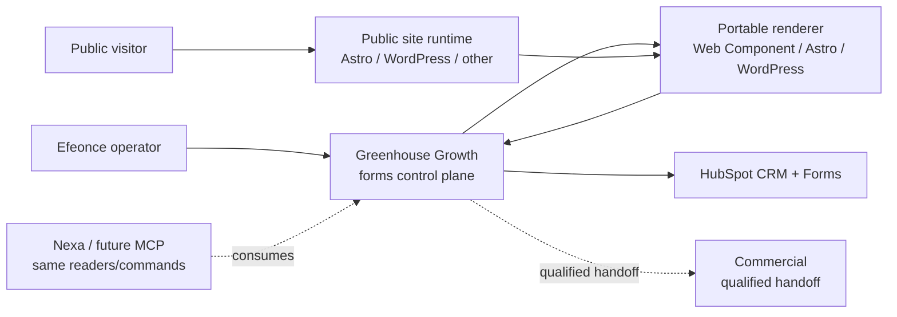
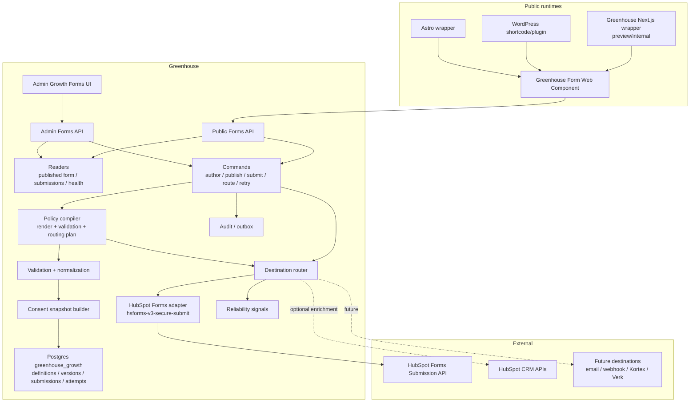

# Greenhouse Growth Public Forms Engine Architecture V1

> Tipo de documento: arquitectura de producto/plataforma
> Status: Accepted direction — no runtime changes yet
> Version: V1
> Fecha: 2026-06-24
> Owner: Product / Platform Architecture / Growth / Marketing Operations / GTM
> ADR: `GREENHOUSE_GROWTH_PUBLIC_FORMS_ENGINE_DECISION_V1.md`
> Domain: `growth` (`GREENHOUSE_GROWTH_DOMAIN_ARCHITECTURE_V1.md`)
> Runtime contract: `greenhouse-growth-public-forms.v1` (planned)

## Delta 2026-07-13 — TASK-1372 application forms, private file upload and Hiring projection

Growth Forms can now act as the write-path source of truth for `form_kind='application'` forms that collect a CV/file.

- Browser-safe contracts support `type='file'`, `dataClass='uploaded_file'`, `uploadPolicy` (`acceptedMimeTypes`, `maxBytes`, `multiple=false`, `storageContext='hiring_application_cv_draft'`, `scanPolicy='scan_required'`) and `field.presentation.icon`.
- Public submit accepts JSON normally and `multipart/form-data` only when files are present. The JSON payload never contains the file object, filename, private URL, destination mapping or internal ATS IDs.
- File bytes are handled synchronously in the public submit command: create private pending asset, run `scanAndGateUploadedAsset`, persist only a safe uploaded-file descriptor in `normalized_fields_json`, and never make the asset public.
- Creating a `hiring_application` is not a `form_destination`. It is the reactive projection `growth_hiring_application_from_submission` over `growth.forms.submission_accepted`, and it calls `submitPublicHiringApplication`.
- Internal application forms should have `form_destination` rows `0`; destinations remain for external delivery such as HubSpot/email/webhooks.
- Runtime smoke evidence in Cloud SQL dev: submission `fsub-460f074e-5f47-403e-97b5-725f18c3fef2` -> application `happ-a2637a89-3bf1-499b-9693-fb63ea7ab257`, asset `asset-1a0adc1c-ecc3-46d1-ac43-e32627a385ca`, asset private/attached, scan `clean`, destinations `0`.

## Delta 2026-06-25 — TASK-1232 admin cockpit runtime

The planned Admin UI family `/admin/growth/forms` is now implemented as the internal Growth Forms command center. It is a **consumer of the engine**, not a new source of truth.

- Navigation: top-level **Growth** → **Forms** with `viewCode=administracion.growth_forms`.
- Runtime reader: `getGrowthFormsCockpitAdmin()` composes forms, versions, destinations, host surfaces, submissions, consent snapshots and delivery attempts into a serializable cockpit view model.
- UI contract: the cockpit uses the existing Greenhouse UI platform (`CompositionShell`, `AdaptiveSidecarLayout`, canonical breadcrumbs/buttons/chips/motion) and canonical typography (`surfaceHeroTitle` for the surface/drawer identity, Geist variants for operational text and numeric tokens for IDs/KPIs).
- Write path: author/review/publish/deprecate/archive/dispatch actions call the existing admin API/commands; the view does not write tables directly.
- Migration: `20260625184500000_task-1232-growth-forms-admin-cockpit-view` seeds the admin view registry and internal grants. It does not alter the public render/submit contract.
- Rollout boundary: the cockpit observes the TASK-1251 `AI Visibility Grader` form anchor, but the public WordPress/dataLayer smoke for a generic renderer form remains a release/sign-off follow-up.

## 1. Purpose

This document defines the target architecture for Greenhouse-owned public forms that can render in Astro, WordPress and other Efeonce public surfaces while routing submissions to HubSpot and future destinations through governed Greenhouse adapters.

Canonical flow:

```text
Greenhouse form definition
  -> published render contract
  -> portable renderer
  -> Greenhouse public submit API
  -> submissions ledger + consent snapshot
  -> destination adapters
  -> HubSpot Forms secure submit / future destinations
```

The core decision:

```text
Greenhouse owns the form engine;
HubSpot is a destination adapter, not the renderer or source of truth.
```

## 2. Product thesis

Public forms are not only inputs. In Growth they are acquisition primitives:

- lead magnet access;
- AI Visibility Grader intake;
- newsletter / event / guide capture;
- diagnostic qualification;
- campaign attribution;
- pre-pipeline handoff into HubSpot and Commercial.

The form engine should let Efeonce keep brand quality and portability while preserving HubSpot CRM value.

The engine must not model everything as "a form with fields". A public form is an operational contract:

```text
form kind + risk profile + data classification + persistence policy + destination policy + success behavior
```

This distinction is load-bearing. A newsletter subscription, quote request, diagnostic intake and document upload may all render as forms, but they have different security, consent, storage, review, retry and handoff rules.

The backend must therefore be a **policy compiler and submission orchestrator**, not a thin proxy to HubSpot or any other destination. The UI may be conditional, but it is conditioned by Greenhouse policy and purpose. Destination details influence the compiled contract only through server-side constraints.

## 3. Archetype

Primary archetype: **B2B SaaS multi-tenant + public acquisition surface**.

Dominant risk: an internet-facing write path captures personal data and pushes it into HubSpot. The system must avoid spam, consent drift, duplicate leads, lost attribution and hidden delivery failures.

Secondary archetypes:

- **Headless content/public site**: renderers live in Astro, WordPress and future public runtimes.
- **Internal tool/admin**: Greenhouse operators author, review, publish and deprecate forms.
- **CRM/workflow integration**: HubSpot remains CRM and attribution destination.
- **Event-driven/retry workflow**: destination attempts need retries, dead letters and reconciliation.

## 4. System context



## 5. Container view



## 6. Source-of-truth boundaries

| Concern | Source of truth | Notes |
| --- | --- | --- |
| Public page route/content | Public site runtime | Astro/WordPress owns page placement, not form logic. |
| Host/render surface | Surface adapter | WordPress/Astro/Greenhouse wrappers load the portable renderer and identify the surface. |
| Form definition | Greenhouse Growth | Fields, validation, copy keys, destinations, lifecycle. |
| Published form contract | Greenhouse Growth | Immutable version consumed by renderers. |
| Visual renderer package | Greenhouse Growth / UI implementation task | Portable and tokenized for Efeonce brand. |
| Submission acceptance | Greenhouse Growth | Validation, consent, dedupe, audit. |
| Destination delivery | Greenhouse Growth | Attempts, retries, dead letters, adapter outcomes. |
| Internal domain projection | Target Greenhouse domain via reactive consumer | Example: `growth_hiring_application_from_submission` creates Hiring applications from accepted application submissions. Not modeled as `form_destination`. |
| CRM contact/company/deal truth | HubSpot | HubSpot owns CRM identity and lifecycle. |
| Qualified revenue motion | `commercial` | Starts after explicit handoff/acceptance. |
| Public site deployment | `public_site` | Does not own submissions ledger. |

## 7. Canonical placement

| Concern | Value |
| --- | --- |
| Module key | `growth` |
| PostgreSQL schema | `greenhouse_growth` |
| TypeScript root | `src/lib/growth/forms/` |
| Public API family | `/api/public/growth/forms/**` |
| Admin API family | `/api/admin/growth/forms/**` |
| Admin UI family | `/admin/growth/forms` |
| Capability prefix | `growth.forms.*` |
| Event prefix | `growth.forms.*` |
| Signal prefix | `growth.forms.*` |
| Contract prefix | `greenhouse-growth-public-forms-*` |

Do not place this under `public_site`, `commercial` or generic `platform`. Those domains are consumers/participants.

### 7.1 Terminology: surface vs destination

Use these terms consistently:

| Term | Meaning | Examples |
| --- | --- | --- |
| `host_surface` / `render_surface` | Runtime where a form is displayed. It consumes a render contract. | `wordpress_public_site`, `astro_public_site`, `greenhouse_next_preview`, future landing runtimes. |
| `surface_adapter` | Thin wrapper/package for one host surface. It handles enqueue/import, CSP/nonce, surface id and local mounting. | WordPress plugin/shortcode/block, Astro component, Next.js preview wrapper. |
| `destination` | System that receives accepted submission data after Greenhouse validation/routing. | HubSpot Forms, HubSpot Contacts, internal notification, Greenhouse-only ledger, Commercial handoff candidate. |

Rules:

- WordPress, Astro and Greenhouse Next.js are host surfaces, not destinations.
- A surface adapter never owns fields, validation, consent, destination mapping or submissions.
- A destination never dictates public UI directly; it only contributes server-side constraints to the compiled plan.
- Internal Greenhouse domain objects created from accepted submissions are reactive projections, not destinations.

### 7.2 Host surface registry

The engine should model host surfaces explicitly so the first WordPress integration can later migrate to Astro without redefining forms.

Planned aggregate: `form_host_surface`.

Fields:

- `surface_id`: e.g. `efeonce_public_wordpress`, `efeonce_public_astro`, `greenhouse_next_preview`
- `surface_kind`: `wordpress | astro | nextjs | generic_html`
- `origin_allowlist`
- `allowed_form_slugs`
- `embed_key_id`
- `renderer_channel`: `stable | beta | preview`
- `csp_requirements_json`
- `status`: `active | paused | archived`

Rules:

- Public GET/POST calls include a surface id or signed embed key.
- Origin/CORS checks validate the surface, not just the form slug.
- The same `form_slug` can be embedded on multiple surfaces with separate telemetry and rollout state.
- Surface registration controls where a form can render; destination policy controls where data can be delivered.

## 8. Core domain model

### 8.1 Aggregate: `form_definition`

Represents the durable form identity.

Fields:

- `form_id`
- `slug`
- `name`
- `form_kind`
- `purpose`: short human-readable purpose, e.g. `AI Visibility intake`, `Guide download`, `Contact request`
- `risk_profile`: `low | medium | high | restricted`
- `owner_team`
- `status`
- `default_locale`
- `created_by`, `created_at`

Rules:

- `slug` is stable and used by embeds.
- A definition can have many versions.
- Deleting is archival, not hard delete, while submissions exist.

### 8.2 Aggregate: `form_version`

Immutable published or draft form shape.

Fields:

- `form_version_id`
- `form_id`
- `version`
- `status`: `draft | review | published | deprecated | archived`
- `locale`
- `field_schema_json`
- `validation_schema_json`
- `copy_refs_json`
- `style_variant`
- `ui_policy_json`
- `success_behavior_json`
- `consent_policy_version`
- `data_classification_json`
- `destination_policy_json`
- `analytics_policy_json`
- `published_at`

Rules:

- Published versions are immutable.
- Editing a published form creates a new draft version.
- Copy should reference canonical copy where reusable; renderer text must not drift into local snippets.

### 8.3 Aggregate: `form_destination`

Defines where accepted submissions go.

Fields:

- `destination_id`
- `form_version_id`
- `provider`: `hubspot | crm_contact | email | webhook | greenhouse_only`
- `adapter_kind`
- `adapter_version`
- `endpoint_status`
- `enabled`
- `delivery_mode`: `direct | after_review | manual_only | disabled`
- `mapping_json`
- `consent_requirements_json`
- `retry_policy_json`

V1 HubSpot destination metadata:

```json
{
  "provider": "hubspot",
  "adapterKind": "forms_submission",
  "adapterVersion": "hsforms-v3-secure-submit",
  "endpointStatus": "legacy_supported",
  "migrationTarget": "date_versioned_forms_submission_api_when_available"
}
```

### 8.4 Aggregate: `form_submission`

Accepted or rejected visitor submission.

Fields:

- `submission_id`
- `form_id`
- `form_version_id`
- `embed_surface`
- `page_uri`
- `page_name`
- `lead_email_hash`
- `normalized_fields_json`
- `status`
- `dedupe_fingerprint`
- `request_id`
- `created_at`

Rules:

- Store raw payload only when necessary and with retention.
- Prefer normalized fields + redacted audit payload.
- Free-text fields require length limits and sanitization.

### 8.5 Aggregate: `form_submission_consent_snapshot`

Immutable consent evidence for a submission.

Fields:

- `submission_id`
- `consent_policy_version`
- `legal_basis`
- `checkboxes_json`
- `notice_text_hash`
- `privacy_url`
- `hubspot_legal_consent_options_json`
- `created_at`

Rules:

- Consent is captured even if HubSpot delivery fails.
- Consent text/version is audit evidence.

### 8.6 Aggregate: `form_destination_attempt`

One attempt to deliver one submission to one destination.

Fields:

- `attempt_id`
- `submission_id`
- `destination_id`
- `provider`
- `adapter_version`
- `status`: `pending | succeeded | retrying | failed | dead_letter`
- `external_id`
- `http_status`
- `error_class`
- `retry_count`
- `next_retry_at`
- `created_at`, `completed_at`

Rules:

- Attempts are append-only.
- Retries create new attempt rows or append attempt events, depending on final implementation.
- Errors are sanitized; never store tokens or full provider secrets.

### 8.7 Aggregate: `form_host_surface`

Represents an approved runtime where forms can render.

Fields:

- `surface_id`
- `surface_kind`: `wordpress | astro | nextjs | generic_html`
- `surface_name`
- `origin_allowlist_json`
- `allowed_form_slugs_json`
- `embed_key_id`
- `renderer_channel`
- `csp_requirements_json`
- `status`
- `created_at`, `updated_at`

Rules:

- A host surface can render many forms.
- A form can be allowed on many host surfaces.
- Submission telemetry records both `form_version_id` and `surface_id`.
- Disabling a host surface blocks render contract fetch and submit, but does not archive the form.

## 9. Form kind taxonomy

Every published form version must declare `form_kind`. The kind is not a visual variant; it activates policy defaults and blocks unsafe outcomes.

| Form kind | Examples | Default risk | Default outcome | Hard constraints |
| --- | --- | --- | --- | --- |
| `subscribe` | Newsletter, updates, content alerts | Low | Contact/list/preference update | Minimal fields; no file upload; consent/preference semantics explicit. |
| `lead_magnet` | Guide, checklist, template, report download | Low-medium | Contact + gated asset access | Asset access policy required: immediate, email link, tokenized link or internal review. |
| `contact` | "Hablemos", general inquiry | Medium | HubSpot form submission + internal notification | Free text capped; routing owner required. |
| `diagnostic_intake` | AI Visibility Grader, audit intake | Medium | Growth submission + diagnostic run candidate | Must not create commercial deal automatically; run policy required. |
| `quote_request` | "Solicitar cotización", project/RFP request | Medium-high | `commercial_handoff_candidate` | Must not create formal quotation automatically; human or governed Commercial command required. |
| `pricing_simulation` | Public estimator, package calculator | High | Redacted simulation result + optional lead capture | May call only public-safe pricing/simulation profile; never expose costs, margins, internal rate cards or approval bypasses. |
| `document_upload` | Brief upload, RFP, brand assets, procurement docs | High | Greenhouse intake + storage + scan + review | Requires upload policy, malware scan, file allowlist, retention, access control and review before HubSpot sync. |
| `event_registration` | Webinar, workshop, private session | Medium | Contact + event registration state | Capacity/waitlist policy required when seats are limited. |
| `survey` | Feedback, NPS, diagnostic questionnaire | Variable | Response ledger + optional analytics/CRM sync | CRM sync must be explicit; avoid polluting HubSpot with low-signal answers by default. |
| `preference` | Consent, unsubscribe, communication preferences | High legal | Consent/preference update | Must be auditable and idempotent; success/failure copy cannot be ambiguous. |
| `application` | Partner, supplier, hiring, vendor intake | High | Growth submission + restricted reactive projection | Requires PII review, retention policy, private upload scan when files exist and human review before any external sync. Internal object creation uses a projection, not `form_destination`. |

Future kinds require either a small ADR delta or a versioned update to this architecture if they introduce new risk classes, destinations or persistence rules.

## 10. Policy dimensions

A form version must declare these policy dimensions before publication:

| Dimension | Purpose |
| --- | --- |
| `form_kind` | Selects policy defaults and allowed outcomes. |
| `risk_profile` | `low`, `medium`, `high`, `restricted`; drives review, storage and destination rules. |
| `data_classes` | Field-level classes such as `public`, `company`, `contact_pii`, `free_text`, `financial_hint`, `file_metadata`, `uploaded_file`, `consent_evidence`. |
| `persistence_mode` | `normalized_only`, `raw_with_ttl`, `greenhouse_only`, `external_after_review`. |
| `destination_policy` | Which destinations can receive data and whether delivery is direct, review-gated or manual-only. |
| `ui_policy` | Composition mode, conditional visibility/requiredness, step strategy and renderer compatibility. |
| `asset_access_policy` | For lead magnets: immediate download, email link, tokenized report, gated after review. |
| `upload_policy` | Required when any field accepts files. |
| `analytics_policy` | Which events can be tracked and whether field-level analytics are disabled. |
| `commercial_handoff_policy` | Whether a submission can create a candidate, task, deal request or only an internal note. |

Publication gate:

```text
form_kind + risk_profile + consent_policy + destination_policy + retention_policy + spam_policy must be present
```

If any is missing, the form stays in `review`.

### 10.1 Policy compiler

The compiler converts a reviewed form version into three bounded outputs:

| Output | Consumer | Contains | Must not contain |
| --- | --- | --- | --- |
| `render_contract` | Browser renderer / preview | Safe field keys, field types, labels/copy, validation hints, conditional UI rules, consent display, success behavior, renderer compatibility. | HubSpot property names, private destination URLs, secrets, server-only scoring, internal cost/margin data. |
| `submission_contract` | Public POST handler | Server validation schema, normalization rules, dedupe/idempotency policy, spam policy, upload policy, consent requirements. | Browser-trusted hidden field mapping or destination claims. |
| `destination_plan` | Destination router | Provider adapter, mapping, delivery mode, retry policy, review gates, consent mapping, field allowlist. | Data classes forbidden by policy or fields not accepted by the published version. |

Compilation inputs:

```text
form_definition + form_version + policy dimensions + destination capabilities + runtime compatibility target
```

Compilation rules:

- Public renderers receive only `render_contract`.
- The browser can display conditional UI, but the server re-evaluates all conditions and validations.
- Destination constraints can remove or review-gate unsafe mappings, but cannot force public UI to expose vendor-specific fields.
- Any compiler warning on consent, destination mapping, upload policy or success behavior blocks publication until resolved or explicitly reviewed.

### 10.2 UI conditioning principle

UI behavior is driven by policy, not vendor:

```text
correct: form_kind=quote_request + destination_policy=after_review -> review-pending success state
incorrect: destination=hubspot -> show HubSpot-specific hidden field or copy
```

The renderer may react to:

- `form_kind`;
- `risk_profile`;
- `data_classes`;
- `ui_policy`;
- `success_behavior`;
- `asset_access_policy`;
- `upload_policy`;
- `locale`;
- surface capability, e.g. `web_component`, `astro`, `wordpress`.

The renderer must not branch on:

- HubSpot form GUID;
- HubSpot property names;
- destination provider;
- adapter version;
- server-side commercial handoff implementation.

## 11. Field contract and data classification

Fields must be typed and classified. A renderer may display fields, but the server owns validation and destination mapping.

Recommended field categories:

| Category | Examples | Default data class | Notes |
| --- | --- | --- | --- |
| `identity` | email, name, phone | `contact_pii` | Email is usually required for HubSpot lead capture; phone should not be required by default. |
| `company` | company name, website, industry | `company` | Normalize URLs/domains server-side. |
| `intent` | budget range, timeline, service interest | `confidential` | Useful for routing; avoid over-collection. |
| `free_text` | message, context, challenge | `free_text` | Length limits, sanitization and PII warnings required. |
| `consent` | checkboxes, legal basis | `consent_evidence` | Snapshot every accepted submission. |
| `attribution` | UTM, referrer, `hutk`, page URI | `attribution` | Captured from context, not trusted from hidden user-editable fields. |
| `file` | brief, RFP, brand asset | `uploaded_file` | Must use upload policy and scan pipeline. |
| `computed` | score, package estimate, routing tier | `derived` | Server-side only unless explicitly safe for public display. |

Hard rules:

- The browser cannot declare field destination names.
- Hidden fields from the browser are treated as untrusted input.
- Field mapping to HubSpot properties is versioned in `form_destination.mapping_json`.
- Reusable visible copy must come from the canonical copy layer when it is not one-off form copy.
- Free-text values should not be forwarded to AI providers or HubSpot workflows without an explicit policy.

### 11.1 Conditional field contract

The field schema may include declarative conditions:

| Rule | Purpose | Example |
| --- | --- | --- |
| `visibleWhen` | Controls whether the renderer displays a field/step. | Show `budget_range` when `service_interest` includes `growth`. |
| `requiredWhen` | Controls conditional requiredness. | Require `company_website` for diagnostic intakes. |
| `validateWith` | Applies named server validation. | `email`, `url`, `phone_optional`, `safe_free_text`. |
| `normalizeWith` | Applies server normalization. | URL/domain normalization, email trim/lowercase. |
| `computedBy` | Declares server-only derived values. | Routing tier, public-safe score band. |

Rules:

- Conditions are declarative data, not arbitrary JavaScript.
- The renderer can use conditions for UX, but the backend is authoritative.
- Conditional logic cannot reference destination internals.
- Complex branching should push the form to a multi-step or workflow-specific task rather than becoming a generic rule language.

### 11.2 Composition modes

Initial supported form compositions:

| Mode | Use for | V1 posture |
| --- | --- | --- |
| `static` | Newsletter, contact, simple lead magnet. | Supported first. |
| `conditional_simple` | A few show/hide or required rules. | Supported first, declarative only. |
| `multi_step_light` | Diagnostic intake, quote request, lead magnet + qualification. | Supported after static foundation. |
| `computed_result` | Pricing simulation, diagnostic score preview. | Requires public-safe compute policy. |
| `async_result` | AI Visibility report or asset generation. | Requires run status/report token policy. |
| `authenticated_or_tokenized` | Preference center, private report access. | Separate follow-up; do not sneak into anonymous forms. |

V1 should not start as a fully flexible visual form builder. It should start with a small set of boring composition modes, each with explicit tests and preview fixtures.

## 12. Destination policy

Destination routing is governed by `form_kind` and `risk_profile`.

| Delivery mode | Meaning | Use when |
| --- | --- | --- |
| `direct` | Accepted submission routes automatically. | Low/medium risk forms with safe fields and reviewed mapping. |
| `after_review` | Submission waits for human/operator review before delivery. | Uploads, quote requests, applications, high-risk diagnostics. |
| `manual_only` | Greenhouse stores the submission; operator takes action manually. | Early pilots, uncertain mappings, sensitive or ambiguous submissions. |
| `disabled` | Destination configured but not active. | Draft/testing/migration. |

Default destination rules:

- `subscribe`, `lead_magnet`, `contact`, `event_registration`: may use HubSpot Forms direct after mapping/consent review.
- `diagnostic_intake`: may write bounded metadata to HubSpot direct, but diagnostic run/report data should stay Greenhouse until quality policy allows sync.
- `quote_request`: creates a Growth/Commercial handoff candidate; it must not create a formal quotation.
- `pricing_simulation`: can expose only redacted public-safe simulation outputs; internal economics stay server-side.
- `document_upload` and `application`: Greenhouse-only until scan/review passes; HubSpot receives metadata or reviewed summary, not raw files by default.
- `preference`: routes to the canonical consent/preference adapter, not generic HubSpot form submission, unless explicitly modeled.

### 12.1 Destination capability matrix

Every destination adapter must declare capabilities. The compiler uses this matrix to block invalid mappings before publication.

| Destination | PII | Free text | Files | Business action | Default delivery mode |
| --- | --- | --- | --- | --- | --- |
| `hubspot_forms_secure_submit` | Allowed with consent/mapping | Allowed only capped/sanitized | Metadata only by default | No Greenhouse business action | `direct` for low/medium risk |
| `hubspot_contacts_api` | Allowed for CRM upsert/enrichment | Metadata/summary only | No raw files | No Greenhouse business action | `direct` or `after_review` |
| `greenhouse_submission_ledger` | Allowed by retention policy | Allowed capped/sanitized | Allowed only via upload contract | Intake/handoff candidate only | Always records accepted submissions |
| `internal_notification` | Redacted/summary preferred | Summary preferred | Links only after scan | No business action | `direct` or `after_review` |
| `commercial_handoff_candidate` | Bounded lead/contact + intent | Summary preferred | Links only after scan | Candidate, not quote/deal | `after_review` by default |
| `future_webhook` | Adapter-specific | Adapter-specific | Metadata only unless approved | No unless command-backed | `manual_only` until reviewed |

Hard rule:

```text
destination capability != permission to collect data
```

The form policy must permit the collection first; the destination capability only says whether that destination can receive the already accepted data.

### 12.2 Destination-conditioned constraints

A destination can impose constraints on the compiled plan:

- maximum field length;
- accepted field types;
- consent payload requirements;
- rate/retry policy;
- review-gated delivery mode;
- mapping completeness;
- exclusion of raw files or high-risk free text.

A destination cannot impose public UI semantics directly. If a destination needs additional data, the form policy must explicitly add that field for a product reason, not for vendor leakage.

## 13. Upload contract

Any `document_upload` or form with file fields must use a separate upload path, not the basic submission payload.

Required controls:

- file type allowlist;
- max file size and max file count;
- object storage bucket/path policy;
- malware scan or quarantine state before operator access;
- content-disposition and download access controls;
- retention/deletion policy;
- audit for upload, scan, view/download and deletion;
- HubSpot sync of metadata only unless explicitly approved;
- no direct public read URL without short-lived token.

Upload lifecycle:

```text
requested -> uploaded -> quarantined -> scanned_clean -> attached_to_submission
requested -> uploaded -> quarantined -> scan_failed -> rejected
```

If scan is unavailable, high-risk upload forms must degrade to `review_required` or reject uploads; they must not silently accept and route files.

## 14. Business action boundaries

Forms collect intent. They do not automatically execute high-impact business actions unless a specific governed command exists.

Boundaries:

- `quote_request` creates `commercial_handoff_candidate`, not `quotation`.
- `pricing_simulation` can call a public-safe simulation primitive, not quote authoring.
- `diagnostic_intake` can create a Growth diagnostic run, not publish a report with unreviewed risky claims.
- `document_upload` can create an intake record, not automatically attach files to a commercial contract.
- `application` can create a review queue item, not a member/vendor/client record.
- `preference` can update consent/preference only through the canonical preference/consent path.

Promotion to `commercial`, `delivery`, `finance`, `identity`, `Kortex` or `Verk` requires an explicit command, capability, idempotency key, audit and policy.

## 15. Analytics contract

The engine should track form performance without collecting unnecessary personal data.

Recommended events:

- `form_viewed`;
- `form_started`;
- `field_validation_failed` with field key and reason class, not raw value;
- `form_submitted`;
- `submission_accepted`;
- `submission_rejected`;
- `destination_delivered`;
- `destination_failed`;
- `asset_accessed`;
- `report_viewed` for tokenized diagnostic reports.

Analytics rules:

- No raw field values in analytics.
- Event payloads include form id/version, surface, locale, page URI/domain, campaign params and reason classes.
- Consent/Do Not Track posture can disable optional analytics while preserving required security/audit logs.
- Conversion reporting should distinguish `submitted`, `accepted`, `delivered`, and `qualified_handoff`.

### 15.1 GTM and parent-page measurement contract

Default client-side measurement must happen in the host page context, not inside an iframe. The portable renderer should therefore render in the host DOM by default as a Web Component/custom element. This lets WordPress, Astro and Greenhouse Next.js use the existing Google Tag Manager container, `window.dataLayer`, DOM listeners and page attribution context without cross-frame workarounds.

The renderer must expose two browser-safe measurement surfaces:

| Surface | Purpose |
| --- | --- |
| `CustomEvent` on the custom element / host DOM | Framework-agnostic listener surface for wrappers, QA and non-GTM consumers. |
| Optional `window.dataLayer.push()` on the parent page | GTM-friendly funnel events for the public site. |

Recommended GTM event names:

| Event | When |
| --- | --- |
| `gh_form_viewed` | Published form rendered and visible enough to count as an impression. |
| `gh_form_started` | Visitor first changes a field or advances from the initial state. |
| `gh_form_field_validation_failed` | Browser/server validation rejects a field; emit field key and reason class only. |
| `gh_form_submitted` | Submit attempt sent to Greenhouse public API. |
| `gh_form_submission_accepted` | Greenhouse accepted the canonical submission. |
| `gh_form_submission_rejected` | Greenhouse rejected validation, consent, spam, abuse or policy. |
| `gh_form_destination_delivered` | A destination adapter delivered successfully when the client is allowed to know this. |
| `gh_form_asset_accessed` | Lead magnet asset, redirect or tokenized result access is granted. |

Event payloads may include:

- `form_id`, `form_slug`, `form_version_id`, `form_kind`;
- `surface_id`, `surface_kind`, `renderer_version`, `contract_version`;
- `page_uri`, `page_name`, `referrer`, `locale`, UTM/campaign parameters when consent allows;
- `correlation_id` or non-reversible submission reference;
- `reason_class`, `success_behavior`, `destination_kind` only when safe.

Event payloads must not include raw field values, email, phone, document names, free-text answers, HubSpot property names, HubSpot form GUIDs, private endpoint URLs or tokens.

Client-side GTM events are behavioral analytics. The authoritative conversion ledger remains Greenhouse server-side: `received`, `accepted`, `delivered`, `failed`, `dead_letter` and `qualified_handoff` come from the submission and destination-attempt records, not from the browser alone.

## 16. Progressive profiling

The engine may support progressive profiling, but only under explicit privacy rules.

Allowed:

- reduce repeated questions after known email/token/session;
- use server-side known context to route destination or personalize field set;
- prefill low-risk fields only when the visitor has an authenticated/tokenized context.

Not allowed by default:

- display sensitive known CRM data on a public page;
- trust `hutk` alone as proof of identity;
- expose whether a specific email exists in HubSpot;
- skip consent because the contact was seen before.

## 17. Form lifecycle

```text
draft -> review -> published -> deprecated -> archived
```

Lifecycle rules:

- Only `published` versions can render publicly.
- `deprecated` versions may continue accepting submissions for existing embeds during a migration window if explicitly configured.
- `archived` versions reject public submissions.
- A form cannot publish without at least one enabled destination or an explicit `greenhouse_only` mode.
- A form cannot publish without consent policy, spam controls and success behavior.

Publication freezes:

- field schema and composition mode;
- conditional UI rules;
- validation and normalization rules;
- copy/legal/consent references;
- destination mappings and delivery modes;
- success behavior;
- renderer compatibility target;
- spam/rate-limit policy;
- analytics policy.

Publication gates:

| Gate | Blocks when |
| --- | --- |
| Policy compile | Required policy dimension missing or contradictory. |
| Destination compile | Destination mapping invalid, unsafe or unsupported by adapter capabilities. |
| Renderer preview | Published contract cannot render in required target surfaces. |
| Submission dry-run | Server validation/normalization cannot accept a representative fixture. |
| Consent review | Consent display/mapping/snapshot is missing or stale. |
| Abuse review | Rate limit, honeypot, idempotency or origin allowlist missing. |
| Upload review | Upload form lacks scan/quarantine/storage policy. |
| Success behavior review | Form promises an outcome the backend does not execute. |

## 18. Submission lifecycle

```text
received -> validated -> accepted -> routed -> delivered
received -> rejected
accepted -> routed -> destination_failed -> retrying -> delivered
accepted -> routed -> destination_failed -> dead_letter
```

Rejected submissions should record minimal operational metadata and rejection reason class, not unnecessary personal data.

## 19. Renderer contract

The renderer should be portable and framework-light.

Recommended layers:

| Layer | Role |
| --- | --- |
| Portable renderer core | Framework-light implementation shared by all host surfaces. |
| Web Component / custom element | Primary portable runtime for WordPress, Astro, Greenhouse preview and generic HTML. |
| Astro wrapper | Thin wrapper around the Web Component with typed props. |
| WordPress shortcode/plugin | Thin wrapper that emits the Web Component and handles local enqueue/config. |
| Greenhouse Next.js wrapper | Internal/admin preview using the same published contract and renderer core. |

Embed shape:

```html
<greenhouse-form
  form="ai-visibility-intake"
  surface="astro"
  locale="es-CL"
></greenhouse-form>
```

Terminology:

```text
WordPress / Astro / Greenhouse Next.js = host surfaces
HubSpot / internal notification / commercial handoff = destinations
```

Renderer rules:

- Fetch only published render contracts.
- Submit only to Greenhouse public API.
- Render conditional UI from policy rules, not destination/provider internals.
- Render in the host page DOM by default; iframe is not the default because it degrades GTM/dataLayer measurement and accessibility.
- Emit browser-safe measurement events through DOM `CustomEvent` and, when enabled by `telemetryPolicy`, parent-page `window.dataLayer.push()`.
- Identify the host surface via `surface`, signed embed config or registered embed key.
- Collect `hubspotutk` only when present and permitted by consent posture.
- Include `pageUri`, `pageName`, referrer and UTM context when allowed.
- No HubSpot tokens, private endpoint URLs or destination mapping in browser code.
- Degrade accessibly if JS fails: show fallback link/contact path or static message.
- Preserve Efeonce brand tokens and UX copy governance.
- Do not require React, Next.js, WordPress globals, Astro runtime APIs or HubSpot scripts in the portable core.
- Host wrappers may handle enqueue/import, CSP nonce, asset URL, mounting and local token injection; they may not change field behavior or destination mapping.

### 19.1 Host surface adapters

Initial surface adapters:

| Surface adapter | Purpose | V1 requirements |
| --- | --- | --- |
| `wordpress_public_site` | First consumer for the current Efeonce public site. | Plugin/shortcode/block emits custom element, enqueues pinned renderer bundle, passes surface id/embed key, supports CSP nonce when needed. |
| `astro_public_site` | Target public-site runtime after migration. | Thin Astro component imports or references the same renderer bundle and passes the same surface contract. |
| `greenhouse_next_preview` | Greenhouse admin/internal preview and smoke surface. | Next.js wrapper uses the same render contract and renderer core; no separate React-native form implementation. |
| `generic_html` | Low-friction embeds for future static/landing pages. | Custom element + script tag with signed config; no framework coupling. |

Adapter rules:

- The WordPress adapter is first, but it cannot become the canonical renderer.
- The Astro adapter must be able to render the same published form/version without changing form definition or destination mapping.
- The Greenhouse preview must use the same contract so operators see what public hosts will render.
- Surface-specific styling is limited to approved theme tokens, density/spacing wrappers and host layout constraints.

### 19.2 Renderer distribution and compatibility

The renderer should be distributed as a versioned artifact, not copied per site.

Recommended contract:

- `contractVersion` for render payload shape;
- `rendererVersion` for bundle behavior;
- `rendererChannel`: `stable`, `beta`, `preview`;
- compatibility matrix: which renderer versions support which `contractVersion`;
- WordPress and Astro wrappers pin or declare the renderer channel they load;
- Greenhouse can warn on stale host surfaces via `growth.forms.renderer_contract_stale`.

Asset hosting options:

- Greenhouse-served static asset path for early V1;
- public-site CDN path after release hardening;
- package import for Astro/Next when a build-time bundle is preferable.

The same form should survive a public-site migration from WordPress to Astro by changing `host_surface`, wrapper and page placement only.

### 19.3 Render contract shape

The public render contract should include:

| Field | Purpose |
| --- | --- |
| `contractVersion` | Versioned shape for renderer compatibility. |
| `form` | Public id/slug/version/locale/form kind. |
| `composition` | `static`, `conditional_simple`, `multi_step_light`, etc. |
| `fields` | Browser-safe field definitions. |
| `conditions` | Declarative `visibleWhen`/`requiredWhen` rules. |
| `steps` | Optional step grouping and progress semantics. |
| `copy` | Resolved public copy or copy refs safe for the renderer. |
| `consent` | Display text/links/checks; no server-only consent mapping. |
| `successBehavior` | Inline message, redirect, asset access, review-pending or tokenized report behavior. |
| `surfacePolicy` | Allowed origins/surfaces and fallback behavior. |
| `telemetryPolicy` | Allowed analytics events without raw values. |

### 19.4 Surface security contract

Surface security requirements:

- per-surface origin allowlist;
- signed embed config or embed key for public hosts;
- CORS limited to approved origins;
- CSP-compatible script/style strategy;
- no inline secrets or destination config;
- rate limiting includes `surface_id`;
- telemetry includes `surface_id`, page URI and renderer version;
- stale/deprecated renderer versions can be warned, paused or blocked by policy.

> **Delta 2026-07-04 (TASK-1335) — governed CORS transport.** "CORS limited to approved origins" is
> enforced by a **governed resolver, not a hardcoded set**: transport ACAO = the **UNION of
> `origin_allowlist_json` across `active` surfaces** (SoT = `form_host_surface`), cached in-memory with
> stale-on-error. Authorizing a new host = appending its origin to the right surface (DATA), never editing
> the route helper. Transport is **surface-agnostic** (the `OPTIONS` preflight has no `surfaceId`); the
> per-surface authority stays server-side in `submitForm` (double defense). Canonical detail:
> [growth-public-forms-runtime-contract.md](growth-public-forms-runtime-contract.md) §"CORS gobernado".

Iframe fallback may be considered only for hostile or highly constrained hosts. It is not the default because it weakens brand integration, responsive behavior, analytics context and accessibility. Any iframe fallback must be explicitly marked `measurement_degraded`, must use an allowlisted `postMessage` bridge to the parent page for the same event schema, must never post raw field values/PII, and must document which GTM measurements cannot be guaranteed.

### 19.5 Success behavior

Success state is part of the published contract, not a local page snippet.

Allowed success behaviors:

| Behavior | Use for |
| --- | --- |
| `inline_message` | Subscribe/contact/simple confirmation. |
| `redirect_url` | Campaign thank-you page when attribution is safe. |
| `asset_download` | Immediate lead magnet access. |
| `email_delivery` | Email link or follow-up delivery. |
| `tokenized_report` | Diagnostic report or private result. |
| `schedule_link` | Optional next step; must not imply quote/deal creation. |
| `review_pending` | Quote request, application, upload or high-risk diagnostic. |
| `qualified_handoff_created` | Internal state only unless copy carefully explains human follow-up. |

Rules:

- `quote_request` cannot use success copy that says a formal quote was created.
- `pricing_simulation` cannot expose internal economics in success payload.
- `document_upload` cannot claim files were reviewed before scan/review completes.
- `lead_magnet` must declare whether access is immediate, emailed, tokenized or review-gated.
- `presentation="success_card"` renders through the portable renderer, not host HTML. The shared renderer owns the `.ghf-success-card` structure, celebration party-popper SVG mark, schedule/calendar action icon, entrance motion with reduced-motion fallback, and allowlisted telemetry. AEO `gh-aeo-success-card-*` markers are temporary host bridge CSS, not a reusable product pattern.

### 19.6 Admin builder posture

Implementation should start as **config + governed admin**, not a full free-form visual builder.

Recommended evolution:

1. Config/schema-authored forms with Greenhouse preview and fixtures.
2. Admin UI for safe edits: copy, labels, destinations, lifecycle, simple fields.
3. Admin UI for conditional rules and multi-step flows after the compiler has tests.
4. Visual builder only after enough repeated form patterns justify it.

This keeps V1 legible and avoids creating a generic form-builder platform before the policies are proven.

### 19.7 Preview and runtime evidence

Every publish candidate should support:

- Greenhouse internal preview;
- Web Component preview;
- Astro wrapper preview;
- WordPress wrapper preview when WordPress is a target;
- desktop/mobile responsive check;
- keyboard/accessibility smoke;
- submission dry-run;
- destination dry-run or disabled adapter validation;
- consent snapshot preview;
- success behavior preview.

## 20. Public API contract

Planned endpoints:

```text
GET  /api/public/growth/forms/{formSlug}
POST /api/public/growth/forms/{formSlug}/submit
```

The public GET should accept or infer:

- `surface_id` or signed embed key;
- locale;
- renderer version/channel where useful;
- current page URI/referrer context when policy allows.

The GET endpoint returns a bounded render contract:

- form id/slug/version;
- approved surface id;
- composition mode;
- field definitions safe for browser;
- conditional visibility/requiredness rules;
- validation hints;
- copy strings or copy refs resolved for the public locale;
- consent policy display text;
- style variant;
- success behavior;
- surface/telemetry policy.

The POST endpoint accepts:

- form version;
- surface id or signed embed key;
- field values;
- page context;
- attribution context;
- consent answers;
- bot-control metadata;
- optional idempotency token.

The POST endpoint never accepts destination mapping from the browser.
The POST endpoint also replays server validation/conditions and must not trust fields omitted by the renderer as proof that a condition did not apply.

## 21. Full API parity contract

Full API parity is a birth requirement for this engine. It must not be implemented as a private admin UI plus embeds first, with APIs added later. Every business capability must have a governed programmatic path through canonical commands/readers.

Planned admin capabilities:

- `growth.forms.read`
- `growth.forms.author`
- `growth.forms.publish`
- `growth.forms.review`
- `growth.forms.submissions.read`
- `growth.forms.destinations.manage`
- `growth.forms.retry_delivery`
- `growth.forms.surfaces.manage`

Canonical consumers:

| Consumer | Must use |
| --- | --- |
| Public host surfaces (`wordpress_public_site`, `astro_public_site`, `greenhouse_next_preview`) | `GET /api/public/growth/forms/{formSlug}` and `POST /api/public/growth/forms/{formSlug}/submit`. |
| Admin UI | Product APIs over the same `src/lib/growth/forms/**` commands/readers. |
| Nexa | Readers direct; writes via `propose -> confirm -> execute` over the same commands. |
| MCP / future app/ecosystem lanes | API Platform wrappers over the canonical commands/readers when exposed. |
| CLI/runbooks/smokes | Same public/admin contracts or thin scripts around canonical primitives. |
| Reliability/ops | Destination attempt readers + retry/dead-letter commands. |
| Verification harness | Same public render/submit APIs; no private success path. |

Business capability parity matrix:

| Capability | Canonical primitive | First contract surface | Follow-on parity surfaces |
| --- | --- | --- | --- |
| Read published form | Published form reader + policy compiler | Public GET render contract | Admin preview, Nexa read, MCP/app when needed. |
| Submit form | Submission command | Public POST submit | CLI/smoke, future app/webhook wrappers. |
| Author draft | Form author command | Admin Product API | Nexa/MCP propose-confirm-execute, CLI fixtures. |
| Review/publish/deprecate/archive | Lifecycle commands | Admin Product API | Nexa/MCP propose-confirm-execute, CLI/runbook. |
| Manage host surfaces | Surface registry commands/readers | Admin Product API | Public-site migration tooling, CLI/runbook. |
| Manage destinations | Destination commands/readers | Admin Product API | Nexa/MCP propose-confirm-execute, CLI/runbook. |
| Inspect submissions | Submissions ledger reader | Admin Product API | Nexa read, ops runbook. |
| Retry/dead-letter delivery | Destination attempt command/readers | Admin Product API | Reliability runbook/worker. |

Hard rules:

- No admin UI action may bypass a server-side command/reader.
- No public wrapper may call a private helper or destination directly.
- No Nexa/MCP task should require screen scraping; if the command/reader is missing, parity is incomplete.
- No operational script should mutate forms/destinations/submissions through SQL shortcuts when a command exists.
- API contracts model business capabilities, not buttons, page tabs or wrapper-specific events.

Initial implementation can defer API Platform app/ecosystem/MCP wrappers, but only if the canonical primitive and Product API path are present and the deferred parity surface is documented as a planned path.

## 22. HubSpot destination strategy

### 22.1 V1 default: Forms secure submit

Use the authenticated HubSpot Forms secure submit endpoint through a server-side adapter.

Why:

- it preserves HubSpot form submission semantics;
- it supports higher rate limits than unauthenticated submission;
- it supports `context` fields used for attribution;
- latest HubSpot docs still reference this secure path for form submissions involving sensitive data;
- it keeps browser code decoupled from HubSpot endpoint details.

### 22.2 Secondary: CRM Contacts API

Use HubSpot CRM Contacts 2026-03 only when the destination is explicitly CRM upsert/enrichment rather than form submission history.

Examples:

- update a contact property after a Greenhouse-only diagnostic;
- enrich company/contact after operator review;
- reconcile HubSpot IDs.

Do not use Contacts API as the default replacement for form-submission workflows.

### 22.3 Future migration

If HubSpot ships a stable date-versioned Forms submission endpoint, add a new adapter version:

```text
adapterVersion: hubspot-forms-date-versioned-submit-<version>
```

Migration should be form-destination-by-form-destination:

1. Add adapter behind flag.
2. Run shadow/dry-run mapping where possible.
3. Smoke against a test HubSpot form.
4. Flip one low-risk form.
5. Compare delivery, attribution, consent and workflow behavior.
6. Promote to default only after parity evidence.

## 23. Security, privacy and abuse controls

Required in V1:

- strict schema validation per form version;
- field allowlist per destination;
- HTML/script sanitization for free text;
- size limits for payloads and individual fields;
- per-IP/domain/form rate limits;
- honeypot field;
- optional challenge provider slot;
- embed origin allowlist or signed embed config;
- per-surface CORS allowlist;
- CSP-compatible renderer distribution;
- idempotency/dedupe fingerprint;
- request correlation id;
- audit log for accepted/rejected submissions;
- no provider secrets in public runtime;
- no raw provider/provider-token errors in HTTP responses;
- retention policy for rejected submissions and raw accepted payloads.

Consent rules:

- show consent text from the published form version;
- snapshot consent version and answers on acceptance;
- map consent to HubSpot `legalConsentOptions` only server-side;
- do not forward `hutk` when consent posture says not to;
- support third-party cookie consent integrations without making HubSpot banner mandatory.

## 24. Reliability and observability

Signals:

| Signal | Purpose |
| --- | --- |
| `growth.forms.submission_error_rate` | Public submit failures. |
| `growth.forms.validation_rejection_rate` | Validation/spam rejection trend. |
| `growth.forms.destination_failure_rate` | Any destination failure. |
| `growth.forms.hubspot_submit_failed` | HubSpot-specific failures. |
| `growth.forms.dead_letter_count` | Submissions requiring operator intervention. |
| `growth.forms.consent_missing_rate` | Form/config consent drift. |
| `growth.forms.renderer_contract_stale` | Renderer using deprecated/archived version. |
| `growth.forms.surface_unauthorized` | Render/submit attempted from an unapproved host surface/origin. |
| `growth.forms.surface_migration_drift` | WordPress/Astro/Next preview render contracts diverge for the same form/version. |
| `growth.forms.client_analytics_missing_rate` | Server submissions without expected client measurement events by form/surface. |
| `growth.forms.measurement_degraded` | Host surface rendered through iframe/fallback or without parent-page telemetry bridge. |

Operational dashboards should show:

- submissions by form/version/surface;
- conversion rate by public page;
- rejected/spam submissions;
- destination success rate;
- HubSpot attribution context present/missing;
- activity by host surface and renderer version;
- retry/dead-letter queue;
- recent config publishes.

## 25. Self-critique

### What breaks in 12 months?

The likely failure mode is destination/config sprawl: many public forms with slightly different HubSpot mappings and consent variants. Mitigation: published versions immutable, destination mapping reviewed, and a registry/list view showing drift by form.

### What breaks in 36 months?

HubSpot may replace the submission endpoint or Efeonce may add additional CRMs/destinations. Mitigation: destination adapters are explicit and versioned; public renderers only know Greenhouse contracts.

### Cognitive debt risk

The risk is a custom forms engine becoming a small platform nobody understands. Mitigation: boring aggregates, one public submit path, one destination attempt model, clear diagrams, and ADR/spec before code.

### Lock-in

HubSpot Forms secure submit is a vendor lock-in point. The adapter boundary and `endpointStatus: legacy_supported` metadata keep it visible and replaceable.

### Observability gap

Silent delivery failure would be the worst operational gap. Mitigation: append-only destination attempts, signals, dead-letter view and retry command.

### AI-specific risk

None in the form engine itself, but forms can feed AI diagnostics such as AI Visibility Grader. Any AI workflow must consume accepted submissions through Growth commands/readers and apply the relevant AI eval/provider governance.

### Regional/compliance gap

Public forms collect PII from Chile/LATAM and possibly other jurisdictions. V1 must treat contact data with GDPR-style posture: consent/notice, access/delete/export plan, retention and cross-border transfer awareness.

## 26. Implementation slices recommended

Initial tasks registered on 2026-06-24:

| Order | Task | Execution profile | Backend impact | UI impact | Depends on |
| --- | --- | --- | --- | --- | --- |
| 1 | `TASK-1229` — Growth Forms Backend/API Parity Foundation: schema/contracts, commands/readers, policy compiler, host surface registry, fake adapter, public render/submit APIs and Product APIs. | `backend-data` | `api/db/migration/command/reader` | `none` | none |
| 2 | `TASK-1230` — Growth Forms HubSpot Secure Submit Adapter: mapping, consent/context payload, retry/dead-letter, signals and HubSpot test form smoke. | `backend-data` | `integration/sync` | `none` | `TASK-1229` |
| 3 | `TASK-1231` — Growth Forms Portable Renderer + Host Surfaces: Web Component/custom element, Greenhouse Next preview, WordPress first host and Astro parity wrapper. | `ui-ux` | `none` | `primitive` | `TASK-1229` |
| 4 | `TASK-1232` — Growth Forms Admin Cockpit + First Migration: operational cockpit plus first real form migration through WordPress with ledger/HubSpot evidence. | `ui-ux` | `integration` consumer | `flow` | `TASK-1229`, `TASK-1230`, `TASK-1231` |

Hybrid tasks should split backend-data first and ui-ux second unless the slice is intentionally tiny and reversible.

## 27. Revisit when

Revisit when:

- HubSpot ships a stable date-versioned Forms submission API.
- a public form needs sensitive/highly sensitive data;
- volume exceeds Next.js/API route ingestion comfort;
- WordPress/Astro renderer requirements diverge enough to threaten the Web Component core;
- Greenhouse Next.js preview diverges from public host render behavior;
- destination adapters grow beyond HubSpot + one secondary destination;
- spam controls reject too many legitimate leads or fail to block abuse.

## 28. Related documents

- `GREENHOUSE_GROWTH_PUBLIC_FORMS_ENGINE_DECISION_V1.md`
- `GREENHOUSE_GROWTH_DOMAIN_ARCHITECTURE_V1.md`
- `GREENHOUSE_PUBLIC_AI_VISIBILITY_GRADER_ARCHITECTURE_V1.md`
- `GREENHOUSE_FULL_API_PARITY_DECISION_V1.md`
- `GREENHOUSE_PUBLIC_SITE_ASTRO_RUNTIME_STRATEGY_DECISION_V1.md`
- `GREENHOUSE_PUBLIC_WEBSITE_LANDING_CONTROL_PLANE_DECISION_V1.md`
- `docs/context/02_gtm.md`
- `docs/context/05_voz-tono-estilo.md`
- `docs/context/09_marca-agencia.md`
- `docs/context/11_hubspot-bowtie.md`

## Delta 2026-06-25 — TASK-1229 implementación (foundation backend/API parity)

Shippeada la fundación del motor (local-first, develop, sin push). Decisiones resueltas de las 11 Open Questions del discovery + lo construido:

- **7 aggregates** en `greenhouse_growth` (`form_definition`/`form_version`/`form_destination`/`form_host_surface`/`form_submission`/`form_submission_consent_snapshot`/`form_destination_attempt`) con state machines (CHECK), **published versions inmutables** (trigger), consent snapshot + attempts **append-only** (triggers; no DELETE). + columna `form_submission.ip_hash` (rate-limit per-IP sin IP cruda).
- **Contracts Zod** browser-safe: `render_contract` (§19.3) / `submission_contract` / `destination_plan` / `telemetryPolicy` en `src/lib/growth/forms/contracts.ts`. **Policy compiler** con gate de publicación (warnings bloqueantes en consent/destination/retention/success/fields).
- **Commands/readers** gobernados (`src/lib/growth/forms/{commands,readers,store,dispatch}.ts`): author/review/publish/deprecate/archive/destinations/surfaces/submit/retry. **Full API Parity**: un primitive, muchos consumers.
- **8 capabilities** `growth.forms.*` (registry seed + `entitlements-catalog.ts` + grant en `runtime.ts` a `internal`/`efeonce_admin`/`efeonce_account`/`efeonce_operations` + coverage test). 8va `surfaces.manage` incluida (Arch §21 manda sobre Domain §8).
- **APIs**: público `GET/POST /api/public/growth/forms/{slug}` (gated `GROWTH_FORMS_PUBLIC_API_ENABLED` default OFF); admin Product APIs bajo **`/api/admin/growth/forms/**`** (precedente del grader, NO el `/api/growth/**` del domain §4 — ver delta domain). Dual-gate `requireInternalTenantContext` + `can()`.
- **Boundary atómico del submit**: `{form_submission + consent_snapshot + outbox event growth.forms.submission_accepted}` en una sola tx (`persistAcceptedSubmission`); el 202 sale sólo con ese trío committeado. **Entrega async, NUNCA inline** (dispatch + fake/echo adapter; el adapter HubSpot real = TASK-1230). Path productivo del dispatcher = ops-worker drain + Cloud Scheduler (**ROLLOUT pendiente**; hoy operable por `POST /api/admin/growth/forms/dispatch`).
- **Transversal, NO grader-céntrico** (decisión OQ#11 + #5): el motor sirve a *cualquier* flujo (11 `form_kind`, destinos genéricos, port compartido). Los **destinos internos async** (p.ej. encolar un run del grader) NO se hornean en `form_destination` (que modela entrega externa); se modelan como **reactive consumers del outbox event `growth.forms.submission_accepted`**, keyed por `form_kind`/slug. Ese evento es el seam de extensión transversal — la convergencia TASK-1251 lo usa para el grader.
- **Port compartido** `src/lib/growth/public-submission/` (captcha Turnstile + abuse-guard core `decideAbuse` + `hashIdentifier`): nace acá, lo re-exporta el grader (sin romperlo), lo consume forms. Cierra TASK-1251 OQ#3 — no hay captcha/abuse paralelo.
- **Reliability**: 3 signals `growth.forms.*` (dead_letter_count, destination_failure_rate, submission_rejection_rate) wired en `get-reliability-overview`.
- **Estado**: fundación operacionalmente completa en dev (smoke e2e author→publish→submit→dispatch→delivered, render contract browser-safe verificado). Público disabled by design (sin forms publicados). Pendiente de rollout productivo: dispatcher ops-worker + Cloud Scheduler, y el flip del flag (gated por TASK-1230/1232 + sign-off).

## Delta 2026-06-25 — TASK-1230: HubSpot Forms secure-submit adapter (§22)

Primer destino CRM real del motor, **live-verificado** contra HubSpot:

- **Adapter** `src/lib/growth/forms/destinations/hubspot/`: POST a `https://api.hsforms.com/submissions/v3/integration/secure/submit/{portalId}/{formGuid}` (`adapterVersion=hsforms-v3-secure-submit`, `endpointStatus=legacy_supported`, `migrationTarget=date_versioned_forms_submission_api_when_available`). Server-side, corre en el dispatcher async (ops-worker), NUNCA inline. El browser nunca conoce portalId/formGuid/property names (viven en `form_destination.mapping_json`). Mapper allowlist: solo se envían campos en `fieldMapping`. Reusa el token canónico (`src/lib/hubspot/access-token.ts`, ref `hubspot-access-token` — **NO** `gcp:hubspot-access-token`, que `resolveSecretByRef` parsea mal).
- **State machine de entrega** (at-most-once): migración additive `form_submission.delivery_attempts` + `next_attempt_at`. Fallas retryables (429/5xx/timeout/token) → `retrying` + backoff exponencial+jitter (cap 1h); tras MAX=5 → `dead_letter`. Fallas no-retryables (400/401/403/404/mapping) → `dead_letter` inmediato. Nunca re-entrega una submission `delivered` (HubSpot secure-submit NO es idempotente). El `attempt.status` terminal alimenta el signal dead-letter.
- **Gate**: `GROWTH_FORMS_HUBSPOT_SECURE_SUBMIT_ENABLED` (default OFF → `skipped`, cero writes a HubSpot). Signal `growth.forms.hubspot_submit_failed`.
- **Fix de diseño (1229)**: `submitForm` ahora persiste el email en `normalized_fields_json` (es el payload entregable; `lead_email_hash` queda para dedupe) — un motor de entrega necesita el dato para el dispatch async. Gobernado por `persistence_mode` + retención (§8.4).
- **Compiler**: `destination_plan.mapping` relajado a `string→unknown` (no es HubSpot-aware; cada adapter valida su forma).
- **Live smoke verificado** (portal 48713323, form `836277c5-…`): submit→dispatch→HubSpot 200→`delivered`. Confirma scope `forms` del token. **Rollout que queda**: flip del flag para tráfico productivo (gated por TASK-1232 primer form + sign-off).

## Delta 2026-06-25 — TASK-1231: renderer portable + host surfaces (§19)

Shippeado el runtime del §19 (renderer portable + adapters de host), local-first. El motor 1229 era backend/API; esta task le da el cliente browser.

- **Core portable** `src/growth-forms-renderer/**` (vanilla TS, **sin React/Lit/deps**): Web Component `<greenhouse-form>` (light DOM + `ElementInternals`) que consume SOLO el `render_contract` gobernado (GET) y postea SOLO al submit gobernado (POST). **Full API Parity**: un consumer más del mismo primitive que Nexa/MCP/CLI; cero lógica de destino/vendor en el browser. Módulos: `contract` (espejo browser-safe + drift guard de tipos contra la SoT `contracts.ts`), `mask` (RUT/tel CL forgiving, display-vs-stored), `conditions` (`visibleWhen`/`requiredWhen` declarativos; el server re-evalúa, Arch §20), `validation` (timing 3-stage, valida valor crudo), `telemetry` (`gh_form_*` CustomEvent + `dataLayer` con **allowlist dura** — descarta PII/internals/raw), `copy` (sistema i18n es-CL+en-US, locale-driven; el core no importa `src/lib/copy`), `api-client`, `styles` (tokens `--ghf-*` CSS custom properties, `@layer`, container queries, focus-visible `outline` para forced-colors, targets ≥24px, dark mode, reduced-motion, skeleton anti-CLS), `renderer` (motor) + `element` (custom element).
- **Composiciones**: `static`, `conditional_simple`, `multi_step_light` (validación por paso, "Atrás" preserva datos). Estados: default/loading(skeleton)/error+reintentar/unavailable/no-JS(`<noscript>`)/success (inline_message/redirect/success_card). Piso `forms-ux` (label-above, autocomplete+inputmode del contract, submit enabled + foco al primer inválido + pending + anti doble-submit, preservar datos en error) y piso `a11y` WCAG 2.2 AA (IDREF + role=alert en el mismo árbol; honeypot; consent en state).
- **Distribución**: `pnpm renderer:build` (esbuild → `public/growth-forms/renderer-<channel>.js`, **27KB**, IIFE sin deps), canal `preview|beta|stable` (Arch §19.2). Cableado a `prebuild` (Vercel lo regenera; artefacto gitignored). `RENDERER_CONTRACT_VERSION` = `greenhouse-growth-public-forms.v1` (parity test).
- **Host surfaces** (Arch §19.1): (1) **Greenhouse Next preview** interno `/design-system/growth-forms-renderer` (viewCode `plataforma.design_system`, monta el MISMO core desde fixtures; route-reachability + catálogo DS + scenario GVC); (2) **WordPress** = primer host surface real → widget Elementor `greenhouse_growth_form` en `eo-elementor-widgets` (repo `efeonce-public-site-runtime`); (3) **Astro parity** → `GrowthForm.astro` en `efeonce-web` + fixture no-routable + doc de paridad. Los 3 emiten el MISMO `<greenhouse-form>` y bundle pineado; los wrappers solo traducen enqueue/CSP/surface-id/tokens, NUNCA alteran campos/validación/destinos.
- **Decisiones** (arch-architect + a11y-architect + forms-ux): vanilla TS + esbuild static asset (boring-tech, no Lit); **light DOM + ElementInternals** (IDREF/`role=alert` no cruzan shadow boundary — causa #1 de a11y rota; autofill nativo). `autocomplete`/`inputMode` ya vienen del contract (sin dependencia upstream). Máscara display derivada por type/inputMode (envía crudo).
- **Estado**: code-complete, **rollout pendiente** — el render/submit público sigue gated por `GROWTH_FORMS_PUBLIC_API_ENABLED` (default OFF) y requiere un form publicado + host surface con origin allowlist (TASK-1232). El smoke real WordPress/Astro contra staging queda condicionado a ese flip + a publicar un form. Sin flag nuevo (reusa el de 1229). **Follow-up**: bloque Gutenberg equivalente para páginas no-Elementor; migración del lead magnet del grader (TASK-1241) a este renderer = first migration de TASK-1232.

## Delta 2026-06-30 — TASK-1294: renderer Turnstile `captchaToken` parity (§19/§20)

El renderer portable cierra el gap que obligaba a hosts públicos a copiar un bridge HTML para Turnstile:

- **Contrato browser-safe:** `render_contract.security.captcha` declara sólo metadata pública (`provider:"turnstile"`, `mode:"invisible"`, `execution:"submit"`, `required`, `siteKey`). `TURNSTILE_SECRET`, destination mapping, HubSpot GUIDs y property names siguen server-only.
- **Renderer:** `<greenhouse-form>` carga `https://challenges.cloudflare.com/turnstile/v0/api.js?render=explicit` de forma idempotente, renderiza un widget invisible fuera del layout, ejecuta el challenge antes del POST y envía `captchaToken` al submit gobernado. Si no obtiene token, no postea.
- **API:** `SubmitPayload.captchaToken` se serializa en `POST /api/public/growth/forms/{slug}/submit`; `submitForm` conserva la verificación server-side/fail-closed a través del port compartido `src/lib/growth/public-submission/`.
- **Compatibilidad:** forms sin `security.captcha` mantienen el comportamiento previo. No hay migración DB ni flag nuevo.
- **AEO (estado de este delta histórico 2026-06-30):** `/aeo-2/` seguia en bridge HTML hasta una task UI/WordPress separada con backup Elementor, `heroans` hash guard, Kinsta purge, Playwright desktop/mobile 390 y smoke dataLayer/runtime. El soporte de token en el renderer era condición necesaria, no cutover live automático. El estado vigente queda actualizado en el delta TASK-1298 del 2026-07-01.

## Delta 2026-07-01 — TASK-1298: AEO live renderer premium cutover

El estado anterior de AEO como bridge HTML terminó. La landing pública `/aeo-2/`
usa `<greenhouse-form form-key="b120566a-dd1a-43c8-956a-4e0121e805b8">` en
WordPress (`postId=250265`, widget `convers`) con la version publicada v6
`fver-9ec43a66-5372-45b7-829d-2c9e6381e27d` y `style_variant=diagnostic_premium`.
El bridge queda solo como referencia historica/rollback explícito por backup
Elementor `_gh_backup_before_aeo_1298_premium_renderer_20260701T065707Z`.

- **Runtime live:** `https://greenhouse.efeoncepro.com/growth-forms/renderer-latest.js`.
- **Host:** WordPress renderiza la card y trust/privacidad; Growth Forms gobierna campos, validacion, email gate, Turnstile, submit, telemetry y destinos.
- **Premium selects:** `diagnostic_premium` reemplaza los selects nativos por listboxes propios para ambos dropdowns AEO, evitando el popup/skin del sistema operativo y la interferencia CSS de Ohio.
- **Gate:** `pnpm public-website:verify-aeo-live-contract` valida WordPress post-cutover, API publica por slug/formKey, captcha fail-closed, tipografia, visual desktop/mobile 390, dropdown premium, focus/ARIA, email gate, Turnstile `captchaToken` y dataLayer sin PII.

## Delta 2026-06-25 — TASK-1251: primer consumer del evento de submission + projection domain `growth` (code complete dev)

El AI Visibility Grader es el **primer form real migrado al motor** (de facto la first-migration de TASK-1232): sembrado como `form_definition` gobernado `fdef-ai-visibility-grader` con su `form_version` publicada (FK anchor — no se renderiza por el GET genérico; tiene su página propia TASK-1241) + `host_surface`.

- **Primer reactive consumer del evento `growth.forms.submission_accepted`:** hasta ahora el evento se publicaba in-tx pero la entrega corría por `dispatchPendingSubmissions` (polling por status). TASK-1251 agrega `growth_grader_run_from_submission` (nuevo **projection domain `growth`** en `projection-registry.ts`, drenado por el lane `ops-reactive-growth` en `deploy.sh`), que consume el outbox event y, scoped al grader-form, encola el diagnóstico + materializa el lead — idempotente (re-read PG + `findGraderLeadBySubmissionId` + UNIQUE parcial). Modelado como **post-submit reactive consumer**, NO como `form_destination` adapter: el `form_destination` queda limpio para entregas reales (HubSpot/email); el diagnóstico es el propósito del form, no una entrega.
- **Patrón de migración establecido** (reusar en futuros forms): fachada estable sobre el endpoint legacy + submission del motor + reactive consumer idempotente para el efecto post-submit + flag default-OFF + binding additive al ledger legacy.
- Detalle + invariantes: Delta TASK-1251 en `GREENHOUSE_PUBLIC_AI_VISIBILITY_GRADER_ARCHITECTURE_V1.md` + `docs/tasks/in-progress/TASK-1251-...md`.

## Delta 2026-06-25 — TASK-1253: validator registry canónico + autoridad de validación server-side (§11, §20)

Cierra el gap documentado: el `render_contract` declaraba que "el backend re-valida y normaliza en submit" (§11, §20) pero `submitForm` NO re-validaba por tipo — un POST directo al endpoint público inyectaba cualquier `Record<string, string|number|boolean|string[]>` sin formato. Además la validación del renderer (regexes propias) era Chile-only y divergía del server.

- **Validator registry canónico (core puro isomórfico)** — `src/lib/growth/forms/validators/core.ts`: catálogo CERRADO de validadores nombrados (`text/email_syntax/e164_phone/url/national_id/number/date/consent`), no-throwing, `{ valid, normalized, formatted, reasonCode }`. Toma inputs **estructurales** (no `FieldDefinition`) → cero acoplamiento Zod → lo importan el servidor (`submitForm`) Y el **renderer portable** (esbuild, alias `@`→src). **Un primitive, muchos consumers; paridad cliente↔servidor por construcción** (no dos implementaciones). Test de paridad en `growth-forms-renderer/__tests__/validation-parity.test.ts`.
- **`national_id` multi-país** — nuevo `FieldType` + core browser-safe `src/lib/identity-documents/` (módulo-11 CL real con dígito verificador + ranuras AR/BR/MX/etc. estructurales). `person-legal-profile/normalize.ts` reusa `computeClRutCheckDigit` del core (dedup del algoritmo, NO duplicación). `fieldDefinitionSchema` += `validator?` (z.enum del catálogo curado, **anti-ReDoS** — el admin NUNCA inyecta regex) + `validatorParams?.country`.
- **Autoridad server-side** — `submitForm` re-valida cada campo presente con el MISMO registry, **normaliza** (email lowercased / E.164 / RUT canónico / número), persiste el normalizado en `normalized_fields_json`, y **hashea el email YA normalizado** para que dedupe/rate-limit no mientan con formatos heterogéneos. Rechaza el primer campo con formato inválido (`outcome: invalid`, reason es-CL, sin leak del valor). Gateado por `GROWTH_FORMS_SERVER_VALIDATION_ENABLED` (**default OFF**, patrón flag default-OFF + shadow + flip). Degradación honesta: `field_schema_json` no parseable → `captureWithDomain('growth')` + sigue con raw (no rompe el form).
- **Guard de pureza** — eslint `no-restricted-imports` sobre `identity-documents/**` + `validators/**`: prohíbe `server-only` / `node:*` / Zod / capas server → garantiza que el bundle portable no se rompa ni filtre server code.
- **Estado:** code-complete (typecheck/lint/test full 8016/build/renderer:build verdes). **Rollout pendiente:** flag default-OFF → shadow en staging (observar tasa de rechazo con un form publicado) + flip. Follow-up: reliability signals `server_validation_rejected` / `validation_fallback_used`. Detalle: `docs/tasks/in-progress/TASK-1253-growth-forms-validator-registry-server-authority.md`.

## Delta 2026-06-26 — TASK-1254: verificación de email + gate de correo corporativo (§11, §20, §22)

Construye sobre el registry de TASK-1253 la capability "gatear un form a correo corporativo Y real" — el norte del cotizador ("que no cotice cualquiera con gmail"). Diseño **Tier1-first, provider-gated, cacheado** (veredicto arch-architect): "no-gmail" (clasificación de dominio, barata, síncrona) y "correo real" (deliverability, red/costo) son dos cosas distintas con dos tiers.

- **Tier 1 (local, gratis, isomórfico)** — `src/lib/growth/forms/email-verification/{email-domain-data.ts,tier1.ts}`: dataset canónico browser-safe (free providers / desechables / role-based / typo map) + `classifyEmailTier1` (sintaxis, normalización gmail dots/`+` para dedup, `isCorporate/isDisposable/isRoleBased/isFreeProvider`, typo-suggest). **SSOT:** `ai-visibility/hubspot/email-domain.ts` (TASK-1242) ahora consume este dataset (una sola lista, sin divergencia). Los 2 módulos isomórficos están bajo el guard de pureza eslint (no pueden importar server-only).
- **Validador `corporate_email`** — en el registry canónico (`validators/core.ts`), reusa Tier 1. `reasonCode` `email_not_corporate` vs `email_disposable` (distintos para dar copy + señal de calidad distinta). `type:email` sigue defaulteando a `email_syntax` (opt-in al gate, backward compat). El renderer hereda paridad por construcción (importa el core); copy es-CL/en-US en `growth-forms-renderer/copy.ts`.
- **Tier 2 (provider pago, deliverability) — puerto/adapter swappable** — `email-verification/provider.ts`: `EmailVerificationProvider` (estilo ZapSign — el cliente NUNCA llama al provider, el secreto vive server-only). Hoy único adapter = **noop** (`deliverable:'unknown'`, `isReady()=false`) → todo el pipeline corre end-to-end sin provider real, listo para enchufar el económico recomendado (Abstract API) en `resolveVerificationProvider()`. **Orquestador** `verifyEmail` (`orchestrator.ts`): Tier 1 siempre → **Tier 2 SOLO si Tier 1 pasa (corporativo) + provider listo** → cache (`email_verification_cache`, hash + TTL, NUNCA email crudo) → **circuit breaker** (timeout + cooldown, degrada a `unknown`, no-throwing). Económico por construcción: el grueso se resuelve gratis; el call pago solo cuando aporta y cacheado.
- **Endpoint público + autoridad server** — `POST /api/public/growth/forms/{slug}/verify-email` (debounced, rate-limit per-IP, veredicto sanitizado — nunca el payload del provider) es UX (habilita/deshabilita submit). La **AUTORIDAD** es `submitForm`: aplica la `emailPolicy` del form (`block_field` rechaza no-corporativo/desechable con `outcome:invalid`; `warn`/`tag_only` marcan calidad sin bloquear). La política vive en `form_version.validation_schema_json.emailPolicy` (sin columna nueva; default `off` → comportamiento legacy). Gateado por `GROWTH_FORMS_EMAIL_VERIFICATION_ENABLED` (default OFF).
- **Calidad del lead + observabilidad** — `form_submission.email_quality` (`verified|suspect|unknown`) + `email_domain_class` (`corporate|personal|disposable`) (additive nullable). El `block_field` persiste un rejected submission (reason_class, sin PII) → 2 reliability signals desde data real: `growth.forms.email_rejection_rate` (spike = gate matando conversión, la alerta canónica de la risk matrix) + `email_suspect_lead_rate`. Signals `email_provider_error_rate`/`email_verification_cache_hit_rate` = follow-up (requieren contadores runtime; con noop serían data engañosa).
- **Estado:** code-complete (scaffold sin provider real, gated OFF; `pnpm test` full **8126**/build exit 0/typecheck/lint verdes; smoke PG real del cache + signal). **Rollout pendiente:** alta del provider económico + secreto GCP + grant `secretAccessor` + adapter real; `emailPolicy` por form; shadow staging (`warn`→`block_field`). Detalle: `docs/tasks/in-progress/TASK-1254-growth-forms-email-verification-corporate-gate.md`.

## Delta 2026-06-26 — TASK-1256: capa visible de integridad de datos (renderer + cockpit) (§11, §19, §20)

La cara cliente de TASK-1253/1254/1255 (Full API Parity: la UI es cliente de los contratos gobernados, no la autoridad). No introduce flag propio; degrada honesto sin los flags de backend.

- **Máscaras por tipo (renderer, §19)** — `growth-forms-renderer/mask.ts`: teléfono E.164 **por país** (SSOT `CALLING_CODES` exportado de `validators/core.ts`, sin copia local; CL formato familiar, otros tríos a la derecha), `national_id` CL→RUT (otros países passthrough honesto), URL normalizada on-blur. El valor enviado es siempre el normalizado canónico; el server re-valida.
- **Teléfono internacional estilo HubSpot** — selector de país in-field (`<select>` nativo accesible + bandera emoji regional-indicator = cero assets + calling code) + input nacional. Decisión forms-ux+arch: formateo on-blur (robusto, sin saltos de cursor/IME), SIN libphonenumber (bundle-light); pegar `+CC` detecta país (`parseE164`). `PHONE_COUNTRIES` (18 países LATAM+US/ES/GB) derivado de `CALLING_CODES` + nombre/bandera (display). Valor almacenado = E.164.
- **Validación reactiva live (§11)** — "reward early, punish late" (forms-ux + state-design): ✓ success al instante al validar (solo campos con validador real), error reactivo (inmediato si se rompe un valor válido; debounced ~600ms si no; nunca grita en cada tecla; required sigue on-blur). Máscara de teléfono as-you-type con caret preservado (`applyMaskedLive`). Estado por campo (`fieldStatus`) → borde verde/rojo + ícono ✓ (token `--ghf-success`).
- **Submit-gating del email corporativo (§20)** — `verifyPublicEmail` (api-client) debounced contra `POST /verify-email` (TASK-1254); estado "verificando…" + submit `aria-disabled` + typo-suggest "¿quisiste decir…?". **Degradación honesta:** 404 (flag OFF) / 429 / error NO traban el submit — la autoridad del gate vive en `submitForm`. Gate duro client-side solo para campos `validator='corporate_email'`.
- **Endurecimiento UX** — resumen de errores accesible al enviar (patrón GOV.UK: panel `role=alert` con lista "campo: error", links que enfocan el campo, se actualiza en vivo al corregir), hint "listo para enviar / faltan N", contador de caracteres (maxLength), micro-motion (✓ pop / error fade, neutralizado por el bloque reduced-motion global), **autoguardado de borrador PII-safe** en localStorage (persiste no-PII con debounce, EXCLUYE cédula/`national_id` + consent, TTL 7d, restaura al montar con aviso, limpia al enviar).
- **Builder de validadores/política (cockpit, §11)** — sección "Validación y datos" en el Composer de `GrowthFormsAdminCockpitView` (extiende TASK-1232, no lo reescribe): gate corporativo (off/warn/block → setea `validator` del campo email + `emailPolicy`) + país del teléfono + RUT, **desde el catálogo curado** (`NAMED_VALIDATORS`, dropdowns/toggles, **NUNCA regex libre**). Persiste vía el command gobernado `authorDraftForm` (fieldSchema validators + `validation_schema_json.emailPolicy`); versiones publicadas inmutables → autora draft nueva. **Wiring backend mínimo:** la ruta `POST /api/admin/growth/forms` ahora forwardea `validationSchema` al command (gap de TASK-1254; el command ya lo aceptaba).
- **Masking PII + reveal gobernado (cockpit)** — panel "Datos del lead" en la evidencia: masked por default (consume `GET .../lead` de TASK-1255) + diálogo de reveal (capability `growth.forms.lead_pii.reveal` + reason ≥10 + audit/outbox, consume `POST .../reveal`). El affordance se oculta sin la capability (la `page` pasa `canRevealPii`); la UI solo dispara, el command server descifra/audita. Errores canónicos es-CL vía `parseApiErrorPayload`.
- **Estado:** complete (code-complete + UI verificada; runtime enforcement gated por `GROWTH_FORMS_{SERVER_VALIDATION,EMAIL_VERIFICATION,PII_ENCRYPTION}_ENABLED` de 1253/1254/1255). GVC desktop+mobile mirado (renderer preview + cockpit datos reales + builder) · smoke write-path (emailPolicy + validators persisten) · `pnpm test` 8183 / build / typecheck / lint / renderer:build verdes. Detalle: `docs/tasks/complete/TASK-1256-growth-forms-field-masks-submit-gate-admin-config.md`.
