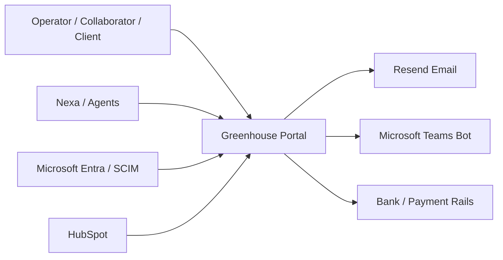
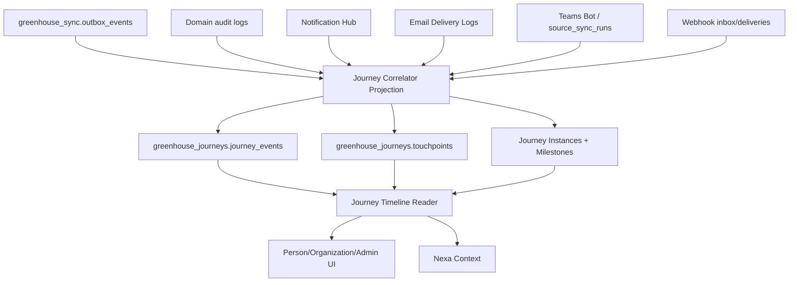

# Greenhouse Journey Intelligence Layer V1

> **Tipo de documento:** Arquitectura canonica + ADR embebido
> **Estado:** Accepted architecture; runtime no implementado
> **Version:** 1.0
> **Creado:** 2026-05-31
> **Owner:** Platform / Data / Product Operations
> **Related:** `GREENHOUSE_360_OBJECT_MODEL_V1.md`, `GREENHOUSE_NOTIFICATION_HUB_V1.md`, `GREENHOUSE_WEBHOOKS_ARCHITECTURE_V1.md`, `GREENHOUSE_STRUCTURED_CONTEXT_LAYER_V1.md`, `GREENHOUSE_TEAMS_NOTIFICATIONS_V1.md`

## Architecture Decision 2026-05-31 -- Adoptar Journey Intelligence + Touchpoint Ledger como capa transversal

- **Status:** Accepted
- **Owner:** Platform / Data / Product Operations
- **Scope:** Journeys cross-domain, touchpoints, outbox/audit/event consumption, Person 360, Organization 360, Notification Hub, Email Delivery, Teams Bot, Webhooks, Nexa context
- **Reversibility:** Two-way but slow
- **Confidence:** Medium-high
- **Validated as of:** 2026-05-31

### Context

Greenhouse ya tiene dominios fuertes: Identity/SCIM, HR, Payroll, Finance, Commercial, Notification Hub, Email Delivery, Teams Bot, Webhooks, outbox, reactive projections y 360 objects. Lo que falta es una capa que responda preguntas de proceso transversal:

- Desde que una persona entra por Azure/Entra/SCIM, que paso hasta su primer pago?
- Desde el primer contacto con un lead, que paso hasta la primera factura?
- Que touchpoints ocurrieron: email, notification, Teams bot, webhook, aprobacion, click, accion manual?
- Que hito esta bloqueado, desde cuando y quien es owner?

Resolverlo con timelines ad hoc por modulo duplicaria logica y dejaria gaps. Resolverlo con un workflow engine ejecutor centralizaria procesos que ya tienen owners de dominio. La necesidad V1 es observar, correlacionar y explicar, no ejecutar.

### Decision

Greenhouse adopta una capa transversal llamada **Journey Intelligence Layer** compuesta por:

1. **Journey Definitions** versionadas.
2. **Journey Event Log** append-only.
3. **Touchpoint Ledger** append-only.
4. **Journey Correlator** reactivo.
5. **Journey Instances / Milestones** como estado materializado.
6. **Timeline readers** para UI, Nexa y APIs internas.

La capa observa eventos, comunicaciones y estados de dominios existentes. **No reemplaza** outbox, Notification Hub, Email Delivery, Teams Bot, Webhooks, audit logs ni state machines de dominio. V1 es read-only/observational; cualquier write o resend futuro debe llamar al dominio owner.

### Alternatives Considered

#### Alternative A -- Timelines ad hoc por modulo

Cada surface arma su propia timeline desde tablas locales. Es rapido, pero crea definiciones divergentes de "onboarding", "lead-to-cash" o "contractor-to-paid", y hace imposible responder preguntas cross-domain sin recomputar.

#### Alternative B -- Workflow engine central desde V1

Usar Temporal u otro durable workflow engine para modelar y ejecutar journeys. Es potente para sagas y ejecucion durable, pero introduce un segundo owner de procesos que ya viven en HR, Finance, Commercial e Identity. Se reserva para V2 si Greenhouse necesita ejecutar procesos largos, no solo trazarlos.

#### Alternative C -- Solo BI/BigQuery

Modelar journeys solo en OLAP. Sirve para reporting agregado, pero no para operacion diaria, next actions, touchpoints, redaction por usuario, ni evidencia inmediata en Person/Organization 360.

### Consequences

Positive:

- Greenhouse gana trazabilidad causal cross-domain sin mover sources of truth.
- Person 360 y Organization 360 pueden mostrar journeys operativos con evidencia.
- Nexa puede explicar "que paso y que falta" con datos redacted y versionados.
- Notification/email/Teams/webhook dejan de ser cajas separadas; se vuelven touchpoints correlacionables.

Negative:

- Agrega una proyeccion transversal nueva que debe mantenerse idempotente y observable.
- Requiere disciplina de catalogo: no todo evento merece ser milestone o touchpoint.
- Backfills historicos seran parciales y deben declararse como `partial` o `inferred`.

Neutral:

- V1 no envia emails, no ejecuta Teams actions y no cambia procesos de dominio.
- Temporal/durable execution no queda descartado; queda fuera de scope V1.

### Runtime Contract

Hasta que exista implementacion, este documento gobierna el diseno de tasks futuras:

- Cualquier journey nuevo debe declarar definicion versionada.
- Cualquier milestone debe resolverse desde eventos o readers canonicos existentes.
- Cualquier touchpoint debe apuntar a un delivery/log existente cuando sea posible.
- No se persiste cuerpo completo de emails/Teams por default; se persiste evidencia redacted.
- La capa no ejecuta writes de dominio en V1.

### Revisit When

- Existan mas de 5 journeys productivos con acciones humanas que requieran orquestacion durable.
- Los dominios empiecen a pedir waits/retries/sagas que no encajan en outbox/reactive projections.
- El volumen de journey events exceda Postgres operacional y requiera serving OLAP/BigQuery dedicado.
- Auditoria/legal exige retencion completa de comunicaciones, no solo evidencia redacted.

### Sources / Evidence

- OpenTelemetry Traces, validado 2026-05-31: https://opentelemetry.io/docs/concepts/signals/traces/
- CloudEvents CNCF, validado 2026-05-31: https://www.cncf.io/projects/cloudevents/
- Temporal durable execution, validado 2026-05-31: https://temporal.io/home

## 1. Problem Statement

Greenhouse necesita un espacio operativo para ver journeys de usuario y negocio de extremo a extremo. Estos journeys cruzan Identity, HR, Payroll, Finance, Commercial, Notifications, Email, Teams y Webhooks. Hoy la evidencia existe, pero esta repartida: outbox, audit logs, delivery logs, state machines, source sync runs y tablas de dominio. La Journey Intelligence Layer convierte esos hechos en una linea causal legible: que paso, que falta, que touchpoints ocurrieron, que esta bloqueado, quien es owner y que evento se espera despues.

## 2. Goals and Non-goals

### Goals

- Trazar journeys cross-domain por sujeto canonico: `identity_profile`, `member`, `organization`, `commercial_party`, `space`, `contractor_engagement`, `payment_order`, `service`.
- Mostrar milestones, blockers, SLA, owner domain y next expected event.
- Mostrar touchpoints causales: in-app notification, email, Teams bot, webhook, manual action, bot command, scheduled job.
- Preservar evidencia redacted y links a logs originales.
- Alimentar Person 360, Organization 360, Admin/Ops, Nexa y reporting.
- Permitir backfill parcial con confidence explicita.

### Non-goals

- No ejecutar procesos de dominio en V1.
- No reemplazar Notification Hub, Email Delivery, Teams Bot, Webhooks, outbox o audit logs.
- No guardar el cuerpo completo de emails, Teams messages o payloads sensibles por default.
- No trackear todos los clicks o page views del portal. Solo touchpoints con valor operacional, legal, financiero, comercial o de experiencia.
- No convertir BigQuery en source of truth operacional de journeys V1.

## 3. Solution Archetypes

- **Primary:** Data platform / analytical-operational projection.
- **Secondary:** B2B SaaS multi-tenant, internal admin tool, event-driven system.
- **Why:** La capa es read-heavy y cross-domain, pero requiere freshness operacional y access/redaction por tenant/rol. Consume eventos y logs, pero no es bus de transporte.

## 4. Conceptual Model

### Journey

Proceso versionado de punta a punta.

Examples:

- `identity_to_first_payment`
- `lead_to_first_invoice`
- `contractor_engagement_to_paid`
- `space_onboarding_to_first_delivery_signal`

### Milestone

Hito verificable dentro del journey. Debe declarar:

- event/read model que lo satisface
- si es required, optional o terminal
- owner domain
- SLA
- blocked/degraded criteria
- redaction class

### Touchpoint

Interaccion o comunicacion ocurrida alrededor de un journey.

Examples:

- email verification sent
- onboarding email delivered/bounced
- in-app notification created/read
- Teams adaptive card sent
- Teams Action.Submit clicked
- webhook delivery succeeded/dead-lettered
- manual note added
- user approved/rejected a step

### Causal Link

Relacion entre un hecho y lo que provoco.

Examples:

```text
scim.internal_collaborator.provisioned
  -> notification intent created
  -> email sent
  -> email delivered
  -> user clicked verify link
```

## 5. Data Architecture

### Schema

Proposed schema: `greenhouse_journeys`.

### `journey_definitions`

Versioned registry. Source of truth can live in TS config first, then seed into DB for admin visibility.

| Column | Type | Notes |
| --- | --- | --- |
| `journey_definition_id` | uuid PK | Stable row id |
| `journey_key` | text | Example `identity_to_first_payment` |
| `version` | integer | Monotonic |
| `status` | text | `draft` / `active` / `deprecated` |
| `subject_type` | text | `identity_profile` / `organization` / etc. |
| `domain` | text | Primary owner |
| `definition_json` | jsonb | Milestones DAG, SLAs, owners, redaction |
| `created_at` | timestamptz |  |
| `deprecated_at` | timestamptz null |  |

### `journey_instances`

Materialized current state for a subject + journey version.

| Column | Type | Notes |
| --- | --- | --- |
| `journey_instance_id` | uuid PK |  |
| `journey_key` | text |  |
| `journey_version` | integer |  |
| `tenant_id` | text | Required tenant boundary |
| `subject_type` | text |  |
| `subject_id` | text | Canonical id |
| `status` | text | `not_started` / `in_progress` / `blocked` / `completed` / `abandoned` / `degraded` |
| `started_at` | timestamptz null |  |
| `completed_at` | timestamptz null |  |
| `current_milestone_key` | text null |  |
| `next_expected_event_type` | text null |  |
| `blocked_reason_code` | text null |  |
| `owner_domain` | text null |  |
| `evidence_quality` | text | `complete` / `partial` / `inferred` / `missing_source` |
| `updated_at` | timestamptz |  |

### `journey_milestone_states`

One row per milestone per instance.

| Column | Type | Notes |
| --- | --- | --- |
| `journey_milestone_state_id` | uuid PK |  |
| `journey_instance_id` | uuid FK |  |
| `milestone_key` | text |  |
| `status` | text | `pending` / `satisfied` / `blocked` / `skipped` / `expired` |
| `satisfied_at` | timestamptz null |  |
| `satisfied_by_event_id` | uuid/text null | Journey event or original event |
| `owner_domain` | text |  |
| `sla_due_at` | timestamptz null |  |
| `evidence_quality` | text |  |
| `details_json` | jsonb | Redacted summary |

### `journey_events`

Append-only normalized event log. It references source systems; it is not a replacement for outbox/audit logs.

| Column | Type | Notes |
| --- | --- | --- |
| `journey_event_id` | uuid PK |  |
| `tenant_id` | text |  |
| `journey_instance_id` | uuid null | May be linked after correlation |
| `source_event_id` | text null | Outbox/audit/webhook/source id |
| `source_system` | text | `outbox` / `audit_log` / `email_delivery` / `notification_hub` / `teams_bot` / `webhook` / `manual` |
| `source_domain` | text | `identity` / `hr` / `finance` / `commercial` / etc. |
| `event_type` | text | Stable event name |
| `subject_type` | text |  |
| `subject_id` | text |  |
| `object_refs_json` | jsonb | Other canonical objects |
| `caused_by_event_id` | text null | Cross-event causal link |
| `trigger_type` | text | `user_action` / `system_event` / `scheduled_job` / `webhook` / `bot_command` / `manual_note` |
| `actor_type` | text null | `user` / `system` / `bot` / `external` |
| `actor_id` | text null | Redacted by readers |
| `occurred_at` | timestamptz | Business time |
| `payload_summary_json` | jsonb | Redacted summary only |
| `sensitivity` | text | `public` / `internal` / `confidential` / `restricted` |
| `created_at` | timestamptz | Insert time |

### `touchpoints`

Append-only ledger for communications and interactions.

| Column | Type | Notes |
| --- | --- | --- |
| `touchpoint_id` | uuid PK |  |
| `tenant_id` | text |  |
| `journey_instance_id` | uuid null | Nullable for pre-correlation |
| `journey_event_id` | uuid null | Event this touchpoint belongs to |
| `touchpoint_type` | text | `notification` / `email` / `teams_message` / `teams_action` / `webhook_delivery` / `manual_note` / `bot_message` |
| `channel` | text | `in_app` / `email` / `teams` / `webhook` / `manual` |
| `direction` | text | `outbound` / `inbound` / `internal` |
| `recipient_kind` | text null | `member` / `client_user` / `email_only` / `teams_channel` / `external_system` |
| `recipient_ref` | text null | Recipient key, redacted by readers |
| `delivery_status` | text | `queued` / `sent` / `delivered` / `read` / `clicked` / `failed` / `bounced` / `dead_lettered` / `acknowledged` |
| `template_key` | text null | Email/card/notification template |
| `external_delivery_id` | text null | Resend, Teams, webhook delivery id |
| `source_ref_type` | text | `notification_intent` / `email_delivery` / `teams_run` / `webhook_delivery` / etc. |
| `source_ref_id` | text | Original log id |
| `caused_by_event_id` | text null | Original cause |
| `occurred_at` | timestamptz |  |
| `payload_summary_json` | jsonb | Redacted metadata; no message body by default |
| `created_at` | timestamptz |  |

## 6. Correlation Rules

Correlation must be deterministic, idempotent and explainable.

Rules:

1. Prefer stable canonical IDs over names or emails.
2. Use `identity_profile_id`, `member_id`, `commercial_party_id`, `organization_id`, `space_id`, `contractor_engagement_id` and `payment_order_id` where available.
3. Email is a weak correlation key and must be marked `inferred` unless paired with a canonical user/profile id.
4. Touchpoints inherit journey linkage from their source intent/delivery if it already has a `caused_by_event_id`.
5. Backfills must set `evidence_quality`.
6. One source event may satisfy multiple journeys only if the definition explicitly allows it.
7. No consumer may infer milestone completion from UI copy or localized labels.

## 7. First Journey Definitions

### `identity_to_first_payment`

Subject: `identity_profile`.

Milestones:

1. `external_identity_seen` -- SCIM/Entra/Graph user observed.
2. `identity_profile_created` -- canonical profile exists.
3. `member_created_or_linked` -- internal collaborator member exists.
4. `work_relationship_opened` -- active employee/contractor relationship exists.
5. `workforce_intake_completed` -- HR activation/intake ready.
6. `payment_profile_resolved` -- beneficiary payment profile ready or provider-owned.
7. `payroll_or_payable_created` -- first payroll entry or contractor payable.
8. `payment_order_created` -- Finance obligation/order exists.
9. `first_payment_settled` -- bank settlement confirmed.
10. `payment_touchpoint_delivered` -- payslip/remittance/payment notification delivered where applicable.

### `lead_to_first_invoice`

Subject: `commercial_party` or `organization`.

Milestones:

1. `lead_seen` -- HubSpot/company/contact source event.
2. `party_created` -- Organization/commercial party exists.
3. `opportunity_opened` -- opportunity/deal exists.
4. `quote_or_terms_sent` -- quote/SOW/commercial terms sent.
5. `contract_or_service_activated` -- client/service active.
6. `first_invoice_created` -- first invoice/income exists.
7. `first_invoice_sent_touchpoint` -- invoice email/webhook/touchpoint.
8. `first_payment_reconciled` -- bank/payment reconciliation confirms payment.

### `contractor_engagement_to_paid`

Subject: `contractor_engagement`.

Milestones:

1. `relationship_opened` -- person/legal entity contractor relationship exists.
2. `engagement_created` -- ContractorEngagement exists.
3. `classification_reviewed` -- classification risk clear or accepted.
4. `agreed_amount_set` -- rate amount/cadence present.
5. `work_submission_approved` -- approved evidence/submission exists, if applicable.
6. `payable_created` -- ContractorPayable exists.
7. `ready_for_finance` -- readiness passed/waived/overridden.
8. `payment_order_created` -- Finance order exists.
9. `bank_settled` -- settlement leg / expense payment confirmed.
10. `remittance_delivered` -- Comprobante de Pago visible/downloaded/delivered.

## 8. Readers and Surfaces

### Shared reader

`readJourneyTimeline({ subjectType, subjectId, journeyKey?, viewer })`

Returns:

- journey summary
- milestone states
- event timeline
- touchpoints
- blockers
- next expected event
- evidence quality
- redaction metadata

### UI surfaces

- Person 360: "Journey" facet for worker lifecycle.
- Organization 360: "Journey" facet for lead-to-cash / client onboarding.
- Admin/Ops: global journey monitor.
- Finance: payment journey side panel.
- HR: onboarding/contractor journey side panel.
- Nexa: contextual explanation with redacted evidence.

V1 UI should prefer a timeline + milestone rail, not a giant table. Operational admin views may expose dense tables for exceptions.

## 9. Access, Redaction and Retention

Hard rules:

1. Tenant boundary is mandatory on every table and reader.
2. Readers must enforce both domain permission and field-level redaction.
3. Restricted fields (RUT, bank account, salary, legal notes, email body, Teams body) are not persisted in journey/touchpoint payloads by default.
4. `payload_summary_json` must be redacted at write time.
5. A viewer may see that a touchpoint happened without seeing recipient or content.
6. Contractor/self/client views must receive a client-safe/self-safe projection, never raw internal timeline.
7. Manual notes require actor, reason and sensitivity.

Suggested retention:

- Journey instances/milestone state: long-lived operational history.
- Journey events: long-lived, redacted.
- Touchpoints: metadata long-lived; external body not stored by default.
- Debug payloads: use original source logs and their own retention policy.

## 10. Observability and Reliability

Required signals:

- `journey.correlator.dead_letter`
- `journey.instance.stuck_over_sla`
- `journey.touchpoint.unlinked`
- `journey.definition.event_mapping_drift`
- `journey.backfill.partial_coverage`
- `journey.reader.redaction_denied_rate`

SLO candidates:

- 95% of source events correlated within 5 minutes.
- 99% of timeline reads under 800ms for a single subject.
- 0 restricted payload leaks in journey/touchpoint summaries.

## 11. AI / Nexa Contract

Nexa may consume Journey Intelligence only through redacted readers.

Autonomy tier V1: `observe` / `recommend-with-approval`.

Hard rules:

- Nexa cannot infer hidden touchpoint content from metadata.
- Nexa cannot execute resend/approve/pay actions through the Journey Layer.
- Every AI response that cites a journey must expose evidence references, not raw hidden payloads.
- Journey context is structured context, not free-form prompt stuffing.

## 12. C4 Diagrams

### Context



### Containers



## 13. Implementation Plan

### Phase 0 -- Architecture and tasking

- Create this architecture/ADR.
- Open canonical tasks for first implementation slices.

### Phase 1 -- Foundation

- Schema `greenhouse_journeys`.
- TS definitions for journey definitions.
- Correlator skeleton + idempotency keys.
- Read-only timeline reader with mocked/minimal data.

### Phase 2 -- First journey: identity to first payment

- Consume SCIM/member/relationship/payroll/payment events.
- Add touchpoints from email/notification/Teams where already logged.
- Integrate in Person 360 or HR diagnostic surface.

### Phase 3 -- Commercial journey: lead to first invoice

- Consume HubSpot/Organization lifecycle/Quotation/Income/Reconciliation events.
- Integrate in Organization 360 / Commercial admin.

### Phase 4 -- Contractor journey

- Consume ContractorEngagement/WorkSubmission/Payable/PaymentOrder/Remittance events.
- Integrate with `/hr/contractors` and `/finance/contractor-payments` detail surfaces.

### Phase 5 -- UI and operational monitor

- Global journey monitor for stuck journeys and SLA breaches.
- GVC scenario for the primary timeline surface.

## 14. Self-Critique

### What breaks at 12 months

Definition drift. If every team adds milestones casually, the layer becomes noisy and untrusted. Mitigation: journey definitions require owner, version, test fixtures and evidence quality.

### What breaks at 36 months

Postgres may no longer be the right serving store for aggregate analytics over millions of events. Mitigation: keep OLTP operational readers in Postgres and add BigQuery/OLAP projections for aggregate reporting when volume demands it.

### Cognitive debt risk

High if definitions live only as JSON. Mitigation: keep TS types, human-readable docs, fixtures and generated reference tables. Every journey must explain its milestones in prose.

### Vendor lock-in

Low in V1. The layer uses Greenhouse Postgres/outbox and redacted internal events. OpenTelemetry/CloudEvents are references, not runtime dependencies.

### Unobservable failures

Silent non-correlation is the main risk. Mitigation: signals for unlinked touchpoints, event mapping drift and partial backfill coverage.

### AI-specific risks

Nexa may overstate causality from partial evidence. Mitigation: expose `evidence_quality`, confidence and source references; require honest degradation in AI summaries.

### Regional / compliance gaps

Journeys can cross HR, payroll, legal and financial data. Chile Ley 21.719 and broader privacy principles require minimization and access control. The touchpoint ledger stores metadata/evidence, not message bodies, by default.

## 15. Candidate TASKs

- `TASK-980` -- Journey Intelligence Architecture + task breakdown.
- `TASK-981` -- Journey Foundation: schema + definitions + correlator skeleton.
- `TASK-982` -- Identity to First Payment journey.
- `TASK-983` -- Lead to First Invoice journey.
- `TASK-984` -- Touchpoint Ledger integration with Notification Hub / Email / Teams.
- `TASK-985` -- Journey Timeline UI + Person/Organization 360 integration.

IDs are suggestions; use `docs/tasks/TASK_ID_REGISTRY.md` before creating actual task files.
