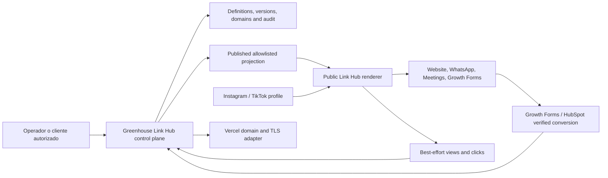

# Greenhouse Link Hub Control Plane Decision V1

## Status

`Accepted (direction) — runtime pending child tasks`

## Date

2026-07-18

## Owner

`Growth / Social Platform`, con operación compartida de `Platform/Ops` para dominios y observabilidad.

## Scope

`growth.link_hub`, Product API/Full API Parity, superficie pública `links.efeoncepro.com`, bindings de custom domain, publicación/versionado, eventos de navegación y conciliación con Growth Forms/HubSpot.

## Reversibility

`Two-way but slow`

El renderer, proveedor de hosting o forma de dominio pueden cambiar sin perder el dominio de producto si el contrato publicado se mantiene. Cambiar a un CMS externo como source of truth, o permitir forks por cliente, exigiría migrar versiones, dominios, eventos y operación y se considera una revisión material de este ADR.

## Confidence

`High` para Greenhouse como control plane/SSOT y el modelo single-codebase multi-marca; `Medium` para detalles del adapter Vercel hasta validar límites, pricing y API exacta durante `TASK-1436`.

## Validated as of

2026-07-18 — repo, arquitectura Greenhouse y documentación oficial Vercel/TikTok verificadas en esta fecha.

## Context

Efeonce necesita una URL propia para concentrar destinos desde Instagram y TikTok sin depender de Linktree ni aceptar restricciones de branding. Después debe operar la misma capacidad para clientes. El contenido, marca, publicación, dominios, evidencia y analítica deben controlarse desde Greenhouse; el visitante social no debe entrar al portal autenticado ni recibir datos internos. El sistema debe funcionar primero con `links.efeoncepro.com/efeonce`, admitir luego `links.efeoncepro.com/<slug>` y dominios de cliente como `links.cliente.com`, y conservar una sola publicación por página.

El repo ya dispone de patrones reutilizables: dominio `growth`, publicación/versionado, Growth Forms, eventos CTA, API Platform, assets, capabilities y Vercel. La arquitectura de build vigente prohíbe crear deployables por anticipado. La decisión, por tanto, debe definir una frontera headless/extraction-ready dentro de la topología actual y permitir separación física futura sólo si tráfico, aislamiento u operación lo justifican.

Arquetipo principal: **B2B SaaS multi-tenant**. Secundarios: **headless public content surface** y **event ingestion/analytics**.

## Decision

Greenhouse será el **control plane y source of truth canónico** de Link Hub. Poseerá identidad/binding de marca, definición, bloques, versiones inmutables, lifecycle, dominios, publicación, rollback, access, audit y métricas. El renderer público será un consumer sin autoría: resolverá `host + slug`, leerá sólo una proyección publicada allowlisted y emitirá eventos públicos acotados.

V1 se construirá como capacidad `growth.link_hub` en la topología actual de `greenhouse-eo`, extraction-ready y sin nuevo deployable. La URL estándar será `links.efeoncepro.com/<slug>`; un subdominio del cliente se conectará por CNAME cuando corresponda y resolverá el mismo `link_page_id`. No se comprará un dominio corto como precondición.

## Runtime Contract and boundaries

### Aggregate and source of truth

- `LinkHubPage` es el aggregate multi-marca; se vincula a la organización/space/brand mediante primitives existentes elegidos en Discovery.
- Draft y published son estados distintos. Publicar crea una versión inmutable; rollback promueve una versión previa mediante command auditado.
- Los bloques son datos tipados y ordenados. V1 admite perfil, link, link destacado, social, contacto (`https`, `mailto`, `tel`, WhatsApp), agenda y Growth Form gobernado.
- Branding es un `brand pack`/theme input sanitizado; nunca existe `if (cliente === ...)` ni CSS/JS arbitrario por tenant.

### Control plane

- Greenhouse expone readers/commands canónicos para crear, editar draft, reordenar, previsualizar, publicar, revertir, pausar, conectar dominio y leer analytics.
- La UI `/growth/link-hubs` es un consumer. Nexa, MCP, app, CLI y E2E heredan el mismo contrato conforme a Full API Parity; writes agentic usan `propose -> confirm -> execute`.
- Vercel/DNS/GA4/HubSpot son adapters. No se convierten en paneles operativos paralelos.

### Public projection and routing

- La proyección pública contiene sólo copy, URLs saneadas, asset refs públicos/firmados apropiados, theme tokens allowlisted, metadata social y versión.
- Resolución estándar: `links.efeoncepro.com/<slug>` por slug. Resolución custom: `links.cliente.com` por hostname. Ambas apuntan al mismo `link_page_id`.
- Cuando un custom domain está activo, su política de canonical/redirect se configura en la página; el evento conserva `page_id`, `version_id` y `host_class` para no fragmentar medición.
- Páginas V1 nacen `noindex, follow`; habilitar indexación requiere decisión explícita de producto/SEO por página.
- Drafts y previews nunca se resuelven por la URL pública estable; usan acceso autenticado o token preview efímero, revocable y sinindex.

### Domains

- `links.efeoncepro.com` es el dominio estándar; no se exige wildcard ni un dominio nuevo para el MVP.
- Para `links.cliente.com`, Greenhouse registra el host con el adapter, devuelve los DNS records exactos, verifica ownership/configuración y refleja estados `pending_dns|verifying|active|error|disabled`.
- Subdominios usan normalmente CNAME; apex/A/TXT/nameservers se muestran sólo según la inspección exacta del proveedor. Greenhouse no hardcodea targets globales como verdad durable.
- TLS se considera parte del rollout. `active` exige DNS y certificado verificados, no sólo que el registro exista en DB.

### Measurement and privacy

- `page_view` y `outbound_click` son evidencia browser-reported/best-effort y no audit-grade; se agregan con minimización de datos y rate/abuse controls.
- Leads/submissions/conversiones verificadas pertenecen al ledger de Growth Forms/HubSpot y se correlacionan mediante IDs/UTMs gobernados, sin duplicar el source of truth.
- No se almacenan IP cruda, user-agent completo, email ni identificadores publicitarios en eventos Link Hub V1. No se crea fingerprinting propio.
- Dark social y navegadores in-app pueden perder referrer; los reportes declaran esa limitación y no prometen atribución perfecta.

### Security and reliability

- URLs aceptan sólo schemes/kinds allowlisted; se bloquean `javascript:`, data URLs, redirects inseguros y hosts inválidos.
- Writes requieren capability fina y tenant scope; el renderer público no importa stores, secrets, SDKs de provider ni draft types.
- Eventos públicos tienen rate limits, payload allowlist, dedupe razonable y errores sanitizados.
- Señales mínimas: publicación fallida, dominio/TLS degradado, proyección stale, ingest backpressure y link destination health opcional sin falsear disponibilidad.
- Una publicación previa sigue servible si el control plane temporalmente falla; no se elimina una versión publicada durante un edit.

## System context

## Alternatives considered

### Linktree/Beacons/SaaS externo

Rechazado como source of truth por límites de branding, pricing/control y fragmentación de analítica. Puede servir como fallback temporal durante incidente, no como arquitectura objetivo.

### WordPress page por marca

Rechazado porque crea páginas manuales, lifecycle/roles distintos y alto riesgo de forks. WordPress puede ser destino de enlaces; no es el control plane de esta capacidad.

### Repo o deployable por cliente

Rechazado: multiplica builds, dominios, rollback y drift sin una necesidad de aislamiento probada. Una sola base multi-tenant cubre el caso.

### Renderer autorable o page builder libre

Rechazado para V1. HTML/JS arbitrario rompe seguridad, accesibilidad y coherencia de marca. Se usarán bloques tipados y variantes oficiales.

### Sólo dominio personalizado

Rechazado porque bloquea onboarding por coordinación DNS. La URL Efeonce funciona inmediatamente; el dominio del cliente es una mejora opcional.

## Consequences

### Positive

- Efeonce controla marca, contenido, dominios y evidencia sin dependencia de un proveedor Link-in-Bio.
- El mismo motor sirve a Efeonce y clientes mediante datos/brand packs, sin forks.
- Publicación versionada y rollback reducen riesgo de enlaces rotos en perfiles sociales.
- Full API Parity permite operar la capacidad desde UI, Nexa, MCP, CLI y pruebas sin duplicar lógica.
- La separación control plane/proyección pública deja abierta una extracción futura sin cambiar el aggregate.

### Negative

- Greenhouse asume operación de disponibilidad, abuse protection, DNS/TLS y privacidad que un SaaS externo resolvía.
- Los dominios personalizados dependen de coordinación DNS externa y pueden tardar en activarse.
- El modelo de eventos browser-reported no puede probar identidad ni atribución completa.
- El programa requiere varias tasks antes de activar el perfil social de Efeonce.

### Neutral / contextual

- “Todo controlado desde Greenhouse” no significa que el browser público ejecute dentro de una sesión Greenhouse; significa que no existe otro CMS/control plane.
- La única acción inevitable fuera de Greenhouse V1 es que el dueño del DNS agregue el record solicitado, y que el owner de Instagram/TikTok confirme el cambio de bio.
- TikTok declara que el website link depende de elegibilidad de cuenta (por ejemplo, Registered Business Account o umbral aplicable); `TASK-1438` debe verificar el estado real de Efeonce antes del cutover.

## Rollout

1. Foundation/API y versionado (`TASK-1433`).
2. Renderer público y QA (`TASK-1434`).
3. Cockpit Greenhouse (`TASK-1435`).
4. Dominios/SSL (`TASK-1436`) y medición (`TASK-1437`).
5. Piloto Efeonce, primero URL directa y luego bio Instagram/TikTok (`TASK-1438`).
6. Primer cliente y catálogo de servicio (`TASK-1439`).

Cada paso debe ser aditivo y rollbackable. La activación de la bio social ocurre sólo después de un smoke live y conserva la URL anterior durante la ventana de observación.

## Revisit when

- El tráfico o número de dominios exige aislamiento/edge registry que la topología actual no soporta.
- Un cliente exige residencia, certificado, WAF o aislamiento por proyecto contractual.
- Más de un runtime público necesita consumir el contrato y la extracción física reduce costo/riesgo con evidencia.
- La plataforma de hosting cambia su contrato de custom domains/SSL o pricing de forma material.
- Link Hub evoluciona a commerce, autenticación del visitante o datos sensibles; esas capacidades requieren ADR propio.

## Self-critique and cognitive debt

- **12 meses:** el riesgo principal es que blocks/themes crezcan como un page builder implícito. Mitigación: registry tipado, límite V1 y ADR/task para cada nueva familia de comportamiento.
- **36 meses:** custom domains y eventos pueden superar una tabla/adapter simple. Mitigación: conservar IDs/versiones provider-neutral y medir dominios, RPS, latencia y error rate antes de extraer.
- **Lock-in:** Vercel queda detrás de un adapter y status model propio; published projection y domain model no almacenan IDs vendor como identidad canónica.
- **No observable:** cambios externos de DNS y destinos que empiezan a fallar. Mitigación: status/readback y señales, sin prometer que un health check prueba conversión.
- **Compliance:** evitar PII/fingerprinting en clickstream y reutilizar consent/conversion truth de Growth Forms; revisión legal/privacy antes del primer cliente.
- **Cognitive debt:** ADR + EPIC + tasks documentan una sola ruta para authoring/publicación/domains/events. No se permiten scripts ad hoc como operación permanente.
- **AI-specific:** no hay AI en V1; Nexa es sólo consumer del contrato gobernado y nunca publica sin confirmación humana.

## Sources / evidence

- Vercel, “Vercel for Platforms”: single-codebase multi-tenant con subpaths/custom domains y soporte de dominio/SSL. Validado 2026-07-18: https://vercel.com/platforms
- Vercel, “Setting up a custom domain”: inspección de records exactos, CNAME para subdominio, A para apex y verificación SSL. Validado 2026-07-18: https://vercel.com/docs/domains/set-up-custom-domain
- Vercel, “Working with domains”: reglas de subdomain/wildcard y ownership. Validado 2026-07-18: https://vercel.com/docs/domains/working-with-domains
- TikTok Help Center, “Link a website or social media account”: elegibilidad y flujo de website link. Validado 2026-07-18: https://support.tiktok.com/en/getting-started/setting-up-your-profile/linking-another-social-media-account
- Repo: `docs/architecture/GREENHOUSE_FULL_API_PARITY_DECISION_V1.md`, `docs/operations/MODULAR_MIGRATION_NEW_WORK_OPERATING_MODEL_V1.md`, `docs/context/03_ecosistema-producto.md`.
