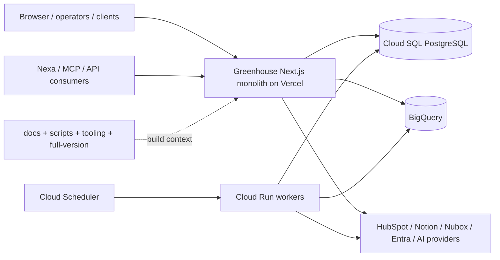
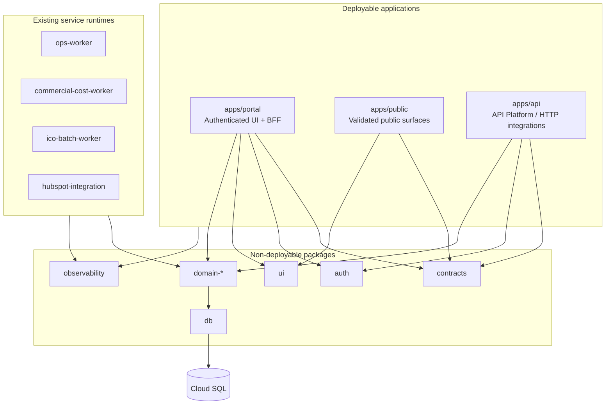

# Greenhouse Modular Build & Runtime Architecture V1

> Status: `Proposed`
> Version: `1.0`
> Date: `2026-07-10`
> Governing decision: `GREENHOUSE_MODULAR_BUILD_RUNTIME_DECISION_V1.md`

## 1. Purpose

Define the target architecture and incremental migration path for reducing Greenhouse build cost, local resource pressure and deployment coupling without rewriting the product or fragmenting its business invariants.

This document governs `EPIC-026`. It does not itself authorize a workspace move or a production cutover; child tasks do.

## 2. Current state

Greenhouse is primarily one Next.js 16 application deployed to Vercel, backed by shared Cloud SQL and complemented by Cloud Run workers. The same repository also contains migrations, release tooling, visual capture, operational scripts, large documentation trees and the local `full-version` reference.

Preliminary inventory on 2026-07-10:

| Dimension | Baseline |
| --- | ---: |
| App Router entrypoints | 1,225 |
| Pages | 279 |
| Route handlers | 946 |
| Files under `src/` | 6,140 |
| `src/` size | ~56 MB |
| `docs/` size | ~89 MB |
| `scripts/` size | ~41 MB |
| `full-version/` size | ~25 MB |
| Build heap ceiling | 8 GB |
| Static generation workers | capped at 4 |

These are orientation values, not the accepted performance baseline. `TASK-1376` must measure p50/p95, cache state and billed build data reproducibly.

### Current container view



## 3. Architecture principles

1. **Build boundary is not a domain rewrite.** Deployment isolation must not split canonical business transactions.
2. **Contracts before containers.** A deployable boundary is valid only after dependencies flow through governed contracts.
3. **One primitive, many consumers.** UI, Nexa, MCP, API, workers and CLI reuse the same commands/readers.
4. **Server-only is explicit.** DB, secrets and privileged SDKs cannot leak through shared browser packages.
5. **Affected-only is measurable.** A new workspace must prove that unrelated changes skip install/build/test work.
6. **Version skew is normal.** Contracts are backward-compatible during independent deployments.
7. **Rollback is route-level.** Every extraction retains a reversible routing seam until equivalence is proven.
8. **No catch-all shared package.** Shared packages are cohesive and have owners.
9. **Local-first remains canonical.** Developers can start and validate the smallest useful graph.
10. **Stop when marginal value turns negative.** Completing every target container is not an objective.

## 4. Target logical topology



`apps/public` and `apps/api` are candidate shapes, not pre-approved extractions. The evidence task may choose a different first unit or recommend remaining with one app after package extraction.

## 5. Dependency rules

Allowed direction:

```text
apps/services -> domain adapters -> domain primitives -> contracts
apps/services -> auth / observability / db adapters
browser UI -> browser-safe contracts + UI primitives
```

Forbidden direction:

- packages importing an app;
- browser packages importing DB, Secret Manager or server-only SDKs;
- one domain importing another domain's store internals;
- UI implementing business writes locally;
- services deep-importing another app's files;
- circular package dependencies;
- `packages/shared` as a general escape hatch.

The program must add machine-enforced boundaries before or with the first workspace extraction.

## 6. Runtime responsibilities

### Portal

- Authenticated page composition and presentation-specific BFF.
- Session establishment and capability-aware rendering.
- Thin consumption of canonical readers/commands.
- No batch processing or external sync loops.

### Public

- Only public surfaces whose auth, caching, abuse protection and release cadence justify a separate unit.
- No direct access to sensitive domain records; consume allowlisted public projections.
- Public writes remain governed commands with generic responses and abuse controls.

### API Platform

- Stable programmatic contracts for first-party, ecosystem and agent consumers.
- Versioned envelopes, tenant-safe authz, idempotency and sanitized errors.
- Must not become a duplicate business-logic service; it adapts canonical primitives.

### Workers

- Existing workload-placement policy remains: batch, async, scheduled and long-running work belongs in GCP services.
- Workers consume the same packages/contracts where technically safe, or built artifacts with explicit dependency manifests.

## 7. Auth, routing and version skew

- Preserve canonical public hostnames and route paths during migration.
- Prefer reversible Vercel rewrites/proxy routing over immediate URL changes.
- Session cookies, OAuth callbacks, CSRF/CORS and CSP must be modeled before cross-app routing.
- A contract change must use expand/contract: deploy tolerant readers first, then writers, then remove legacy fields in a later release.
- Each runtime exposes its commit/deployment identity to health checks without leaking secrets.
- Cross-runtime calls carry correlation ID and actor/tenant context through a signed, least-privilege contract; raw browser claims are never trusted.

## 8. Build and repository strategy

The target repository uses workspaces with explicit package manifests and dependency declarations. Vercel projects point at deployable app roots and use affected-project skipping. Tooling and docs remain at the repository root unless a measured benefit justifies another workspace.

Before exclusion from deployment context:

- Roadmap runtime filesystem reads must be replaced by a materialized index or another governed projection.
- `full-version/` must remain reference-only and must not be imported by active code.
- operational scripts must declare whether they are app build inputs, service build inputs or local tooling.
- `.vercelignore` changes must be fail-safe and verified against output tracing.

## 9. Local developer experience contract

The target must provide:

- a command to start portal-only;
- a command to start the minimum integrated stack;
- affected-only lint, typecheck and tests;
- a full compatibility gate before release;
- deterministic env validation per app/service;
- clear failure when a required dependency is not running;
- no need to allocate an 8 GB Node heap for routine local checks after the relevant migration phase.

## 10. Observability and release contract

Every deployable unit must emit:

- application/service name;
- commit SHA and deployment ID;
- environment;
- correlation/trace ID;
- contract version when crossing runtime boundaries;
- sanitized error code;
- latency and failure signal for cross-runtime calls.

The release control plane must distinguish `code complete`, `deployed`, `routed`, `verified` and `rolled back` per unit, while retaining an aggregate Greenhouse health verdict.

## 11. Migration phases

### Phase 0 — Evidence and containment

- Measure baseline and costs.
- Generate build/import graph.
- Identify high-fanout dependencies and route clusters.
- Remove safe build-context waste.
- Select or reject the first extraction.

### Phase 1 — Workspace foundation

- Introduce workspace manifests and package boundary gates.
- Extract contracts/tooling without changing runtime behavior.
- Prove full and affected-only builds produce equivalent output.

### Phase 2 — Pilot extraction

- Extract one low-risk, high-value unit behind routing seam.
- Run old/new paths in parallel where practical.
- Verify auth, URLs, observability, performance and cost.
- Roll traffic forward only after equivalence.

### Phase 3 — Operational integration

- Extend release manifests, health and rollback to multiple app units.
- Formalize cross-app contract compatibility and ownership.
- Rebaseline developer and Vercel economics.

### Phase 4 — Continue, pause or stop

- Continue only for boundaries whose measured benefit exceeds operational cost.
- Do not extract domains solely for architectural symmetry.

## 12. Boundary selection rubric

| Criterion | Weight | Good candidate signal |
| --- | --- | --- |
| Build reduction | High | Removes material entrypoints/dependencies from portal graph |
| Change independence | High | Changes rarely require atomic edits with portal internals |
| Auth/data risk | High | Public/read-only or clean governed contract |
| Routing reversibility | High | Can proxy or revert without URL/data migration |
| Operational burden | Medium | Few secrets, jobs and external callbacks |
| Local DX benefit | Medium | Removes heavy SDKs/tooling from common loop |
| Ownership clarity | Medium | Coherent capability with named maintainer |

## 13. Success metrics

`TASK-1376` establishes exact targets. At minimum the program must track:

- Vercel build p50/p95 and billed Build CPU Minutes;
- local clean/cached build p50/p95 and peak RSS;
- dev cold-start and route-ready time;
- lint/typecheck/test duration for affected-only and full graphs;
- install/cache hit duration;
- bundle/function size for the extracted unit and remaining portal;
- percentage of changes that avoid rebuilding unrelated units;
- deployment failure and rollback rate;
- time-to-diagnose cross-runtime incidents.

## 14. Risks and controls

| Risk | Control |
| --- | --- |
| Cosmetic folder move with no build savings | Evidence gate and before/after measurements |
| Shared package recreates global rebuild | Cohesive packages, dependency graph gate, fanout budget |
| Auth drift between apps | One auth contract, route-level smoke, session/callback tests |
| Duplicate DB pools or business writes | Server-only DB package and canonical primitive enforcement |
| Version skew breaks rollout | Backward-compatible contracts and expand/contract sequencing |
| More projects cost more than they save | TCO scorecard per extraction and explicit stop decision |
| PII leaks into cross-app logs | Allowlisted envelopes, redaction and security review |
| Release complexity hides partial failure | Per-unit manifest plus aggregate health |

## 15. Non-goals

- Split PostgreSQL by application or domain.
- Replace Next.js, React, MUI or Vuexy.
- Move the portal away from Vercel.
- Introduce Kubernetes, service mesh or microfrontends.
- Rewrite existing domains.
- Reorganize all code in a single PR.
- Make every route a network service.

## 16. What must be verified before implementation

- Current Vercel billing/export and build-machine configuration.
- Current route/build graph with cold and warm cache.
- Actual `.vercelignore`/output tracing behavior.
- Session cookie and OAuth callback constraints under candidate routing.
- Which packages are browser-safe versus server-only.
- Whether the first boundary can deploy independently without cross-transaction writes.
