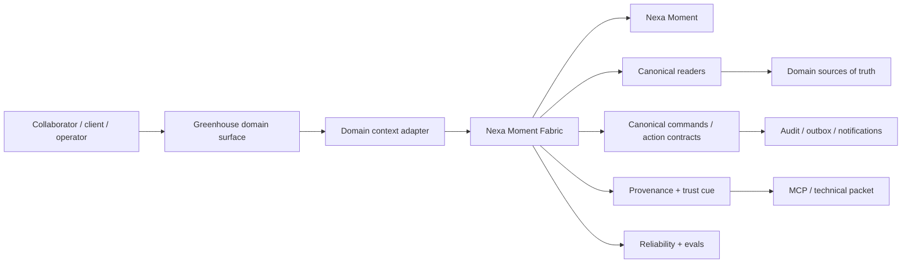

# Greenhouse Nexa Moment Fabric Architecture V1

> Tipo de documento: arquitectura de producto/plataforma
> Status: Accepted direction; implementation gated per task
> Version: V1
> Fecha: 2026-06-13
> Owner: Product / Nexa / Platform Architecture
> ADR: `GREENHOUSE_NEXA_CORE_AGENTIC_PLATFORM_DECISION_V1.md`

## 1. Purpose

This document defines the operating architecture for the **Nexa Moment Fabric**: the shared product/platform layer that lets Greenhouse behave as an agentic platform across collaborators, clients and operators.

It does not ship runtime by itself. It gives TASK-1095, TASK-1096, TASK-1101 and future domain pilots a durable direction:

> Nexa does not live in a screen. Nexa lives in context.

## 2. Product Thesis

Greenhouse is ASaaS: the software interface makes the agency service permanent, transparent and cumulative. Nexa strengthens that model when it turns operational memory into explanation, recommendation, follow-up and eventually governed action.

The product standard is not "AI everywhere." It is:

```text
Nexa Moment = context + evidence + permission + intent + next step
```

If one part is missing, the moment must degrade:

- missing context -> ask for the missing context or stay quiet
- missing evidence -> say what is known and what is not grounded
- missing permission -> redact or omit restricted detail
- missing intent -> avoid interrupting the workflow
- missing next step -> explain, do not pretend to act

## 3. Relationship to Existing Nexa Surfaces

| Surface | Role | Fabric relationship |
| --- | --- | --- |
| Nexa Chat | Direct/global conversation | One manifestation of the fabric, useful for exploration and broad questions. |
| Nexa Answers | Embedded contextual answer | Canonical embedded answer surface, currently `NexaAnswersCanvas`. |
| Nexa Insights | Proactive/advisory signal layer | Can promote an insight into a Nexa Moment with signal/enrichment context. |
| Knowledge Nexa lens | First real low-risk grounded consumer | Runtime path remains Knowledge while it converges toward the fabric. |
| MCP / technical lane | Agent/technical inspection | Consumes provenance/resource/tool packets without becoming human chat UI. |

## 4. Vocabulary

| Term | Definition |
| --- | --- |
| AI Moment | Any moment where AI contributes perception, explanation, summary, recommendation or automation. |
| Conversational Moment | AI moment with direct question/answer/follow-up behavior. |
| Nexa Moment | Greenhouse-branded moment with Nexa identity, local context, trust cue/provenance and optional next step. |
| Moment Fabric | The shared substrate for context, evidence, permissions, actions, reliability and UI composition. |
| Context Adapter | Domain-specific function/view-model that contributes safe refs, labels, data reality, sensitivity, provenance refs and allowed actions. |
| Action Boundary | The line between explain/suggest and draft/execute, enforced by commands/readers/capabilities. |

## 5. C4 Context



## 6. Core Components

### 6.1 Context

The context boundary starts from `NexaAnswersSurfaceContext` and evolves through TASK-1095. It must remain serializable, redaction-aware and safe to persist.

Minimum fields:

- `surfaceId`
- `domain`
- `placement`
- `dataReality`
- `sensitivity`
- `allowedRenderers`
- `allowedActions`
- safe entity/time/provenance refs when available

Hard rule: context carries refs and resolved policy outputs, not raw private records.

### 6.2 Evidence and Provenance

The fabric uses a layered evidence model:

| Layer | Audience | Default visibility | Owner |
| --- | --- | --- | --- |
| Layer 0 runtime substrate | Runtime/evals/replay | Hidden | domain packet + `ConversationalEvidencePacket` |
| Layer 1 trust cue | Human user | Compact | `NexaProvenanceTrace inline` |
| Layer 2 proof detail | Human inspection | On demand | `NexaProvenanceTrace panel` / `NexaEvidencePanel` |
| Layer 3 technical packet | MCP/agents/operators | Explicit technical surface | MCP/resource/tool lane |

Evidence supports the answer. It is not the protagonist of the default conversation.

### 6.3 Actions

Actions are not buttons copied into UI. They are domain commands or command candidates.

| Autonomy tier | Fabric behavior |
| --- | --- |
| `inform` | Explain/summarize; no action. |
| `recommend` | Suggest next step; no mutation. |
| `draft` | Prepare an artifact/action for review. |
| `execute_requires_confirmation` | Execute after explicit confirmation through governed command. |
| `execute_autonomous` | Out of scope for V1; requires separate ADR/task/evals/kill switch. |

An action is eligible only if it has:

- canonical command/API/readers
- server-side authorization
- tenant-safe scope
- idempotency/retry behavior where applicable
- audit/outbox/notification trail where applicable
- sanitized errors and degradation

## 7. Domain Synergy Map

| Domain | Example moment | Context contribution | Evidence/provenance | Likely next step | V1 posture |
| --- | --- | --- | --- | --- | --- |
| Knowledge | "What does this policy say?" | document refs, query, freshness, corpus scope | `knowledge-search.v1` -> `nexa-evidence.v1` | ask follow-up / open source | Runtime first via TASK-1101 |
| Finance/chart | "Why did margin move?" | metric id, period, comparison, calculation refs | finance reader/calculation packet | explain variance / suggest drilldown | First non-Knowledge pilot candidate |
| Agency / Account 360 | "Why is this account at risk?" | organization refs, Pulse/account signals, HubSpot/Bow-tie state | account health + engagement signals | recommend next action / prepare brief | Pilot candidate |
| People / Person 360 | "What context matters for this collaborator?" | person ref, role, relationship, sensitivity tier | HR/payroll/delivery refs filtered by access | explain / recommend manager next step | Redaction-first |
| Commercial | "What changed in this lifecycle stage?" | deal/org refs, lifecycle, motion flags, owner | HubSpot/Bow-tie freshness + CRM events | next-best-action | Pro+/internal first |
| Delivery / ICO | "Why did RpA or OTD shift?" | task/asset/project refs, metric window, exception state | ICO metric snapshots + transition logs | recommend unblock path | Strong fit with Revenue Enabled |
| Client Portal | "What should I approve or review?" | tenant-safe project/account refs, tier, allowed actions | client-safe proof only | approve/request/ask follow-up | Requires extra safety |
| Admin/Ops | "What is unhealthy?" | reliability signals, jobs, deploy/runtime context | logs/signals/status packets | triage / open runbook | Internal-only |

## 8. Eligibility Rules

A surface should expose a Nexa Moment only when at least one is true:

- It can answer a domain question faster than navigation alone.
- It reveals a cross-domain relationship the user would otherwise miss.
- It can explain a metric movement or anomaly with provenance.
- It can reduce self-service friction through a safe next step.
- It can make an operational limitation explicit and actionable.

A surface should avoid or suppress a Nexa Moment when:

- the context is too thin to ground an answer;
- the user lacks permission for the relevant data;
- the moment would duplicate visible UI without adding synthesis;
- there is no honest next step;
- the domain cannot provide safe refs/provenance;
- the answer would imply certainty the data does not support.

## 9. UI Composition Contract

The fabric does not create skins per domain. Product surfaces compose existing primitives:

- `NexaAnswersCanvas` for embedded answers;
- `NexaConversationBubble` for base turns;
- `NexaAnswerBubble` for enriched answer blocks;
- `NexaProvenanceTrace` for trust/proof;
- `NexaResponseToolbar` for response chrome;
- `NexaStreamingText` for progressive reveal;
- `AdaptiveSidecarLayout` and `GreenhouseFloatingSurface` for placements where appropriate.

Domain-specific differentiation enters through:

- context labels,
- answer content,
- allowed actions,
- data reality,
- sensitivity,
- provenance,
- copy from `src/lib/copy/*`.

It does not enter through a new chat shell.

## 10. Runtime and API Parity

Every business-relevant Nexa Moment must have or plan a programmatic equivalent.

- Reads use canonical readers.
- Writes use canonical commands.
- UI actions do not become remote click handlers.
- MCP/app/agent lanes can inspect or execute through the same primitives when authorized.
- No surface reads tables directly to "help Nexa answer."

This inherits `GREENHOUSE_FULL_API_PARITY_DECISION_V1.md`.

## 11. Reliability and Evals

TASK-1095 must define the first mechanical signals. Minimum candidates:

| Signal | Steady state | Purpose |
| --- | --- | --- |
| `nexa.moment.context_invalid` | 0 | Detect malformed or unsafe context. |
| `nexa.moment.unsupported_domain` | 0 | Detect moments attempted without adapter support. |
| `nexa.moment.proof_unavailable` | trend down / explainable | Detect missing evidence where proof was expected. |
| `nexa.moment.action_unavailable` | explainable | Detect suggested action without executable capability. |
| `nexa.moment.degraded_answer_rate` | bounded by domain | Track honest degradation without hiding it. |

Eval dimensions:

- grounding correctness;
- permission/redaction correctness;
- answer usefulness;
- next-step appropriateness;
- false certainty rate;
- domain adapter coverage;
- latency and cost by moment type.

## 12. Adoption Sequence

1. **Direction ADR:** this decision and architecture doc.
2. **TASK-1095:** core substrate, context contract, adapter protocol, reliability/evals.
3. **TASK-1096:** domain experience specimens and UX rules.
4. **TASK-1101:** Knowledge runtime promotion on the existing contract.
5. **First non-Knowledge pilot:** finance/chart explanation or Account 360 signal explanation.
6. **Client Portal pilot:** only after sensitivity, redaction, tiering and action boundary are proven internally.
7. **Execution tiers:** draft/execute/autonomous require separate ADR/task and domain sign-off.

## 13. Non-Goals

- No fully autonomous agent execution in V1.
- No domain-local chats or answer surfaces.
- No client-visible AI moment without tenant-safe context and proof policy.
- No raw finance/payroll/HR/HubSpot payloads in `surfaceContext`.
- No replacement of existing modules with chat.
- No model/provider lock-in decision.
- No promise that all current surfaces are already runtime-compliant.

## 14. Hard Rules

- NUNCA crear `FinanceNexaChat`, `AgencyChat`, `PersonChat`, `ClientChat` o equivalents.
- NUNCA crear un `surfaceContext` paralelo.
- NUNCA inferir permission desde route/role/visible tab.
- NUNCA mostrar proof como body principal de una respuesta humana por defecto.
- NUNCA vender un moment como "actionable" si no existe capability/command/API path.
- NUNCA usar Nexa para ocultar incertidumbre; degradar honestamente.
- SIEMPRE documentar el autonomy tier de cada new moment.
- SIEMPRE agregar specimen/GVC cuando el moment es UI visible/repetible.

## 15. Related Docs

- `GREENHOUSE_NEXA_CORE_AGENTIC_PLATFORM_DECISION_V1.md`
- `GREENHOUSE_NEXA_ARCHITECTURE_V1.md`
- `GREENHOUSE_NEXA_AGENT_SYSTEM_V1.md`
- `GREENHOUSE_NEXA_INSIGHTS_LAYER_V1.md`
- `GREENHOUSE_CONVERSATIONAL_EXPERIENCE_PLATFORM_DECISION_V1.md`
- `GREENHOUSE_CONVERSATIONAL_EXPERIENCE_PLATFORM_V2.md`
- `ui-platform/CONVERSATIONAL_EXPERIENCE.md`
- `GREENHOUSE_FULL_API_PARITY_DECISION_V1.md`
- `GREENHOUSE_API_PLATFORM_ARCHITECTURE_V1.md`
- `GREENHOUSE_ENTITLEMENTS_AUTHORIZATION_ARCHITECTURE_V1.md`
