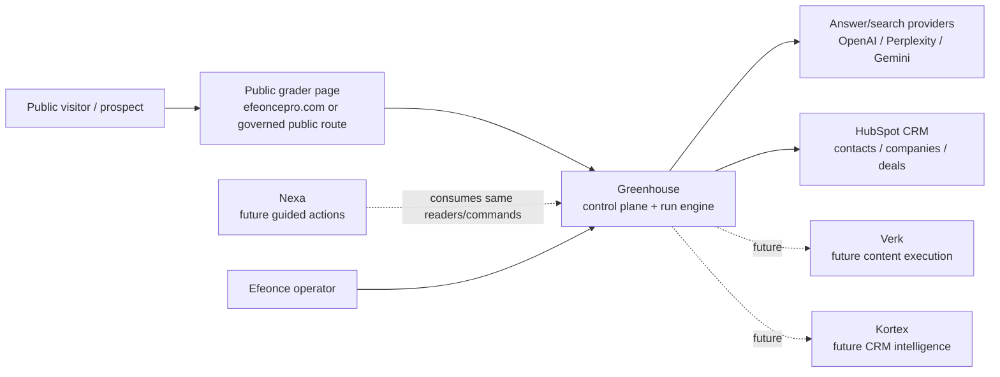
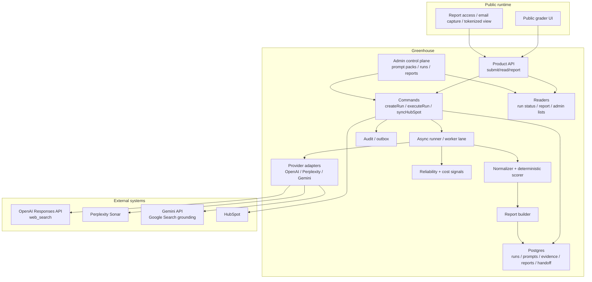

# Greenhouse Public AI Visibility Grader Architecture V1

> Tipo de documento: arquitectura de producto/plataforma
> Status: Accepted direction — no runtime changes yet
> Version: V1
> Fecha: 2026-06-24
> Owner: Product / Platform Architecture / Marketing Operations / GTM
> ADR: `GREENHOUSE_PUBLIC_AI_VISIBILITY_GRADER_DECISION_V1.md`
> Domain: `growth` (`GREENHOUSE_GROWTH_DOMAIN_ARCHITECTURE_V1.md`)
> Runtime contract: `greenhouse-public-ai-visibility-grader.v1` (planned)

## 1. Purpose

This document defines the target architecture for a public AI visibility grader administered from Greenhouse.

It intentionally stops before implementation. It provides the decision-grade contract needed before creating formal tasks:

```text
public diagnostic surface -> Greenhouse governed run engine -> evidence + scoring -> report -> HubSpot handoff -> future Verk/Kortex/Greenhouse action
```

The capability should enter the market as a simple public grader, but internally it must be treated as a Greenhouse acquisition/control-plane primitive with evidence, governance, cost controls and API parity from day one.

Canonical domain decision:

```text
growth owns acquisition intelligence and pre-pipeline diagnostic motions;
commercial owns qualified revenue motion after handoff.
```

## 2. Product thesis

Efeonce's GTM names AEO / AI visibility as a low-ticket, urgent entry product and a path into content, CRM and broader GTM work. HubSpot has validated the public category with AEO Grader, but Efeonce's opportunity is different:

```text
HubSpot measures brand perception in answer engines.
Efeonce turns answer-engine visibility gaps into an operating plan across Greenhouse, Verk, Kortex and HubSpot.
```

The durable product is not only "your score is 47/100". The durable product is:

- how answer engines describe the brand;
- where competitors appear instead;
- which citations and source types shape the answer;
- whether the brand owns its category in buyer-intent prompts;
- which narrative gaps should become content, CRM, PR, SEO/AEO or sales actions;
- how those actions enter HubSpot/Greenhouse for follow-up.

The public surface should be market-legible. The internal product architecture should preserve Efeonce IP:

| Layer | Recommended label | Use |
| --- | --- | --- |
| Public lead magnet | AI Visibility Grader | Fast comprehension for prospects. |
| Sales artifact | AI Visibility Snapshot | Short report attached to HubSpot/account motion. |
| Paid diagnostic / strategic offer | Surround Discovery Audit | Proprietary Efeonce framing. |
| Client recurring module | Greenhouse AI Visibility Monitor | Future Greenhouse client surface. |

## 3. Archetype

Primary archetype: **B2B SaaS multi-tenant + public acquisition surface**.

Dominant risk: a public form and AI provider workflow feeds internal CRM/account data. The system must avoid tenant leakage, CRM pollution, provider cost runaway and low-quality public output.

Secondary archetypes:

- **Agentic AI system**: provider calls, extraction, scoring, recommendations and future Nexa/Verk actions require AI-specific observability and evals.
- **CRM / workflow**: HubSpot remains source of truth for commercial motion and lead/deal ownership.
- **Headless content/public site**: the visitor surface lives on `efeoncepro.com` / public web runtime and must preserve SEO/performance/legal posture.
- **Internal tool/admin**: Greenhouse admins configure prompts, scoring, providers, review queues and rollouts.
- **Data platform / analytical**: historical runs become datasets for trends, benchmarks and future client monitoring.

## 4. System context



## 5. Container view



## 6. Source-of-truth boundaries

| Concern | Source of truth | Notes |
| --- | --- | --- |
| Public marketing copy / landing page | Public site runtime governed by public-site architecture | The page is a consumer, not the scoring owner. |
| Grader configuration | Greenhouse `growth` domain | Prompt packs, provider mix, scoring weights, report templates. |
| Prompt taxonomy | Greenhouse `growth` domain | Versioned and immutable per run. |
| Run lifecycle | Greenhouse `growth` domain | `draft/submitted/queued/running/partial/completed/failed/review_required/synced`. |
| Provider raw responses | Greenhouse `growth` evidence store | Evidence input, not business truth. |
| Normalized findings | Greenhouse `growth` domain | Derived from provider evidence under schema/version. |
| Score | Greenhouse `growth` deterministic scorer | Recomputable from normalized findings + score version. |
| Public report | Greenhouse `growth` report builder | Bounded public view over findings. |
| CRM identity and commercial ownership | HubSpot | Contacts, companies, deals, owner, lifecycle. |
| HubSpot handoff state | Greenhouse `growth` + HubSpot | Growth records attempt/result; HubSpot records CRM outcome. |
| Qualified revenue motion | `commercial` | Begins after explicit handoff into deals/quotes/contracts/pipeline work. |
| Content execution plan | Future Verk | Not V1. |
| CRM implementation/advisory plan | Future Kortex | Not V1. |

## 7. Core domain model

The implementation should use the new Growth domain.

Canonical placement:

| Concern | Value |
| --- | --- |
| Module key | `growth` |
| PostgreSQL schema | `greenhouse_growth` |
| TypeScript root | `src/lib/growth/ai-visibility/` |
| Capability prefix | `growth.ai_visibility.*` |
| Reliability signal prefix | `growth.ai_visibility.*` |
| Public API family | `/api/public/growth/ai-visibility/**` |
| Admin API/UI family | `/api/admin/growth/ai-visibility/**`, `/admin/growth/ai-visibility` |

`commercial` should receive only bounded handoff artifacts and promoted opportunities. It should not own `grader_profile`, `grader_run`, `prompt_pack`, provider observations, scoring or report lifecycle.

### 7.1 Aggregate: `grader_profile`

Represents the subject being graded.

Fields:

- `profile_id`
- `brand_name`
- `website_url`
- `country`
- `region`
- `language`
- `industry`
- `product_or_service`
- `buyer_persona`
- `competitors_declared[]`
- `hubspot_company_id` nullable
- `greenhouse_organization_id` nullable
- `created_from`: `public_form | internal_admin | client_monitor`

Rules:

- Website URL is normalized and stored separately from display input.
- Competitors declared by the visitor are input data, not verified facts.
- Existing Greenhouse/HubSpot identity must be resolved server-side.

### 7.2 Aggregate: `grader_run`

Represents one diagnostic run.

Fields:

- `run_id`
- `profile_id`
- `run_kind`: `public_snapshot | internal_audit | client_monitor | competitor_research`
- `status`
- `prompt_pack_version`
- `score_version`
- `report_template_version`
- `provider_policy_version`
- `requested_by_type`: `public_visitor | operator | system`
- `requested_by_user_id` nullable
- `public_lead_id` nullable
- `hubspot_sync_status`
- `cost_estimate_usd`
- `cost_actual_usd`
- `created_at`, `started_at`, `completed_at`

Lifecycle:

```text
submitted -> queued -> running -> completed
submitted -> queued -> running -> partial -> review_required -> completed
submitted -> queued -> running -> failed
completed -> synced_to_hubspot
completed -> archived
```

### 7.3 Aggregate: `prompt_pack`

Versioned prompt set for a market/industry/persona.

Fields:

- `prompt_pack_id`
- `version`
- `locale`
- `industry`
- `persona`
- `prompt_count`
- `status`: `draft | active | deprecated`
- `owner`
- `eval_status`

Prompt dimensions:

- `awareness`
- `problem_aware`
- `consideration`
- `comparison`
- `trust`
- `purchase_intent`
- `local_intent`
- `enterprise_intent`
- `risk_reputation`
- `post_sale_expansion` for client monitoring

Rules:

- A run stores the exact prompt text/version used.
- Prompt packs cannot be edited in place once active; create a new version.
- Public V1 should start with a small prompt pack, not a broad generic universe.

### 7.4 Aggregate: `provider_observation`

One provider answer for one prompt.

Fields:

- `observation_id`
- `run_id`
- `prompt_id`
- `provider`: `openai | perplexity | gemini | manual_import`
- `model`
- `provider_request_hash`
- `provider_response_pointer`
- `answer_text_hash`
- `citations_json`
- `usage_json`
- `latency_ms`
- `status`
- `error_code`
- `created_at`

Rules:

- Raw answer text may be stored inline only if retention/legal review allows it. Otherwise store bounded excerpts + object storage pointer.
- Citation URLs are normalized and classified.
- Provider request/response metadata must be retained enough to replay/debug, without leaking secrets.

### 7.5 Aggregate: `normalized_finding`

Structured extraction from observations.

Fields:

- `finding_id`
- `run_id`
- `prompt_id`
- `provider`
- `brand_mentioned`
- `brand_rank`
- `competitors_mentioned[]`
- `sentiment_label`
- `sentiment_score`
- `category_associations[]`
- `message_drift_claims[]`
- `citation_domains[]`
- `source_types[]`
- `confidence`
- `schema_version`

Extraction should use strict schema validation and retry logic. It must preserve `unknown` when evidence is insufficient.

### 7.6 Aggregate: `grader_score`

Deterministic score by dimension.

Initial score model:

| Dimension | Weight | Meaning |
| --- | ---: | --- |
| AI Visibility | 25 | Brand appears in relevant answer-engine responses. |
| Entity Clarity | 15 | Answer engines understand who the brand is, what it sells and for whom. |
| Category Ownership | 15 | Brand is associated with the intended category and use cases. |
| Competitive Share of Voice | 15 | Brand appears relative to declared/detected competitors. |
| Citation Quality | 15 | Sources shaping answers are credible, fresh and useful. |
| Message Alignment | 10 | AI narrative matches desired positioning. |
| Revenue Intent Coverage | 5 | Brand appears in purchase/comparison/implementation prompts. |

Why this differs from HubSpot:

- HubSpot emphasizes sentiment, presence quality, recognition, share of voice and market competition.
- Efeonce should emphasize commercial discovery: entity clarity, category ownership, citation quality, message drift and revenue-intent coverage.

Rules:

- Score must be versioned.
- Score must be reproducible from normalized findings.
- A score without enough evidence must show `insufficient_data`, not false precision.

### 7.7 Aggregate: `grader_report`

Public and internal report artifact.

Fields:

- `report_id`
- `run_id`
- `audience`: `public | internal_sales | client | executive`
- `visibility`: `tokenized_public | internal_only | client_authenticated`
- `summary`
- `score_json`
- `findings_json`
- `recommendations_json`
- `redactions_json`
- `report_url`
- `expires_at` nullable

Public report constraints:

- Show score, 3-5 findings, top competitors, source-type summary and recommended next steps.
- Do not expose every raw prompt response in the free tier.
- Do not expose sensitive internal recommendation logic.
- Use disclaimers that results are sampled and AI-assisted.

### 7.8 Aggregate: `hubspot_handoff`

Records CRM sync attempt and outcome.

Fields:

- `handoff_id`
- `run_id`
- `hubspot_contact_id`
- `hubspot_company_id`
- `hubspot_deal_id` nullable
- `aeo_check_result`
- `score`
- `primary_gap`
- `recommended_motion`
- `sync_status`
- `idempotency_key`
- `last_error`

Rules:

- Idempotency key should derive from normalized email/domain/run.
- No duplicate company/contact/deal creation for repeated runs.
- HubSpot field mapping must be explicit and limited.

## 8. Prompt and scoring architecture

### 8.1 Prompt strategy

Prompt packs should be organized by:

- language: `es-CL`, `es-LATAM`, `en-US`;
- country/market;
- industry;
- buyer persona;
- product/service category;
- intent stage.

Initial V1 prompt pack should include 12-20 prompts only:

| Prompt family | Example intent |
| --- | --- |
| Category discovery | "Que empresas ayudan con [problem] en [market]?" |
| Provider recommendation | "Mejores proveedores para [job] en [market]" |
| Comparison | "[Brand] vs [competitor]" |
| Trust/reputation | "Es confiable [Brand] para [job]?" |
| Purchase readiness | "Cuanto cuesta implementar [solution]?" |
| Local/enterprise | "Proveedor enterprise para [job] en Chile/LATAM" |
| Risk | "Problemas o criticas de [Brand]" |
| Message recall | "Que hace [Brand]?" |

The prompt layer must avoid prompt injection from user-supplied brand/product text:

- User input is interpolated as data, not instructions.
- Prompts should frame user-submitted text in explicit delimiters.
- Provider outputs are untrusted evidence.

### 8.2 Provider policy

The provider policy decides which providers run for a given run type.

V1 recommended policy:

| Run kind | Providers | Notes |
| --- | --- | --- |
| `public_snapshot_light` | 1-2 providers | Cost-controlled, fast, partial report acceptable. |
| `public_snapshot_full` | OpenAI + Perplexity + Gemini | Better confidence; may require email wait/async. |
| `internal_audit` | OpenAI + Perplexity + Gemini + manual SERP sources later | More evidence and prompt count. |
| `client_monitor` | Configurable | Recurring tracking after paid/client enablement. |

Provider abstraction must expose:

- `runPrompt(input): ProviderObservation`
- `supportsCitations`
- `supportsSearchGrounding`
- `model`
- `usage`
- `latency`
- `rawEvidencePointer`
- `errorClass`

### 8.2.1 Provider connection contract

The grader must connect to providers through a server-side adapter layer owned by `growth.ai_visibility`. The public site, browser code and HubSpot integration must never call AI/search providers directly.

Canonical flow:

```text
grader_run
  -> prompt_pack snapshot
  -> provider_policy selects providers
  -> provider_adapter executes grounded answer request
  -> provider_observation records raw/bounded evidence
  -> normalizer extracts normalized_finding
  -> deterministic scorer builds score/report
```

V1 provider targets:

| Provider | Adapter role | API posture | Evidence expected | Notes |
| --- | --- | --- | --- | --- |
| OpenAI | General answer-engine observation + optional extraction support | Responses API with web search tool | Answer text, web citations/search metadata where available, usage and latency | Use as one of the main answer surfaces; do not assume ChatGPT consumer UI parity. |
| Perplexity | Citation-forward answer observation | Sonar API | Answer text, citations, usage and latency | Strong candidate for source/citation analysis and competitor mentions. |
| Gemini | Google-grounded answer observation | Gemini API with Google Search grounding or Vertex equivalent | Answer text, grounding/citation metadata, usage and latency | Useful to compare Google-grounded narratives against OpenAI/Perplexity. |

Provider APIs are treated as measurable approximations of answer-engine behavior, not as exact replicas of every consumer product surface. Reports must disclose that the grader samples providers/prompts and that results can vary over time.

All adapters implement the same input/output contract:

```ts
type ProviderPromptInput = {
  runId: string
  promptId: string
  promptText: string
  locale: string
  market: string
  brandName: string
  websiteUrl: string
  competitorsDeclared: string[]
  mode: 'light' | 'full' | 'internal_audit'
}

type ProviderObservation = {
  observationId: string
  runId: string
  promptId: string
  provider: 'openai' | 'perplexity' | 'gemini'
  model: string
  status: 'succeeded' | 'failed' | 'rate_limited' | 'skipped'
  answerTextHash: string | null
  answerExcerpt: string | null
  citations: Array<{
    url: string
    domain: string
    title?: string
    sourceType?: 'owned' | 'earned' | 'social' | 'directory' | 'marketplace' | 'news' | 'unknown'
  }>
  usage: Record<string, unknown>
  latencyMs: number
  providerRequestHash: string
  rawEvidencePointer: string | null
  errorCode: string | null
  createdAt: string
}
```

Adapter responsibilities:

- Build provider requests from versioned prompt text only; user-submitted brand/category data is interpolated as delimited data, never as instructions.
- Strip personal contact data before provider calls. Work email and phone are for Greenhouse/HubSpot identity, not answer-engine prompts.
- Normalize provider errors into canonical classes: `provider_unavailable`, `rate_limited`, `quota_exceeded`, `timeout`, `schema_invalid`, `policy_blocked`, `unknown`.
- Store enough metadata to debug/replay a run without storing secrets or unbounded raw payloads.
- Return bounded excerpts for public/internal review; raw full text requires an explicit retention decision.
- Emit reliability/cost signals for every attempted call, including skipped calls caused by flags, policy or budget.
- Never write to HubSpot or public reports directly; adapters only produce evidence.

Provider execution modes:

| Mode | Prompt count | Provider count | Public behavior | Intended use |
| --- | ---: | ---: | --- | --- |
| `light` | 6-8 | 1-2 | Fast/cheap; may produce partial confidence | Public free snapshot and beta testing. |
| `full` | 12-20 | 3 | Async report; better provider coverage | Main lead magnet once cost/quality are known. |
| `internal_audit` | 20+ | 3+ | Internal-only, reviewed | Paid/strategic diagnostic and prompt-pack evals. |

Feature flags and server-only secrets:

| Concern | Concept |
| --- | --- |
| Global kill switch | `GROWTH_AI_VISIBILITY_GRADER_ENABLED` |
| OpenAI provider switch | `GROWTH_AI_VISIBILITY_OPENAI_ENABLED` + `OPENAI_API_KEY` or secret ref |
| Perplexity provider switch | `GROWTH_AI_VISIBILITY_PERPLEXITY_ENABLED` + `PERPLEXITY_API_KEY` or secret ref |
| Gemini provider switch | `GROWTH_AI_VISIBILITY_GEMINI_ENABLED` + `GEMINI_API_KEY` or Vertex/GCP service credentials |
| Provider budget gate | daily/monthly budget config, enforced before queue fan-out |
| Public run mode | environment/default policy: `light` until quality/cost gates pass |

The first implementation task should prove this adapter foundation in internal/dry-run mode before public UI, HubSpot writes or production launch. Real provider calls must be low-volume, flag-gated and skippable when secrets are absent, with fake/no-op adapters covering local tests.

### 8.3 Normalization and extraction

Provider answers differ. The normalizer must produce a stable schema:

- brand mention: yes/no/ambiguous;
- rank/position if answer lists providers;
- competitors mentioned;
- sentiment;
- category associations;
- citations;
- citation source type;
- message drift;
- commercial intent match;
- confidence.

Extraction should prefer deterministic parsing when the answer is structured and LLM extraction only when needed. All extraction outputs must pass schema validation.

### 8.4 Report recommendation engine

Recommendations must map findings to actions. V1 recommendation types:

| Gap | Recommendation |
| --- | --- |
| Low entity clarity | Rewrite/extend core service page and structured company/about content. |
| Low category ownership | Publish category explainer + comparison page + third-party profiles. |
| Weak citation quality | Secure credible external mentions and update owned source freshness. |
| Competitors dominate buyer prompts | Build comparison/alternative content and case-study evidence. |
| Message drift | Align website, LinkedIn, HubSpot snippets and public bios with desired narrative. |
| Weak revenue intent | Add pricing/implementation/use-case content and proof points. |

The public report shows a bounded set. The internal report can include a fuller action plan for sales.

## 9. Public experience

The public V1 should optimize for conversion and trust, not maximum analysis depth.

### 9.1 Public flow

```text
Visitor enters brand details
  -> consent + email
  -> Greenhouse creates run
  -> visitor sees queued/running state
  -> report generated
  -> visitor receives report link / email
  -> HubSpot receives lead context
  -> sales/operator sees internal report in Greenhouse
```

### 9.2 Input fields

Required:

- Brand/company name
- Website URL
- Country/market
- Industry/category
- Product/service description
- Work email
- Consent checkbox

Optional:

- 1-3 competitors
- Buyer persona
- Company size
- Main challenge
- Phone/meeting intent

### 9.3 Public report states

| State | UX |
| --- | --- |
| `queued` | "Estamos preparando tu analisis." |
| `running` | Show progress by phase, not provider internals. |
| `partial` | Honest partial report; explain unavailable providers. |
| `completed` | Score + findings + CTA. |
| `review_required` | "Tu reporte requiere revision; te avisaremos." |
| `failed` | Friendly retry/contact path. |

### 9.4 Public trust requirements

- Clear disclaimer: sampled diagnostic, not guaranteed rankings.
- Privacy notice: what is stored and why.
- No hidden provider logos unless provider terms allow.
- No competitor defamatory language.
- No "we found secret data" framing.
- Report link should be tokenized and optionally expire.

## 10. Greenhouse admin/control plane

Greenhouse should expose an internal surface for:

- run queue and status;
- report review;
- prompt pack management;
- scoring version history;
- provider health and cost;
- HubSpot handoff status;
- quality/eval dashboard;
- benchmark snapshots by category once enough runs exist;
- feature flags and kill switches.

Suggested view families:

| Surface | Purpose |
| --- | --- |
| `/admin/growth/ai-visibility` | Run/control-plane overview. |
| `/admin/growth/ai-visibility/runs/[id]` | Evidence ledger, provider answers, normalized findings, report preview. |
| `/admin/growth/ai-visibility/prompt-packs` | Versioned prompt pack management. |
| `/admin/growth/ai-visibility/provider-health` | Latency, errors, cost, quota. |
| `/admin/growth/ai-visibility/hubspot` | Handoff queue and failures. |

UI implementation must follow Greenhouse UI rules: Composition Shell by default, reusable primitives, canonical copy, GVC verification and no ad-hoc card/layout systems.

## 11. Programmatic contract and API parity

The UI and public page must consume canonical primitives. Planned capability surface:

### 11.1 Readers

- `readPublicGraderReport(reportToken)`
- `readAiVisibilityRun(runId)`
- `listAiVisibilityRuns(filters)`
- `readAiVisibilityPromptPack(promptPackId)`
- `readAiVisibilityProviderHealth()`
- `readAiVisibilityHubSpotHandoff(runId)`

### 11.2 Commands

- `createAiVisibilityRun(input, idempotencyKey)`
- `executeAiVisibilityRun(runId)`
- `requestAiVisibilityReportReview(runId)`
- `approveAiVisibilityReport(runId)`
- `syncAiVisibilityRunToHubSpot(runId, idempotencyKey)`
- `createAiVisibilityPromptPackDraft(input)`
- `activateAiVisibilityPromptPack(promptPackId)`

### 11.3 Product/API surfaces

Potential routes; exact paths are implementation-task decisions:

- `POST /api/public/growth/ai-visibility/runs`
- `GET /api/public/growth/ai-visibility/reports/[token]`
- `GET /api/admin/growth/ai-visibility/runs`
- `GET /api/admin/growth/ai-visibility/runs/[runId]`
- `POST /api/admin/growth/ai-visibility/runs/[runId]/sync-hubspot`
- `GET /api/admin/growth/ai-visibility/provider-health`

Shared API Platform/MCP exposure should be deferred until V1 proves the domain, but the primitives must be born compatible with it.

## 12. HubSpot integration

HubSpot is the CRM source of truth for commercial motion. Greenhouse should enrich it, not replace it.

### 12.1 Handoff goals

For every valid public run:

- create/update contact;
- create/update company when domain is valid;
- attach run/report URL;
- set AI visibility properties;
- optionally create a deal/task depending on score/intent;
- route owner based on existing HubSpot ownership or fallback assignment.

### 12.2 Proposed HubSpot properties

Existing context includes `aeo_check_result` on deals with values:

- `Aparece`
- `No aparece`
- `Info desactualizada`
- `No verificado`

Proposed additional properties require HubSpot property-design review before creation:

| Object | Property | Type | Purpose |
| --- | --- | --- | --- |
| Company | `ai_visibility_score` | Number | Latest 0-100 score. |
| Company | `ai_visibility_last_run_at` | Date | Recency. |
| Company | `ai_visibility_primary_gap` | Single select | Main commercial gap. |
| Company | `ai_visibility_competitors_detected` | Multi-line text | Bounded detected competitors. |
| Company | `ai_visibility_recommended_motion` | Single select | `content_audit`, `surround_audit`, `crm_audit`, `strategy_call`, etc. |
| Company | `ai_visibility_report_url` | URL | Greenhouse report link. |
| Contact | `ai_visibility_last_submit_at` | Date | Lead activity. |
| Deal | `aeo_check_result` | Existing/extend | Qualification result. |
| Deal | `ai_visibility_score_at_creation` | Number | Snapshot at deal creation. |

Rules:

- Do not create properties until the provider access + HubSpot mapping task exists.
- Do not put raw provider responses in HubSpot.
- Do not create deals automatically unless score/intent policy is approved.
- Use existing HubSpot bridge ownership rules; do not make browser-side HubSpot calls.

## 13. Provider access and secrets

See section 22 for the provider/access checklist. Architectural rules:

- All provider credentials are server-only.
- Secrets live in GCP Secret Manager and/or Vercel sensitive env per existing Greenhouse rules.
- Provider adapter config is environment-specific.
- Public submission never exposes provider choice, prompt internals or raw API errors.
- Provider calls are rate-limited per IP/email/domain/run and globally.
- Each provider has a feature flag and kill switch.

## 14. Security, privacy and abuse controls

### 14.1 Public abuse controls

- CAPTCHA or equivalent bot protection before expensive execution.
- IP/domain/email rate limits.
- Email verification or delayed delivery for full reports if abuse risk is high.
- Domain allow/deny list for internal testing and blocked targets.
- Maximum competitors and prompt count per free run.
- Queue backpressure when provider costs/quota are near threshold.

### 14.2 Data protection

- Store only required personal data.
- Classify submitted name/email/company as restricted/confidential depending on existing policy.
- Provide deletion/export path through existing privacy process.
- Do not send unnecessary PII to providers; prompts should use brand/company details, not personal contact info.
- Redact emails/phones from provider context.

### 14.3 Prompt injection posture

Inputs from public forms and provider/web citations are untrusted. The system must:

- delimit user-provided text;
- instruct models to treat submitted data as data, not instructions;
- validate outputs against schema;
- never execute actions based on provider text without deterministic policy/human confirmation;
- not follow links or instructions embedded in provider responses except through controlled citation extraction.

### 14.4 Legal/reputation posture

Required before public launch:

- privacy notice;
- AI-assisted diagnostic disclaimer;
- no-results-guarantee copy;
- competitor-analysis disclaimer;
- terms for storing and emailing report;
- internal review policy for sensitive/negative report language.

## 15. Observability and reliability

Every run should produce structured traces:

- run id;
- profile id;
- prompt pack version;
- provider;
- model;
- latency;
- usage/tokens/search count when available;
- cost estimate/actual;
- extraction status;
- score status;
- report status;
- HubSpot handoff status.

### 15.1 Reliability signals

Planned signals:

| Signal | Kind | Healthy state |
| --- | --- | --- |
| `growth.ai_visibility.provider_error_rate` | reliability | Below provider-specific threshold. |
| `growth.ai_visibility.run_failure_rate` | reliability | Near 0 for valid submissions. |
| `growth.ai_visibility.report_review_required_rate` | quality | Tracked; spikes reviewed. |
| `growth.ai_visibility.hubspot_sync_failed` | integration | 0 unresolved failures. |
| `growth.ai_visibility.cost_budget_used` | cost | Below daily/monthly budget threshold. |
| `growth.ai_visibility.prompt_pack_eval_regression` | quality | 0 active regressions. |
| `growth.ai_visibility.provider_latency_p95` | performance | Within public UX budget. |

### 15.2 SLOs

V1 suggested SLOs:

- 95% of light public runs complete or fail honestly within 5 minutes.
- 99% of valid submissions create a Greenhouse run record.
- 99% of HubSpot handoff attempts either succeed or surface a retryable failure in admin.
- 0 silent provider failures.
- 0 public reports without score version and prompt pack version.

## 16. Evals and quality gates

Before public launch:

- Build a golden set of brands: Efeonce, Globe, a few clients/cases, a few known competitors, and neutral sample brands.
- Run prompt packs across providers.
- Human-review expected findings and unacceptable outputs.
- Define minimum quality thresholds for report auto-release.
- Add regression evals for:
  - brand mention extraction;
  - competitor extraction;
  - citation classification;
  - message drift detection;
  - Spanish/LATAM tone;
  - no defamatory competitor language;
  - no overclaiming guarantees.

Public reports should be auto-released only if:

- minimum provider coverage is met;
- schema validation passes;
- no safety language rule fails;
- score confidence is above threshold.

Otherwise status becomes `review_required`.

## 17. Cost model

Cost is a first-class concern because public traffic can be abused and provider calls can fan out.

Cost drivers:

- number of prompts per run;
- providers per prompt;
- web/search grounding fees;
- LLM extraction/normalization calls;
- report generation calls;
- retries;
- eval runs.

Controls:

- `AI_VISIBILITY_GRADER_ENABLED`
- provider-specific flags;
- daily/monthly cost ceilings;
- per-domain cooldown;
- per-IP and per-email limits;
- free/light vs full/deep run modes;
- provider fallback/downgrade policy;
- queue pauses when cost threshold is exceeded.

V1 should not commit to exact dollar estimates until provider pricing and prompt counts are validated in the first task. The architecture requires cost telemetry per run from the first implementation slice.

## 18. Rollout strategy

### Phase 0 — Architecture and access planning

This document + ADR + provider access checklist + task candidates. No runtime changes.

### Phase 1 — Internal dry-run foundation

- Server-side domain model.
- Manual/internal run creation.
- Provider adapters in dry-run or low-volume mode.
- No public UI.
- No automatic HubSpot writes.

### Phase 2 — Internal report review

- Admin Greenhouse surface.
- Evidence ledger.
- Prompt pack V1.
- Human-reviewed reports.
- HubSpot sync dry-run.

### Phase 3 — Public private beta

- Public page behind unlisted URL or limited access.
- Real submissions from controlled prospects.
- HubSpot writes enabled only after confirmation.
- Cost/rate-limit monitoring.

### Phase 4 — Public launch

- SEO/indexable public surface if approved.
- Automated bounded reports.
- HubSpot lead enrichment.
- Sales playbook.

### Phase 5 — Paid/client monitoring

- Recurring prompt tracking.
- Client Greenhouse dashboard.
- Verk/Kortex action handoff.
- Benchmarks after sufficient data volume.

## 19. Failure modes

| Failure | Mitigation |
| --- | --- |
| Provider API down | Partial report, retries, honest unavailable state. |
| Provider returns harmful/defamatory text | Safety filter, review_required, redaction. |
| Score is misleading | Confidence thresholds, evidence cards, deterministic scoring, human evals. |
| Bot attack creates cost spike | CAPTCHA, quotas, queue pause, kill switch. |
| HubSpot duplicates contacts/companies | Idempotency, domain/email resolution, dry-run preview. |
| Public report leaks sensitive internal data | Public/internal report separation and redaction schema. |
| Prompt pack goes stale | Prompt versioning, eval cadence, deprecation. |
| Competitor names are misspelled/hallucinated | Evidence confidence, citation requirement, "detected" language. |
| Sales trusts score blindly | Report shows evidence/confidence and recommended next diagnostic step. |

## 20. Self-critique

### What breaks in 12 months?

If prompt packs are not governed, the public grader becomes stale as answer engines and buyer language change. The mitigation is prompt-pack versioning, evals and a clear owner.

### What breaks in 36 months?

Provider APIs and the AEO category may change materially. The provider abstraction and "Surround Discovery" framing reduce lock-in to one label or vendor.

### Cognitive debt risk

The highest cognitive debt risk is hidden scoring logic. The score must be explicit, versioned and documented. Future engineers should be able to recompute a score from findings without reading a pile of prompts.

### Vendor lock-in

OpenAI/Perplexity/Gemini are replaceable through provider adapters if the normalized observation schema stays stable. HubSpot is less replaceable because it is the commercial SoT; that is intentional.

### Observability gap

The silent-failure risk is partial provider success that still produces an overconfident report. Confidence and provider coverage must be explicit report fields.

### AI-specific risk

Prompt injection and hallucinated competitor claims are the main risks. Treat all public inputs and provider outputs as untrusted; validate and redact before display or sync.

### Regional / compliance gap

The feature targets LATAM and may process Chilean personal data. Treat contact data under Chilean Ley 21.719/GDPR-compatible posture; avoid sending personal identifiers to providers where not needed.

## 21. Open decisions before implementation

- Public route/runtime: `efeoncepro.com` Astro target vs current WordPress/Kinsta legacy rail vs Greenhouse-hosted public route.
- Brand name: final public label and Spanish copy.
- Report delivery: instant web report, email-gated report, or hybrid.
- Free-tier depth: number of prompts/providers in public snapshot.
- HubSpot object strategy: contact/company only vs deal/task creation.
- Data retention: raw provider answers and public report expiration.
- Provider priority: whether V1 requires all three providers or can start with two.
- Legal copy owner and review path.
- Whether benchmark data can ever be shown cross-tenant/category.

## 22. Provider/access checklist

No access should be provisioned until a formal implementation task exists. This list defines what will be needed.

### 22.1 AI/search providers

| Provider | Access needed | Purpose | Secret/env concept | Notes |
| --- | --- | --- | --- | --- |
| OpenAI API | Project API key with Responses API + web search enabled | Web-grounded answer runs and/or extraction | `OPENAI_API_KEY` or secret ref | Use official web search tool; server-only. |
| Perplexity API | Sonar API key | Citation-first answer engine observations | `PERPLEXITY_API_KEY` or secret ref | Validate citation fields, pricing and rate limits. |
| Google Gemini API / Vertex AI | Gemini API key or Vertex credentials with Google Search grounding | Gemini-grounded observations | `GEMINI_API_KEY` or GCP service account/ADC | Greenhouse already uses GCP; prefer existing secret posture if compatible. |

Optional later:

| Provider | Access needed | Purpose |
| --- | --- | --- |
| Google Search Console | Verified property access for Efeonce/client sites | Owned-site AEO/SEO enrichment. |
| GA4 | Property read access | AI-referral traffic enrichment. |
| DataForSEO or equivalent | API key | SERP/AI visibility enrichment if Verk integration requires it. |

### 22.2 CRM and marketing systems

| System | Access needed | Purpose | Notes |
| --- | --- | --- | --- |
| HubSpot portal `48713323` | Private app scopes for contacts, companies, deals, notes/files/properties as approved | Lead/contact/company/deal enrichment and report URL handoff | Use existing bridge discipline; avoid browser calls. |
| HubSpot property management | Permission to create/update custom properties | Add AI visibility fields | Must be explicit task; no ad-hoc property creation. |
| HubSpot forms/meetings | Form or meeting link config | Public CTA conversion | Could use existing public site embed patterns. |

### 22.3 Public runtime

| System | Access needed | Purpose | Notes |
| --- | --- | --- | --- |
| Public site runtime | Route/page deployment path | Host public grader | Must align with Astro target vs WordPress legacy rail. |
| Vercel team `efeonce-7670142f` | Env vars/deploy config if hosted on Vercel | Public route/runtime config | Use local-first and release controls. |
| Kinsta/WordPress | Only if public page ships on legacy WordPress rail | Embed/page config | Prefer governed public-site architecture. |

### 22.4 Greenhouse platform

| System | Access needed | Purpose |
| --- | --- | --- |
| GCP Secret Manager | Create/read provider secrets from runtime service account | Server-only provider credentials. |
| Cloud SQL/Postgres | Migration permissions via existing pipeline | Run/evidence/report schema. |
| BigQuery | Optional later | Benchmarks, trends, client monitoring analytics. |
| Sentry/observability | Project access | Error and performance tracking. |

## 23. Future task candidates — not created

These are implementation candidates only. Do not treat them as active `TASK-###` docs until the operator asks to create them through the formal task-planner flow.

### Candidate A — AI Visibility Grader foundation and schema

Status: promoted into `TASK-1226` together with Candidate B as the first backend-data foundation slice.

Profile: `backend-data`

Scope:

- Create `greenhouse_growth` domain model, migrations and server-side primitives for profiles, runs, prompt packs, provider observations, normalized findings, scores, reports and handoffs.
- Add feature flags and no-op provider policy.
- Add tests for lifecycle and scoring reproducibility.

### Candidate B — Provider adapter spike and eval baseline

Status: promoted into `TASK-1226` together with Candidate A as the first backend-data foundation slice.

Profile: `backend-data`

Scope:

- Implement low-volume adapters for OpenAI, Perplexity and Gemini behind flags.
- Store bounded evidence.
- Build golden-set evals.
- Validate provider cost/rate limits and citation behavior.

### Candidate C — Deterministic scoring and report builder

Status: normalization + scoring promoted into `TASK-1227`; full report builder remains a future task.

Profile: `backend-data`

Scope:

- Implement normalization schema, score version V1 and report generation.
- Add confidence thresholds and `review_required` rules.
- Produce internal report artifact.

### Candidate D — Greenhouse admin control plane UI

Profile: `ui-ux`

Scope:

- Build `/admin/ai-visibility` surfaces for runs, evidence ledger, prompt packs, provider health and HubSpot handoff.
- Use Composition Shell and Greenhouse primitives.
- Verify with GVC desktop/mobile.

### Candidate E — HubSpot handoff command

Profile: `backend-data`

Scope:

- Define HubSpot properties and mapping.
- Implement idempotent sync command and dry-run.
- Add retry queue, audit/outbox and reliability signals.

### Candidate F — Public grader experience

Profile: `ui-ux`

Scope:

- Build public landing/form/report states.
- Add legal/privacy copy, consent, abuse controls and report token access.
- Run GVC/public route verification.

### Candidate G — Private beta rollout and sales playbook

Profile: `standard`

Scope:

- Enable controlled access.
- Run first real prospect/client samples.
- Document sales interpretation, objection handling and next-step motion.

### Candidate H — Client monitoring / Verk handoff

Profile: `backend-data` followed by `ui-ux`

Scope:

- Promote one-time runs into recurring monitoring.
- Add client Greenhouse surface.
- Add Verk content brief handoff and future Nexa action path.

## 24. Sources

- HubSpot AEO Grader: `https://www.hubspot.com/aeo-grader`
- HubSpot AEO: `https://www.hubspot.com/products/aeo`
- HubSpot AEO content optimization knowledge base: `https://knowledge.hubspot.com/ai/optimize-content-and-improve-brand-visibility-for-ai`
- HubSpot AEO Sensor: `https://www.hubspot.com/aeo-sensor`
- OpenAI web search in Responses API: `https://developers.openai.com/api/docs/guides/tools-web-search`
- Perplexity Sonar API: `https://docs.perplexity.ai/docs/sonar/quickstart`
- Gemini API grounding with Google Search: `https://ai.google.dev/gemini-api/docs/google-search`

## Delta 2026-06-24 — TASK-1226 provider adapter foundation (code complete dev)

La primera fundación ejecutable del grader está implementada en `src/lib/growth/ai-visibility/**` (TASK-1226, code complete en dev; rollout real-provider pendiente). Realiza el provider connection contract de §§7-8 + §§15-17 + §22 con providers OFF por defecto.

### Invariantes operativos para agentes (growth.ai_visibility)

Cargar al tocar `src/lib/growth/ai-visibility/**` o el endpoint `src/app/api/admin/growth/ai-visibility/**`. Skill de dominio AI: `greenhouse-ai-image-generator` cubre los providers LLM canónicos; este dominio extiende `src/lib/ai/*`.

- **NUNCA** un consumer (UI pública, admin, Nexa/MCP, report builder, HubSpot handoff, smoke) llama providers AI/search directo. El único camino es el primitive server-side `executeGraderRun` / `runGraderDiagnostic` (`run-engine.ts` / `commands.ts`). Full API parity de nacimiento: un primitive, muchos consumers.
- **NUNCA** instanciar un SDK/cliente LLM paralelo dentro del dominio ni hacer fetch crudo a un provider. Reusar los clientes canónicos `src/lib/ai/*` (`openai.ts` Responses+web_search, `anthropic.ts`, `perplexity.ts`, `google-genai.ts`). Secret server-side vía `resolveSecret` (`*_API_KEY` / `*_SECRET_REF`); NUNCA loggear el secret ni mandarlo al cliente.
- **NUNCA** correr providers sin flag: `GROWTH_AI_VISIBILITY_GRADER_ENABLED` (kill switch global) + `GROWTH_AI_VISIBILITY_<PROVIDER>_ENABLED`, todos default OFF (ledger `FEATURE_FLAG_STATE_LEDGER`). Sin flag/secret el adapter resuelve **skip controlado** (`grader_disabled`/`provider_disabled`/`missing_secret`), nunca crash. El fake adapter determinista es el default sin secretos.
- **NUNCA** enviar PII (email/teléfono/datos del submitter) a un provider. Solo se interpolan marca/categoría/mercado como dato delimitado (anti prompt-injection).
- **NUNCA** tratar la observación del provider como verdad de negocio. `provider_observations` es evidencia cruda muestreada; el normalized finding + score + report se derivan después, versionados (TASK-1227). El run degrada honestamente: `resolveRunStatusFromObservations` nunca marca `succeeded` con evidencia incompleta (usa `partial`).
- **NUNCA** mutar `greenhouse_growth.provider_observations` (append-only: trigger `block_observation_mutation` + GRANT sin UPDATE/DELETE a runtime). El prompt pack activo es inmutable (cambios → versión nueva).
- **NUNCA** exceder el cost guard: la policy por modo (`light`/`full`/`internal_audit`) fija `costCeilingUsdPerRun` + caps de prompts/retries/timeout; `light` excluye Anthropic+web_search por costo/latencia (calibración §5). Cost estimator aproximado (`cost.ts`), tightening pendiente de costo agregado N≥3.
- **NUNCA** exponer raw provider errors al cliente: mapear a clase canónica (`mapHttpStatusToErrorCode`/`mapThrownErrorToErrorCode`); el raw va a `captureWithDomain('growth', ...)`.
- Reliability: 4 signals `growth.ai_visibility.{provider_error_rate,provider_latency_p95,cost_budget_used,provider_call_skipped}` (módulo `growth` del control plane). DB vacía / grader OFF → steady sano (esperado pre-launch).

Spec de referencia del adapter: `docs/documentation/growth/ai-visibility-grader.md` (funcional) + `docs/manual-de-uso/growth/ai-visibility-grader-smoke.md` (operación).

## Delta 2026-06-24 — TASK-1227 normalization + scoring engine (complete dev)

El segundo bloque del motor está implementado en `src/lib/growth/ai-visibility/{normalization,scoring,review-gates,evals}/**` (TASK-1227, complete en dev). Realiza §§7.5/7.6/8.3/8.4/16/19 con LLM extraction OFF por defecto y sin superficie pública.

### Invariantes operativos para agentes (normalization + scoring)

Cargar junto al §Delta 2026-06-24 de provider adapters al tocar el motor de findings/score.

- **NUNCA** un LLM asigna el `grader_score`. El score es **determinista, versionado (`ai_visibility_score_v1`) y recomputable** desde `normalized_findings` (`computeGraderScore`). Recompute con la misma versión = mismo score. Los pesos (25/15/15/15/15/10/5) son **hipótesis calibrada** (arch §7.6; 1228 no los recalibró) — revisables con evidencia productiva.
- **NUNCA** inventar rank/competidores/citations ni asumir presencia. El normalizer es **determinista-first**: resuelve presencia por **dominio** (hallazgo spike 1228, colisión `efeoncepro.com`↔`f11.es`), preserva `unknown`/`null`/`[]` donde la evidencia estructurada no alcanza. Los campos de prosa (sentiment, categoryAssociations, messageDriftClaims, refinar `ambiguous`) solo se llenan con el **hook LLM aislado** (`llm-extraction.ts`, `generateStructuredAnthropic` schema-validado, flag `GROWTH_AI_VISIBILITY_LLM_EXTRACTION_ENABLED` default OFF, excerpt tratado como dato anti prompt-injection).
- **NUNCA** emitir precisión falsa: sin cobertura mínima (≥3 observaciones resueltas, ≥2 familias de prompt) → `insufficient_data`. Lenguaje riesgoso/difamatorio o sentimiento negativo de baja confianza (<0.6) → `review_required` (conservador: NO todo negativo). `auto_releasable` es SIEMPRE `false` en V1 (auto-release público = task posterior).
- **NUNCA** una dimensión sin evidencia contribuye al promedio: devuelve `score=null` y queda EXCLUIDA (renormalización de pesos). `message_alignment` sin LLM → null (honesto).
- **NUNCA** filtrar raw provider text/prompts/excerpts en el DTO público (`toPublicSafeScore`: solo resumen ponderado, sin reasons/evidencia). Vista interna completa aparte.
- Persistencia: `normalized_findings` (upsert por run+prompt+provider+schema, recomputable) + `grader_scores` (upsert por run+score_version). Primitive de Full API parity: `scoreGraderRun`/`readGraderScore`; endpoint admin interno `POST /runs/[runId]/score` + GET detail. Golden eval de no-regresión (`evals/eval-runner.ts` sobre `golden-set.v1.json` de 1228). Signals scoring/normalization en el módulo reliability `growth`.

Spec funcional/manual: `docs/documentation/growth/ai-visibility-grader.md` + `docs/manual-de-uso/growth/ai-visibility-grader-smoke.md`.

## Delta 2026-06-24 — TASK-1234 async run execution worker (code complete dev; rollout pendiente)

La ejecución de un run pasó de **inline-en-la-route Vercel** a un **worker async Cloud Run** (patrón TASK-773). Cierra el hallazgo runtime de TASK-1233: un run Gemini-3 (≈56s/call × N prompts × M providers) excede el timeout de la función serverless; runs `full` multi-provider eran imposibles inline. Implementado en `src/lib/growth/ai-visibility/{run-engine,store}.ts`, `services/ops-worker/{server,deploy}.sh`, endpoint `runs/route.ts`, signals.

### Invariantes operativos para agentes (async execution)

Cargar junto a los §Delta de provider adapters + normalization/scoring al tocar la ejecución del grader.

- **NUNCA** ejecutar un run lento/grande inline en una route Vercel. El primitive de ejecución es `executeClaimedGraderRun` (host = worker Cloud Run `POST /growth/grader/drain`, Cloud Scheduler `ops-growth-grader-drain`, NUNCA Vercel cron). El endpoint admin **encola** (`enqueueGraderDiagnostic` → run `pending` + `execution_prompts` persistidos) detrás del flag `GROWTH_AI_VISIBILITY_ASYNC_EXECUTION_ENABLED` (default OFF → ejecución inline legacy para `light`). El GET detail es el poll (shape intacto).
- **NUNCA** persistir las observations en bloque al final. Se persisten **incrementalmente** (`insertProviderObservations([obs])` por observación) → un crash/timeout mid-run conserva la evidencia ya producida y nunca deja un run con estado falso. El status del run se sigue derivando de las observations (degradación honesta).
- **NUNCA** ejecutar un run sin claim atómico. `claimPendingGraderRuns` hace la transición `pending → running` con `FOR UPDATE SKIP LOCKED` (dos workers concurrentes NUNCA toman el mismo run); `started_at` = tiempo de claim. Un run terminal NUNCA se re-ejecuta (no aparece en la query de claim).
- **NUNCA** dejar un run huérfano en `running` permanente. `recoverStuckRunningRuns` (corre antes del drain) finaliza los `running` > 90 min recomputando su estado desde las observations persistidas (sin observations → `failed`). Idempotente. Signal `growth.ai_visibility.run_stuck_running`.
- **NUNCA** importar `@core/*` en el código worker-bundled del grader (boundary worker; `pnpm worker:runtime-deps-gate` verde). El worker resuelve los secrets de provider server-side (`OPENAI/ANTHROPIC_API_KEY_SECRET_REF`; Gemini = Vertex WIF) con los flags `GROWTH_AI_VISIBILITY_*` default OFF.
- El worker Cloud Run usa `TIMEOUT=3600s`: un run `full`/`internal_audit` corre secuencialmente DENTRO del request (el attempt-deadline del scheduler que se rinde NO mata el request en vuelo; el límite duro es el request timeout del servicio).

Rollout pendiente: deploy ops-worker a staging + flip de flags + smoke real `full` (ver TASK-1234 §Estado).

## Delta 2026-06-24 — TASK-1235 report builder (complete dev)

Materializa el `grader_report` (§7.7) como **derivación on-read pura** del `grader_score` + `normalized_findings` (TASK-1227) + metadata del run — **sin tabla `grader_reports`** (Open Q1 resuelta → on-read en V1: el score ya es persistido+versionado y el reporte es función pura de él; el snapshot inmutable pertenece a la task de superficie pública). Implementado en `src/lib/growth/ai-visibility/report/{contracts,recommendations,builder,command,index}.ts`, copy es-CL en `src/lib/copy/growth.ts`, endpoint admin `GET /runs/[runId]/report`. El §7.7 se afina: `score_json`/`findings_json`/`recommendations_json`/`redactions_json` se materializan como un **DTO estructurado tipado** (no blobs opacos) y el §8.4 mapea las **6 dimensiones driver** (ai_visibility es el RESULTADO compuesto = KPI del headline, sin recomendación propia).

### Invariantes operativos para agentes (report builder)

Cargar junto a los §Delta de provider adapters + normalization/scoring al tocar el reporte.

- **NUNCA** computar el reporte desde otra fuente que `grader_score` + `normalized_findings` versionados. El reporte es **función pura** de `(run_id, score_version, report_version, recommendation_pack_version)` → recomputar produce el mismo reporte (determinismo, sin LLM en score/gaps; el copy es plantilla es-CL en `GH_GROWTH_AI_VISIBILITY`, NUNCA generación libre). Primitive canónico: `readGraderReport` (server-only) → `buildGraderReport` (puro). Versiones: `ai_visibility_report_v1` + `ai_visibility_recommendation_pack_v1`.
- **NUNCA** filtrar raw provider text/prompts/citation domains/reasons internos al DTO público. El público (`PublicGraderReport`) es un **tipo distinto** que estructuralmente no tiene campos para evidencia cruda (capa A) + el builder sólo lee campos seguros (capa B) + leak test (capa C). `providerPresence` (presencia por motor, Open Q3 → SÍ en V1) es **internal-only**. Los nombres de competidores SÍ se muestran (§7.7 "top competitors").
- **NUNCA** pintar `null` como `0`. Cada dimensión es `SourceResult`: `status='ok'` (medido, incluido `score:0` = gap real) vs `status='empty'`/`severity='sin_dato'` (sin evidencia, excluida del promedio, NUNCA fabricada). La severidad es **valor nombrado** (`critico|atencion|optimo|sin_dato`), nunca un color.
- **NUNCA** emitir un reporte definitivo sobre un score gateado. Los gates `insufficient_data`/`review_required` (del score) + `partial` (del run) se propagan al `report.gate` con **razón + próxima acción** renderizables (no sólo un enum, no precisión falsa, no auto-release).
- **NUNCA** entregar las recomendaciones como lista plana. Salen **priorizadas** (peso de la dimensión × tamaño del gap, RICE-ish) → `primaryGap` + `recommendedMotion` (alimentan el HubSpot handoff §7.8). El headline = mayor brecha ponderada (KPI dominante).
- **Capability** `growth.ai_visibility.report.read` (least-privilege: ver el reporte SIN `observation.read` de evidencia cruda) + grant en `runtime.ts`. En V1 internal-only (mismo set que observation.read); la separación deja preparado el público/client.
- **Reliability**: V1 NO agrega signal persistido (el reporte es on-read puro sobre un score ya señalizado; un build failure va a `captureWithDomain('growth')` + canonical error). Signal dedicado `report_build_failed` = follow-up cuando exista failure ledger.
