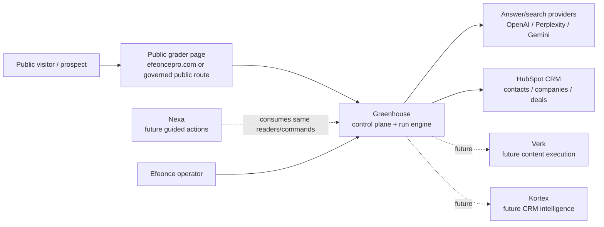
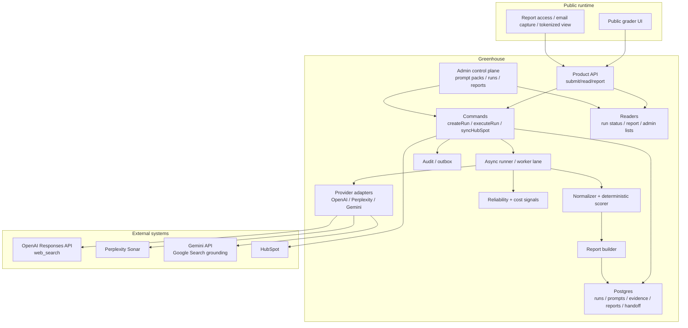

# Greenhouse Public AI Visibility Grader Architecture V1

> Tipo de documento: arquitectura de producto/plataforma
> Status: Accepted direction — no runtime changes yet
> Version: V1
> Fecha: 2026-06-24
> Owner: Product / Platform Architecture / Marketing Operations / GTM
> ADR: `GREENHOUSE_PUBLIC_AI_VISIBILITY_GRADER_DECISION_V1.md`
> Domain: `growth` (`GREENHOUSE_GROWTH_DOMAIN_ARCHITECTURE_V1.md`)
> Runtime contract: `greenhouse-public-ai-visibility-grader.v1` (planned)

## 1. Purpose

This document defines the target architecture for a public AI visibility grader administered from Greenhouse.

It intentionally stops before implementation. It provides the decision-grade contract needed before creating formal tasks:

```text
public diagnostic surface -> Greenhouse governed run engine -> evidence + scoring -> report -> HubSpot handoff -> future Verk/Kortex/Greenhouse action
```

The capability should enter the market as a simple public grader, but internally it must be treated as a Greenhouse acquisition/control-plane primitive with evidence, governance, cost controls and API parity from day one.

Canonical domain decision:

```text
growth owns acquisition intelligence and pre-pipeline diagnostic motions;
commercial owns qualified revenue motion after handoff.
```

## 2. Product thesis

Efeonce's GTM names AEO / AI visibility as a low-ticket, urgent entry product and a path into content, CRM and broader GTM work. HubSpot has validated the public category with AEO Grader, but Efeonce's opportunity is different:

```text
HubSpot measures brand perception in answer engines.
Efeonce turns answer-engine visibility gaps into an operating plan across Greenhouse, Verk, Kortex and HubSpot.
```

The durable product is not only "your score is 47/100". The durable product is:

- how answer engines describe the brand;
- where competitors appear instead;
- which citations and source types shape the answer;
- whether the brand owns its category in buyer-intent prompts;
- which narrative gaps should become content, CRM, PR, SEO/AEO or sales actions;
- how those actions enter HubSpot/Greenhouse for follow-up.

The public surface should be market-legible. The internal product architecture should preserve Efeonce IP:

| Layer | Recommended label | Use |
| --- | --- | --- |
| Public lead magnet | AI Visibility Grader | Fast comprehension for prospects. |
| Sales artifact | AI Visibility Snapshot | Short report attached to HubSpot/account motion. |
| Paid diagnostic / strategic offer | Surround Discovery Audit | Proprietary Efeonce framing. |
| Client recurring module | Greenhouse AI Visibility Monitor | Future Greenhouse client surface. |

## 3. Archetype

Primary archetype: **B2B SaaS multi-tenant + public acquisition surface**.

Dominant risk: a public form and AI provider workflow feeds internal CRM/account data. The system must avoid tenant leakage, CRM pollution, provider cost runaway and low-quality public output.

Secondary archetypes:

- **Agentic AI system**: provider calls, extraction, scoring, recommendations and future Nexa/Verk actions require AI-specific observability and evals.
- **CRM / workflow**: HubSpot remains source of truth for commercial motion and lead/deal ownership.
- **Headless content/public site**: the visitor surface lives on `efeoncepro.com` / public web runtime and must preserve SEO/performance/legal posture.
- **Internal tool/admin**: Greenhouse admins configure prompts, scoring, providers, review queues and rollouts.
- **Data platform / analytical**: historical runs become datasets for trends, benchmarks and future client monitoring.

## 4. System context



## 5. Container view



## 6. Source-of-truth boundaries

| Concern | Source of truth | Notes |
| --- | --- | --- |
| Public marketing copy / landing page | Public site runtime governed by public-site architecture | The page is a consumer, not the scoring owner. |
| Grader configuration | Greenhouse `growth` domain | Prompt packs, provider mix, scoring weights, report templates. |
| Prompt taxonomy | Greenhouse `growth` domain | Versioned and immutable per run. |
| Run lifecycle | Greenhouse `growth` domain | `draft/submitted/queued/running/partial/completed/failed/review_required/synced`. |
| Provider raw responses | Greenhouse `growth` evidence store | Evidence input, not business truth. |
| Normalized findings | Greenhouse `growth` domain | Derived from provider evidence under schema/version. |
| Score | Greenhouse `growth` deterministic scorer | Recomputable from normalized findings + score version. |
| Public report | Greenhouse `growth` report builder | Bounded public view over findings. |
| CRM identity and commercial ownership | HubSpot | Contacts, companies, deals, owner, lifecycle. |
| HubSpot handoff state | Greenhouse `growth` + HubSpot | Growth records attempt/result; HubSpot records CRM outcome. |
| Qualified revenue motion | `commercial` | Begins after explicit handoff into deals/quotes/contracts/pipeline work. |
| Content execution plan | Future Verk | Not V1. |
| CRM implementation/advisory plan | Future Kortex | Not V1. |

## 7. Core domain model

The implementation should use the new Growth domain.

Canonical placement:

| Concern | Value |
| --- | --- |
| Module key | `growth` |
| PostgreSQL schema | `greenhouse_growth` |
| TypeScript root | `src/lib/growth/ai-visibility/` |
| Capability prefix | `growth.ai_visibility.*` |
| Reliability signal prefix | `growth.ai_visibility.*` |
| Public API family | `/api/public/growth/ai-visibility/**` |
| Admin API/UI family | `/api/admin/growth/ai-visibility/**`, `/admin/growth/ai-visibility` |

`commercial` should receive only bounded handoff artifacts and promoted opportunities. It should not own `grader_profile`, `grader_run`, `prompt_pack`, provider observations, scoring or report lifecycle.

### 7.1 Aggregate: `grader_profile`

Represents the subject being graded.

Fields:

- `profile_id`
- `brand_name`
- `website_url`
- `country`
- `region`
- `language`
- `industry`
- `product_or_service`
- `buyer_persona`
- `competitors_declared[]`
- `hubspot_company_id` nullable
- `greenhouse_organization_id` nullable
- `created_from`: `public_form | internal_admin | client_monitor`

Rules:

- Website URL is normalized and stored separately from display input.
- Competitors declared by the visitor are input data, not verified facts.
- Existing Greenhouse/HubSpot identity must be resolved server-side.

### 7.2 Aggregate: `grader_run`

Represents one diagnostic run.

Fields:

- `run_id`
- `profile_id`
- `run_kind`: `public_snapshot | internal_audit | client_monitor | competitor_research`
- `status`
- `prompt_pack_version`
- `score_version`
- `report_template_version`
- `provider_policy_version`
- `requested_by_type`: `public_visitor | operator | system`
- `requested_by_user_id` nullable
- `public_lead_id` nullable
- `hubspot_sync_status`
- `cost_estimate_usd`
- `cost_actual_usd`
- `created_at`, `started_at`, `completed_at`

Lifecycle:

```text
submitted -> queued -> running -> completed
submitted -> queued -> running -> partial -> review_required -> completed
submitted -> queued -> running -> failed
completed -> synced_to_hubspot
completed -> archived
```

### 7.3 Aggregate: `prompt_pack`

Versioned prompt set for a market/industry/persona.

Fields:

- `prompt_pack_id`
- `version`
- `locale`
- `industry`
- `persona`
- `prompt_count`
- `status`: `draft | active | deprecated`
- `owner`
- `eval_status`

Prompt dimensions:

- `awareness`
- `problem_aware`
- `consideration`
- `comparison`
- `trust`
- `purchase_intent`
- `local_intent`
- `enterprise_intent`
- `risk_reputation`
- `post_sale_expansion` for client monitoring

Rules:

- A run stores the exact prompt text/version used.
- Prompt packs cannot be edited in place once active; create a new version.
- Public V1 should start with a small prompt pack, not a broad generic universe.

### 7.4 Aggregate: `provider_observation`

One provider answer for one prompt.

Fields:

- `observation_id`
- `run_id`
- `prompt_id`
- `provider`: `openai | perplexity | gemini | manual_import`
- `model`
- `provider_request_hash`
- `provider_response_pointer`
- `answer_text_hash`
- `citations_json`
- `usage_json`
- `latency_ms`
- `status`
- `error_code`
- `created_at`

Rules:

- Raw answer text may be stored inline only if retention/legal review allows it. Otherwise store bounded excerpts + object storage pointer.
- Citation URLs are normalized and classified.
- Provider request/response metadata must be retained enough to replay/debug, without leaking secrets.

### 7.5 Aggregate: `normalized_finding`

Structured extraction from observations.

Fields:

- `finding_id`
- `run_id`
- `prompt_id`
- `provider`
- `brand_mentioned`
- `brand_rank`
- `competitors_mentioned[]`
- `sentiment_label`
- `sentiment_score`
- `category_associations[]`
- `message_drift_claims[]`
- `citation_domains[]`
- `source_types[]`
- `confidence`
- `schema_version`

Extraction should use strict schema validation and retry logic. It must preserve `unknown` when evidence is insufficient.

### 7.6 Aggregate: `grader_score`

Deterministic score by dimension.

Initial score model:

| Dimension | Weight | Meaning |
| --- | ---: | --- |
| AI Visibility | 25 | Brand appears in relevant answer-engine responses. |
| Entity Clarity | 15 | Answer engines understand who the brand is, what it sells and for whom. |
| Category Ownership | 15 | Brand is associated with the intended category and use cases. |
| Competitive Share of Voice | 15 | Brand appears relative to declared/detected competitors. |
| Citation Quality | 15 | Sources shaping answers are credible, fresh and useful. |
| Message Alignment | 10 | AI narrative matches desired positioning. |
| Revenue Intent Coverage | 5 | Brand appears in purchase/comparison/implementation prompts. |

Why this differs from HubSpot:

- HubSpot emphasizes sentiment, presence quality, recognition, share of voice and market competition.
- Efeonce should emphasize commercial discovery: entity clarity, category ownership, citation quality, message drift and revenue-intent coverage.

Rules:

- Score must be versioned.
- Score must be reproducible from normalized findings.
- A score without enough evidence must show `insufficient_data`, not false precision.

### 7.7 Aggregate: `grader_report`

Public and internal report artifact.

Fields:

- `report_id`
- `run_id`
- `audience`: `public | internal_sales | client | executive`
- `visibility`: `tokenized_public | internal_only | client_authenticated`
- `summary`
- `score_json`
- `findings_json`
- `recommendations_json`
- `redactions_json`
- `report_url`
- `expires_at` nullable

Public report constraints:

- Show score, 3-5 findings, top competitors, source-type summary and recommended next steps.
- Do not expose every raw prompt response in the free tier.
- Do not expose sensitive internal recommendation logic.
- Use disclaimers that results are sampled and AI-assisted.

### 7.8 Aggregate: `hubspot_handoff`

Records CRM sync attempt and outcome.

Fields:

- `handoff_id`
- `run_id`
- `hubspot_contact_id`
- `hubspot_company_id`
- `hubspot_deal_id` nullable
- `aeo_check_result`
- `score`
- `primary_gap`
- `recommended_motion`
- `sync_status`
- `idempotency_key`
- `last_error`

Rules:

- Idempotency key should derive from normalized email/domain/run.
- No duplicate company/contact/deal creation for repeated runs.
- HubSpot field mapping must be explicit and limited.

## 8. Prompt and scoring architecture

### 8.1 Prompt strategy

Prompt packs should be organized by:

- language: `es-CL`, `es-LATAM`, `en-US`;
- country/market;
- industry;
- buyer persona;
- product/service category;
- intent stage.

Initial V1 prompt pack should include 12-20 prompts only:

| Prompt family | Example intent |
| --- | --- |
| Category discovery | "Que empresas ayudan con [problem] en [market]?" |
| Provider recommendation | "Mejores proveedores para [job] en [market]" |
| Comparison | "[Brand] vs [competitor]" |
| Trust/reputation | "Es confiable [Brand] para [job]?" |
| Purchase readiness | "Cuanto cuesta implementar [solution]?" |
| Local/enterprise | "Proveedor enterprise para [job] en Chile/LATAM" |
| Risk | "Problemas o criticas de [Brand]" |
| Message recall | "Que hace [Brand]?" |

The prompt layer must avoid prompt injection from user-supplied brand/product text:

- User input is interpolated as data, not instructions.
- Prompts should frame user-submitted text in explicit delimiters.
- Provider outputs are untrusted evidence.

### 8.2 Provider policy

The provider policy decides which providers run for a given run type.

V1 recommended policy:

| Run kind | Providers | Notes |
| --- | --- | --- |
| `public_snapshot_light` | 1-2 providers | Cost-controlled, fast, partial report acceptable. |
| `public_snapshot_full` | OpenAI + Perplexity + Gemini | Better confidence; may require email wait/async. |
| `internal_audit` | OpenAI + Perplexity + Gemini + manual SERP sources later | More evidence and prompt count. |
| `client_monitor` | Configurable | Recurring tracking after paid/client enablement. |

Provider abstraction must expose:

- `runPrompt(input): ProviderObservation`
- `supportsCitations`
- `supportsSearchGrounding`
- `model`
- `usage`
- `latency`
- `rawEvidencePointer`
- `errorClass`

### 8.2.1 Provider connection contract

The grader must connect to providers through a server-side adapter layer owned by `growth.ai_visibility`. The public site, browser code and HubSpot integration must never call AI/search providers directly.

Canonical flow:

```text
grader_run
  -> prompt_pack snapshot
  -> provider_policy selects providers
  -> provider_adapter executes grounded answer request
  -> provider_observation records raw/bounded evidence
  -> normalizer extracts normalized_finding
  -> deterministic scorer builds score/report
```

V1 provider targets:

| Provider | Adapter role | API posture | Evidence expected | Notes |
| --- | --- | --- | --- | --- |
| OpenAI | General answer-engine observation + optional extraction support | Responses API with web search tool | Answer text, web citations/search metadata where available, usage and latency | Use as one of the main answer surfaces; do not assume ChatGPT consumer UI parity. |
| Perplexity | Citation-forward answer observation | Sonar API | Answer text, citations, usage and latency | Strong candidate for source/citation analysis and competitor mentions. |
| Gemini | Google-grounded answer observation | Gemini API with Google Search grounding or Vertex equivalent | Answer text, grounding/citation metadata, usage and latency | Useful to compare Google-grounded narratives against OpenAI/Perplexity. |

Provider APIs are treated as measurable approximations of answer-engine behavior, not as exact replicas of every consumer product surface. Reports must disclose that the grader samples providers/prompts and that results can vary over time.

All adapters implement the same input/output contract:

```ts
type ProviderPromptInput = {
  runId: string
  promptId: string
  promptText: string
  locale: string
  market: string
  brandName: string
  websiteUrl: string
  competitorsDeclared: string[]
  mode: 'light' | 'full' | 'internal_audit'
}

type ProviderObservation = {
  observationId: string
  runId: string
  promptId: string
  provider: 'openai' | 'perplexity' | 'gemini'
  model: string
  status: 'succeeded' | 'failed' | 'rate_limited' | 'skipped'
  answerTextHash: string | null
  answerExcerpt: string | null
  citations: Array<{
    url: string
    domain: string
    title?: string
    sourceType?: 'owned' | 'earned' | 'social' | 'directory' | 'marketplace' | 'news' | 'unknown'
  }>
  usage: Record<string, unknown>
  latencyMs: number
  providerRequestHash: string
  rawEvidencePointer: string | null
  errorCode: string | null
  createdAt: string
}
```

Adapter responsibilities:

- Build provider requests from versioned prompt text only; user-submitted brand/category data is interpolated as delimited data, never as instructions.
- Strip personal contact data before provider calls. Work email and phone are for Greenhouse/HubSpot identity, not answer-engine prompts.
- Normalize provider errors into canonical classes: `provider_unavailable`, `rate_limited`, `quota_exceeded`, `timeout`, `schema_invalid`, `policy_blocked`, `unknown`.
- Store enough metadata to debug/replay a run without storing secrets or unbounded raw payloads.
- Return bounded excerpts for public/internal review; raw full text requires an explicit retention decision.
- Emit reliability/cost signals for every attempted call, including skipped calls caused by flags, policy or budget.
- Never write to HubSpot or public reports directly; adapters only produce evidence.

Provider execution modes:

| Mode | Prompt count | Provider count | Public behavior | Intended use |
| --- | ---: | ---: | --- | --- |
| `light` | 6-8 | 1-2 | Fast/cheap; may produce partial confidence | Public free snapshot and beta testing. |
| `full` | 12-20 | 3 | Async report; better provider coverage | Main lead magnet once cost/quality are known. |
| `internal_audit` | 20+ | 3+ | Internal-only, reviewed | Paid/strategic diagnostic and prompt-pack evals. |

Feature flags and server-only secrets:

| Concern | Concept |
| --- | --- |
| Global kill switch | `GROWTH_AI_VISIBILITY_GRADER_ENABLED` |
| OpenAI provider switch | `GROWTH_AI_VISIBILITY_OPENAI_ENABLED` + `OPENAI_API_KEY` or secret ref |
| Perplexity provider switch | `GROWTH_AI_VISIBILITY_PERPLEXITY_ENABLED` + `PERPLEXITY_API_KEY` or secret ref |
| Gemini provider switch | `GROWTH_AI_VISIBILITY_GEMINI_ENABLED` + `GEMINI_API_KEY` or Vertex/GCP service credentials |
| Provider budget gate | daily/monthly budget config, enforced before queue fan-out |
| Public run mode | environment/default policy: `light` until quality/cost gates pass |

The first implementation task should prove this adapter foundation in internal/dry-run mode before public UI, HubSpot writes or production launch. Real provider calls must be low-volume, flag-gated and skippable when secrets are absent, with fake/no-op adapters covering local tests.

### 8.3 Normalization and extraction

Provider answers differ. The normalizer must produce a stable schema:

- brand mention: yes/no/ambiguous;
- rank/position if answer lists providers;
- competitors mentioned;
- sentiment;
- category associations;
- citations;
- citation source type;
- message drift;
- commercial intent match;
- confidence.

Extraction should prefer deterministic parsing when the answer is structured and LLM extraction only when needed. All extraction outputs must pass schema validation.

### 8.4 Report recommendation engine

Recommendations must map findings to actions. V1 recommendation types:

| Gap | Recommendation |
| --- | --- |
| Low entity clarity | Rewrite/extend core service page and structured company/about content. |
| Low category ownership | Publish category explainer + comparison page + third-party profiles. |
| Weak citation quality | Secure credible external mentions and update owned source freshness. |
| Competitors dominate buyer prompts | Build comparison/alternative content and case-study evidence. |
| Message drift | Align website, LinkedIn, HubSpot snippets and public bios with desired narrative. |
| Weak revenue intent | Add pricing/implementation/use-case content and proof points. |

The public report shows a bounded set. The internal report can include a fuller action plan for sales.

## 9. Public experience

The public V1 should optimize for conversion and trust, not maximum analysis depth.

### 9.1 Public flow

```text
Visitor enters brand details
  -> consent + email
  -> Greenhouse creates run
  -> visitor sees queued/running state
  -> report generated
  -> visitor receives report link / email
  -> HubSpot receives lead context
  -> sales/operator sees internal report in Greenhouse
```

### 9.2 Input fields

Required:

- Brand/company name
- Website URL
- Country/market
- Industry/category
- Product/service description
- Work email
- Consent checkbox

Optional:

- 1-3 competitors
- Buyer persona
- Company size
- Main challenge
- Phone/meeting intent

### 9.3 Public report states

| State | UX |
| --- | --- |
| `queued` | "Estamos preparando tu analisis." |
| `running` | Show progress by phase, not provider internals. |
| `partial` | Honest partial report; explain unavailable providers. |
| `completed` | Score + findings + CTA. |
| `review_required` | "Tu reporte requiere revision; te avisaremos." |
| `failed` | Friendly retry/contact path. |

### 9.4 Public trust requirements

- Clear disclaimer: sampled diagnostic, not guaranteed rankings.
- Privacy notice: what is stored and why.
- No hidden provider logos unless provider terms allow.
- No competitor defamatory language.
- No "we found secret data" framing.
- Report link should be tokenized and optionally expire.

## 10. Greenhouse admin/control plane

Greenhouse should expose an internal surface for:

- run queue and status;
- report review;
- prompt pack management;
- scoring version history;
- provider health and cost;
- HubSpot handoff status;
- quality/eval dashboard;
- benchmark snapshots by category once enough runs exist;
- feature flags and kill switches.

Suggested view families:

| Surface | Purpose |
| --- | --- |
| `/admin/growth/ai-visibility` | Run/control-plane overview. |
| `/admin/growth/ai-visibility/runs/[id]` | Evidence ledger, provider answers, normalized findings, report preview. |
| `/admin/growth/ai-visibility/prompt-packs` | Versioned prompt pack management. |
| `/admin/growth/ai-visibility/provider-health` | Latency, errors, cost, quota. |
| `/admin/growth/ai-visibility/hubspot` | Handoff queue and failures. |

UI implementation must follow Greenhouse UI rules: Composition Shell by default, reusable primitives, canonical copy, GVC verification and no ad-hoc card/layout systems.

## 11. Programmatic contract and API parity

> **Delta 2026-06-27 (TASK-1248) — 3.er consumer (cliente) shipped.** Cerró el consumer cliente de la parity: ruta del portal cliente `/growth/ai-visibility/report` (routeGroup `client`, viewCode `cliente.ai_visibility_report`) que consume `readClientGraderReport` (TASK-1243) **vía el boundary del portal cliente** (`@/lib/client-portal/readers/curated/growth-ai-visibility`, nunca import directo de growth) + capability `growth.ai_visibility.report.read_client` + org de sesión (server-side; la UI no computa scope). El render es el **4.º view-adapter** del `ReportArtifactModel` (TASK-1252): un **Split Workbench master-detail** (`modelFromClientReport` → recomposición navigator↔detail), NO reusa el render vertical del artifact ni forkea scoring; charts Recharts (sin ECharts). Estado de preparación neutral ("se está preparando") que **NUNCA** expone la razón interna de `review_required`. Para el primitive de layout se agregó la composición `masterDetail` a `CompositionShell` (ver `ui-platform/PRIMITIVES.md`). **Rollout:** la ruta renderiza con datos por construcción cuando exista un grader run reportable con `grader_profiles.organization_id` enlazado a la org del cliente (intake cliente); la verificación visual se hizo contra el mockup harness con el fixture canónico.

The UI and public page must consume canonical primitives. Planned capability surface:

### 11.1 Readers

- `readPublicGraderReport(reportToken)`
- `readAiVisibilityRun(runId)`
- `listAiVisibilityRuns(filters)`
- `readAiVisibilityPromptPack(promptPackId)`
- `readAiVisibilityProviderHealth()`
- `readAiVisibilityHubSpotHandoff(runId)`

### 11.2 Commands

- `createAiVisibilityRun(input, idempotencyKey)`
- `executeAiVisibilityRun(runId)`
- `requestAiVisibilityReportReview(runId)`
- `approveAiVisibilityReport(runId)`
- `syncAiVisibilityRunToHubSpot(runId, idempotencyKey)`
- `createAiVisibilityPromptPackDraft(input)`
- `activateAiVisibilityPromptPack(promptPackId)`

### 11.3 Product/API surfaces

Potential routes; exact paths are implementation-task decisions:

- `POST /api/public/growth/ai-visibility/runs`
- `GET /api/public/growth/ai-visibility/reports/[token]`
- `GET /api/admin/growth/ai-visibility/runs`
- `GET /api/admin/growth/ai-visibility/runs/[runId]`
- `POST /api/admin/growth/ai-visibility/runs/[runId]/sync-hubspot`
- `GET /api/admin/growth/ai-visibility/provider-health`

Shared API Platform/MCP exposure should be deferred until V1 proves the domain, but the primitives must be born compatible with it.

## 12. HubSpot integration

HubSpot is the CRM source of truth for commercial motion. Greenhouse should enrich it, not replace it.

### 12.1 Handoff goals

For every valid public run:

- create/update contact;
- create/update company when domain is valid;
- attach run/report URL;
- set AI visibility properties;
- optionally create a deal/task depending on score/intent;
- route owner based on existing HubSpot ownership or fallback assignment.

### 12.2 Proposed HubSpot properties

Existing context includes `aeo_check_result` on deals with values:

- `Aparece`
- `No aparece`
- `Info desactualizada`
- `No verificado`

Proposed additional properties require HubSpot property-design review before creation:

| Object | Property | Type | Purpose |
| --- | --- | --- | --- |
| Company | `ai_visibility_score` | Number | Latest 0-100 score. |
| Company | `ai_visibility_last_run_at` | Date | Recency. |
| Company | `ai_visibility_primary_gap` | Single select | Main commercial gap. |
| Company | `ai_visibility_competitors_detected` | Multi-line text | Bounded detected competitors. |
| Company | `ai_visibility_recommended_motion` | Single select | `content_audit`, `surround_audit`, `crm_audit`, `strategy_call`, etc. |
| Company | `ai_visibility_report_url` | URL | Greenhouse report link. |
| Contact | `ai_visibility_last_submit_at` | Date | Lead activity. |
| Deal | `aeo_check_result` | Existing/extend | Qualification result. |
| Deal | `ai_visibility_score_at_creation` | Number | Snapshot at deal creation. |

Rules:

- Do not create properties until the provider access + HubSpot mapping task exists.
- Do not put raw provider responses in HubSpot.
- Do not create deals automatically unless score/intent policy is approved.
- Use existing HubSpot bridge ownership rules; do not make browser-side HubSpot calls.

## 13. Provider access and secrets

See section 22 for the provider/access checklist. Architectural rules:

- All provider credentials are server-only.
- Secrets live in GCP Secret Manager and/or Vercel sensitive env per existing Greenhouse rules.
- Provider adapter config is environment-specific.
- Public submission never exposes provider choice, prompt internals or raw API errors.
- Provider calls are rate-limited per IP/email/domain/run and globally.
- Each provider has a feature flag and kill switch.

## 14. Security, privacy and abuse controls

### 14.1 Public abuse controls

- CAPTCHA or equivalent bot protection before expensive execution.
- IP/domain/email rate limits.
- Email verification or delayed delivery for full reports if abuse risk is high.
- Domain allow/deny list for internal testing and blocked targets.
- Maximum competitors and prompt count per free run.
- Queue backpressure when provider costs/quota are near threshold.

### 14.2 Data protection

- Store only required personal data.
- Classify submitted name/email/company as restricted/confidential depending on existing policy.
- Provide deletion/export path through existing privacy process.
- Do not send unnecessary PII to providers; prompts should use brand/company details, not personal contact info.
- Redact emails/phones from provider context.

### 14.3 Prompt injection posture

Inputs from public forms and provider/web citations are untrusted. The system must:

- delimit user-provided text;
- instruct models to treat submitted data as data, not instructions;
- validate outputs against schema;
- never execute actions based on provider text without deterministic policy/human confirmation;
- not follow links or instructions embedded in provider responses except through controlled citation extraction.

### 14.4 Legal/reputation posture

Required before public launch:

- privacy notice;
- AI-assisted diagnostic disclaimer;
- no-results-guarantee copy;
- competitor-analysis disclaimer;
- terms for storing and emailing report;
- internal review policy for sensitive/negative report language.

## 15. Observability and reliability

Every run should produce structured traces:

- run id;
- profile id;
- prompt pack version;
- provider;
- model;
- latency;
- usage/tokens/search count when available;
- cost estimate/actual;
- extraction status;
- score status;
- report status;
- HubSpot handoff status.

### 15.1 Reliability signals

Planned signals:

| Signal | Kind | Healthy state |
| --- | --- | --- |
| `growth.ai_visibility.provider_error_rate` | reliability | Below provider-specific threshold. |
| `growth.ai_visibility.run_failure_rate` | reliability | Near 0 for valid submissions. |
| `growth.ai_visibility.report_review_required_rate` | quality | Tracked; spikes reviewed. |
| `growth.ai_visibility.hubspot_sync_failed` | integration | 0 unresolved failures. |
| `growth.ai_visibility.cost_budget_used` | cost | Below daily/monthly budget threshold. |
| `growth.ai_visibility.prompt_pack_eval_regression` | quality | 0 active regressions. |
| `growth.ai_visibility.provider_latency_p95` | performance | Within public UX budget. |

### 15.2 SLOs

V1 suggested SLOs:

- 95% of light public runs complete or fail honestly within 5 minutes.
- 99% of valid submissions create a Greenhouse run record.
- 99% of HubSpot handoff attempts either succeed or surface a retryable failure in admin.
- 0 silent provider failures.
- 0 public reports without score version and prompt pack version.

## 16. Evals and quality gates

Before public launch:

- Build a golden set of brands: Efeonce, Globe, a few clients/cases, a few known competitors, and neutral sample brands.
- Run prompt packs across providers.
- Human-review expected findings and unacceptable outputs.
- Define minimum quality thresholds for report auto-release.
- Add regression evals for:
  - brand mention extraction;
  - competitor extraction;
  - citation classification;
  - message drift detection;
  - Spanish/LATAM tone;
  - no defamatory competitor language;
  - no overclaiming guarantees.

Public reports should be auto-released only if:

- minimum provider coverage is met;
- schema validation passes;
- no safety language rule fails;
- score confidence is above threshold.

Otherwise status becomes `review_required`.

## 17. Cost model

Cost is a first-class concern because public traffic can be abused and provider calls can fan out.

Cost drivers:

- number of prompts per run;
- providers per prompt;
- web/search grounding fees;
- LLM extraction/normalization calls;
- report generation calls;
- retries;
- eval runs.

Controls:

- `AI_VISIBILITY_GRADER_ENABLED`
- provider-specific flags;
- daily/monthly cost ceilings;
- per-domain cooldown;
- per-IP and per-email limits;
- free/light vs full/deep run modes;
- provider fallback/downgrade policy;
- queue pauses when cost threshold is exceeded.

V1 should not commit to exact dollar estimates until provider pricing and prompt counts are validated in the first task. The architecture requires cost telemetry per run from the first implementation slice.

## 18. Rollout strategy

### Phase 0 — Architecture and access planning

This document + ADR + provider access checklist + task candidates. No runtime changes.

### Phase 1 — Internal dry-run foundation

- Server-side domain model.
- Manual/internal run creation.
- Provider adapters in dry-run or low-volume mode.
- No public UI.
- No automatic HubSpot writes.

### Phase 2 — Internal report review

- Admin Greenhouse surface.
- Evidence ledger.
- Prompt pack V1.
- Human-reviewed reports.
- HubSpot sync dry-run.

### Phase 3 — Public private beta

- Public page behind unlisted URL or limited access.
- Real submissions from controlled prospects.
- HubSpot writes enabled only after confirmation.
- Cost/rate-limit monitoring.

### Phase 4 — Public launch

- SEO/indexable public surface if approved.
- Automated bounded reports.
- HubSpot lead enrichment.
- Sales playbook.

### Phase 5 — Paid/client monitoring

- Recurring prompt tracking.
- Client Greenhouse dashboard.
- Verk/Kortex action handoff.
- Benchmarks after sufficient data volume.

## 19. Failure modes

| Failure | Mitigation |
| --- | --- |
| Provider API down | Partial report, retries, honest unavailable state. |
| Provider returns harmful/defamatory text | Safety filter, review_required, redaction. |
| Score is misleading | Confidence thresholds, evidence cards, deterministic scoring, human evals. |
| Bot attack creates cost spike | CAPTCHA, quotas, queue pause, kill switch. |
| HubSpot duplicates contacts/companies | Idempotency, domain/email resolution, dry-run preview. |
| Public report leaks sensitive internal data | Public/internal report separation and redaction schema. |
| Prompt pack goes stale | Prompt versioning, eval cadence, deprecation. |
| Competitor names are misspelled/hallucinated | Evidence confidence, citation requirement, "detected" language. |
| Sales trusts score blindly | Report shows evidence/confidence and recommended next diagnostic step. |

## 20. Self-critique

### What breaks in 12 months?

If prompt packs are not governed, the public grader becomes stale as answer engines and buyer language change. The mitigation is prompt-pack versioning, evals and a clear owner.

### What breaks in 36 months?

Provider APIs and the AEO category may change materially. The provider abstraction and "Surround Discovery" framing reduce lock-in to one label or vendor.

### Cognitive debt risk

The highest cognitive debt risk is hidden scoring logic. The score must be explicit, versioned and documented. Future engineers should be able to recompute a score from findings without reading a pile of prompts.

### Vendor lock-in

OpenAI/Perplexity/Gemini are replaceable through provider adapters if the normalized observation schema stays stable. HubSpot is less replaceable because it is the commercial SoT; that is intentional.

### Observability gap

The silent-failure risk is partial provider success that still produces an overconfident report. Confidence and provider coverage must be explicit report fields.

### AI-specific risk

Prompt injection and hallucinated competitor claims are the main risks. Treat all public inputs and provider outputs as untrusted; validate and redact before display or sync.

### Regional / compliance gap

The feature targets LATAM and may process Chilean personal data. Treat contact data under Chilean Ley 21.719/GDPR-compatible posture; avoid sending personal identifiers to providers where not needed.

## 21. Open decisions before implementation

- Public route/runtime: `efeoncepro.com` Astro target vs current WordPress/Kinsta legacy rail vs Greenhouse-hosted public route.
- Brand name: final public label and Spanish copy.
- Report delivery: instant web report, email-gated report, or hybrid.
- Free-tier depth: number of prompts/providers in public snapshot.
- HubSpot object strategy: contact/company only vs deal/task creation.
- Data retention: raw provider answers and public report expiration.
- Provider priority: whether V1 requires all three providers or can start with two.
- Legal copy owner and review path.
- Whether benchmark data can ever be shown cross-tenant/category.

## 22. Provider/access checklist

No access should be provisioned until a formal implementation task exists. This list defines what will be needed.

### 22.1 AI/search providers

| Provider | Access needed | Purpose | Secret/env concept | Notes |
| --- | --- | --- | --- | --- |
| OpenAI API | Project API key with Responses API + web search enabled | Web-grounded answer runs and/or extraction | `OPENAI_API_KEY` or secret ref | Use official web search tool; server-only. |
| Perplexity API | Sonar API key | Citation-first answer engine observations | `PERPLEXITY_API_KEY` or secret ref | Validate citation fields, pricing and rate limits. |
| Google Gemini API / Vertex AI | Gemini API key or Vertex credentials with Google Search grounding | Gemini-grounded observations | `GEMINI_API_KEY` or GCP service account/ADC | Greenhouse already uses GCP; prefer existing secret posture if compatible. |

Optional later:

| Provider | Access needed | Purpose |
| --- | --- | --- |
| Google Search Console | Verified property access for Efeonce/client sites | Owned-site AEO/SEO enrichment. |
| GA4 | Property read access | AI-referral traffic enrichment. |
| DataForSEO or equivalent | API key | SERP/AI visibility enrichment if Verk integration requires it. |

### 22.2 CRM and marketing systems

| System | Access needed | Purpose | Notes |
| --- | --- | --- | --- |
| HubSpot portal `48713323` | Private app scopes for contacts, companies, deals, notes/files/properties as approved | Lead/contact/company/deal enrichment and report URL handoff | Use existing bridge discipline; avoid browser calls. |
| HubSpot property management | Permission to create/update custom properties | Add AI visibility fields | Must be explicit task; no ad-hoc property creation. |
| HubSpot forms/meetings | Form or meeting link config | Public CTA conversion | Could use existing public site embed patterns. |

### 22.3 Public runtime

| System | Access needed | Purpose | Notes |
| --- | --- | --- | --- |
| Public site runtime | Route/page deployment path | Host public grader | Must align with Astro target vs WordPress legacy rail. |
| Vercel team `efeonce-7670142f` | Env vars/deploy config if hosted on Vercel | Public route/runtime config | Use local-first and release controls. |
| Kinsta/WordPress | Only if public page ships on legacy WordPress rail | Embed/page config | Prefer governed public-site architecture. |

### 22.4 Greenhouse platform

| System | Access needed | Purpose |
| --- | --- | --- |
| GCP Secret Manager | Create/read provider secrets from runtime service account | Server-only provider credentials. |
| Cloud SQL/Postgres | Migration permissions via existing pipeline | Run/evidence/report schema. |
| BigQuery | Optional later | Benchmarks, trends, client monitoring analytics. |
| Sentry/observability | Project access | Error and performance tracking. |

## 23. Future task candidates — not created

These are implementation candidates only. Do not treat them as active `TASK-###` docs until the operator asks to create them through the formal task-planner flow.

### Candidate A — AI Visibility Grader foundation and schema

Status: promoted into `TASK-1226` together with Candidate B as the first backend-data foundation slice.

Profile: `backend-data`

Scope:

- Create `greenhouse_growth` domain model, migrations and server-side primitives for profiles, runs, prompt packs, provider observations, normalized findings, scores, reports and handoffs.
- Add feature flags and no-op provider policy.
- Add tests for lifecycle and scoring reproducibility.

### Candidate B — Provider adapter spike and eval baseline

Status: promoted into `TASK-1226` together with Candidate A as the first backend-data foundation slice.

Profile: `backend-data`

Scope:

- Implement low-volume adapters for OpenAI, Perplexity and Gemini behind flags.
- Store bounded evidence.
- Build golden-set evals.
- Validate provider cost/rate limits and citation behavior.

### Candidate C — Deterministic scoring and report builder

Status: normalization + scoring promoted into `TASK-1227`; full report builder remains a future task.

Profile: `backend-data`

Scope:

- Implement normalization schema, score version V1 and report generation.
- Add confidence thresholds and `review_required` rules.
- Produce internal report artifact.

### Candidate D — Greenhouse admin control plane UI

Profile: `ui-ux`

Scope:

- Build `/admin/ai-visibility` surfaces for runs, evidence ledger, prompt packs, provider health and HubSpot handoff.
- Use Composition Shell and Greenhouse primitives.
- Verify with GVC desktop/mobile.

### Candidate E — HubSpot handoff command

Profile: `backend-data`

Scope:

- Define HubSpot properties and mapping.
- Implement idempotent sync command and dry-run.
- Add retry queue, audit/outbox and reliability signals.

### Candidate F — Public grader experience

Profile: `ui-ux`

Scope:

- Build public landing/form/report states.
- Add legal/privacy copy, consent, abuse controls and report token access.
- Run GVC/public route verification.

### Candidate G — Private beta rollout and sales playbook

Profile: `standard`

Scope:

- Enable controlled access.
- Run first real prospect/client samples.
- Document sales interpretation, objection handling and next-step motion.

### Candidate H — Client monitoring / Verk handoff

Profile: `backend-data` followed by `ui-ux`

Scope:

- Promote one-time runs into recurring monitoring.
- Add client Greenhouse surface.
- Add Verk content brief handoff and future Nexa action path.

## 24. Sources

- HubSpot AEO Grader: `https://www.hubspot.com/aeo-grader`
- HubSpot AEO: `https://www.hubspot.com/products/aeo`
- HubSpot AEO content optimization knowledge base: `https://knowledge.hubspot.com/ai/optimize-content-and-improve-brand-visibility-for-ai`
- HubSpot AEO Sensor: `https://www.hubspot.com/aeo-sensor`
- OpenAI web search in Responses API: `https://developers.openai.com/api/docs/guides/tools-web-search`
- Perplexity Sonar API: `https://docs.perplexity.ai/docs/sonar/quickstart`
- Gemini API grounding with Google Search: `https://ai.google.dev/gemini-api/docs/google-search`

## Delta 2026-06-24 — TASK-1226 provider adapter foundation (code complete dev)

La primera fundación ejecutable del grader está implementada en `src/lib/growth/ai-visibility/**` (TASK-1226, code complete en dev; rollout real-provider pendiente). Realiza el provider connection contract de §§7-8 + §§15-17 + §22 con providers OFF por defecto.

### Invariantes operativos para agentes (growth.ai_visibility)

Cargar al tocar `src/lib/growth/ai-visibility/**` o el endpoint `src/app/api/admin/growth/ai-visibility/**`. Skill de dominio AI: `greenhouse-ai-image-generator` cubre los providers LLM canónicos; este dominio extiende `src/lib/ai/*`.

- **NUNCA** un consumer (UI pública, admin, Nexa/MCP, report builder, HubSpot handoff, smoke) llama providers AI/search directo. El único camino es el primitive server-side `executeGraderRun` / `runGraderDiagnostic` (`run-engine.ts` / `commands.ts`). Full API parity de nacimiento: un primitive, muchos consumers.
- **NUNCA** instanciar un SDK/cliente LLM paralelo dentro del dominio ni hacer fetch crudo a un provider. Reusar los clientes canónicos `src/lib/ai/*` (`openai.ts` Responses+web_search, `anthropic.ts`, `perplexity.ts`, `google-genai.ts`). Secret server-side vía `resolveSecret` (`*_API_KEY` / `*_SECRET_REF`); NUNCA loggear el secret ni mandarlo al cliente.
- **NUNCA** correr providers sin flag: `GROWTH_AI_VISIBILITY_GRADER_ENABLED` (kill switch global) + `GROWTH_AI_VISIBILITY_<PROVIDER>_ENABLED`, todos default OFF (ledger `FEATURE_FLAG_STATE_LEDGER`). Sin flag/secret el adapter resuelve **skip controlado** (`grader_disabled`/`provider_disabled`/`missing_secret`), nunca crash. El fake adapter determinista es el default sin secretos.
- **NUNCA** enviar PII (email/teléfono/datos del submitter) a un provider. Solo se interpolan marca/categoría/mercado como dato delimitado (anti prompt-injection).
- **NUNCA** tratar la observación del provider como verdad de negocio. `provider_observations` es evidencia cruda muestreada; el normalized finding + score + report se derivan después, versionados (TASK-1227). El run degrada honestamente: `resolveRunStatusFromObservations` nunca marca `succeeded` con evidencia incompleta (usa `partial`).
- **NUNCA** mutar `greenhouse_growth.provider_observations` (append-only: trigger `block_observation_mutation` + GRANT sin UPDATE/DELETE a runtime). El prompt pack activo es inmutable (cambios → versión nueva).
- **NUNCA** exceder el cost guard: la policy por modo (`light`/`full`/`internal_audit`) fija `costCeilingUsdPerRun` + caps de prompts/retries/timeout; `light` excluye Anthropic+web_search por costo/latencia (calibración §5). Cost estimator aproximado (`cost.ts`), tightening pendiente de costo agregado N≥3.
- **NUNCA** exponer raw provider errors al cliente: mapear a clase canónica (`mapHttpStatusToErrorCode`/`mapThrownErrorToErrorCode`); el raw va a `captureWithDomain('growth', ...)`.
- Reliability: 4 signals `growth.ai_visibility.{provider_error_rate,provider_latency_p95,cost_budget_used,provider_call_skipped}` (módulo `growth` del control plane). DB vacía / grader OFF → steady sano (esperado pre-launch).

Spec de referencia del adapter: `docs/documentation/growth/ai-visibility-grader.md` (funcional) + `docs/manual-de-uso/growth/ai-visibility-grader-smoke.md` (operación).

## Delta 2026-06-24 — TASK-1227 normalization + scoring engine (complete dev)

El segundo bloque del motor está implementado en `src/lib/growth/ai-visibility/{normalization,scoring,review-gates,evals}/**` (TASK-1227, complete en dev). Realiza §§7.5/7.6/8.3/8.4/16/19 con LLM extraction OFF por defecto y sin superficie pública.

### Invariantes operativos para agentes (normalization + scoring)

Cargar junto al §Delta 2026-06-24 de provider adapters al tocar el motor de findings/score.

- **NUNCA** un LLM asigna el `grader_score`. El score es **determinista, versionado (`ai_visibility_score_v1`) y recomputable** desde `normalized_findings` (`computeGraderScore`). Recompute con la misma versión = mismo score. Los pesos (25/15/15/15/15/10/5) son **hipótesis calibrada** (arch §7.6; 1228 no los recalibró) — revisables con evidencia productiva.
- **NUNCA** inventar rank/competidores/citations ni asumir presencia. El normalizer es **determinista-first**: resuelve presencia por **dominio** (hallazgo spike 1228, colisión `efeoncepro.com`↔`f11.es`), preserva `unknown`/`null`/`[]` donde la evidencia estructurada no alcanza. Los campos de prosa (sentiment, categoryAssociations, messageDriftClaims, refinar `ambiguous`) solo se llenan con el **hook LLM aislado** (`llm-extraction.ts`, `generateStructuredAnthropic` schema-validado, flag `GROWTH_AI_VISIBILITY_LLM_EXTRACTION_ENABLED` default OFF, excerpt tratado como dato anti prompt-injection).
- **NUNCA** emitir precisión falsa: sin cobertura mínima (≥3 observaciones resueltas, ≥2 familias de prompt) → `insufficient_data`. Lenguaje riesgoso/difamatorio o sentimiento negativo de baja confianza (<0.6) → `review_required` (conservador: NO todo negativo). `auto_releasable` es SIEMPRE `false` en V1 (auto-release público = task posterior).
- **NUNCA** una dimensión sin evidencia contribuye al promedio: devuelve `score=null` y queda EXCLUIDA (renormalización de pesos). `message_alignment` sin LLM → null (honesto).
- **NUNCA** filtrar raw provider text/prompts/excerpts en el DTO público (`toPublicSafeScore`: solo resumen ponderado, sin reasons/evidencia). Vista interna completa aparte.
- Persistencia: `normalized_findings` (upsert por run+prompt+provider+schema, recomputable) + `grader_scores` (upsert por run+score_version). Primitive de Full API parity: `scoreGraderRun`/`readGraderScore`; endpoint admin interno `POST /runs/[runId]/score` + GET detail. Golden eval de no-regresión (`evals/eval-runner.ts` sobre `golden-set.v1.json` de 1228). Signals scoring/normalization en el módulo reliability `growth`.

Spec funcional/manual: `docs/documentation/growth/ai-visibility-grader.md` + `docs/manual-de-uso/growth/ai-visibility-grader-smoke.md`.

## Delta 2026-06-24 — TASK-1234 async run execution worker (code complete dev; rollout pendiente)

La ejecución de un run pasó de **inline-en-la-route Vercel** a un **worker async Cloud Run** (patrón TASK-773). Cierra el hallazgo runtime de TASK-1233: un run Gemini-3 (≈56s/call × N prompts × M providers) excede el timeout de la función serverless; runs `full` multi-provider eran imposibles inline. Implementado en `src/lib/growth/ai-visibility/{run-engine,store}.ts`, `services/ops-worker/{server,deploy}.sh`, endpoint `runs/route.ts`, signals.

### Invariantes operativos para agentes (async execution)

Cargar junto a los §Delta de provider adapters + normalization/scoring al tocar la ejecución del grader.

- **NUNCA** ejecutar un run lento/grande inline en una route Vercel. El primitive de ejecución es `executeClaimedGraderRun` (host = worker Cloud Run `POST /growth/grader/drain`, Cloud Scheduler `ops-growth-grader-drain`, NUNCA Vercel cron). El endpoint admin **encola** (`enqueueGraderDiagnostic` → run `pending` + `execution_prompts` persistidos) detrás del flag `GROWTH_AI_VISIBILITY_ASYNC_EXECUTION_ENABLED` (default OFF → ejecución inline legacy para `light`). El GET detail es el poll (shape intacto).
- **NUNCA** persistir las observations en bloque al final. Se persisten **incrementalmente** (`insertProviderObservations([obs])` por observación) → un crash/timeout mid-run conserva la evidencia ya producida y nunca deja un run con estado falso. El status del run se sigue derivando de las observations (degradación honesta).
- **NUNCA** ejecutar un run sin claim atómico. `claimPendingGraderRuns` hace la transición `pending → running` con `FOR UPDATE SKIP LOCKED` (dos workers concurrentes NUNCA toman el mismo run); `started_at` = tiempo de claim. Un run terminal NUNCA se re-ejecuta (no aparece en la query de claim).
- **NUNCA** dejar un run huérfano en `running` permanente. `recoverStuckRunningRuns` (corre antes del drain) finaliza los `running` > 90 min recomputando su estado desde las observations persistidas (sin observations → `failed`). Idempotente. Signal `growth.ai_visibility.run_stuck_running`.
- **NUNCA** importar `@core/*` en el código worker-bundled del grader (boundary worker; `pnpm worker:runtime-deps-gate` verde). El worker resuelve los secrets de provider server-side (`OPENAI/ANTHROPIC_API_KEY_SECRET_REF`; Gemini = Vertex WIF) con los flags `GROWTH_AI_VISIBILITY_*` default OFF.
- El worker Cloud Run usa `TIMEOUT=3600s`: un run `full`/`internal_audit` corre secuencialmente DENTRO del request (el attempt-deadline del scheduler que se rinde NO mata el request en vuelo; el límite duro es el request timeout del servicio).

Rollout pendiente: deploy ops-worker a staging + flip de flags + smoke real `full` (ver TASK-1234 §Estado).

## Delta 2026-06-24 — TASK-1235 report builder (complete dev)

Materializa el `grader_report` (§7.7) como **derivación on-read pura** del `grader_score` + `normalized_findings` (TASK-1227) + metadata del run — **sin tabla `grader_reports`** (Open Q1 resuelta → on-read en V1: el score ya es persistido+versionado y el reporte es función pura de él; el snapshot inmutable pertenece a la task de superficie pública). Implementado en `src/lib/growth/ai-visibility/report/{contracts,recommendations,builder,command,index}.ts`, copy es-CL en `src/lib/copy/growth.ts`, endpoint admin `GET /runs/[runId]/report`. El §7.7 se afina: `score_json`/`findings_json`/`recommendations_json`/`redactions_json` se materializan como un **DTO estructurado tipado** (no blobs opacos) y el §8.4 mapea las **6 dimensiones driver** (ai_visibility es el RESULTADO compuesto = KPI del headline, sin recomendación propia).

### Invariantes operativos para agentes (report builder)

Cargar junto a los §Delta de provider adapters + normalization/scoring al tocar el reporte.

- **NUNCA** computar el reporte desde otra fuente que `grader_score` + `normalized_findings` versionados. El reporte es **función pura** de `(run_id, score_version, report_version, recommendation_pack_version)` → recomputar produce el mismo reporte (determinismo, sin LLM en score/gaps; el copy es plantilla es-CL en `GH_GROWTH_AI_VISIBILITY`, NUNCA generación libre). Primitive canónico: `readGraderReport` (server-only) → `buildGraderReport` (puro). Versiones: `ai_visibility_report_v1` + `ai_visibility_recommendation_pack_v1`.
- **NUNCA** filtrar raw provider text/prompts/citation domains/reasons internos al DTO público. El público (`PublicGraderReport`) es un **tipo distinto** que estructuralmente no tiene campos para evidencia cruda (capa A) + el builder sólo lee campos seguros (capa B) + leak test (capa C). `providerPresence` (presencia por motor, conteos resolved/present) es **public-safe desde TASK-1273**; lo internal-only es `providerFindings`, raw text, prompts, citation domains crudos, accuracy findings y reasons internos. Los nombres de competidores SÍ se muestran (§7.7 "top competitors").
- **NUNCA** pintar `null` como `0`. Cada dimensión es `SourceResult`: `status='ok'` (medido, incluido `score:0` = gap real) vs `status='empty'`/`severity='sin_dato'` (sin evidencia, excluida del promedio, NUNCA fabricada). La severidad es **valor nombrado** (`critico|atencion|optimo|sin_dato`), nunca un color.
- **NUNCA** emitir un reporte definitivo sobre un score gateado. Los gates `insufficient_data`/`review_required` (del score) + `partial` (del run) se propagan al `report.gate` con **razón + próxima acción** renderizables (no sólo un enum, no precisión falsa, no auto-release).
- **NUNCA** entregar las recomendaciones como lista plana. Salen **priorizadas** (peso de la dimensión × tamaño del gap, RICE-ish) → `primaryGap` + `recommendedMotion` (alimentan el HubSpot handoff §7.8). El headline = mayor brecha ponderada (KPI dominante).
- **Capability** `growth.ai_visibility.report.read` (least-privilege: ver el reporte SIN `observation.read` de evidencia cruda) + grant en `runtime.ts`. En V1 internal-only (mismo set que observation.read); la separación deja preparado el público/client.
- **Reliability**: V1 NO agrega signal persistido (el reporte es on-read puro sobre un score ya señalizado; un build failure va a `captureWithDomain('growth')` + canonical error). Signal dedicado `report_build_failed` = follow-up cuando exista failure ledger.

## Delta 2026-06-24 — TASK-1236 report temporal trend (complete dev)

El `grader_report` (TASK-1235) gana un bloque `trend` run-over-run: compara el score vigente contra el **run previo comparable** del mismo perfil (mismo `prompt_pack_version` + `score_version`), porque AEO se mide por tendencia, no por una foto (skill `seo-aeo` §07). Derivación on-read pura del histórico ya persistido en `grader_scores` — **sin tabla nueva, sin migración**. Implementado en `src/lib/growth/ai-visibility/report/trend.ts` (cómputo puro) + `scoring/store.ts` (`getPreviousComparableScore`) + wire en `builder.ts`/`command.ts`; copy en `src/lib/copy/growth.ts`.

### Invariantes operativos para agentes (report trend)

- **NUNCA** fabricar un delta sin run previo comparable. Estados honestos: `sin_historico` (no hay previo), `incomparable` (el previo usó otro `prompt_pack_version`), `con_tendencia` (delta computado). Cada uno con `reason` renderizable.
- **NUNCA** comparar contra un run de otra muestra. La comparabilidad exige `score_version` (en el SELECT) **y** `prompt_pack_version` (chequeo en el caller) idénticos; si difieren → `incomparable`, no delta.
- **`null ≠ 0` en el delta**: dimensión `null` en cualquiera de los dos extremos → `delta=null` (`direction='sin_dato'`), NUNCA `0`. La dirección es **valor nombrado** (`subio|bajo|sin_cambio|sin_dato`), nunca un color.
- **NUNCA** round-tripear un timestamp JS a Postgres para la ventana temporal. El cliente pg devuelve `timestamptz` como `Date`, cuyo `String()` (`"... GMT-0400 ..."`) Postgres no re-parsea → la marca temporal del run vigente se resuelve **en la DB** (subquery `SELECT created_at FROM grader_runs WHERE run_id = $3`). Bug detectado ejercitando el SQL contra PG real (gate TASK-893).
- El `trend` es agregado puro (deltas numéricos, sin raw text) → viaja al DTO **público** además del interno. Capability sin cambio (reusa `report.read`); sin migración; sin signal nuevo.

## Delta 2026-06-24 — TASK-1237 report signal enrichment (complete dev)

El `grader_report` surfacea 4 señales AEO (skill `seo-aeo` §07) que el sistema ya capturaba en `normalized_findings` pero no mostraba: **citation share del sitio propio** (% de respuestas con citas que citan el dominio del sujeto, distinto de la calidad por tipo de fuente), **resumen de sentimiento** (conteos + saldo nombrado), **posición/prominencia** (`brandRank` mejor/promedio) y **hallazgo narrativo por motor** (cada motor es un canal distinto). Reducers puros sobre los findings ya cargados + el `subjectDomain` del perfil — **sin tabla nueva, sin tocar el `grader_score`, sin migración**. Implementado en `report/builder.ts` + `report/contracts.ts` (`CitationInsight`/`SentimentSummary`/`PositionSummary`) + `report/command.ts` (deriva `subjectDomain`) + copy `src/lib/copy/growth.ts`.

### Invariantes operativos para agentes (signal enrichment)

- **NUNCA** computar el citation share propio comparando dominios sin normalizar. Se reusa `extractCitationDomain` (lowercase + strip `www`) — idéntico a cómo se normalizan los `citationDomains` del finding — y la comparación es por igualdad exacta. `subjectDomain` se deriva en `readGraderReport` (del `websiteUrl` del perfil), igual que el scoring command. **`null≠0`**: sin respuestas con citas → `ownDomainShare=null` (sin dato), NUNCA `0`.
- **NUNCA** exponer los dominios crudos de citación al DTO público. El citation share es **solo %/conteos**; el detalle narrativo por motor (`providerFindings`) es **INTERNAL-only** (no viaja al público). `providerPresence` agregado por motor sí va al público/cliente como conteo seguro. Los 3 agregados seguros (citation share, sentiment, position) SÍ van al público. Leak test extendido.
- **NUNCA** editorializar sobre competidores en el resumen de sentimiento — es factual sobre la marca sujeto (saldo nombrado `positivo|neutral|negativo|mixto|sin_dato`, empate → `mixto`, sin evaluación → `sin_dato`).
- Las 4 señales son **derivación pura** de findings ya persistidos: el mismo input produce el mismo enriquecimiento. Sin capability nueva (reusa `report.read`); sin migración; sin signal nuevo.

## Delta 2026-06-28 — TASK-1268 citation source domain breakdown (complete dev)

El `grader_report` agrega `citationSourceBreakdown`: top-N de dominios registrables que alimentan las respuestas del run, derivado **on-read** desde `greenhouse_growth.provider_observations.citations` vía `getRunObservations` + reducer puro `report/citation-breakdown.ts`. No crea tabla, migration, flag ni write path. Cada dominio expone sólo `{ domain, count, engines[], classification }`, con clasificación `own_domain|competitor|third_party|ugc` contra el dominio del sujeto, competidores declarados parseables y señales UGC/social. Runs sin citas degradan honestamente a `domains=[]` + `reason='sin_citas_evaluables'`.

La frontera public-safe cambia de "no exponer dominios crudos" a "exponer sólo dominio registrable agregado": el DTO público/cliente puede mostrar `g2.com` o `reddit.com`, pero NUNCA URL, path, title, excerpt, prompt ni host privado completo. El leak test público/cliente cubre `citationSourceBreakdown`; subdominios sensibles se colapsan a registrable (`foro-privado-interno.example.com` → `example.com`). La recomendación `weak_citation_quality` se enriquece con targets no propios cuando existen, para que `digital_pr_citations` diga dónde actuar y no sólo "consigue más citas".

### Invariantes operativos para agentes (citation source breakdown)

- **NUNCA** exponer URL/path/query/title ni raw provider text desde citations. `citationSourceBreakdown` sólo contiene dominio registrable agregado, conteos, motores y clasificación.
- **NUNCA** crear tabla o write path para este desglose: es derivación on-read del evidence ledger append-only (`provider_observations.citations`) dentro del report builder canónico.
- **NUNCA** inventar dominios cuando el run no trae citas evaluables: usar `domains=[]` + `reason='sin_citas_evaluables'`.
- **SIEMPRE** enriquecer digital PR desde dominios no propios; el dominio propio sirve para clasificación/contexto, no como target principal de PR externa.

## Delta 2026-06-29 — TASK-1272 category taxonomy + brand categorization contract (code complete dev)

El grader agrega un source of truth repo-governed para categorización de marca en `src/lib/growth/ai-visibility/taxonomy/**`: `CATEGORY_TAXONOMY` versionada (`category_taxonomy_v1`), tipos `CategoryTaxonomyNode`/`CategoryAssociation`, validador y mapper determinista `mapCategoryCandidateToTaxonomy`. La taxonomía separa los niveles `industry`, `sector`, `product_service_category`, `use_case`, `buyer_persona` y `market`, con aliases es/en, parentIds, ejemplos y estado `active|deprecated|internal`. El catálogo V1 parte amplio y granular (122 nodos: 18 industrias, 21 sectores, 35 categorías, 19 casos de uso, 15 buyer personas y 14 mercados) para reconocer categorías reales sin depender de strings libres del LLM.

El contrato de compatibilidad para V1 mantiene `NormalizedFinding.categoryAssociations: string[]` y la columna `greenhouse_growth.normalized_findings.category_associations` sin migración. La diferencia semántica es que los nuevos writes desde `llm-extraction.ts` guardan sólo IDs canónicos; los strings legacy se aceptan como candidatos y se mapean on-read/on-score vía compat layer. Candidatos desconocidos o ambiguos degradan a `needs_review`/`ambiguous` en el mapper y NO se publican como label de producto.

`scoreCategoryOwnership` ahora distingue entre "hay señales de categoría" y "hay categoría canónica": si un finding trae strings no mapeados, esos strings no cuentan como ownership fuerte. Si no hay señales de categoría porque el extractor no corrió, se preserva el fallback determinista de presencia en descubrimiento para no romper V1 con el hook OFF. El report agrega `categoryTaxonomySummary` para internal/public/client: IDs canónicos agregados, nivel, label es/en, count y versión de taxonomía; nunca raw candidates, excerpts ni razonamiento interno.

### Invariantes operativos para agentes (category taxonomy)

- **NUNCA** publicar labels libres de un provider/LLM como verdad de producto. Todo output visible de categoría debe salir de `CATEGORY_TAXONOMY` o degradar a `unknown`/`needs_review`.
- **NUNCA** dejar que un LLM cree categorías canónicas en runtime. El LLM sólo puede proponer candidatos; `mapCategoryCandidateToTaxonomy` gobierna el mapping.
- **NUNCA** mezclar niveles taxonómicos: industria, sector, categoría de producto/servicio, caso de uso, buyer/persona y mercado son dimensiones distintas.
- **NUNCA** usar strings no mapeados para inflar `category_ownership`; si hay categoría intentada pero no canónica, cuenta como brecha/review, no como evidencia fuerte.
- **SIEMPRE** preservar la frontera public-safe: `categoryTaxonomySummary` puede exponer ID/label/nivel/count/versión, pero no candidatos raw, excerpts, prompts ni cadenas internas.

## Delta 2026-06-24 — TASK-1238 brand accuracy / hallucination monitoring (complete dev)

Detecta cuándo la IA dice cosas **factualmente falsas** de la marca (no sólo ausente/negativo) contrastando los findings contra la **verdad declarada** del perfil (`brand_name`/`category`/`competitors_declared`) — "no basta aparecer; importa que la IA diga la verdad" (skill `seo-aeo` §07C; crítico en YMYL/Globe). Módulo puro `src/lib/growth/ai-visibility/accuracy/` (`buildBrandTruth` + `detectBrandInaccuracies` + `hasLikelyHallucination`); escalación en `review-gates/gates.ts`; surface internal-only en `report/builder.ts`; signal en `reliability/queries/growth-ai-visibility-scoring-signals.ts`. **Sin migración, sin tocar el `grader_score` numérico, sin capability nueva** (OQ1 resuelta → NO nueva dimensión en score v1; OQ2 → verdad declarada limitada, `service_description` = follow-up; OQ3 → determinista-first).

### Invariantes operativos para agentes (brand accuracy)

- **NINGÚN LLM asigna el veredicto de exactitud.** El detector es **determinista** sobre los findings ya normalizados (la extracción LLM, flag OFF, sólo enriquece los findings que el detector lee). El score numérico NO cambia; lo que cambia es el `score_status` (gate).
- **Conservador YMYL:** sólo una inexactitud **probable** (hallazgo de confianza `high` — hoy `entity_collision` con ≥2 menciones ambiguas) escala a `review_required` (vía `resolveScoreStatus`, param `accuracyFindings` opcional, backward-compatible). `category_mismatch`/`misattribution` se surfacean para revisión pero NO auto-gatean (evitar sobre-escalar por ruido).
- **Sin verdad declarada → no se fabrica inexactitud** (degradación honesta): `category_mismatch` no se evalúa sin `category`; el detector devuelve `[]` sin `BrandTruth`.
- **`accuracyFindings` es INTERNAL-only**: exponer "la IA se equivoca sobre ti" al público es delicado (difamación/YMYL) → la señal pública es el **gate `review_required`**, no el detalle. NUNCA en `PublicGraderReport`.
- Reliability signal `growth.ai_visibility.brand_accuracy_review` (cuenta scores escalados por inexactitud vía `$1 = ANY(review_reasons)` con el marker `BRAND_ACCURACY_REVIEW_REASON`; severity `ok` — escalar a revisión es comportamiento de seguridad esperado, no un fallo). Follow-up: ledger estructurado del tipo de inexactitud (hoy el reporte lo recomputa puro).

## Delta 2026-06-24 — TASK-1239 public report snapshot + token reader (complete dev) · EPIC-020 A

Materializa el **snapshot público inmutable** del §7.7/§11.1: `greenhouse_growth.grader_reports` congela el `PublicGraderReport` (TASK-1235) + sus versiones + un token NO enumerable + `expires_at`, para que un link público **NO cambie si el score recomputa**. Es la foundation de parity del consumer público (el primer consumer no-interno del grader). Implementado en migración `…_task-1239-grader-reports-public-snapshot.sql` + `report/snapshot.ts` (`publishGraderReportSnapshot` + `readPublicGraderReport`) + capability `growth.ai_visibility.report.publish` + endpoints `POST /runs/[runId]/report/publish` (admin) y `GET /api/public/growth/ai-visibility/report/[token]` (público). **El reporte interno sigue on-read (TASK-1235); el snapshot es SOLO el congelado público** — resuelve el diferido explícito de TASK-1235 ("el snapshot inmutable pertenece a la task de superficie pública").

### Invariantes operativos para agentes (public snapshot)

- **El snapshot es INMUTABLE**: `grader_reports` es append-only (trigger `block_report_mutation` bloquea UPDATE/DELETE + GRANT runtime sólo SELECT/INSERT). Re-publicar el mismo estado = idempotente (UNIQUE por `run_id+score_version+report_version+recommendation_pack_version` → devuelve el congelado existente, NO muta); un estado nuevo = fila nueva con token nuevo. **NUNCA** UPDATE del `public_report_json`.
- **El token es NO enumerable** (`'grt-' || 2× gen_random_uuid`, 256 bits) — los `public_id` (`EO-GRUN-#####`) son **secuenciales** y NUNCA sirven como secreto público. La lectura pública es **token-based sin sesión/capability** (el token ES la auth); el **mint** sí requiere capability `report.publish`.
- **NUNCA** publicar un score gateado: `publishGraderReportSnapshot` rechaza `review_required`/`insufficient_data` (409). El `partial` SÍ es publicable (reporte parcial honesto, §9.3).
- **`expires_at` se respeta en SQL** (`expires_at IS NULL OR expires_at > NOW()`); expirado o inexistente → 404 sin distinguir (no filtra existencia). V1: `expires_at` default NULL (configurable al publicar).
- El snapshot congela el `PublicGraderReport` → hereda su public-safety (sin raw, sin `providerFindings`/`accuracyFindings` internos). **NUNCA** congelar el `GraderReport` interno.
- Hardening pendiente (follow-up): rate-limit por IP en el endpoint público de lectura (hoy: token no enumerable + read-only sin gasto LLM). El write/cost público es TASK-1240 (EPIC-020 B).

## Delta 2026-06-24 — TASK-1240 public run intake + abuse/cost controls (complete dev) · EPIC-020 B

Materializa el **único WRITE público** del dominio (§9.1/§11.2): `createPublicGraderRun` toma el input §9.2 (marca + **work email + consent**) → captcha → abuse/cost guard → persiste el lead → **encola** un run `public_diagnostic`+`light` (worker async TASK-1234, NO inline). `POST /api/public/growth/ai-visibility/run`. Detrás del flag `GROWTH_AI_VISIBILITY_PUBLIC_INTAKE_ENABLED` (default OFF, gateado por el kill switch). Módulos: migración `…_task-1240-grader-leads-intake-events.sql` + `public-intake/{contracts,captcha,abuse-guard,store,create-public-run}.ts` + 3 reliability signals.

### Invariantes operativos para agentes (public intake)

- **El email (PII) NUNCA viaja a los providers.** Vive SOLO en `greenhouse_growth.grader_leads` (con consent + `consent_at`; CHECK `consent = TRUE`). `enqueueGraderDiagnostic` recibe sólo marca/categoría/mercado/competidores — los prompts interpolan eso, nunca PII. Test lo prueba (`JSON.stringify(enqueueArg)` no contiene el email).
- **NUNCA** ejecutar el run inline en el endpoint público: se **encola** (`enqueueGraderDiagnostic` → run `pending`) y el worker Cloud Run (TASK-1234) lo drena. El público recibe `runPublicId` para poll.
- **NUNCA** abrir el POST público sin las 4 capas: captcha (Turnstile, puerto `CaptchaVerifier` — bypass dev / **fail-closed prod** sin secret) + rate-limit (per-IP 10/email 3 por día) + **presupuesto global diario** (circuit breaker → `cost_blocked` 503, el guard REAL de costo) + flag default OFF. Counters en `grader_intake_events` (append-only, `ip_hash`/`email_hash` HASHEADOS por privacidad; el crudo sólo en el lead con consent).
- **Lead = entidad distinta del perfil** (`grader_leads`, no campos en `grader_profiles`): persona + email + consent + lifecycle propio → HubSpot (EPIC-020 D). 1:N. Consent append-only.
- El command **NO lanza** para bloqueos esperados (disabled/invalid/captcha/rate/cost) — devuelve `PublicIntakeResult` que el endpoint mapea a status sanitizado (404/400/403/429/503); sólo lanza ante fallo inesperado (502). Doble-submit idempotente (mismo `idempotencyKey`) → no doble lead ni doble costo.
- Rollout: **code-complete, operativamente bloqueado** hasta (1) sign-off legal del consent, (2) secret `TURNSTILE_SECRET`, (3) flag ON staging + smoke. Decisiones (arch-architect + seo-aeo): lead dedicado, Turnstile (privacidad + baja fricción), email-gated (intercambio de valor del lead magnet) con límites generosos para no matar conversión.

## Delta 2026-06-25 — TASK-1251 convergencia del intake sobre el motor Growth Forms (code complete dev; rollout pendiente · EPIC-020)

El intake público del grader converge sobre el **motor gobernado Growth Forms** (TASK-1229) como **upgrade** (un solo stack de public-submission), detrás del flag `GROWTH_GRADER_INTAKE_ON_FORMS_ENGINE_ENABLED` (default OFF, **converge-before-launch** — el intake aún no ha lanzado, sin tráfico vivo que migrar).

- **Abuse-guard convergido (Slice 1):** la DECISIÓN (per-email → per-IP → presupuesto) la delega el grader al core PURO compartido `decideAbuse` (`src/lib/growth/public-submission`, nacido en 1229 y ya consumido por el motor). El abuse-guard del grader queda como wrapper de storage sobre `grader_intake_events` (hash byte-idéntico, mismo salt). El **cost ceiling/budget diario se preserva** (limits del grader + ledger propio). Captcha ya había convergido en 1229 (re-export del port compartido).
- **Fachada + reactive consumer (Slice 2):** con el flag ON, `POST /run` persiste un **submission del motor** (`form_submission` + `consent_snapshot` + outbox `growth.forms.submission_accepted`, una tx) y devuelve `submissionId` como handle de poll; el run + el lead los crea el reactive consumer `growth_grader_run_from_submission` (projection domain `growth`, drenado por `ops-reactive-growth`) — **post-submit reactivo, no inline** (boundary atómico = submission+consent+outbox). El grader sembrado como form gobernado `fdef-ai-visibility-grader`. El **email (PII)** viaja al `normalized_fields` del submission (vive en PG con consent) y al lead, **NUNCA** a `enqueueGraderDiagnostic`. Binding additive `grader_leads.submission_id` (UNIQUE parcial, defense-in-depth).
- **Contrato HTTP estable:** el path a-medida (flag OFF) sigue devolviendo `runPublicId` inline; ambos coexisten. El status reader (TASK-1245) debe resolver ambos handles.
- **Rollout:** prender el flag + crear el cron `ops-reactive-growth` (deploy ops-worker) + conteos post-flip, todo **gated por el launch (TASK-1246)**. Retiro del stack a-medida = follow-up tras el flip prod verificado estable (sin espera fija de 7d — waiver CEO 2026-06-25; NUNCA en el mismo PR del cutover). Specs: `docs/tasks/in-progress/TASK-1251-...md`.

## Delta 2026-06-25 — TASK-1257 captura de Nombre + Apellido del lead (code complete dev; rollout pendiente · EPIC-020)

El intake captura **Nombre + Apellido** del lead además de email + marca, para que el HubSpot handoff (TASK-1242) entregue a ventas un contacto con nombre real (no `firstname`/`lastname` vacíos).

- **Modelo de datos:** `grader_leads.first_name`/`last_name` (TEXT **nullable**, additive). Nullable = un lead legacy o a-medida sin nombre sigue válido; el handoff mapea vacío cuando falta. Nombre/apellido son **PII (Ley 21.719)**: mismo tratamiento que el email — viven en el lead/submission con consent, **NUNCA** viajan a `enqueueGraderDiagnostic` ni a los providers (asertado en tests de los 3 paths: a-medida, fachada y reactive consumer).
- **Pipeline:** `PublicGraderRunInput` (+`firstName`/`lastName`) → path a-medida `createPublicGraderRun` **y** fachada `forms-engine-binding` (al `normalized_fields_json`) → reactive consumer `growth_grader_run_from_submission` → `insertGraderLead`. `getGraderLeadForHandoff` devuelve los campos reales; `execute.ts` (handoff) deja de mandar `null`. El mapper de TASK-1242 (sin cambios) los lleva a `firstname`/`lastname` nativos de HubSpot.
- **Form (render contract):** los campos `firstName`/`lastName` se agregan al `field_schema_json` del grader-form (label es-CL "Nombre"/"Apellido" + `autocomplete` given-name/family-name, required). Como las **versiones publicadas son inmutables** (trigger TASK-1229), el camino gobernado fue **publicar una versión v2** (con el schema ampliado) y **deprecar la v1** — NO editar el schema in-place. `GRADER_FORM_VERSION_ID` queda pineado a `fver-ai-visibility-grader-v2`. El renderer data-driven (TASK-1231) pinta los campos sin JSX nuevo.
- **Decisiones (OQ):** campos **requeridos en el form** pero **nullable en DB/command** (best-of-both: lead nuevo con nombre, resiliencia para legacy/a-medida + handoff tolerante); **dos campos separados** (mapean limpio a los nativos de HubSpot). Copy validada con `greenhouse-ux-writing`.
- **Rollout:** 2 migraciones additive aplicadas+verificadas en dev PG (columnas + v2 published con fields). Smoke HubSpot live + GVC del landing público quedan **gated por EPIC-020** (intake flag OFF en prod). Spec: `docs/tasks/complete/TASK-1257-growth-ai-visibility-intake-name-capture.md`.

## Delta 2026-06-25 — TASK-1245 public run status + delivery orchestrator (code complete dev; rollout pendiente · EPIC-020)

Cierra el contrato público faltante §9.3 entre el intake y la UI del lead magnet: la página puede hacer poll y pasar de un run a su reporte.

- **Handle de poll NO enumerable:** el `public_id` del run es **secuencial** (`EO-GRUN-' || lpad(nextval(seq),5,'0')`) → enumerable, no sirve como autorización de un endpoint público sin sesión. Se agregó `grader_runs.poll_token` (256 bits, `gpt-`+2×uuid, UNIQUE, additive). El `public_id` queda como id **display/admin** interno; el `poll_token` (path a-medida) y el `submissionId` (path convergente, `fsub-`+uuid) son los únicos handles que el status reader resuelve. El intake devuelve `pollToken` además de `runPublicId`.
- **Status reader + endpoint (read-only):** `readPublicGraderRunStatus(handle)` (`src/lib/growth/ai-visibility/public-delivery/status-reader.ts`) → DTO **bounded** `{ status, reportToken, reason, retryAfterSeconds }` con estados `queued|processing|ready|in_review|unavailable|not_found`; sin email/PII, raw provider text, accuracy findings ni el motivo interno de `review_required`. `GET /api/public/growth/ai-visibility/run/[handle]` es **read-only puro** (un GET anónimo NUNCA dispara writes). `reportToken` solo cuando existe snapshot publicable.
- **Delivery finalizer (write-side, NO on-read):** `finalizeRunDelivery(run)` corre en la finalización del worker (`run-engine`, 4 puntos terminales). Materializa `grader_runs.public_delivery_state` (`pending|ready|in_review|unavailable`, additive) y publica el snapshot idempotente cuando el gate es `ready`/`partial`. `review_required` → `in_review` (NUNCA auto-publica; el publish lo dispara la aprobación humana de **TASK-1244**); `insufficient_data`/failed/skipped → `unavailable`. Best-effort (no rompe la finalización). El reader lee el estado materializado O(1) (no recomputa el gate ni filtra el motivo).
- **Hardening + signals:** rate-limit proporcional de reads públicos por IP (status + report token) reusando el window-counter `grader_intake_events` (outcomes namespaced `read_status`/`read_report`; fail-open; el handle no enumerable es la protección de fondo). 3 reliability signals: `growth.ai_visibility.public_status_read` (posture), `growth.ai_visibility.public_delivery_pending` (steady=0, finalizador estancado), `growth.ai_visibility.public_delivery_inconsistent` (steady=0, invariante `ready ⟹ snapshot`).
- **Idempotencia/concurrencia:** publish en finalizador único + `ON CONFLICT (run_id, score_version, report_version, recommendation_pack_version)` + GET read-only → doble poll concurrente no duplica snapshots ni dispara providers.
- **Contrato de poll (desbloquea TASK-1241):** `POST /run` → `{ pollToken | submissionId }` → poll `GET /run/[handle]` → `reportToken` (cuando `ready`) → `GET /report/[token]`. Email del token = **TASK-1250** (fuera de scope; solo el contrato).
- **Rollout:** 2 migraciones additive aplicadas+verificadas en dev PG; finalizer validado live sobre 8 runs reales (signals a steady 0/0). Staging smoke low-volume con flag ON + worker activo **gated por EPIC-020**. Spec: `docs/tasks/complete/TASK-1245-growth-ai-visibility-public-run-status-delivery-orchestrator.md`.

## Delta 2026-06-26 — TASK-1244 admin evidence review · gate humano de release (code complete dev; rollout pendiente · EPIC-020 F)

Cierra el loop de seguridad YMYL: ningún reporte con inexactitud/lenguaje sensible (`review_required` de TASK-1227/1238) se publica al público sin ojo humano. Es la pieza que **desbloquea** un `review_required` (hoy atascado en `in_review` por el finalizer de TASK-1245) — o lo cierra.

- **Estado de revisión = log append-only:** `greenhouse_growth.grader_report_reviews` (migración `…_task-1244-grader-report-reviews.sql`) es un **log de decisión inmutable** (= audit + estado en una tabla, espejo de `grader_reports`): una fila por decisión humana (`approved|rejected`) de un `(run_id, score_version)`; el estado vigente = la fila más reciente; **AUSENCIA de fila = `pending`**. No toca el writer de scoring → additive puro, backfill no-op. CHECK enum + reason-no-vacía-en-rejected; trigger `block_report_review_mutation` (append-only en 2 capas: GRANT sin UPDATE/DELETE + trigger). El validador de transición (`pending → approved|rejected`; idempotente; **nunca** flip terminal `approved↔rejected`) es puro (`review/state.ts`) y se aplica en el comando ANTES del INSERT.
- **Comandos gobernados (audit; el LLM NUNCA aprueba):** `approveAiVisibilityReport({runId, reviewedByUserId, reason?})` / `rejectAiVisibilityReport({runId, reviewedByUserId, reason})` (`review/commands.ts`). Approve: registra decisión → `publishGraderReportSnapshot` (que ahora honra la aprobación) → `setPublicDeliveryState('ready')` (el poll público empieza a devolver `reportToken`) → HubSpot lead handoff (paridad con la publish route, non-fatal). **Idempotente:** re-aprobar re-drivea publish+ready (recovery). Reject: registra decisión → `unavailable` (final honesto, **NUNCA** publica). **La aprobación queda ligada a la `score_version` revisada:** un re-score (nueva versión `review_required`) NO la hereda → re-revisión obligatoria (anti "approve-once auto-release futuro").
- **El publish honra la aprobación:** `publishGraderReportSnapshot` (TASK-1239) ya no rechaza ciego `review_required`: ahora consulta `isReportReviewApproved(runId, scoreVersion)` — `review_required + approved` es publicable; `pending`/`rejected` → `not_releasable` (409). `insufficient_data` **jamás** publicable (no hay revisión que lo desbloquee). El finalizer de TASK-1245 sigue intacto (`review_required → in_review`, nunca publica): el único camino de publish de un `review_required` es la aprobación humana.
- **Cola + capability + signal:** reader `listPendingReportReviews` (`review/queries.ts`: runs cuyo score más reciente es `review_required` sin decisión, con `reviewReasons`). Endpoints `GET /api/admin/growth/ai-visibility/reviews` (cola) + `POST /runs/[runId]/review/{approve,reject}`, dual-gate `requireInternalTenantContext` + capability **`growth.ai_visibility.report.review`** (mismo set interno que `report.publish`: el reviewer ≥ privilegiado que el publisher; grant en `runtime.ts` mismo PR). Signal `growth.ai_visibility.report_review_pending` (in_review >24 h sin decisión → backlog SLA warning; "reportes atascados sin reviewer").
- **Rollout:** migración additive aplicada+verificada en dev PG (CHECK + append-only ejercitados live); 16 tests nuevos (state machine, publish-honra-aprobación, commands, signal). Gate por capability (sin grant a roles nuevos hasta cutover); UI admin de revisión = follow-up. Spec: `docs/tasks/complete/TASK-1244-growth-ai-visibility-admin-evidence-review.md`.

## Delta 2026-06-26 — TASK-1243 client-scoped report access · 3.er consumer de la parity (code complete dev; rollout pendiente · EPIC-020 E)

Cierra el triángulo de Full API Parity del grader (§7.7 audience `client`): **público** (snapshot/token, TASK-1239) + **admin** (reporte interno, TASK-1235) + **cliente autenticado** (su org). Un `client_*` ve el reporte del grader de SU organización dentro del portal, sin acceso interno ni a la evidencia cruda de provider.

- **Binding `perfil ↔ org cliente`:** columna additive nullable `grader_profiles.organization_id` (FK→`greenhouse_core.organizations` ON DELETE SET NULL; index parcial). El run deriva su org vía `profile_id → profile.organization_id` (1 perfil ↔ 1 org en V1). Población = intake/onboarding cliente (write path fuera de scope de este reader).
- **Reader `readClientGraderReport(organizationId, runId?)`** (`src/lib/growth/ai-visibility/client/command.ts`): **reusa la orquestación canónica `readGraderReport`** (run→score→previous→profile→`buildGraderReport`) y agrega sólo (1) resolución del run SCOPED por org (`store.getClientGraderRunById`/`getLatestClientGraderRun`, JOIN profile `WHERE organization_id=$1`) y (2) re-proyección al DTO cliente. **Sin reimplementar el builder** (un primitive, muchos consumers).
- **Tenant boundary duro:** la org se deriva server-side del `orgContext` de sesión (NUNCA del browser); un run de otra org → `not_found` (sin revelar su existencia). Test `client-report-reader.test.ts` (cliente A ≠ cliente B) + SQL del JOIN ejercitada live contra PG (gate TASK-893).
- **DTO `ClientGraderReport`:** tipo leak-safe por construcción (forma del público: SIN `providerPresence`/`providerFindings`/`accuracyFindings`/`reason`/`priority`) PERO con recomendaciones **sin cap** (entre el público —top 3— y el interno). `toClientGraderReport` espeja `toPublicGraderReport`. Leak test `report-client-leak.test.ts` (3 capas).
- **Capability dedicada `growth.ai_visibility.report.read_client`** (scope `own`, grant a `client_executive/manager/specialist`). Elegida dedicada > scope-overload de `report.read` (least-privilege explícito + patrón cliente del repo). Replicada al set interno (scope `own`) sólo para el guard de cobertura (`capability-grant-coverage.test` usa un superset interno); inocua porque el endpoint exige `requireClientTenantContext`.
- **Endpoint BFF** `GET /api/client-portal/growth/ai-visibility/report` (`requireClientTenantContext` + `can(read_client, own)` + org de sesión) consume el reader vía curated re-export (`src/lib/client-portal/readers/curated/growth-ai-visibility.ts`; client-portal → growth = dirección permitida del DAG, hoja). Read-only; el reporte que ve el cliente es **on-read scoped** (vivo), NO el snapshot público inmutable.
- **Rollout:** migración additive aplicada+verificada en dev PG (anti pre-up-marker); full test suite clean 0 failed + `pnpm build` ✓ + grant coverage; 10 tests nuevos (reader boundary 6 + leak 4). **Desbloquea TASK-1248** (UI del portal cliente, cliente puro del reader vía BFF). Poblar `organization_id` para orgs reales = intake. Spec: `docs/tasks/complete/TASK-1243-growth-ai-visibility-client-scoped-report-access.md`.

## Delta 2026-06-27 — TASK-1249 provider completion + decisión de pesos (calibration) · EPIC-020

- **Provider set arch V1 completo:** Perplexity provisionado (secret `greenhouse-perplexity-api-key` + grant `secretAccessor` a `greenhouse-portal@` + flag staging ON) y **verificado con smoke real low-volume** (modo `light`, 6/6 `succeeded`/marca, texto + 9-10 citations, `source=secret_manager`). Junto con Gemini (TASK-1233), **OpenAI/Perplexity/Gemini** quedan operativos. El adapter Perplexity reusa el cliente canónico `src/lib/ai/perplexity.ts` (Sonar) vía el `createWebSearchAdapter` compartido — sin SDK paralelo. Parser bloqueado con `src/lib/ai/perplexity.test.ts`.
- **Delta operativo 2026-06-29:** Perplexity también queda ON en el `ops-worker` de staging (`GROWTH_AI_VISIBILITY_PERPLEXITY_ENABLED=true`, revision `ops-worker-00418-2m6`) y `services/ops-worker/deploy.sh` persiste el default staging ON / production OFF. Esto cierra el drift Vercel-vs-worker que hacía que runs async lo saltaran aunque Vercel staging tuviera el flag.
- **Prompt pack v2 selectable (opt-in, V1 default):** `src/lib/growth/ai-visibility/prompt-packs/prompt-pack-v2.ts` + espejo `prompt-pack.v2.json`. Fix único p12 (dejaba de nombrar sectores "aerolínea/banca" que contaminaban los controles del brand-set, calibración §4.bis). Registry `resolvePromptPack(version)` (default V1; versión explícita desconocida → throw, no falsea provenance) enhebrado por `commands.ts` (`promptPackVersion?`). **Promover v2 a default requiere golden eval real (baseline+regresión)** — eval-driven (decisión #10); el golden eval determinista es *observation-based*, no *prompt-based*, así que validar v2 exige corrida real cacheada (follow-up).
- **Decisión de pesos: MANTENER `ai_visibility_score_v1`.** Golden set = 8 casos → demasiado chico para split calibration/holdout o cross-validation sin overfitting. La evidencia del spike (escala 5→0) respalda el orden hipótesis de V1 (AI Visibility = peso 25, discrimina limpio). `ai_visibility_score_v1_1` queda como follow-up que exige volumen productivo + holdout + product sign-off; sería additive (nuevo `score_version`, V1 intacto, sin recompute retroactivo). Detalle: `GREENHOUSE_AI_VISIBILITY_GRADER_CALIBRATION_V1.md` §Delta 2026-06-27.
- **Provenance tuple verificada (no migración):** ya se persiste por run — `grader_runs.requested_providers` (provider_set) + `prompt_pack_version` + `provider_policy_version`, `grader_scores.score_version`, `provider_observations.provider/model`. Snapshots pre/post-Perplexity quedan version-tagged y comparables. Spec: `docs/tasks/complete/TASK-1249-growth-ai-visibility-calibration-provider-completion.md`.

## Delta 2026-06-27 — TASK-1265 Google AI Overview / AI Mode adapter (code complete dev; rollout pendiente) · EPIC-020

Se agrega `google_ai_overview` como quinto provider gobernado del grader. El objetivo es cubrir Google AI Overview / AI Mode como canal de respuesta separado de Gemini: Gemini API y Google AI Overview no tienen el mismo retrieval ni las mismas citas.

- **Fuente gobernada:** el adapter usa DataForSEO Google AI Mode Live Advanced vía el cliente canónico `src/lib/ai/dataforseo.ts`. No hay scraping directo de Google ni llamadas desde browser/UI/HubSpot. Los secrets se resuelven server-side con `DATAFORSEO_API_LOGIN` + `DATAFORSEO_API_PASSWORD_SECRET_REF`.
- **Contrato de provider:** `google_ai_overview` queda registrado en los enums TS, registry, policy resolver, cost estimator, normalizer/provider labels, smoke fake adapters y en los CHECK constraints DB de `greenhouse_growth.provider_observations.provider` + `greenhouse_growth.normalized_findings.provider`.
- **Flag y rollout:** `GROWTH_AI_VISIBILITY_GOOGLE_AIO_ENABLED` nace default OFF. Sin master flag, provider flag o secret, el adapter devuelve `skipped` canonico y no llama DataForSEO.
- **Degradacion honesta:** HTTP 200 sin bloque AI Overview / AI Mode se persiste como `skipped:no_ai_overview_block`, nunca como `succeeded` vacio. El cost estimator conserva `usage.dataforseo_cost_usd` tambien en ese caso porque DataForSEO cobra por request.
- **Idioma/mercado:** DataForSEO documenta AI Mode como English-only hoy; el adapter manda `language_code='en'` y conserva `location_name` desde el market del run. El keyword se normaliza y acota antes de enviar.
- **Parser lock:** hay test focal para `ai_overview`, `ai_overview_element`, referencias heterogeneas (`references`/`links`/`sources`) y golden eval nuevo para una cita owned de `efeoncepro.com`.

Estado operativo: code complete local/dev. Pendiente para cerrar runtime: aplicar migracion en ambientes, deploy con flag OFF, flip staging low-volume, smoke real con observation/citas en PG y decidir rotacion de la credencial DataForSEO antes de produccion porque fue compartida inicialmente en captura/chat.

## Delta 2026-06-28 — TASK-1265 activación staging + taxonomía de surfaces (Answer Engines / AI Search) · EPIC-020

### Taxonomía canónica de surfaces (naming de producto)

El grader mide dos **surfaces** de respuesta IA estructuralmente distintas. Ambas miden lo mismo ("¿te mencionan/citan en la respuesta generada?"), pero el canal cambia — y por eso se reportan separadas (una marca puede ser fuerte en una e invisible en la otra):

| Surface | Qué es | Motores | Métrica |
|---|---|---|---|
| **Answer Engines** | Asistentes conversacionales (el usuario VA al chatbot) | ChatGPT (OpenAI), Claude (Anthropic), Perplexity, Gemini | brand mentions + citations en la respuesta |
| **AI Search** | Respuesta IA dentro del SERP (la IA está en la búsqueda que el usuario ya usa) | Google AI Overviews / AI Mode (→ futuro Bing Copilot) | citations/presence en el bloque AI |

- **Naming en inglés a propósito** (término estándar AEO/GEO); se tratan como marca de producto y **NO se traducen** (igual que "dashboard"). El paraguas del producto sigue siendo *Answer Engine Visibility* / *AI Visibility Grader*.
- **SoT de la taxonomía:** `GRADER_ENGINE_SURFACES` + `GraderEngineSurface` + `GRADER_PROVIDER_SURFACE` (mapping motor→surface) en `src/lib/growth/ai-visibility/normalization/contracts.ts`. Labels visibles: `GH_GROWTH_AI_VISIBILITY.surface_label` en `src/lib/copy/growth.ts`. `manual_import` = evidencia cargada por operador, sin surface propia.

### Activación staging (verificada end-to-end)

`google_ai_overview` quedó **activado + verificado en staging** (no solo code-complete). Hallazgo: staging corre el grader **async** → el run real lo ejecuta el **ops-worker Cloud Run** (no Vercel), así que el flag + creds DataForSEO viven en el env del worker (`services/ops-worker/deploy.sh` branch staging ON / prod OFF + `DATAFORSEO_API_PASSWORD_SECRET_REF` + login vía GH secret en `ops-worker-deploy.yml`; SA `greenhouse-portal@` con `secretAccessor`). Smoke real verde end-to-end: run `grun-61d1c683…` solo-AIO drenado por el worker → observation `succeeded`, 27 citas, `$0.004` en `provider_observations`. **Usable en los 3 endpoints** (public/client-portal/operator) por construcción (el run-engine resuelve providers desde `policy.eligibleProviders`; elegible en los 3 modos). Prod sigue OFF (gated TASK-1246) + rotar password DataForSEO. Migración CHECK aplicada (staging comparte `greenhouse-pg-dev`).

## Delta 2026-06-27 — Report Artifact Design System (TASK-1252)

El render del `grader_report` (§7.7) se materializó como **sistema reusable feature-local** en `src/components/growth/ai-visibility/report-artifact/**` (Full API Parity: un modelo, muchos consumers; la UI no recalcula score/gaps/tendencia).

- **Report MODEL (SoT compartido, puro)** `report-artifact/model.ts`: variants `publicWeb`/`clientPortal`/`attachment`/`adminPreview`, render target por variant (web vs print), audiencia/leak boundary por variant, **disclosure matrix** (`REPORT_SECTION_VISIBILITY` + `reportSectionVisible`), mapeo de las 7 dimensiones canónicas a los 5 niveles del framework (Delta 2026-06-27), severidad→tone, ejes percepción/agentic separados, y 3 adapters DTO→`ReportArtifactModel` (`modelFromPublicReport`/`modelFromClientReport`/`modelFromInternalReport`).
- **Render adapters por target:** `web/AiVisibilityReportArtifact.tsx` (React/MUI, charts vivos, motion, a11y) y `print/AiVisibilityReportPrint.tsx` (print/PDF-safe, sin JS/motion/`@container`/Recharts; barras estáticas + tabla). Mismo modelo, render distinto — NO un componente MUI forzado a ser también PDF.
- **Disclosure:** "Visibilidad por motor" = **presencia por motor** (`providerPresence`, conteos resolved/present) de la marca evaluada, con logo + nombre por motor → es **público-safe** (el headline del lead magnet: "apareces en 19 de 24 respuestas de Gemini") y se muestra en TODAS las variants. `providerPresence` se agregó a `PublicGraderReport` + `ClientGraderReport` (builders + leak tests actualizados). Lo único **internal-only** es la **narrativa cruda por motor** (`providerFindings`) + `accuracyFindings` + raw text, que NUNCA entran al DTO público/cliente. Defensa capa C cerrada con `report-artifact/__tests__/report-artifact-no-leak.test.tsx` (el render muestra presencia + nombres pero no filtra `providerFindings`/`accuracyFindings`/internal text).
- **Copy:** `GH_GROWTH_AI_VISIBILITY_REPORT_ARTIFACT` en `src/lib/copy/growth.ts` (reusa el `GH_GROWTH_AI_VISIBILITY` existente).
- **Consumers:** TASK-1241 (publicWeb), TASK-1248 (clientPortal), TASK-1250 (attachment) consumen el artifact; aportan data real + estados + acceso. Doc funcional/manual se entrega con esas superficies de usuario.
- **Deuda conocida:** V1 del attachment es print-HTML estático; renderer PDF premium (react-pdf) = follow-up declarado en TASK-1252. **Cerrada por TASK-1273 (ver Delta abajo).**

## Delta 2026-06-27 — Report PDF Premium Renderer (TASK-1273) · EPIC-020

Cierra la deuda conocida de TASK-1252: el attachment ahora tiene un **tercer render adapter** PDF real (web · print-HTML · **PDF**), todos sobre el mismo `ReportArtifactModel`.

- **Adapter PDF** `report-artifact/pdf/AiVisibilityReportPdf.tsx`: `@react-pdf/renderer` Document vectorial, **4 páginas A4** paginadas, fuentes embebidas. Consume **exclusivamente** `modelFromPublicReport(report, 'attachment')` (leak-safe por tipo) e itera las secciones visibles del variant attachment (`reportSectionVisible('attachment', …)`): NO trend, NO narrativa cruda por motor; presencia por motor SÍ (público-safe). Autoría como **un componente con texto inline** (sin sub-componentes que reciban el modelo crudo) para que el no-leak test recorra el árbol de strings.
- **Entrypoint server-side** `report-artifact/pdf/render-ai-visibility-report-pdf.ts`: `renderAiVisibilityReportPdf({ model, header }) → Buffer` (`renderToBuffer` + `ensurePdfFontsRegistered`). Es lo que **TASK-1250** invoca para el adjunto (reemplaza el print-HTML).
- **Reuso de infra de marca PDF compartida** (`src/lib/finance/pdf/`): `ensurePdfFontsRegistered` (Poppins + Geist + 4 pesos del eslogan), `EfeoncePdfFooter` (entidad legal), `EfeonceSloganPdf` (eslogan canónico "Empower your Growth"). Tokens PDF feature-local (`report-pdf-tokens.ts`) con feedback semántico desde `axisSemanticHex`.
- **Assets:** react-pdf `<Image>` solo acepta PNG/JPG → `scripts/build-pdf-brand-assets.ts` extendido (`REPORT_ASSETS`) rasteriza SVG→PNG el wordmark Efeonce blanco + los 4 isotipos de motor (Gemini multicolor, ChatGPT, Claude, Perplexity) a `public/branding/pdf/`. El multicolor de Gemini renderiza fiel con sharp+librsvg. Source de Perplexity: `public/images/logos/axis/perplexity-icon.svg`.
- **Charts:** todas las barras (motor/dimensión/SoV/sentiment) son `View` (no Svg). El score gauge es `<Svg><Path>` proporcional al score. **Limitación react-pdf documentada:** `<Svg>` sobre un `Page` con `backgroundColor` corrompe el render (stroke ámbar→verde, `strokeDasharray` ignorado) → el navy de la portada se pinta con un `View` de fondo full-bleed y el gauge usa `<Path A>` con colores **opacos**.
- **No-leak:** `report-artifact/__tests__/report-artifact-pdf-no-leak.test.tsx` recorre el árbol de strings del PDF (sin `INTERNAL`/`providerFindings`/`accuracyFindings`), valida la disclosure attachment (sin trend) y un render smoke (`renderToBuffer` → `%PDF-`). Exención eslint para `report-artifact/pdf/**` (PDFs = fuente legítima de HEX/fontFamily/fontSize crudos).
- **Sin migración, sin flag** (additive): adapter aislado, no toca runtime existente. Mockup SoT aprobado en loop: `docs/research/mockups/ai-visibility-report-pdf-mockup.html`.

## Delta 2026-06-27 — Email Report Delivery (TASK-1250) · EPIC-020 · §9/§11/§13

Cierra el intercambio de valor del lead magnet: el reporte no solo se muestra en pantalla (TASK-1241) — el lead lo **recibe en su inbox** como email transaccional con resumen + link tokenizado + **adjunto PDF completo** (el renderer de TASK-1273). Dirección de Product Design aprobada: **Report Packet Delivery** (paquete de entrega auditable, no solo notificación).

- **Marca = Efeonce (la AGENCIA), NO el portal Greenhouse.** El lead magnet es una superficie pública de la agencia; su adjunto PDF ya es 100% Efeonce ("Preparado por Efeonce"). El email body matchea: `EmailLayout` gana un prop `brand='greenhouse'|'efeonce'` (default greenhouse → 0 cambio a los 18 templates del portal); el variant Efeonce usa wordmark blanco + eslogan desde el SSOT `efeonce-brand.ts`. **"Efeonce Greenhouse" NO es marca** (deuda histórica en `DEFAULT_EMAIL_FROM` + tagline portal); no se perpetúa en esta superficie. Follow-up declarado: limpiar esa deuda en los emails del portal (decisión aparte, afecta los 18 templates).
- **Disparo write-side (NUNCA on-read):** el envío es un **reactive consumer** del evento `growth.ai_visibility.report_email_requested`, emitido por el command gobernado `requestAiVisibilityReportEmail` desde los **3 puntos de publicación del snapshot** (auto-finalize del worker `finalizeRunDelivery` = path principal del lead magnet · aprobación TASK-1244 · route admin de publish). Pantalla (1241) y email son dos consumers del MISMO delivery state. Un poll público (`GET /run/[id]`) NUNCA envía correos. El enqueue es no-fatal (espeja el handoff): un fallo no rompe la publicación.
- **Adjunto:** `buildAiVisibilityReportAttachment({ publicReport, header })` → `renderAiVisibilityReportPdf` (TASK-1273, variant `attachment`). Determinista (mismo snapshot → mismos bytes) → base del resend idempotente. Importa desde los módulos específicos (model puro + pdf renderer server-only), NUNCA el barrel (que re-exporta el componente web MUI 'use client') — el consumer corre en ops-worker.
- **Idempotencia DB-level:** migration `greenhouse_growth.grader_report_email_dispatches` con `UNIQUE(report_id, email_type)` (snapshot inmutable + versionado = clave canónica). El consumer reclama el slot (`INSERT ON CONFLICT DO UPDATE WHERE failed/stale`) ANTES de enviar → disparos concurrentes (worker publish + retry) NUNCA doble-envían; reclaim de failed/stale permite retry. Idempotencia adicional en la capa de email (`sourceEventId = reportId`).
- **Capa de email canónica:** `EmailType` `ai_visibility_grader_report` (domain `growth`, priority transactional) + template `AiVisibilityGraderReportEmail` + copy es-CL en `emails.ts` + plain text. Se registra en `email_type_config` (kill-switch). El envío usa `sendEmail()` (NUNCA Resend directo), persiste `email_deliveries` con `has_attachments=true`.

### Invariantes operativos para agentes (report email delivery — TASK-1250)

- **NUNCA** enviar el email del informe inline en un request handler ni desde el `GET` de status público: es un reactive consumer del evento `report_email_requested` (write-side). El LLM/UI no envía; el enqueue va por los 3 puntos de publicación del snapshot.
- **NUNCA** enviar sin consent (`grader_leads.consent = TRUE`) ni un reporte gated: el dispatch corta en `gated:<status>` salvo `ready`/`partial`. El email PII (lead) NUNCA viaja a providers AI.
- **NUNCA** construir el adjunto desde el reporte interno on-read ni desde raw provider responses: SIEMPRE desde el `PublicGraderReport` congelado (`public_report_json`) vía `modelFromPublicReport(report, 'attachment')` (leak-safe por tipo).
- **NUNCA** doble-enviar: el claim `UNIQUE(report_id, email_type)` es el guard atómico. **NUNCA** marcar el dispatch `sent` sin confirmar `result.status === 'sent'` de `sendEmail`.
- **NUNCA** usar la marca "Greenhouse" ni "Efeonce Greenhouse" en esta superficie pública (lead magnet) — es **Efeonce** (agencia). Usar `EmailLayout brand='efeonce'`.
- **SIEMPRE** que emerja un 4.º punto de publicación del snapshot, agregar ahí el enqueue `requestAiVisibilityReportEmail` (mismo riesgo de drift que el handoff). Rollout: redeploy del ops-worker + flip `GROWTH_AI_VISIBILITY_REPORT_EMAIL_ENABLED` (dual-location) — gated por TASK-1246. Signal: `growth.ai_visibility.report_email_failed`. Spec: `docs/tasks/.../TASK-1250-...md`.

## Delta 2026-06-28 — Fix-It Artifacts (TASK-1269) · EPIC-020

Cierra el loop diagnóstico → acción concreta: el grader ahora puede generar **artefactos fix-it public-safe** desde el snapshot/report + probe findings existentes, sin LLM y sin escribir en el sitio del prospecto.

- **Primitive canónico:** `src/lib/growth/ai-visibility/fix-it/**`. `generateFixItArtifactsForRun(runId)` y `generateFixItArtifactsForPublicToken(reportToken)` derivan artifacts on-demand desde `PublicGraderReport` + `grader_profiles` + `readRunProbes(runId)`. No hay tabla/cache en V1; mismo input versionado → mismos artefactos.
- **Artefactos V1:** `json_ld_starter` (`Organization` + `Service` cuando hay categoría), `llms_txt_starter`, `content_brief_aeo` y `entity_action_brief` cuando existen gaps de `knowledge_graph`/`wikidata`/`reddit_ugc`.
- **Capability:** el namespace canónico del dominio es `growth.ai_visibility.*`; por eso la capability real es `growth.ai_visibility.fix_it.generate` (acción `execute`, scope `tenant`). La key genérica `report.fix_it.generate` de la task queda tratada como drift de spec, no como nuevo namespace.
- **Routes:** admin `POST /api/admin/growth/ai-visibility/runs/[runId]/fix-it` exige `requireInternalTenantContext` + capability; público `GET /api/public/growth/ai-visibility/report/[token]/fix-it` usa el token no enumerable del snapshot como auth, igual que el read público.
- **Flag:** `GROWTH_AI_VISIBILITY_FIX_IT_ENABLED` default OFF, gateado por `GROWTH_AI_VISIBILITY_GRADER_ENABLED`. Rollout requiere revisión copy/legal de claims, smoke staging por token/run y validación de JSON-LD/llms.txt.
- **Public-safe boundary:** artifacts no contienen raw provider text, prompts, `accuracyFindings`, reasons internos de probes, raw errors ni claims de ranking garantizado. Campos faltantes quedan como `pendingFields`; el output es starter accionable, no publicación automática.

## Delta 2026-06-28 — Entitlement & Metering (TASK-1277)

AEO deja de ser "un viewCode prendido role-wide a los 3 roles cliente" (error de plano de TASK-1248) y pasa a ser un **servicio con entitlement POR ORGANIZACIÓN + run gobernado y metered**. Un motor, **cuatro puertas**:

```text
Público (prospecto)       → createPublicGraderRun        (captcha + per-email/IP + budget diario global)   [existe]
Portal contratado (Berel) → requestGraderRunForOrganization → tier=contracted (fair-use, cap/mes config)
Portal trial PLG          → requestGraderRunForOrganization → tier=trial (N/mes + reset + tope global)
Portal pilot (AM)         → requestGraderRunForOrganization → tier=pilot (acotado + expires_at)
Operador (Growth/AM)      → requestGraderRunAsOperator    → ilimitado, costo "sales" (cross-sell)
```

### Plano de acceso (per-org, NO role-wide)

- **Módulo `ai_visibility_v1`** en `greenhouse_client_portal.modules` (tier `addon`, `pricing_kind addon_usage`, `view_codes=['cliente.ai_visibility_report']`, `data_sources=['growth.ai_visibility']`). El acceso se gatea por `module_assignments` per-org, NO por `role_view_assignments`.
- El grant role-wide de TASK-1248 (3 roles `client_*`) **fue revertido**; `efeonce_admin` se mantiene (soporte interno). El viewCode sigue registrado.
- Page guard `/aeo`: defense in depth = capability fina `growth.ai_visibility.report.read_client` **+** `hasModuleAccess(org,'ai_visibility_v1')`.
- El **tier** (contracted/trial/pilot) vive en `module_assignments.metadata_json.aeo_tier`; el cap del pilot puede sobreescribirse con `metadata_json.aeo_runs_per_month`.

### Chokepoint gobernado (único entrypoint de runs de portal)

- `requestGraderRunForOrganization` (`src/lib/growth/ai-visibility/request-run.ts`): gate `isPortalRunEnabled` → entitlement (`resolveAeoEntitlement`) → ventana (`expires_at`) → allowance → costo. **Claim atómico:** lock `FOR UPDATE` de la fila del assignment + recuento de runs `portal_%` del mes dentro de la tx → sin doble-consumo bajo carrera; el enqueue (que commitea el run con atribución) ocurre antes de liberar el lock.
- `requestGraderRunAsOperator`: ilimitado (sin allowance/tope), costo atribuido a `sales`; gateado solo por capability `growth.ai_visibility.run.operator` + kill switch global.
- **Atribución (los runs SON el ledger):** `grader_runs` += `organization_id` / `assignment_id` / `run_source` (`public|admin|portal_contracted|portal_trial|portal_pilot|operator_sales`) / `cost_attribution` (`client|sales|internal|public`). Allowance = COUNT de runs `portal_*` del período vs cap del tier. NO hay tabla allowance separada.
- Los runs de portal/operador reusan `run_kind='public_diagnostic'` + `mode='light'`; el email de informe y el HubSpot lead handoff **skip sin `grader_lead`** (verificado), así que un run de portal/operador no dispara correo ni handoff inesperado.

### Capabilities + errores + signals

- Capabilities nuevas (catalog + runtime grants + `capabilities_registry` seed, mismo PR): `growth.ai_visibility.run.portal` (scope `own`, client_* + superset interno) y `growth.ai_visibility.run.operator` (scope `tenant`, efeonce_account/admin/operations/ai_tooling_admin).
- Errores canónicos: `aeo_not_entitled` (403), `aeo_run_disabled` (409), `aeo_profile_required` (409), `aeo_quota_exhausted` (429), `aeo_cost_blocked` (429).
- Reliability signals (modulo `growth`): `growth.ai_visibility.entitlement_integrity` (drift, steady=0 — runs de portal sin assignment = bypass), `growth.ai_visibility.trial_budget_window` (cost_guard), `growth.ai_visibility.run_attribution_window` (posture, cliente vs sales).

### Config + flags (default OFF)

- Flags: `GROWTH_AI_VISIBILITY_PORTAL_RUN_ENABLED`, `GROWTH_AI_VISIBILITY_TRIAL_ENABLED` (ledger `FEATURE_FLAG_STATE_LEDGER.md`).
- Config env (override-able): `_TRIAL_RUNS_PER_MONTH=1`, `_CONTRACTED_RUNS_PER_MONTH=20`, `_PILOT_RUNS_PER_MONTH=3`, `_TRIAL_GLOBAL_MONTHLY_BUDGET_USD=25` (cost backstop que espeja el budget diario público).

### Invariantes operativos para agentes (entitlement & metering — TASK-1277)

- **NUNCA** llamar `enqueueGraderDiagnostic`/`runGraderDiagnostic` directo desde una route de portal: SIEMPRE pasar por el chokepoint `requestGraderRunForOrganization`/`requestGraderRunAsOperator` (gate entitlement + allowance + atribución). El signal `entitlement_integrity` detecta el bypass (steady=0).
- **NUNCA** gatear AEO cliente por `role_view_assignments` ni por capability sola: el acceso per-org lo da `module_assignments` (módulo `ai_visibility_v1`). Capability = "puede"; módulo = "tiene".
- **NUNCA** consumir allowance sin el lock atómico de la fila del assignment (evita doble-consumo). El conteo es sobre `grader_runs` (run_source `portal_%`), NO una tabla paralela.
- **NUNCA** correr el tier trial sin `GROWTH_AI_VISIBILITY_TRIAL_ENABLED`; **NUNCA** prender los flags en prod sin staging shadow + sign-off comercial (qué orgs trial vs contratado + tope global). La puerta operador es ilimitada y atribuye costo a `sales` — NO consume allowance del cliente.
- **NUNCA** seedear el módulo con `capabilities[]` que no sean `client_portal.*` (parity TASK-826); AEO declara `capabilities=[]` y autoriza por capability growth + módulo.

## Delta 2026-06-29 — TASK-1270 recurring Share-of-Voice re-grade (staging rollout aplicado; E2E cliente pendiente) · EPIC-020

**Qué agrega.** El grader deja de ser sólo snapshot point-in-time para perfiles de cliente opt-in: `src/lib/growth/ai-visibility/regrade/**` selecciona perfiles `grader_profiles.recurring_regrade_enabled=true` con cadencia vencida, encola un run `full` idempotente y deja que el worker async existente (`/growth/grader/drain`, TASK-1234) ejecute el run con el run-engine canónico. El trend de TASK-1236 se mantiene on-read sobre el histórico: no hay pipeline paralelo de SoV ni tabla de score nueva.

**Modelo de datos.** Migración additive `20260629103000000_task-1270-recurring-regrade.sql`: `grader_profiles.recurring_regrade_enabled` (default false), `recurring_regrade_cadence` (`weekly|monthly`, default monthly), `recurring_regrade_next_at`, `recurring_regrade_last_run_id`, `recurring_regrade_last_at`, índice parcial de perfiles due y capability `growth.ai_visibility.regrade.manage` para superficies futuras de opt-in/cadencia. No hay backfill: la cadencia es prospectiva y explícita.

**Gating + scope.** Sólo perfiles activos con `organization_id` y assignment vigente `ai_visibility_v1` con `metadata_json.aeo_tier='contracted'` entran al scheduler. Leads públicos one-shot quedan fuera por construcción. El run se atribuye como `run_source='portal_contracted'` y `cost_attribution='client'`, reusando el ledger/allowance de TASK-1277 en vez de crear un contador paralelo.

**Idempotencia y concurrencia.** El claim de perfiles usa `FOR UPDATE OF p SKIP LOCKED` y adelanta `recurring_regrade_next_at` según la cadencia. Cada run usa idempotency key `growth-ai-visibility-regrade:{profileId}:{cadence}:{windowStart}` (`windowStart` mensual o lunes UTC semanal), por lo que reintentos del job no duplican gasto dentro de la ventana.

**Budget guard.** Flag `GROWTH_AI_VISIBILITY_REGRADE_ENABLED` default OFF. Config env `GROWTH_AI_VISIBILITY_REGRADE_BATCH_SIZE` (default 5) y `GROWTH_AI_VISIBILITY_REGRADE_MONTHLY_BUDGET_USD` (default 50). Antes de claim/enqueue, el batch suma `estimated_cost_usd` de runs recurrentes del mes y calcula slots restantes contra el `costCeilingUsdPerRun` del modo `full`; si el presupuesto se agotó, responde `budget_exhausted` sin tocar perfiles ni encolar.

**Worker + Scheduler.** Nuevo endpoint ops-worker `POST /growth/grader/regrade` (no llama providers; sólo encola). `services/ops-worker/deploy.sh` declara `ops-growth-grader-regrade` diario `0 8 * * *`, pausado por defecto salvo staging. Esto conserva la regla dura: Cloud Scheduler + ops-worker, NUNCA Vercel cron. Auditoria live 2026-06-29: staging `ops-worker-00417-m86` Ready con `GROWTH_AI_VISIBILITY_REGRADE_ENABLED=true`, Scheduler `ENABLED`, smoke manual `claimed=0 enqueued=0 failed=0 skipped=no_due_profiles` porque la DB no tiene perfiles opt-in/due.

**Observabilidad.** Nuevo reader `getGrowthAiVisibilityRegradeSignals()` registrado en `/admin/operations` con 3 signals: `growth.ai_visibility.regrade_lag`, `growth.ai_visibility.regrade_cost`, `growth.ai_visibility.regrade_stale_profiles`. DB vacía / flag OFF / sin perfiles opt-in → steady ok.

### Invariantes operativos para agentes (Recurring re-grade — TASK-1270)

- **NUNCA** activar el job sin `GROWTH_AI_VISIBILITY_REGRADE_ENABLED=true`, 1 perfil opt-in controlado en staging y budget sign-off. El job existe pausado; habilitarlo es rollout, no merge de código.
- **NUNCA** re-gradear perfiles públicos/lead magnet one-shot. El scheduler sólo toma perfiles con `organization_id`, opt-in explícito y módulo AEO contratado.
- **NUNCA** crear pipeline paralelo para SoV/trend: el re-grade sólo encola runs; `grader_runs` + `grader_scores` + `report/trend.ts` siguen siendo la verdad.
- **NUNCA** cambiar `run_source` sin revisar el ledger de TASK-1277: los recurring runs hoy usan `portal_contracted` para quedar en el conteo/costo de cliente.
- **SIEMPRE** que se haga rollout: aplicar migración, deploy worker con flag OFF, opt-in de 1 perfil, despausar job staging, disparar `gcloud scheduler jobs run ops-growth-grader-regrade`, verificar run `pending→running→terminal`, trend actualizado y signals steady/costo antes de prod.

## Delta 2026-06-28 — TASK-1263 gate de correo corporativo cableado en el intake del grader (code complete dev; rollout pendiente) · EPIC-020

**Premisa corregida (Discovery).** El gate de correo corporativo de TASK-1254 (`emailPolicy.mode=block_field`) vive **exclusivamente dentro de `submitForm`** (`src/lib/growth/forms/commands.ts`), pero el intake del grader **nunca pasa por `submitForm`**: el route `POST /api/public/growth/ai-visibility/run` despacha entre `createPublicGraderRun` (a-medida, TASK-1240) y `createPublicGraderRunViaFormsEngine` (forms-engine, TASK-1251), y ambos persisten/encolan por su cuenta (`persistAcceptedSubmission` / `enqueueGraderDiagnostic`), sin tocar `submitForm`. → Publicar el grader-form con `emailPolicy` (la idea original de TASK-1263) habría sido **configuración inerte**. Decisión del operador: cablear el gate en ambas fachadas reusando el primitive.

**Diseño — un primitive, 3 consumers.** Se extrajo el helper canónico `evaluateFormEmailGate(validationSchemaJson, fields)` (`src/lib/growth/forms/email-verification/gate.ts`): encapsula el flag `GROWTH_FORMS_EMAIL_VERIFICATION_ENABLED` + `resolveEmailPolicy` + `verifyEmail` (Tier1-first) + la decisión de rechazo. Consumers: (1) `submitForm` (refactor sin cambio de comportamiento), (2) `createPublicGraderRun`, (3) `createPublicGraderRunViaFormsEngine`. El gate corre **ANTES** de aceptar/encolar → un correo no corporativo/temporal NO persiste submission, NO encola run, NO dispara handoff (ahorra costo AI).

- **Outcome público nuevo:** `email_not_corporate` (`PUBLIC_INTAKE_OUTCOMES`) → HTTP **422** + copy es-CL `GH_GROWTH_AI_VISIBILITY.public_intake.email_not_corporate` ("Usa el correo de tu empresa para continuar. No aceptamos correos personales ni temporales.").
- **FK anchor robusto:** la fachada forms-engine ahora resuelve la versión publicada vigente por slug en runtime (`getPublishedVersionBySlug('ai-visibility-grader')`) para el `form_version_id` Y la `emailPolicy` — sin re-pinear un constante por publish (espeja `submitForm`). El path a-medida resuelve la versión sólo cuando el flag está ON (no pega a la DB en el hot path con el gate apagado).
- **Observabilidad del rechazo:** forms-engine → `insertRejectedSubmission` (alimenta `growth.forms.email_rejection_rate`) + `grader_intake_events` (outcome `email_not_corporate`); a-medida → sólo `grader_intake_events` (no se acopla al `form_submission` del motor; su rechazo se observa por su log nativo).
- **Sin migración:** `grader_intake_events.outcome` es `TEXT` libre.

**Activación gobernada (Open Q1 resuelta).** `scripts/growth/activate-grader-email-gate.ts` (dry-run default, idempotente) publica una versión nueva del grader-form con `emailPolicy.block_field` vía `authorDraftForm`+`publishForm` (clon fiel: field_schema + success_behavior + consent) y deprecia la anterior. Define las 2 políticas que el compilador exige: `destination_policy` **greenhouse-only** (el grader entrega por su pipeline propio + handoff HubSpot TASK-1242, no por un `form_destination` del motor) y `retention_policy` (PII prospecto, consent-based, 730d, **ratificable por legal antes del cutover prod**).

**Rollout.** Code-complete + dry-run verificado contra PG real (v2 vigente, emailPolicy off, 14 campos). El `--apply` + smoke staging van **DESPUÉS** de desplegar el código nuevo (correr `--apply` con el código viejo aún desplegado anclaría submissions a una v2 deprecada y no gatearía). Prod = cutover con TASK-1246. Flag `GROWTH_FORMS_EMAIL_VERIFICATION_ENABLED` reusado (staging ON, prod OFF); sin flag nuevo.

### Invariantes operativos para agentes (corporate email gate — TASK-1263)

- **NUNCA** asumir que publicar el grader-form con `emailPolicy` gateaa el intake: el grader NO pasa por `submitForm`. El gate corre en las fachadas vía `evaluateFormEmailGate`. Si agregás un tercer path de intake, cableá el helper ahí también.
- **NUNCA** duplicar la lógica del gate (flag + policy + verifyEmail + decisión): usar SIEMPRE `evaluateFormEmailGate` (un primitive, muchos consumers). Es el mismo helper que consume `submitForm`.
- **NUNCA** correr `activate-grader-email-gate.ts --apply` antes de desplegar el código de las fachadas (ancla a versión deprecada + no gatea). Secuencia: deploy → `--apply` → smoke.
- **NUNCA** publicar el grader-form por raw-SQL ni editar in-place una versión published (inmutable por trigger): usar el script gobernado (`authorDraftForm`+`publishForm`).

## Delta 2026-06-28 — TASK-1266 Site Readiness Probe Layer · structural AEO + agentic-web readiness (staging ON) · EPIC-020

**Qué agrega.** Una **segunda fuente de evidencia** del run-engine: probes técnicos **read-only** sobre las superficies públicas del sitio analizado (no LLM, no prompts). Conecta *percepción → causa*: el report dejaba de decir solo "eres invisible" y pasa a poder decir "porque bloqueas GPTBot y no tienes structured data". Produce dos ejes **ortogonales** al score de percepción, reportados **lado a lado, NUNCA fusionados** al overall: `structural_readiness` ("¿por qué no te citan?") y `agentic_readiness` ("¿te pueden *usar* los agentes?", lente WebMCP — diferenciador vs el AEO Grader de HubSpot, que solo mide percepción).

**Gatherer de naturaleza distinta (no prompt-packs).** `src/lib/growth/ai-visibility/probes/**`: interface uniforme `Probe (ctx) → ProbeOutcome{ status, score, reason, evidence }`; gatherer puro (`runProbes`) con honest degradation; fetcher read-only **SSRF-guarded** (`createProbeFetcher`: host público + same-host + timeout + tope de bytes + UA cortés; secuencial = cortesía con el sitio). Wiring: `gatherRunProbes(runId)` corre como **post-step best-effort dentro de `executeClaimedGraderRun`** (gated por flag, default OFF, **nunca tumba el run de percepción**), persistiendo en `greenhouse_growth.grader_probe_results` (UPSERT por `(run_id, probe_kind)`; derivación recomputable, NO append-only).

**Probes.** Structural (eje `structural`): `robots_txt` (acceso de 10 crawlers IA; 404 = allow-all medido), `json_ld` (entidad de marca schema.org; sin JSON-LD = 0 medido), `llms_txt`, `sitemap`, `core_web_vitals` (headless). Agentic (eje `agentic`): `well_known_mcp`, `api_discoverability` (OpenAPI/ai-plugin), `structured_actions` (potentialAction/SearchAction), `dom_semantics` (landmarks/ARIA estáticos), `webmcp_tools` (headless — el techo, no el único camino).

**Headless = seam, no infra (decisión clave).** Lighthouse/WebMCP requieren Chromium → corren en Cloud Run worker, NUNCA en Vercel. Como el ops-worker (`node:22-slim`) **no tiene Chromium hoy** (agregarlo = ~200 MB + costo + sign-off), el probe layer expone una **seam de inyección `HeadlessRenderer` (default null)**: los probes headless degradan a `skipped/no_headless` (honest degradation — exactamente lo que sanciona el acceptance criteria). El cableado real de Chromium en el worker es **follow-up que NO toca el substrate** (out-of-band coordination).

**Scoring readiness.** `scoring/readiness-config.ts` (dims por eje, pesos suman 100 **dentro de cada eje**) + `readiness-engine.ts` (`computeReadinessScore → ReadinessScore { structural, agentic }`, PURO/determinista). Honest degradation **idéntica a `computeGraderScore`**: `score=null` (skipped/failed/no medido) excluido del promedio + renormaliza pesos; el **0 medido** (ej. sin JSON-LD) SÍ cuenta. El score de percepción `ai_visibility_score_v1` queda **intacto** (test de no-blend verde).

**Report contract.** `report/contracts.ts` += `readiness: ReportReadiness | null` (interno, con `reason` por dim) y `PublicReportReadiness | null` en public/client (sin `reason` interno — mirror de `PublicReportDimension`, defensa capa B). El builder lo computa desde los probe results (null si no se probó → additive, backward-compatible). El render visual del eje lo gobierna **TASK-1252** (out of scope acá).

**Observabilidad.** 2 reliability signals (`growth.ai_visibility.probe_failure_rate` data_quality, steady~0, `skipped` excluido del denominador; `growth.ai_visibility.probe_headless_coverage` posture/informativo — explica por qué CWV/WebMCP salen sin dato hasta cablear Chromium). Errores de probe → `captureWithDomain(err,'growth')`; nunca al cliente.

**Rollout.** Staging ON en Vercel + ops-worker para `GROWTH_AI_VISIBILITY_PROBES_ENABLED` y `GROWTH_AI_VISIBILITY_AGENTIC_READINESS_ENABLED`; prod OFF. Validado contra dominio real (vercel.com: robots 100 / json_ld 40 / llms 100 / sitemap 100 (7247 URLs) / CWV skipped → structural 78.8) y DB auditada con 23 `grader_probe_results`. Headless sigue degradando a `skipped/no_headless` hasta cablear Chromium. Prod queda gated por release control plane (EPIC-020). Habilita TASK-1267 (entity infra probes — reusan el substrate) y TASK-1269 (fix-it artifacts — consumen los findings).

### Invariantes operativos para agentes (Site Readiness Probe Layer — TASK-1266)

- **NUNCA** fusionar los ejes de readiness (`structural`/`agentic`) entre sí ni con el score de percepción `ai_visibility_score_v1` (ejes ortogonales, lado a lado). Rebalancear pesos **dentro** de cada eje, nunca cross-eje. El probe gatherer NO entra al pipeline de prompt-packs.
- **NUNCA** reportar `score: 0` cuando una señal no se pudo medir: honest degradation → `null` + `reason`, excluido del promedio del eje. El **0 medido** (ej. sin JSON-LD/llms.txt, robots que bloquea) SÍ es un gap real.
- **NUNCA** hacer fetch de superficies del sitio analizado fuera de `createProbeFetcher` (SSRF guard + read-only GET + timeout + cortesía); cero auth/mutación/endpoint privado.
- **NUNCA** ejecutar probes headless (CWV/WebMCP) en Vercel; corren en Cloud Run worker. Sin `HeadlessRenderer` → `skipped/no_headless`. WebMCP es el techo del eje agentic, no el único camino (MCP + structured data + DOM semántico pueden scorear alto).
- **NUNCA** romper el run de percepción por un fallo de probes: `gatherRunProbes` es best-effort (no lanza). Un sitio caído degrada los probes, no el run.
- **SIEMPRE** que agregues un probe nuevo: declará su `ProbeKind` + dimensión en `readiness-config.ts` con peso que mantenga la suma del eje en 100, registralo en `structural/index.ts` o `agentic/index.ts`, y mapeá su evidence public-safe (sin PII ni contenido crudo de terceros más allá de conteos/snippets acotados).

## Delta 2026-06-28 — TASK-1267 Entity Infrastructure Probes · tercer eje `entity` (staging ON) · EPIC-020

**Qué agrega.** Un **tercer eje ortogonal** al probe layer de TASK-1266 — `entity` ("¿existe el backbone real de entidad de la marca EN EL MUNDO?") — reportado **lado a lado** de `structural`/`agentic`, **NUNCA fusionado**. Conecta el eje de percepción `entity_clarity` (que hoy solo infiere desde lo que dicen los motores) con su **CAUSA verificable**: una marca sin entrada en Wikidata ni Knowledge Panel casi siempre tiene `entity_clarity` bajo. Reusa el substrate de TASK-1266 (gatherer/registry/store/scoring), **sin gatherer paralelo**.

**Probes (eje `entity`).** `knowledge_graph` (Google Knowledge Graph Search API: ¿la marca es entidad conocida? tipo/descripción/panel), `wikidata` (Wikidata/Wikipedia: `wbsearchentities` → `wbgetentities` para sitio oficial P856 + sitelinks), `reddit_ugc` (presencia/menciones en Reddit, fuente top de citas IA, vía búsqueda pública read-only). Pesos `readiness-config`: KG 40 / Wikidata 35 / Reddit 25 = 100.

**Diferencia con structural/agentic — fetch a TERCEROS, no al sujeto.** Los probes de entidad NO prueban el sitio del sujeto sino APIs **públicas de terceros**, por lo que NO pueden usar el `safe-fetch` SSRF (acotado al host del sujeto). Usan `probes/entity-fetch.ts`: fetcher externo **host-allowlisted** (`kgsearch.googleapis.com` / `www.wikidata.org` / `www.reddit.com`), GET-only, timeout + maxBytes + courtesy UA, redirect manual (no persigue cross-host). Se inyecta vía `ProbeContext.entity` (`EntityProbeContext`: brandName/domain/market/locale + fetcher + KG api key); ausente → los probes degradan a `skipped/no_entity_context`.

**Honest degradation + desambiguación.** `no_entity_context` (eje off) / `not_configured` (KG sin api key) / `failed` (fetch/parse) → `null`, excluido; el **0 medido** (sin entrada/sin menciones) SÍ cuenta. **Desambiguación por dominio, no solo por nombre:** KG por `result.url`, Wikidata por sitio oficial P856, Reddit por `domainLinkedMentions` + caveat de homónimo en la razón.

**Migración.** `task-1267-grader-probe-axis-entity` (additive + idempotente + anti pre-up-marker): extiende el CHECK `grader_probe_results.axis` a `('structural','agentic','entity')`. El spec decía "Migration: none [verificar]" pero el CHECK inline de TASK-1266 RECHAZABA `entity` (finding real). `probe_kind` es TEXT libre → sin cambio.

**Scoring + report.** `ReadinessScore.entity` se computa en el engine (additive). El report builder solo lee `.structural`/`.agentic` → el eje entity se persiste pero su **RENDER lo gobierna TASK-1252** (out of scope acá), sin regresión del contrato de report.

**Flag + rollout.** `GROWTH_AI_VISIBILITY_ENTITY_PROBES_ENABLED` (default OFF, aditivo sobre `PROBES` ON, **DUAL-LOCATION** Vercel + ops-worker como TASK-1266). Staging ON, prod OFF. KG api key está en Secret Manager y wired por `GOOGLE_KNOWLEDGE_GRAPH_API_KEY_SECRET_REF`; sin ella el KG probe degrada honesto. E2E verificado en staging sobre vercel.com (KG/Wikidata con datos, Reddit degradando por 403 de forma honesta). Prod queda gated por release control plane. Findings → TASK-1269; render → TASK-1252.

### Invariantes operativos para agentes (Entity Infrastructure Probes — TASK-1267)

- **NUNCA** consultar las APIs de entidad (KG/Wikidata/Reddit) fuera de `createEntityApiFetcher` (host-allowlisted, GET-only, read-only). El `safe-fetch` del eje structural/agentic NO sirve (está acotado al host del sujeto por SSRF) y el fetcher de entidad NO debe alcanzar el sitio del sujeto ni hosts fuera de la allowlist.
- **NUNCA** scoreear `0` cuando una fuente de entidad no se pudo medir (sin api key, bloqueo/429, error de red/parse): honest degradation → `null` + `reason`. El **0 medido** (sin entrada Wikidata / sin Knowledge Panel / sin menciones Reddit) SÍ es un gap real.
- **NUNCA** confirmar una entidad solo por nombre de marca: desambiguar por dominio (KG `result.url`, Wikidata sitio oficial P856, Reddit `domainLinkedMentions`) y flaggear el riesgo de homónimo en la evidencia/razón cuando no hay confirmación por dominio.
- **NUNCA** hardcodear la KG api key: resolverla server-side con `resolveSecret({GOOGLE_KNOWLEDGE_GRAPH_API_KEY})` en el command; el probe la recibe vía `ctx.entity.knowledgeGraphApiKey` (null → degrada `not_configured`).
- **NUNCA** loggear/exponer la api key ni contenido crudo de terceros más allá de conteos/tipos/snippets acotados public-safe; sin PII del lead (solo marca/dominio).
- **SIEMPRE** que agregues una fuente de entidad nueva: nuevo `ProbeKind` + dimensión en `readiness-config.ts` (peso que mantenga la suma del eje `entity` en 100), registrala en `probes/entity/index.ts`, y añadí su host a `ENTITY_API_ALLOWED_HOSTS` si consulta una API nueva.

## Delta 2026-06-29 — TASK-1271 Prose Extraction Router (cost-efficient, evidencia-first) · EPIC-020

**Qué cambia.** El hook de extracción de prosa (`enrichFindingWithLlm`) — el único paso que llena
`sentimentLabel`/`sentimentScore`/`categoryAssociations`/`messageDriftClaims` y refina `brandMentioned`
ambiguo — pasa de estar acoplado a Anthropic a un **puerto provider-agnóstico** + **router** con
degradación honesta. Vive en `src/lib/growth/ai-visibility/normalization/prose-extraction/`:
`contracts.ts` (`ProseExtractionProvider`, `ProseExtractionResult`, `sanitizeProseExtractionOutput`),
`prompt.ts` (system+schema compartidos, metodología sentiment-toward-brand), `{anthropic,gemini,openai}-provider.ts`
(adapters sobre los clientes canónicos `src/lib/ai/*`), `router.ts` (`runProseExtraction`). El scoring
(`scoreGraderRun`) y el `grader_score` siguen **deterministas**: el router NUNCA asigna score.

**Clientes canónicos extendidos (additive).** `src/lib/ai/openai.ts` → `generateStructuredOpenAI`
(Responses API `json_schema`); `src/lib/ai/google-genai.ts` → `generateStructuredGemini` (Vertex
`responseMimeType: application/json` + `responseJsonSchema`). Anthropic ya tenía `generateStructuredAnthropic`.
No se instanció ningún SDK/fetch paralelo en el dominio del grader.

**Default behavior-preserving.** `GROWTH_AI_VISIBILITY_LLM_EXTRACTION_ENABLED` sigue gateando el extractor
(default OFF). `GROWTH_AI_VISIBILITY_PROSE_EXTRACTION_PROVIDER` (default `anthropic`) elige el proveedor
cuando el extractor está ON → con todos los flags como están, el comportamiento es idéntico al de TASK-1227
(mismo modelo Haiku, mismo schema, mismo merge con la taxonomía gobernada TASK-1272). Config no-`*_ENABLED`:
`_PROSE_EXTRACTION_MAX_TOKENS` (1024), `_PROSE_EXTRACTION_MAX_COST_USD` (0.02, guard de presupuesto),
`_PROSE_EXTRACTION_MODEL_{ANTHROPIC,GEMINI,OPENAI}` (override de modelo sin deploy).

**Degradación honesta (router NUNCA lanza).** flag OFF / excerpt vacío / proveedor sin secret /
`isConfigured()` que lanza / schema inválido / proveedor que lanza → `fields=null` ⇒ el caller conserva
el finding determinista intacto; el error crudo va a `captureWithDomain('growth')`, nunca al cliente. La
metadata interna (provider/model/cost/usage/latency) viaja aparte, NO contamina `NormalizedFinding` ni el DTO público.

**Eval/cost harness (cutover evidencia-first).** `evals/prose-extraction-eval.ts` (provider-injectable, scoring
PURO) + `evals/prose-extraction-methodology-fixtures.ts` (sentiment-toward-brand vs tono general; unknown/mixed;
drift) + CLI `scripts/growth/ai-visibility-prose-eval.ts` (providers reales con **tope de presupuesto acumulado**).
La eval mide exactitud de `sentimentLabel`, false positives/negatives, preservación de `unknown`, drift,
schema-valid rate, latencia y costo por proveedor.

**Decisión de cutover (este PR).** **El default productivo NO cambia: sigue `anthropic`.** Los candidatos
low-cost (Gemini Flash-Lite / OpenAI nano, modelos override-ables) quedan **implementados y listos pero
OFF**, a la espera de evidencia. Open Questions resueltas: (1) NO se elige Gemini vs OpenAI por intuición —
ambos se evalúan con el CLI en staging shadow antes de decidir; (2) el shadow es **allowlisted** (sólo el
CLI de eval), NO se dispara doble-provider en runs normales → cero costo extra en producción. Secuencia de
cutover: local/eval verde → staging shadow con presupuesto acotado → comparar exactitud + costo → documentar
veredicto acá → flip de `_PROSE_EXTRACTION_PROVIDER` en staging → prod sólo vía release gate de EPIC-020.

**Invariantes (resumen).** **NUNCA** un LLM asigna `grader_score` (sólo campos de prosa). **NUNCA** se
publican strings libres de proveedor como `categoryAssociations`: el dominio (`llm-extraction.ts`) los mapea
a la taxonomía gobernada (TASK-1272) o degradan a `unknown`/`needs_review`. **NUNCA** se cambia el default
productivo sin eval + flag. **SIEMPRE** preservar `unknown` cuando la evidencia/schema no alcanzan. `sentimentScore`
es auxiliar/no calibrado: la lógica de producto/reporte usa label/count/net, no threshold fuerte de score.

## Delta 2026-06-29 — TASK-1287 Operator-scoped report readers (foundation de la vista operador) · EPIC-020

Foundation backend (reader-only, additive) de los dos readers que la vista operador AEO (TASK-1276) consume
y que no existían — contraparte interna del reader client-scoped (TASK-1243):

- **`readOperatorScopedAeoReport({ subject, organizationId, runId? })`** (`src/lib/growth/ai-visibility/operator/command.ts`):
  lee el reporte AEO de **cualquier** cliente/prospecto en scope operador. Reusa la orquestación canónica
  (`readGraderReport` → `toClientGraderReport`) — **NO forkea scoring** — y devuelve `ClientGraderReport`
  leak-safe (mismo shape que renderiza `modelFromClientReport`). Distinción dura vs el client reader: éste
  recibe una org **arbitraria**, por lo que **self-guarda** con `can('growth.ai_visibility.report.read_operator',
  'read', 'tenant')` (el client reader se protege derivando la org de su propio tenant). Errores de dominio
  `OperatorGraderReportError {forbidden|not_found|report_unavailable}`.
- **`readOperatorCrossOrgAeoScores({ subject })`** (delega a `store.ts:listOperatorCrossOrgAeoScores`): agregado
  del cockpit cross-org — orgs con AEO vigente (`module_assignments.module_key='ai_visibility_v1'`,
  `effective_to IS NULL`) + tier + último run reportable (LATERAL) + `grader_scores.overall_score` (LATERAL).
  No hay VIEW canónica; el join se resuelve una vez. **Degradación honesta:** org con AEO sin run/score →
  `latestRunId/latestScore = null` (NUNCA `0`). SQL ejercido contra PG real (gate TASK-893; columnas temporales TIMESTAMPTZ).

**Capability nueva** `growth.ai_visibility.report.read_operator` (read/tenant) seedeada en `capabilities_registry` +
grant en el bloque operador de `runtime.ts` (mismo set que `run.operator` de TASK-1277: `internal` ∪ `efeonce_admin`
∪ `efeonce_account` ∪ `efeonce_operations` ∪ `ai_tooling_admin`); coverage automático.

**Invariantes (resumen).** **NUNCA** un reader que reciba org arbitraria sin self-guard `can()`. **NUNCA** forkear
el report builder/scoring (reusar `readGraderReport`+`toClientGraderReport`). **NUNCA** materializar `0` para una
org sin run/score en el cockpit (degradación honesta `null`). El client reader (TASK-1243) y el scoring quedan
intactos. **V1 = capability-gated:** un interno con la capability lee cualquier client-org; el scoping per-AM no
existe como primitive (TASK-1277 tampoco) → follow-up.
