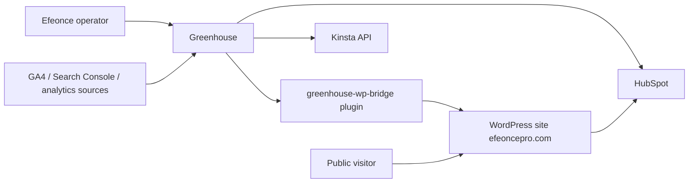
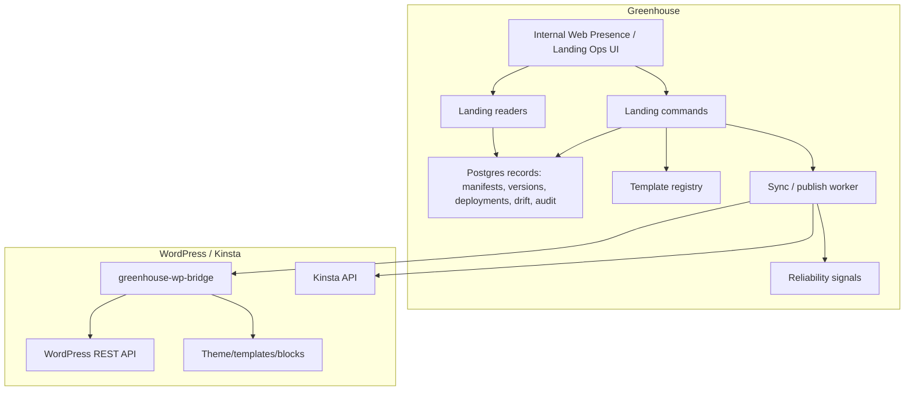
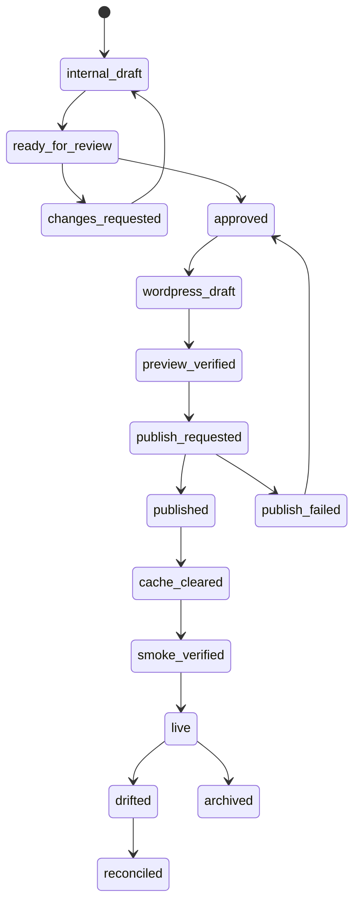

# Greenhouse Public Website Landing Control Plane Architecture V1

> Tipo de documento: arquitectura de producto/plataforma
> Status: Proposed; implementation gated per `EPIC-019`
> Version: V1
> Fecha: 2026-06-13
> Owner: Product / Platform Architecture / Marketing Operations
> ADR: `GREENHOUSE_PUBLIC_WEBSITE_LANDING_CONTROL_PLANE_DECISION_V1.md`
> WordPress skills: official `WordPress/agent-skills` vendored under `.codex/skills/*` and `.claude/skills/*`
> React/Interactivity update: WordPress Developer Blog / Make Core review on 2026-06-14

## 1. Purpose

This document defines the target architecture for Greenhouse to govern Efeonce public website landing pages on WordPress/Kinsta.

It does not ship runtime by itself. It gives `EPIC-019` and future `TASK-###` slices a durable contract:

```text
Greenhouse owns landing operations. WordPress serves the public page. Kinsta operates the hosting runtime. HubSpot owns CRM attribution.
```

## 2. Product Thesis

The Efeonce public website is not just a brochure. It is an acquisition and expansion surface in the ASaaS flywheel. Greenhouse should connect that surface to campaign operations, HubSpot motion, Account 360, Pulse, revenue attribution and eventually Nexa recommendations.

The target capability is:

```text
compose -> review -> preview -> approve -> publish -> verify -> measure -> learn
```

Greenhouse should not become a freeform website builder in V1. It should become a governed landing operations control plane.

## 3. Archetype

Primary archetype: **Internal tool / admin**.

Dominant risk: state-changing actions against a public production website require RBAC, approval, audit and rollback.

Secondary archetypes:

- **Headless content site**: WordPress content schema, SEO, preview and cache invalidation matter.
- **B2B SaaS multi-tenant**: Greenhouse tenancy/access rules still apply internally, even if V1 targets the Efeonce operating entity.
- **Real-time/event-driven**: webhooks/outbox are needed for drift, deployment status and future conversion events.
- **Agentic AI system**: future Nexa generation is advisory/draft only until deterministic publication is reliable.

## 4. System Context



## 5. Container View



## 6. Ownership Model

### 6.1 Public Website Object Modes

| Mode | Meaning | Allowed writes from Greenhouse |
| --- | --- | --- |
| `greenhouse_owned` | Greenhouse created and governs the object. | Yes, through commands and approvals. |
| `wordpress_owned` | Native WordPress editorial object. | No; observe only. |
| `hybrid_observed` | Greenhouse tracks object but does not fully own it. | Limited; task-specific. |

Default for campaign landing pages: `greenhouse_owned`.

Default for existing institutional pages and blog content: `wordpress_owned` until explicitly migrated.

### 6.2 Source of Truth Boundaries

| Concern | Source of truth | Notes |
| --- | --- | --- |
| Landing manifest | Greenhouse | JSON/typed contract, versioned. |
| Landing lifecycle | Greenhouse | Draft/review/approve/publish/archive. |
| Published page html/runtime | WordPress | Rendered via template/blocks controlled by bridge. |
| Hosting operations | Kinsta | Cache, staging, backups, environment status. |
| Conversion CRM lifecycle | HubSpot | Forms, meetings, contacts, deals. |
| Performance analytics | Analytics sources | Ingested/read by Greenhouse for reporting. |

### 6.3 Code Repository and GitOps Binding

The public-site control plane governs both content posture and runtime code posture.

Greenhouse should be the operator surface, but GitHub remains the code/versioning rail for WordPress runtime artifacts:

- `wp-content/themes/ohio-child`
- custom plugins such as `eo-headless-content` and `eo-vibe-coding-api`
- the future `greenhouse-wp-bridge`
- release manifests, deploy artifacts and rollback history

Current discovery on 2026-06-14 found:

- `efeoncepro/efeonce-web` is an Astro/headless rebuild repo and not the source of the current live WordPress/Ohio/Elementor runtime.
- `/Users/jreye/Documents/efeonce-sp` is the closest local WordPress operational repo, but its remote is `cesargrowth11/efeonce-sp` and it is not fully reconciled with Kinsta live.
- Kinsta live has code drift in `ohio-child` and active custom plugins that must be baselined before the bridge plugin is implemented.

Therefore `TASK-1122` must establish the code baseline and repo binding before `TASK-1116` writes the bridge plugin.

Read-only baseline command:

```bash
pnpm public-website:export-live-code
```

The command exports only governed code candidates from Kinsta into ignored `tmp/public-site-code-baselines/<timestamp>/`, plus a SHA-256 `manifest.json`. The manifest is the first input for Greenhouse drift modeling; the exported files are not canonical until a governed `efeoncepro/*` runtime repo is chosen.

Initial repository binding established on 2026-06-14:

- Repository: `efeoncepro/efeonce-public-site-runtime`
- URL: `https://github.com/efeoncepro/efeonce-public-site-runtime`
- Visibility: private
- Default branch: `main`
- Initial baseline SHA: `0fa6bfd`
- Initial baseline tag: `baseline-2026-06-14-live`
- Binding manifest: `docs/operations/public-site-runtime-repository-binding-20260614.json`

This binding is a code/versioning baseline. A one-time manual SSH/WP-CLI activation of the read-only `greenhouse-wp-bridge` plugin was completed on 2026-06-14, but automated deployment apply remains pending Kinsta API token, cache/backup verification, branch/release policy and a future explicit release task.

Non-mutating drift command:

```bash
pnpm public-website:diff-runtime
pnpm public-website:diff-runtime -- --write
```

The command compares the latest live Kinsta export manifest against the local clone of `efeonce-public-site-runtime`. It exits non-zero on drift or missing repo files. First report: `docs/operations/public-site-drift/drift-2026-06-14T14-13-37-068Z.json` with `47` files in sync, `2` ignored live backup artifacts, and no drift.

Greenhouse binding/status command:

```bash
pnpm public-website:runtime-status
pnpm public-website:runtime-status -- --write
```

The command reads `docs/operations/public-site-runtime-repository-binding-20260614.json`, the latest drift report and the local runtime repo head. Current status report after read-only bridge activation: `docs/operations/public-site-runtime-status/status-2026-06-14T16-13-15-103Z.json`, with repo branch `main`, head `f4c8a33`, live drift `in_sync=54`, `ignored_live=2`, and Kinsta cache/backup/deploy apply blocked.

No-mutation deploy dry-run command:

```bash
pnpm public-website:deploy-dry-run
pnpm public-website:deploy-dry-run -- --write
```

The command compares the runtime repo artifact to the latest live Kinsta export manifest and writes an auditable file plan. It does not SSH, write files, delete live-only files, clear cache or create backups. Current report after manual read-only bridge activation: `docs/operations/public-site-deploy-dry-runs/dry-run-2026-06-14T16-13-03-124Z.json`, with `noop=54`, `ignored_live=2`, `would_create=0`, `would_update=0`, `would_not_delete_live_only=0`.

Target posture:

```text
Greenhouse Public Site UI
  -> Greenhouse commands/readers
  -> GitHub repo binding + branch/commit/release artifact
  -> Kinsta deploy/rollback lane
  -> WordPress runtime
```

Operator experience:

- The operator works in Greenhouse.
- Greenhouse creates/reads branches, commits, PRs or release artifacts behind the scenes.
- Greenhouse records baseline SHA, live hash, deploy status, drift state and rollback pointer.
- Direct Kinsta edits are emergency-only and require a backport/reconciliation action.

Not allowed:

- Treating GitHub as a separate manual operating surface for normal public-site work.
- Treating `efeonce-web` as deploy source without a new ADR to migrate the public runtime to headless Astro.
- Pushing arbitrary files over SSH without a Git-backed release record.
- Versioning uploads, generated Elementor CSS, backups or secrets as canonical runtime code.

### 6.4 Bridge Plugin Signed Draft-only Foundation

`greenhouse-wp-bridge` has an initial runtime plugin under:

```text
/Users/jreye/Documents/efeonce-public-site-runtime/wp-content/plugins/greenhouse-wp-bridge/
```

Current status:

- implemented in the runtime repository clone and manually deployed/activated on Kinsta on 2026-06-14 via SSH/WP-CLI;
- read-only inspection mode is active in production;
- v0.3.0 code adds signed draft/private routes, but they are default-disabled until shared secret, write flag, staging/preview and least-privilege are ready;
- PHP syntax validated locally;
- no publish, delete, cache clear, backup, plugin install or theme mutation endpoints;
- HMAC/shared-secret replay guard exists in code for draft routes;
- no Abilities registration yet.

Production smoke evidence from 2026-06-14:

- anonymous `GET /wp-json/greenhouse-wp-bridge/v1/health` returns `401 ghwpb_auth_required`;
- authenticated health returns `200` with `mode=read_only_inspection`, `writesEnabled=false`, `greenhouse_write_routes=false`, and Kinsta/cache/backup flags false;
- authenticated Elementor inspection for page `244079` returns `200` and summarizes 199 elements, including 14 legacy sections, 46 containers and 112 widgets;
- authenticated block inspection for post `249766` returns `200`, confirms `model=wordpress_blocks`, `hasBlocks=true`, no Elementor data, 81 parsed blocks and a bounded top-level sample;
- authenticated Ohio widget catalog returns `200` with 253 Elementor widgets, 37 Ohio widgets and 2 HubSpot widgets.

Reusable Greenhouse-side inspection command:

```bash
pnpm public-website:bridge-inspect -- --page-id 244079
pnpm public-website:bridge-inspect -- --page-id 244079 --write
```

The command is read-only, resolves WordPress auth through Secret Manager, redacts credentials by construction and writes inspection evidence under `docs/operations/public-site-bridge-inspections/`.

Greenhouse also exposes the same read-only inspection primitive through a server-side reader and internal admin API:

```text
src/lib/public-site/bridge-inspection.ts
GET /api/admin/public-site/bridge-inspection?pageId={id}
GET /api/admin/public-site/bridge-inspection?pageId={id}&includeCatalog=false
GET /api/admin/public-site/bridge-inspection?pageId={id}&includeBlocks=false
```

The API is gated by `requireAdminTenantContext()` plus capability `platform.public_site.bridge.inspect` (`read`, `all`). It returns the same `public-site-bridge-inspection.v1` report shape as the CLI, never returns WordPress credentials, adds a cache-buster to avoid stale inspection snapshots by post ID, and responds with `503 public_site_bridge_auth_not_configured` if the current Greenhouse runtime has not been provisioned with the WordPress Application Password secret plumbing. This is a read lane for the future Public Site UI; it is not a write/draft/publish lane.

Current REST namespace and routes:

```text
GET /wp-json/greenhouse-wp-bridge/v1/health
GET /wp-json/greenhouse-wp-bridge/v1/inspection/elementor-document/{id}
GET /wp-json/greenhouse-wp-bridge/v1/inspection/block-document/{id}
GET /wp-json/greenhouse-wp-bridge/v1/inspection/ohio-widget-catalog
POST /wp-json/greenhouse-wp-bridge/v1/drafts
GET /wp-json/greenhouse-wp-bridge/v1/drafts/{greenhouse_manifest_id}
PATCH /wp-json/greenhouse-wp-bridge/v1/drafts/{greenhouse_manifest_id}
```

All endpoints require an authenticated WordPress user with `edit_posts` and are designed for Application Password use. Draft endpoints additionally require:

- `X-Greenhouse-Timestamp` within a 300 second window;
- `X-Greenhouse-Request-Id` with replay guard;
- `X-Greenhouse-Actor`;
- `X-Greenhouse-Environment`;
- `X-Greenhouse-Body-Sha256`;
- `X-Greenhouse-Signature` as `sha256=<hmac>`.

The canonical request signed by Greenhouse is:

```text
GHWPB-HMAC-SHA256
{METHOD}
{REST_ROUTE}
{BODY_SHA256}
{TIMESTAMP}
{REQUEST_ID}
{ACTOR}
{ENVIRONMENT}
```

The Elementor endpoint reads `_elementor_data`, summarizes `container|section|column|widget`, reports widget usage, semantic `gh-*` anchors and selected Ohio page metas. The block endpoint reads raw `post_content` through WordPress `parse_blocks()`, summarizes Gutenberg `blockName` usage, detects `gh-*` classes/anchors, caps top-level block samples at 40 and is intended for blog posts and other block-editor content. The Ohio endpoint reads Elementor's registered widget catalog and identifies Ohio/HubSpot widgets. The draft endpoints can only create/update `draft|private` Greenhouse-owned objects and are still rollout-pending in production.

Builder module vocabulary:

- Gutenberg modules are `blockName` entries such as `core/paragraph`, `core/image`, `core/group`, `yoast-seo/table-of-contents` or third-party blocks.
- Elementor modules are `widgetType` entries such as `ohio_heading`, `ohio_service_table`, `hubspot-form` or core Elementor widgets.
- Greenhouse readers should normalize both as inspectable content modules, while preserving the native source field (`blockName` or `widgetType`) for precise patch planning.

## 7. Landing Manifest Contract

The manifest is the durable Greenhouse artifact. It should be renderer-independent enough to survive a future WordPress replacement.

Minimum shape:

```ts
type PublicWebsiteLandingManifestV1 = {
  contractVersion: 'public-website-landing.v1'
  landingId: string
  ownershipMode: 'greenhouse_owned'
  templateKey: string
  locale: 'es-CL' | 'en-US' | 'pt-BR'
  slug: string
  title: string
  seo: {
    title: string
    description: string
    canonicalUrl?: string
    indexPolicy: 'index' | 'noindex'
    openGraphImageAssetId?: string
    structuredDataKind?: string
  }
  attribution: {
    campaignId?: string
    hubspotCampaignId?: string
    buyerPersona?: string
    serviceKey?: string
    primaryCtaKind: 'hubspot_form' | 'hubspot_meeting' | 'external_url' | 'greenhouse_capture'
    primaryCtaTarget: string
  }
  sections: LandingSection[]
  legalAndBrand: {
    claimsReviewed: boolean
    caseStudyConsentRef?: string
    logoUsageRefs?: string[]
  }
}
```

V1 hard rules:

- No arbitrary script injection.
- No raw unreviewed HTML as the default authoring model.
- No public claims without review state.
- No direct use of private Greenhouse data in public copy.
- No client logos/case studies without consent reference.

## 8. Template Strategy

V1 should ship with governed templates, not a blank canvas.

Candidate templates:

| Template | Purpose |
| --- | --- |
| `service_landing` | A service/capability landing page. |
| `campaign_landing` | Paid/inbound campaign page. |
| `case_study` | Public success story with consent gates. |
| `lead_magnet` | Download/resource capture. |
| `event_webinar` | Event registration. |
| `abm_account` | Account-specific landing, internal review required. |

Each template defines:

- allowed sections;
- required fields;
- SEO defaults;
- CTA contract;
- HubSpot attribution fields;
- preview requirements;
- publish blockers.

## 9. WordPress Bridge Plugin

The bridge plugin is the contract boundary between Greenhouse and the public WordPress runtime.

Responsibilities:

- Register a private REST namespace, e.g. `/wp-json/greenhouse/v1/*`.
- Register WordPress Abilities API abilities for Greenhouse landing operations when the runtime supports it.
- Verify requests from Greenhouse.
- Accept a rendered/normalized landing payload from Greenhouse.
- Create/update WordPress pages as draft/published.
- Attach metadata:
  - `greenhouse_landing_id`
  - `greenhouse_revision_id`
  - `greenhouse_deployment_id`
  - `greenhouse_ownership_mode`
  - `greenhouse_content_hash`
- Apply WordPress template, custom fields and SEO metadata through the active site stack.
- Expose preview and status endpoints.
- Emit webhook or polling-friendly status for out-of-band edits.
- Provide a health endpoint with plugin/theme compatibility information.

Non-responsibilities:

- It does not own Greenhouse business logic.
- It does not call Greenhouse tables directly.
- It does not decide campaign attribution.
- It does not authorize Greenhouse users; Greenhouse authorizes before calling it.

### 9.1 Abilities-First Contract

The bridge should expose operations through shared services with two adapters:

```text
Greenhouse request
  -> bridge auth/signature verification
  -> bridge service
  -> WordPress page/template/metadata operation

WordPress ability execution
  -> ability permission callback
  -> same bridge service
  -> WordPress page/template/metadata operation
```

This keeps REST, Abilities API and future MCP Adapter exposure aligned.

Candidate abilities:

| Ability | Mutates? | Purpose |
| --- | --- | --- |
| `greenhouse/report-bridge-health` | No | Confirm plugin/theme/API compatibility. |
| `greenhouse/list-landing-templates` | No | Return templates accepted by the WordPress runtime. |
| `greenhouse/get-landing-status` | No | Read current WordPress state for a Greenhouse landing. |
| `greenhouse/create-landing-draft` | Yes | Create a draft page from a Greenhouse deployment payload. |
| `greenhouse/update-landing-draft` | Yes | Update a draft page/revision before production publish. |
| `greenhouse/publish-landing` | Yes | Publish an approved draft/revision. |
| `greenhouse/detect-landing-drift` | No | Compare stored metadata/hash with current WordPress state. |

Ability hard rules:

- Register with `wp_register_ability()` inside `wp_abilities_api_init` when available.
- Use precise input/output JSON schemas.
- Permission callbacks must be narrower than "authenticated user can do anything."
- Mutating abilities must require a correlation id from Greenhouse and must write an audit/deployment trace.
- If WordPress runtime is below the required Abilities API version, the bridge degrades to REST-only and reports that state in health.

### 9.2 Required Official WordPress Skills

Any task implementing or auditing the bridge must load the official WordPress Agent Skills vendored for both agents:

- `wordpress-router`
- `wp-project-triage`
- `wp-plugin-development`
- `wp-rest-api`
- `wp-abilities-api`
- `wp-abilities-audit`
- `wp-abilities-verify`
- `wp-block-development` when blocks/templates are involved
- `wp-wpcli-and-ops` when WP-CLI/cache/staging/ops are involved
- `wp-performance` before production publish paths are enabled

### 9.3 Custom Elementor Widget Boundary

The current live runtime is Ohio + Elementor, so Greenhouse can extend the site with custom Elementor widgets when native Ohio/Elementor controls are not enough. The approved extension point is a plugin in the governed runtime repo, not the Ohio parent theme.

Recommended location:

```text
efeoncepro/efeonce-public-site-runtime
  wp-content/plugins/greenhouse-wp-bridge/
    includes/elementor-widgets/
```

Allowed in V1:

- Widgets extending `\Elementor\Widget_Base`.
- Registration through Elementor's widget registry hooks.
- PHP server-side render.
- Controls exposed through Elementor native controls.
- Scoped assets loaded only when the widget is used.
- Stable semantic classes such as `gh-owned`, `gh-widget-*`, `gh-section-*` and `gh-slot-*`.
- Draft/private rollout first, with Greenhouse manifests and visual QA.

Not allowed in V1:

- Editing `wp-content/themes/ohio/` or copying private internals from Ohio Extra.
- Using a custom widget to paper over page meta, wrapper, breadcrumb, hero or gutter issues that Ohio/Elementor already controls.
- Mounting React apps inside Elementor widgets by default.
- Publishing a custom widget live without repo baseline, dry-run deploy, rollback and cache plan.

Good pilot candidate: `Greenhouse Partner Proof`, because the HubSpot partner proof module is real, repeatable, visual, and currently fragile as a set of legacy Elementor sections. Details: `docs/documentation/public-site/wordpress-custom-widgets-react-strategy.md`.

### 9.4 React, Gutenberg and Interactivity Boundary

WordPress can work with React, but the Greenhouse public-site strategy must use React in the WordPress-native lanes instead of turning `efeoncepro.com` into a second SPA.

Validated official signals as of 2026-06-14:

- WordPress Developer Blog, "What's new for developers? (June 2026)": WordPress 7.0 is out, Gutenberg 23.2/23.3 shipped developer-facing updates, React 19 compatibility is a watch item, Abilities API refinements continue, and Playground is the recommended test surface for current Gutenberg/WordPress behavior.
- Make/Core, "React 19 upgrade temporarily reverted in Gutenberg" (2026-06-05): Gutenberg 23.3.0 briefly shipped the React 19 upgrade, then Gutenberg 23.3.2 reverted to React 18 because plugins built against the React 18 JSX runtime crashed under React 19. Core still intends to work toward React 19 for WordPress 7.1 through a more incremental strategy.
- WordPress Interactivity API reference, updated 2026-06-11: the Interactivity API is bundled in WordPress Core from 6.5, uses `@wordpress/interactivity`, `viewScriptModule`, `data-wp-*` directives and block-level stores for frontend interactions in blocks.

Implication for Greenhouse:

| Layer | Recommended use | Not recommended in V1 |
| --- | --- | --- |
| Greenhouse control plane | Next.js/Greenhouse owns landing manifests, approvals, previews, publish commands, audit and drift. | Embedding WordPress admin React inside Greenhouse as the source of truth. |
| WordPress bridge plugin admin/editor tooling | React via WordPress packages such as `@wordpress/element`, Gutenberg blocks, SlotFills/DataViews/DataForm when needed. | Bundling a separate React runtime that conflicts with Gutenberg/Core. |
| WordPress public frontend | Server-rendered blocks/templates plus Interactivity API for scoped interactions, motion toggles, forms, filters, accordions or client-side navigation where safe. | A full React SPA rewrite of the public site or arbitrary React hydration across Elementor/Ohio pages. |
| Landing templates | Dynamic/server-rendered blocks and constrained template sections that can be authored from Greenhouse manifests. | Freeform raw HTML/JS or ungoverned Elementor automation as the default publish model. |

Hard rules:

- Treat React 19 in WordPress as a compatibility watch item until the target runtime proves support with the active plugins/theme.
- If the bridge ships compiled JSX, test it against the exact WordPress/Gutenberg runtime on Kinsta staging before production.
- Prefer WordPress-provided React abstractions (`@wordpress/element`, block editor packages) over direct `react`/`react-dom` imports inside the plugin.
- For public frontend interactivity, prefer the Interactivity API and server-rendered blocks over broad React hydration.
- Greenhouse remains the control plane. WordPress React/Gutenberg is an implementation surface for the WordPress runtime, not a new product source of truth.

## 10. Publishing Lifecycle



### Publish Preflight

Before production publish:

- actor has publish capability;
- approval is current;
- manifest has valid slug/SEO/CTA;
- required consent/review gates pass;
- WordPress bridge health is green;
- Kinsta target environment is known;
- preview exists and was verified;
- rollback target exists or backup policy is explicit.

### Post-Publish Verification

After publish:

- WordPress API confirms final status/URL;
- Kinsta cache clear operation is queued/completed or degraded explicitly;
- public URL returns expected status;
- canonical/metadata basics are visible;
- deployment record is immutable;
- failure state is operator-visible.

## 11. Drift Detection

Drift is first-class, not a surprise.

Drift inputs:

- WordPress page modified timestamp differs from Greenhouse deployment timestamp.
- Stored `greenhouse_content_hash` differs from current rendered content/hash.
- Greenhouse metadata missing from a page that claims Greenhouse ownership.
- SEO metadata diverges.
- Slug/URL changed outside Greenhouse.
- Page status changed outside Greenhouse.

Drift states:

- `in_sync`
- `drift_detected`
- `acknowledged`
- `reconciled_from_wordpress`
- `reapplied_from_greenhouse`
- `dismissed`

Greenhouse must never silently overwrite drifted public content without an explicit actor/action.

## 12. API and Commands

Full API Parity applies. UI buttons consume server-side commands; they are not the business logic.

Candidate command/readers:

| Contract | Purpose |
| --- | --- |
| `readPublicWebsiteInventory()` | WordPress/Kinsta observed inventory. |
| `readLandingManifest(id)` | Greenhouse source manifest and state. |
| `createLandingDraft(command)` | Create internal draft. |
| `updateLandingDraft(command)` | Update draft manifest. |
| `submitLandingForReview(command)` | Move to review. |
| `approveLanding(command)` | Approve current revision. |
| `publishLandingDraft(command)` | Create/update WordPress draft. |
| `publishLandingToProduction(command)` | Publish and clear cache. |
| `rollbackLandingDeployment(command)` | Restore previous known version. |
| `reconcileLandingDrift(command)` | Resolve drift explicitly. |

Potential route lanes:

- Internal app/admin lane for Greenhouse UI.
- Ecosystem lane only if future sister platforms or MCP need server-to-server access.
- MCP read-only tools only after deterministic readers exist.

WordPress-side abilities do not replace Greenhouse API parity. They are the WordPress runtime contract that Greenhouse commands call into. Greenhouse commands remain the product source of truth and authorization boundary.

## 13. Data Model Direction

Schema names are implementation-time decisions, but V1 should keep the model legible:

```text
public_website_landing_manifests
public_website_landing_revisions
public_website_landing_deployments
public_website_external_objects
public_website_drift_events
public_website_approval_events
public_website_audit_log
public_website_sync_runs
public_website_template_registry
```

Rules:

- Revisions are immutable once submitted/published.
- Deployments are immutable once attempted.
- Audit logs are append-only.
- External objects store WordPress/Kinsta ids and observed state; they are not the source of truth for Greenhouse-owned manifests.
- Idempotency keys are required for publish commands.

## 14. Kinsta Operations

Kinsta integration should start narrow:

- read site/environment status;
- read recent backups or backup availability;
- clear cache after publish;
- optionally publish first to staging if the environment contract is available;
- record Kinsta operation ids/results.

Destructive operations such as reset site, delete site, restore backup over production or push staging to live require separate task, explicit confirmation and likely an ADR delta.

## 15. HubSpot and Revenue Attribution

Each landing should be attributable from the start:

- campaign id or HubSpot campaign;
- service/capability being promoted;
- buyer persona / audience;
- CTA type and target;
- form/meeting id;
- expected conversion event.

Greenhouse should eventually connect:

```text
landing -> visit/conversion -> HubSpot contact/company/deal -> Account 360/Pulse -> revenue outcome
```

V1 may store metadata and link to HubSpot records without building the full analytics pipeline.

## 16. Nexa Posture

Nexa is not part of V1 publishing authority.

Allowed early:

- suggest missing SEO fields;
- flag stale content;
- propose copy variants as drafts;
- identify pages with traffic but weak conversion;
- summarize performance.

Not allowed in V1:

- publish autonomously;
- create claims without human review;
- edit WordPress directly;
- bypass approval;
- use private client data in public copy without consent and review.

Autonomy tier: `draft` at most, with human approval before publish.

## 17. Access and Security

Minimum access requirements:

- Internal-only route group for V1.
- Separate capabilities for read/create/review/publish/rollback/integration management.
- Dedicated WordPress technical user.
- Kinsta API credential stored as a secret.
- Bridge plugin shared secret or signed request verification.
- No secrets in logs, frontend bundles or docs.
- Audit log for every mutation.
- Approval requirement for production publish and rollback.
- Rate limiting on bridge endpoints.
- Sanitized errors from WordPress/Kinsta before showing in Greenhouse.

## 18. Observability

Minimum records:

- sync run logs;
- deployment records;
- external API call outcomes;
- drift events;
- reliability signals;
- redacted errors;
- Kinsta operation references.

Minimum signals:

| Signal | Kind | Steady state |
| --- | --- | --- |
| `public_website.wordpress_sync_failed` | integration | 0 sustained |
| `public_website.landing_publish_failed` | deployment | 0 sustained |
| `public_website.landing_drift_open` | drift | bounded and reviewed |
| `public_website.cache_clear_failed` | integration | 0 sustained |
| `public_website.preview_unverified` | release_gate | 0 before publish |

## 19. Rollout Sequence

1. **Discovery/read-only:** inspect WordPress/Kinsta, sync inventory, no writes.
2. **Bridge foundation:** plugin health/status, auth, Abilities API registrations, metadata, draft creation in safe target.
3. **Manifest/templates:** Greenhouse schema, template registry, preview generation.
4. **Draft publishing:** publish to WordPress as draft only; verify preview.
5. **Approval and production publish:** approval gate, publish, cache clear, smoke verification.
6. **Attribution:** HubSpot campaign/form/meeting linkage and basic reporting.
7. **Nexa advisory:** recommendations and draft copy after deterministic core is stable.

## 20. Non-Goals

- Replacing WordPress.
- Migrating the public website theme.
- Building a freeform page builder.
- Exposing landing creation to clients.
- Hosting public landing pages on Greenhouse/Vercel in V1.
- Automating destructive Kinsta operations in V1.
- Allowing Nexa to publish autonomously.
- Making WordPress the source of truth for Greenhouse-owned landings.

## 21. Open Questions Before Implementation

- What WordPress version is currently running on `efeoncepro.com`, and does it support Abilities API in production?
- Which WordPress theme/builder currently renders `efeoncepro.com`?
- Which SEO plugin is active and how does it expose metadata?
- Which forms/meeting embeds are canonical for HubSpot conversion?
- Does Kinsta staging mirror production closely enough for preview approval?
- Should the first template be `service_landing` or `campaign_landing`?
- Which internal role owns publish authority?
- What is the rollback standard: WordPress revision, Greenhouse previous manifest, Kinsta backup, or layered?

## 22. Related Docs

- `GREENHOUSE_PUBLIC_WEBSITE_LANDING_CONTROL_PLANE_DECISION_V1.md`
- `GREENHOUSE_API_PLATFORM_ARCHITECTURE_V1.md`
- `GREENHOUSE_ECOSYSTEM_ACCESS_CONTROL_PLANE_V1.md`
- `GREENHOUSE_SISTER_PLATFORMS_INTEGRATION_CONTRACT_V1.md`
- `GREENHOUSE_WEBHOOKS_ARCHITECTURE_V1.md`
- `GREENHOUSE_FULL_API_PARITY_DECISION_V1.md`
- `docs/context/03_ecosistema-producto.md`
- `docs/context/08_estrategia-comercial.md`
- `docs/context/11_hubspot-bowtie.md`
- `docs/epics/to-do/EPIC-019-public-website-landing-control-plane.md`
