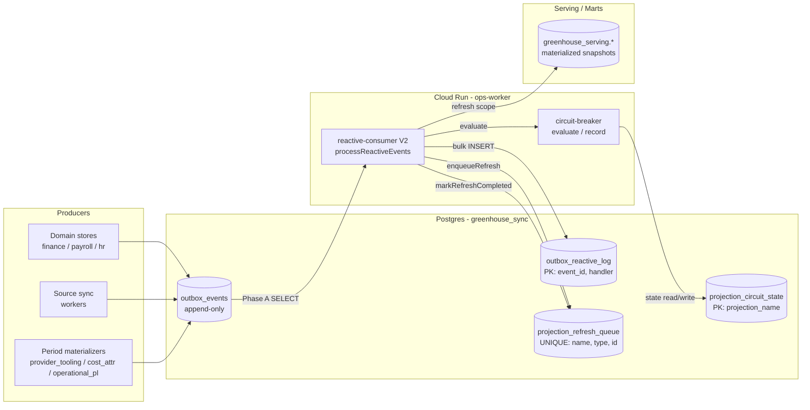

# Greenhouse Reactive Projections Architecture V2

> **Tipo de documento:** Spec de arquitectura tecnica
> **Version:** 2.0
> **Fecha:** 2026-04-13
> **Status:** active
> **Spec compliance:** TASK-379
> **Playbook operativo:** [GREENHOUSE_REACTIVE_PROJECTIONS_PLAYBOOK_V2.md](./GREENHOUSE_REACTIVE_PROJECTIONS_PLAYBOOK_V2.md)

## 1. Diagrama de componentes



Componentes:

- **Producers** (izquierda): todo codigo que publica al outbox via `publishOutboxEvent()` o `publishPeriodMaterializedEvent()` en `src/lib/sync/publish-event.ts`.
- **`outbox_events`**: cola append-only con `status ∈ {pending, published}`. El cron `outbox-publish` transiciona a `published` y la replica a BigQuery.
- **`projection_refresh_queue`**: cola persistente con dedup por `(projection_name, entity_type, entity_id)`. Es el unico lugar donde multiples workers compiten por un scope — ahi corre `FOR UPDATE SKIP LOCKED`.
- **`outbox_reactive_log`**: ledger de idempotencia. Cada `(event_id, handler)` se marca con un `result` ∈ `{coalesced, no-op, retry, dead-letter, resolved-manual}`.
- **`projection_circuit_state`**: estado persistido del circuit breaker por proyeccion (nuevo en V2).
- **`reactive-consumer V2`**: el runtime del worker, ejecutado por los cron jobs del scheduler y fallback-invocable via Vercel.
- **`serving`**: las tablas materializadas finales (ICO, client_economics, payroll_receipts_delivery, staff_augmentation_placements, ...).

## 2. El problema de fan-out y su fix en V2

### V1 — cadena explosiva

```
provider_tooling.refresh() publica N eventos (1 por snapshot)
        ↓
  N eventos en outbox
        ↓
  staff_augmentation_placements consume uno a uno
        ↓
  N × refresh(periodo_entero) = N re-materializaciones redundantes
```

Para N=500 snapshots de un periodo, V1 hace 500 re-materializaciones completas del periodo, todas idempotentes pero inutilmente costosas. El consumer serializa porque el batch size es 50 y el siguiente run tiene 450 eventos remanentes — que generan otros 450 re-materializaciones.

### V2 — publish-once-per-period + coalescing

```
provider_tooling.refresh() publica 1 evento period_materialized
        ↓
  1 evento en outbox con schemaVersion:2
        ↓
  Consumer agrupa por (projection, scope='period:YYYY-MM')
        ↓
  1 × refresh(periodo_entero) = 1 re-materializacion
```

Y ademas, si por cualquier razon llegan 500 eventos (porque un publisher legacy todavia los emitio en v1), el consumer los agrupa por scope y llama `refresh()` una sola vez. El worst-case de V1 deja de ser un worst-case.

## 3. Tablas de la base de datos

**Canonical owner:** `greenhouse_ops`. Schema: `greenhouse_sync`.

### `outbox_events`

```sql
CREATE TABLE greenhouse_sync.outbox_events (
  event_id         TEXT PRIMARY KEY,
  aggregate_type   TEXT NOT NULL,
  aggregate_id     TEXT NOT NULL,
  event_type       TEXT NOT NULL,
  payload_json     JSONB NOT NULL,
  status           TEXT NOT NULL CHECK (status IN ('pending','published','expired')),
  occurred_at      TIMESTAMPTZ NOT NULL DEFAULT NOW(),
  published_at     TIMESTAMPTZ
);
-- Index: (status, event_type, occurred_at)
-- Append-only. V2 no agrega claimed_by/claimed_at.
```

### `outbox_reactive_log`

```sql
CREATE TABLE greenhouse_sync.outbox_reactive_log (
  event_id    TEXT NOT NULL,
  handler     TEXT NOT NULL,
  reacted_at  TIMESTAMPTZ NOT NULL DEFAULT NOW(),
  result      TEXT NOT NULL,
  retries     INT NOT NULL DEFAULT 0,
  last_error  TEXT,
  PRIMARY KEY (event_id, handler)
);
-- result values: 'coalesced:<desc>' | 'no-op:no-handler' | 'no-op:no-scope'
--                | 'no-op:malformed-payload' | 'no-op:extract-scope-error'
--                | 'retry' | 'dead-letter' | 'resolved-manual'
```

### `projection_refresh_queue`

```sql
CREATE TABLE greenhouse_sync.projection_refresh_queue (
  refresh_id             TEXT PRIMARY KEY,
  projection_name        TEXT NOT NULL,
  entity_type            TEXT NOT NULL,
  entity_id              TEXT NOT NULL,
  status                 TEXT NOT NULL CHECK (status IN ('pending','processing','completed','failed')),
  priority               INT NOT NULL DEFAULT 0,
  triggered_by_event_id  TEXT,
  error_message          TEXT,
  retry_count            INT NOT NULL DEFAULT 0,
  max_retries            INT NOT NULL DEFAULT 3,
  created_at             TIMESTAMPTZ NOT NULL DEFAULT NOW(),
  updated_at             TIMESTAMPTZ NOT NULL DEFAULT NOW(),
  UNIQUE (projection_name, entity_type, entity_id)
);
-- Locking: FOR UPDATE SKIP LOCKED en dequeueRefreshBatch y claimOrphanedRefreshItems.
```

### `projection_circuit_state` (nuevo en V2)

```sql
CREATE TABLE greenhouse_sync.projection_circuit_state (
  projection_name       TEXT PRIMARY KEY,
  state                 TEXT NOT NULL DEFAULT 'closed'
                         CHECK (state IN ('closed','open','half_open')),
  consecutive_failures  INT  NOT NULL DEFAULT 0,
  total_runs_window     INT  NOT NULL DEFAULT 0,
  failed_runs_window    INT  NOT NULL DEFAULT 0,
  opened_at             TIMESTAMPTZ,
  half_open_probe_at    TIMESTAMPTZ,
  last_error            TEXT,
  updated_at            TIMESTAMPTZ NOT NULL DEFAULT NOW()
);
```

Migracion: `migrations/20260413105218813_reactive-pipeline-v2-circuit-breaker.sql` (aplicada).

## 4. Cloud Run + Cloud Scheduler topology

### Cloud Run service `ops-worker` (us-east4)

| Property | Value |
|---|---|
| Region | `us-east4` (co-located con Cloud SQL) |
| Runtime | Node 22 (esbuild bundle con 9 alias shims para NextAuth) |
| CPU | 2 |
| Memory | 2 GiB |
| Timeout | 540 s |
| Min instances | 0 |
| Max instances | 5 |
| Concurrency | 4 |
| Auth | IAM (`--no-allow-unauthenticated`) |
| SA | `greenhouse-portal@efeonce-group.iam.gserviceaccount.com` |
| Image | `gcr.io/efeonce-group/ops-worker` |
| Endpoints | `GET /health`, `POST /reactive/process`, `POST /reactive/process-domain`, `POST /reactive/recover`, `POST /cost-attribution/materialize`, `GET /reactive/queue-depth` |

Configuracion actualizada en TASK-379 — baseline anterior era `cpu=1 mem=1Gi max=2 concurrency=1`. V2 levanta el techo para permitir 5 workers en paralelo con 4 requests concurrentes cada uno (hasta 20 drains simultaneos). El scheduler raramente explota ese techo porque los cron jobs son escalonados por dominio.

### Cloud Scheduler jobs (us-central1, TZ America/Santiago)

| Job | Schedule | Endpoint | Descripcion |
|---|---|---|---|
| `ops-reactive-organization` | `*/5 * * * *` | `POST /reactive/process-domain` body `{domain:"organization"}` | Dominio organization |
| `ops-reactive-finance` | `*/5 * * * *` | `POST /reactive/process-domain` body `{domain:"finance"}` | Dominio finance |
| `ops-reactive-people` | `2-59/5 * * * *` | `POST /reactive/process-domain` body `{domain:"people"}` | Dominio people (offset +2min) |
| `ops-reactive-notifications` | `*/2 * * * *` | `POST /reactive/process-domain` body `{domain:"notifications"}` | Alta prioridad, cada 2 min |
| `ops-reactive-delivery` | `*/5 * * * *` | `POST /reactive/process-domain` body `{domain:"delivery"}` | Dominio delivery |
| `ops-reactive-cost-intelligence` | `*/10 * * * *` | `POST /reactive/process-domain` body `{domain:"cost_intelligence"}` | Cada 10 min |
| `ops-reactive-recover` | `*/15 * * * *` | `POST /reactive/recover` | Reclama items huerfanos (`claimOrphanedRefreshItems`) |

Reemplaza los 3 jobs del pre-V2 (`ops-reactive-process`, `ops-reactive-process-delivery`, `ops-reactive-recover`). Con 6 jobs de dominio + 1 recovery, ningun dominio bloquea al siguiente y el backlog por dominio se drena en paralelo.

**IAM**: el SA `greenhouse-portal@efeonce-group.iam.gserviceaccount.com` tiene `roles/run.invoker` sobre `ops-worker` para que Cloud Scheduler pueda invocar via OIDC. Para emitir metricas custom a Cloud Monitoring, requiere `roles/monitoring.metricWriter` (verificar en Slice 4 de TASK-379).

## 5. Failure modes y recovery

### Circuit breaker (por proyeccion)

Estados:

- **`closed`** (default). Cada run actualiza `total_runs_window` y `failed_runs_window`. Si `failed_runs_window / total_runs_window > 0.5` con `total_runs_window >= 10` → transicion a `open`, `opened_at = NOW()`.
- **`open`**. Consumer SALTA la proyeccion en cada batch (la marca como `scopeGroupsBreakerSkipped`). Los eventos quedan sin marcar en `outbox_reactive_log` para que el proximo run los re-fetcheе cuando el cooldown termine. A los 30 min → transicion a `half_open`.
- **`half_open`**. Consumer procesa exactamente 1 scope group. Exito → `closed` + reset de counters. Fallo → `open` + reset `opened_at`.

Implementacion: `src/lib/operations/reactive-circuit-breaker.ts` (modulo nuevo en V2).

### Dead-letter handling

Cuando un scope group falla, V2 marca cada evento del grupo con retry count incremental. Si `retries >= maxRetries` (default 2), el evento queda en `result = 'dead-letter'` y no se vuelve a procesar. El operador tiene que investigarlo manualmente y resolverlo (ver runbook en el playbook).

V2 no envia alerts automaticas de dead-letter todavia — Slice 4 de TASK-379 agrega el alerting a Slack/PagerDuty.

### Orphan claim recovery

El cron `ops-reactive-recover` corre cada 15 min y llama `claimOrphanedRefreshItems()` para reclamar items stuck en `status = 'pending'` o `status = 'processing'` con `updated_at < NOW() - INTERVAL '30 minutes'`. Re-ejecuta el `refresh()` y los marca `completed` o `failed` segun el resultado. El locking usa `FOR UPDATE SKIP LOCKED` para evitar doble-claim si el consumer reactivo y el recovery cron se traslapan.

Implementacion: `src/lib/sync/refresh-queue.ts:189-227`.

## 6. Schema versioning — reglas de coexistencia

- **v1 legacy** (sin `schemaVersion`): payloads entity-level. Cada evento representa 1 entidad. El consumer V2 los procesa sin cambios — el coalescing ocurre transparentemente cuando multiples v1 eventos caen al mismo scope.
- **v2 current** (`schemaVersion: 2`): payloads period-level. Un solo evento por corrida de materializacion. Campos obligatorios: `schemaVersion`, `periodId`, `snapshotCount`, `_materializedAt`. Campos adicionales libres.

**Reglas:**

1. Todos los nuevos publishers deben usar `publishPeriodMaterializedEvent()` para events `*.period_materialized`.
2. Los consumers v2-aware deben refetchar estado desde la tabla materializada, no leer detalle del payload.
3. Durante el rollout (ventana 2 semanas), los publishers legacy y los v2 coexisten. El consumer V2 tolera ambos porque `extractScope` de cada proyeccion sabe como leer su propio evento.
4. Cleanup post-rollout: eliminar el codigo legacy en una task follow-up dedicada. No acelerar eliminacion sin tener `lastReactedAt` saludable en todas las proyecciones afectadas.

## Referencias

- Playbook operativo: [GREENHOUSE_REACTIVE_PROJECTIONS_PLAYBOOK_V2.md](./GREENHOUSE_REACTIVE_PROJECTIONS_PLAYBOOK_V2.md)
- TASK-379: [reactive-projections-enterprise-hardening](../tasks/in-progress/TASK-379-reactive-projections-enterprise-hardening.md)
- ISSUE-046: [silent-skip-backlog](../issues/open/ISSUE-046-reactive-pipeline-silent-skip-backlog.md)
- Cloud infrastructure: [GREENHOUSE_CLOUD_INFRASTRUCTURE_V1.md](./GREENHOUSE_CLOUD_INFRASTRUCTURE_V1.md) §4.9, §5
- Event catalog: [GREENHOUSE_EVENT_CATALOG_V1.md](./GREENHOUSE_EVENT_CATALOG_V1.md)
- Database tooling: [GREENHOUSE_DATABASE_TOOLING_V1.md](./GREENHOUSE_DATABASE_TOOLING_V1.md)
