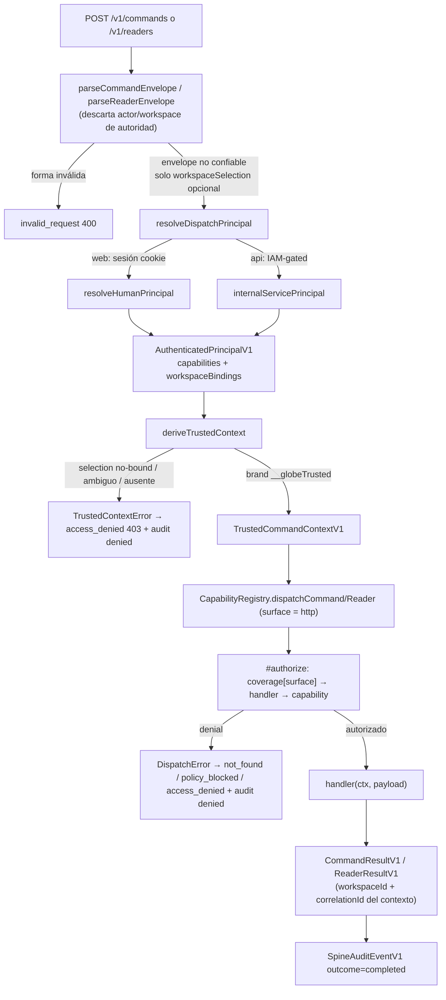

# Efeonce Globe — API Contract Spine V1

- Status: Aceptada e implementada (TASK-1481)
- Validated: 2026-07-19
- Confidence: Alta para el seam contract/dispatch/conformance; el mapeo real ID-token→principal por identidad y el store de tenencia quedan intencionalmente sin materializar
- Reversibility: Mixta — registry, transporte HTTP y SDK son puertas de dos vías; los contratos de schema versionado (`AuthenticatedPrincipalV1`, envelopes, coverage, error vocabulary) son costosos de reemplazar una vez que hay consumers
- Related: [`PLATFORM_FOUNDATION_V1.md`](PLATFORM_FOUNDATION_V1.md) (invariantes 8, 10, 11, 12), [`GREENHOUSE_CONNECTIVITY_V1.md`](GREENHOUSE_CONNECTIVITY_V1.md) (ADR-001, planos de identidad)
- Commits: `c7590a4` (Slice 1 contracts), `9eb91e9` (Slice 2 API+SDK dispatch), `1a9c9db` (Slice 3 conformance harness), `ddbab12` (idempotency-key evidence), `d1851c9` (registro como implementada)

## Contexto y decisión

El invariante 10 de [`PLATFORM_FOUNDATION_V1.md`](PLATFORM_FOUNDATION_V1.md) exige que **Full API Parity exista al nacer la capability, no en el rollout de UI/MCP**: toda capability es dueña de sus schemas versionados, un command/reader canónico, un trusted context, un camino API/SDK privado y evidencia de conformance; las superficies deshabilitadas son estados `policy-blocked` explícitos, nunca huecos.

Este documento describe el **spine mínimo** que hace ese invariante representable en tipos y ejercitable en runtime, sin acoplarse todavía a ningún dominio creativo. El spine es **internal-only** y ships con capabilities **inertes**: prueban el seam (contract → trusted context → registry → transporte → resultado → audit) sin tocar proveedor, base de datos ni storage. La primera capability real (`globe.run.prepare` con handler) llega en TASK-1457, y no debe editar el harness ni reinventar el transporte: solo extiende el registry.

La decisión de fondo: **el borde de confianza vive en el servidor, no en el payload**. Un caller (HTTP, SDK, MCP, CLI, plataforma hermana) manda datos de negocio y, a lo sumo, una *selección* de workspace; jamás manda autoridad. Autoridad = actor + workspace + capabilities, y se deriva server-side desde un `AuthenticatedPrincipalV1` producido por middleware de autenticación. El sistema de tipos hace que un payload no pueda estructuralmente hacerse pasar por autoridad.

Código canónico:

- Contratos versionados: `packages/contracts/src/index.ts`
- Trusted context + registry + dispatch + fixtures inertes: `packages/domain/src/index.ts`
- Transporte HTTP privado + planos de auth + audit: `apps/studio-web/src/app.ts`, `apps/studio-web/src/dispatch.ts`
- SDK cliente del contrato: `packages/sdk/src/index.ts`
- Conformance harness: `apps/studio-web/src/conformance.test.ts`
- Frontera de proveedor (para el paso 3 del contrato de extensión): `packages/provider-contract/src/index.ts`

## El modelo: trusted context vs untrusted payload

### Payload no confiable

Todo transporte entrega un envelope que **no lleva actor, capability ni workspace de autoridad**. Solo lleva datos de negocio y una selección de workspace opcional y no confiable (`CommandRequestEnvelopeV1`/`ReaderRequestEnvelopeV1`, `packages/contracts/src/index.ts`):

```ts
export type CommandRequestEnvelopeV1<TPayload = unknown> = Readonly<{
  schemaVersion: '1';
  apiVersion: GlobeApiVersion;
  command: string;
  idempotencyKey: string;
  correlationId: string;
  workspaceSelection?: string; // NO confiable: solo elige entre bindings del principal
  payload: TPayload;
}>;
```

El reader es idéntico salvo que no exige `idempotencyKey` (las lecturas son proyecciones filtradas por política, sin efecto). El parser server-side (`parseCommandEnvelope`/`parseReaderEnvelope`, `apps/studio-web/src/dispatch.ts`) valida forma y **descarta** cualquier campo que pretenda ser autoridad — el conformance test comprueba que `actorId`/`workspaceId` en body o headers son ignorados.

### Principal autenticado

`AuthenticatedPrincipalV1` (`packages/contracts/src/index.ts`) es la superficie de autoridad, producida solo por el middleware de auth, nunca aceptada como body/header:

```ts
export type AuthenticatedPrincipalV1 = Readonly<{
  schemaVersion: '1';
  principalId: string;
  principalType: 'human' | 'service';
  issuer: 'greenhouse' | 'google-cloud';
  subject: string;
  authenticationMethod: 'greenhouse-session' | 'google-id-token';
  capabilities: readonly GlobeCapability[];      // grants namespaced
  workspaceBindings: readonly string[];          // workspaces operables
}>;
```

`capabilities` y `workspaceBindings` son la autoridad. Las capabilities se estrechan con `parseGlobeCapabilities(raw)`: narrowing de una lista no confiable (por ejemplo del broker de identidad) al vocabulario cerrado `GLOBE_CAPABILITIES`; los valores desconocidos se **descartan**, de modo que un broker no puede ampliar la autoridad de Globe inventando nombres de capability.

### Workspace SELECTION ≠ workspace AUTHORITY

Este es el corazón de la seguridad multi-workspace. `deriveTrustedContext` (`packages/domain/src/index.ts`) toma el principal y la selección opcional no confiable y produce el contexto de autoridad:

```ts
export function deriveTrustedContext(input: {
  principal: AuthenticatedPrincipalV1;
  workspaceSelection?: string;
  correlationId: string;
}): TrustedCommandContextV1 {
  const bindings = principal.workspaceBindings;
  let workspaceId: string;
  if (workspaceSelection !== undefined) {
    if (!bindings.includes(workspaceSelection)) throw new TrustedContextError('workspace_selection_not_bound');
    workspaceId = workspaceSelection;                 // elige, no extiende
  } else {
    const [only, ...rest] = bindings;
    if (only === undefined) throw new TrustedContextError('no_authorized_workspace');
    if (rest.length > 0)   throw new TrustedContextError('workspace_ambiguous');
    workspaceId = only;
  }
  return { actor: {...}, workspaceId, capabilities: principal.capabilities, correlationId, __globeTrusted: '...' };
}
```

Reglas que esto codifica:

- La selección **solo elige** entre los bindings propios del principal; nunca puede conferir un workspace al que el principal no está atado. Un mismatch **deniega y audita** (`TrustedContextError` con razón `workspace_selection_not_bound`), y el transporte lo mapea siempre a `access_denied` vía `trustedContextErrorToApiCode` — nunca revela qué workspaces existen.
- Sin selección y con exactamente un binding, se usa ese binding. La ambigüedad (varios bindings, ninguno elegido) o la ausencia (cero bindings) se **denegan, no se adivinan** (`workspace_ambiguous`, `no_authorized_workspace`).
- La selección **jamás se copia al trusted context** como si fuera autoridad. El `workspaceId` que llega al contexto siempre es un binding verificado.
- **Prohibido eliminar la selección** (rompería el multi-workspace: un principal con varios bindings quedaría sin forma de elegir) y **prohibido promoverla a autoridad**.

### Branded trusted context — el spoofing no es representable

`TrustedCommandContextV1` (`packages/domain/src/index.ts`) lleva un brand server-only:

```ts
export type TrustedCommandContextV1 = Readonly<{
  actor: TrustedActorV1;
  workspaceId: string;
  capabilities: readonly GlobeCapability[];
  correlationId: string;
  readonly __globeTrusted: 'globe.trusted-command-context.v1';
}>;
```

Solo `deriveTrustedContext` produce ese brand. Los transportes pasan input no confiable exclusivamente por los campos de payload; la firma de `CapabilityRegistry.dispatchCommand`/`dispatchReader` exige un `TrustedCommandContextV1`. Como un objeto de request **no puede** estructuralmente hacerse pasar por el contexto branded, **spoofear actor/workspace/capabilities no es representable en la firma del dispatch** — es un error de compilación, no una validación en runtime que se pueda olvidar.

### Flujo request → principal → deriveTrustedContext → registry → result



Orquestación en `apps/studio-web/src/dispatch.ts` (`runDispatch`): deriva el contexto (capturando `TrustedContextError` → audit `denied` con `workspaceId: null`), ejecuta el dispatch (capturando `DispatchError` → audit `denied` con actor+workspace reales), y en éxito emite audit `completed`. Cada request produce **exactamente un** `SpineAuditEventV1` correlacionado.

## Contrato de coverage + surfaces

Las superficies canónicas de Full API Parity (`GLOBE_SURFACES`, `packages/contracts/src/index.ts`):

```ts
export const GLOBE_SURFACES = ['ui','http','sdk','mcp','cli','worker','sister-platform','e2e'] as const;
```

Los estados de coverage por superficie son **exactamente tres**:

```ts
export type SurfaceCoverageState = 'available' | 'policy-blocked' | 'not-applicable';
```

`missing` es **irrepresentable por diseño**. Y el descriptor obliga a declarar las 8 superficies:

```ts
export type CapabilityDescriptorV1 = Readonly<{
  capability: string;
  kind: CapabilityKind;              // 'command' | 'reader'
  summary: string;
  coverage: Readonly<Record<GlobeSurface, SurfaceCoverageState>>;
}>;
```

Como `coverage` es un `Record<GlobeSurface, SurfaceCoverageState>`, **omitir una superficie es error de compilación**. Una superficie deshabilitada es `policy-blocked` (honesto: "existe, hoy no la operas por política"), nunca un hueco silencioso. El manifest agregado es `CapabilityCoverageManifestV1`, servido por `GET /v1/capabilities` y construido con `buildCoverageManifest(registry)` desde `registry.descriptors()` — es decir, **derivado del registry, no hardcodeado**.

### Coverage declarativo vs gate de runtime (matiz load-bearing)

Hoy el único transporte ejecutable es el HTTP privado, y **siempre despacha con `surface: 'http'`** (`HTTP_SURFACE` en `apps/studio-web/src/dispatch.ts`). El SDK, MCP y CLI son *clientes de esa superficie HTTP*, no superficies de transporte separadas. Por lo tanto:

- El **gate de runtime** que consulta `CapabilityRegistry.#authorize` es `coverage['http']`.
- Los estados `ui`/`sdk`/`mcp`/`cli`/`worker`/`sister-platform`/`e2e` del descriptor son **metadata declarativa** del manifest: un consumer los lee para decidir si intentar, y el conformance harness los usa para dirigir aserciones (`descriptor.coverage.http`). Cuando se construya un transporte dedicado (por ejemplo un adaptador MCP nativo), pasará su propia `surface` y el gate consultará ese estado. La consistencia se preserva porque una capability que no expone HTTP declara `http: 'policy-blocked'` (o `not-applicable`), bloqueándose también en runtime.

Esto se documenta explícito para no inducir a error: **el manifest es el contrato machine-readable de las 8 superficies; el gate ejecutable actual del path HTTP/SDK es `coverage.http`.**

## Vocabulario de errores canónicos

`GlobeApiErrorCode` (`packages/contracts/src/index.ts`) es un enum cerrado; el body de error es `GlobeApiErrorV1`:

```ts
export type GlobeApiErrorCode =
  | 'authentication_required' | 'access_denied' | 'policy_blocked'
  | 'invalid_request' | 'not_found' | 'conflict'
  | 'rate_limited' | 'dependency_unavailable' | 'internal_error';

export type GlobeApiErrorV1 = Readonly<{
  schemaVersion: '1';
  error: Readonly<{ code: GlobeApiErrorCode; message: string; retryable: boolean; correlationId: string }>;
}>;
```

La distinción clave es **`policy_blocked` ≠ `access_denied` ≠ `not_found`**, con código estable:

| Denial interno (`DispatchDenialCode`) | Código API | HTTP | Significado para UI/MCP |
| --- | --- | --- | --- |
| `capability_not_found` | `not_found` | 404 | La capability no existe en el registry |
| `surface_not_applicable` | `not_found` | 404 | La capability no aplica a esta superficie |
| `surface_policy_blocked` | `policy_blocked` | 403 | Existe, pero deshabilitada por política (o handler ausente) — **no reintentar** |
| `capability_denied` | `access_denied` | 403 | El principal no tiene la capability requerida |
| `TrustedContextError` (cualquier razón) | `access_denied` | 403 | Selección de workspace no autorizada |

Mapeos canónicos: `dispatchErrorToApiCode` y `trustedContextErrorToApiCode` (`packages/domain/src/index.ts`); status HTTP en `apiErrorStatus` (`apps/studio-web/src/app.ts`). Todos los transportes usan el **mismo** mapeo, así un denial se ve idéntico en cualquier superficie. `policy_blocked` con `retryable: false` permite a UI/MCP **renderizar un estado honesto sin retry inútil** (el test `surfaces a reserved capability as policy_blocked through the SDK` verifica `error.retryable === false`). Los errores nunca filtran el motivo interno verbatim (el body lleva `message: code`, no prosa técnica), coherente con el contrato de observabilidad de [`GREENHOUSE_CONNECTIVITY_V1.md`](GREENHOUSE_CONNECTIVITY_V1.md).

## `CapabilityRegistry` y el dispatch

`CapabilityRegistry` (`packages/domain/src/index.ts`) es el **home único transport-neutral** de todo command/reader. Una capability se escribe una vez y se despacha idéntica desde HTTP, SDK, MCP, CLI, workers y el harness.

```ts
export type RegisteredCapability = Readonly<{
  descriptor: CapabilityDescriptorV1;
  requiredCapability: GlobeCapability;
  handler?: CommandHandler | ReaderHandler;   // ausente = policy-blocked de facto
}>;
```

`dispatchCommand`/`dispatchReader` reciben `{ context: TrustedCommandContextV1, request, surface }`, autorizan y ejecutan el handler, y devuelven el shape canónico (`CommandResultV1`/`ReaderResultV1`) con el `workspaceId` y `correlationId` **tomados del contexto** (no del request). El gate `#authorize` aplica los checks en este orden — **la política precede a la capability**:

1. Sin entry → `capability_not_found`.
2. `coverage[surface] === 'not-applicable'` → `surface_not_applicable`.
3. `coverage[surface] === 'policy-blocked'` **o handler ausente** → `surface_policy_blocked` (fail-closed: un `available` sin handler es misconfiguración y se bloquea, no se despacha).
4. `!trustedContextHasCapability(context, entry.requiredCapability)` → `capability_denied`.

El orden importa: un caller que tiene la capability `globe.run.prepare` pero la despacha mientras está `policy-blocked` recibe `policy_blocked`, no `access_denied` (test `reports a reserved capability as policy_blocked, not not_found`). Esto evita filtrar que la capability "existiría si tuvieras permiso".

### Fixtures inertes del spine

`createGlobeSpineRegistry()` puebla el registry con tres fixtures que prueban el seam sin dominio (`packages/domain/src/index.ts`):

| Capability | Kind | requiredCapability | Coverage | Efecto |
| --- | --- | --- | --- | --- |
| `globe.spine.echo` | command | `globe.studio.access` | `http/sdk/cli/e2e = available`; resto `not-applicable` | Devuelve `{ echoed: payload, workspaceId }` — inerte |
| `globe.spine.status` | reader | `globe.studio.access` | `http/sdk/cli/e2e = available`; resto `not-applicable` | Devuelve `{ status: 'ok', workspaceId }` — inerte |
| `globe.run.prepare` | command | `globe.run.prepare` | `ui/http/sdk/mcp/cli/e2e = policy-blocked`; `worker/sister-platform = not-applicable`; **sin handler** | Reservada para TASK-1457 — toda superficie ejecutable es `policy-blocked`, nunca `missing` |

Ninguno toca proveedor, storage ni base de datos. Verificado: `packages/domain` depende **solo** de `@efeonce-globe/contracts` (no importa `provider-contract`, `database`, `pg` ni `node:fs`), y `apps/studio-web/src/dispatch.ts` no importa provider/db/storage. Las capabilities son **semánticas** (`globe.spine.echo`), nunca un `run_endpoint(endpoint, arbitrary_json)`.

## Transportes: API HTTP privada, planos de auth y SDK

### Endpoints (`apps/studio-web/src/app.ts`)

| Ruta | Método | Respuesta OK | Auth |
| --- | --- | --- | --- |
| `/v1/health` | GET | `GlobeHealthV1` | Pública |
| `/v1/capabilities` | GET | `CapabilityCoverageManifestV1` | `resolveDispatchPrincipal` |
| `/v1/commands` | POST | `CommandResultV1` | `resolveDispatchPrincipal` |
| `/v1/readers` | POST | `ReaderResultV1` | `resolveDispatchPrincipal` |
| `/v1/session`, `/v1/session/revalidate`, `/auth/*`, `/studio` | GET/POST | sesión/UI (solo `serviceMode: 'web'`) | plano humano |

Error body en cualquier fallo: `GlobeApiErrorV1` (`errorJson`). Todo response lleva `x-correlation-id`, `cache-control: no-store` y `x-content-type-options: nosniff`.

### Doble plano de auth (`resolveDispatchPrincipal`)

- **Humano** (`serviceMode: 'web'`): sesión cookie `__Host-globe_session` validada por `resolveHumanPrincipal`. El principal es `principalType: 'human'`, `issuer: 'greenhouse'`, `authenticationMethod: 'greenhouse-session'`; las **capabilities se derivan del grant del broker** (`parseGlobeCapabilities(identity.capabilities)`), no se hardcodean; el binding de workspace es `internalWorkspaceId(identity.organization.clientId)` (piloto interno).
- **Workload** (`serviceMode: 'api'`): el request llegó a un servicio Cloud Run **IAM-gated**, así que el caller *es* el servicio interno autorizado. Devuelve `internalServicePrincipal()`: `principalType: 'service'`, `issuer: 'google-cloud'`, `authenticationMethod: 'google-id-token'`, capabilities `['globe.studio.access']`, binding `greenhouse-org:efeonce`.

El **mapeo real ID-token → principal por identidad** (múltiples identidades de servicio, capabilities por caller) está explícitamente **diferido a TASK-1457** (comentario en `resolveDispatchPrincipal`). Hoy `api` mode colapsa a un único service principal porque la protección es la IAM de Cloud Run, coherente con el "workload identity contract" de [`GREENHOUSE_CONNECTIVITY_V1.md`](GREENHOUSE_CONNECTIVITY_V1.md).

### SDK (`packages/sdk/src/index.ts`)

El SDK es un **cliente de la superficie HTTP** — no un segundo source of truth. `GlobeClient` alcanza el mismo primitive, con idéntico result/error/correlación:

- `client.health(ctx)` → `GET /v1/health`.
- `client.capabilities(ctx)` → `GET /v1/capabilities` → `CapabilityCoverageManifestV1`.
- `client.dispatchCommand(command, payload, { idempotencyKey, correlationId?, workspaceId?, signal? })` → `POST /v1/commands`. **Exige `idempotencyKey`** (lanza `globe_sdk_idempotency_key_required` si falta); `workspaceId` se envía como `workspaceSelection` no confiable.
- `client.dispatchReader(reader, query, { correlationId?, workspaceId?, signal? })` → `POST /v1/readers` (sin idempotencyKey).

Auth vía `GlobeAuthStrategy` inyectable: `bearer` → header `Authorization`; `cloud-run-id-token` → header `X-Serverless-Authorization` (deja `Authorization` libre para un token de aplicación futuro). Errores se normalizan a `GlobeSdkError` leyendo el `GlobeApiErrorV1` upstream (código, retryable, correlationId), nunca devolviendo el body crudo. El SDK valida `correlationId`/`workspaceId`/`idempotencyKey` contra `SAFE_CONTEXT_VALUE` y rechaza tokens con CR/LF.

## Conformance harness (`apps/studio-web/src/conformance.test.ts`)

El harness prueba el spine end-to-end contra un `handle` real (in-process `Request`→`Response`) y un `GlobeClient` cuyo `fetch` es ese mismo `handle`. Lo load-bearing:

- **Paridad HTTP↔SDK**: el mismo `globe.spine.echo` alcanzado por HTTP y por SDK produce igual `command`/`workspaceId`/`outcome`, y **cada uno emite exactamente un** `SpineAuditEventV1` correlacionado (`corr-http`, `corr-sdk`).
- **Anti-spoofing**: `actorId`/`workspaceId` en body y headers se ignoran; el audit registra `globe:service:internal-caller`, no `attacker`; el `workspaceId` resuelto es el binding real, no `ws-victim`.
- **Workspace no bound**: `workspaceSelection: 'ws-victim'` → 403 `access_denied`, `retryable: false`.
- **Idempotency**: el SDK exige la key; el fixture inerte **replayea determinísticamente** (dos POST idénticos → bodies iguales). Nota: es replay determinista *porque el fixture no tiene estado*; el **dedup con estado** (rechazar/reconciliar un replay real) llega con la primera capability con estado en TASK-1457.
- **Reservada `policy_blocked`** vía SDK con `retryable: false`.
- **Matrix derivada del manifest, no hardcodeada**: el harness pide `sdk.capabilities()`, itera los descriptors de tipo `command` y asserta el status HTTP contra `descriptor.coverage.http` (`available`→200, `policy-blocked`→403+`policy_blocked`, `not-applicable`→404). **Una capability nueva se ejercita sin editar el harness** — basta con que aparezca en el manifest.

## Contrato de extensión por capability (lo que TASK-1457 necesita)

Agregar una capability real (p. ej. `globe.run.prepare` con handler) es un procedimiento cerrado que **no toca transporte ni harness**:

1. **Schemas del payload/result** en `packages/contracts` (`packages/contracts/src/index.ts`): tipos versionados `Readonly` para el payload de entrada y el `outcome`/`data` de salida. Si es un command con estado, definir aquí también el contrato de idempotencia/dedup.
2. **Registrar en el registry** (`packages/domain/src/index.ts`): `registry.registerCommand({ descriptor, requiredCapability, handler })` (o `registerReader`), y **voltear el coverage del descriptor de `policy-blocked` a `available`** en las superficies que realmente expone (las demás quedan `policy-blocked` o `not-applicable`, nunca omitidas). Para `globe.run.prepare` esto significa reemplazar el `spineReservedDescriptor` sin handler por uno con handler y coverage `available` en `http`/`sdk`/`cli`/`e2e` según exposición.
3. **El handler enruta por la frontera de proveedor** — `packages/provider-contract` (`CreativeProviderAdapter<TRequest, TResult>`: `estimate`/`submit`/`poll`) hacia `creative-runner` (`apps/creative-runner`), **nunca un SDK de proveedor directo** desde el handler. El dominio y los transportes siguen sin importar provider/db/storage; el trabajo pesado y las credenciales viven detrás del adapter/runner (invariante 3, 4 y 12 de [`PLATFORM_FOUNDATION_V1.md`](PLATFORM_FOUNDATION_V1.md)).
4. **Método SDK tipado** si es SDK-exposed (`packages/sdk/src/index.ts`): un wrapper delgado sobre `dispatchCommand`/`dispatchReader` con los genéricos del schema del paso 1. No agrega lógica; solo tipa.
5. **El harness manifest-driven lo ejercita solo**: al aparecer el descriptor en `/v1/capabilities`, la matrix de conformance lo recorre por su `coverage.http`. No se edita el test.
6. **Grantear `requiredCapability` al principal**: la capability debe estar en `GLOBE_CAPABILITIES` (vocabulario cerrado) y ser concedida por el broker/plano de identidad que produce el `AuthenticatedPrincipalV1`. Sin grant, el gate devuelve `access_denied` (después de pasar el check de política).

## Invariantes duros (NUNCA / SIEMPRE)

- **NUNCA** aceptar actor, capability o workspace de autoridad desde el body o los headers del caller. La autoridad se deriva server-side de `AuthenticatedPrincipalV1`. El único dato de workspace del caller es `workspaceSelection`, y es no confiable.
- **NUNCA** copiar `workspaceSelection` al trusted context ni promoverla a autoridad. Se valida contra `principal.workspaceBindings`; en mismatch se deniega con `TrustedContextError` (razones `workspace_selection_not_bound` / `workspace_ambiguous` / `no_authorized_workspace`) → `access_denied`.
- **NUNCA** eliminar la selección de workspace: rompe el multi-workspace (un principal con varios bindings quedaría sin poder elegir de forma no-ambigua).
- **NUNCA** construir un `TrustedCommandContextV1` fuera de `deriveTrustedContext`. El brand `__globeTrusted` es server-only; un payload no puede volverse trusted context.
- **NUNCA** declarar un `CapabilityDescriptorV1` con una superficie omitida (es error de compilación) ni representar `missing`. Una superficie deshabilitada es `policy-blocked`, nunca un hueco silencioso.
- **NUNCA** confundir `policy_blocked` con `access_denied` o `not_found`. La política precede a la capability en `#authorize`; un `available` sin handler falla closed como `policy_blocked`.
- **NUNCA** importar provider/DB/storage desde un transporte o desde el dominio del spine, ni exponer una capability `run_endpoint(endpoint, arbitrary_json)`. Las capabilities son semánticas y el trabajo de proveedor vive detrás de `packages/provider-contract` → `creative-runner`.
- **NUNCA** que el SDK sea un segundo source of truth: es cliente de la superficie HTTP (el dispatch usa siempre `surface: 'http'`); result/error/correlación son idénticos a los de HTTP.
- **NUNCA** filtrar el motivo interno de un denial verbatim al cliente ni tokens/cookies/secretos a los logs; el error API lleva código estable + correlationId.
- **SIEMPRE** derivar capabilities y bindings del principal producido por el middleware (broker o IAM), no hardcodearlos en el transporte.
- **SIEMPRE** emitir un `SpineAuditEventV1` correlacionado por dispatch (éxito o denegación), con actor/workspace reales cuando existen.
- **SIEMPRE** exigir `idempotencyKey` en commands (no en readers) y `correlationId` en todo request; el reader es una proyección filtrada por política, sin efecto.
- **SIEMPRE** extender el registry para una capability nueva sin editar transporte ni harness; la conformance se dirige desde el manifest.

## Diferido (declarado, no omitido)

| Diferido | A dónde | Estado hoy |
| --- | --- | --- |
| Replay **dedup con estado** (rechazar/reconciliar un replay real) | TASK-1457 (primera capability con estado) | El fixture inerte replayea determinístico porque no tiene estado; no hay dedup store |
| Mapeo **ID-token → principal por identidad** (múltiples service identities, capabilities por caller) | TASK-1457 | `api` mode colapsa a un único `internalServicePrincipal`; la protección es IAM de Cloud Run |
| **Tenancy / session store durable** (workspace/tenancy canónico de Globe, sesiones persistidas) | TASK-1465 (**shipped**, wired en prod) | `DurableSessionStore` sobre Cloud SQL (keyless IAM, maxScale=3), wired en prod; el binding data-driven desde la org del broker (`greenhouse-org:<clientId>`) se mantiene; `InternalSmokeSessionStore` queda como doble de `internal_smoke` |
| Transportes dedicados **MCP / CLI / worker / sister-platform** | Tareas futuras por superficie | Declarados en coverage; el gate ejecutable es `coverage.http` hasta que exista su transporte |

## Scoring 4-pilar (honesto, con riesgo residual)

### Safety — Alto

El borde de confianza es estructural, no procedural: el brand `__globeTrusted` hace el spoofing de autoridad **no representable en tipos**, y la separación selection/authority está probada con negativos (`spoofing negative`, `ws-victim`). El vocabulario de error cerrado + `policy_blocked` honesto evita el anti-patrón de "no existe" cuando en realidad es "no autorizado hoy". **Riesgo residual**: el `api` mode confía en la IAM de Cloud Run para autenticar al caller y usa un único service principal; hasta TASK-1457 no hay diferenciación por identidad ni capabilities por caller de servicio — la autoridad de servicio es "todo o nada" dentro del binding interno.

### Robustness — Alto

Parsers server-side que descartan campos espurios, fail-closed en `#authorize` (handler ausente bajo `available` → `policy_blocked`), narrowing de capabilities (`parseGlobeCapabilities`) contra un vocabulario cerrado, y `exactOptionalPropertyTypes` respetado con spreads condicionales para no inyectar `undefined` en los envelopes. El SDK sanea correlación/workspace/idempotency y rechaza CR/LF. **Riesgo residual**: la coverage por-superficie es declarativa salvo `http`; una capability podría declarar `sdk: 'available'` mientras `http: 'policy-blocked'` y el consumer del manifest la creería alcanzable por SDK aunque el dispatch (que pasa por HTTP) la bloquee. Se mitiga con la convención "SDK/MCP/CLI son clientes de HTTP → su exposición real la determina `http`", pero no hay un check que fuerce esa coherencia todavía.

### Resilience — Medio-Alto

Toda respuesta lleva `correlationId` propagado extremo a extremo (request → context → result/error → audit), timeouts en el SDK (`AbortSignal.timeout` + `AbortSignal.any`), y un `SpineAuditEventV1` por dispatch que separa audit de telemetría operacional. Los errores nunca filtran bodies upstream. **Riesgo residual**: en `internal_smoke` el store de sesión es in-memory (`InternalSmokeSessionStore`, solo `environment: 'internal_smoke'`), sin persistencia ni convergencia de revocación robusta; un reinicio pierde sesiones. **En producción esto ya no aplica**: **TASK-1465** shipó `DurableSessionStore` (Cloud SQL Postgres, keyless IAM) detrás del mismo puerto, wired en ambos servicios Cloud Run a `maxScale=3` — las sesiones sobreviven reinicios y réplicas (ver [`EFEONCE_GLOBE_DURABLE_PERSISTENCE_V1.md`](./EFEONCE_GLOBE_DURABLE_PERSISTENCE_V1.md)). La convergencia de revocación robusta sigue como refinamiento pendiente.

### Scalability — Medio-Alto

El patrón "un primitive canónico, muchos consumers" escala por construcción: capabilities nuevas se agregan al registry y quedan disponibles para todo transporte + Nexa/MCP + harness sin tocar el seam. La conformance manifest-driven crece sin editar tests. Los schemas versionados (`schemaVersion: '1'`, `apiVersion: 'v1'`) permiten evolución sin romper consumers. **Riesgo residual**: (1) el gate de runtime solo consulta `coverage.http`; escalar a transportes dedicados (MCP nativo, worker, sister-platform) exige extender el dispatch para pasar la `surface` correcta y probablemente un check que garantice coherencia entre estados declarativos y transportes reales; (2) el trabajo creativo pesado aún no existe — el spine es síncrono e inerte, y la escalabilidad real de runs largos depende del dispatcher async + `creative-runner` (invariante 4), fuera de este spine.

## Índice de archivos referenciados

- `packages/contracts/src/index.ts` — `GLOBE_CAPABILITIES`, `parseGlobeCapabilities`, `AuthenticatedPrincipalV1`, `CommandRequestEnvelopeV1`/`ReaderRequestEnvelopeV1`, `CommandResultV1`/`ReaderResultV1`, `GlobeApiErrorCode`/`GlobeApiErrorV1`, `GLOBE_SURFACES`/`SurfaceCoverageState`, `CapabilityDescriptorV1`/`CapabilityCoverageManifestV1`.
- `packages/domain/src/index.ts` — `TrustedCommandContextV1` (branded), `TrustedContextError`, `deriveTrustedContext`, `trustedContextHasCapability`, `CapabilityRegistry`, `DispatchError`/`dispatchErrorToApiCode`/`trustedContextErrorToApiCode`, fixtures inertes + `createGlobeSpineRegistry`.
- `apps/studio-web/src/app.ts` — rutas `/v1/*`, `resolveDispatchPrincipal`, `resolveHumanPrincipal`, `internalServicePrincipal`, `apiErrorStatus`, `errorJson`.
- `apps/studio-web/src/dispatch.ts` — `buildCoverageManifest`, `dispatchCommandRequest`/`dispatchReaderRequest`, `runDispatch`, parsers de envelope, `SpineAuditEventV1`.
- `packages/sdk/src/index.ts` — `GlobeClient` (`capabilities`/`dispatchCommand`/`dispatchReader`), `GlobeAuthStrategy`, `GlobeSdkError`.
- `apps/studio-web/src/conformance.test.ts`, `apps/studio-web/src/dispatch.test.ts`, `packages/domain/src/index.test.ts` — evidencia de conformance/dispatch/derivación.
- `packages/provider-contract/src/index.ts` — `CreativeProviderAdapter` (frontera del paso 3 del contrato de extensión).
