# ADR-020 — Efeonce Globe → Salesforce Marketing Cloud Content Builder Export

## Estado de la decisión

- **Status:** Proposed — Salesforce Demo/Dev org, Security, Legal/IP, Product/Globe y Finance pendientes
- **ID:** ADR-020
- **Fecha:** 2026-08-01
- **Owner:** Creative Practice + Product/Globe
- **Scope:** publicación de imágenes aprobadas desde Globe hacia Content Builder
- **Reversibility:** two-way-but-slow
- **Confidence:** medium
- **Validated as of:** 2026-08-01
- **Non-goal:** envío de emails, journeys, triggers, contactos, Data Extensions, Microsoft Graph, Outlook o Marketing Cloud Connect
- **Runtime effect:** ninguno hasta aceptación explícita y task de implementación
- **Implementation owner task:** no asignada; no usar este ADR como autorización de código, secretos o rollout
- **Related contracts:** `TASK-1467` Asset Governance, `TASK-1472` delivery, `TASK-1520` library y `TASK-1529` lifecycle/GC

## Decisión propuesta

Globe generará y conservará las imágenes bajo su flujo gobernado actual. Cuando una persona autorizada seleccione un asset apto para uso comercial, Globe podrá solicitar una publicación asíncrona hacia Salesforce Marketing Cloud **Content Builder** mediante la API REST de assets.

Marketing Cloud será únicamente un destino editorial para que el equipo pueda insertar la imagen en un email. Globe seguirá siendo la fuente de verdad de generación, hash, procedencia, derechos, estado de aprobación y relación con el proyecto.

No se integrará Microsoft Graph. Tampoco se habilitará envío de campañas ni se requerirá Marketing Cloud Connect para este caso.

## Flujo operativo

```mermaid
flowchart LR
  A[Asset generado en Globe] --> B[Rights / provenance / human review]
  B -->|approved-commercial o approved-with-restrictions| C[Command autorizado: publish asset]
  C --> D[Durable operation + idempotency key]
  D --> E[Worker Globe lee bytes privados]
  E --> F[OAuth server-side + Content Builder Asset API]
  F --> G[External asset id / customer key / status]
  G --> H[Content Builder: imagen disponible para email]
```

La interfaz no recibe tokens, credenciales, URLs privadas de GCS ni bytes como autoridad. El worker obtiene el asset desde el storage privado, valida hash y MIME, y publica solo después de volver a comprobar la elegibilidad.

## Tenancy y autoridad de destino

Cada workspace autorizado debe resolver server-side un binding versionado e inequívoco hacia una cuenta de
Marketing Cloud, una Business Unit y una categoría allowlisted. El caller no puede declarar `targetTenant`,
Business Unit, Installed Package ni credenciales. Un workspace sin binding efectivo falla cerrado y una
revocación impide nuevas publicaciones sin borrar evidencia histórica.

El owner de la Business Unit, el owner técnico de la Installed Package y el owner de soporte deben quedar
registrados antes de aceptar esta decisión. Un shared/demo org sirve para POC con datos sintéticos, no concede
por sí mismo una frontera multi-tenant apta para clientes.

## Contrato de integración

### Lado Globe

La capability propuesta debe extender el `CapabilityRegistry` y reutilizar el spine de `commands/readers`, no agregar una ruta ad-hoc.

- Command: `globe.producer.marketing-cloud.content-builder.publish`
- Reader: `globe.producer.marketing-cloud.content-builder.operation.get`
- Capability: `globe.producer.marketing-cloud.content-builder.publish`
- Input: `{ experimentId, sha256, fileName, categoryId, contentType, externalKey? }`
- Output inicial: `{ operationId, state: 'queued' }`
- Reader: estado, `sha256`, `externalAssetId`, `externalKey`, `categoryId`, timestamps y error canónico
- Nunca devolver: access token, client secret, private storage coordinates o bearer grants

El command debe exigir un asset propio del workspace, tipo `image`, hash válido, estado de governance elegible, bytes íntegros y tamaño dentro del límite configurado para Content Builder. El `categoryId` debe provenir de una configuración de tenant autorizada; no se debe aceptar una carpeta arbitraria sin validación.

### Lado Salesforce

El adaptador utilizará una Installed Package y OAuth2 server-side. Su permiso debe limitarse al mínimo necesario para crear/consultar assets de Content Builder; no se solicitarán permisos de envío, journeys, contactos ni Data Extensions.

El payload debe incluir nombre, tipo de asset, categoría y archivo Base64. La respuesta se normalizará a metadata externa; la URL CDN de Salesforce no reemplaza al asset privado ni se tratará como storage de Globe.

## Idempotencia y fallos

- Clave lógica: `workspaceId + sha256 + targetTenant + categoryId + externalKey`.
- La operación se persiste antes de llamar a Salesforce.
- `externalKey` estable evita duplicados en reintentos; nunca se debe crear un asset nuevo ciegamente después de un timeout.
- Un timeout o respuesta ambigua queda como `uncertain`/`reconciling` y requiere consulta por clave externa antes de reintentar.
- Errores 4xx de permisos, tamaño, MIME o categoría son permanentes y requieren intervención.
- Errores de rate limit, timeout o dependencia caída son reintentables con backoff y límite.
- El worker debe registrar correlación, operación y resultado sin registrar tokens ni contenido innecesario.

La solicitud debe persistirse como intención durable y publicar un evento/outbox sólo después del commit. El
worker es el único consumidor con autoridad para leer bytes y llamar Salesforce. El reader proyecta estados
curados; UI, MCP y CLI consumen el mismo command/reader y nunca implementan retries propios contra Salesforce.

## Governance, seguridad y costo

Content Builder publica assets a una superficie CDN externa. Por eso, exportar es una acción de publicación y no una simple descarga. El flujo debe bloquear material con derechos pendientes, información personal innecesaria, likeness/voz restringida o estado `proof-only`.

La integración debe usar una cuenta administrada por Efeonce, MFA/least privilege, Secret Manager para el secreto de la Installed Package, rotación documentada y un target explícito de Business Unit. Las pruebas deben usar imágenes sintéticas o aprobadas para POC; no se deben subir secretos ni material confidencial de clientes.

La evidencia local conserva el vínculo entre operación, hash de origen, external asset id/customer key, binding
de Business Unit, actor y timestamps. El binario exportado queda sujeto a la retención y borrado del destino:
Globe no debe prometer que eliminar su copia privada elimina automáticamente la copia de Content Builder.
Offboarding requiere revocar el binding y las credenciales, detener nuevos exports, reconciliar operaciones
inciertas y ejecutar o documentar la eliminación en Salesforce según contrato y política de retención.

El costo de la integración se debe dimensionar por operación, revisión, storage/export, soporte, credenciales y riesgo. No se debe presentar como incluido en Globe ni como licencia de Marketing Cloud hasta validar el programa de Salesforce y el límite real de la org Demo/Dev.

## Ruta de habilitación sin licencia productiva

La ruta preferida para el POC es una **Marketing Cloud Engagement Demo/Dev account for Partners** o un **shared/demo org** habilitado desde Partner Learning Camp. La elegibilidad de Efeonce no debe asumirse: la evidencia histórica disponible es de Partner Community/Consulting Partner provisional, y Salesforce debe confirmar si el tier actual califica.

Alternativa temporal: solicitar una trial org de Marketing Cloud Next para partners. Si se obtiene, debe verificarse expresamente que exponga Content Builder y la API de assets requerida; una trial de Next no se debe tratar automáticamente como equivalente a Engagement.

La prueba no necesita Marketing Cloud Connect: ese producto relaciona Salesforce CRM con Marketing Cloud, pero no es necesario para que Globe publique una imagen directamente en Content Builder.

## Criterios de aceptación antes de implementación

1. Salesforce confirma por escrito el camino Demo/Dev o trial disponible para Efeonce y su duración.
2. Existe una Business Unit de prueba, una categoría de destino y un usuario de provisioning.
3. Existe una Installed Package de POC con OAuth2 y scopes mínimos; el secreto se almacena fuera del repo.
4. Globe tiene capability, operación durable, worker, reader, auditoría y reconciliación.
5. Un fixture sintético de PNG/JPG se publica una sola vez, se consulta en Content Builder y se puede ubicar dentro de un email de prueba sin enviarlo.
6. Se verifica reintento, timeout ambiguo, asset mayor al límite, permiso insuficiente, MIME inválido y categoría inexistente.
7. Se documentan eliminación/offboarding, límite de uso de la org Demo/Dev y owner de soporte.
8. Security aprueba scopes, secret lifecycle, logging y respuesta a incidentes; Legal/IP aprueba publicación,
   retención y eliminación; Finance aprueba costo/packaging; Product/Globe acepta el command y la experiencia.
9. Se define la relación workspace → cuenta → Business Unit → categoría, incluidos revocación, rotación y
   comportamiento ante un binding stale o ausente.

## Alternativas consideradas

1. Descargar manualmente desde Globe y subir manualmente a Content Builder. Conservada como fallback operativo
   para bajo volumen; no entrega idempotencia, trazabilidad ni reconciliación suficientes para automatización.
2. Publicar mediante Microsoft Graph u Outlook. Rechazada: no es el API de autoridad de Content Builder y
   ampliaría innecesariamente identidad, permisos y datos.
3. Usar Marketing Cloud Connect. Rechazada para este alcance: conecta CRM y Marketing Cloud, pero no es requisito
   para publicar un asset mediante Content Builder API.
4. Enviar campañas directamente desde Globe. Rechazada: mezcla producción creativa con consentimiento,
   audiencia, journeys y envío; esos dominios requieren decisiones y autoridades propias.

## Consecuencias

La propuesta reduce carga manual y conserva lineage entre el asset gobernado y su copia editorial. A cambio,
crea una segunda ubicación con retención y permisos propios, dependencia de Salesforce, costo operativo y una
obligación de reconciliar timeouts y offboarding. La integración no convierte Content Builder en source of truth
ni autoriza emails, contactos o journeys.

## Runtime Contract

Mientras el status sea `Proposed`, el contrato runtime es `none`: no capability, schema, secreto, Installed
Package, worker, binding ni flag se considera autorizado. Si se acepta, la task dueña deberá materializar el
command/reader sobre el API Contract Spine, operación/outbox durable, binding tenant→Business Unit, adapter,
observabilidad, retención/offboarding y gates descritos aquí.

## Revisit When

Reabrir si Salesforce cambia la API o scopes de Content Builder; si el destino pasa de una Business Unit a una
topología multi-BU/multi-org; si se requieren video/audio, contactos, journeys o envío; si la CDN/retención del
destino cambia la postura de derechos; o si otro DAM/MAP se vuelve el destino editorial canónico.

## Próximo paso ejecutable

No crear todavía secretos ni código de producción. Primero recuperar/confirmar el acceso de Partner Community o conseguir la ruta de Demo/Dev/Trial con Salesforce y obtener los approvals listados. Con esa evidencia, abrir una task de implementación para el adaptador y ejecutar la prueba con un asset sintético.

### Fuentes oficiales consultadas

- Salesforce Help — [Marketing Cloud Engagement Demo/Dev Accounts for Partners](https://help.salesforce.com/s/articleView?id=mktg.mc_partner_demo_dev_accounts.htm&type=5)
- Salesforce Help — [Requesting a Trial Organization for Partners](https://help.salesforce.com/s/articleView?id=mktg.mc_next_internal_trial_org.htm&type=5)
- Salesforce Developers — [Content Builder API](https://developer.salesforce.com/docs/marketing/marketing-cloud/guide/content-api.html)
- Salesforce Developers — [File Upload](https://developer.salesforce.com/docs/marketing/marketing-cloud/guide/file-upload.html)
- Salesforce Help — [Marketing Cloud Connect prerequisites](https://help.salesforce.com/s/articleView?id=mktg.mc_co_prerequisites.htm&type=5)
