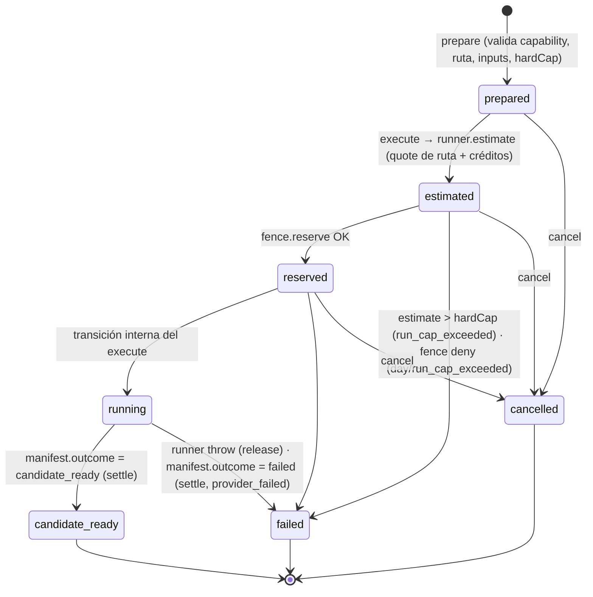
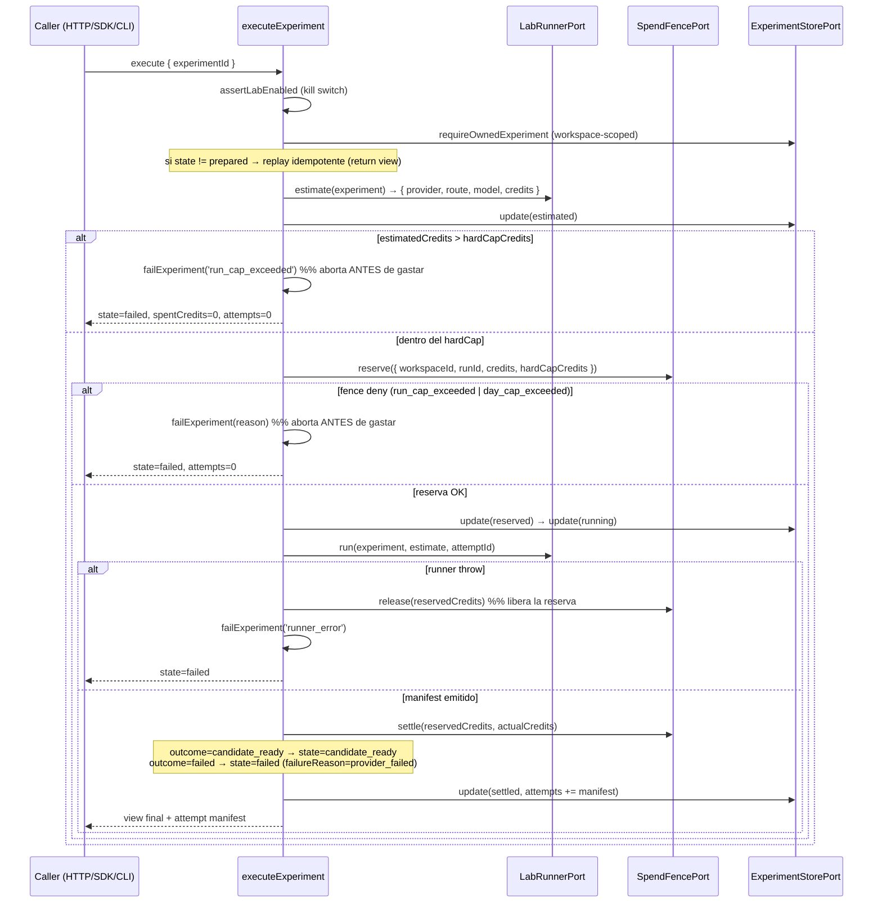

# Efeonce Globe — Model Lab V1

- Status: Aceptada e implementada — fake canary (TASK-1457)
- Validated: 2026-07-19
- Confidence: Alta para el aggregate, la state machine, los guardrails y el provider seam ejercitados por tests; el adapter de proveedor real, sus secretos y el store durable de tenencia quedan intencionalmente sin materializar
- Reversibility: Mixta — el `LabRunnerPort` y el `SpendFencePort` son puertas de dos vías (reemplazables sin tocar el dominio); los schemas versionados (`LabExperimentV1`, `ExperimentAttemptManifestV1`, payloads) son costosos de reemplazar una vez que hay consumers; la state machine del experimento es difícil de cambiar sin migrar registros persistidos
- Related: [`EFEONCE_GLOBE_API_CONTRACT_SPINE_V1.md`](EFEONCE_GLOBE_API_CONTRACT_SPINE_V1.md) (el spine que este Lab **extiende**, SPEC-001), [`PLATFORM_FOUNDATION_V1.md`](PLATFORM_FOUNDATION_V1.md) (invariantes 3, 4, 5, 6, 7, 9, 12), [`DECISIONS_INDEX.md`](DECISIONS_INDEX.md) (SPEC-002)
- Task: TASK-1457 (safe Model Lab + primer provider canary), sobre el spine TASK-1481; consume la infra de TASK-1464

## Contexto y decisión

El invariante 9 de [`PLATFORM_FOUNDATION_V1.md`](PLATFORM_FOUNDATION_V1.md) separa **dos gates distintos**: la *ejecución del Model Lab* — testeo real de modelos que empieza temprano bajo control duro de presupuesto e ingesta privada — y la *promoción de una ruta a producción*, que exige tenant, ledger, idempotencia, evals y evidencia de rollback. El invariante 12 exige que **la primera llamada facturable del Model Lab use el mismo seam API/SDK → command → adapter → runner** previsto para superficies posteriores: llamadas directas al proveedor desde UI, MCP, CLI, task scripts o E2E están prohibidas.

Este documento describe el **Model Lab**: la **primera capability de negocio** que se monta sobre el spine de Full API Parity. No reinventa transporte, autenticación ni conformance; **extiende el `CapabilityRegistry`** del spine con una capability real (`globe.lab.experiment.run`) siguiendo al pie de la letra el "contrato de extensión por capability" documentado en [`EFEONCE_GLOBE_API_CONTRACT_SPINE_V1.md`](EFEONCE_GLOBE_API_CONTRACT_SPINE_V1.md).

Un experimento del Model Lab prueba una **ruta de proveedor** (hoy determinística y falsa, hasta que aterrice la infra) bajo tres controles duros y simultáneos:

1. Un **cap de gasto duro** por run y por workspace/día que **aborta antes de gastar**.
2. **Ingesta privada** de inputs: sólo cruza el contrato un hash de contenido + una postura de derechos; nunca los bytes crudos.
3. Un **manifest inmutable por intento** con ruta propuesta vs real, costo y lineage.

Y no habilita nada de producción: `candidate_ready` es un **candidato técnico, NUNCA una aprobación**. La aprobación profesional del artefacto (invariante 6) y la promoción de la ruta (invariante 9) viven fuera de este Lab.

Código canónico:

- Contratos versionados del experimento: `packages/contracts/src/index.ts`
- Dominio del Lab (state machine, ports, registro, handlers, store in-memory, private-ingest): `packages/domain/src/model-lab.ts`
- Fence de gasto duro: `packages/domain/src/spend-fence.ts`
- Runner + adapter de referencia falso: `apps/creative-runner/src/index.ts`
- Frontera de proveedor (el seam donde entra el adapter real): `packages/provider-contract/src/index.ts`
- Wiring del runtime + kill switch + cap diario + grant del service principal: `apps/studio-web/src/app.ts`
- Método SDK tipado: `packages/sdk/src/index.ts`
- Mapeo de error de transporte: `apps/studio-web/src/dispatch.ts`

## El aggregate: experimento con `view` + `request`

El registro autorizado del experimento es `StoredExperimentV1` (`packages/domain/src/model-lab.ts`), que separa deliberadamente **la proyección lectora** (`view`) del **input privado que el runner necesita y que nunca sale del borde del servidor** (`request`):

```ts
export type StoredExperimentV1 = Readonly<{
  view: LabExperimentV1;                 // proyección: lo que un reader puede exponer
  request: PrepareExperimentPayloadV1;   // input autorizado + hardCap; server-only
}>;
```

`LabExperimentV1` (`packages/contracts/src/index.ts`) es la proyección que sirven los readers. Expone ruta propuesta/real, readiness y gasto contra el cap; **excluye credenciales de proveedor, endpoints privilegiados, costo confidencial de vendor y margen de Efeonce**:

```ts
export type LabExperimentV1 = Readonly<{
  schemaVersion: '1';
  experimentId: string;
  workspaceId: string;
  capability: CreativeCapability;
  state: LabExperimentState;
  provider: string;
  proposedRoute: string;
  model: string;
  modelVersion: string;
  hardCapCredits: number;
  estimatedCredits: number;
  reservedCredits: number;
  spentCredits: number;
  attempts: readonly ExperimentAttemptManifestV1[];
  failureReason?: string;
  createdAt: string;
  updatedAt: string;
}>;
```

La `capability` **no es un nombre de modelo de vendor** sino un verbo creativo semántico del vocabulario cerrado `CREATIVE_CAPABILITIES` (`packages/contracts/src/index.ts`): `image-generate`, `image-edit`, `image-vectorize`, `video-generate`, `video-extend`, `audio-generate`, `speech-synthesize`. El dominio **enruta por contrato de fidelidad, no por nombre de vendor** (invariante 3): el identificador de modelo del proveedor jamás aparece en el contrato de entrada.

La persistencia es un puerto workspace-scoped, `ExperimentStorePort`, con dos impls detrás del mismo puerto: `InMemoryExperimentStore` (clave `workspaceId::experimentId`), el doble por defecto en dev/`internal_smoke`; y `DurableExperimentStore` (`packages/database`), que **TASK-1465** shipó sobre Cloud SQL Postgres (keyless IAM) y hoy corre **wired en producción** en ambos servicios Cloud Run — el estado sobrevive reinicios y réplicas. Ver [`EFEONCE_GLOBE_DURABLE_PERSISTENCE_V1.md`](./EFEONCE_GLOBE_DURABLE_PERSISTENCE_V1.md).

### State machine del experimento

`LabExperimentState` (`packages/contracts/src/index.ts`) y las transiciones legales `EXPERIMENT_TRANSITIONS` + `canTransitionExperiment` (`packages/domain/src/model-lab.ts`):

```ts
const EXPERIMENT_TRANSITIONS = {
  prepared:        ['estimated', 'cancelled'],
  estimated:       ['reserved', 'failed', 'cancelled'],
  reserved:        ['running', 'failed', 'cancelled'],
  running:         ['candidate_ready', 'failed'],
  candidate_ready: [],   // terminal — candidato técnico, NO aprobación
  failed:          [],   // terminal
  cancelled:       [],   // terminal
};
```



`transition()` (`packages/domain/src/model-lab.ts`) rechaza cualquier salto ilegal lanzando `Error('globe_lab_illegal_transition_<from>_<to>')`. Ese error **no** es un `DispatchError` ni un `InvalidExperimentRequestError`: `handlerErrorToApiCode` (`apps/studio-web/src/dispatch.ts`) lo deja pasar como `undefined` y el transporte lo rethrow-ea como `internal_error` redactado — un salto ilegal es un bug interno, no una condición del caller, y se trata como tal (fail-closed, sin filtrar el detalle).

`estimated` carga el quote de ruta + créditos; `reserved` significa que el cap duro quedó fenced; `running` significa que el runner está ejecutando el intento; **`candidate_ready` es candidato técnico, jamás aprobación**.

## Registro en el spine registry

`registerModelLabCapabilities(registry, deps)` (`packages/domain/src/model-lab.ts`) monta 3 commands + 3 readers sobre el `CapabilityRegistry` del spine, **sin editar transporte ni harness**. Los nombres de wire son SSOT en contratos (`GLOBE_LAB_COMMANDS` / `GLOBE_LAB_READERS`, `packages/contracts/src/index.ts`):

| Wire id | Kind | `requiredCapability` | Efecto |
| --- | --- | --- | --- |
| `globe.lab.experiment.prepare` | command | `globe.lab.experiment.run` | Valida y persiste un experimento en estado `prepared` |
| `globe.lab.experiment.execute` | command | `globe.lab.experiment.run` | Estima → chequea cap → reserva → corre → settle |
| `globe.lab.experiment.cancel` | command | `globe.lab.experiment.run` | Cancela un experimento no terminal |
| `globe.lab.experiment.get` | reader | `globe.lab.experiment.run` | Proyección `LabExperimentV1` scoped al workspace |
| `globe.lab.experiment.status` | reader | `globe.lab.experiment.run` | Estado + gasto contra el hardCap (subconjunto) |
| `globe.lab.experiment.evidence` | reader | `globe.lab.experiment.run` | Los manifests por intento (`attempts`) |

Los 6 comparten la misma `coverage` declarativa (`LAB_COVERAGE`, `packages/domain/src/model-lab.ts`) sobre las 8 superficies canónicas de Full API Parity:

| Superficie | Estado | Razón |
| --- | --- | --- |
| `ui` | `policy-blocked` | El Lab es internal-only; la UI se habilita tras tenant/ledger/eval/rollback (invariante 9) |
| `mcp` | `policy-blocked` | Idem — expuesto a agentes recién tras promoción |
| `http` | `available` | Transporte ejecutable del piloto interno |
| `sdk` | `available` | Cliente tipado de HTTP (`prepareExperiment`, etc.) |
| `cli` | `available` | Operable por CLI interna |
| `worker` | `available` | Operable desde un worker gobernado |
| `e2e` | `available` | Ejercitado por el harness/e2e |
| `sister-platform` | `not-applicable` | No es una capability cross-platform |

Como `coverage` es un `Record<GlobeSurface, SurfaceCoverageState>`, **omitir una superficie es error de compilación**; `missing` es irrepresentable. Una superficie deshabilitada es `policy-blocked` honesto ("existe, hoy no la operas"), nunca un hueco. El gate ejecutable del path HTTP/SDK actual es `coverage.http` (ver el matiz "coverage declarativo vs gate de runtime" del spine).

`requiredCapability` es la misma para todos: `GLOBE_LAB_EXPERIMENT_CAPABILITY = 'globe.lab.experiment.run'`, un miembro del vocabulario cerrado `GLOBE_CAPABILITIES`. Un principal sin ese grant recibe `access_denied` (después de pasar el check de política), verificado por el test *denies a principal lacking the lab capability*.

## Flujo de `execute` — estimate → cap → reserve → run → settle

`executeExperiment` (`packages/domain/src/model-lab.ts`) es el corazón del Lab. Sólo actúa cuando el experimento está en `prepared`; un `execute` sobre un experimento en cualquier otro estado **retorna su view actual** (replay idempotente guiado por estado, distinto del dedup por `idempotencyKey` — ver Diferido).



El orden es load-bearing. La secuencia de fallo, verificada por `packages/domain/src/model-lab.test.ts` y `apps/studio-web/src/model-lab.test.ts`:

| Condición | Estado final | `failureReason` | Reserva | Gasto | Attempt registrado |
| --- | --- | --- | --- | --- | --- |
| `estimatedCredits > hardCapCredits` | `failed` | `run_cap_exceeded` | nunca se reserva | 0 | no |
| `fence.reserve` deniega | `failed` | `run_cap_exceeded` \| `day_cap_exceeded` | denegada | 0 | no |
| `runner.run` lanza | `failed` | `runner_error` | **liberada** (`release`) | 0 | no |
| `manifest.outcome === 'failed'` | `failed` | `provider_failed` | settled | `actualCredits` | **sí** (se registra el intento) |
| `manifest.outcome === 'candidate_ready'` | `candidate_ready` | — | settled | `actualCredits` | sí |

Distinción fina que el código codifica: un **runner que lanza** (error de infraestructura) **libera** la reserva y no registra intento; un **runner que retorna `outcome: 'failed'`** (el proveedor falló limpiamente) **settlea** la reserva al costo real y **sí registra el manifest** — porque hubo trabajo de proveedor con evidencia, aunque el resultado no sea candidato. El chequeo `estimate.estimatedCredits > hardCapCredits` corre **antes** de `fence.reserve`: es una segunda barrera defensiva que aborta el gasto incluso si el fence estuviera mal configurado.

## Guardrails

### `LabSpendFence` — cap duro de seguridad (NO el credit ledger)

`LabSpendFence` (`packages/domain/src/spend-fence.ts`) implementa `SpendFencePort` con **doble cap**: cada run no puede exceder su propio `hardCapCredits`, y un workspace no puede exceder `dailyCapCredits` a través de todos sus runs en un día UTC (`#dayKey` = `workspaceId::YYYY-MM-DD` sobre `now()`).

Propiedades que el código garantiza (y `packages/domain/src/spend-fence.test.ts` verifica):

- **Aborta antes de gastar**: `reserve` retorna `{ ok: false, reason }` sin registrar nada cuando el run excede su hardCap (`run_cap_exceeded`) o cuando el total del día superaría el cap (`day_cap_exceeded`). También rechaza créditos no finitos/negativos como `run_cap_exceeded`.
- **Idempotente**: una reserva repetida para el mismo `runId` en estado `reserved` no doble-cuenta el día.
- **Scoped por workspace**: cada workspace tiene su propio presupuesto diario; el cap resetea en un nuevo día UTC.
- **`settle` / `release`**: `settle` ajusta el total del día del costo reservado al costo real (`dayTotal - reserved + actual`, con piso 0); `release` devuelve la reserva completa al presupuesto. Ambos son no-op si el run no está en `reserved`.
- **Construcción validada**: un `dailyCapCredits` ≤ 0 o no finito lanza `globe_lab_daily_cap_invalid`.

**Es un fence de SEGURIDAD, no el credit ledger comercial.** El ledger durable, append-only, de créditos de estudio sigue siendo **TASK-1468** — y el fence durable tampoco es ese ledger. El `LabSpendFence` in-memory (`packages/domain`) es per-proceso: siendo in-memory **resetea al reiniciar**, y es el doble por defecto en dev/`internal_smoke`. **TASK-1465** shipó `DurableSpendFence` (`packages/database`) detrás del mismo `SpendFencePort`, sobre Cloud SQL Postgres (keyless IAM), y hoy corre **wired en producción** — el conteo del cap diario sobrevive reinicios y réplicas (ver [`EFEONCE_GLOBE_DURABLE_PERSISTENCE_V1.md`](./EFEONCE_GLOBE_DURABLE_PERSISTENCE_V1.md)). El fence durable sigue siendo un freno de seguridad, no el ledger comercial. El wiring lee el cap diario de `GLOBE_LAB_DAILY_CAP_CREDITS` (default 500, acotado 1..100_000 en `readStudioRuntimeConfig`, `apps/studio-web/src/app.ts`).

### Ingesta privada — hash + derechos, nunca bytes

Un input de experimento **cruza el contrato sólo como hash de contenido + postura de derechos**, jamás como bytes crudos. `LabAuthorizedInputV1` (`packages/contracts/src/index.ts`):

```ts
export type LabAuthorizedInputV1 = Readonly<{
  inputId: string;
  sha256: string;
  mediaType: 'image' | 'video' | 'audio' | 'text';   // LabInputMediaType
  rights: 'internal-owned' | 'licensed' | 'test-fixture'; // LabInputRights
}>;
```

`validateAuthorizedInputs` (`packages/domain/src/model-lab.ts`) es la política de ingesta privada: **máximo 16 inputs** (`MAX_AUTHORIZED_INPUTS`), cada uno bien formado (`inputId` no vacío, `sha256` no vacío, `mediaType` en el set conocido, `rights` en el set conocido) o el request se rechaza con `InvalidExperimentRequestError`. El test *enforces the private-ingest policy on authorized inputs* verifica el rechazo de hash vacío, media type desconocido (`hologram`), derechos inválidos (`stolen`) y > 16 inputs. Los bytes reales se ingieren privadamente server-side (bucket `efeonce-globe-lab-evidence`, ver Infra); el manifest sólo retiene `authorizedInputHashes`.

### Kill switch `GLOBE_LAB_ENABLED` — fail-closed

`LabKillSwitchPort` es un `() => boolean`. `assertLabEnabled(deps)` (`packages/domain/src/model-lab.ts`) se invoca **al inicio de cada command handler y de cada reader** (`loadOwnedExperiment` también llama `assertLabEnabled`): cuando el switch está OFF lanza `DispatchError('surface_policy_blocked')`, que el transporte mapea a **`policy_blocked` (403, `retryable: false`)**. El flag por defecto es **OFF** (fail-closed): `readStudioRuntimeConfig` lo prende sólo con `GLOBE_LAB_ENABLED === 'true'` (`apps/studio-web/src/app.ts`). El test *fail-closes every command when the kill switch is off* y *fail-closes to policy_blocked when the lab is disabled* lo confirman en dominio y en HTTP.

## Provider seam — el único lugar donde se invoca un proveedor

El `LabRunnerPort` (`packages/domain/src/model-lab.ts`) es **el único seam por donde se invoca un proveedor**. El dominio y los transportes **no importan** provider/DB/storage; el trabajo pesado y las credenciales viven detrás del adapter/runner (invariantes 3, 4, 12):

```ts
export interface LabRunnerPort {
  estimate(input): Promise<LabRouteEstimateV1>;          // propone ruta + quote de créditos
  run(input): Promise<ExperimentAttemptManifestV1>;      // ejecuta el intento, emite manifest inmutable
}
```

La cadena canónica es **API/SDK → command → `LabRunner` → `CreativeProviderAdapter` → manifest**. `LabRunner` (`apps/creative-runner/src/index.ts`) traduce el experimento a `CreativeProviderRequestV1` (`packages/provider-contract/src/index.ts`) — un request provider-neutral que carga sólo capability semántica, ruta, prompt opcional y hashes de input, **nunca bytes, secretos ni identificadores de modelo elegidos por el caller** — y llama `adapter.estimate → submit → poll`.

Hoy el adapter es `FakeReferenceAdapter` (`apps/creative-runner/src/index.ts`): **hermético y determinístico**, sin I/O de red y sin gasto. El "output" es un hash estable del request (`sha256` de `media-qc` sobre `route::prompt::inputHashes`), con un costo de crédito fijo por capability (`FAKE_CREDITS`). Existe para que el seam completo se ejercite end-to-end **antes** de que TASK-1464 provisione credenciales, storage y presupuestos. `packages/domain` depende **sólo** de `@efeonce-globe/contracts`; la evidencia de que el seam no filtró un SDK de proveedor al dominio es que el adapter vive en `apps/creative-runner`.

El **adapter de proveedor real** (Vertex / OpenAI / Fal según la política de soberanía de proveedores) queda **DIFERIDO**. El `LabRunnerPort` es exactamente el punto de reemplazo: se cambia el `CreativeProviderAdapter` inyectado en `LabRunner` **sin tocar el dominio, la state machine ni los transportes**. El comentario del código lo dice: "once TASK-1464 lands the async infrastructure, the same `LabRunnerPort` is fulfilled by a Cloud Run Job dispatcher without changing the domain".

## Manifest por intento — `ExperimentAttemptManifestV1`

Cada intento emite un manifest inmutable (`packages/contracts/src/index.ts`), construido por `LabRunner.run` (`apps/creative-runner/src/index.ts`):

```ts
export type ExperimentAttemptManifestV1 = Readonly<{
  schemaVersion: '1';
  attemptId: string;
  experimentId: string;
  workspaceId: string;
  capability: CreativeCapability;
  provider: string;
  proposedRoute: string;   // la ruta que el estimate propuso
  actualRoute: string;     // la ruta que realmente corrió (puede diferir en fallback)
  model: string;
  modelVersion: string;
  estimatedCredits: number;
  actualCredits: number;
  authorizedInputHashes: readonly string[];
  outputHashes: readonly string[];
  lineage: readonly string[];
  startedAt: string;
  completedAt: string;
  outcome: 'candidate_ready' | 'failed';
}>;
```

Propiedades load-bearing:

- **Propuesta vs real**: `proposedRoute` y `actualRoute` se registran por separado. Un fallback que corre una ruta distinta muestra ambas **sin reescribir la historia**.
- **Costo real**: `estimatedCredits` (del quote) y `actualCredits` (del poll), que es lo que settlea el fence.
- **Hashes de input y output + lineage**: trazabilidad completa; el output nunca es una URL pública (el runner ingiere los bytes privadamente y retorna hashes + evidencia).
- **Excluye** secretos, bytes crudos, costo confidencial de vendor y margen de Efeonce. La proyección `LabExperimentV1` acumula los manifests en `attempts[]`; el reader `evidence` los expone tal cual.

## Aislamiento por workspace + autoridad heredada del spine

El Model Lab **hereda íntegro** el borde de confianza del spine (SPEC-001): la autoridad (actor + workspace + capabilities) se deriva server-side de `AuthenticatedPrincipalV1` vía `deriveTrustedContext`, y jamás del payload. Los handlers reciben un `TrustedCommandContextV1` branded — un payload no puede estructuralmente hacerse pasar por autoridad.

- **Scoping duro**: `prepareExperiment` sella `workspaceId: context.workspaceId` en la view. `requireOwnedExperiment` (`packages/domain/src/model-lab.ts`) lee `store.get(context.workspaceId, experimentId)`; un id de otro workspace o inexistente lanza `DispatchError('capability_not_found')` → **`not_found`**, **nunca revelando la existencia fuera del scope**. El test *does not disclose an experiment from another workspace* lo verifica (un caller en `ws-other` recibe `capability_not_found` para un experimento de `ws-lab`).
- **SDK tipado** (`packages/sdk/src/index.ts`), wrappers delgados sobre `dispatchCommand`/`dispatchReader` con los genéricos del schema — no agregan lógica, sólo tipan: `prepareExperiment(payload, ctx)`, `executeExperiment(experimentId, ctx)`, `cancelExperiment(experimentId, reason, ctx)`, `getExperiment(experimentId, ctx)`, `getExperimentEvidence(experimentId, ctx)`. Los commands exigen `idempotencyKey`; los readers no. `apps/studio-web/src/model-lab.test.ts` corre el mismo experimento por HTTP crudo y por el SDK tipado, ambos resolviendo `workspaceId: 'greenhouse-org:efeonce'`.

### Contrato de error (heredado, con el mapeo del Lab)

Todo denial usa el vocabulario cerrado `GlobeApiErrorCode` del spine; el mapeo por transporte vive en `apps/studio-web/src/dispatch.ts` (`handlerErrorToApiCode`) + `packages/domain/src/index.ts`:

| Origen (dominio del Lab) | Código API | HTTP | Significado |
| --- | --- | --- | --- |
| Kill switch OFF → `DispatchError('surface_policy_blocked')` | `policy_blocked` | 403 | El Lab está deshabilitado — no reintentar |
| Sin capability `globe.lab.experiment.run` → `DispatchError('capability_denied')` | `access_denied` | 403 | El principal no tiene el grant |
| Cross-workspace / id desconocido → `DispatchError('capability_not_found')` | `not_found` | 404 | No se revela existencia fuera del scope |
| Payload malformado / private-ingest violado → `InvalidExperimentRequestError` | `invalid_request` | 400 | Forma o política de input inválida |
| Transición ilegal → `Error('globe_lab_illegal_transition_…')` (no mapeado) | `internal_error` | 500 | Bug interno redactado, no filtra detalle |

Cada dispatch emite **exactamente un** `SpineAuditEventV1` correlacionado (éxito `completed` o `denied` con código), con actor/workspace reales — heredado del `runDispatch` del spine.

## Infra consumida (TASK-1464, aplicada 2026-07-19)

El Model Lab **consume outputs versionados del IaC de TASK-1464**; nunca re-declara infraestructura. TASK-1464 fue **aplicada en vivo el 2026-07-19** (`tofu apply` = `23 imported, 13 added, 0 changed, 0 destroyed`), dejando viva la fundación keyless: 4 service accounts, GitHub WIF pool/provider (ACTIVE), deployer `run.admin` + act-as, remote state en `gs://efeonce-globe-tfstate`, métrica de log de creación de claves de SA, y el **bucket privado de evidencia del Lab**:

- `google_storage_bucket.lab_evidence` = **`efeonce-globe-lab-evidence`** (`infra/terraform/storage.tf`): privado, versionado, `public_access_prevention = enforced`, `uniform_bucket_level_access`. Servido **sólo por signed URLs de corta vida** a nivel de app; el SA de runtime tiene `roles/storage.objectAdmin` para escribir manifests/candidatos.
- Outputs consumidos: `service_account_emails`, `github_wif_provider`, `lab_evidence_bucket` (`infra/terraform`).

**La infra está viva, pero el canary con proveedor real sigue pendiente.** Para habilitar la primera llamada facturable faltan, explícitamente (changelog + `Handoff.md`): (1) un `CreativeProviderAdapter` real, (2) los secretos de proveedor en Secret Manager, (3) un `Dockerfile` de `studio-web`, (4) el secret `GCP_WORKLOAD_IDENTITY_PROVIDER` de GitHub, y (5) prender `GLOBE_LAB_ENABLED=true`. Hasta entonces el Lab corre sólo el fake determinístico (cero red, cero gasto).

## Contrato de extensión al adapter real

Reemplazar el fake por un proveedor real es un procedimiento cerrado que **no toca el dominio, la state machine, los transportes ni el harness** — sigue el "contrato de extensión por capability" del spine, acotado al seam del runner:

1. **Implementar un `CreativeProviderAdapter` real** (`packages/provider-contract/src/index.ts`) en `apps/creative-runner`: `estimate` (quote real de créditos + `expiresAt`), `submit` (encola en el proveedor, retorna `externalRunId`), `poll` (devuelve `ProviderAttemptResult` con `actualRoute`, hashes de output y `outcome`). El adapter traduce `CreativeProviderRequestV1` a la llamada de vendor; **nunca un SDK de proveedor directo desde el handler**.
2. **Inyectarlo en `LabRunner`** en el wiring (`apps/studio-web/src/app.ts`), reemplazando `new FakeReferenceAdapter(now)`. La firma de `LabRunnerPort` no cambia; el dominio no se entera.
3. **Resolver credenciales server-side** vía el Secret Manager boundary de Globe (invariante: "Provider credentials → Globe Secret Manager boundary"). El secreto nunca cruza al dominio ni al manifest.
4. **Escribir evidencia** (manifests + outputs candidatos) al bucket `efeonce-globe-lab-evidence`, sirviéndola por signed URLs de corta vida — nunca una URL pública en el manifest.
5. **Async cuando el trabajo es largo** (invariante 4): el mismo `LabRunnerPort` se cumple con un dispatcher a Cloud Run Job en vez de correr in-process; el `execute` síncrono actual se parte en submit + poll asíncrono.
6. **Prender el kill switch** `GLOBE_LAB_ENABLED=true` en el runtime del piloto, con el `GLOBE_LAB_DAILY_CAP_CREDITS` apropiado, sólo tras la aprobación explícita del gate de canary.

El grant al principal ya existe: `internalServicePrincipal()` (`apps/studio-web/src/app.ts`) concede `globe.studio.access` + `globe.lab.experiment.run` (+ `globe.lab.evaluation.run`) — el kill switch, no el grant, gatea si los experimentos corren.

### Realización — `VertexCreativeAdapter` (TASK-1486, code-complete, rollout gated)

El primer `CreativeProviderAdapter` real ya existe: `VertexCreativeAdapter` (`apps/creative-runner/src/vertex-adapter.ts`). Cumple el contrato de arriba al pie de la letra y **no toca el dominio ni el contrato**:

- **Routing table interna** (`VERTEX_ROUTING`): `image-generate`/`image-edit` → `gemini-2.5-flash-image`; `video-generate`/`video-extend` → `gemini-omni-flash-preview` (región `global`). Los model IDs viven **dentro del adapter**; `supports()` es `false` para `image-vectorize`/`audio-generate`/`speech-synthesize` (boundary Google-native explícito, adapter Fal/Chirp futuro). `estimate` es lookup puro sin red; `submit` es la **única** llamada facturable (`generateContent` síncrono); `poll` decodifica el base64 inline → `sha256` (media-qc) → `outputHashes` (nunca URL pública). `actualCredits` sale del token count real de la respuesta (Omni ~5.792 tok/s); los créditos son una **unidad interna** que capa el fence, no dinero (el ledger comercial es TASK-1468, `as-of 2026-07` — reverificar ID/región/pricing antes de comprometer costo).
- **Keyless**: el `VertexTransport` recibe el `getAccessToken` inyectado; el wiring (`app.ts`) lo construye con `createAdcAccessTokenProvider()` (ADC/WIF, scope `cloud-platform`, `google-auth-library` importado lazy — sólo carga en el path vertex vivo). El token se obtiene y usa dentro del transporte; nunca sale del proceso ni al manifest. Error mapping: 404 → `model_unavailable`, 429 → `quota_exhausted`, 401/403 → `access_denied`, sin filtrar el body crudo.
- **Provider-selection**: env `GLOBE_LAB_PROVIDER` (default **`fake`**) selecciona `FakeReferenceAdapter` vs `VertexCreativeAdapter` en `buildLabRunner()`. Reversible al instante (`fake` + redeploy). El transporte es inyectable (`StudioAppDependencies.vertexTransport`) → los 12 tests del adapter corren con un stub, **cero red y cero gasto**.
- **Private-ingest**: el canary sirve requests prompt-only (text-to-X); una request con `inputHashes` falla cerrado con `inputs_unavailable` hasta que la resolución hash→bytes desde el bucket privado aterrice (follow-up declarado).

**Go-live checklist del canary billable** (gated por humano — NO ejecutado por la task de código):

1. Habilitar `aiplatform.googleapis.com` + los modelos (Omni/Imagen) en el proyecto `efeonce-globe` (verificados en `efeonce-group`, no aún en `efeonce-globe`).
2. Bind `roles/aiplatform.user` a la SA de runtime del proyecto `efeonce-globe`.
3. Deploy del runner (Dockerfile) o ADC local al proyecto; budget + alertas de gasto.
4. `GLOBE_LAB_PROVIDER=vertex` + `GLOBE_LAB_ENABLED=true`; un experimento por el seam con hard cap bajo → verificar manifest real (provider/model/version, `actualCredits`, hashes) + fence reservó/liquidó + el reporte del harness (TASK-1458) deja de declarar "proveedor fake".
5. Revert a `fake` tras el smoke; declarar el runtime en el handoff/ledger.

**Canary verificado en vivo (2026-07-19).** La primera llamada facturable real de Globe se ejecutó por el seam sancionado (harness → `command → registry → LabRunner → VertexCreativeAdapter.submit → Vertex generateContent`) con ADC del operador contra el proyecto `efeonce-globe`: `image-generate` → `gemini-2.5-flash-image` (región `global`), `state=candidate_ready`, `provider=vertex`, `proposedRoute==actualRoute` (sin fallback), `estimatedCredits==actualCredits==10`, output como `sha256:…` (nunca URL pública), el fence reservó y liquidó. Prereqs confirmados: `aiplatform.googleapis.com` habilitada y ambos modelos (Omni + Nano Banana) accesibles en `efeonce-globe`. El runtime **deployado** sigue `GLOBE_LAB_PROVIDER=fake` por default; el canary probó el path vertex sin cambiar el default.

### Segundo adapter — Fal (Recraft/Seedream/Seedance/ElevenLabs) + Composite (TASK-1487, code-complete, rollout gated)

El `FalCreativeAdapter` (`apps/creative-runner/src/fal-adapter.ts`) conecta el **stack no-Google allowlisted** vía la queue API de Fal, cumpliendo el mismo contrato sin tocar dominio ni contrato:

- **Routing table interna** (`FAL_ROUTING`, las 7 capabilities): `image-generate`/`image-edit` → **Seedream 5**; `image-vectorize` → **Recraft**; `video-generate`/`video-extend` → **Seedance 2.0**; `audio-generate`/`speech-synthesize` → **ElevenLabs**. Todos los slugs son **no-Google** (ByteDance/Recraft/ElevenLabs); un modelo Google violaría el boundary y va por Vertex. `estimate` sin red; `submit` única facturable; `poll` → `sha256` de los bytes descargados → `outputHashes`.
- **Queue API con el gotcha**: `submit` encola en `queue.fal.run/<slug>`, drena el `status_url` hasta `COMPLETED` (bounded) y lee el `response_url` — **siempre los urls que Fal devuelve, nunca reconstruidos desde el slug** (sub-path → 405). Los outputs vienen como URLs de Fal → el adapter las **descarga server-side** y hashea; la URL nunca entra al manifest.
- **Keyed, secreto propio de Globe**: la API key se inyecta (`getApiKey`); el wiring la resuelve de `GLOBE_FAL_API_KEY` (secreto dedicado de Globe, **NUNCA** `greenhouse-fal-api-key`). Nunca se loggea; error mapping 401/403 → `access_denied`, 429 → `quota_exhausted`, queue FAILED → `provider_failed`. Inputs que requieren bytes (edit/vectorize/i2v) → `inputs_unavailable` hasta la resolución hash→bytes (follow-up).

El `CompositeProviderAdapter` (`apps/creative-runner/src/composite-adapter.ts`) combina Vertex + Fal detrás de la misma interfaz: `supports()` = unión de los hijos; para capabilities Fal-only (`image-vectorize`/`audio-generate`/`speech-synthesize`) rutea por `supports()`; para el **overlap** image/video (ambos las sirven) usa una **política explícita** (`DEFAULT_COMPOSITE_POLICY`: image/video → Vertex Google-native; Seedream/Seedance alcanzables vía `GLOBE_LAB_PROVIDER=fal`). `poll` vuelve al hijo que emitió el run. Un selector por contrato de fidelidad reemplaza la política fija en un follow-up.

**Provider-selection**: `GLOBE_LAB_PROVIDER` = `fake|vertex|fal|composite` (default `fake`, reversible). El canary Fal billable en vivo es rollout gated: necesita el **secreto Fal propio de Globe** + verificación de slugs + budget. Los tests de `creative-runner` (Vertex + Fal + Composite) corren con transportes mockeados, cero gasto.

**Expansión de modelos (TASK-1488) + canary Fal verificado en vivo.** El vocabulario `CREATIVE_CAPABILITIES` creció a 10 con `image-upscale`/`video-upscale`/`model-3d-generate`, y el `FAL_ROUTING` conecta modelos verificados **contra las skills** (fuente de verdad tested, no el catálogo doc): Seedream 5 Pro/Lite (image), Recraft v4.1 (`text-to-vector`), Topaz (upscale imagen/video), Hyper3D Rodin v2.5 (`text-to-3d`), Seed Audio (audio, slug reverify), ElevenLabs (speech), Seedance 2.0 (video). **Regla dura descubierta en vivo:** los modelos **ByteDance** en Fal usan slug **sin** prefijo `fal-ai/` (`bytedance/seedream/v5/pro/text-to-image`); con el prefijo el submit pasa pero el result da 404. El **canary Fal se verificó EN VIVO** por el seam (con la key Fal existente del repo — excepción temporal documentada, retiro: Globe provisiona su propia key): `image-generate` → Seedream 5 Pro, `candidate_ready`, `provider=fal`, `actualRoute=bytedance/seedream/v5/pro/text-to-image`, `estimated==actual==10`, output `sha256:f9d9a216…`, fence liquidó. Los que requieren input (edit/upscale/i2v) → `inputs_unavailable` hasta la resolución hash→bytes.

**Los 10 modelos verificados en vivo (2026-07-19) — ninguno sin verificar.** Método barato de resolución: `POST {}` a `https://fal.run/<slug>` → 404 = app inexistente, 422 = existe. Los **6 text-driven** se generaron **end to end** por el adapter (submit→drain→result→download→hash): `image-generate` Seedream 5 Pro (`sha256:abf71934…`), `image-vectorize` Recraft v4.1 (`sha256:5c78e765…`), `audio-generate` Seed Audio (`sha256:90303b12…`), `speech-synthesize` ElevenLabs TTS (`sha256:9e0e408e…`), `model-3d-generate` Hyper3D Rodin v2.5 GLB (`sha256:e44304f4…`), `video-generate` Seedance 2.0 (`sha256:158c27c0…`). Los **4 que requieren input** (image-edit, image-upscale, video-extend, video-upscale) tienen slug verificado (422 = existe; upscale pide `image_url`/`video_url`); su end-to-end espera la resolución hash→bytes. Hallazgos incorporados: Seed Audio vive en `fal-ai/seed-audio` (no en `bytedance/…`) y usa `prompt`; el poll budget subió (3D/video tardan minutos); un 422 en el result = `provider_failed` (rechazo del proveedor, p.ej. content-policy del audio nativo de Seedance), no `upstream_error`.

## Edit / refine cross-model (TASK-1490, live-verified 2026-07-20)

Refinar un candidato es transversal, pero cada proveedor lo implementa distinto. El Lab expone
**una sola semántica** y resuelve el mecanismo adentro.

### El contrato: `editFrom`, y nada de vocabulario de proveedor

`PrepareExperimentPayloadV1.editFrom = { experimentId }` es lo único que un caller dice. No nombra
paradigma, sesión ni modelo. El caller **sí** declara `capability`/`referenceRoute`/`hardCapCredits`
del edit: eso es justamente lo que habilita el **edit cross-model** (refinar un candidato de Seedream
con Nano Banana); heredarlos del padre lo impediría. `previousInteractionId` queda **deprecado** —
era vocabulario de un modelo en una superficie— y es **mutuamente excluyente** con `editFrom`
(mandar ambos es `invalid_request`, nunca se resuelve por precedencia).

### Los dos paradigmas y quién elige

- **Stateful**: el proveedor guarda la sesión y se encadena por su id (`previous_interaction_id` de Omni).
- **Reference-based**: el output del padre se re-inyecta como base del edit. Es el que hace posible el
  cross-model, porque no depende de ninguna sesión del proveedor.

El **dominio** resuelve el padre y deriva `editSource` server-side; el **runner** elige el paradigma
usando el único dato que sólo él conoce en ese momento — **qué proveedor va a ejecutar**. Un handle de
sesión sólo significa algo para quien lo emitió, así que se hilvana **únicamente** cuando el proveedor
ejecutante es el del padre; cualquier otro caso cae a reference-based. El cambio queda registrado en
`ExperimentAttemptManifestV1.editMode` — **nunca es silencioso**.

### La pieza que faltaba: retención de outputs

Reference-based era estructuralmente imposible antes de esta task: los adapters hasheaban los bytes de
salida y los **descartaban**, así que el hash de un candidato no resolvía a nada. `OutputIngestPort`
(espejo de `InputResolverPort`, en el mismo y único punto de invocación) los persiste
content-addressed bajo el mismo `sha256` que publica el manifest, y `outputsRetained` lo declara.
Un fallo de storage **no** destruye un candidato ya pagado: degrada a `outputsRetained: false`.

### Rechazos en `prepare`, no en medio de un run pagado

Se rechaza antes de que el fence reserve: padre desconocido o de otro workspace (`not_found`, sin
revelar existencia), padre sin candidato, padre **sin ninguna afordancia** (ni outputs retenidos ni
ref encadenable), media no editable, profundidad de cadena excedida, e intento de edit malformado
(nunca se degrada a un generate silencioso).

### Encadenabilidad la certifica el adapter, no el dominio

Un id puede existir y no ser editable en ningún lado (el keyless de Vertex emite ids que después
rechaza). Sólo el adapter conoce sus superficies, así que reporta `providerRunChainable` junto con
`providerRunSurface`. El dominio lee un booleano y nunca aprende vocabulario de proveedor.

### Derechos: derivado ≠ propio

La base de un edit **no** entra a `authorizedInputs` (ese campo sigue siendo declaración pura del
caller, con su significado intacto entre generate y edit) y **no** se blanquea como `internal-owned`:
lleva la postura `derived-internal` —que un caller no puede declarar— más los derechos heredados del
padre, de modo que un input `licensed` sigue restringiendo a sus descendientes.

### Multi-referencia y referencias combinadas cross-modales

Cada ruta declara cuántas referencias puede llevar y **falla cerrado** al excederlas: truncar produce
un resultado plausible que no es el pedido. Omni acepta sets **combinados imagen+vídeo** en un mismo
`reference_to_video` ("este sujeto, con esta cámara") — verificado en vivo en **ambas** superficies.

### `GLOBE_LAB_OMNI_EDITABLE` (default OFF)

Un generate editable **debe** correr en la superficie Gemini (un id keyless no es encadenable en
ninguna parte), así que prenderlo mueve **todo** generate de Omni fuera del keyless y a facturación por
API key. Default OFF es seguro **porque** los outputs se retienen: el candidato sigue siendo
refinable por referencia igual.

### Evidencia en vivo (2026-07-20, por el seam completo)

| Carril | Evidencia |
|---|---|
| Reference-based | Seedream generate → Seedream edit; `editMode=reference`, lineage encadenado |
| **Cross-model** | Seedream generate → **Nano Banana (Vertex)** edit por referencia; `editMode=reference` |
| Stateful | Omni generate (`surface=gemini-api`, `chainable=true`) → edit; `editMode=stateful` |
| Cross-modal | Omni `reference_to_video` con imagen + vídeo en un set; `candidate_ready` |

Dos defectos que sólo el gasto real reveló, ambos con suite unitaria en verde: `providerRunChainable`
se calculaba y no se propagaba (todo edit stateful degradaba en silencio), y todo fallo del runner
colapsaba a `runner_error` (el fallo más común de un edit era indistinguible de cualquier otro).

## Extensión Reference Intelligence / Style DNA (TASK-1494)

TASK-1494 extiende SPEC-002 sin abrir un segundo carril de proveedor. El primitive transport-neutral vive en
`packages/contracts/src/reference-intelligence.ts` y `packages/domain/src/reference-intelligence.ts`; Studio
solo compone puertos y los transportes HTTP/SDK/CLI/worker siguen heredando el spine.

### Decisión y límites

- La operación semántica es un método tipado opcional de `CreativeProviderAdapter`; no existe cliente Vertex,
  Gemini o Fal en dominio ni en un handler de UI. `VertexCreativeAdapter` es el único adapter implementado para
  esta operación y usa el `VertexTransport` keyless existente.
- El caller envía `referenceAssetId` y la versión fija
  `style-dna-gemini-2.5-flash-v1`. No puede elegir un modelo ni inventar versiones para romper la caché.
- `GovernedReferenceAssetIdentityResolver` deriva hash, rights y elegibilidad desde
  `AssetProvenanceStorePort.getAsset(workspaceId, assetId)`. Nunca lee ni retorna un storage handle.
- `GovernedReferenceAnalysisExecutor` resuelve bytes por `InputResolverPort`, revalida hash/MIME, extrae la
  paleta localmente y recién después de un estimate puro reserva el spend fence antes de la llamada semántica.
- La paleta usa decode/normalización server-only con `sharp` y un histograma RGB fijo de 4 bits por canal,
  orden estable y pesos normalizados. `paletteAlgorithmVersion=sharp-rgb-histogram-v1` hace explícita su
  evolución; la semántica viene como JSON estricto saneado y el score permanece confianza `[0,1]`.
- Caché y leases se indexan por `workspaceId + referenceSha256 + analysisModelVersion`; los perfiles, estilos,
  versiones y hechos de ruta permanecen tenant-scoped en las tablas de la migración `0009`.
- El conditioning materializa texto provider-neutral server-side. Los parámetros nativos de estilo no se usan
  hasta que exista una ruta verificada que los soporte; el browser solo puede seleccionar una versión inmutable
  de estilo, no suministrar prompts compilados ni payloads de proveedor.

### Composición y degradación

`apps/studio-web/src/app.ts` compone identidad desde el store de provenance y análisis únicamente cuando existe
un bucket privado y `GLOBE_LAB_PROVIDER` es `vertex` o `composite`. Sin store, bytes privados, proveedor real o
kill switch, la capability sigue publicada pero responde `dependency_unavailable`/`policy_blocked`; nunca crea
un perfil plausible. `mcp` permanece `policy-blocked`; `ui` está declarada `available` por el contrato del
Producer, pero su uso real depende de grants y rollout del runtime.

La decisión queda gobernada por SPEC-002 y su provider seam ya aceptado. No se crea otro ADR: la alternativa
seleccionada es aditiva, reversible y fue el checkpoint de TASK-1494; cambiar de seam, modelo de identidad o
algoritmo de paleta sí exige reabrir la decisión.

### Estado de rollout al 2026-07-22

Código, suites herméticas, migración `0009`, configuración no secreta y despliegue internal-only están
completos en el SHA `a5e128935577`. `globe-api-internal-00030-xkf` y
`globe-studio-internal-00031-vwz` sirven el 100%; la API conserva perímetro anónimo 403. Los negativos live
confirmaron asset ausente, versión no aprobada y selección cross-workspace fail-closed. El canary positivo de
caché/gasto sigue **operativamente bloqueado** porque el workspace no posee ningún asset gobernado elegible;
no se modifica ingesta, readiness ni rights para fabricar evidencia.

## Invariantes duros (NUNCA / SIEMPRE)

- **NUNCA** invocar un proveedor fuera del `LabRunnerPort` → `CreativeProviderAdapter`. UI, MCP, CLI, task scripts y E2E tienen prohibida la llamada directa (invariante 12). El dominio y los transportes no importan provider/DB/storage.
- **NUNCA** aceptar bytes crudos de input por el contrato: sólo `sha256` + `rights` + `mediaType` (`validateAuthorizedInputs`, máx 16). Los bytes se ingieren privadamente server-side.
- **NUNCA** tratar `candidate_ready` como aprobación. Es candidato técnico; la aprobación profesional (invariante 6) y la promoción de ruta (invariante 9) viven fuera del Lab.
- **NUNCA** usar el spend fence como ledger comercial de créditos. El `LabSpendFence` in-memory es un fence de seguridad que resetea al reiniciar; **TASK-1465** shipó `DurableSpendFence` detrás del mismo puerto (wired en prod, sobrevive reinicios/réplicas), pero **sigue siendo un fence de seguridad, no el ledger** — el ledger durable append-only es TASK-1468.
- **NUNCA** gastar antes de reservar: el chequeo `estimate > hardCap` corre antes de `fence.reserve`, y una reserva denegada aborta con `failed` sin gasto. Un runner que lanza **libera** la reserva.
- **NUNCA** exponer secretos, bytes crudos, costo confidencial de vendor o margen de Efeonce en `LabExperimentV1` ni en `ExperimentAttemptManifestV1`. Ni una URL pública de output — sólo hashes.
- **NUNCA** revelar la existencia de un experimento fuera de su workspace: un id cross-workspace o desconocido es `capability_not_found` → `not_found`.
- **NUNCA** correr el Lab con el kill switch por defecto en ON: `GLOBE_LAB_ENABLED` es fail-closed (default OFF → `policy_blocked` en todo command y reader).
- **NUNCA** editar transporte ni harness para agregar la capability: el Lab extiende el `CapabilityRegistry` y el conformance manifest-driven lo ejercita solo.
- **NUNCA** representar `missing` en la coverage: una superficie deshabilitada (`ui`/`mcp`) es `policy-blocked`; omitir una superficie es error de compilación.
- **SIEMPRE** derivar autoridad server-side (`deriveTrustedContext` → `TrustedCommandContextV1` branded); actor/workspace/capabilities nunca vienen del payload.
- **SIEMPRE** enrutar por capability semántica (`CREATIVE_CAPABILITIES`), no por nombre de modelo de vendor; el proveedor y su modelo se resuelven detrás del adapter.
- **SIEMPRE** registrar un manifest inmutable por intento con proposed vs actual route, costo real, hashes y lineage — incluso cuando el proveedor retorna `outcome: 'failed'` (hubo trabajo con evidencia).
- **SIEMPRE** settlear o liberar la reserva del fence al cerrar el run (`settle` en candidate/provider-failed; `release` en runner throw).
- **SIEMPRE** reemplazar el proveedor por el seam del `LabRunnerPort` sin tocar el dominio, la state machine ni los transportes.
- **NUNCA** meter la base de un edit en `authorizedInputs`: ese campo es declaración del caller y su significado no puede cambiar entre un generate y un edit (rompería el chequeo `input_lineage_intact`, el tope `MAX_AUTHORIZED_INPUTS` y la desambiguación de referencias en el adapter). Viaja como `editReference`.
- **NUNCA** blanquear un derivado como `internal-owned`: la base de un edit es `derived-internal` (postura que un caller no puede declarar) y arrastra los derechos heredados del padre.
- **NUNCA** hilvanar un handle de sesión hacia un proveedor que no lo emitió, ni confiar en un `providerRunRef` que su adapter no certificó como `providerRunChainable`.
- **NUNCA** truncar un set de referencias para que entre en la ruta: excederse falla cerrado (truncar devuelve trabajo que parece correcto y no lo es).
- **SIEMPRE** registrar `editMode` cuando un edit ejecuta: un cambio de paradigma es evidencia, nunca un cambio silencioso.
- **SIEMPRE** rechazar un edit imposible en `prepare`, antes de que el fence reserve — nunca descubrirlo como error de proveedor a mitad de un run pagado.

## Scoring 4-pilar (honesto, con riesgo residual)

### Safety — Alto

Tres controles duros y simultáneos, cada uno probado con negativos: cap de gasto que aborta antes de gastar (`run_cap_exceeded` pre-reserve + fence per-run/per-día), ingesta privada que rechaza bytes/derechos inválidos, y kill switch fail-closed que bloquea commands **y readers**. La autoridad hereda el borde estructural del spine (spoofing no representable). El aislamiento cross-workspace es `not_found`, no una fuga de existencia. **Riesgo residual**: el `internalServicePrincipal` en `api` mode concede `globe.lab.experiment.run` a un único service principal "todo o nada" dentro del binding interno — no hay diferenciación por identidad de servicio ni capabilities por caller; la protección real del `api` mode es la IAM de Cloud Run. El mapeo per-identidad ID-token → principal sigue sin materializar (el comentario de `resolveDispatchPrincipal` lo atribuye a TASK-1457, pero en la práctica TASK-1457 shipó el Lab, no ese mapeo — queda diferido).

### Robustness — Alto

Fail-closed por diseño: kill switch al inicio de cada handler/reader, transición ilegal → `internal_error` redactado (no un estado corrupto), payload malformado → `invalid_request`, fence idempotente que no doble-cuenta, y un `execute` guiado por estado (`prepared`-only) que replayea la view en vez de re-ejecutar. El fence distingue runner-throw (release) de provider-failed (settle + manifest). Validación estricta de `hardCapCredits` (> 0, finito) y de cada input. **Riesgo residual**: la coverage por-superficie es declarativa salvo `http` (heredado del spine): el Lab declara `sdk/cli/worker: available` pero el gate ejecutable real es `coverage.http`; la coherencia se sostiene por convención ("SDK/CLI son clientes de HTTP"), sin un check que la fuerce. Y el `estimate` síncrono in-process no modela aún timeouts/retries de un proveedor real de larga duración.

### Resilience — Medio

`correlationId` propagado extremo a extremo, un `SpineAuditEventV1` por dispatch, y errores que nunca filtran el motivo interno verbatim. La reserva se libera correctamente ante fallo de runner. **Riesgo residual**: en dev/`internal_smoke` el `ExperimentStorePort` (`InMemoryExperimentStore`) y el `LabSpendFence` son **per-proceso e in-memory** — un reinicio pierde experimentos y el conteo del cap diario. **En producción esto ya no aplica**: **TASK-1465** shipó `DurableExperimentStore` + `DurableSpendFence` (+ `DurableSessionStore` / `DurableEvaluationReportStore` / `DurableAuditLog`) detrás de los mismos puertos, sobre Cloud SQL Postgres (keyless IAM), wired en ambos servicios Cloud Run a `maxScale=3` — el estado sobrevive reinicios y réplicas (ver [`EFEONCE_GLOBE_DURABLE_PERSISTENCE_V1.md`](./EFEONCE_GLOBE_DURABLE_PERSISTENCE_V1.md)). El credit ledger comercial durable (TASK-1468) sigue pendiente. Un crash a mitad del `execute` (entre `reserve` y `settle`) todavía no tiene un recovery reconciliador explícito de la reserva.

### Scalability — Medio-Alto

El patrón "un primitive canónico, muchos consumers" escala por construcción: el Lab se montó sobre el spine sin tocar transporte ni harness, y HTTP/SDK/CLI/worker lo operan idénticos. Schemas versionados (`schemaVersion: '1'`) permiten evolución sin romper consumers. El `LabRunnerPort` desacopla el crecimiento de proveedores del dominio. **Riesgo residual**: el `execute` es **síncrono e in-process** — un run largo con proveedor real sostendría un request web, violando el invariante 4; la escalabilidad real depende del dispatcher async a Cloud Run Job (diferido con TASK-1464/adapter real). El `LabSpendFence` in-memory tampoco escala a múltiples réplicas del servicio (el cap diario no es compartido entre procesos); en producción **TASK-1465** lo resuelve con `DurableSpendFence`, cuyo conteo diario vive en Cloud SQL compartido entre las réplicas (wired a `maxScale=3`, ver [`EFEONCE_GLOBE_DURABLE_PERSISTENCE_V1.md`](./EFEONCE_GLOBE_DURABLE_PERSISTENCE_V1.md)).

## Diferido (declarado, no omitido)

| Diferido | A dónde | Estado hoy |
| --- | --- | --- |
| **Adapter de proveedor real** (Vertex/OpenAI/Fal) + secretos en Secret Manager | TASK-1464 en adelante + aprobación de canary | Sólo `FakeReferenceAdapter` determinístico; el `LabRunnerPort` es el seam de reemplazo |
| **Ejecución async** de runs largos (Cloud Run Job dispatcher) | TASK-1464 async infra | `execute` síncrono in-process |
| **Replay dedup con estado** (rechazar/reconciliar un replay por `idempotencyKey`) | Primera capability con dedup store | Hay replay idempotente guiado por estado (`prepared`-only), pero no un dedup store por key |
| **Store durable de tenencia** (workspace/experimentos persistidos) | TASK-1465 (**shipped**, wired en prod) | `DurableExperimentStore` sobre Cloud SQL (keyless IAM, maxScale=3); `InMemoryExperimentStore` queda como doble de dev/`internal_smoke` |
| **Credit ledger comercial** (durable, append-only) | TASK-1468 | `DurableSpendFence` (TASK-1465) es el fence de **seguridad** durable wired en prod; el **ledger comercial** append-only sigue pendiente |
| **Adapter de proveedor real** (`VertexCreativeAdapter`, routing/keyless/estimate/submit/poll) | TASK-1486 (**code-complete**, rollout gated) | Provider-selection `GLOBE_LAB_PROVIDER` default `fake`; ver §"Realización" |
| **Habilitación del canary real** (Vertex enablement en `efeonce-globe`, SA `aiplatform.user`, Dockerfile/deploy, budget, `GLOBE_LAB_PROVIDER=vertex` + `GLOBE_LAB_ENABLED=true`) | Aprobación explícita (go-live checklist TASK-1486) | Código listo; flags OFF por defecto |
| **Superficies UI / MCP** | Post tenant/ledger/eval/rollback (invariante 9) | `policy-blocked` honesto en la coverage |

## Índice de archivos referenciados

- `packages/contracts/src/index.ts` — `LabExperimentState`, `PrepareExperimentPayloadV1`, `ExecuteExperimentPayloadV1`, `CancelExperimentPayloadV1`, `LabAuthorizedInputV1`, `ExperimentAttemptManifestV1`, `LabExperimentV1`, `CREATIVE_CAPABILITIES`, `GLOBE_LAB_EXPERIMENT_CAPABILITY`, `GLOBE_LAB_COMMANDS`, `GLOBE_LAB_READERS`.
- `packages/domain/src/model-lab.ts` — `canTransitionExperiment` + `EXPERIMENT_TRANSITIONS`, ports (`ExperimentStorePort`/`SpendFencePort`/`LabRunnerPort`/`LabKillSwitchPort`), `ModelLabDependencies`, `registerModelLabCapabilities` + `LAB_COVERAGE`, handlers `prepareExperiment`/`executeExperiment`/`cancelExperiment`, readers, helpers `requireOwnedExperiment`/`transition`/`failExperiment`/`assertLabEnabled`, `validateAuthorizedInputs`, `InMemoryExperimentStore`, `InvalidExperimentRequestError`.
- `packages/domain/src/spend-fence.ts` — `LabSpendFence` (`reserve`/`settle`/`release`/`dayCommittedCredits`), `LabSpendFenceConfig`.
- `apps/creative-runner/src/index.ts` — `FakeReferenceAdapter` (`FAKE_CREDITS`, `estimate`/`submit`/`poll`), `LabRunner`, `toProviderRequest`.
- `apps/creative-runner/src/vertex-adapter.ts` (TASK-1486) — `VertexCreativeAdapter` (`VERTEX_ROUTING`, `supports`/`estimate`/`submit`/`poll`, error mapping), `VertexTransport` port + `createVertexTransport` (keyless live), `VertexAdapterError`.
- `apps/creative-runner/src/fal-adapter.ts` (TASK-1487) — `FalCreativeAdapter` (`FAL_ROUTING` con Seedream/Recraft/Seedance/ElevenLabs, queue submit/status/result/download, error mapping), `FalTransport` port + `createFalTransport` (keyed live), `FalAdapterError`.
- `apps/creative-runner/src/composite-adapter.ts` (TASK-1487) — `CompositeProviderAdapter` (routing por `supports()` + política), `DEFAULT_COMPOSITE_POLICY`, `CompositeRoutingError`.
- `packages/provider-contract/src/index.ts` — `CreativeProviderAdapter`, `CreativeProviderRequestV1`, `ProviderEstimate`, `ProviderSubmission`, `ProviderAttemptResult`.
- `apps/studio-web/src/app.ts` — `registerModelLabCapabilities` wiring, `LabSpendFence`/`InMemoryExperimentStore`/`LabRunner`/`FakeReferenceAdapter` construcción, `killSwitch` desde `GLOBE_LAB_ENABLED`, `GLOBE_LAB_DAILY_CAP_CREDITS`, `internalServicePrincipal` grant.
- `apps/studio-web/src/dispatch.ts` — `handlerErrorToApiCode` (mapeo `InvalidExperimentRequestError` → `invalid_request`, `DispatchError` → código canónico), audit por dispatch.
- `packages/sdk/src/index.ts` — `GlobeClient.prepareExperiment`/`executeExperiment`/`cancelExperiment`/`getExperiment`/`getExperimentEvidence`.
- `infra/terraform/storage.tf` — `google_storage_bucket.lab_evidence` (`efeonce-globe-lab-evidence`) + IAM del SA de runtime.
- Tests como contrato — `packages/domain/src/model-lab.test.ts`, `packages/domain/src/spend-fence.test.ts`, `apps/creative-runner/src/index.test.ts`, `apps/studio-web/src/model-lab.test.ts`.
