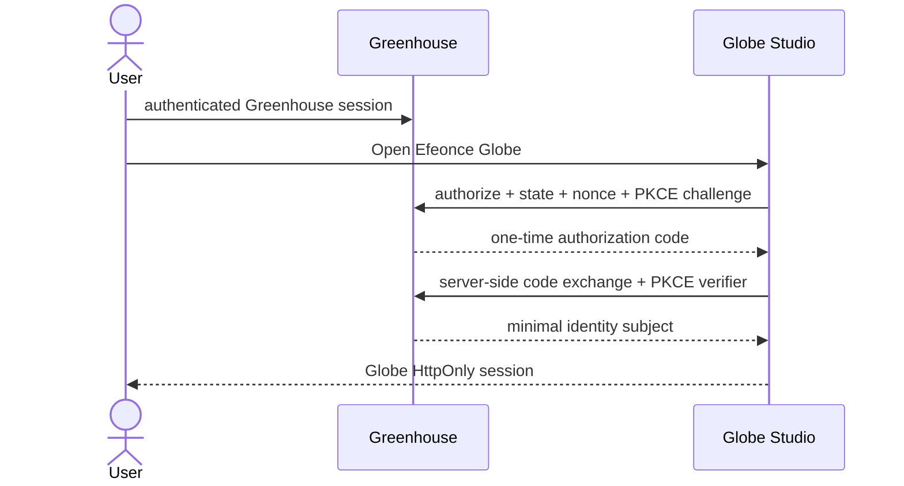
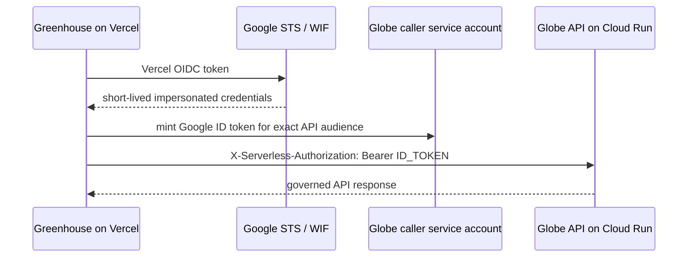

# Greenhouse Connectivity V1

- Decision: ADR-001
- Status: Accepted; non-production workload and human federation lanes proven live
- Validated: 2026-07-19
- Confidence: High for identity separation and internal pilot; Production/external access intentionally unvalidated
- Reversibility: Mixed — SDK/auth adapters are two-way; ecosystem subject and capability contracts are costly to replace
- Owners: Greenhouse identity/control plane and Efeonce Globe
- Related: `PLATFORM_FOUNDATION_V1.md`

## Decision

Efeonce Globe is reachable from Greenhouse through two independent identity planes:

1. **Human federation:** Greenhouse authenticates the person and Globe creates its own local, revocable session after an authorization-code + PKCE exchange.
2. **Workload federation:** Greenhouse server workloads call the Globe API with short-lived Google-signed identity tokens. Vercel reaches Google Cloud through OIDC + Workload Identity Federation; Cloud Run and local development use Application Default Credentials.

Greenhouse and Globe never share cookies, databases, provider credentials, service-account keys or implicit administrator roles.

## Alternatives considered

| Alternative | Decision |
| --- | --- |
| Share the Greenhouse browser cookie | Rejected: couples domains, session lifecycle and blast radius. |
| Persist a service-account JSON key in Vercel | Rejected: long-lived credential with avoidable rotation and leakage risk. |
| Give Greenhouse direct provider/storage/database access | Rejected: bypasses Globe policy, audit, budget and workspace boundaries. |
| Run Globe as a Greenhouse module | Rejected by the accepted sister-platform boundary and independent scaling requirements. |
| Use Greenhouse SSO for people plus WIF/ADC for workloads | Accepted: separates human and service identity while retaining near-seamless navigation. |

## Consequences

- Globe must operate a local session store and revocation convergence rather than relying on Greenhouse cookies.
- Greenhouse needs a generalized sister-platform broker policy; the current Kortex-specific eligibility path is insufficient.
- Every runtime and CI caller receives a distinct least-privilege identity.
- Machine consumers depend on a stable API/SDK contract rather than direct infrastructure access.
- The first release needs two independent end-to-end smokes: human federation and workload federation.

## System flows

## Human session contract

- Greenhouse remains the issuer of ecosystem identity and desired platform access.
- Globe stores a stable binding to the Greenhouse subject, never a copy of the Greenhouse session.
- The authorization request uses exact redirect URI allowlisting, `state`, `nonce` and PKCE S256.
- The authorization code is short-lived, one-time and server-exchanged.
- Globe creates a `Secure`, `HttpOnly`, `SameSite=Lax` cookie with independent idle and absolute expiry.
- Logout or access revocation in Greenhouse must converge to session invalidation in Globe; the detailed revocation signal is a rollout prerequisite.
- Greenhouse roles are not accepted as Globe authorization. Globe evaluates namespaced capabilities and workspace bindings.

Initial capability vocabulary:

- `globe.studio.access`
- `globe.project.read`
- `globe.run.prepare`
- `globe.run.approve`
- `globe.delivery.release`

The canonical TypeScript vocabulary lives in `packages/contracts/src/index.ts`.

## Workload identity contract

| Caller | Credential source | Target identity | Allowed purpose |
| --- | --- | --- | --- |
| Greenhouse on Vercel | Vercel OIDC → GCP WIF | dedicated Globe caller SA | invoke governed Globe API only |
| Globe web/BFF | attached Cloud Run service identity | runtime SA | invoke internal API/readers/commands granted to that service |
| Creative runner | attached Cloud Run Job identity | runner SA | read approved run input, call allowed providers, write candidate evidence |
| GitHub Actions | GitHub OIDC → GCP WIF | deployer SA | build/deploy and inspect rollout; no provider secret access |
| Local operator | developer ADC, preferably SA impersonation | narrowly scoped runtime/caller SA | development and smoke against an allowlisted environment |

Rules:

- No service-account JSON key is created or accepted as a production path.
- The receiving Cloud Run audience is the exact `run.app` service URL or an explicitly configured custom audience; it is not inferred from a browser custom domain. The api-mode service accepts more than one `run.app` form (project-number and legacy-hash) via `GLOBE_API_EXPECTED_AUDIENCE`, so a caller targeting either is not rejected.
- The SDK places the Google ID token in **`Authorization`**, NOT `X-Serverless-Authorization`. Both authenticate the invoker at the Cloud Run perimeter, but Cloud Run *consumes* `X-Serverless-Authorization` (it does not forward it to the container) and *forwards* `Authorization`. Because the api-mode service verifies the same ID token a second time (below), the token must reach the container — so it must ride in `Authorization`. There is no separate application token contending for it in api mode. (Verified live 2026-07-20: `X-Serverless` made the perimeter pass and the app then reject the legitimate caller with 401.)
- **Workload authentication is defense in depth, not perimeter-only.** Cloud Run IAM is the first gate; in `api` mode the application ALSO verifies the caller's Google ID token locally (`google-auth-library.verifyIdToken` against Google's cached public keys — no per-request round trip), binds it to an explicit expected audience (`GLOBE_API_EXPECTED_AUDIENCE`), and matches the verified `email` against an allowlist of caller service accounts (`GLOBE_API_CALLER_SERVICE_ACCOUNTS`). Both config values are fail-closed gates: absent either, the service accepts nobody. This exists because a Cloud Run service can be set to `invokerIamDisabled` — which skips the perimeter invoker check entirely — and an api-mode service issues an internal principal carrying spend-capable capabilities; the second layer keeps that principal gated even if the perimeter is switched off.
- Workspace, capability and command authorization remain application-level checks.
- Caller-supplied actor headers are forbidden. The API derives the principal from trusted authentication middleware.
- Every request carries a correlation ID; mutating commands additionally require workspace and idempotency context.

Official runtime references:

- [Cloud Run service-to-service authentication](https://cloud.google.com/run/docs/authenticating/service-to-service)
- [Google Cloud Workload Identity Federation](https://cloud.google.com/iam/docs/workload-identity-federation)
- [Vercel OIDC federation](https://vercel.com/docs/oidc)
- [Application Default Credentials](https://cloud.google.com/docs/authentication/application-default-credentials)

## SDK boundary

`packages/sdk` is a server-oriented consumer of the versioned Globe API contract.

- `@efeonce-globe/sdk` contains transport, typed results, correlation, timeout and sanitized error handling.
- `@efeonce-globe/sdk/google-auth` contains the server-only ADC adapter based on `google-auth-library`.
- For a `cloud-run-id-token` the SDK sets `Authorization` (see the workload-auth rules): the token must be forwarded to the container so the api-mode service can re-verify it.
- Greenhouse can inject its existing Vercel WIF exchange through `createCallbackAuth`; the SDK does not own Vercel configuration.
- Browser components never import the Google adapter. They call their own Globe BFF/session boundary.
- The SDK does not expose provider routes, storage paths, database objects or credentials.
- The API contract remains authoritative; a released SDK is a versioned generated/maintained consumer, not a second source of truth.

## Provisioning contract — TASK-1454 non-production delta

The approved TASK-1454 slice has materialized:

- `globe-api-runtime@efeonce-globe.iam.gserviceaccount.com`
- `globe-web-runtime@efeonce-globe.iam.gserviceaccount.com` (attached to `globe-studio-internal`)
- `greenhouse-globe-caller@efeonce-globe.iam.gserviceaccount.com`
- `globe-deployer@efeonce-globe.iam.gserviceaccount.com`

`globe-api-internal` is private, min instances `0`, max instances `1`, and grants `roles/run.invoker` only to the caller service account. The Vercel WIF pool/provider is scoped to Greenhouse subjects. After the diagnostic, the `preview` subject was removed; only `development` and `staging` remain. There are zero user-managed service-account keys.

The Vercel subject-token audience and the Cloud Run target audience are different contracts:

- WIF subject audience: exact provider resource in `//iam.googleapis.com/projects/...` form;
- Cloud Run ID-token audience: exact deployed `run.app` service URL.

The bridge uses an external-account client as the source for `Impersonated.fetchIdToken()`. Passing an external-account client into `GoogleAuth.getIdTokenClient()` is not sufficient and failed closed in the live diagnostic.

Required order and current state:

1. Generalize the Greenhouse sister-platform broker so eligibility is client/platform policy rather than Kortex-specific code. **Complete; migration applied and Kortex backfilled.**
2. Register Globe's OAuth client, redirect URIs, capabilities and initial internal binding. **Complete; active only for the internal non-production pilot.**
3. Provision dedicated service identities and resource-level IAM. **Complete for the non-production health slice.**
4. Configure a Vercel WIF provider restricted by team, project and environment attributes. **Complete; preview removed after smoke.**
5. Configure a GitHub WIF provider restricted to `efeoncepro/efeonce-globe` and approved refs/environments.
6. Deploy an IAM-protected Globe API surface and verify Google ID-token audience end to end. **Complete.**
7. Execute the human SSO smoke, workload SDK smoke, revocation smoke and audit-correlation smoke. **Complete for the internal pilot.**
8. Expose the branded launch surface only through the separate governed UI task. **Complete in TASK-1455 for the internal non-production shell; Studio capabilities remain absent.**

Client access remains blocked until Greenhouse's ecosystem desired-access assignments and provisioning runtime are materialized. The first smoke is internal Efeonce only.

## Observability and audit

The minimum causal chain is:

`greenhouse auth audit id → Globe session id → correlation id → command id → run id → artifact manifest`

Logs contain identifiers and outcomes, never cookies, authorization codes, ID tokens, provider secrets or raw upstream error bodies. Authentication failures use canonical codes and preserve the correlation ID. Audit and operational telemetry remain separate so access history is not lost through log sampling.

## Threat summary

| Threat | Control |
| --- | --- |
| Shared/stolen browser session | independent HttpOnly sessions, short code lifetime, PKCE, exact redirects, revocation convergence |
| Workload spoofing | Cloud Run IAM (perimeter), PLUS api-mode in-app ID-token verification (local, cached keys) bound to an explicit audience + caller allowlist — so a disabled perimeter (`invokerIamDisabled`) does not expose the spend-capable internal principal |
| Cross-workspace access | local workspace binding and capability check on every command/reader |
| Caller impersonates a human | no caller-provided actor header; principal derived by trusted middleware |
| Credential leakage | OIDC/WIF/ADC; no SA key; no tokens in logs/errors |
| Replay or duplicate write | one-time auth codes and command idempotency keys |
| Excessive agent authority | namespaced capabilities, approval gates, budget ceilings and auditable commands |

## Self-critique and evolution triggers

- **12 months:** hardcoded client eligibility or copying Greenhouse roles into Globe would create privilege drift. Trigger: every new sister platform must register policy without editing broker control flow.
- **36 months:** a custom broker may become cognitive and compliance debt if the ecosystem grows materially. Trigger: more than three external-facing sister platforms, customer-managed enterprise SSO requirements or standards-compliance gaps should reopen the choice of a dedicated identity provider.
- **Lock-in:** Cloud Run IAM and Google ID tokens couple the private machine lane to GCP. The SDK's injected auth strategy keeps the domain/API contract portable.
- **Unobservable failure:** successful Cloud Run authentication can still hide failed workspace authorization. Both decisions require separate signals and a shared correlation ID.
- **Compliance:** identity payloads must remain minimal; creative assets and client content never transit through the Greenhouse login exchange.
