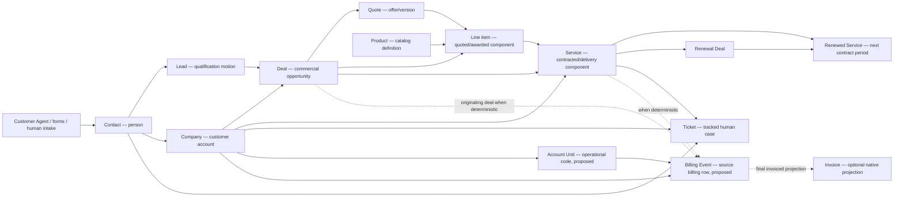

# ANAM RevOps Data Model and Object Synergies V1

> **Owner:** Efeonce delivery for client ANAM
> **Portal:** HubSpot `19893546`
> **Status:** living canonical current-state model
> **Validated:** 2026-07-16
> **Boundary:** this models ANAM's HubSpot portal; it is not a Greenhouse product data model or Efeonce CRM dataset

## Purpose

Preserve the mental model of how ANAM's CRM objects cooperate so future implementation does not recreate facts, confuse grains or build reports over the wrong object. This document owns the current object map. Dated discovery and change-set documents retain evidence and execution details; when they conflict with this current-state map, verify live runtime and update this document.

## System map

The arrows express collaboration, not automatic copying. Every object keeps its own grain and source of truth.

## Object registry

| Object | One record represents | Owns | Must not own | Current state |
|---|---|---|---|---|
| Contact | One person/contactable identity | Personal contact data, consent, communication context and relationship roles through associations | Company legal identity, contract value or billing rows | Native and active |
| Lead | One qualification motion for a person/account | Qualification status, disqualification and handoff into a commercial opportunity | Contract, Service delivery or support case | Native and active |
| Company | One customer/account organization | Durable account identity, legal/HQ facts, sector and parent-child account structure | Repeated service components, invoice rows or Contact RUT as legal truth | Native and active; duplicate ANAM records remain out of scope |
| Deal | One commercial opportunity/motion | Pipeline stage, commercial owner, income type, current opportunity value and originating commercial context | Delivery lifecycle, recurring retention outcome or repeated billing events | Native and active |
| Quote | One commercial offer/version | Quote number/version/status/expiry and quoted value | Awarded delivery truth | Native but historically under-adopted; prospective use only |
| Product | One reusable catalog definition | Stable service/catalog identity and commercial classification | A customer's purchase, contract or delivery instance | Native; 22 Products available read-only |
| Line item | One quoted or awarded component | Product reference, amount, TCV, ACV, ARR/MRR, currency, billing cadence and term evidence | Operational activation or customer identity | Native; source grain for proposed Service after award |
| Service | One awarded contracted/delivery component | Contract identity, Company/Deal lineage, TCV/ARR projections, dates, owner, lifecycle, delivery status and renewal facts | Opportunity qualification, raw billing rows or AI-inferred truth | Native; dedicated ANAM group + 10 properties live; one sample-like record only |
| Ticket | One case requiring tracked human work | Category/subtype, priority, owner, SLA, resolution and related Service context | Contract, quotation component or billing-ledger event | Native; taxonomy/associations not yet governed |
| Account Unit | One normalized ANAM/CeCo operational code under a Company | External unit identity and reviewed Company relationship | A duplicate Company unless business evidence proves a real account/branch | Proposed custom object; not live |
| Billing Event | One immutable source billing-list row/event | Source key, state, amount/currency, period and invoice/EDP/OC/HES/LIMS references | Aggregated Company balance or customer Ticket | Proposed custom object; not live |
| Invoice | One finalized invoice projection | Native finalized invoice facts when an event becomes invoiced | Pre-invoice, rejected, EDP or other billing workflow states | Native, zero records; optional downstream projection |
| Activities / conversations | One interaction | Attributed evidence for human follow-up | Deterministic health, renewal eligibility, money or lifecycle truth | Native evidence; smart summaries remain advisory only |

## Association contract

| From | To | Cardinality / role | Status and rule |
|---|---|---|---|
| Contact | Company | Many contacts may belong to one or more Companies | Use associations/role labels; do not copy role booleans onto Contact. |
| Contact / Company | Lead | Lead qualifies a person/account motion | Native association; qualification precedes Deal creation. |
| Company | Deal | Exactly one distinct primary Company for Service materialization | Deduplicate association types by Company object ID. Different labels pointing to one ID are not multiple customers. |
| Deal / Quote | Line item | One Deal/Quote may contain many components | Line item is the monetary/component grain; Product is its reusable definition. |
| Deal | Service | One Deal may originate many Services | Use originating-Deal role; renewal Deal is a separate role. Association labels are designed but not yet created. |
| Company | Service | Exactly one distinct Company for production Service | Required creation/readback gate. |
| Line item | Service | Logically one source line item per Service | HubSpot exposes no default association in this portal; preserve lineage with `anam_source_line_item_id` and deterministic external key. |
| Service | Service | Prior Service to successor renewed Service | Proposed paired renewal-lineage label; do not overwrite prior Service. |
| Service | Ticket | Zero to many cases | Required when the case concerns delivery/quality/billing of a specific Service. |
| Company | Account Unit | One Company to many operational units | Proposed; relationship requires reviewed identity reconciliation. |
| Account Unit | Billing Event | Exactly one Unit when normalized source code resolves | Proposed exact-code association. |
| Company | Billing Event | Exactly one after Unit-to-Company reconciliation | Proposed direct reporting association; avoids fragile multi-hop reports. |
| Service / originating Deal | Billing Event | Zero or one initially | Associate only with deterministic contract lineage; otherwise quarantine. |
| Billing Event | Invoice | Optional projection after finalized invoicing | Do not collapse non-invoiced source states into Invoice. |

## Fact ownership and projections

| Fact | Canonical owner | Allowed projection | Forbidden shortcut |
|---|---|---|---|
| Person identity/contactability | Contact | Role/association context on Company, Deal or Ticket | Treating Contact RUT as Company legal identity |
| Customer/account identity | Company | Company association on Deal, Service, Ticket and Billing Event | Copying Company name/RUT into every child as matching truth |
| Catalog identity | Product | Native `hs_product_id` on line item; reviewed family on Service | Using Product itself as the sold contract |
| Quoted value/version | Quote + quote line items | Governed snapshot only if native reporting cannot resolve accepted quote | Parallel Deal quote ID/amount fields by default |
| Awarded component economics | Line item | TCV and ARR copied with provenance into Service for operational reporting | One ambiguous “comparable awarded value” |
| Total contract value | Line item `hs_tcv` → Service `anam_awarded_contract_value` | Portfolio measures by original currency | `amount` as universal total or cross-currency sum |
| Annual recurring value | Line item `hs_arr` → Service `anam_annual_recurring_value` | Retention comparison for reviewed recurring/mixed Services | Inferring recurring revenue from blank frequency or renewal eligibility |
| Billing cadence | Line item native billing fields | Read-only evidence from originating component | Treating billing cadence as delivery frequency |
| Delivery dates/status | Service native fields | Expiry queues and operational panels | Inferring start/end from Deal close date |
| Renewal eligibility/status | Service reviewed properties | Renewal queue and cohort membership | Product-name, cadence or AI inference |
| Support/quality outcome | Ticket | Loyalty evidence associated to Company/Service | Storing cases as Deal notes or Billing Events |
| Billing execution | Billing Event | Aggregated reporting and optional finalized Invoice projection | Repeated billing rows flattened into Company/Deal properties |
| Relationship/risk evidence | Activities, conversations and Tickets | Human-reviewed Loyalty queue; optional attributed smart summary | AI-generated red/amber/green truth or automatic churn |

## Synergy by operating flow

### Demand to opportunity

Customer Agent, form or human intake resolves/deduplicates Contact and Company, then creates or updates native Lead. A qualified Lead creates or links a Deal once. Informational conversations need no Ticket; a required human case uses Ticket.

### Quote to award

Deal owns the commercial motion. Quote owns the offer/version. Product defines what can be sold; line item records what this Deal actually quoted/awarded. Reports must not substitute Product records for sold components.

### Award to Service

An exact Closed Won Deal line item can propose one Service when Company, Product, monetary provenance and deterministic IDs pass the award gate. The Service starts in `New`. Human review owns dates, revenue model, renewal facts, owner and operational activation. `anam_service_field_readiness` exposes same-record completeness; Company/Deal association cardinality remains a separate gate.

### Service to renewal and Retention

An expiring eligible Service enters a review queue and may create/link a renewal Deal. A won renewal creates a successor Service linked to the prior Service. Retention compares prior and successor ARR only for a complete reviewed recurring/mixed cohort. Expansion, stable, contraction and churn are derived outcomes, not Deal income types.

### Service to support and Loyalty

Tickets and attributed activities add service-experience evidence around Company + active Service. Loyalty prioritizes preventive human actions; it does not replace Retention economics. Smart properties may summarize cited evidence on supported objects but cannot set health, lifecycle or renewal truth.

### Service to billing

The source billing row becomes Billing Event, first linked by exact Account Unit code and reviewed Company identity. Service and originating Deal attach only when deterministic lineage exists. This permits sold TCV/ARR, contracted Service and billable/invoiced actuals to reconcile without copying billing rows into Deal or Company.

## Reporting projections

| Panel | Primary object/grain | Supporting objects | What it must not do |
|---|---|---|---|
| Data Quality | Eligible records per object | Associations and readiness properties | Hide missing denominators behind percentages |
| Growth | Deal + line items | Company, Product, owner | Claim delivery, invoicing or Retention outcomes |
| Service Portfolio | Service | Company, originating Deal/line item | Include sample/quarantined Services or mix currencies |
| Expiry/Renewal | Active eligible Service | Company, owner, renewal Deal | Use Deal close date as contract end |
| Retention | Prior/successor Service cohort | Renewal Deal, Company | Compute GRR/NRR from Deal labels alone |
| Loyalty | Company + active Service | Tickets, activities, conversations | Invent synthetic deterministic health |
| Billing execution | Billing Event | Account Unit, Company, Service, Deal | Use mixed currencies or unmatched rows as trusted totals |
| Operations | Ticket | Company, Contact, Service | Treat billing ledger rows as Tickets |

## Current implementation state

| Capability | State |
|---|---|
| Product/line-item identity | Sufficient for current Service projection; full catalog cleanup deferred |
| Service schema | Live: group `anam_service_contract` / `Contrato y renovación ANAM`, nine scalar + one calculated property |
| Calculated readiness | Live and propagated; sample-like Service resolves to `incomplete_core` |
| Forward award simulation | Five recent rows passed deterministic award projection; all failed activation; no Services created |
| Production Service cohort | Not available; one sample-like record only |
| Historical Service migration | `NO-GO` |
| Renewal association labels/workflow | Designed, not executed |
| Ticket taxonomy/SLA | Proposed, not executed |
| Account Unit / Billing Event | Proposed and gated; not live |
| Final Portfolio/Retention/Loyalty panels | Blocked by real governed Service coverage |

## Change discipline

When an object/property/association changes:

1. update this object registry, association contract and fact-ownership table;
2. update the object-specific change set with exact payload/readback;
3. update panel readiness if a consumer becomes enabled or invalid;
4. update both `hubspot-as-a-service` skill mirrors when the lesson is reusable;
5. record runtime state in `Handoff.md` and `changelog.md`;
6. never rewrite a source of truth merely to satisfy a report.

The next model delta must document the first real forward Service payload, its associations and resulting readiness before any workflow or dashboard publication.
