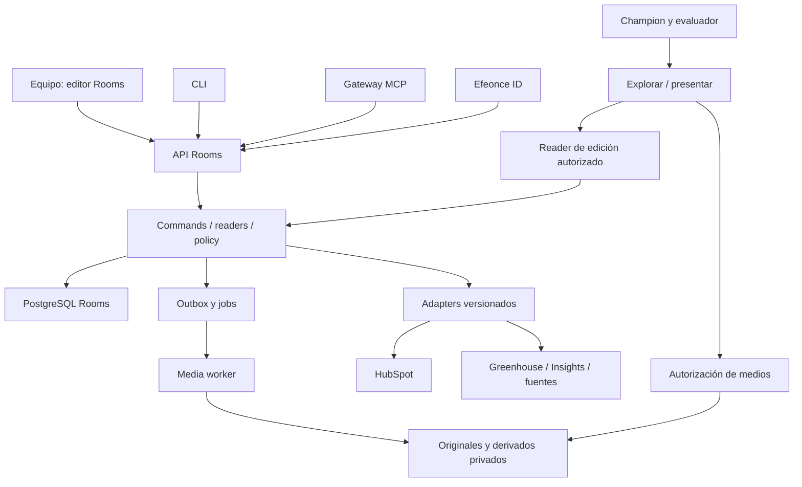

# Efeonce Rooms — arquitectura V1

Fecha: 2026-10-07. **Proposed; go final y build pendientes.** Dueño: Platform/Product. [ADR](EFEONCE_ROOMS_PRODUCT_AND_PLATFORM_DECISION_V1.md).

## 1. Topología y stack propuestos

Destino de producto: `rooms.efeonce.org`. Candidato de repo: `efeonce-rooms`, aún sin crear. Documentación canónica en Greenhouse. Una app con módulos y un worker de medios; no se requieren microservicios por entidad.

| Unidad | Tecnología propuesta | Responsabilidad |
|---|---|---|
| Web y API | Next.js App Router, React, TypeScript, Node.js | Autoría, SSR autorizado de comprador, handlers API; rutas/bundles de audiencia separados de admin |
| Dominio | TypeScript sin dependencia de React/Next | Commands, readers, políticas, revisiones, validación y auditoría |
| Contratos | Schemas runtime + JSON/OpenAPI versionados | Operaciones, payloads, proyecciones, SDK/CLI y MCP; sin compartir instancias entre versiones incompatibles |
| Visual | Design system La órbita (`efeonce-graphic-line`), distribuido por AXIS + adapter Tailwind propio | Bricolage editorial/Poppins funcional; tokens de identidad, componentes e iconografía canónicos; versiones exactas y arte cliente aislado |
| Motion | CSS/WAAPI y Motion para transiciones React; GSAP solo si una coreografía específica lo justifica | Un dueño por propiedad animada; adaptadores Rooms, no imports a wrappers privados de Greenhouse |
| Persistencia | PostgreSQL | Datos Rooms, outbox, jobs y auditoría; credencial/migrations propias |
| Storage | Google Cloud Storage privado | Originales inmutables y derivados, cuarentena y limpieza de cargas incompletas |
| Medios | Cloud Run Job, FFmpeg/ffprobe y Sharp | Inspección, normalización de previews, transcodificación, posters y peaks |
| Reproducción | HTMLMediaElement; hls.js; WaveSurfer con peaks precalculados | MP4/HLS, audio, captions y buffers; carga de librerías bajo demanda |
| Auth y agentes | Efeonce ID; CLI HTTP TypeScript; provider de Efeonce MCP | Identidad, delegación, operaciones y auditoría comunes |
| Observabilidad | Logs redactados, métricas y trazas por correlationId | API → upload → job → edition → reproducción, sin tokens ni notas en telemetría |

Despliegue candidato de app/API: Vercel; job y storage en GCP. Región, capacidad, conexión PostgreSQL, pins, bucket, IAM y coste se cierran antes del rollout. Independencia de dominio no exige una instancia Cloud SQL nueva. Reutilizar hosting gestionado nunca concede acceso a esquemas de otras plataformas.

## 2. Módulos y límites

- **Spaces:** contexto, miembros, vinculación comercial y archivo.
- **Content:** inventario, piezas/variantes, método, evidencia y tema validado.
- **Editions:** revisión, snapshot, publicación y referencias inmutables.
- **Access:** invitaciones, grants, sesiones externas y autorización de bytes/acciones.
- **Presentation:** tours y notas persistidas; estado efímero de sesión separado.
- **Collaboration:** preguntas, respuestas y pasos simples ligados a edición.
- **Media:** uploads, assets y derivados; nunca lógica de precios o pipeline.
- **Integrations:** adaptadores CRM/Greenhouse/fuentes, estados y reconciliación.

La autoridad de diseño es [efeonce-graphic-line](../../../.codex/skills/efeonce-graphic-line/SKILL.md), incluida toda la UI de administración y presentación. El adapter mapea `efeonceGraphicLine.type/color/motion`, `axisColorSystem`/`axisOrbitRamp` y componentes de marca; no hereda `axisTypography` Poppins/Geist como identidad. Tokens geométricos/de interacción compatibles pueden reutilizarse sin sustituir La órbita.

El renderer compartido vive en Rooms para preview/explorar/presentar. AXIS posee únicamente valores, recursos y composiciones realmente portables. No exportar el modelo de permisos ni el dominio comercial a AXIS.

## 3. Pipeline de medios

1. Registrar manifest; asignar identidad y destino permitido por asset.
2. Emitir sesión de transferencia limitada por tamaño/tipo/owner; cliente sube directamente.
3. Completar: inspeccionar bytes reales, checksum, generación, dimensiones/duración, ownership y límites. El nombre/extensión no acredita formato.
4. Cuarentena/validación de archivos; no servir HTML/SVG arbitrarios como contenido ejecutable. SVG permitido solo mediante sanitización/rasterización controlada. URLs externas requieren allowlist/validación SSRF y límites.
5. Encolar derivados con clave `(assetVersion, profileVersion)`; lease/fencing, retries acotados, cancelación y diagnóstico redactado.
6. Marcar ready solo cuando exista el conjunto exigido; fallos por archivo permiten reintento sin duplicar originales.
7. Emitir edición desde versiones ready autorizadas. Incidencias y exclusiones deben ser explícitas, nunca invisibles.

Imágenes: original preservado, preview de visualización, miniaturas y tiles cuando tamaño lo justifique; respetar alpha, orientación y perfil. Video: poster, MP4 faststart y captions; HLS cuando duración/peso lo justifiquen. Audio: preview y peaks; mezcla/stems solo si existen. PDF: original intacto y páginas rasterizadas para inspección; extracción de páginas no recupera audio, video o capas editables.

No estirar ni recortar una pieza para ajustarla a un contenedor. Variantes 9:16/4:5/1,91:1/16:9 son activos editoriales vinculados; renditions son derivados técnicos del mismo activo. Originales descargables dependen del grant.

El PDF de la propuesta existente se adjunta desde V1. Exportar toda la narrativa interactiva a PDF es capacidad posterior con contrato propio; jamás se afirma equivalencia entre audio/video y una exportación estática. El Artifact Worker existente es candidato reutilizable, no dependencia disponible por inferencia.

## 4. Edición, cache y disponibilidad

Una edición fija contenido, orden, variantes, assets, tours y versión de contrato de render. Conversaciones y acciones quedan fuera del snapshot pero referencian su id. La sala puede señalar que hay una edición nueva; quien está presentando decide cuándo cambiar, sin sustituir bytes a mitad de reunión.

Las vistas privadas requieren cache segmentada o no-store según recurso; los grants nunca se incorporan a canonical/OG/logs. Persistir versión del contrato y fallback de render evita depender indefinidamente de un único bundle histórico. Restore debe recuperar metadatos y generaciones de assets, no solo filas.

CRM es integración asíncrona: una caída no bloquea una edición disponible y autorizada. Una caída de identidad/autorización no debe conceder acceso nuevo. Sesiones ya emitidas se rigen por expiración y revocación definidas; no cachear decisiones de acceso indefinidamente.

## 5. Entrega de medios y revocación

Base candidata: tickets cortos para bytes privados. Revocar niega nuevos tickets; los existentes pueden seguir válidos hasta su TTL. Una descarga admitida o bytes guardados no se recuperan. Antes de producción fijar TTL y medir el margen efectivo de revocación; no llamarlo instantáneo.

Si el caso requiere revalidación por Range/segmento, introducir gateway de streaming con backpressure y respuestas 200/206/416 verificadas. Nunca proxy de archivos grandes mediante arrayBuffer dentro del handler de UI. Límites de upload/download/CPU, concurrencia y egress por sala y organización.

## 6. Presentación

Una sesión fija editionId y tourId. La consola y la pantalla de audiencia reciben DTOs diferentes. BroadcastChannel coordina ventanas del mismo origen mediante sessionId, secuencia y ack; jamás transporta notas. La pantalla de audiencia informa escena aplicada, buffer y bloqueo de reproducción. Un command enviado no equivale a una reproducción iniciada.

No hay sincronización remota entre dispositivos en V1; requiere transporte y autoridad propios. Una ventana o pantalla compartida permite presentar sin ese sistema. El navegador puede bloquear sonido/fullscreen: preflight real, fallback visible y playback iniciado por gesto. Al perder la consola, la audiencia mantiene la escena y permite salida; no avanza sola.

## 7. Calidad, operación y coste

Metas de diseño, pendientes de medir: p75 LCP ≤2,5 s; INP ≤200 ms; inicio de preview ≤2 s en fixture/red publicados. Precarga limitada a escena actual y siguiente; no descargar todos los videos al abrir una sala. Decoración pausada fuera de foco y durante playback pesado.

QA: desktop 1440×900, pantalla 1920×1080, tablet 1024×768 y móvil 390×844; ratios arbitrarios, imágenes largas, transparencias, captions, teclado, zoom de texto, reduced motion y red degradada. Safari/iOS, Chrome/Android y desktop. Una captura legible es necesaria; no basta que el DOM no desborde.

Métricas: bytes y coste por sala/edición, cola, fallos, reintentos, tiempo de inicio, buffering, reproducción efectiva y expiraciones. Nunca usar tiempo con pestaña oculta como lectura comprobada. Métricas comerciales agregadas desde CRM tienen definición y ventana explícitas, sin causalidad inventada.

Operación previa al release: restore de DB + storage probado, rotación de credenciales, límites y alertas, limpieza de uploads, retención por artefacto/conversación, rollback compatible con ediciones y runbook. Coste = app + PG + GB-mes + egress + CPU/minutos + observabilidad; falta baseline para monto mensual.

## 8. Implementación posterior al go

1. Fijar contratos, dependencias y ficha de deploy; UI first fold para aceptación visual.
2. Backend/data: upload, medios, edición y acceso; API/CLI/MCP con transferencia y readback reales.
3. UI: autoría y experiencia sobre ese contrato, luego consola y evaluación.
4. Segundo cliente, resiliencia, accesibilidad, recuperación, coste y canary antes de entrega.

Tasks backend/data y UI separadas, con dependencias; no crear solo una task híbrida gigante. Ninguna está implementada por este dossier.
