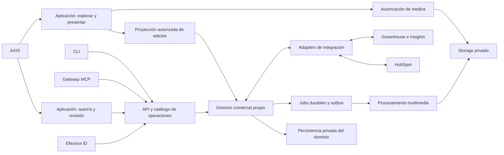

# Plataforma comercial — diseño de solución V1

> **Corrección visual 2026-10-07:** para Rooms rige La órbita (`efeonce-graphic-line`), Bricolage editorial/Poppins funcional y componentes canónicos distribuidos por AXIS. Este antecedente no gobierna la estética actual; [dirección vigente](../../ui/visual-directions/EFEONCE_ROOMS_VISUAL_DIRECTION_V1.md).

> **Antecedente histórico, sustituido para trabajo nuevo por el [dossier Efeonce Rooms](../rooms/README.md), 2026-10-07.** Nombre y destino ya acordados: Efeonce Rooms / `rooms.efeonce.org`. El diseño consolidado continúa Proposed hasta el go final; este texto conserva la evolución previa.

Fecha: 2026-10-07. Estado: **Proposed implementation design** bajo la [frontera aceptada](EFEONCE_SALES_ENABLEMENT_PLATFORM_DECISION_V1.md). Sin código, provisión, migraciones o rollout. Este documento sustituye las recomendaciones de placement del análisis Greenhouse/Think.

## 1. Resultado de la primera entrega

Una persona del equipo prepara una experiencia completa; el champion la comprende, ensaya y presenta sin ayuda; los evaluadores exploran el inventario autorizado y sus fundamentos; todos conservan referencia a la misma edición presentada. Un segundo cliente utiliza el sistema sin cambios de componentes ni datos de la primera marca.

La primera entrega incluye método, piezas estáticas arbitrarias, piezas largas, audio, video, PDF original, recorridos, consola de presentación y preguntas contextualizadas. Sika/POSIBLE es un posible caso de aceptación con material existente; no se rehace la propuesta descartada ni se inventan activos faltantes.

## 2. Experiencia y superficies

| Superficie | Trabajo de la persona | Comportamiento exigido |
|---|---|---|
| Espacios comerciales | Encontrar y continuar oportunidades | Estados de preparación/entrega separados de la etapa CRM; responsable, edición y pendientes visibles |
| Autoría | Importar, ordenar y explicar | Inventario completo, progreso por archivo, validaciones, piezas/variantes, método y criterios de evaluación |
| Revisión | Ver qué recibirá cada persona | Preview con el mismo renderer y permisos de audiencia; incidencias y cobertura explícitas |
| Explorar | Comprender y examinar | Entrada por concepto y mapa de contenido; enlaces profundos; acceso al PDF y todas las piezas autorizadas |
| Presentar | Conducir una reunión | Recorridos corto/completo, salto a detalle y retorno al punto previo, control de audio/video y fallback a una pantalla |
| Consola champion | Prepararse y sostener el relato | Notas compartidas autorizadas, siguiente escena y tiempo; separación real de notas internas de Efeonce |
| Evaluación | Resolver dudas y acordar próximos pasos | Preguntas sobre pieza, región o tiempo; vínculo a criterio y edición; responsable/fecha para acciones simples |

Flujo: crear espacio → asociar contexto → importar inventario → componer relato y recorridos → revisar → emitir edición → otorgar acceso → explorar/presentar → resolver preguntas → archivar o entregar referencia a operación.

Estados necesarios antes de diseñar pantallas: vacío, borrador, carga parcial, procesamiento, fallo recuperable, medios no compatibles, revisión pendiente, edición emitida, acceso expirado/revocado, nueva edición disponible y espacio archivado. Una nueva edición no cambia silenciosamente la que un evaluador tiene abierta.

### Inventario y fidelidad

- Un manifest de importación enumera cada archivo o lámina: incluido, pendiente, fallido o excluido explícitamente con motivo. La selección de un tour no elimina material del inventario.
- Un PDF importado conserva el original. Extraer páginas ayuda a visualizarlo; no recupera capas editables, videos o audio que no existan en los insumos.
- Cada adaptación es una variante editorial real. El visor no convierte 16:9 en 9:16 mediante recorte automático para fingir una adaptación.
- Zoom/pan, vista limpia/contextual, comparación, transparencia y lectura de piezas largas se habilitan según el asset. Capas o stems solo aparecen si fueron aportados.
- Racional y método se anclan a piezas/regiones/tiempos. El modo inmersivo permite ocultarlos y recuperarlos sin interrumpir el medio.
- El núcleo no depende de IA generativa. Agentes pueden preparar borradores y clasificar insumos por las mismas operaciones, conservando procedencia y revisión.

## 3. Arquitectura candidata

La aplicación y API comienzan como un monolito modular propio; no hace falta crear un microservicio por módulo. La exhibición usa bundles y DTOs separados de autoría. El procesamiento pesado tiene frontera de ejecución independiente. Repo, hosts y servicios físicos siguen siendo candidatos hasta su ficha de build/deploy/costo/rollback.

| Capa | Recomendación técnica | Motivo / validación pendiente |
|---|---|---|
| Web de operación y comprador | TypeScript + React + Next.js App Router | Sesiones, edición y lectura SSR en una aplicación propia; client components para el escenario. No importar el shell Vuexy de Greenhouse |
| Sistema visual | AXIS con adapter propio y tokens de marca | Una identidad del producto; temas de cada propuesta por datos. Tailwind como candidato de styling; pins/exports se verifican al implementar |
| API y dominio | Contratos JSON versionados, schemas runtime, readers/commands TypeScript; handlers delgados | Catálogo único de operación; ni reglas privadas en componentes ni Server Actions como única entrada |
| Datos | PostgreSQL con migrations y credencial exclusivas del dominio | Aislamiento lógico y ownership propios. Reutilizar capacidad gestionada solo con revisión de acceso/coste; no obliga otra instancia ni permite tablas ajenas |
| Originales y derivados | GCS privado, carga reanudable directa, versiones inmutables | API entrega ticket, cliente transfiere, servidor confirma hash/tamaño/generación y pertenencia |
| Procesamiento | Job de medios aislado, FFmpeg/ffprobe + Sharp | Derivados idempotentes por original/perfil; leases, retries, cancelación y límites. Frontera concreta aún por medir |
| Imágenes | Previews y original autorizado; tiles para piezas grandes cuando se justifique | Respetar ratio, transparencia, orientación y color; carga progresiva |
| Video | HTMLMediaElement, MP4 faststart; HLS y hls.js cuando el perfil lo necesite | Posters, captions, buffer visible y reproducción móvil probada. Inspección por frame exacto exige derivado explícito |
| Audio | HTMLAudioElement y waveform con peaks precalculados; Web Audio solo para stems provistos | Inicio rápido sin descargar/decodificar siempre el original completo |
| Presentación | Renderer React único + coordinador de reproducción | Preview, explorar y presentar comparten composición, no permisos. BroadcastChannel para dos ventanas del mismo origen |
| PDF | Original adjunto en la primera entrega; export de narrativa como job posterior | Reuso del Artifact Worker solo mediante contrato de consumidor y acceso definidos, no invocación privilegiada informal |
| Identidad / agentes | Efeonce ID; API propia; provider federado en gateway MCP | Autoridad por actor/recurso; sesiones del producto y permisos externos diferenciados |

Next.js documenta la composición server/client y los handlers HTTP; la recomendación de usarlo aquí es una decisión de diseño por el ciclo de la aplicación, no una exigencia del framework. [Server/client](https://nextjs.org/docs/app/getting-started/server-and-client-components), [Route Handlers](https://nextjs.org/docs/app/getting-started/route-handlers), consultados el 2026-10-07. Las bibliotecas de medios y límites de infraestructura tienen evidencia en el [análisis previo §15](../../think/creative-proposal-experience-stack-analysis-2026-10-07.md#15-fuentes-verificadas); no se fijan versiones por memoria.

## 4. Modelo de dominio propuesto

Nombres conceptuales, todavía no tablas ni endpoints publicados.

| Entidad | Contrato |
|---|---|
| CommercialSpace | Organización operadora, destinatario, responsable, estado local y vínculos externos opcionales |
| Experience / DraftRevision | Narrativa y revisión editable con control de concurrencia |
| Piece / Variant | Unidad creativa y adaptación editorial, independiente del archivo derivado |
| AssetVersion / Rendition | Original con procedencia/hash y derivados técnicos reproducibles |
| MethodStep / EvaluationCriterion / Annotation | Método, criterio y evidencia vinculados a pieza/región/tiempo |
| Tour / Scene | Selección y secuencia; convive con la biblioteca completa |
| Edition | Snapshot inmutable de narrativa, recorridos y versiones de medios; digest y versión de renderer/contrato |
| Participant / AccessGrant | Actor autorizado, espacio, edición, rol, acciones y vencimiento |
| PresenterNotes | Clasificación interna/compartida; nunca se serializa por defecto al lector |
| Question / Response / NextStep | Colaboración vinculada a edición/evidencia; permisos de lectura y escritura explícitos |
| Job / Attempt / OutboxEvent | Trabajo durable, intentos y entrega a integraciones |

La autoridad del pipeline permanece en HubSpot; el estado del espacio describe preparación y entrega. Una aprobación de la experiencia tampoco equivale a aceptación contractual, adjudicación ni autorización de envío a Wherex.

## 5. API parity verificable

Un catálogo del provider declara por operación: esquema de entrada/salida, permiso, efecto, idempotencia, errores, control de revisión, job si aplica y exposición UI/CLI/MCP. OpenAPI, SDK/CLI y tools se derivan o verifican contra él. La mutación y su auditoría ocurren una sola vez en el command.

| Familia de operaciones | UI | CLI/API | MCP | Prueba de equivalencia |
|---|---|---|---|---|
| Crear/leer/editar/archivar espacio y vínculos | Sí | Sí | Sí | Misma revisión visible entre canales |
| Iniciar/completar/reintentar importación y consultar jobs | Sí | Sí | Sí, con transporte disponible | Mismos bytes, checksum y resultado; transferencia remota demostrada |
| Componer piezas, método, anotaciones, tours y notas | Sí | Sí | Sí | Conflicto de revisión consistente; sin notas privadas en proyecciones externas |
| Revisar/emitir/consultar ediciones | Sí | Sí | Sí | Igual validación y autoridad; edición inmutable |
| Otorgar/revocar acceso y descargas | Sí | Sí | Sí | Alcance/expiración iguales; ninguna escalación por canal |
| Preguntar/responder/cerrar acción | Sí | Sí | Sí según rol | Vínculo a edición y reglas de visibilidad iguales |
| Exportar contenido y consultar actividad autorizada | Sí | Sí | Sí | Mismo alcance de datos y procedencia |

El agente actúa con la autoridad delegada de la persona. Borradores reversibles no requieren una confirmación redundante por usar MCP; compartir, aprobar y acciones destructivas obedecen las políticas explícitas del command y la autorización existente. Ningún booleano suministrado por el agente sustituye evidencia de autoridad.

Un MCP remoto no lee rutas del ordenador. Se necesita transferencia por CLI/bridge local o adjunto/fuente autorizada compatible con el cliente. El canary debe incluir ese paso y un readback; la tool de metadatos sola no prueba carga por MCP. Reintentar con la misma clave y mismo contenido no duplica; clave igual con contenido distinto se rechaza.

## 6. Acceso, publicación y continuidad

- Acceso propio para empleados y grants acotados para champion/evaluador. Un invitado no obtiene acceso interno de Greenhouse por abrir la propuesta.
- Propuesta privada: sin indexación ni grants en analytics, metadata o logs; ninguna nota interna en HTML, JSON, export ni mensaje entre ventanas de audiencia.
- Ticket corto de medios como base candidata: revocar impide nuevos tickets; los ya emitidos pueden seguir válidos hasta expirar. No prometer revocación instantánea ni recuperación de archivos descargados. Acceso estricto por segmento/Range exige gateway y benchmark propio.
- Una edición congela medios importados autorizadamente. Un embed remoto puede cambiar o ser revocado; debe marcarse como referencia externa y degradar de forma explícita. No copiar silenciosamente material privado de Insights para eludir su acceso.
- La consola privada envía únicamente estado de escena/reproducción a la pantalla de audiencia, con sesión/secuencia/ack. Popups o fullscreen rechazados tienen fallback; el control desde otro dispositivo queda para transporte autenticado posterior.
- Al perder red se explica qué sigue disponible; no se ofrece offline completo sin contrato de caché/expiración. El fallo de CRM no debe impedir leer una edición local autorizada ya publicada. El fallo de autorización no concede acceso por defecto.

## 7. Integraciones y portabilidad

Primero, vinculación explícita con identificadores verificados; después, sincronización limitada y observable. HubSpot recibe solo eventos/propiedades acordadas: una reproducción no se convierte automáticamente en intención de compra o etapa comercial. Greenhouse recibe referencias/estados autorizados y un handoff de operación, no una copia del dominio.

Cada mensaje declara origen, id, versión, correlación y recurso. Consumidores deduplican y registran fallos; reconcilian sin loops ni pérdida silenciosa. Preguntas y notas conservan su clasificación de acceso al exportar o integrar. No se envían mensajes ni se crean contactos automáticamente por haber compartido una sala.

La exportación debe conservar manifest versionado, inventario, hashes, referencias, narrativa, tours y contenido autorizado, permitiendo reimportación. Las credenciales y grants se excluyen. Esto evita que el nuevo producto encierre el material de la agencia.

## 8. Secuencia de construcción y aceptación

Unidades candidatas para formalizar como tasks dependientes; estos identificadores U1–U6 no son IDs del registry ni autorización de despliegue.

| Unidad | Entrega concreta | Aceptación |
|---|---|---|
| U1 — contratos y experiencia | Catálogo de operaciones, permisos, schemas de ejemplo, wireframes/flujo/motion y ficha de runtime | Una oportunidad completa recorrible; ownership inequívoco; operaciones y estados sin huecos; naming funcional suficiente para prototipo |
| U2 — dominio e ingesta | Persistencia, import reanudable, jobs, ediciones y grants; API/CLI/provider MCP | Imagen + audio + video + PDF por los tres canales, transferencia real, readback, concurrencia y aislamiento |
| U3 — autoría y exploración | UI sobre U2, renderer compartido, inventario completo, método, comparación y medios | Importación completa reconciliada, todos los formatos comprometidos y segundo cliente sin cambiar código |
| U4 — champion | Tours, ensayo, consola privada, pantalla de audiencia y recuperación | Champion ajeno a producción presenta, abre detalle y retoma sin ayuda; notas internas ausentes de audiencia |
| U5 — evaluación e integración | Preguntas/contexto, próximos pasos simples, referencias CRM y proyección a Greenhouse | Dos evaluadores operan una edición; otra edición no mueve sus anclas; retry/sync no duplica ni cambia etapas sin autoridad |
| U6 — operación y entrega | Costes medidos, límites, recuperación, documentación y canary | Aislamiento, revocación, fallos de medios, restore y presupuesto probados; aceptación visual y de operador |

Backend/data y UI se planifican como tasks separadas con dependencias. U2 es un hito técnico; la primera entrega del producto requiere U3–U6. No se declara operativa una capacidad porque haya endpoints registrados.

## 9. Calidad y decisiones aún por concretar

- Rendimiento: metas propuestas p75 LCP ≤2,5 s, INP ≤200 ms e inicio de medio ≤2 s para fixtures y red declarados; no son SLAs ni resultados medidos. Cargar siguientes escenas de forma acotada, no todo el inventario.
- Pruebas: Safari/iOS, Chrome/Android y desktop; teclado, reduced motion, ratios mixtos, grandes imágenes, audio/video con captions, dos ventanas, pérdida de red y accesos cruzados. Capturas inspeccionadas y presentación real por champion.
- Operación: logs redactados y correlación import/job/edition; cola, errores, bytes, buffering, costes y archivos huérfanos. Backups/restore y retención concretos antes de producción.
- Métricas de valor: tiempo de preparación, cobertura del inventario, autonomía del champion y dudas resueltas. Aperturas/reproducciones son actividad, no prueba causal de adjudicación.
- Costes: storage + egress + procesamiento + base de datos + app + observabilidad. Sin volumen observado, no hay cifra mensual defendible. Medir dos paquetes reales antes de fijar cuotas.
- Pendientes de U1: nombre y host finales; ubicación física del repo; pins; presupuesto y perfiles; identidad del invitado y alcance de forwarding; política de descarga/retención; garantía concreta de revocación; contrato de PDF worker; requisitos de cliente MCP para transferencia.

Estas decisiones no bloquean definir la experiencia ni contratos de ejemplo. Deben quedar resueltas en su unidad antes de implementar o publicar el comportamiento dependiente; no se convierten en defaults ocultos.
