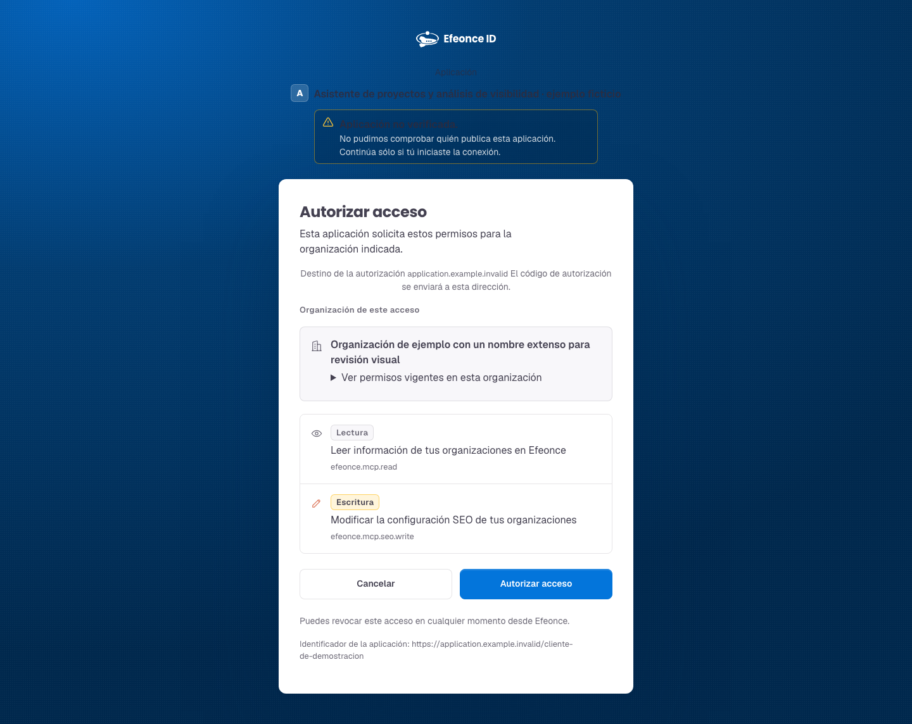
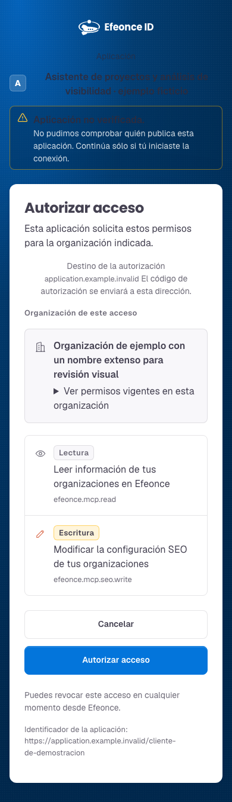

# TASK-1837 — evidencia de rollout: entrega gobernada de la invitación externa (migración, smoke y verificación viva en staging)

> **Tipo de documento:** Evidencia de rollout / auditoría de verificación
> **Fecha:** 2026-09-06
> **Task dueña:** `TASK-1837` (EPIC-044 U12) — `docs/tasks/in-progress/TASK-1837-efeonce-id-external-invitation-delivery-delegated-authority.md`
> **Estado que acredita:** `verificado end-to-end en staging 2026-09-06 (flags ON en staging); producción pendiente de promoción a main`

## Alcance y autorización

Checkout compartido `develop`. Commits de la task: `5518d868e` (Slice 1 entrega), `6cb8042a8` (Slice 2 ciclo
de vida), `c9371b28f` (Slice 3 revelación + capabilities), `4f03cdff6` (Slice 4 autoridad delegada),
`189148c6e` (Slice 5a host del `redirect_uri` en el consentimiento). Eran locales al momento de la migración y
del smoke; la verificación viva de la sección siguiente corrió sobre el deploy de staging `greenhouse-6u3f57s4p`,
que ya los sirve. El código sigue fuera de `main`.

Este documento registra lo que SÍ se ejecutó contra la instancia PostgreSQL compartida (dev/staging/prod),
contra el smoke live y, en la sección siguiente, contra **staging desplegado** con los dos flags encendidos, y
delimita lo que NO se verificó. Acredita correo real enviado y recibido en staging; no acredita producción y no
declara la task `complete`. Los tokens de invitación, verificadores de magic link, cookies de sesión, URLs con
token y correos de personas reales nunca se registran acá; el smoke y la verificación viva usan exclusivamente la
organización fixture y una casilla controlada del operador (siempre enmascarada).

## Verificación viva end-to-end en staging (2026-09-06 03:26–03:40Z)

Reemplaza el límite «sin binding externo / ningún correo real» de las secciones anteriores: se creó un binding
externo de prueba sobre la organización fixture y se ejercitó el recorrido completo contra staging desplegado,
con timestamps reales. Todo lo que sigue se observó, no se infirió.

**Setup.** Flags `EXTERNAL_INVITATION_SYSTEM_DELIVERY_ENABLED=true` y
`EXTERNAL_INVITATION_DELEGATED_AUTHORITY_ENABLED=true` en **Vercel staging** (`vercel env add … staging`,
~03:20Z) + redeploy `greenhouse-6u3f57s4p` READY. Production: NOT SET (el código de TASK-1837 no está en `main`;
requiere release). Binding externo real de prueba `xob-2781da78-ebb1-44c3-b8ce-758ce1da45a5` = organización
fixture `ZZZ Q2C Smoke Fixture` (`org-ddd962ae…`) → environment `efeonce-auth` (emisor real
`https://auth.efeonce.org`), `population='external'`, grant `globe.producer.fleet.read` (`xcg-0510ee25…`); creado
por la ruta admin en staging (actor `user-agent-e2e-001`). Persona de prueba: una plus-address del correo laboral
del operador (casilla Outlook real y controlada; en adelante `j***@efeoncepro.com`), que nace como
`external_contact` NUEVO porque el `canonical_email` no coincide con la identidad interna. **No es un cliente
real**: es una persona sintética en una organización fixture, revocada al cierre (paso 10).

1. **Emisión sin token en la respuesta.** `POST …/bindings/xob-2781da78…/invitations` con
   `{ email, designatedAdmin: true }` → **201**, `delivery.mode='system'`, `delivery.status='sent'`,
   `attempts=1`, `recipientMasked='j***@efeoncepro.com'`, **sin campo `token`** (`xmi-dbfc3cbe…`, 03:32:55Z).
2. **Correo real recibido en Outlook** (03:33:30Z): asunto «Te invitaron a Efeonce — enlace válido 72 h»,
   remitente `Efeonce <greenhouse@efeoncepro.com>`, cuerpo con la organización, la vigencia de 72 h, el host
   `auth.efeonce.org` y CTA a `https://auth.efeonce.org/i/<token>`. En `email_deliveries`: `status=sent`,
   `provider_status=delivered` (webhook de Resend), `source_entity=external_member_invitations`,
   `source_event_id=xmi-dbfc3cbe…` — la correlación durable funciona ✔.
3. **Aceptación en el emisor.** `GET /i/<token>` → 200 (página intermedia; el GET no consume).
   `POST /auth/invitations/accept` same-origin → **202 «Revisa tu correo»**. En PG: invitación `linked`
   (03:34:35Z); `identity_profiles` nueva de tipo `external_contact`
   (`identity-external-idp-efeonce-auth-subject-lim1vrb9…`); source link `external_idp:efeonce-auth` activo
   (subject opaco de 32 chars); `designated_admin_profile_id` fijado; audit `invitation_linked` (actor
   `auth-server`). Nota: el auth-server corre `main` (sin el guard/audit `designated_admin_assigned` de
   develop), por eso el audit del binding NO tiene `designated_admin_assigned`; el guard sí está probado en el
   smoke local (sección anterior).
4. **Magic link real y sesión.** Correo en Outlook 03:35:04Z («Confirma tu acceso a Efeonce — enlace válido
   15 min»; `email_deliveries` `auth_server_magic_link` delivered). `GET /m/<id>.<verifier>` → 200 (no consume);
   `POST /auth/magic-link/consume` → **200 «Listo, ya entraste»** + cookie `__Host-efeonce_auth` (HttpOnly,
   Secure, SameSite=Lax, 12 h). `GET /auth/session` con la cookie → **200**
   `{ status: 'authenticated', environmentId: 'efeonce-auth', authLevel: 'primary', amr: ['magic_link'],
   authTime 03:36:48Z }`. Reusar el magic link → **400** (un solo uso) ✔.
5. **Rebote forzado y señal encendida.** Invitación a `bounced@resend.dev` (`xmi-25558a60…`, 03:32:58Z) →
   webhook de Resend `provider_status=bounced` → outbox `email_delivery.bounced` → proyección
   `external_invitation_delivery_bounced` → `delivery_status='bounced'`,
   `last_delivery_error_code='bounce:Permanent'`, audit `invitation_delivery_bounced` (actor
   `ops-worker:resend-webhook`) + evento `identity.external_invitation.delivery_failed`. **Señal
   `identity.external_invitation.undelivered` OBSERVADA encendiéndose: `ok` → `warning`** («1 invitaciones
   externas abiertas con correo fallido o rebotado»). Caveat honesto: el drenaje corrió LOCALMENTE con
   `processReactiveEvents({ domain: 'notifications', handlerKeys: […] })` acotado al handler
   `external_invitation_delivery_bounced:email_delivery.bounced`, porque el ops-worker corre `main` (sin la
   proyección) tras el release de PR #226; el worker la tendrá con el próximo deploy de develop/promoción.
6. **Revelación gobernada en staging.** `POST …/invitations/xmi-25558a60…/reveal` con `{ reason }` (≥10
   chars) → **201**, invitación nueva `xmi-dfb97bc5…`, `expiresAt` = +1 h, `acceptanceUrl` con la forma
   `https://auth.efeonce.org/i/…`; señal `identity.external_invitation.token_revealed` en `warning` (2 en
   24 h: smoke local + staging). El token no se registra.
7. **Reenvío en staging.** Invitación a `delivered@resend.dev` (`xmi-b2765de1…`) → `POST …/resend` → **201**,
   nueva `xmi-05cac708…`, `deliveryAttempts=2` (heredado), `delivery.status='sent'`; la anterior queda
   `revoked` con `revoke_reason='resent'` ✔.
8. **Lane delegada en staging con el consumer del gateway.** Token del consumer
   `efeonce-mcp-gateway-greenhouse-token` (`externalScopeType=other&externalScopeId=efeonce-mcp-gateway`) +
   `environment=efeonce-auth` + `subject` de la persona del paso 3:
   - `GET …/identity/invitations?…&bindingId=xob-2781da78…` → **200**, `count 5`, sólo el binding propio;
   - `bindingId` ajeno (`xob-139e…`, el interno de TASK-1836) → **403** `forbidden`;
   - `POST` con `designatedAdmin: true` → **422** `invalid_request` (auto-elevación);
   - `POST` invitación a una segunda plus-address controlada → **201**,
     `issuedBy='external-admin:identity-external-idp-…'`, `designatedAdmin: false`, `delivery.status='sent'`,
     sin token; **correo real recibido en Outlook 03:36:50Z**.
   Pendiente: federar esta lane como tool MCP en `efeonce-mcp` (el gateway verifica el JWT de la persona y
   llama exactamente así).
9. **Consentimiento con host del `redirect_uri`.** Capturas del dev-UI (`renderConsentPage` con
   `redirectHost`): «Destino de la autorización application.example.invalid — El código de autorización se
   enviará a esta dirección.» (tratamiento visual = `TASK-1835`). No verificado en `auth.efeonce.org` porque
   el emisor corre `main`.

   

   

10. **Cierre e higiene.** `POST /api/admin/identity/external-access/revoke` con `{ scope: 'binding' }` →
    `changed: true`, `grantsVersion` 3, grant + miembro + 4 invitaciones revocadas. `GET /auth/session` con la
    cookie todavía viva → **401** (la sesión muere con el source link) ✔. La persona sintética queda como
    `external_contact` con source link inactivo (sin membership). Dev-UI temporal apagado; scripts temporales
    borrados.

## Migración aplicada a la instancia compartida

Comando: `pnpm pg:connect:migrate`.

- `20260906004450748_task-1837-external-invitation-delivery-lifecycle` — `run_on 2026-09-06T04:27:58Z`.
- `src/types/db.d.ts` regenerado: +4 campos en `external_member_invitations`.

Verificación posterior por `information_schema` / `pg_constraint` / `pg_indexes` (resumen):

| Objeto | Resultado |
| --- | --- |
| `external_member_invitations.delivery_status` | presente, `NOT NULL DEFAULT 'not_attempted'` |
| `external_member_invitations.delivery_attempts` | presente, `NOT NULL DEFAULT 0` |
| `external_member_invitations.last_delivery_at` | presente (`TIMESTAMPTZ`, nullable) |
| `external_member_invitations.last_delivery_error_code` | presente (`TEXT`, nullable) |
| CHECK `external_member_invitations_delivery_status_valid` | presente (5 valores) |
| CHECK `external_member_invitations_delivery_attempts_nonnegative` | presente |
| CHECK `external_identity_audit_log_event_type_valid` | ampliado con los 6 tipos nuevos (`invitation_resent`, `invitation_token_revealed`, `invitation_delivery_failed`, `invitation_delivery_bounced`, `designated_admin_assigned`, `designated_admin_cleared`) |
| Índice `external_member_invitations_open_delivery_idx` | presente (parcial, `status='issued'`) |
| `capabilities_registry` | `identity.external_invitation.issue_delegated` (create) y `identity.external_invitation.reveal_token` (execute) activas |
| `greenhouse_notifications.email_type_config` | `external_access_invitation` con `enabled=true` |

Bindings reales al momento de la migración: el único activo es `xob-139e3fe2…` con `population='internal'`
(piloto `TASK-1836`). **No existe ningún binding externo**; la migración es aditiva y no tocó filas existentes.

## Smoke live extendido (`--apply`)

Comando: `pnpm identity:external-access:smoke -- --apply` (2026-09-06, PG real vía proxy, perfil `runtime`).
El script `scripts/identity/external-access-smoke.ts` ahora cubre TASK-1837 además del ciclo de TASK-1631.
Fixture: organización `ZZZ Q2C Smoke Fixture` (`org-ddd962ae…`), environment `smoke-task-1631` (provider
`efeonce_auth`, issuer `https://smoke-task-1631.efeonce.invalid`).

Secuencia y resultados:

1. Binding `xob-97801b83-0594-48b2-982c-bc43d0b92caa` (grant version 1→4), grant `xcg-a8fff16a…`.
2. Invitación manual `xmi-7434c75a…` → `delivery: { mode: 'manual', status: 'not_attempted', attempts: 0,
   recipientMasked: 's***@efeonce.invalid' }`. Sin correo (el smoke pasa `delivery: 'manual'` explícito).
3. Reenvío → `xmi-49311507…` con token nuevo; la anterior queda `revoked` con `revoke_reason='resent'`.
4. `recordExternalInvitationDeliveryOutcome(failed)` → `status: 'failed'`, `attempts: 1`,
   `error: 'smoke_failed'`; audit `invitation_delivery_failed` + evento outbox
   `identity.external_invitation.delivery_failed`.
5. Revelación gobernada → `xmi-26f4bc35…`, `ttlMinutes: 60`, URL con la forma
   `https://smoke-task-1631.efeonce.invalid/i/<token>` (derivada del `issuer_url` del environment).
6. El token rotado (el del reenvío) es rechazado al aceptar: `invitation_not_open` ✔.
7. Aceptación con el token revelado → membership `linked`; `resolveExternalAccess` → `bound` con `admin: true`;
   audit `designated_admin_assigned`.
8. Lane delegada, ejercitada in-process por el administrador designado:
   - `issueDelegatedExternalInvitation` → `xmi-cdbc7139…`, `issuedBy: external-admin:identity-smoke-…` (positivo);
   - auto-elevación (`designatedAdmin: true`) → `invalid_request` 422;
   - binding ajeno → `forbidden` 403;
   - `listDelegatedExternalInvitations` sobre el binding propio → 4 filas.
9. Revocación del member administrador → `designated_admin_profile_id = NULL`; audit
   `designated_admin_cleared` ✔.

Audit final del binding (además de los eventos de TASK-1631): `designated_admin_assigned 1`,
`designated_admin_cleared 1`, `invitation_delivery_failed 1`, `invitation_resent 1`,
`invitation_token_revealed 1`.

### Señales de reliability tras el apply

- Read-only previo al apply: las 9 señales del grupo `getExternalIdentityBindingSignals` leen contra PG real
  (ok/warning), ninguna en `unknown`.
- Tras el apply: **`identity.external_invitation.token_revealed` se vio encender de `ok` a `warning` (1)** —
  la señal reacciona a la fila `invitation_token_revealed` del audit, como está contratada.
- `identity.external_invitation.undelivered` en `ok`: la invitación `failed` fue rotada por la revelación y ya
  no está abierta (`issued`), por lo que sale del universo de la señal.
- `identity.external_invitation.expired_unaccepted` en `ok`.
- Efecto colateral esperado durante 24 h: `token_revealed` en `warning` y
  `identity.external_binding.unbound_dispatch_attempt` en `warning` (denegaciones del smoke).

## Verificación local

| Gate | Resultado |
| --- | --- |
| `pnpm test` (suite completa) | 1750 archivos / 13.784 tests ✔, 0 fallidos |
| `pnpm typecheck` | exit 0 (con el `db.d.ts` regenerado) |
| `pnpm local:check` | exit 0 |
| `pnpm build` (producción) | **✔ (build de producción exit 0, 79 s)**; su resultado lo registra la sesión principal en Handoff/task |

## Límites — lo que queda pendiente

Los límites «sin binding externo», «ningún correo real», «rebote no forzado», «sin deploy» y «flags NOT SET en
staging» de las corridas anteriores quedaron superados por la verificación viva de arriba. Lo que sigue
pendiente, honesto:

- **Producción.** Promover `develop` → `main` por el release control plane y prender los dos flags
  `EXTERNAL_INVITATION_SYSTEM_DELIVERY_ENABLED` y `EXTERNAL_INVITATION_DELEGATED_AUTHORITY_ENABLED` en Vercel
  Production (hoy NOT SET). El ops-worker y el auth-server toman el código nuevo en ese mismo release: la
  proyección de rebote (hoy drenada localmente, paso 5), el guard/audit `designated_admin_assigned` (paso 3) y
  el host del `redirect_uri` en el consentimiento real (paso 9) sólo quedan operativos en producción con él.
- **Federación de la lane delegada en `efeonce-mcp`** (`TASK-1831`/`TASK-1832`): la lane responde correcto al
  consumer del gateway (paso 8), pero todavía no existe la tool MCP que la llame con el JWT de la persona.
- **Primera persona externa de un CLIENTE real** (no fixture): decisión comercial del operador; el mecanismo ya
  está probado de punta a punta.
- **Detalle menor (follow-up cosmético):** `revokeExternalAccess` con scope `binding` no limpia
  `designated_admin_profile_id` (queda inerte en un binding revocado); scope `member` sí lo limpia.

## Próximos pasos

1. Release `develop` → `main` (control plane) + flags ON en Vercel Production; verificar en la revisión activa
   del ops-worker y del auth-server que tomaron el código nuevo (rebote drenado por el worker, guard de admin,
   host en el consentimiento real).
2. Producción con 24 h de observación de las 9 señales del grupo (`undelivered`, `token_revealed` en steady 0).
3. Federar la lane delegada en `efeonce-mcp` y repetir desde el gateway el positivo y los negativos del paso 8
   (`TASK-1831`/`TASK-1832`).
4. Primera persona externa de un cliente real → nueva evidencia en `docs/audits/` → `TASK-1830`/`TASK-1832`.
5. Follow-up cosmético: limpiar `designated_admin_profile_id` también en la revocación con scope `binding`.

## Referencias

- Invariantes: `docs/architecture/agent-invariants/IDENTITY_WORKFORCE_AGENT_INVARIANTS.md`
  §"Entrega gobernada de la invitación externa y autoridad delegada (TASK-1837)".
- Señales: `docs/architecture/GREENHOUSE_RELIABILITY_CONTROL_PLANE_V1.md` (delta 2026-09-06).
- ADR: `docs/architecture/EFEONCE_CUSTOMER_IDENTITY_MCP_FEDERATION_DECISION_V1.md` (delta 2026-09-06).
- Estado de flags: `docs/operations/FEATURE_FLAG_STATE_LEDGER.md` (filas `EXTERNAL_INVITATION_*`).
- Manual: `docs/manual-de-uso/identity/operar-binding-identidad-externa.md` §8.
- Evidencia previa del epic: `docs/audits/2026-09-04-epic-044-auth-rollout.md`.
