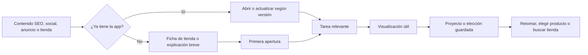

# Color Berel · Estrategia de lanzamiento y crecimiento

> **Versión:** 0.1 · **Fecha:** 2026-09-03 · **Audiencia:** interna Efeonce
> **Estado:** propuesta de trabajo; no aprobada por Berel · **Owner comercial:** Julio Reyes Rangel
> **Contexto nuevo:** el operador confirma que lanzarán una nueva app Color Berel.

## 1. Recomendación ejecutiva

Proponemos construir el lanzamiento alrededor de una tarea concreta: **ayudar a convertir una intención de
pintar en una elección de color que la persona pueda visualizar, conservar y llevar a su proyecto**. ASO
conecta esta oportunidad con nuestro trabajo SEO; la campaña completa debe unir descubrimiento, demostración,
primera experiencia útil y avance hacia producto/tienda.

Concepto exploratorio recomendado: **«Tu próximo color empieza aquí»**. Bajada a validar con el build:
«Explora cómo podría verse tu espacio y guarda los colores para tu próximo proyecto».

El lanzamiento tendría dos recorridos: nuevos usuarios y personas que ya conocen la app. Empezaríamos con
canales propios, fichas de tienda claras y una prueba controlada de adquisición; ampliaríamos inversión
cuando el evento de valor y la experiencia se puedan verificar. La métrica candidata es **usuarios con un
primer proyecto de color guardado**, acompañada de registros, costo, continuidad del proyecto e intención
de compra. Es una hipótesis de activación que se debe validar, no una correlación demostrada con ventas.

## 2. Qué sabemos y qué no

La [investigación fechada](research/COLOR_BEREL_LANZAMIENTO_FUENTES_2026-09-03.md) documenta las fuentes.

- **Confirmado por Julio:** nueva Color Berel por lanzar; Berel es cliente SEO; Efeonce tiene experiencia en
  marcaje y performance móvil. Casos y resultados compartibles quedan por recopilar.
- **Observado públicamente:** existe una app anterior en ambas tiendas. Google Play muestra `100 k+`
  descargas acumuladas, un indicador que no equivale a usuarios activos ni contactables [P2].
- **Funciones descritas por Berel:** visualización, contenido, recomendaciones y herramientas para preparar
  proyectos [P1, P3]. No se ha probado la nueva versión ni confirmado qué cambia.
- **Sin datos:** fecha de lanzamiento, presupuesto, build, métricas base, audiencia prioritaria, objetivos
  económicos, stack y capacidad del equipo de desarrollo.

No se asume que exista una fuga de conversión ni una falla de tracking. México y español es-MX son el
escenario de planificación por la marca y sus superficies; cobertura y lanzamiento se confirman con Berel.

### Decisión que cambia el plan: actualización o app nueva

| Escenario a confirmar | Implicación |
| --- | --- |
| Actualización con los mismos IDs | Preservar marca/búsquedas; separar instalaciones de adopción de versión y reactivación; explicar la mejora real |
| Nueva app con IDs diferentes | Plan de transición: destino correcto, coexistencia, cuentas/proyectos, soporte y comunicación; no asumir migración automática |
| Lanzamiento distinto por OS o rollout gradual | Creatividad, enlaces y pauta solo hacia versiones disponibles; agenda relativa por plataforma |

Una página titulada «nueva app» ya existe [P1]; no debe utilizarse como prueba de fecha o novedad del próximo release.

## 3. Respuesta al encargo de Fernanda

| Lo que solicita | Respuesta propuesta de Efeonce | Entregable y señal de éxito |
| --- | --- | --- |
| Marketing de apps | ASO, adquisición y adopción de nueva versión | Plan por OS/cohorte; llegadas relevantes y primeras aperturas |
| Diseño y contenido creativo | Demostraciones de una tarea real, adaptadas por intención | Sistema de conceptos/hooks/assets; aporte a activación, no solo CTR |
| Social media | Lanzamiento, tutoriales breves, preguntas y demostraciones de creadores | Calendario, moderación y feedback al equipo de producto |
| Publicidad de adquisición y crecimiento | Campañas de apps con eventos y economía verificables | Costo por primera experiencia útil, con instalación y registro como diagnósticos |
| Instalaciones y registros | Embudo y definiciones independientes | Reporte por OS, versión y cohorte; sin sumar descargas, aperturas y registros |
| Retención | Continuidad del proyecto y reactivación pertinente | Retorno con acción útil, recuperación de proyectos y señales hacia tienda |

## 4. Audiencias por trabajo a resolver

Prioridades propuestas; no son segmentos confirmados mediante investigación de usuarios.

| Prioridad | Persona/situación | Necesidad e hipótesis de mensaje | Acción útil |
| --- | --- | --- | --- |
| 1 | Persona que piensa pintar un espacio pronto | «Quiero ver opciones para decidirme» | Explorar una visualización y guardar una elección |
| 2 | Persona que ya eligió color y prepara la compra | «Quiero saber qué producto necesito y cuánto considerar» | Revisar recomendación/cálculo y siguiente paso hacia tienda |
| 2 | Usuario previo con proyecto inconcluso | «Quiero retomar lo que estaba preparando» | Abrir la versión adecuada y recuperar/continuar proyecto |
| 3 | Pintor, asesor de tienda o profesional que acompaña una decisión | «Quiero ayudar a mi cliente a elegir y conservar la referencia» | Crear una referencia útil; validar usos profesionales antes de pautar |

No fijar edad, género o nivel socioeconómico sin evidencia. La intención y la cobertura de tiendas son
mejores hipótesis iniciales que una segmentación demográfica inventada. Descubrimiento creativo amplio
puede convivir con cohortes analíticas específicas; no requiere decenas de conjuntos de anuncios.

## 5. Territorio creativo y propuesta de valor

**Insight a validar:** decidir un color puede ser más difícil que encontrar inspiración. La app podría
acortar la distancia entre imaginar un cambio y preparar un proyecto. No se afirma que toda la audiencia
comparta esta barrera.

| Territorio exploratorio | Ejemplo de mensaje | Ventaja | Límite |
| --- | --- | --- | --- |
| **Tu próximo color empieza aquí** — recomendado | «Ese espacio que quieres renovar puede empezar con una idea de color» | Conecta emoción con acción; admite varias funciones | Necesita demostración y CTA concretos para no quedar genérico |
| Antes de pintar, explora | «Mira cómo podría verse ese color en tu espacio» | Prueba funcional clara | Depende de captura/visualización real y fiel a la nueva app |
| De la idea a tu proyecto | «Elige tus colores y prepara el siguiente paso» | Conecta con producto y tienda | Puede ser menos llamativo para una audiencia fría |

Las tres son rutas para evaluar, no slogans finales. No se afirma exclusividad: otras marcas ya ofrecen
visualización de color [P6]. El diferencial tendría que demostrarse mediante experiencia, catálogo,
asesoría y continuidad del proyecto de Berel.

### Sistema de piezas inicial propuesto

- **Dos situaciones:** renovar un espacio / resolver una elección antes de comprar.
- **Tres hooks:** duda entre tonos / ver una posibilidad / conservar una elección para después.
- **Una demostración por combinación:** seis variantes narrativas iniciales, con adaptaciones de formato
  según el canal. No son seis producciones independientes ni una cantidad contractual.
- **Un tutorial principal** de uso real y cortes por pasos; material para ficha de tienda, ayuda y social.
- **Una secuencia de Stories** que muestra la tarea y lleva al destino correcto; piezas para Facebook y
  video vertical según canales disponibles. Confirmar formatos del nuevo encargo, sin extrapolar reglas
  del contrato editorial mensual a toda la pauta.

### Guion de demostración de 20–30 segundos — boceto

1. Espacio real y elección entre alternativas; una pregunta breve: «¿Qué color te imaginas aquí?».
2. Captura de la nueva app mostrando una tarea que realmente funciona.
3. Resultado digital y guardado del proyecto, solo si están disponibles en el build aprobado.
4. CTA: «Explora tu próximo color con Color Berel». Para usuarios anteriores, explicar la novedad confirmada
   y orientar a actualizar/abrir, en lugar de pedir una instalación innecesaria.

La app no debe mostrarse haciendo algo que no hace. Una simulación se identifica como tal; un espacio
físicamente pintado solo se presenta como resultado real si existe esa producción. Los colores en pantalla
son orientativos: incorporar el criterio aprobado por Berel para contrastar con muestras físicas. No
prometer reproducción exacta, ahorro garantizado ni cantidades exactas sin condiciones técnicas.

Fotos de hogares, proyectos, rostros, música y creators requieren permisos adecuados al uso previsto. No
usar viviendas de usuarios para anuncios por el solo hecho de que las subieron a la app. No se ha generado
ni enviado ningún asset en este análisis.

## 6. Recorrido de adquisición y CRO

El recorrido es conceptual y depende del build. El registro puede ser obligatorio o aparecer al guardar;
debe medirse como paso propio. Si es viable, probar que el usuario vea valor antes de pedir datos opcionales.
No presentar la creación de cuenta como activación por definición.

**CRO prioritario:** continuidad entre promesa del anuncio, primeras capturas de tienda y tarea inicial;
permisos de cámara/fotos en contexto; alternativa si el permiso se rechaza; feedback de carga y error;
registro/guardado sin pérdida del trabajo; volver al proyecto sin empezar de cero.

No imponer una landing en todos los caminos. Tráfico con intención clara puede ir a la ficha; contenido
educativo puede necesitar una explicación breve. En desktop, ofrecer QR y enlaces de plataforma. En móvil,
CTA directo. El enlace debe funcionar con app instalada/no instalada, sesión iniciada/no iniciada y versión
anterior/nueva. La continuidad tras instalar debe probarse; no se asume por añadir UTM.

## 7. ASO y el puente con SEO

1. **Confirmar identidad de release y ficha México** antes de editar nombres, categorías o enlaces.
2. **Mapa de intención inicial:** marca (Color Berel), tarea (visualizar colores de paredes), preparación
   (elegir pintura/calcular material). Son familias candidatas; no se han medido sus volúmenes en tiendas.
3. **Auditoría de metadatos por tienda:** relevancia y claridad según campos admitidos. Google Search no
   representa la demanda de App Store; no trasladar volúmenes SEO como si fueran ASO [T1].
4. **Capturas ordenadas por tarea/beneficio:** primera experiencia, resultado orientativo y siguiente paso;
   assets reales del release. Probar una variación relevante a la vez cuando el volumen permita [T2, T3].
5. **Descripción, novedades y ayuda coherentes:** explicar qué cambia para usuarios anteriores y qué recibe
   uno nuevo. Solicitar reseñas mediante mecanismos permitidos, sin incentivos ni filtrado de usuarios felices.
6. **Reutilizar contenido Berel:** priorizar páginas existentes de colores, combinaciones y preparación con
   intención pertinente. Obtener GA4/GSC antes de escoger páginas por supuesto tráfico; actualizar CTA hacia
   tarea/destino correcto. Evitar artículos duplicados y no condicionar la lectura a instalar la app [P5].

La descripción pública de Android es más breve que el relato de funciones en la web; esto sugiere revisar
coherencia de mensaje, no demuestra menor conversión. No se evaluó visualmente la ficha ni su tasa de descarga.

## 8. Mezcla de canales y lógica de inversión

| Canal | Papel propuesto | Condición de activación | Métrica de decisión |
| --- | --- | --- | --- |
| SEO/contenido y web Berel | Capturar intención existente y explicar valor | Inventario real, destinos y medición | Paso a app y activación observable por origen |
| Tiendas/asesores | Demostración cerca de la decisión de pintura | Participación autorizada y materiales simples | Uso de QR por punto y progreso; no llamarlo venta |
| Social propio | Demostrar, educar y resolver objeciones | Responsables de publicación y soporte | Consumo útil, salidas y calidad de cohortes cuando atribuible |
| Google App campaigns | Adquisición de app por OS/objetivo | App disponible y conversiones válidas; presupuesto compatible con aprendizaje | Costo por acción útil con cobertura explícita [T4] |
| Meta | Descubrimiento mediante demostración y creators | App/eventos/medición habilitados y elegibles en cuenta | Activación y costo por cohorte; no optimizar solo clics |
| Apple Ads | Capturar búsqueda en App Store | Disponibilidad, términos, costo y volumen por validar | Adquisición y calidad iOS [T5] |
| Creators | Enseñar un proyecto y aportar confianza | Experiencia real, permisos y entrega verificable | Tráfico/activación identificable + investigación cualitativa |
| Email/push/in-app | Adopción de versión y continuidad del proyecto | Canal existente, permisos y estado de usuario | Retorno útil; supresión cuando ya cumplió el objetivo |
| TikTok/Pinterest y expansión de video | Explorar demanda adicional | Capacidad creativa y evidencia que justifique inversión | Aprendizaje incremental; no obligación de abrir más canales |

**Arranque sugerido:** owned + ASO y un máximo inicial de dos plataformas pagadas. Seleccionar entre Google,
Meta y Apple según señal, volumen y presupuesto; no fragmentar por cada persona, ciudad y hook. Google App
campaigns distribuye en varias superficies: no contabilizar toda su inversión como búsqueda de alta intención.

Para ilustrar planificación, `B` es solo medios: 45% plataforma principal, 40% segunda y 15% reserva de
aprendizaje, **si B sostiene ambas**. Si no, concentrar paid en una plataforma y conservar los canales
propios. La reserva no se gasta automáticamente. No es una recomendación cerrada de presupuesto ni un
benchmark; el split final depende del build, OS y primeras cohortes.

Separar: medios, dirección/operación, producción, talento/derechos, implementación de medición, tecnología
y soporte de producto. No ofrecer operación omnicanal, creators ni cambios ilimitados dentro de un fee genérico.

## 9. Plan por fases relativo al lanzamiento

`T0` significa disponibilidad pública verificada de la versión promocionada en la plataforma de destino;
no una fecha inventada. Los plazos siguientes son ventanas de planificación, no compromisos aprobados.

| Fase | Ventana orientativa | Trabajo | Condición para avanzar |
| --- | --- | --- | --- |
| Preparación | T−4 a T−2 semanas | Matriz de novedades, audiencias, baseline, eventos, identidad/migración y responsables | Build y tareas clave revisables; alcance conocido |
| Validación | T−2 a T0 | ASO/creativos con build real, recorrido/links, QA de medición, grupo pequeño de usuarios | Sin fallas críticas; señal de valor comprobable; tiendas aprobadas |
| Lanzamiento controlado | T0 a T+2 | Owned, distribución coordinada y paid acotado; separar nuevos y anteriores | Cohortes maduras para primera evaluación y soporte disponible |
| Mejora | T+3 a T+6 | Resolver fricción dominante; ajustar mensaje, ASO y adquisición | Mejora útil sin degradar experiencia o calidad |
| Escala/continuidad | T+7 a T+12 | Ampliar ganadores, nuevas pruebas y conexión con tiendas | Costo compatible con valor económico y evidencia de continuidad |

Si el lanzamiento está más cerca, reducir volumen de piezas/canales; no omitir el funcionamiento de enlaces,
evento de valor y soporte. Si un OS se retrasa, adaptar la comunicación por disponibilidad.

## 10. Activación y retención por proyecto

**Activación candidata A1:** primer proyecto guardado que contiene al menos una elección de color y una
visualización completada, dentro de siete días desde primera apertura. Antes del uso contractual, confirmar
que la nueva app admite ese recorrido y si predice continuidad/avance. Si el producto resuelve mejor otra
tarea, redefinir A1 con Berel, versionarlo y preservar comparabilidad.

**Norte operativo provisional:** usuarios únicos con A1 por semana; lectura separada por nuevos/anteriores,
OS, versión y cobertura de identidad. Un mismo usuario no aumenta la cifra por guardar diez proyectos.

La retención debe distinguir proyecto activo de tarea terminada. Registrar D1/D7/D30 como diagnóstico,
y además retorno a una acción del proyecto entre días 2–7 y progreso entre días 8–30, solo en cohortes con
ventana completa. La salida tras resolver la necesidad no prueba fracaso. Uso profesional frecuente es una
hipótesis distinta del uso ocasional doméstico.

| Estado | Intervención propuesta, solo si hay canal y permiso | Salida/supresión |
| --- | --- | --- |
| Primera apertura sin tarea útil | Ayuda contextual para empezar; rescatar error antes de insistir | No insistir si rechazó canal o ya se activó |
| Proyecto guardado sin avance | Recordatorio pertinente para retomarlo; momento por validar | Suprimir tras progreso o señal de proyecto terminado |
| Proyecto listo para consulta | Ayuda para producto/calculadora/tienda según intención | No convertir clic de tienda en compra |
| Usuario previo en versión anterior | Explicar novedad confirmada y compatibilidad/recuperación | Excluir después de adoptar la versión |
| Proyecto resuelto | Reducir presión; inspiración futura con cadencia acordada | No perseguir apertura diaria |

Un eventual loop de compartir un proyecto puede atraer otro usuario si el producto lo permite y hay permiso.
No asumir función social ni coeficiente viral. Medir invitación/visita/activación antes de contar ese loop en el plan.

## 11. Medición, economía y experimentación

Detalle: [Plan de medición y experimentos](medicion-y-experimentos-INTERNO.md). Separa tienda, primera
apertura, registro, activación, retorno, intención de tienda y venta confirmada. Incluye límites de iOS y
requisitos del equipo desarrollador; un contenedor GTM web no demuestra marcaje dentro de la app.

La decisión de medios debe considerar costo por usuario activado y progreso, además de CPI. No se calcula
CAC de comprador o ROAS sin compra verificable. La atribución de plataformas se reporta aparte del embudo
deduplicado; no se suman conversiones autoadjudicadas.

**Sensibilidad ilustrativa; no forecast ni benchmark:** con MXN 100.000 de medios, CPI hipotético de MXN 20
produciría 5.000 instalaciones. Si 80% abre y 25% de quienes abren alcanza A1, serían 1.000 activados y
MXN 100 por activado. Si A1 sube a 35% con el resto igual, serían 1.400 y MXN 71,43. La diferencia ilustra
por qué mejorar experiencia puede valer tanto como comprar más tráfico; no predice el resultado de Berel.

Prioridad provisional ICE (I/C/E: 1–5; `(I×C×E)/3`, juicio interno, no evidencia estadística):

| Prioridad | Movimiento | I/C/E → score | Razón / dependencia |
| --- | --- | --- | --- |
| P0 | Confirmar build/identidad/medición y reparar fallas críticas | Gate, no score | Ninguna optimización compensa promover una versión equivocada |
| P1 | Coherencia mensaje → ficha → tarea inicial | 5/4/4 → 26,7 | Afecta todos los canales; revisar con build y usuarios |
| P2 | Owned/SEO y adopción de base existente | 4/3/4 → 16,0 | Contexto disponible; audiencia contactable aún no conocida |
| P3 | Paid limitado con demostraciones y A1 medible | 5/3/3 → 15,0 | Requiere señal, creativos y presupuesto |
| P4 | Continuidad de proyecto y conexión a tienda | 4/3/3 → 12,0 | Requiere canales/funciones disponibles y decisión de Berel |
| P5 | Más redes, creators y loops | 3/2/2 → 4,0 | Expandir cuando haya evidencia y capacidad |

No se afirma haber identificado la mayor fuga sin un embudo real. Los scores se recalibran al recibirlo.

## 12. Sample sprint que demostraría la propuesta

Un sprint muestra comercial podría demostrar una sola cadena de valor: **mensaje → ficha → tarea útil →
medición propuesta**. Entrega sugerida: una ruta creativa, guion y adaptación de ficha con material real,
revisión del recorrido en build y esquema de tablero rotulado como muestra, sin datos ficticios presentados
como resultados. Definir esfuerzo máximo y evaluación antes de producir.

Con solo información pública, se puede entregar un diagnóstico/muestra conceptual; no una validación de
conversión. Con build y acceso autorizado, se puede comprobar usabilidad y eventos. Un experimento pagado,
una integración o un piloto real requieren alcance y presupuesto adicionales. El sprint no garantiza
significancia, instalaciones o ventas en dos semanas.

## 13. Responsabilidades y decisiones de arranque

| Frente | Responsable propuesto | Qué debe aportar/aprobar |
| --- | --- | --- |
| Objetivo, novedad, fecha y marca | Berel; Fernanda como interlocutora a confirmar | Brief, claims, assets, criterios y quién decide |
| Dirección comercial | Julio | Alcance, equipo, evidencia de experiencia y condiciones |
| Estrategia, ASO, medios, contenido y análisis | Efeonce, especialistas por asignar | Plan, priorización, entregables y reporte |
| SDK/eventos, links, cuentas/proyectos y releases | Equipo desarrollador de la app, por identificar | Implementación y pruebas; Efeonce puede especificar/QA según alcance |
| Tiendas/asesores y soporte | Berel, responsables por identificar | Cobertura, materiales, atención y feedback |

Para convertir esto en propuesta cerrada necesitamos primero: **qué cambia en la nueva app, fecha por OS,
objetivo principal, presupuesto, responsable técnico y acceso al build**. Después resolveríamos tiendas,
creators, canales propios y formato del sample sprint.

## 14. Estado de este entregable

- **Listo:** análisis de fuentes públicas, estrategia v0.1, conceptos exploratorios, canal-mix condicionado,
  fases, definiciones de medición, prioridades y diseño de pruebas.
- **Pendiente por falta de información:** auditoría de la nueva app, forecast real, calendario aprobado,
  presupuesto, metas, equipo asignado y configuración actual de medición.
- **Sin ejecutar:** diseño/producción de piezas, campaña pagada, modificación de app/tiendas/web/HubSpot,
  contacto con Fernanda, publicación o registro de Proposal Studio.

La documentación interna queda abierta para iterar. Este análisis no cambia la etapa comercial del negocio.
