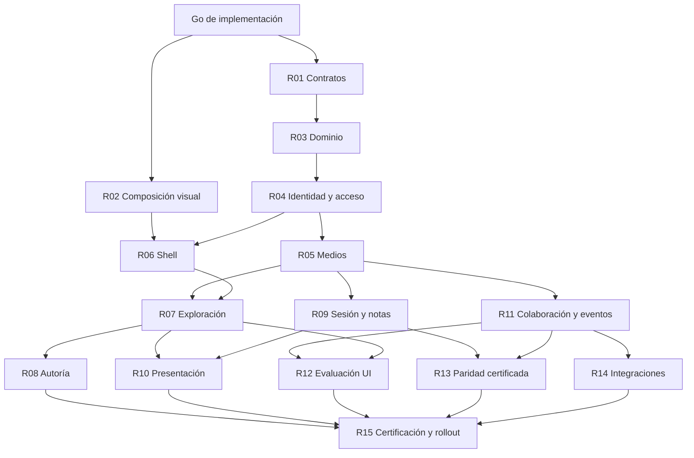

# EPIC-052 — Efeonce Rooms: experiencia comercial inmersiva y sales enablement

## Status

- Lifecycle: `to-do`
- Priority: `P1`
- Impact: `Muy alto`
- Effort: `Alto`
- Status real: `Épica registrada y descompuesta; arquitectura/experiencia Proposed; go de implementación pendiente; 0 tasks hijas registradas, 0 capacidades implementadas`
- Rank: `TBD`
- Domain: `cross-domain`
- Owner: `Commercial / Product; responsable individual por asignar`
- Branch: `checkout actual para documentación; rama del futuro runtime por definir, ninguna creada`
- GitHub Issue: `n/a; registro local, sin issue remoto`
- Created: `2026-10-07`

Priority, Impact y Effort son inferencias de planificación por alcance multimedia, acceso externo y valor comercial; no asignan fecha, presupuesto ni prioridad relativa frente a otras épicas. El operador pidió explicar el sistema y crear esta épica. Eso autoriza su registro, no equivale al go final de implementación ni acepta por inferencia todos los detalles del ADR Proposed.

## Summary

Coordina la construcción de **Efeonce Rooms**, plataforma propia de sales enablement y experiencia del comprador en `rooms.efeonce.org`. Alcance V1: una sala reutilizable para propuestas creativas y SEO/AEO, combinables. El primer recorrido que se materializa es creativo: propuestas gráficas completas, estáticas, largas, audio y video, acompañadas por sus PDFs originales. SEO/AEO añade oportunidad, muestra editorial/técnica, radiografía, evidencia, linaje, plan y medición; no se reduce a adjuntar un PDF o enlazar X-ray. El champion puede comprender, ensayar, presentar y defender la propuesta ante su comité; el evaluador puede explorar y preguntar con contexto.

La administración vive en Rooms; UI, CLI y MCP consumen el mismo contrato. La documentación permanece en Greenhouse. El repo `efeonce-rooms` es destino candidato y no existe como entrega de esta épica. El dominio es un destino acordado, no una afirmación de DNS o servicio desplegado.

## Why This Epic Exists

La experiencia exige coordinar identidad, autoría, medios, narrativa, presentación, evaluación, integraciones y operación. Implementarla como una sola task mezclaría contratos de alto riesgo con decisiones visuales y produciría un cierre imposible de verificar.

El PDF conserva su función documental, mientras Rooms permite inspeccionar y experimentar el trabajo. Un recorrido resumido jamás justifica perder páginas o assets del inventario. El champion necesita conducir la conversación sin depender del autor de la propuesta y sin exponer notas privadas.

La frontera aceptada separa Rooms de Think y Greenhouse: Think conserva captación; Greenhouse coordinación/operación; HubSpot CRM; Studio producción/activación. Rooms posee la experiencia comercial y sus ediciones, no reemplaza esos dominios.

## Outcome

- El equipo prepara una sala completa sin escribir componentes particulares por cliente.
- El comprador explora piezas en su formato real y encuentra el método/evidencia vinculados.
- El champion ensaya, presenta, responde abriendo detalle y vuelve al mismo punto del recorrido.
- UI, CLI y MCP ejecutan el ciclo durable con iguales capacidades, límites y permisos.
- Ediciones, acceso, medios y conversaciones tienen identidad y trazabilidad claras.
- Dos propuestas de marcas distintas —una creativa y una SEO/AEO— y un recorrido combinado de una misma marca demuestran reuso, aislamiento y calidad desktop/móvil.
- El piloto autorizado deja evidencia de uso, operación, coste y límites; ninguna métrica afirma causalidad de ventas sin estudio.

## Design System — decisión 2026-10-07

El operador corrigió expresamente la estética y tipografía: **La órbita (`efeonce-graphic-line`) es el design system de Rooms**, también para autoría y consola. Bricolage editorial/Poppins funcional; paleta, componentes, iconografía y motion canónicos. AXIS es su infraestructura de distribución. Esta decisión reemplaza la base Poppins/Geist de los borradores; composición específica, pins y QA visual siguen pendientes. El arte cliente permanece intacto y no se obliga a narrar en preguntas/respuestas.

## Architecture Alignment

- [Dossier Rooms](../../architecture/rooms/README.md): índice canónico del dominio.
- [ADR Rooms](../../architecture/rooms/EFEONCE_ROOMS_PRODUCT_AND_PLATFORM_DECISION_V1.md): decisiones aceptadas separadas de propuesta técnica/visual.
- [Arquitectura](../../architecture/rooms/EFEONCE_ROOMS_ARCHITECTURE_V1.md): app modular Next.js/React/TypeScript, PostgreSQL, storage privado y worker multimedia.
- [API y acceso](../../architecture/rooms/EFEONCE_ROOMS_API_AND_ACCESS_CONTRACT_V1.md): commands/readers, catálogo por canal, permisos y edición.
- [Perfiles creativo y SEO/AEO](../../architecture/rooms/EFEONCE_ROOMS_EXPERIENCE_PROFILES_V1.md): contenido estructurado, evidencia, continuidad X-ray y aceptación conjunta.
- [Experiencia](../../architecture/rooms/EFEONCE_ROOMS_EXPERIENCE_V1.md), [dirección visual](../../ui/visual-directions/EFEONCE_ROOMS_VISUAL_DIRECTION_V1.md), [wireframes](../../ui/wireframes/rooms-v1.md), [flujos](../../ui/flows/rooms-v1.md) y [motion](../../ui/motion/rooms-v1.md).
- [Skill La órbita](../../../.codex/skills/efeonce-graphic-line/SKILL.md): autoridad estética y tipográfica; [roles Rooms](../../ui/visual-directions/EFEONCE_ROOMS_VISUAL_DIRECTION_V1.md).
- [AXIS portable](../../architecture/EFEONCE_SHARED_PRODUCT_UI_PLATFORM_DECISION_V1.md) y [consumo privado](../../operations/AXIS_PRIVATE_PACKAGE_CONSUMPTION_RUNBOOK_V1.md): versiones exactas, adapter nativo, evidencia del consumidor y rollback.
- [Identidad contextual](../../architecture/EFEONCE_ID_RELYING_PARTY_ENTRY_AND_CONSENT_DECISION_V1.md), [gateway MCP](../../architecture/EFEONCE_MCP_PLATFORM_GATEWAY_DECISION_V1.md) y [API parity](../../architecture/GREENHOUSE_FULL_API_PARITY_DECISION_V1.md).
- [Fronteras de build](../../architecture/GREENHOUSE_BUILD_UNIT_DECOMPOSITION_DECISION_V1.md), [placement](../../operations/MODULAR_MIGRATION_NEW_WORK_OPERATING_MODEL_V1.md) y [modelo de épicas](../../operations/EPIC_OPERATING_MODEL_V1.md).

## Child Tasks

**Ninguna task hija registrada aún.** Los códigos R01–R15 son unidades de planificación locales a esta épica, no IDs TASK ni promesas de trabajo iniciado. Se materializan con plantilla/addenda vigentes al preparar la implementación; deben declarar esta épica y actualizar esta tabla con el ID real. No se reservan números de tasks especulativos. Cada unidad puede dividirse si su discovery revela contratos independientes.

| Unidad | Entrega prevista | Perfil de futura task / owner funcional | Dependencias | Evidencia de salida |
|---|---|---|---|---|
| R01 | Contratos ejecutables y ficha de runtime: operaciones/schemas, bloques/perfiles/evidencia/edición, mapping X-ray, decisiones de identidad, límites, pins, región, retención y coste | backend-data / Platform | Go de implementación; revisión del ADR | Contratos versionados, decisiones pendientes resueltas, plantilla de fixture multicanal y límites publicados; sin provisión implícita |
| R02 | Dirección materializada en composición desktop/móvil y primera transición con material real | ui-ux / Product + Creative + SEO-AEO + AXIS | Go; dossier y fixtures autorizadas | Primer viewport y pieza→detalle creativos, más lectura→radiografía SEO/AEO aceptados por operador; Bricolage/Poppins, paleta/componentes/iconografía La órbita, estados y movimiento reducido medidos |
| R03 | Foundation del runtime y dominio: borrador, bloques tipados, piezas/variantes, evidencia/snapshots/relaciones, planes/escenarios, relato, tours, ediciones, outbox y auditoría | backend-data / Platform | R01 | Commands/readers persistidos, concurrencia y replay; edición inmutable, migración/rollback verificados |
| R04 | Identidad y acceso: relying party, invitaciones/sesiones externas, grants, capabilities y proyecciones privadas | backend-data / Identity + Platform | R01, R03 | Acceso interno/externo, denegación entre tenants, expiración/revocación; notas ausentes del DTO de audiencia |
| R05 | Pipeline multimedia: upload, originales, derivados, jobs, fallos y entrega privada de bytes | backend-data / Media + Platform | R03, R04 | Imagen/PDF/audio/video reales; checksum, dimensiones, ratio, retries, tickets y streaming verificados |
| R06 | Shell de producto, entrada contextual y gestión de salas según autoridad | ui-ux / Product | R02, R03, R04 | Navegación y estados de acceso completos; integración con identidad sin duplicar login; crear/continuar/archivar por API |
| R07 | Exploración creativa y SEO/AEO: narrativa, inventario, variantes, detalle, lectura editorial, radiografía, diagnóstico/plan, linaje y fundamentos | ui-ux / Product + Creative + SEO-AEO | R02, R05, R06 | Ratios y piezas largas legibles; inventario íntegro; fragmento↔evidencia y derivado↔origen; teclado/táctil y retorno estable |
| R08 | Editor: plantillas combinables, importación de archivos/bloques, relaciones, relato, evidencia, planes/escenarios, recorridos, cobertura y preview por rol | ui-ux / Product | R03, R04, R05, R07 | Mismo renderer que comprador; pérdidas/exclusiones visibles; publicación por command, sin lógica privada solo en UI |
| R09 | Contrato de presentación y notas: preparación, sesión fija, proyecciones, control exclusivo y reconexión | backend-data / Platform | R03, R04, R05 | Sesión/edición/tour coherentes; payloads aislados; secuencias/acks y recuperación no filtran notas ni aplican órdenes viejas |
| R10 | Experiencia del champion: notas, ensayo, preflight, consola, audiencia y retorno al tour | ui-ux / Product + Creative + SEO-AEO | R07, R09 | Champion presenta sin asistencia, abre evidencia y vuelve; prueba de sonido, ventana única y pérdida de consola |
| R11 | Preguntas, respuestas, pasos y actividad observable con anclas a edición/bloque/pieza/tiempo | backend-data / Platform + Commercial | R03, R04, R05 | Idempotencia, scope y retención; eventos reales y métricas definidas; lectura con permisos efectivos |
| R12 | Evaluación y seguimiento: paneles contextuales, preguntas, pasos y lectura comercial de actividad | ui-ux / Product + Commercial | R07, R11 | Preguntar desde pieza y retomar; edición visible; actividad no presentada como intención inferida |
| R13 | Adapters CLI/MCP completos y certificación de equivalencia con UI | backend-data / Platform + MCP | Base R03–R05; cierre después de R09/R11 | Ciclo durable real por tres canales, incluida transferencia de bytes, bloques/evidencias/relaciones y readback; catálogo y permisos equivalentes |
| R14 | Puentes comerciales: adapter X-ray, snapshots autorizados de diagnóstico/informes, referencia CRM y procedencia, proyección/handoff acotados | backend-data / Integrations + Commercial | R03, R04, R11 | Mapping X-ray versionado con cobertura/pérdidas visibles; contenido nativo y grants propios; outbox/reconciliación y fallo CRM tolerado; sin tablas ajenas |
| R15 | Certificación y rollout: dos marcas, perfiles creativo y SEO/AEO y tour combinado, champion, accesibilidad, resiliencia, costes, restore, canary y manuales | standard / QA + Ops + Commercial | R01–R14 | Todos los Exit Criteria con evidencia; despliegue/piloto autorizados y readback; handoff operativo |

La exposición HTTP/CLI/MCP acompaña cada contrato desde R03; R13 integra y certifica, no deja la paridad para una reescritura al final. R09 define autoridad y estado durable; coordinación local entre ventanas es adapter de R10. R15 verifica el conjunto: no concentra implementación pendiente de otras unidades.

## Sequence and Milestones

| Hito | Resultado revisable | Condición de avance |
|---|---|---|
| M0 — definición | Dossier y épica coherentes | Completado documentalmente; no es producto construido |
| M1 — dirección y contratos | Primer recorrido creativo + lectura/radiografía SEO/AEO desktop/móvil; contratos de bloques, evidencia y acceso | R01/R02; aprobación visual del operador y decisiones técnicas concretas |
| M2 — sala completa | Importar → editar → publicar → explorar todo el inventario con acceso real | R03–R08; no se entrega una galería de cinco piezas como propuesta completa |
| M3 — champion y evaluación | Preparar → presentar → responder → retomar; preguntas/seguimiento | R09–R12; payload privado separado y flujo observado |
| M4 — certificación multicanal | Operar la misma sala por UI/CLI/MCP y reconciliar integraciones | R13/R14 más evidencia acumulada; cada capability tiene owner y pruebas |
| M5 — piloto y operación | Dos marcas, ambos perfiles y tour combinado, uso del champion y runtime recuperable | R15; gates de salida y autorizaciones de despliegue/participación, sin inferirlos del go técnico |

No se estima plazo o precio antes de R01, selección de equipo y fixtures. Las dependencias son de producto/contrato; no ordenan crear subagentes ni ejecutar tareas simultáneamente.

## Existing Related Work

- [EPIC-029 Proposal Studio](EPIC-029-tender-proposal-studio-agentic-authoring.md): expediente/oferta formal y producción documental; se referencia, no se reparentan sus tasks ni se reconstruye la propuesta técnica rechazada.
- [EPIC-049 Marketing Studio](../in-progress/EPIC-049-efeonce-marketing-studio-platform.md): campañas y activación; fuente potencial de versiones autorizadas, no editor Rooms.
- [EPIC-050 Creative Workbench](EPIC-050-creative-workbench-campaign-scale-production.md): producción multimarcas; Rooms exhibe material existente sin absorber sus motores.
- [EPIC-045 Insights](../in-progress/EPIC-045-efeonce-insights-multiformat-intelligence.md): referencia de presentación y evidencia; sin migración de informes por esta épica.
- [EPIC-044 Identity/MCP](../in-progress/EPIC-044-efeonce-identity-authorization-server-and-mcp-federation.md): contratos compartidos; su existencia documental no prueba integración Rooms.
- [EPIC-033 UI platform](../complete/EPIC-033-premium-agentic-ui-platform.md): método de calidad; componentes portables AXIS verificados en consumidor, sin importar wrappers privados de Greenhouse.
- [AEO X-ray](../../think/radiografia-aeo-architecture.md): experiencia SEO/AEO que debe conservar lectura, radiografía y linaje mediante adapter; sus muestras y rutas actuales permanecen. La nueva room exige sus propios permisos y edición.
- [Sika/POSIBLE](../../commercial/tenders/sika-mexico-campana-creativa-1164/README.md): posible fixture con archivos existentes y permisos pertinentes. No depende de terminar esa licitación, no se alteran originales ni se envía nada al cliente por crear la épica.

Barrido de dominio/superficie efectuado sobre registries y épicas: no existe dueña previa de Rooms. Los solapamientos anteriores se conservan como related work. Los bloqueos específicos de cierre de Sika no impiden registrar este programa ni se consideran resueltos por él.

## Exit Criteria

Todos pendientes de implementación/evidencia, salvo el hito documental M0. Registrar evidencia junto a cada casilla al cumplirla; no estimar porcentaje de producto usando el número de documentos redactados.

- [ ] Go de implementación registrado; ADR/decisiones concretas y tasks hijas sincronizadas con sus owners, perfiles y dependencias.
- [ ] Dos salas de marcas diferentes, una creativa y una SEO/AEO, más un tour combinado de una misma marca; sin código especial por cliente, inventario de archivos/bloques reconciliado y exclusiones expresas.
- [ ] Perfil SEO/AEO nativo: lectura completa → fragmento/radiografía/evidencia → derivado/origen → plan/medición; adapter X-ray preserva contenido, anclas, fuentes y estado sin ejecutar código importado.
- [ ] Evidencia con entidad/ámbito, fecha, método y cobertura; observación/hipótesis/simulación/propuesta distinguibles; fuente caída o desactualizada, ancla rota y ausencia de baseline resueltas explícitamente, sin cambiar la edición en presentación.
- [ ] Escenario soporta 9:16, 4:5, 1,91:1, 16:9, ratio arbitrario, pieza larga, carrusel, PDF, audio y video sin distorsión/crop silencioso.
- [ ] Método, fundamentos y criterios de evaluación enlazan a piezas/evidencia reales; ausencias explícitas, sin contenido inventado para cubrir huecos.
- [ ] Autoría/preview/exploración/presentación utilizan contrato de render coherente; publicación fija versiones y nunca cambia una sesión activa silenciosamente.
- [ ] Champion que no creó la sala puede preparar, ensayar y presentar; abre evidencia ante una pregunta y retorna a su posición sin asistencia del creador.
- [ ] Consola y audiencia reciben proyecciones distintas; notas privadas ausentes de payloads/canales de audiencia, no solo ocultas por CSS.
- [ ] Crear/subir/importar bloques y evidencias/vincular radiografía y linaje/configurar planes y escenarios/ordenar/anotar/publicar/administrar acceso y consultar actividad funcionan por UI/CLI/MCP con readback y pruebas de denegación equivalentes; exclusiones de gestos locales documentadas.
- [ ] Originales/derivados privados, tipos/bytes comprobados, retry/cancel/concurrencia verificados; revocación de nuevos accesos y TTL efectivo de tickets existentes medidos.
- [ ] Preguntas, respuestas y pasos mantienen autoría, visibilidad y ancla a edición/bloque/pieza/tiempo; retries no duplican acciones.
- [ ] Aislamiento entre organizaciones, roles efectivos, expiración, revocación e invitaciones probados con casos permitidos/denegados; autoridad no deriva del organizationId del cliente.
- [ ] Todas las superficies Rooms cumplen La órbita: Bricolage editorial/Poppins funcional efectivos, colores y componentes canónicos, iconografía oficial y motion correcto; sin fallback silencioso a Geist, sin alterar piezas cliente ni imponer narrativa de preguntas/respuestas.
- [ ] Capturas y pruebas de interacción desktop/tablet/móvil, teclado, foco, texto ampliado, contraste y reduced motion; aceptación visual del operador y estándar premium aplicable cumplidos.
- [ ] Rendimiento p75 LCP ≤2,5 s, INP ≤200 ms e inicio de preview ≤2 s evaluados sobre fixture/red declarados; fallos no se ocultan con promedios ni animaciones.
- [ ] Audio bloqueado, medio fallido, red degradada, pérdida de consola y actualización de edición tienen recuperación observada, sin pérdida de contexto ni ampliación de permisos.
- [ ] Integración CRM/fuentes usa contratos y reconciliación; una caída de HubSpot no interrumpe una edición accesible. Métricas reflejan eventos observados, no comprensión ni intención asumidas.
- [ ] Restore DB + storage probado, alertas/límites/retención definidos, coste medido, rollback y compatibilidad de ediciones verificados; ninguna dependencia en cuentas/personas de desarrollo sin postura operativa.
- [ ] Despliegue autorizado con DNS/TLS/config/readback, canary y piloto consentido documentados; manuales de autor/champion/operador y handoff vigente; tasks obligatorias cerradas con evidencia.

## Non-goals

- Rehacer la propuesta técnica Sika descartada, generar una nueva oferta económica o presentar la licitación.
- Migrar automáticamente los runtimes, rutas o grants de Insights/X-Ray/Think, Proposal Studio, CRM o Studio. Adoptar contenido/experiencia X-ray en Rooms sí es parte de V1; no equivale a trasladar Think.
- Construir crawlers, research o scoring SEO/AEO paralelos; los sistemas dueños producen los datos, Rooms conserva snapshots autorizados para demostrarlos.
- Crear CRM, CPQ, firma, billing SaaS, outreach masivo o un sistema general de gestión de proyectos.
- Generar creatividad o adaptaciones inexistentes al importar; producir nuevos medios es una actividad de sus herramientas dueñas.
- Crear un entorno 3D obligatorio, videollamada, grabación de reunión, sincronización remota entre dispositivos u offline completo en V1.
- Prometer exportación fiel de toda la interacción a PDF: V1 conserva PDFs originales; exportación generada exige contrato posterior.
- Comprar Trumpet, crear marca/logo sin diseño AXIS o comercializar Rooms como SaaS a terceros sin decisión propia.
- Ejecutar código, crear repo/infra, publicar, enviar mensajes, commit/push/deploy como efecto de registrar esta épica.

## Risks and Decisions Before Execution

| Riesgo / decisión | Dueño | Resolución exigida |
|---|---|---|
| Alcance excesivo antes de validar inmersión | Product / Creative | M1 con material real; no construir todas las pantallas antes de aceptar la dirección |
| Procesamiento/egress y carga de video | Platform / Ops | Límites, perfiles, región y coste de fixture; precarga actual/siguiente, no todos los videos |
| Identidad externa y fuga de notas | Identity / Platform | Contrato de invitación/canje, grants, DTOs mínimos y negativos multitenant antes del piloto |
| Disponibilidad de material y permisos | Commercial / Creative | Inventario autorizado; marcas aisladas; fixture alternativa si un caso está incompleto |
| Reducir SEO/AEO a PDFs o una galería creativa | Product / SEO-AEO | Dos perfiles desde R01 y aceptación nativa en R07/R14/R15; radiografía, fuentes y plan demostrables |
| Deriva de paridad | Platform / MCP | Registro de operaciones desde foundation y certificación acumulativa por canal |
| Integraciones que duplican fuentes | Integrations | Mapping y ownership definidos; IDs y eventos, nunca SQL entre productos |
| Dependencias/pins/publicación AXIS | Platform / AXIS | Export real, autenticación de paquetes, adapter y rollback probados en Rooms |

## Delta 2026-10-07

Creada por solicitud explícita del operador después del dossier Rooms. ID verificado en registry y filesystem inmediatamente antes del registro. Sin tasks hijas reservadas ni implementación. Dossier e índices apuntan a esta épica; estado `to-do`, go final pendiente. Próximo paso: revisión del programa y, al autorizar ejecución, materializar las unidades con contratos y gates por task.

Verificación de registro: `pnpm epic:lint --item EPIC-052` → `scanned=1 canonical=1 legacy=0 errors=0 warnings=0`; 35 enlaces locales entre épica e índice Rooms verificados. El lint agregado del worktree detecta diferencias de registry/child-parity en trabajo ajeno; no se corrigen ni se atribuyen a esta épica. Cierre documental no acredita UI, runtime ni rollout.

### Ampliación de alcance 2026-10-07 — creativo y SEO/AEO

Aclaración explícita del operador: Rooms debe servir a ambos servicios. Se actualizan R01/R02/R03/R07/R08/R11/R13/R14/R15 y los Exit Criteria dentro de las quince unidades existentes; no se registran tasks ni se inicia implementación. Creatividad conserva el primer hito de materialización; cerrar solo ese perfil no completa V1. Experiencia funcional especificada en el dossier; manuales operativos y documentación del runtime se materializan con R15 cuando exista una capacidad ejecutable.
