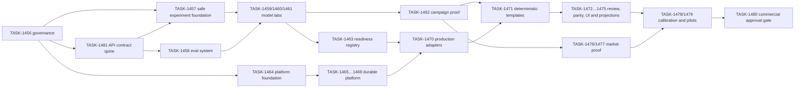

# EPIC-028 — Parallel execution plan for Efeonce Globe

- Status: Accepted planning baseline
- Validated: 2026-07-19
- Product: Efeonce Globe
- Functional descriptor: Creative Studio
- Canonical epic owner: Greenhouse `docs/epics/in-progress/EPIC-028-efeonce-globe-agentic-creative-studio.md`
- Business state: Approved for validation; not commercially approved

## Governance boundary

Greenhouse is the only operational control plane for EPICs and `TASK-###`: specs, hooks, plans, lint, QA,
lifecycle, closure and handoff live there. Globe owns implementation, runtime state and technical evidence. This
file is an execution view of the canonical Greenhouse backlog; it is not a second task registry.

## Outcome

Build and prove Globe through three parallel, complementary lanes. The program must generate real creative
evidence early enough to support sales while the durable platform, governance and economics mature underneath.
It must not confuse a successful model call with an enterprise capability or external-client readiness.

## Why parallel

Model quality, routing, cost and workflow assumptions cannot be validated on paper. Waiting for the complete
ledger and workbench before integrating models would delay the evidence needed to design the product and sell an
Efeonce-managed Sample Sprint. Conversely, exposing experimental adapters directly to clients or agents would
create uncontrolled spend, weak rights posture and false readiness.

The solution is not a compromise between speed and governance. A cross-cutting API Contract Spine
(`TASK-1481`) precedes the first provider call without blocking IaC, and the program then uses two promotion
levels:

1. **Lab execution gate:** permits bounded live inference and durable evidence.
2. **Production promotion gate:** permits a qualified route to become callable from governed UI/MCP commands.

## Parallel lanes

### Lane A — Model Lab and craft

`TASK-1457`–`TASK-1463` integrate and test real models from the start. Google-native routes use Google
Cloud/Vertex; Fal is limited to allowlisted non-Google routes; OpenAI is direct. Every run records model/version,
inputs, semantic operation, provider cost, elapsed time, rights/classification and rubric result. Since
`TASK-1490` the run also **retains the output bytes** content-addressed under the same `sha256` the manifest
publishes (`outputsRetained`); a hash alone no longer resolves to nothing.

These routes are now realized as `VertexCreativeAdapter` (Google-native), `FalCreativeAdapter` (allowlisted
non-Google) and `CompositeProviderAdapter` (TASK-1486/1487/1488), carrying ten creative capabilities with ten
models verified live through the sanctioned seam; provider selection stays behind `GLOBE_LAB_PROVIDER` (default
`fake`). See `docs/architecture/EFEONCE_GLOBE_MODEL_LAB_V1.md`.

This lane may use a lab runner and shadow manifests before Cloud SQL exists. It may not expose a generic
`endpoint + arbitrary JSON` tool, return provider secrets, publish outputs or mark a route production-approved.
Every canary enters through API/SDK or the conformance harness and the canonical experiment command/reader;
lab-only means surfaces are policy-blocked, not that providers may be called from ad-hoc scripts.

### Lane B — Governed platform

`TASK-1464`–`TASK-1475` establish the durable system: tenancy, assets, responsibilities, Studio Credits,
approval, transactional dispatch, qualified adapters, deterministic composition, review, UI/MCP parity and
Greenhouse projections. Globe owns the creative record; Greenhouse remains the ecosystem identity and account
control plane.

### Lane C — Commercial validation

`TASK-1476`–`TASK-1480` turn evidence into an honest offer. Commercial validation begins with the first campaign
proof; it does not wait for external Studio Access. The initial sellable motion is an Efeonce-managed Sample
Sprint where Efeonce operates Globe internally and the client buys governed capacity and outcome.

## Execution and promotion gates

### Lab execution gate

Required before the first billable provider call:

- `TASK-1481` contract spine: versioned schema, trusted actor/workspace context, canonical errors, private
  API/SDK path, capability coverage and spoofing-negative conformance tests;
- keyless or secret-manager-backed credential path with no client exposure;
- explicit per-run and daily hard spend cap;
- authorized test inputs and recorded classification/rights;
- private or ephemeral input/output handling followed by durable private ingest;
- immutable experiment manifest and correlation ID;
- named human approver and kill switch;
- no external client, autonomous publication or production SLA.

### Production promotion gate

Required before UI/MCP may execute a route:

- workspace isolation and effective capability grant;
- semantic provider adapter with idempotent submit/status/result/cancel;
- estimate, reservation and bounded approval token;
- durable ingest, hashes, lineage and provider-attempt evidence;
- qualified golden-fixture result and documented limitations;
- retry/refund behavior without silent double spend;
- observability, circuit breaker, fallback policy and rollback;
- readiness explicitly marked `production_approved` for the exact route/version.

## Sellability milestones

### M0 — Internal Model Lab

Models are connected and producing comparable evidence under hard budget and rights controls. This is research,
not a client promise.

### M1 — Efeonce-managed Sample Sprint

Sellable when `TASK-1462`, the applicable rights/release slice of `TASK-1467/1472`, and `TASK-1476` are complete.
The client buys a paid, bounded creative outcome. Efeonce operates Globe and remains accountable only for the
scope it controls. No client login, public credit price or self-service wallet is implied.

### M2 — Co-operated pilot

Requires responsibility assignments, governed commands, review, audit and a controlled client collaboration
surface. The client may own brief/brand approval while Efeonce owns named production lanes.

### M3 — Studio Access / client-operated

Requires external tenancy, entitlements, support posture, calibrated credits, rights intake, security evidence
and commercial approval. It remains blocked until `TASK-1480` produces a documented go decision.

## Economic invariants

- Studio Credits measure governed generative operations, never pieces, hours, tokens, currency or rights.
- Deterministic layout/editing/export consumes zero Studio Credits but remains a real capacity/platform cost.
- Governance, human capacity, implementation/IP and rights/pass-through remain separate economic lines.
- Shadow calibration covers 30–50 runs across relevant modalities, p50/p95 cost, estimate accuracy, retries,
  refund causes, support time and fully loaded gross margin.
- No public conversion, package, top-up, expiration, rollover or checkout is created before `TASK-1480`.

## Immediate wave

From the canonical Greenhouse task specs, begin four bounded workstreams:

1. `TASK-1456` — **complete:** Greenhouse-owned governance correction and parallel contract.
2. `TASK-1481` — minimal API Contract Spine and cross-surface conformance harness.
3. `TASK-1457` — **complete:** safe Model Lab foundation plus first API-parity provider canary. The canary is now
   verified live through the real provider stack (`TASK-1486/1487/1488` — `VertexCreativeAdapter`,
   `FalCreativeAdapter` + `CompositeProviderAdapter`, ten creative capabilities with ten models verified live).
   `GLOBE_LAB_PROVIDER` stays `fake` by default; durable deploy and Production remain gated.
4. `TASK-1458` — **complete:** golden briefs and evaluation harness (`globe.lab.evaluation.run`, SPEC-003) on the
   spine. Consumes the Model Lab to score golden briefs against versioned rubrics, keeps objective checks separate
   from human criteria and never auto-passes the verdict. Proven with the deterministic fake canary;
   `ui`/`mcp` policy-blocked.
5. `TASK-1464` — reproducible IaC/keyless foundation in parallel, without Production or external clients.

`TASK-1459` is **complete:** the Lab gate and first fixture contract are accepted and the Still Model Lab
produced a real recommendation matrix (Vertex Nano Banana vs Fal Seedream 5 Pro, differentiator = latency, both
`objective_pass_pending_human`, craft verdict left to a human). It did not wait for the full database, credit
ledger or workbench. `TASK-1460` (motion) and `TASK-1461` (audio/localization) are **complete** on the same
seam.

`TASK-1490` is **complete and live-verified through the seam:** refining a candidate is one semantics for every
editable model — `editFrom = { experimentId }`, no provider vocabulary in the contract. An edit **is** an
experiment (same `globe.lab.experiment.run` authority, spend fence, state machine and manifest); there is no
dedicated edit command. The domain resolves the parent and derives `editSource`; the **runner** picks stateful
vs reference-based from the one fact only it holds — which provider will execute — and records the choice in
`ExperimentAttemptManifestV1.editMode`, never silently. Because outputs are retained, edit is **cross-model**:
a Seedream candidate was refined by Nano Banana (Vertex) by reference. `GLOBE_LAB_OMNI_EDITABLE` defaults OFF.
See `docs/architecture/EFEONCE_GLOBE_MODEL_LAB_V1.md` → §"Edit / refine cross-model".

## Explicit non-goals

- Do not delay all live model testing until the platform is feature-complete.
- Do not promote a route because a vendor endpoint returned success.
- Do not sell Studio Access when only an internally operated production workflow exists.
- Do not use Greenhouse storage, database or provider credentials as Globe's permanent runtime.
- Do not enable Production, external clients, public pricing or autonomous publication in this plan.
