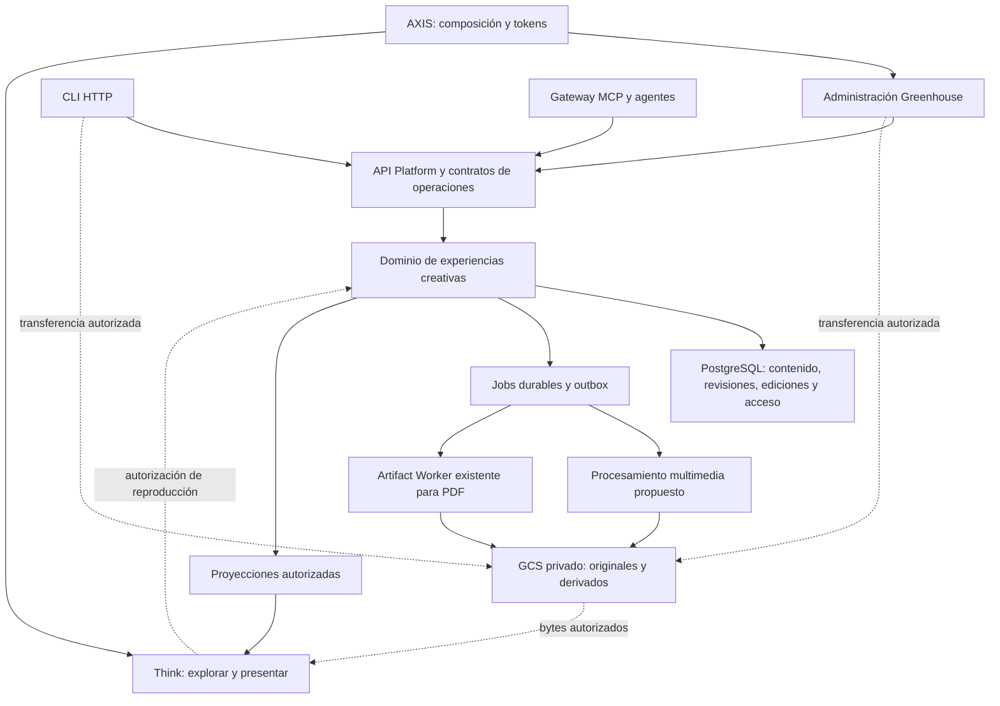

# Experiencia inmersiva de propuestas creativas — análisis inicial histórico

> **Corrección visual 2026-10-07:** para Rooms rige La órbita (`efeonce-graphic-line`), Bricolage editorial/Poppins funcional y componentes canónicos distribuidos por AXIS. Este antecedente no gobierna la estética actual; [dirección vigente](../ui/visual-directions/EFEONCE_ROOMS_VISUAL_DIRECTION_V1.md).

Fecha: 2026-10-07. Estado: **placement reemplazado; sin implementación ni rollout**.
Owner de la investigación inicial: Commercial/Product, con Platform, AXIS y Think.

> **Dirección vigente: Efeonce Rooms**, destino `rooms.efeonce.org`. El operador aceptó una plataforma comercial propia, fuera de Greenhouse/Think. Ver la [frontera aceptada](../architecture/sales-enablement/EFEONCE_SALES_ENABLEMENT_PLATFORM_DECISION_V1.md) y el [dossier actualizado de Rooms](../architecture/rooms/README.md), cuyo detalle espera el go final. Lo que sigue conserva la investigación anterior; sus propuestas de home, rutas, permisos y dependencias no son instrucciones para trabajo nuevo. La evidencia técnica se puede reutilizar bajo las nuevas fronteras.

## 1. Resultado y mandato

Construir un instrumento reusable para explorar, comprender y presentar pruebas creativas, junto al PDF existente. El champion habitual es el operador del prospecto: debe poder defender la propuesta ante su organización sin depender de que Efeonce participe en la reunión. Sika/POSIBLE es el primer caso posible, no una dependencia del modelo ni una autorización para rehacer su propuesta.

El operador ha definido inmersión, piezas estáticas de proporción arbitraria, piezas largas, audio, video, método y modo presentación. Añade **Full API Parity real para UI de administración, CLI y MCP**, tanto en lectura como en autoría y lifecycle, con la autoridad que corresponda. Esta exigencia es requisito del producto; las decisiones concretas de este documento son recomendaciones.

Recomendación inicial, ahora reemplazada: **dominio acotado en Greenhouse + renderer inmersivo en Think + contratos visuales AXIS + almacenamiento privado y procesamiento multimedia asíncrono en GCP**. La separación de producto aceptada conserva el análisis multimedia, pero sustituye los homes y adapters propuestos aquí.

## 2. Evidencia y límites de la investigación

Se inspeccionaron código local, manifiestos de dependencias y arquitectura. La muestra pública de Insights se recorrió en esta conversación: lectura interactiva y presentación de nueve láminas, con navegación por teclado. No se auditó en este análisis el estado vivo de IAM, flags, buckets, migraciones ni despliegues de los proveedores. Los estados históricos documentados no certifican disponibilidad actual.

| Base | Evidencia actual inspeccionada | Consecuencia |
|---|---|---|
| Greenhouse | Next.js 16.1.1, React 19.2.3, MUI 7.3.6, pg, Zod y Sharp declarados en package.json | Reutilizar portal, API Platform, PostgreSQL y patrones de almacenamiento. Son versiones del manifiesto local, no una recomendación de actualización |
| Think | Astro 7, React 19, Tailwind 4, GSAP y Zod declarados en su package.json | Ya tiene stack apropiado para SSR y una escena interactiva de carga selectiva |
| Proposal Studio | Aggregate Proposal, requisitos, evidencia, assets, lifecycle y renders; UI ProposalStudioView de lectura/descarga | Relacionar la experiencia con una Proposal cuando exista. El editor creativo todavía debe construirse |
| X-Ray | Caso, revisión, edición y grant; renderer multipieza; assets.ts admite PNG/JPEG/WebP, normaliza a WebP y limita a 10 MiB | Reutilizar patrones y componentes pertinentes. Su reader protegido no es una plataforma audiovisual |
| Insights | Ediciones congeladas, readers/commands, sharing, render durable y presentación | Referencia de lifecycle y presentación. Su biblioteca/builder sigue pendiente en el ledger; tampoco asumir que todos sus writes están federados |
| Artifact Worker | RenderConsumer devuelve PDF y slidePaths; Dockerfile empaqueta Playwright y Chromium | Reutilizar para PDF/previews. El contrato no describe transcodificación general |
| Marketing Studio | upload.ts y CLI local implementan ticket, transferencia, confirmación, hash y rama reanudable | Referencia concreta para el protocolo de carga. Studio sigue siendo dueño de sus campañas y assets |
| Globe | transform.ts tiene perfiles de poster, preview de video, waveform peaks y audio; arquitectura de Range/leases/fencing | Prior art técnico para revisar/reutilizar lógica pura bajo un contrato explícito. Su hibernación y fronteras descartan convertirlo en dependencia implícita de esta experiencia |
| AXIS | Contratos/tokens X-Ray en packages/contracts y packages/tokens | Home de la semántica visual portable, sin datos privados ni permisos comerciales |

Dos diferencias críticas: X-Ray excluye inicialmente el contrato delegado/MCP; Insights reserva emisión y otras acciones a determinados carriles humanos. **No copiar esas exclusiones como diseño final de esta nueva capacidad.** Definir desde el inicio los verbos y la autoridad necesaria en cada consumidor.

## 3. Personas, responsabilidades y calidad

| Persona/equipo | Necesidad | Evidencia para aceptar |
|---|---|---|
| Champion externo | Entender, ensayar, presentar, responder y retomar el relato | Una persona ajena a la producción completa una presentación y una desviación a detalle sin ayuda |
| Evaluador | Ver calidad, método y respuesta al encargo | Cada argumento importante abre una pieza o evidencia pertinente |
| Autor creativo/operador interno | Cargar y componer proyectos distintos con control editorial | Segundo cliente completo sin cambios de código ni contaminación del primero |
| Agente/CLI | Operar las mismas capacidades con resultados verificables | Importar por CLI, editar por UI y revisar por MCP deja un solo estado coherente |
| Platform/seguridad | Aislamiento, recuperación, acceso y costo controlados | Negativos entre organizaciones, retries sin duplicados, revocación y costos medidos |

Prioridades: fidelidad multimedia, continuidad de presentación, paridad operativa, aislamiento y recuperación.

## 4. Topología y ownership recomendados

### Greenhouse

Home propuesto: src/lib/commercial/creative-experiences, con contratos browser-safe, commands, readers, authz, store y jobs. Persistencia mediante los helpers PostgreSQL existentes, sin pool paralelo. Tablas con ownership explícito por organización dentro del dominio comercial; el DDL se diseña en la implementación.

La experiencia posee narrativa, assets vinculados, revisión, edición y distribución. Proposal conserva licitación, requisitos, oferta y resultado comercial; el cotizador conserva precios. Una referencia opcional a Proposal/CRM/campaña permite empezar una prueba para un prospecto sin fabricar una organización cliente contratante. El owner sigue siendo una organización operativa autorizada. El nombre del prospecto es contenido, no autorización.

### Think

Renderer SSR de una proyección versionada, con una escena React para interacción continua y módulos cargados según el material. Ruta propuesta propia, separada de /aeo-xray y /insights. Una nueva experiencia se publica como datos y assets sin requerir un commit/deploy por cliente.

El preview del editor usa este mismo renderer mediante un acceso de borrador autorizado. Puede abrir una ventana de preview; la elección de embed requerirá resolver origen y sesión. No duplicar el renderer de cliente en MUI.

### AXIS

Tipos de escena, roles visuales, tokens, composición y validación portable. No contiene Proposal, grants, rutas privadas ni expedientes. Definir un contrato de experiencia creativa propio que reutilice cimientos X-Ray sin introducir SEO/JSON-LD bancario en el modelo creativo.

Las versiones Zod de los consumidores difieren actualmente. Intercambiar JSON versionado y distribución generada verificable, no instancias de schemas entre procesos ni imports directos al source de otro repo. Contratos de operaciones son del dominio; contrato visual portable es de AXIS.

### Procesamiento y fuentes externas

Conservar Artifact Worker para sus salidas PDF/previews. Recomendar un **Cloud Run Job de medios acotado**, con FFmpeg/ffprobe y Sharp pinneados, separado del Chromium y de sus recursos. Compartir mecanismos de dispatch, correlación y recuperación que sean realmente portables, no mezclar colas mediante una modificación improvisada de RenderConsumer.

La frontera nueva es propuesta: requiere ADR con owner, envelope medido, coste, IAM, release y rollback. Alternativa de transición: ampliar el worker existente únicamente si un benchmark prueba que video/audio no afectan el PDF y se define un contrato multimedia explícito. La necesidad de aislamiento de CPU/memoria y bibliotecas nativas favorece el Job dedicado.

Studio, OneDrive u otros repositorios aportan originales mediante importadores autorizados. Registrar fuente, versión, hash y derechos; fijar los bytes de la edición. No consultar tablas ajenas ni reutilizar permisos/URLs de sus previews como autoridad. Los agentes pueden producir materiales mediante herramientas externas y luego cargarlos por el mismo contrato.

## 5. Modelo de contenido

| Entidad propuesta | Contenido |
|---|---|
| CreativeExperience | Owner, título, destinatario comercial, idioma y referencias opcionales a Proposal/CRM |
| DraftRevision | Contenido editable con revisión esperada y autor; cada cambio invalida la revisión aprobada cuando corresponde |
| Piece | Identidad creativa estable: master, pieza, storyboard, secuencia, audio o video |
| Variant | Adaptación editorial por audiencia/canal/formato; referencia una versión de asset |
| AssetVersion | Original inmutable, SHA-256 calculado/verificado, generation, MIME real, dimensiones orientadas, duración, perfil de color, provenance |
| Rendition | Derivado técnico del mismo original: thumbnail, preview, streaming, peaks, poster, tiles; perfil y herramienta versionados |
| Annotation | Fundamento con ancla a pieza, variante, región normalizada o rango temporal; clasificación por audiencia |
| MethodStep | Decisión/metodología vinculada a resultados y evidencia reales |
| Scene / Tour | Escenas y recorridos breve/completo: pieza, comparación, secuencia, texto, audio, video, orden y cues |
| Edition | Snapshot inmutable del contenido, contratos, assets y recorridos revisados |
| ShareGrant / PresenterGrant | Acceso de audiencia y acceso del champion, con permisos y expiración distintos |
| Job / Attempt | Estado, progreso, intentos, cancelación, resultados y códigos de fallo |

Una **variante** 4:5 es una adaptación diseñada; un **derivado** es una representación técnica. El sistema no crea ni valida una adaptación creativa por recortar automáticamente un master. Ratio se obtiene de dimensiones reales; 9:16, 4:5, 1,91:1 y 16:9 son opciones frecuentes, no un enum que excluya piezas largas.

Las notas internas de Efeonce, las notas compartibles con el champion y el contenido de audiencia son campos/proyecciones separados. El renderer público nunca recibe notas internas escondidas por CSS. Las capas de diseño o stems de audio sólo existen si se cargaron como materiales reales.

## 6. Paridad por capacidad

Propuesta de contratos, **no endpoints/tools existentes**. Namespace semántico ilustrativo: creative_experience.*. Todos los writes requieren actor y autoridad derivados del contexto autenticado. UI, CLI y MCP envían datos; no deciden permisos.

| Capacidad | Contrato común propuesto | UI | CLI | MCP |
|---|---|---|---|---|
| Descubrir esquema y permisos | catalog, capabilities | Sí | Sí | Sí |
| Crear/listar/leer/archivar | create, list, get, archive | Sí | Sí | Sí |
| Editar y comparar revisiones | draft.update, draft.diff | Sí | Sí | Sí |
| Preparar/importar un expediente | import.plan, import.apply, import.status | Sí | Sí | Sí |
| Reservar/consultar/cancelar/cerrar carga | upload.begin, upload.get, upload.cancel, upload.complete | Sí | Sí | Sí, con transferencia apropiada al host |
| Asociar/ordenar piezas y variantes | piece.upsert, variant.bind, piece.reorder | Sí | Sí | Sí |
| Autoría de método y anotaciones | method.upsert, annotation.upsert | Sí | Sí | Sí |
| Componer recorridos y notas | tour.upsert, presenter-notes.update | Sí | Sí | Sí |
| Procesar/leer/reintentar/cancelar jobs | media.request, job.get, job.retry, job.cancel | Sí | Sí | Sí |
| Validar y obtener preview | validate, preview.create | Sí | Sí | Sí |
| Revisar y registrar decisión | review.request, review.decide | Sí | Sí | Sí, según autoridad humana/delegación |
| Emitir/nueva versión/retirar edición | edition.issue, edition.revise, edition.withdraw | Sí | Sí | Sí, según autoridad humana/delegación |
| Crear/listar/revocar accesos | share.create, share.list, share.revoke | Sí | Sí | Sí |
| Vincular/descargar PDF o exportar paquete | attachment.bind, download.authorize, export.request | Sí | Sí | Sí |

Reglas de contrato:

- Un catálogo versionado declara operación, schema, respuestas, audiencia, permisos, efectos, errores e idempotencia. OpenAPI, documentación y schemas MCP derivan de esta fuente con guard de drift.
- Adapters App y Ecosystem consumen los mismos commands/readers; CLI es cliente HTTP. MCP se registra primero en el manifiesto Greenhouse y luego se federa con scopes y compatibilidad de issuer probados.
- expectedRevision evita pisar cambios. Misma idempotency key y request devuelve el mismo resultado; distinto request devuelve conflicto. Importación ofrece diff, remapea IDs y transacciona el contenido sólo después de verificar uploads; fallos parciales son consultables/reanudables.
- El mecanismo de aprobación es común a los canales, ligado a actor, acción, scope y digest de revisión. Un booleano confirmed del agente no es autoridad. Nexa conserva propose → confirm → execute. CLI/UI/MCP ofrecen el camino autorizado completo; permisos restringidos producen la misma denegación semántica.
- Paridad no implica que un grant de lectura pueda publicar. Tampoco transforma cada gesto efímero del visor en un write de servidor. Recorridos guardados, anotaciones y decisiones sí son capacidades persistidas.
- Upload tickets, grants y URLs de acceso no se guardan en replay genérico de idempotencia ni se vuelcan a logs. Separar recibos durables de secretos devueltos una sola vez. Un enlace perdido se revoca y reemplaza, no se recupera desde texto plano almacenado.

### Carga real desde MCP

Un servidor MCP remoto no puede leer /Users/... del equipo del usuario. El contrato separa **coordinar la carga** y **transportar bytes**. Un host con transferencia local usa CLI/bridge para cargar al ticket; otro host entrega un attachment handle compatible con un adaptador autorizado; un importador remoto sólo acepta fuentes permitidas, con límites y control de SSRF. La finalización vuelve al mismo command. Documentar y probar el recorrido por cada host: una tool que sólo reserva un upload no prueba carga operativa end-to-end.

Ejemplo de experiencia futura por CLI: init del expediente → validate local → import --dry-run → upload/import reanudable → composición de tours → preview → revisión → issue → share. Los nombres ejecutables se fijarán al definir el contrato; hoy no existe ese comando de esta herramienta.

## 7. Pipeline multimedia

1. begin autoriza actor/caso, tipo y cuota; reserva un ID y objeto de cuarentena únicos.
2. Navegador/CLI transfiere directamente a GCS con sesión reanudable. El servidor controla destino; el cliente nunca elige un bucket arbitrario.
3. complete verifica existencia y generation, tamaño real, firma MIME, checksum y pertenencia. El hash declarado por el cliente no constituye verificación.
4. Job inspecciona el archivo, limita recursos y protocolos, analiza seguridad y produce derivados por perfiles explícitos. El original conserva sus bytes.
5. Salidas verificadas se adjuntan atómicamente al asset y se publica el evento durable. Un archivo subido permanece no publicable hasta validación.
6. El editor muestra ready, processing, rejected, failed y retryable con causa y recuperación. Reconciliar uploads abandonados/huérfanos y limpiar sólo objetos sin referencias según retención.

Vercel documenta 4,5 MB para el payload de request/response de una Function; el camino binario a través del handler no es adecuado para estos originales [W1]. GCS soporta reanudar la transferencia y su session URI es una credencial bearer; caducidad de la reserva de aplicación y sesión GCS son distintas. Al cancelar/expirar, invalidar la sesión cuando aplique y denegar complete, sin suponer que el TTL de la app la revoca [W2].

| Tipo | Salidas propuestas |
|---|---|
| Imagen | Miniatura y previews por tamaño, orientación correcta, perfil web y transparencia; original conservado. Tiles sólo para imágenes realmente grandes, con thumbnail/overview |
| Video | ffprobe, poster, MP4 de preview con faststart, storyboard técnico de thumbnails, subtítulos WebVTT cargados/revisados; HLS adaptativo según perfil y peso/duración |
| Audio | Preview de escucha, peaks precomputados y duración; marcadores, transcripción y stems aportados/revisados. No normalizar destructivamente el master |
| PDF | Adjunto versionado descargable; previews por página cuando aporten a la navegación. Extraerlo no reconstruye editables, capas ni medios originales |
| AI/PSD y otros editables | Fuente privada/download con permiso; preview exportado separado. No ejecutarlos ni prometer render web nativo |

Jobs con lease, fencing, backoff limitado, límite de intentos, cancelación cooperativa y eventos/outbox. Identidad de derivado incluye source generation/hash, perfil, parámetros y versión del transformador. Dos workers no pueden finalizar el mismo intento; un retry no sobrescribe un original.

## 8. Interacción y reproducción

| Necesidad | Elección recomendada |
|---|---|
| Escena y continuidad | React/TypeScript dentro de Think; estado explícito de pieza, variante, modo, zoom y reproducción. Router/enlaces profundos guardan navegación, no secretos |
| Diseño y movimiento | AXIS + CSS/Tailwind de Think; View Transitions/WAAPI y GSAP ya disponible según interacción. Un solo dueño por propiedad animada; reduced motion conserva significado |
| Zoom/pan/compare | Pointer Events + transforms y coordenadas normalizadas; controles equivalentes por teclado. Una librería de deep zoom se justifica sólo si el fixture de gran formato lo requiere |
| Video | HTMLMediaElement, WebVTT y hls.js bajo detección y pruebas de compatibilidad; Safari puede usar HLS nativo. MP4 como fallback probado [W3] |
| Audio | HTMLAudioElement + WaveSurfer para waveform/regions con peaks generados en servidor. La biblioteca advierte del costo de decodificar archivos grandes y exige peaks/duración para streaming [W4] |
| Stems | Web Audio cuando existan pistas alineadas; un reloj/bus de reproducción y una política clara al cambiar de pieza. No varios players autónomos disparados a la vez |
| Presentador | Misma escena; ventana de audiencia y consola de notas autorizadas. BroadcastChannel comunica comandos/estado entre ventanas del mismo origen/partición [W5] |

El contrato de presentación lleva sessionId opaco, revision, secuencia de mensajes y acknowledgements; no transmite notas ni credenciales a audiencia. Si una ventana se desconecta, la pantalla de audiencia permanece operable y la consola informa el estado. Popup bloqueado o fullscreen no disponible conserva modo presentación dentro de la ventana. Probar reconexión, proyector, doble monitor y audio compartido en una videollamada real.

BroadcastChannel no es control remoto entre equipos ni autorización. Control desde otro dispositivo requeriría sesión autorizada y transporte servidor, como extensión posterior. No hace falta WebSocket para el recorrido básico en dos ventanas del mismo equipo.

El video progresivo ofrece seek por tiempo, no garantía de inspección exacta de cada frame por currentTime. Si esa precisión es necesaria, producir frames o un mecanismo explícito y probarlo. La reproducción manda sobre los cues; no avanzar de escena automáticamente por un timer que ignore buffering.

## 9. Autoría interna y paquete portable

UI en Greenhouse: biblioteca → expediente → bandeja de medios → piezas/variantes → relato/método → recorridos → revisión → distribución. Misma capability para arrastrar orden en UI y enviar orden por CLI. Formularios de contenido tipado, sin HTML/JavaScript arbitrario proporcionado por un cliente.

Paquete portable sugerido: experience.json (contenido/IDs lógicos), assets.json (referencias, hashes y metadatos), carpeta media local opcional y notas privadas explícitamente clasificadas. El importador resuelve archivos, valida rutas y tamaño, prepara diff y remapea IDs. Ningún paquete exportado contiene grants, session URIs, credenciales ni URLs temporales.

Emisión fija un snapshot inmutable y los assets exactos. Corregir genera nueva edición. El PDF de Sika puede adjuntarse intacto; composición automática de otro PDF es una capacidad adicional sobre Composer, no una condición para consumir un PDF existente.

## 10. Acceso, publicación y entrega de medios

Estados de autoría: draft → in_review → approved. Emitir crea una edición inmutable; compartir crea un grant; retirar deniega esa edición. Las transiciones autoritativas y el review digest se revalidan en servidor en cada command, independientemente del canal.

Separar: autores internos con Efeonce ID/capabilities; champion con presenter access explícito; evaluador con acceso de lectura. El champion no hereda acceso a Greenhouse. Un enlace bearer reenviado no acredita identidad; si se necesita identidad nominativa, usar acceso autenticado. No activar ese requisito por inferencia.

Recomendación inicial de transporte: GCS privado y tickets de descarga/reproducción de vida corta, emitidos tras validar edición/grant/asset/representación. Client-facing sólo obtiene derivados y adjuntos expresamente permitidos; originales/editables tienen permiso propio. Metadatos públicos allowlisted, no-store/noindex/no-referrer, CSP y redacción de tokens.

**Contrato de revocación honesto:** retirar el grant impide nuevos tickets; las URLs firmadas ya emitidas conservan acceso hasta expirar [W6]. Un request admitido o bytes ya descargados no se recuperan. TTL inicial de 60 segundos es una propuesta a medir, no un SLA ni una garantía de corte en 60 segundos. HLS necesita renovación coherente de manifiestos y segmentos; CORS/Range/Content-Range/206/416 forman parte de la prueba de reproducción.

Si se exige comprobar revocación en cada Range/segmento, elegir un gateway de medios con streaming/backpressure y autoridad por request —Globe documenta un precedente— mediante ADR de topología; no usar un arrayBuffer gigante en Vercel ni afirmar esa garantía usando URLs firmadas. Un CDN protegido se incorpora cuando tráfico/costo lo justifiquen; no publicar el bucket para simplificar playback.

Aprobación, emisión y acceso no implican envío de email, envío a Wherex ni adjudicación. Esos actos siguen en sus dominios; pueden referenciar la edición aprobada sin duplicar el lifecycle comercial.

## 11. Alternativas evaluadas

| Alternativa | Evaluación |
|---|---|
| Sitio por propuesta con archivos en Git/public | Útil para un experimento aislado; falla como objetivo por ausencia de autoría dinámica, control de acceso y paridad |
| Añadir todo al modelo AEO X-Ray | Reutiliza el shell, pero sus entidades SEO y media raster introducen acoplamiento; extraer/reusar patrones, conservar dominio propio |
| Hacerlo módulo de Insights | Reutiliza edición/presentación; mezcla métricas/períodos y permisos que no describen una prueba creativa |
| Usar Marketing Studio como fuente de verdad completa | Fuente valiosa de piezas; el lifecycle de campaña no sustituye expediente de preventa, recorridos y evaluación. Integrar por API |
| Convertir Globe en backend obligatorio | Tiene prior art audiovisual, pero es plataforma hermana hibernada; no es prerrequisito razonable de esta herramienta |
| Nuevo SaaS/CMS/DAM y nuevo frontend completo | Añade operaciones y autoridad paralelas; el stack actual cubre el núcleo. Reevaluar servicio gestionado de video si la operación/transcodificación propia domina el costo |
| Greenhouse + Think + AXIS + media GCP | Recomendada: ownership claro, reutilización concreta y capa multimedia explícita |

## 12. Verificación y límites propuestos

Objetivos a medir, **no resultados alcanzados ni SLA**:

- Presentación visual inicial: p75 LCP ≤2,5 s sobre dispositivo/red de referencia definidos; cargar primero poster, nunca toda la biblioteca multimedia.
- INP p75 ≤200 ms; medir pan/zoom con un teléfono de referencia y piezas largas. Limitar memoria mediante previews/tiles, no un canvas del tamaño de todos los originales.
- Inicio de preview audiovisual ≤2 s con red de referencia y encoding acordados; reportar buffering/fallo y conservar la escena cuando falta red.
- 100% de capacidades comprometidas con caso positivo y negativo UI/HTTP/CLI/MCP. Prueba cruzada: crear por CLI → editar UI → leer MCP → emitir con autoridad → reproducir en Think.
- Idempotencia, conflicto de revisión, fallo durante upload, lease vencido, doble worker, cancelación y retry verificados.
- Aislamiento de dos organizaciones, audiencia/champion, draft/edition y originales/derivados; notas privadas ausentes en HTML, JSON, exports y mensajes de audiencia.
- Fixtures de proporciones diversas, imagen larga/grande, PNG transparente, video vertical/horizontal, audio, captions, storyboard y PDF. Segundo caso de otra marca sin modificar componentes.
- Playback y accesibilidad en Safari/iOS, Chrome/Android y desktop, teclado/reduced motion, fullscreen rechazado y doble ventana. Capturas miradas de desktop/móvil y una presentación real con operador.

Operación: correlationId de import/job/edition; métricas de tiempo en cola, fallo de derivación, bytes servidos, inicio/buffering y orphaned uploads. Analytics de experiencia sólo con propósito y datos mínimos: una apertura no prueba lectura ni influencia en adjudicación. Nunca capturar URLs con grants/notas.

Costo a modelar con medición: GB-mes de originales/derivados + GB entregados × reproducciones + CPU/memoria-minuto de procesamiento + operaciones de storage + renders PDF. No hay baseline de volumen ni presupuesto observado; no dar una cifra mensual ficticia. Cuotas por experiencia/archivo/minutos, perfiles de encoding, retención y GC deben ser configurables y revisables.

## 13. Secuencia de construcción

1. **Decisiones y contrato:** ADR de dominio/paridad y frontera multimedia; modelo de contenido, capability catalog, permisos, import/export, edición/grants y perfiles de medios. Derivar contratos de todos los consumidores desde esta unidad.
2. **Prueba vertical operable:** una experiencia con imagen, audio, video y PDF; carga reanudable, job, revisión, edición y acceso. Ejercitar UI mínima, CLI y MCP reales, no sólo registrar schemas.
3. **Autoría y escenario:** método, anotaciones, variantes, piezas largas, comparación, zoom y reproducción; renderer único para preview y edición.
4. **Champion:** recorridos, notas autorizadas, consola/pantalla y recuperación; prueba de reunión de Sika con el material existente.
5. **Reuso y operación:** segundo cliente, HLS/perfiles y gran formato donde proceda, degradación, métricas/costos, recuperación, QA visual y canary completo.

La primera prueba vertical reduce riesgo sin declarar acabado el producto. La aceptación de la experiencia completa requiere todos los medios y modos comprometidos. Estimación de esfuerzo y configuración final de infraestructura siguen pendientes del spike multimedia y del inventario exacto de materiales.

## 14. Decisiones arquitectónicas a formalizar

- Propiedad del aggregate CreativeExperience, relación opcional con Proposal y contrato portable AXIS.
- Catálogo común de capacidades y camino humano/delegado de revisión, emisión y sharing, incluyendo MCP con Efeonce ID.
- Ingesta privada, identidad de originales/derivados, worker de medios y su frontera de despliegue.
- Garantía de revocación y transporte de medios: tickets cortos frente a gateway por request.

Este análisis propone esas decisiones; no modifica los ADR Accepted de X-Ray, Insights, Proposal ni Globe. No se crea un producto comercial/nombre oficial, repositorio, paquete, deployable, token, subida o envío con este documento. Documentación funcional y manual se deben escribir con los contratos implementados; no corresponde presentar comandos ficticios como operativos ahora.

## 15. Fuentes verificadas

### Código y arquitectura local, inspección 2026-10-07

- [Full API Parity](../architecture/GREENHOUSE_FULL_API_PARITY_DECISION_V1.md).
- [Proposal Studio](../architecture/GREENHOUSE_TENDER_PROPOSAL_STUDIO_ARCHITECTURE_V1.md), src/lib/commercial/tenders/proposals/types.ts y src/views/greenhouse/commercial/proposals/ProposalStudioView.tsx.
- [X-Ray: composición/acceso](../architecture/EFEONCE_AEO_XRAY_COMPOSITION_AND_SHARING_DECISION_V1.md), src/lib/aeo-xray/assets.ts.
- [Insights: ledger](../../.codex/skills/efeonce-insights/references/program-ledger.md), [skill](../../.codex/skills/efeonce-insights/SKILL.md), src/mcp/greenhouse/tool-manifest.ts.
- [Artifact pipeline](../architecture/GREENHOUSE_ARTIFACT_RENDER_PIPELINE_V1.md), services/artifact-worker/consumer-contract.ts y Dockerfile.
- [Fronteras](../architecture/GREENHOUSE_BUILD_UNIT_DECOMPOSITION_DECISION_V1.md), [placement](../operations/MODULAR_MIGRATION_NEW_WORK_OPERATING_MODEL_V1.md).
- scripts/marketing-studio/upload.mjs; repo hermano efeonce-marketing-studio/packages/domain/src/media/upload.ts.
- [Globe: derivados/Range](../architecture/creative-studio/EFEONCE_GLOBE_MEDIA_DERIVATIVES_V1.md); repo hermano efeonce-globe/apps/media-derivatives/src/transform.ts. Se leyó código; no se despertó el runtime.
- Repo hermano efeonce-think/package.json y src/scripts/insights-report.ts; repo axis-design-system/packages/contracts/src/aeo-xray*.ts.

### Proveedores y bibliotecas, consulta 2026-10-07

- W1: [Vercel Functions Limits](https://vercel.com/docs/functions/limitations), límite de payload.
- W2: [GCS resumable uploads](https://docs.cloud.google.com/storage/docs/resumable-uploads), transferencia reanudable y seguridad de session URI.
- W3: [hls.js, documentación oficial](https://github.com/video-dev/hls.js), soporte HLS/MSE y compatibilidad nativa.
- W4: [WaveSurfer](https://wavesurfer.xyz/docs/), waveform, regiones y peaks para archivos grandes/streaming. Seleccionar y fijar versión tras el spike; no instalar latest por inferencia.
- W5: [Broadcast Channel](https://developer.mozilla.org/en-US/docs/Web/API/Broadcast_Channel_API), comunicación bajo mismo origen/partición.
- W6: [GCS signed URLs](https://docs.cloud.google.com/storage/docs/access-control/signed-urls), acceso por posesión hasta expiración.
- [ffprobe](https://ffmpeg.org/ffprobe.html) y [FFmpeg filters](https://ffmpeg.org/ffmpeg-filters.html), inspección y transformaciones deterministas.
- [Astro islands](https://docs.astro.build/en/concepts/islands/), separación de contenido renderizado e interacción selectiva.

Las fuentes acreditan capacidades, no compatibilidad completa del producto ni un benchmark. Las bibliotecas nuevas, perfiles y superficies compartidas requieren pruebas y versiones fijas al implementar.
