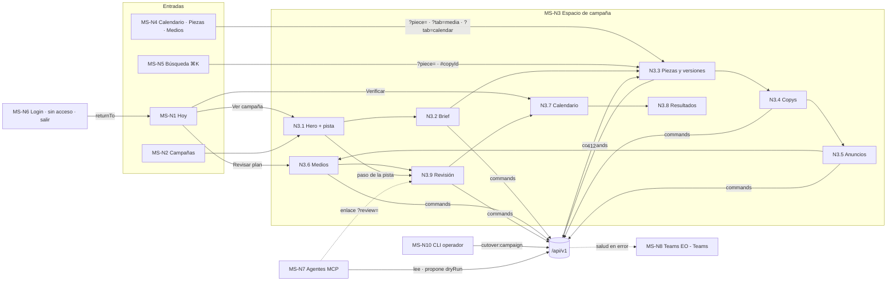

# EPIC-049 — Efeonce Marketing Studio · Master UI Flow Contract

> **Qué es:** el contrato de flujo **cross-surface** del programa Efeonce Marketing Studio
> (`studio.efeonce.org`, repo `efeoncepro/efeonce-marketing-studio`). Un modelo de dominio (`packages/domain`), un
> contrato (`/api/v1`, OpenAPI 3.1 desde `packages/contracts`) y varios clientes: la web de Studio, la CLI de
> operador y los agentes por Efeonce MCP. Conecta las tasks del programa para que sean nodos de un mismo sistema, no
> pantallas sueltas, y fija dónde vive cada acción, quién puede ejecutarla y qué ve cada actor cuando no puede.
> **No reemplaza** los wireframe/flow por task: los enlaza y es dueño de los nodos `MS-N1…MS-N10`.

## Meta

- Status: `draft` (2026-09-25)
- Epic: `EPIC-049` (`docs/epics/in-progress/EPIC-049-efeonce-marketing-studio-platform.md`)
- Arquitectura: `docs/architecture/marketing-studio/EFEONCE_MARKETING_STUDIO_ARCHITECTURE_V1.md` (§4 contrato, §5 acceso,
  §8 interfaz) + `docs/architecture/EFEONCE_STUDIO_API_FIRST_DECISION_V1.md`.
- Skills de product design aplicadas: `info-architecture` (líder: organización, etiquetas, los cuatro sistemas de
  navegación, URLs y wayfinding), `state-design` (matriz de estados por superficie, degradado honesto, vacío ≠ cero),
  `greenhouse-ux-writing` (convención de ids de copy, tuteo en español neutro, razones de bloqueo que explican).
- Tasks conectadas: 1887 (fundación, completa), 1890 (contrato para agentes), 1891 (federación MCP), 1892 (métricas),
  1893 (originales + worker + Metricool), 1894 (commands + corte de autoridad), 1895 (UI de edición), 1896
  (observabilidad + Teams), 1897 (`CONNECT` de PUBLIC, sin UI), 1898 (login Efeonce ID, última).
- Flow files por task: `docs/ui/flows/TASK-1895-marketing-studio-editing-review-metrics-flow.md` (nodo central
  `MS-N3`). Wireframe: `docs/ui/wireframes/TASK-1895-marketing-studio-editing-review-metrics.md`.
- Runtime verificado al escribir este contrato (repo de Studio, `apps/web/src`): rutas `/`, `/campaigns`,
  `/campaigns/[campaignId]` con `?tab=pieces|copies|ads|media|calendar` y `?piece=`, `/calendar?month=`, `/library`,
  `/media`; `Shell` (rail, topbar con migas, ⌘K, píldora «Solo lectura» en modo `open`, `ThemeToggle`), `Nav`
  (`Rail` + `BottomNav`), `CommandPalette`, `Pipeline`, `PiecesWorkspace`, `MediaPlanView`; 12 rutas de lectura en
  `packages/contracts/src/openapi.ts`; copy único en `apps/web/src/copy.ts`.

## 0. Decisiones del operador que este flujo incorpora (2026-09-25)

| Decisión | Consecuencia en el flujo |
|---|---|
| Escriben `efeonce_admin`, `efeonce_operations`, `efeonce_account` y `designer` (capability `marketing_studio.campaign.write`) | la proyección de permisos del reader decide `writable`; la UI nunca lee roles (§3) |
| El brief es entidad propia (`studio.campaign_brief` + audiencias + KPIs) con edición completa | nace la superficie `MS-N3.2 Brief` (§4, §11) |
| El monto del brief es un **sobre** y nunca se suma con las líneas propuesto/aprobado/real del plan de medios | cuatro cifras separadas y etiquetadas; ninguna aritmética entre ellas en ningún cliente (§11.3) |
| La API de Metricool está disponible | la evidencia de publicación llega por readback (TASK-1893), no por fecha; Hoy y Calendario la muestran con `observedAt` (§6, Journey A pasos 9–10) |
| Las alertas van a Teams, canal «EO - Teams» | la superficie de incidente vive fuera de Studio (`MS-N8`) |
| El login con Efeonce ID es lo último (TASK-1898); hasta entonces Studio es abierto y de solo lectura | toda acción de edición se **ve** y está `aria-disabled` con una razón honesta; nada se esconde ni se finge (§3.2) |

## 1. La espina dorsal: un modelo de dominio, muchas superficies

```text
                    packages/domain  (commands · readers · policy de acceso · máquinas de estado)
                           │  un Actor por llamada; ninguna regla vive en handlers ni componentes
                    packages/contracts (zod → OpenAPI 3.1 → manifiesto de tools con manifestHash)
                           │
          ┌────────────────┼──────────────────────────┬──────────────────────────┐
     /api/v1 (HTTP)   Server Components            CLI de operador           Efeonce MCP (gateway)
     writes y reads   sólo LECTURAS en proceso,    operator_cli: import,     api_client de servicio +
     de todo cliente  con el mismo actor y policy  cutover, export, altas    persona (capability+membership)
          │                │                           │                          │
      web (cliente)    web (render)               terminal del operador     agentes (Claude, Codex, …)
```

Reglas duras que todo nodo hereda:

1. **Una lectura canónica, muchos consumidores.** Las páginas leen con los readers del dominio en proceso; la API, la CLI
   y el gateway leen los mismos readers. Nadie recalcula un estado, un umbral, una suma o una frescura en su capa.
2. **Una sola vía de escritura: `/api/v1`.** La web escribe por HTTP desde un cliente único
   (`apps/web/src/client/studio-api.ts`, TASK-1895) con `Idempotency-Key`, `If-Match` y `X-Correlation-Id`. No hay
   Server Actions ni rutas propias de la UI: si un command no está en el OpenAPI, su affordance no se construye.
3. **Full API Parity por construcción.** Cada operación del OpenAPI tiene una tool en el manifiesto o una exclusión con
   razón (guard de TASK-1890). Una acción visible sin command es un bug de diseño, no un atajo.
4. **Sin actualización optimista.** Montos, estados, copy literal y versiones se pintan como los devuelve el servidor
   tras `router.refresh()`.
5. **Los permisos llegan resueltos.** El servidor entrega `writable`, `lockReason`, transiciones permitidas y
   `revision`; ningún cliente (web, CLI, agente) deduce permisos por rol o por fecha.

## 2. Arquitectura de información

### 2.1 Sistemas de organización (por qué hay cinco destinos)

Studio organiza el mismo modelo de cuatro maneras, porque el operador llega con cuatro preguntas distintas:

| Pregunta del operador | Sistema de organización | Destino | Nodo |
|---|---|---|---|
| «¿Qué necesita una decisión mía hoy?» | por tarea (atención) | Hoy `/` | `MS-N1` |
| «¿Cómo va la campaña X?» | por objeto (la campaña es el hub) | Campañas `/campaigns` → Espacio de campaña | `MS-N2`, `MS-N3` |
| «¿Qué sale y cuándo?» | por tiempo | Calendario `/calendar` | `MS-N4` |
| «¿Qué piezas o qué plata tenemos?» | por inventario | Piezas `/library`, Medios `/media` | `MS-N4` |

La campaña es el único lugar donde se **edita**. Hoy, Calendario, Piezas, Medios y ⌘K son entradas con olor de
información (`information scent`) que siempre aterrizan en la pestaña y el elemento correctos del espacio de campaña.
Así una regla de edición, conflicto o permiso se diseña una vez, en `MS-N3`, y no se reparte en cinco pantallas.

### 2.2 Los cuatro sistemas de navegación

| Sistema | Superficie vigente | Contrato |
|---|---|---|
| Global | `Rail` de 76 px (Hoy · Campañas · Calendario · Piezas · Medios); `BottomNav` bajo 860 px | máximo 5 destinos; `aria-current="page"` siempre visible; el espacio de campaña activa «Campañas» |
| Local | pestañas del espacio de campaña (`nav.tabs`, `?tab=`) | 7 pestañas tras este programa (§4); scroll interno contenido en 390 px |
| Contextual | tarjetas de Hoy, eventos del Calendario, filas de Medios, tiles de Piezas, pista de tres estados | cada una lleva a pestaña + elemento (`?tab=`, `?piece=`, `#copyId`, `?review=`) |
| Suplementario | ⌘K (`CommandPalette`: campañas, piezas, copys + atajos «Ir a») | busca por `GET /api/v1/search`; la hoja abierta tiene prioridad sobre ⌘K |

Hallazgo verificado en el runtime (`Nav.tsx`): `BottomNav` omite «Piezas» (`/library`) y los atajos «Ir a» de ⌘K sólo
cubren Hoy, Calendario y Medios. En 390 px, `/library` sólo se alcanza por URL directa. Se resuelve agregando «Ir a
piezas» a ⌘K (preferido: no rompe el límite de 4 destinos de la barra inferior); queda como delta para TASK-1895 (§17).

### 2.3 Etiquetas

Las etiquetas visibles son las del copy vigente y no se renombran: «Hoy», «Campañas», «Calendario», «Piezas», «Medios»,
pestañas «Piezas · Copys · Anuncios · Medios · Calendario» + «Brief» y «Resultados» (nuevas). Los tres estados se
nombran siempre igual en todas las superficies y en el manual para agentes: **Creatividad**, **Autorización de
medios**, **Lanzamiento** (`COPY.states.*`). Las cuatro cifras de dinero se nombran siempre igual: **Sobre del brief**,
**Propuesto**, **Aprobado**, **Gasto real**. Nunca «Presupuesto» a secas, porque es ambiguo entre las cuatro.

### 2.4 Wayfinding (los cinco de siempre)

| Necesidad | Respuesta en Studio |
|---|---|
| ¿Dónde estoy? | `<title>`, `h1` de la página (nombre de campaña en `MS-N3`), migas jerárquicas del `Shell` (`Campañas / CMP-001`), pestaña con `aria-current` |
| ¿A dónde puedo ir? | rail o barra inferior + pestañas + ⌘K |
| ¿Cómo vuelvo? | «atrás» del navegador (las hojas no empujan historial), migas, cerrar hoja con retorno de foco |
| ¿Qué hay alrededor? | pista de tres estados, inspector de pieza (anuncios y copys de la pieza), eventos enlazados a su campaña |
| ¿Qué acaba de pasar? | una región `aria-live="polite"` en `Shell` + la vista releída del servidor |

## 3. Actores y resolución de superficie

### 3.1 Actores

| Actor | Cómo se identifica | Autoridad | Superficies |
|---|---|---|---|
| Visitante abierto | `anonymous_open` (modo `STUDIO_ACCESS_MODE=open`, vigente) | lee todo lo importado; no escribe; no descarga originales (`download_disabled`) | `MS-N1…MS-N5` en solo lectura con razón visible |
| Persona Efeonce con lectura | sesión de Studio tras `auth.efeonce.org` (TASK-1898) | `marketing_studio.campaign.read` + membership de la organización | `MS-N1…MS-N5` en solo lectura con razón «sin permiso de edición» |
| Persona Efeonce con escritura | ídem + `marketing_studio.campaign.write` (roles `efeonce_admin`, `efeonce_operations`, `efeonce_account`, `designer`) | commands de TASK-1894 sobre campañas con `source_of_truth='studio'` | `MS-N1…MS-N5` con edición |
| Operador por CLI | `operator_cli` (credencial de migrador/operador) | import, `cutover:campaign`, `export:catalog`, `api-client:*`, `media:ingest`, `media:rights` | `MS-N10` (sin UI) |
| Servicio (`api_client`) | `Authorization: Bearer` sha256 con scopes (`studio:read`, `studio:write`, `studio:assets:download`) y organizaciones permitidas | intersección scopes × organizaciones; organización del request nunca concede acceso | transporte del gateway y de integraciones |
| Agente por MCP | persona detrás del gateway (capability + membership) + `api_client` del gateway hacia Studio | lecturas directas; escrituras sólo `propose → confirm` (§5.3) | `MS-N7` (sin UI propia) |
| Cliente externo (futuro) | — | fuera de alcance del programa: requiere grant, consentimiento y piloto | ninguna |

### 3.2 Resolución de superficie por modo de acceso, capability y autoridad

El servidor resuelve una sola proyección por página y campaña. La UI la **consume**; nunca la reconstruye.

| Condición (se evalúa en este orden) | Resultado | `lockReason` | Copy |
|---|---|---|---|
| `efeonce_id` y sin sesión | páginas: 302 a `/auth/login?returnTo=<ruta relativa>`; API: 401 | — | (pantalla del emisor) |
| sesión válida y 0 organizaciones | 403 «sin acceso», sin crear sesión | — | `studio.auth.noAccess.*` |
| modo `open` | lectura completa; toda acción de edición `aria-disabled` | `open_mode` | `studio.write.reason.open` |
| sesión sin `marketing_studio.campaign.write` | lectura; edición `aria-disabled` | `missing_capability` | `studio.write.reason.noCapability` |
| campaña con `source_of_truth='onedrive'` | lectura; edición de **esa** campaña `aria-disabled` | `authority_onedrive` | `studio.write.reason.onedrive` |
| todo lo anterior superado | edición habilitada; transiciones = las que el reader declara | `null` | — |

Orden de precedencia del `lockReason` (propuesta de este contrato, la confirma TASK-1894 en su proyección): el motivo
más general gana, porque es el que la persona puede resolver primero. Una sola razón por vez; nunca una lista.

Regla de affordance (decisión del operador): una acción no disponible **se ve**, es enfocable (`aria-disabled="true"`,
no `disabled`) y al activarla abre `WriteGateNotice` con la razón. Nunca un botón muerto sin explicación, nunca una
acción escondida que aparece «por arte de magia» el día del login. Excepción deliberada: «Activa» (`live_observed`)
nunca es una acción, ni deshabilitada, porque ningún actor puede marcarla (§8.1).

## 4. Inventario de superficies (todos los nodos)

Los nodos `MS-N1…MS-N7` los declaró el flow de TASK-1895 y se conservan sin renombrar. Desde este contrato su dueño es
el master flow; `MS-N3` se descompone en subnodos y se agregan `MS-N8…MS-N10`.

| Nodo | Superficie | Ruta | Dueña | Estado |
|---|---|---|---|---|
| `MS-N1` | Hoy — decisiones pendientes, próximas publicaciones, inventario | `/` | TASK-1887 (lectura); enlaces a revisión: TASK-1895 | en vivo (lectura) |
| `MS-N2` | Campañas — hero destacado + tarjetas con pista, filtros | `/campaigns?filter=all\|pending\|production\|blocked` | TASK-1887 | en vivo |
| `MS-N3` | Espacio de campaña (nodo central) | `/campaigns/[campaignId]` | TASK-1887 + TASK-1895 | en vivo (lectura); edición en diseño |
| `MS-N3.1` | Hero: código · servicio · dominio, título, acciones (`Brief y decisiones`, `Editar campaña`, `Revisión`), pista de tres estados | — | TASK-1895 | diseño |
| `MS-N3.2` | **Brief** (lectura por secciones + edición por sección en hoja) | `?tab=brief` | TASK-1895 sobre `upsertCampaignBrief` (TASK-1894) | **nuevo, sin artboard** |
| `MS-N3.3` | Piezas: tablero concepto × formato, inspector con vista en feed, **Versiones**, **Derechos**, subida, descarga | `?tab=pieces` (defecto) `&piece=` | TASK-1887 + TASK-1895 sobre 1893/1894 | lectura en vivo; resto diseño |
| `MS-N3.4` | Copys literales por concepto, edición con diff | `?tab=copies#copyId` | TASK-1887 + TASK-1895 | lectura en vivo |
| `MS-N3.5` | Anuncios: lista, nuevo/editar configuración con UTM | `?tab=ads` | TASK-1887 + TASK-1895 | lectura en vivo |
| `MS-N3.6` | Medios: flight + Propuesto · Aprobado · Gasto real, editar propuesta, registrar aprobación | `?tab=media` | TASK-1887 + TASK-1895 | lectura en vivo |
| `MS-N3.7` | Calendario de la campaña: posts con estado observado | `?tab=calendar` | TASK-1887 (+ evidencia Metricool de TASK-1893) | lectura en vivo |
| `MS-N3.8` | Resultados: una tarjeta por fuente (Search Console, GA4, SEO, Pauta) con ventana y frescura | `?tab=results` | TASK-1895 sobre TASK-1892 | diseño |
| `MS-N3.9` | Hoja de revisión de tres estados + historial | `?review=creative\|media\|launch` (se consume) | TASK-1895 sobre TASK-1894 | diseño |
| `MS-N3.x` | Superpuestas: `Sheet`, `ConfirmDialog`, `ConflictDialog`, `UploadVersionDialog`, `WriteGateNotice` | sin URL | TASK-1895 | diseño |
| `MS-N4` | Calendario global (vuelos por semana, posts vencidos a verificar), Piezas globales, Medios globales | `/calendar?month=YYYY-MM`, `/library`, `/media` | TASK-1887 | en vivo |
| `MS-N5` | Búsqueda ⌘K | overlay global | TASK-1887 | en vivo |
| `MS-N6` | Login Efeonce ID (redirect), callback, **sin acceso**, **control de cuenta / salir** | `/auth/login`, `/auth/callback`, `POST /auth/logout` | TASK-1898 (runtime) + delta de UI en TASK-1895 | diseño |
| `MS-N7` | Agentes por Efeonce MCP (tools `studio.*`) | `mcp.efeonce.org/mcp` | TASK-1890 (manifiesto) + TASK-1891 (federación) | diseño; no es superficie visual |
| `MS-N8` | Salud e incidentes: aviso en Teams «EO - Teams» + señal en el Reliability Control Plane de Greenhouse | fuera de Studio | TASK-1896 | diseño; **Studio no agrega UI** |
| `MS-N9` | Estados de error de página de Studio (`notFound`, «No pudimos cargar esta vista») | todas | TASK-1887 (vigente) | en vivo |
| `MS-N10` | CLI de operador (import, corte, export, altas de `api_client`, ingesta y derechos) | terminal | TASK-1887/1890/1893/1894 | parcial |

Superficies que el programa **no** tiene y conviene no fingir: crear campaña, crear concepto, crear copy, programar
posts y registrar gasto real en la web. Los commands existen (TASK-1894) para CLI y agentes; la UI de TASK-1895 los
deja fuera de alcance. Mientras no tengan dueño, la web no muestra «Nueva campaña» ni «Programar» (§18, pregunta 3).

## 5. Mapa de commands gobernados (Full API Parity)

Nombres de tools: los propuestos por TASK-1890 (lecturas) y TASK-1894 (escrituras); los confirma el manifiesto con
`mcp-craft`. Rutas de escritura: método y recurso **indicativos**; el OpenAPI de TASK-1894 fija la ruta exacta.

### 5.1 Lecturas

| Acción en la UI | Reader / ruta | Tool MCP | Nodo |
|---|---|---|---|
| Ver decisiones de Hoy | `GET /api/v1/attention` | `studio.attention.get` | `MS-N1` |
| Listar campañas | `GET /api/v1/campaigns` | `studio.campaigns.list` | `MS-N2` |
| Abrir campaña (con estados, `revision` y proyección de permisos) | `GET /api/v1/campaigns/{id}` | `studio.campaign.get` | `MS-N3` |
| Ver brief | reader del brief de TASK-1894 (en el detalle o ruta propia; lo fija el OpenAPI) | tool de lectura del brief (a declarar en el manifiesto) | `MS-N3.2` |
| Ver piezas | `GET /api/v1/campaigns/{id}/assets` | `studio.campaign.assets.list` | `MS-N3.3` |
| Ver ficha de pieza (versiones, renditions, anuncios, copys, derechos) | `GET /api/v1/assets/{assetId}` | `studio.asset.get` | `MS-N3.3` |
| Ver miniatura / preview | `GET /api/v1/renditions/{id}` | `studio.asset.preview` (imagen MCP) | `MS-N3.3`, `MS-N4` |
| Descargar original (URL firmada 10 min, auditada) | `GET /api/v1/assets/{assetId}/versions/{n}/download` | `studio.asset.download` | `MS-N3.3` |
| Ver copys | `GET /api/v1/campaigns/{id}/copies` | `studio.campaign.copies.list` | `MS-N3.4` |
| Ver anuncios | `GET /api/v1/campaigns/{id}/ads` | `studio.campaign.ads.list` | `MS-N3.5` |
| Ver plan de medios | `GET /api/v1/campaigns/{id}/plan` | `studio.campaign.media_plan.get` | `MS-N3.6` |
| Ver posts con estado observado | `GET /api/v1/campaigns/{id}/posts` | `studio.campaign.posts.list` | `MS-N3.7` |
| Ver resultados | `GET /api/v1/campaigns/{id}/metrics?from=&to=` | `studio.campaign.metrics.get` | `MS-N3.8` |
| Ver calendario global | `GET /api/v1/calendar?from&to` | `studio.calendar.get` | `MS-N4` |
| Buscar | `GET /api/v1/search?q` | `studio.search` | `MS-N5` |
| (operacional) salud, OpenAPI, manifiesto | `health`, `openapi.json`, `tool-manifest` | exclusiones con razón | `MS-N8` |

### 5.2 Escrituras

| Acción en la UI | Command (TASK-1894) | HTTP (indicativo) | Tool MCP | Confirmación humana en UI |
|---|---|---|---|---|
| Guardar campaña (campos descriptivos, nunca estados) | `updateCampaign` | `PATCH` campaña | `studio.campaign.update` | no (guardar explícito) |
| Guardar sección del brief | `upsertCampaignBrief` | `PUT/PATCH` brief | `studio.campaign.brief.upsert` | no; «Registrar aprobación del brief» sí |
| Subir versión nueva de una pieza | intención de subida firmada + `registerAssetVersion` | `POST` intención · `POST` versión | `studio.asset.version.register` | no; cancelar subida sí |
| Registrar derechos de una versión | `setAssetVersionRights` (hoy CLI, TASK-1893) | por definir | por definir | — (sin UI hasta tener command HTTP) |
| Guardar copy literal | `updateCopyVariant` | `PATCH` copy | `studio.copy.update` | no; «Ver cambios» antes de guardar |
| Crear / guardar anuncio | `createAdConfiguration` / `updateAdConfiguration` | `POST` / `PATCH` anuncio | `studio.ad.create` / `studio.ad.update` | no (guardar ≠ lanzar) |
| Editar propuesta (flight + líneas `proposed`) | `updateMediaFlight` + `setBudgetLine(kind=proposed)` | `PATCH` flight · `PUT` línea | `studio.media_plan.flight.update` / `studio.media_plan.budget_line.set` | no |
| Quitar línea propuesta | `removeBudgetLine` (sólo `proposed`) | `DELETE` línea | `studio.media_plan.budget_line.remove` | sí (destructiva) |
| Registrar aprobación de presupuesto | `setBudgetLine(kind=approved)` con referencia obligatoria | `PUT` línea | `studio.media_plan.budget_line.set` | **sí**, con resumen y referencia |
| Cambiar Creatividad | `transitionCreativeState` | `POST` transición | `studio.campaign.creative_state.transition` | **sí**; motivo si retrocede |
| Cambiar Autorización de medios | `transitionMediaAuthorization` | `POST` transición | `studio.campaign.media_authorization.transition` | **sí**; motivo si bloquea |
| Cambiar Lanzamiento (sólo destinos manuales) | `transitionLaunchState` | `POST` transición | `studio.campaign.launch_state.transition` | **sí** |
| (sin UI en V1) crear campaña, concepto, copy, pieza; programar/cancelar post | `createCampaign`, `createConcept`, `createCopyVariant`, `createAsset`, `createScheduledPost`, `cancelScheduledPost` | `POST` | `studio.campaign.create`, `studio.concept.create`, `studio.copy.create`, `studio.asset.create`, `studio.calendar.post.create`, `studio.calendar.post.cancel` | CLI / agente con `propose → confirm` |
| (sólo CLI) corte, export, altas de clientes, ingesta | `cutover:campaign`, `export:catalog`, `api-client:*`, `media:ingest` | — | exclusiones con razón | dry-run → `--apply` |

Contrato común de toda escritura (TASK-1894): `Idempotency-Key` estable por intento (el reintento reusa la clave),
`If-Match` con la `revision` leída, `dryRun=true` devuelve el diff sin escribir, auditoría append-only en la misma
transacción, errores canónicos `{ error, code, actionable }`: `write_not_allowed` 403, `invalid_state_transition` 409,
`campaign_not_studio_owned` 409, `revision_conflict` 412, `validation_failed`/`budget_kind_violation`/
`idempotency_key_reused` 422, `precondition_required` 428.

### 5.3 Agentes: leer directo, escribir sólo `propose → confirm`

1. **Leer:** el agente usa las tools de §5.1. Interpreta con la semántica del manifiesto (TASK-1890): tres estados
   independientes, `null` = ausente, propuesto ≠ aprobado ≠ real ≠ sobre, programado ≠ publicado, copy literal.
2. **Proponer:** llama la tool de escritura con `dryRun=true`. Studio valida permisos, matriz de estados y revisión y
   devuelve el diff sin escribir. El agente muestra el diff a la persona, con la revisión sobre la que se calculó.
3. **Confirmar:** sólo con aceptación explícita de la persona en la conversación, el agente repite la llamada sin
   `dryRun`, con la misma `Idempotency-Key` y el mismo `If-Match`. Un `412` obliga a volver al paso 1; el agente nunca
   reintenta con la revisión nueva sin volver a mostrar el diff.
4. **Aprobar también por MCP (decisión del operador 2026-09-25).** Regla del programa: *todo lo que se puede hacer
   en la UI se puede hacer por la API y, por consiguiente, por MCP*. Las aprobaciones (presupuesto `approved`,
   Creatividad `→ approved`, Autorización de medios `→ authorized`, aprobación del brief) **las decide siempre una
   persona**, pero la persona puede ejecutarlas desde un agente:
   - el agente actúa con el token delegado de esa persona (Efeonce ID + consentimiento del cliente MCP), así que el
     actor auditado es la persona, nunca el gateway ni el modelo;
   - el agente muestra el diff de `dryRun` y la persona confirma explícitamente en la conversación; sin esa
     confirmación no hay aprobación;
   - un `api_client` de máquina sin persona detrás **no puede aprobar** (`approval_requires_person`, 403);
   - la persona debe tener la capability y la membership de la organización, igual que en la UI.
   El enlace `?review=` sigue disponible como alternativa, no como obligación.
5. La federación de escrituras y aprobaciones en el gateway es **`TASK-1899`**: TASK-1891 federa las lecturas y
   TASK-1894 publica las tools de clase `write` en el manifiesto. Hasta que 1899 cierre, `MS-N7` es sólo lectura.

## 6. Journeys cross-surface



### Journey A — De la campaña nueva a sus resultados (camino completo)

| Paso | Qué pasa | Superficie | Command / reader | Estado hoy |
|---|---|---|---|---|
| 1 | Se crea la campaña (nace con `source_of_truth='studio'`) | CLI o agente (`MS-N10`, `MS-N7`) | `createCampaign` | sin UI (gap declarado) |
| 2 | Se completa el brief: objetivo, problema de negocio, audiencias, sobre, KPIs y metas, canales, tiempos, obligatorios, aprobaciones | `MS-N3.2` | `upsertCampaignBrief` | diseño (sin artboard) |
| 3 | Se registran conceptos | CLI o agente | `createConcept` | sin UI (gap declarado) |
| 4 | Se sube la versión final de cada pieza; dedup por sha256; miniatura automática | `MS-N3.3` | intención firmada + `registerAssetVersion`; worker de 1893 | diseño; **dueño de la URL firmada de subida sin resolver (§17)** |
| 5 | Se escribe y ajusta el copy literal por canal y variante | `MS-N3.4` (editar); crear por CLI/agente | `updateCopyVariant` / `createCopyVariant` | diseño |
| 6 | Se arma cada anuncio (pieza × copy × placement × audiencia × destino + UTM) | `MS-N3.5` | `createAdConfiguration` | diseño |
| 7 | Revisión creativa: `final_available → approved` | `MS-N3.9` | `transitionCreativeState` | diseño |
| 8 | Medios: propuesta → aprobación con referencia → Autorización de medios `pending → authorized` | `MS-N3.6` → `MS-N3.9` | `setBudgetLine` + `transitionMediaAuthorization` (precondición: aprobado registrado) | diseño |
| 9 | Programación de posts orgánicos en Metricool; Studio registra lo programado | CLI/agente o Metricool + import | `createScheduledPost` | sin UI (fuera de alcance de 1895) |
| 10 | Evidencia de publicación: el readback de Metricool (cada 30 min) agrega observación con `observedAt`; Hoy deja de pedir «Verificar» | `MS-N3.7`, `MS-N4`, `MS-N1` | worker `/jobs/metricool-readback` (1893) | diseño |
| 11 | Lanzamiento: la persona registra `launch_unverified`; «Activa» sólo llega por observación de plataforma | `MS-N3.9` | `transitionLaunchState` | diseño; observación de pauta sin dueño |
| 12 | Resultados por fuente con ventana y frescura; la meta del brief se muestra al lado sólo si declara la misma métrica y fuente | `MS-N3.8` | `GET …/metrics` (1892) | diseño |

### Journey B — Conflicto de revisión (412)

`MS-N3` hoja `dirty` → `Guardar cambios` → 412 `revision_conflict` → `ConflictDialog` con diff por campo («Versión
guardada» / «Tu versión»), borrador intacto → «Revisar diferencias» → la hoja se reabre con el dato nuevo y los cambios
de la persona encima, `If-Match` con la revisión nueva → guardar → `complete`. O «Descartar mis cambios» → `closed`.
Nunca existe «sobrescribir». El mismo 412 en un agente obliga a repetir `propose` (§5.3).

### Journey C — Derechos de uso por vencer o vencidos

El reader calcula `rights.status` (`unknown`, `not_yet_valid`, `active`, `expired`, zona `America/Santiago`; «por
vencer» con umbral del servidor) → tablero de `MS-N3.3` marca la pieza con un punto y etiqueta accesible → inspector
muestra `.callout-warn` / `.callout-err` con fecha y fuente → `MS-N3.5` avisa al elegir esa pieza; si el command
rechaza el anuncio, se muestra su error tal cual → la descarga del original incluye `rights` → el agente lee lo mismo
en `studio.asset.get`. «Sin datos de derechos» nunca se pinta como vigente. Aviso en Hoy: follow-up de TASK-1895, sólo
si el reader de atención lo incorpora.

### Journey D — Corte de autoridad desde OneDrive

Antes del corte: la campaña muestra `lockReason=authority_onedrive` en cada acción; las versiones con procedencia
OneDrive muestran su ruta relativa sin descarga. Operador: `pnpm cutover:campaign --campaign CMP-### --dry-run`
(verifica que el último import no tenga diff pendiente) → `--apply` (`source_of_truth='studio'`, `cutover_at/by`,
auditoría) → la próxima carga de `MS-N3` habilita la edición para quien tenga permiso; el importador salta la campaña
(`skipped_studio_owned`). Reversa: `--revert` + `export:catalog` para devolver a OneDrive lo editado; la UI vuelve a
bloquear con la misma razón. Nunca se escribe en los dos lados: no hay estado intermedio visible.

### Journey E — Agente por MCP

`studio.attention.get` → `studio.campaign.get` → `studio.asset.get` / `studio.campaign.media_plan.get` → responde con
fuentes y fechas, sin afirmar publicado, activo ni gasto que el dato no dice → si la persona pide un cambio: tool de
escritura con `dryRun=true` → diff → confirmación → ejecución (§5.3) → la web lo muestra en la siguiente lectura. Si
Studio no responde, las tools devuelven `upstream_unavailable` y los demás providers del gateway siguen sirviendo.

### Journey F — Visitante abierto (hoy, hasta TASK-1898)

Entra por URL → ve Hoy, Campañas y el espacio de campaña completos → la píldora «Solo lectura» es un botón que explica
la razón → cada acción de edición se ve deshabilitada y, al activarla, `WriteGateNotice` dice «La edición llega con el
inicio de sesión de Efeonce ID» → «Descargar original» también deshabilitado (`download_disabled`). Nada se oculta,
nada se finge. `noindex, nofollow` sigue vigente.

### Journey G — Entrada con Efeonce ID (TASK-1898)

Deep link `/campaigns/CMP-004?tab=media` sin sesión → 302 `/auth/login?returnTo=/campaigns/CMP-004?tab=media` →
pantalla contextual de `auth.efeonce.org` (sin vestíbulo propio de Studio ni consentimiento delegado) → callback OIDC
con PKCE → Studio crea su sesión → 0 organizaciones: 403 «sin acceso»; ≥ 1: redirect al `returnTo` (sólo rutas
relativas del mismo origen; cualquier otra cosa cae en `/`). La píldora «Solo lectura» desaparece en este modo; el
control de cuenta (nombre + «Salir») vive en la topbar. «Salir» hace `POST /auth/logout` y vuelve al login. Rollback
a `open` en segundos: la UI vuelve al Journey F sin cambios de código.

### Journey H — Incidente

Studio pasa a `error` en su health profundo → Greenhouse lo proyecta como señal `platform.marketing_studio.health` →
aviso determinista a Teams «EO - Teams» sólo en `error` (no en `ok` ni `warning`) → el aviso enlaza al Reliability
Control Plane, no a datos de campaña. Dentro de Studio: una página cuyo reader falla muestra «No pudimos cargar esta
vista…» (`COPY.unavailable`); Resultados degrada por fuente sin volverse 5xx. Studio no agrega banner global de
incidente en V1: el aviso llega a quien opera, no a quien lee.

## 7. Routing table

| Ruta | Parámetros | Nodo | Modo `open` | Modo `efeonce_id` |
|---|---|---|---|---|
| `/` | — | `MS-N1` | lectura | sesión |
| `/campaigns` | `filter=all\|pending\|production\|blocked` | `MS-N2` | lectura | sesión |
| `/campaigns/[campaignId]` | `tab=brief\|pieces\|copies\|ads\|media\|calendar\|results` (sin `tab` = `pieces`), `piece={assetId}`, `review=creative\|media\|launch`, `#copyId` | `MS-N3` | lectura + razón | sesión; edición según proyección |
| `/calendar` | `month=YYYY-MM` (inválido → mes vigente en `America/Santiago`) | `MS-N4` | lectura | sesión |
| `/library` | — | `MS-N4` | lectura | sesión |
| `/media` | — | `MS-N4` | lectura | sesión |
| `/auth/login` | `returnTo` relativo | `MS-N6` | no existe | 302 al emisor |
| `/auth/callback` | `code`, `state` | `MS-N6` | no existe | un solo uso |
| `POST /auth/logout` | — | `MS-N6` | no existe | idempotente |
| `/api/v1/**` | ver §5 | todos | lecturas abiertas; escrituras 403 para `anonymous_open` | sesión o bearer |
| `/robots.txt` | — | — | `disallow` | `disallow` |

Reglas de URL: `tab`, `piece` y `review` son estado compartible (query); `review` se consume con
`history.replaceState` al abrir la hoja. Las hojas de edición **no** tienen URL (un enlace nunca abre un formulario).
`campaignId` inválido o inexistente → `notFound()`. Los ids de negocio (`CMP-###`, `CMP001-01-imagen-16x9`,
`copy-01-linkedin-a`) son estables porque los usan CDR, archivos y UTM; nunca se reemplazan por uuid en la URL.

## 8. Máquinas de estado del dominio (resumen)

La UI no conoce estas matrices: muestra los destinos que el reader declara para ese actor. Se resumen para que todos
los nodos hablen igual. Matrices propuestas por TASK-1894 (se confirman contra los CDR en su Discovery).

### 8.1 Los tres estados independientes

| Estado | Transiciones legales | Quién las ejecuta |
|---|---|---|
| **Creatividad** (`creative_state`) | `unknown → in_production → final_available → approved`; `final_available → in_production`; `approved → in_production` (reapertura, nota obligatoria) | persona con escritura en `MS-N3.9`; `api_client` con `studio:write`; agente sólo `propose` para `→ approved` (propuesta) |
| **Autorización de medios** (`media_authorization_state`) | `unknown → pending \| not_applicable`; `pending → authorized \| blocked`; `blocked → pending`; `authorized → blocked` (nota obligatoria) | ídem; `→ authorized` exige presupuesto aprobado registrado (precondición del command) |
| **Lanzamiento** (`launch_state`) | manuales: `not_launched ↔ launch_unverified`, `launch_unverified → ended`, `paused → ended`; `live_observed` y `paused` **sólo** por observación de plataforma | persona / `api_client` para las manuales; observación para «Activa» (sin dueño todavía) |

Ningún command toca dos estados. «Aprobado» creativo no implica autorización ni lanzamiento. La pista del hero dibuja
los tres por separado y cada paso abre su propia sección de revisión.

### 8.2 Otros ciclos de vida visibles

| Objeto | Estados | Regla visible |
|---|---|---|
| Línea de presupuesto | `proposed` (editable) · `approved` (con referencia) · `actual` (sólo fuente observada, sin UI) | tres tarjetas separadas; nunca sumadas ni fundidas |
| Sobre del brief | un monto con moneda, sin estado | cuarta cifra, en el brief; nunca se suma ni se resta con las líneas (§11.3) |
| Post programado | lo programado + observaciones (`provider_status`, `observedAt`, `source`) | una fecha pasada nunca convierte «pendiente» en publicado |
| Versión de pieza | append-only; vigente = la última; `onedrive_provenance` o `gcs` | duplicado por sha256 no crea versión |
| Derechos de uso | `unknown` · `not_yet_valid` · `active` (· por vencer) · `expired` | calculado al leer; ausente ≠ vigente |
| Autoridad de la campaña | `onedrive` → `studio` (CLI, reversible) | define `lockReason=authority_onedrive` |
| Brief | revisión propia; aprobación del brief como registro con referencia | la aprobación del brief no es ninguno de los tres estados |

## 9. Puntos de consentimiento y confirmación

| Momento | Superficie | Qué se confirma | Por qué |
|---|---|---|---|
| Registrar aprobación de presupuesto | `ConfirmDialog` en `MS-N3.6` | resumen «Aprobarás {monto} para {período} en {países}» + referencia obligatoria; «Copiar montos de la propuesta» es un botón explícito, nunca el defecto | compromete gasto |
| Cambiar cualquiera de los tres estados | `ConfirmDialog` desde `MS-N3.9` | consecuencias; motivo obligatorio para bloquear o retroceder | habilita o frena la salida |
| Registrar aprobación del brief | `ConfirmDialog` en `MS-N3.2` | quién aprueba, referencia (CDR, correo o acta) | el brief aprobado es la base de las demás decisiones |
| Quitar línea propuesta | `ConfirmDialog` tono peligro | la línea y su monto | destructiva (auditada) |
| Salir con cambios sin guardar | `ConfirmDialog` + `beforeunload` | «¿Descartar los cambios?» | pérdida de trabajo |
| Resolver conflicto | `ConflictDialog` | revisar diferencias o descartar lo propio | evita sobrescritura ciega |
| Cancelar subida | diálogo de subida | la pieza no cambia | los bytes sin registro no son versión |
| Descargar original | acción del inspector | ninguna confirmación; la emisión se audita y la URL vence en 10 min | trazabilidad sin fricción |
| Escritura de un agente | conversación MCP | diff de `dryRun` aceptado por la persona | el modelo nunca escribe sin humano |
| Corte de autoridad | CLI | `--dry-run` antes de `--apply` | cambia quién es la fuente |
| Login | emisor Efeonce ID | ninguna pantalla de consentimiento (first-party) | ADR del relying party |

Nada se guarda al perder el foco; ninguna selección (pieza, canal, variante, ventana de Resultados) escribe.

## 10. Estados por superficie

| Superficie | Cargando | Vacío | Error | Degradado / parcial | Bloqueado |
|---|---|---|---|---|---|
| `MS-N1` Hoy | Server Component (sin esqueleto de cliente) | «No hay decisiones pendientes.» / «No hay publicaciones programadas.» | `COPY.unavailable` | decisión «Verificar» con fecha del último estado observado | — (Hoy no escribe) |
| `MS-N2` Campañas | Server Component | «Todavía no hay campañas importadas.» | `COPY.unavailable` | — | — |
| `MS-N3.2` Brief | hoja: esqueleto de campos | por sección: «Sin dato en la fuente» (campo `null`), nunca una sección inventada | error canónico en la hoja; `Reintentar` sólo si `actionable` | brief aún en OneDrive: muestra la referencia `brief_ref` y la razón `authority_onedrive` | `WriteGateNotice` por sección |
| `MS-N3.3` Piezas | tablero SSR; inspector con `piece-ghost` | texto nuevo a agregar al ledger de TASK-1895 (hoy el tablero no declara vacío propio) + conceptos si existen | error de subida con texto propio (interrumpida, enlace vencido) | «Generando miniaturas…»; original en OneDrive sin descarga | subida y descarga `aria-disabled` con razón |
| `MS-N3.4` Copys | SSR | texto vigente `COPY.workspace.*Empty` | error canónico en la hoja | copy devuelto a revisión (si el contrato lo declara) anunciado antes de guardar | `aria-disabled` + razón |
| `MS-N3.5` Anuncios | SSR | «Esta campaña no tiene anuncios configurados.» + `Nuevo anuncio` si hay permiso | error canónico | pieza con derechos vencidos avisada | `aria-disabled` + razón |
| `MS-N3.6` Medios | SSR | tarjeta Aprobado vacía con borde punteado; Gasto real «Aún no hay cuentas conectadas» | error canónico | — | editar/aprobar `aria-disabled` + razón |
| `MS-N3.7` Calendario de campaña | SSR | «Esta campaña no tiene publicaciones programadas.» | `COPY.unavailable` | post vencido en «pendiente» con fecha del último estado observado | — (sin escritura en la web) |
| `MS-N3.8` Resultados | tarjetas `.kpi` en blanco + «Cargando…» anunciado una vez | «Sin datos de {fuente}. No es cero.» | por fuente, sin 5xx de la página | «Datos parciales» con fecha del último dato; `dataThrough` para Search Console | fuente sin permiso: tarjeta con razón |
| `MS-N3.9` Revisión | historial cargando | «No hay cambios de estado disponibles desde aquí.» | precondición incumplida mostrada en la sección, sin cerrar la hoja | — | sin transiciones = sin botones, con la razón |
| `MS-N4` Globales | SSR | textos vigentes | `COPY.unavailable` | posts vencidos a verificar | — |
| `MS-N5` ⌘K | «Buscando…» | «Sin resultados. Prueba con otra palabra.» | «No pudimos buscar en este momento…» | — | — |
| `MS-N6` Acceso | redirect server-side | — | callback repetido o vencido: error recuperable «Vuelve a iniciar sesión» | — | 403 «sin acceso» |

Reglas transversales de estado: vacío nunca se dibuja como cero; ausente nunca como vigente; cada estado lleva texto
(el color sólo acompaña); los errores muestran el `error` es-CL del contrato tal cual; `Reintentar` sólo con
`actionable: true` y con la misma `Idempotency-Key`.

## 11. Contrato de la superficie Brief (`MS-N3.2`)

### 11.1 Ubicación

- Nueva pestaña **Brief**, primera del espacio de campaña (`Brief · Piezas · Copys · Anuncios · Medios · Calendario ·
  Resultados`): el brief es la base de las decisiones de las demás pestañas y su orden de lectura lo refleja.
- Sin `tab` sigue abriendo Piezas: los enlaces vigentes (`?piece=`, tiles de Piezas y Hoy) no cambian de significado.
- El botón del hero «Brief y decisiones» deja de ser un popover de texto y lleva a `?tab=brief`.

### 11.2 Secciones y edición

Lectura por secciones en la pestaña; edición **por sección** en `Sheet` (560 px, pantalla completa bajo 860 px), con el
mismo `If-Match` de la revisión del brief. Editar por sección reduce el área de conflicto y hace legible el diff del 412.

| Sección | Campos | Nota |
|---|---|---|
| Objetivo | objetivo de la campaña, fase del embudo | texto literal |
| Problema de negocio | descripción del problema, contexto | texto literal |
| Audiencias del brief | una o más audiencias estratégicas (quién, necesidad, mensaje) | **distintas** de las audiencias de segmentación del plan (`studio.audience`); ambas se muestran con su nombre y ninguna se copia sola a la otra |
| Sobre de presupuesto | monto, moneda, período, alcance | ver 11.3 |
| KPIs y metas | métrica, meta, fuente, ventana | Resultados muestra la meta junto a la cifra observada sólo si coinciden métrica y fuente; el cumplimiento, si existe, lo calcula el servidor |
| Canales | canales previstos | la UI no infiere canales desde los anuncios |
| Tiempos | fechas clave e hitos | no reemplaza las fechas del flight |
| Obligatorios | mandatorios de marca, legales, de cliente | literal, con saltos de línea |
| Aprobaciones | quién aprobó el brief, cuándo y con qué referencia | registro con `ConfirmDialog`; no es un estado de la pista |

### 11.3 Sobre del brief vs. plan de medios

- Cuatro cifras, cuatro etiquetas, cuatro lugares: **Sobre del brief** (pestaña Brief) · **Propuesto** · **Aprobado** ·
  **Gasto real** (pestaña Medios).
- Ningún cliente suma, resta, promedia ni convierte entre ellas: ni «disponible», ni «% ejecutado», ni barras apiladas.
  Si el operador quiere una comparación, es un campo calculado por el servidor con su propia etiqueta (§18, pregunta 4).
- Monedas distintas se muestran cada una con su código; nunca se convierten en el navegador.

## 12. Motion

Postura mínima: Studio ya anula transiciones bajo `prefers-reduced-motion: reduce` y el programa no agrega
coreografía. Las hojas entran con un desplazamiento corto y breve desde el borde derecho (desde abajo en pantalla
completa); con movimiento reducido aparecen sin desplazamiento. El progreso de subida es un valor (`<progress>`), no
una animación. Nada se anima para decorar un cambio de estado de negocio: el cambio se **anuncia** (`aria-live`) y se
relee. Sin archivo de motion por task mientras se mantenga esta postura.

## 13. Responsive y temas

- Dos objetivos obligatorios en cada nodo visual: **1440×1000** y **390×844**. Bajo 860 px: `BottomNav` fijo de 68 px,
  píldora de solo lectura reemplazada por un `.callout` al inicio del cuerpo, hojas y diálogos a pantalla completa con
  pie fijo sobre el viewport visual, grilla de presupuesto como lista por mes, tarjetas de Resultados a una columna,
  objetivos táctiles ≥ 44 px, pista y pestañas con scroll interno (nunca scroll horizontal de página).
- Tema claro y oscuro en todas las superficies nuevas con roles de `theme.generated.css` (AXIS 0.2.5, `theme:check`);
  la preferencia vive en la cookie `studio-theme` y se lee en el servidor. Un rol faltante se agrega en
  `scripts/generate-theme.mjs` desde AXIS, nunca como hex en `app.css`.

## 14. Convención de copy

- Id de ledger `studio.<namespace>.<elemento>[.<variante>]` ↔ clave `COPY.<namespace>.<elemento>` en
  `apps/web/src/copy.ts`; `copy.test.ts` falla si un texto visible queda fuera.
- Namespaces vigentes: `nav`, `palette`, `today`, `campaigns`, `workspace`, `states`, `calendar`, `media`. Nuevos por
  TASK-1895: `write`, `edit`, `conflict`, `piece`, `upload`, `rights`, `copyEdit`, `ad`, `plan`, `review`, `results`.
  Nuevos por este contrato: `brief` y `auth`.
- Registro: español neutro con tuteo, sin voseo (`puedes`, `pide`, `vuelve`); frases que explican causa y salida;
  nunca culpar a la persona; nunca «sobrescribir»; los montos con su moneda; las fechas con `Intl` `es-CL` y zona
  `America/Santiago`.
- Ids iniciales de los namespaces nuevos (el ledger completo lo cierra TASK-1895 en su Slice 1):

| Copy id | Texto |
|---|---|
| `studio.brief.tab` | Brief |
| `studio.brief.edit` | Editar sección |
| `studio.brief.envelope.label` | Sobre del brief |
| `studio.brief.envelope.help` | Es el monto que el brief autoriza a planificar. No se suma con lo propuesto, lo aprobado ni el gasto real. |
| `studio.brief.audiences.help` | Audiencias estratégicas del brief. La segmentación de cada anuncio vive en el plan de medios. |
| `studio.brief.approve.cta` | Registrar aprobación del brief |
| `studio.brief.approve.reference` | Referencia de la aprobación (CDR, correo o acta) |
| `studio.brief.onedrive` | El brief de esta campaña todavía vive en OneDrive: {ruta} |
| `studio.auth.account` | {nombre} · Salir |
| `studio.auth.signOut` | Salir |
| `studio.auth.noAccess.title` | Tu cuenta no tiene acceso a Marketing Studio |
| `studio.auth.noAccess.body` | Iniciaste sesión, pero tu cuenta no pertenece a ninguna organización con Studio. Pide acceso a quien administra Studio en Efeonce. |
| `studio.auth.retry` | Vuelve a iniciar sesión |
| `studio.palette.goLibrary` | Ir a piezas |

## 15. Cobertura de evidencia visual

Studio es una app separada: `pnpm fe:capture` de Greenhouse no la alcanza. La evidencia es Playwright + axe en
`apps/web` contra `http://localhost:3100` y staging, con el rigor de GVC premium y scorecard en Greenhouse
(`docs/ui/reviews/`).

| Nodo | Escenario | Dueña |
|---|---|---|
| `MS-N3.1…MS-N3.9`, `MS-N3.x`, `MS-N1` (enlaces de revisión), `MS-N5` («Ir a piezas») | `task-1895-editing` | TASK-1895 |
| `MS-N6` sin acceso, shell autenticado, salir | escenario de cierre de TASK-1898 (desktop + 390) | TASK-1898 |
| `MS-N7` | canary MCP (`tools/list` + lectura real; denegación fuera de la organización) | TASK-1891 |
| `MS-N8` | aviso de Teams en `error`, silencio en `ok`/`warning` | TASK-1896 |

Aserciones de programa (valen para cualquier escenario): ninguna suma entre Sobre, Propuesto, Aprobado y Gasto real;
«Activa» nunca como acción; «0» nunca en una fuente ausente; `scrollWidth <= clientWidth`; foco atrapado y devuelto;
pasada con `reducedMotion: 'reduce'`; ambos temas.

## 16. Mapa task → nodo (estado al 2026-09-25)

| Task | Nodos | Estado |
|---|---|---|
| TASK-1887 | `MS-N1`, `MS-N2`, `MS-N3` (lectura), `MS-N4`, `MS-N5`, `MS-N9` | complete; en vivo en `studio.efeonce.org` (modo `open`) |
| TASK-1890 | contrato de `MS-N7` (manifiesto, semántica, bearer, `studio.asset.get`) | to-do |
| TASK-1891 | `MS-N7` (federación de lecturas) | to-do; bloqueada por 1890 |
| TASK-1892 | datos de `MS-N3.8` | to-do |
| TASK-1893 | datos de `MS-N3.3` (originales, derechos, descarga, renditions) y `MS-N3.7` (readback Metricool) | to-do |
| TASK-1894 | commands de `MS-N3.1…MS-N3.9`, proyección de permisos, corte de autoridad (`MS-N10`) | to-do; bloqueada por 1890 |
| TASK-1895 | `MS-N3.1…MS-N3.9`, `MS-N3.x`, enlaces de `MS-N1`, delta de `MS-N6` | to-do; bloqueada por 1892–1894 |
| TASK-1896 | `MS-N8` | to-do; debe cerrar antes de escrituras en producción |
| TASK-1897 | sin nodo (endurecimiento de base) | to-do |
| TASK-1898 | `MS-N6` | to-do; última del programa |

## 17. Deltas que este contrato pide a las tasks hijas

Declarados aquí para que la sesión que gobierna el programa los registre en cada task (este documento no las edita):

1. **TASK-1895** — agregar `MS-N3.2 Brief` (pestaña, secciones, hoja por sección, aprobación del brief) a su alcance
   y el artboard `Brief` a la página `v3 · Edición` del canvas; agregar el control de cuenta y el estado «sin acceso»
   como delta de wireframe y copy (lo exige el `Hybrid Execution Justification` de TASK-1898); agregar «Ir a piezas» a
   ⌘K; marcar su checklist «Master flow de EPIC-049 creado» como hecho.
2. **TASK-1894** — su Delta 2026-09-25 remite a una sección «Brief como entidad» que el archivo todavía no contiene:
   falta el modelo de campos de §11.2; confirmar el orden de precedencia de `lockReason` (§3.2) y exponer la
   referencia `brief_ref` mientras la campaña siga en OneDrive.
3. **TASK-1893 ↔ TASK-1894** — **la URL firmada de subida no tiene dueño**: TASK-1893 la asigna a TASK-1894 (Out of
   Scope y Follow-ups) y TASK-1894 la asigna a TASK-1893 (Out of Scope: «Upload firmado y media worker»). Sin ella, el
   paso 4 del Journey A y el Sub-flujo A de TASK-1895 no se pueden construir. Fijar un único dueño.
4. **TASK-1891 / sucesora** — la federación de tools de clase `write` con su scope y el patrón `propose → confirm` no
   tiene task; crearla o declararla follow-up explícito.
5. **Capacidades sin UI** — crear campaña, concepto y copy, y programar posts, tienen command pero no superficie web:
   decidir si nacen como task `ui-ux` propia o quedan como operación de CLI/agente por diseño.

## 18. Preguntas abiertas

1. ~~¿Aprobaciones sólo en la UI?~~ Resuelto 2026-09-25: las decide una persona, pero también se ejecutan por API
   y MCP con su identidad delegada y confirmación explícita (§5.3 punto 4, TASK-1899).
2. ¿Aprobar presupuesto o autorizar medios requieren una capability distinta de `marketing_studio.campaign.write`, o
   bastan los cuatro roles decididos? (TASK-1894 / TASK-1898.)
3. ¿Crear campaña, concepto y copy, y programar posts, tendrán superficie web? Si sí, ¿en qué task y dónde vive
   «Nueva campaña» en la IA (acción de `MS-N2`)?
4. ¿Se quiere una comparación entre el Sobre del brief y lo Aprobado? Si sí, la calcula el servidor con etiqueta propia;
   nunca el navegador.
5. ¿Quién registra `live_observed` y `paused` (observación de plataformas de pauta)? Hoy no tiene task.
6. ¿«Por vencer» en derechos usa un umbral fijo o por licencia? Lo decide el reader de TASK-1893.
7. ¿Studio necesita algún aviso propio de incidente (banner de solo lectura por mantenimiento, por ejemplo) o basta el
   aviso en Teams para quien opera?

## Acceptance Checklist (del programa)

- [ ] Toda acción visible de la web tiene su endpoint `/api/v1` y su tool (o exclusión con razón) en el manifiesto.
- [ ] Ninguna superficie calcula permisos, estados, umbrales, frescura ni sumas: todas consumen el reader.
- [ ] En modo `open`, cada acción de edición se ve deshabilitada y explica su razón; ninguna escritura prospera.
- [ ] Sobre del brief, Propuesto, Aprobado y Gasto real aparecen siempre separados y nunca combinados.
- [ ] «Activa» nunca es una acción; programado nunca se muestra como publicado sin observación con fecha y fuente.
- [ ] Un 412 nunca sobrescribe: web y agente vuelven a mostrar el diff.
- [ ] Todo nodo visual tiene evidencia en 1440 y 390, claro y oscuro, con movimiento reducido.
- [ ] `/library` es alcanzable en 390 px sin escribir la URL.
- [ ] Los deltas de §17 quedaron registrados en sus tasks.
