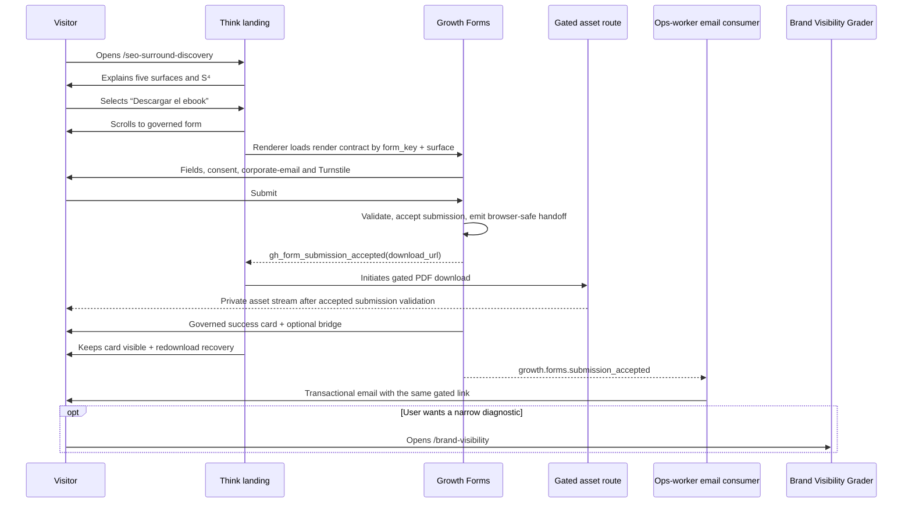

# TASK-1387 — Surround Discovery Ebook Landing Flow

## Meta

- Owner task: `TASK-1387`
- Flow kind: `public lead magnet → governed asset delivery → optional diagnostic bridge`
- Entry points: organic search, SEO/AEO service pages, Brand Visibility Grader, newsletter, social, paid/owned campaigns with valid UTMs.
- Exit points: gated PDF download, Brand Visibility Grader, public Efeonce contact; no forced meeting.

## Primary Flow

## Route and State Matrix

| Trigger | From | To | Focus | Analytics | Recovery |
| --- | --- | --- | --- | --- | --- |
| Page open | external | landing hero | `h1` / normal browser entry | page view + UTM context | standard browser retry |
| Hero CTA | hero | form anchor | form heading, no forced focus for pointer user | governed CTA event only if implemented | form remains reachable by keyboard |
| Form contract loaded | loading | ready | current focus unchanged | renderer `gh_form_viewed` | retry on error |
| Form submit accepted | ready/pending | success | renderer success card (`tabindex=-1`) | `gh_form_submission_accepted → generate_lead` + async email consumer | immediate download; bounded redownload and email backup use the same gated route |
| Download failure after accepted | success | degraded | degraded heading | no PII/token event | explain recovery, do not claim completion |
| Grader bridge | success | `/brand-visibility` | target page H1 | governed CTA event if available | browser back preserves landing state only when supported |
| FAQ toggle | FAQ closed | FAQ open | native summary | no required event | native toggle |

## Interaction and Recovery Rules

- Form controls and submit behavior are renderer-owned. The host cannot retry POST, synthesize success or manufacture `download_url`.
- `download_url` is transient browser-safe handoff data, never persisted into DOM attributes, query parameters, analytics or copied to public markup.
- The host preserves the renderer-owned `success_card`; it may add only the transient redownload recovery below it. The async email consumer re-reads the accepted submission and sends the same gated route, never a PDF attachment or raw GCS URL.
- Unknown origin/CORS errors are shown as a safe form-unavailable state. The operator fixes the surface configuration; the visitor is never instructed to diagnose CORS.
- If the gated route fails after an accepted submit, retain the successful acceptance message and offer a bounded retry only while the handoff exists. Do not send the user to raw GCS.
- The grader is a voluntary next step after the download, not an interstitial or a replacement for the promised asset.

## Keyboard and Assistive Flow

1. Skip link reaches `main`; H1 communicates the thesis.
2. Anchor CTA scrolls without trapping focus; normal Tab reaches five-surface links, S⁴ and form heading.
3. Renderer handles field errors and submits; success/error heading receives programmatic focus once.
4. FAQ is native `
`; Enter/Space toggles it. No hidden controls or hover-only map behavior.
5. The final CTA returns to the form or links to the grader with a descriptive accessible name.

## GVC Scenario Plan

- Scenario: `surround-discovery-ebook-landing` in the Think repository.
- Capture sequence: hero → five surfaces → S⁴ → form loading/ready → success/degraded → FAQ → final bridge.
- Viewports: 1440, 390 and reduced-motion.
- Assertions: form uses published `form_key`, CTA scroll is deterministic, success never precedes accepted handoff, no page overflow and focus reaches the status heading.

## Design Decision Log

- Decision: the flow keeps the ebook as the first and fulfilled commitment; the grader is an optional post-delivery bridge.
- Rejected: a multi-step wizard, a meeting interstitial or redirecting to the grader before PDF delivery. Each would turn a learning exchange into an opaque sales gate.
- Risk control: if the handoff is missing, render a degraded recovery state rather than fabricating a download state.

## Acceptance Checklist

- [ ] One accepted submission has one download handoff; no alternate local submit flow exists.
- [ ] Success, degraded and error recoveries are distinguishable and focus-safe.
- [ ] The grader bridge is optional and occurs only after delivery state is visible.
- [ ] Mobile, keyboard and reduced-motion preserve the same route/state semantics.
