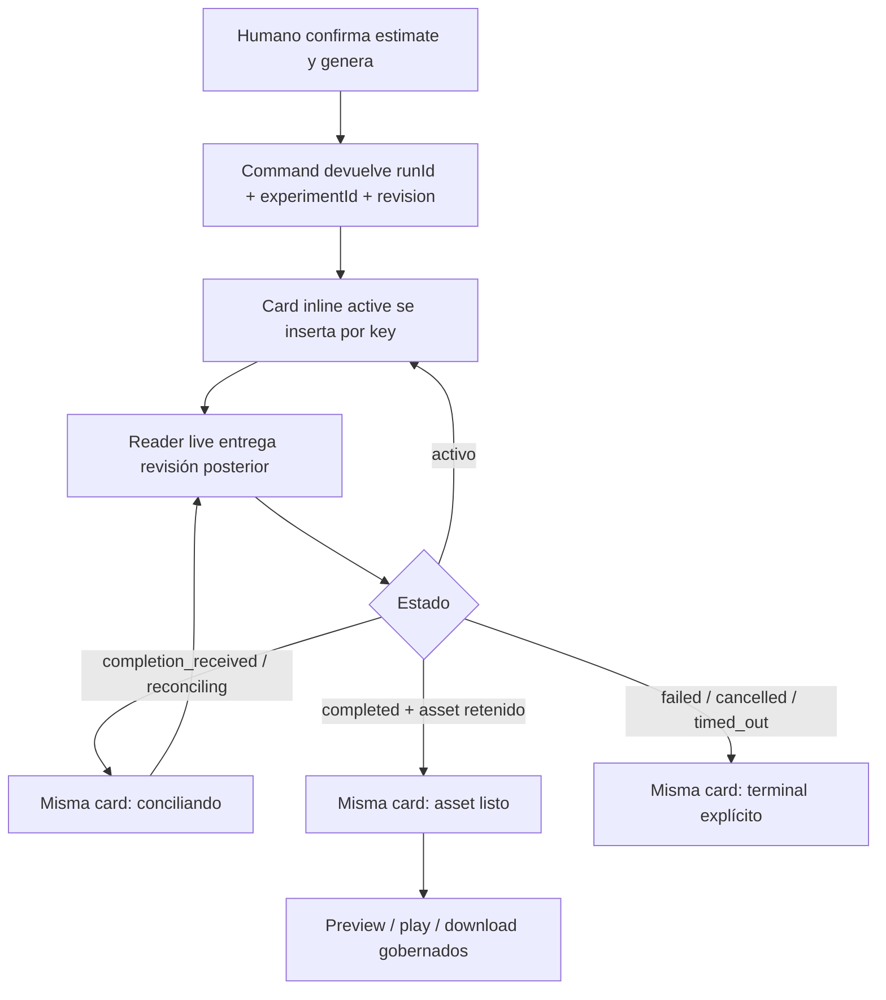
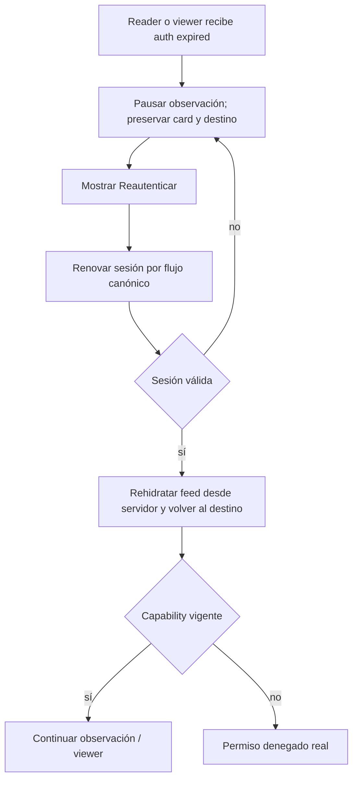

# TASK-1526 — Producer Resilient Feed / Flow Contract

## Canonical Flow

## Session Recovery

## Interaction Rules

- Nunca reejecutar `prepare|execute` al reanudar, refrescar o reautenticar.
- Un cursor expirado causa full-list recovery, no pérdida de la card ni refresh del command.
- Selección no cambia identidad ni lifecycle; sólo `aria-selected`, toolbar y active item.
- Filtro y orden se aplican primero al snapshot local; el reader remoto reconcilia después sin bloquear ni vaciar.
- Búsqueda usa debounce, abort/supersession y secuencia; sólo la consulta vigente puede aplicar su respuesta.
- Ocultar una card no equivale a retirarla del feed: conserva nodo, Blob URL, foco recuperable y playback.
- Cerrar viewer restaura foco a la misma key; si desapareció, al heading del feed.
- Preview error es local al media slot; metadata y acciones seguras siguen disponibles.
- Toast anuncia transición, pero la card es la verdad persistente.

## GVC Sequence

1. Capturar feed estable.
2. Crear run A y B; comprobar dos cards.
3. Seleccionar B mientras A cambia de revisión; filtrar/ordenar/buscar y comprobar nodos, Blob URLs y requests.
4. Terminalizar A a asset y B a fallo o timeout.
5. Abrir asset; expirar sesión; reautenticar y volver al viewer.
6. Repetir en `390×844`, teclado, red lenta y reduced motion.
