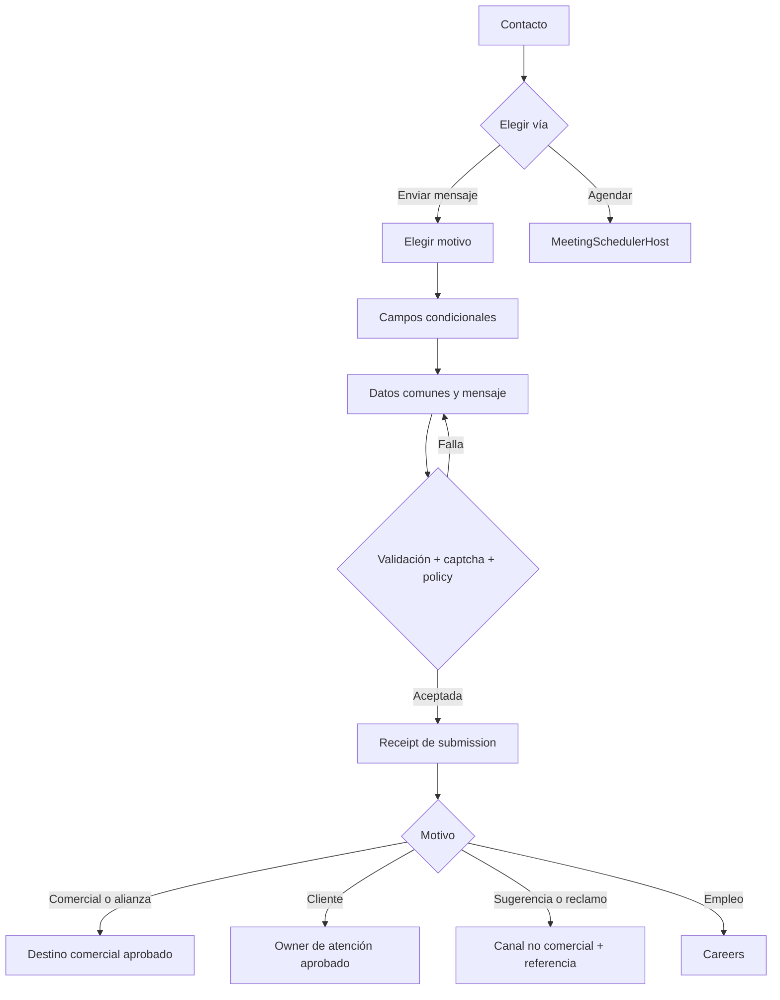
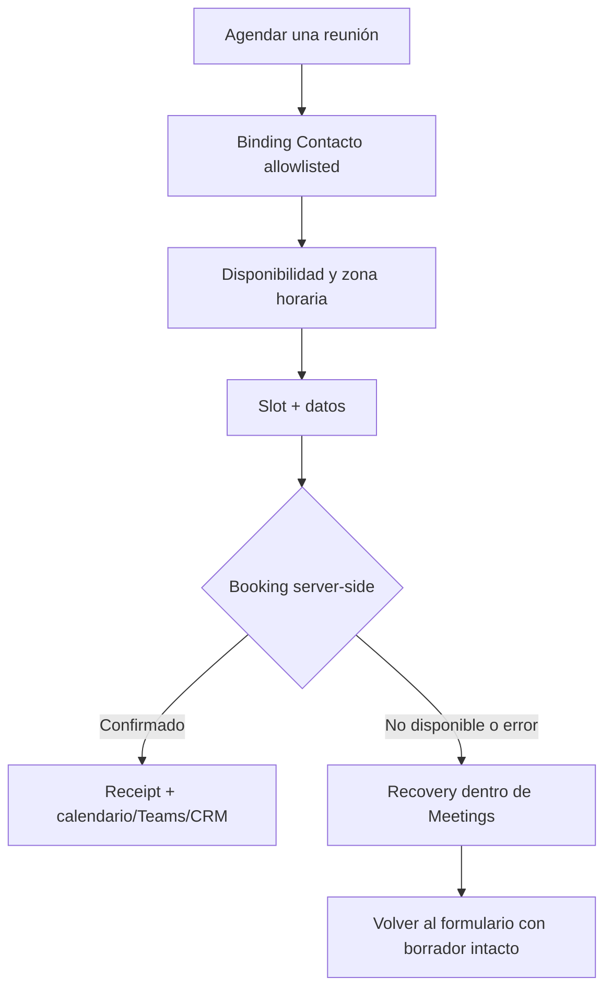

# TASK-1801 — Flow de Contacto multistakeholder

## Entry points

- Menú y footer existentes → `/contacto/`.
- CTA de landings → `/contacto/` con UTMs preservadas; no preseleccionan motivo sin contrato allowlisted.
- Enlace directo a agendar → activa Meetings sólo mediante binding permitido.

## Mensaje

### Invariantes

- Motivo es requerido antes de campos específicos.
- Campos invisibles se eliminan del payload y de la validación.
- Nombre y email son comunes; teléfono es opcional.
- Sugerencia/reclamo no exigen empresa ni aceptan opt-in de marketing como condición.
- Submit exitoso requiere receipt persistido; retry usa idempotency y no duplica.
- El owner/destino de cada motivo se aprueba antes de publicar.

## Agenda

### Invariantes

- Agendar no requiere submit de contacto y no sustituye sugerencias/reclamos.
- El browser no recibe IDs de proveedor, secretos ni mapping.
- Cerrar con Escape restaura foco al CTA y conserva estado mientras el host siga conectado.
- No se muestra éxito optimista; se verifica receipt, calendario, CRM y Teams en rollout controlado.

## Failure and recovery

| Falla | Respuesta | Conserva |
| --- | --- | --- |
| Form contract no carga | canales institucionales verificados + reintento | motivo si existe localmente |
| Validación | errores por campo + resumen enfocado | todos los valores válidos |
| Captcha/rate limit | mensaje seguro y momento de reintento | borrador completo |
| Destination async | receipt de aceptación; no promete entrega inmediata | submission durable |
| Meetings unavailable | navegación/reintento y volver al mensaje | borrador del formulario |
| Booking ambiguo | no reintentar a ciegas; read-back/manual según arquitectura | idempotency key |

## Analytics boundary

Permitidos: vista, vía elegida, motivo como enum allowlisted, paso, validación categórica, aceptación y booking
confirmado. Prohibidos: nombre, email, teléfono, empresa, mensaje, reclamo, asunto libre, URL libre y cualquier texto
de campo. La conversión se deriva de receipt; no de click o success visual optimista.
