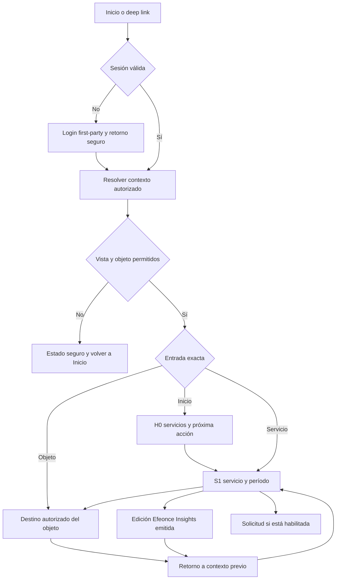

# TASK-1854 — Flow: del aviso a una decisión con contexto

Contrato detallado 2026-09-09; sin runtime ni pruebas ejecutadas. UI ready: no.
Wireframe: `docs/ui/wireframes/TASK-1854-client-home-services-and-cycle-experience.md`.
Dirección: `docs/ui/visual-directions/TASK-1854-client-home-services-and-cycle-experience.md`.

## Surface Inventory

| ID | Entrada | Trabajo del usuario | Salida / owner |
|---|---|---|---|
| E0 | Email, in-app, Teamsbot o link guardado | Recuperar un contexto concreto | Resolver first-party de identidad; TASK-1834 |
| H0 | `/home` | Reconocer servicios y pendiente principal | S1 o destino autorizado de objeto |
| S1 | `/home/services/[serviceId]?period=[periodId]` propuesta | Entender servicio y ciclo | Trabajo, revisión, solicitud o informe |
| S2 | Destino autorizado de trabajo | Inspeccionar/revisar pieza | Delivery/proveedor/TASK-289, no motor nuevo |
| I1 | Destino de edición Efeonce Insights | Leer evidencia congelada y actuar | TASK-1849 y acciones permitidas |
| N0 | Centro/preferencias de avisos existente o futuro habilitado | Consultar avisos o preferencias | TASK-690/693; no segundo Hub |

## Recorrido principal

La ruta de detalle es propuesta. El resolver de destinos sólo devuelve rutas ya implementadas y habilitadas;
la existencia de este flow no vuelve alcanzables los módulos. Si el destino exacto está retirado, mostrar
estado seguro, no sustituirlo por otro cliente, pieza o edición.

## State and Transition Contract

### F54-01 — Inicio y selección de servicio

1. H0 resuelve identidad, organización, vista y módulos; distingue resolver caído de servicio no habilitado.
2. Lee servicios y períodos autorizados. H0 no muestra denominadores/gráficos antes de recibir datos.
3. Presenta pendientes ordenados por el reader, servicios y edición emitida pertinente cuando hay permiso.
4. Al seleccionar servicio navega con identificador estable y período válido; foco al h1 de S1.
5. S1 muestra corte por fuente, resultado, pendiente y trabajo. Si una fuente falla, el resto continúa útil.
6. Volver a Inicio restaura posición y foco a fila de servicio si aún existe; si fue retirada, al encabezado.

### F54-02 — Cambiar período o tab

1. Selector muestra el valor actual y sólo períodos autorizados. El cambio elegido actualiza el contexto URL.
2. Durante lectura, conservar shell y selección; marcar resultados anteriores con su período anterior o
   sustituir su región por loading. Nunca presentar cifras viejas debajo de un label nuevo sin advertencia.
3. Cancelar/descartar respuestas fuera de la clave organización/servicio/período. Última intención gana.
4. Confirmada la lectura, actualizar datos/corte en conjunto y anunciar resumen una vez. No mover foco del selector.
5. Error conserva el período intentado, explica que no se cargó y permite retry o elegir otro; no saltar al actual.
6. Tab cambia el panel dentro del servicio; su estado es recuperable por URL bajo contrato de implementación.
   `tab` es parámetro propuesto de UI, validado contra allowlist; no se usa para decidir permisos.
7. Usar history push para navegar a servicio/objeto; replace para filtros transitorios cuando no representan
   un nuevo destino. Back debe recuperar la navegación significativa, no cada pulsación de búsqueda.

### F54-03 — Revisión de trabajo

1. El cliente ve objeto, estado, siguiente actor y botón con verbo real, por ejemplo Revisar pieza.
2. Revalidar destino/autoridad en servidor; no emitir URL de proveedor indiscriminada desde el browser.
3. Si el destino es externo autorizado, indicar “Abre [herramienta]” y nueva pestaña si ése es el patrón vigente;
   evitar abrir pestañas en background después de esperas que bloqueen popups. Ofrecer link seguro explícito.
4. La herramienta dueña conserva feedback/aprobación. Abrir el link no significa revisar ni aprobar.
5. Al volver, revalidar reader. Si el cambio no se sincronizó, mostrar el estado con su corte y explicación;
   no optimistamente convertir “En revisión” en “Aprobado”. No pedir al cliente repetir una aprobación.
6. Si no hay enlace operativo, la fila sólo muestra información y siguiente paso autorizado; no CTA muerto.

### F54-04 — Efeonce Insights y regreso al servicio

1. Mostrar únicamente edición/output emitido y autorizado; separar período del informe, fecha de emisión y corte.
2. Abrir destino exacto de TASK-1849. Efeonce Insights no se reemplaza por `/nexa/insights`.
3. Si un informe contiene un siguiente paso hacia una pieza/solicitud, revalidar el objeto al seguirlo.
4. El informe permanece congelado; el servicio puede mostrar datos más recientes. No sincronizar sus cifras
   por apariencia ni sobreescribir la edición al refrescar métricas.
5. Builder cliente usa commands de Insights y su capability; crear solicitud de servicio no crea una edición.
6. Una URL shared concede sólo lectura de esa edición según su grant. No abre autogestión ni navegación de cuenta.
7. Volver conserva servicio/período; si el origen fue una entrada directa, breadcrumb jerárquico válido.

### F54-05 — Primera apertura y canales

| Evento/motivo | Mensaje mínimo a pedir a la dueña | Destino | Qué constituye acción |
|---|---|---|---|
| Informe emitido | Hallazgo permitido, período y CTA Abrir informe | Edición específica | Visita humana autenticada; decisión posterior separada |
| Revisión requerida | Objeto autorizado, servicio, próximo paso, fecha si real | Pieza/revisión concreta | Command/confirmación del owner de revisión |
| Información requerida | Solicitud y dato que falta, sin adjuntos privados en email | Detalle de solicitud | Aporte durable al command |
| Solicitud actualizada | Cambio material, siguiente paso y referencia | Detalle actual | Lectura y mutación se registran separadas |
| Resumen periódico | Cambios útiles del período y acción pertinente | Servicio/período o edición | No se deduce adopción por pixel de email |

Copy de canales vive en TASK-1848/1849 y Notification Hub, no en una nueva plantilla de esta UI.
Email e in-app acompañan la apertura según Hito N; Teamsbot sólo para destinatario/destino habilitado.
No enviar avisos por cada refresco de métrica. Agrupar/deduplicar por intención/evento en el owner.
No prometer que un usuario recibe todos los canales; preferencias, supresión y configuración son reales.
Si el informe todavía no puede emitirse, no usar un correo ficticio como evidencia de activación.
La apertura de lectura puede avanzar por sus gates; declarar pendiente el hito integrado de comunicación.

### F54-06 — Login, organización equivocada y revocación

| Situación | Resolución | Protección |
|---|---|---|
| Sin sesión | Login canónico y retorno interno validado | No brief/tokens en returnTo; no open redirect |
| Login vigente | Continuar si está verificado para cohorte | No forzar OIDC nativo para terminar la UI |
| OIDC nativo | TASK-1834 y gates de cohorte previos | No ampliar scopes, módulos o consentimientos por retorno |
| Otra organización activa | Entrada/selector canónico cuando soporte ese caso | Confirmar contexto autorizado; no cambio silencioso desde query |
| Cuenta/objeto no permitido | Denegación segura | No título, nombre de archivo, cantidad ni miniatura ajenos |
| Permiso revocado con página abierta | Invalidar contenido privado al revalidar | No reusar caché del scope anterior ni refresh que filtra un instante |
| Resolver caído | Degradación y reintento de lectura | No sustituir por datos legacy sin comprobar autoridad equivalente |
| Destino retirado | Estado seguro, Inicio accesible | No desviar a otra edición/pieza como si fuera la solicitada |

No sumar pantallas de login/selector locales. TASK-1852 fija el contrato con TASK-1834; la nueva UI consume
el mecanismo disponible. Las negativas deben probarse por URL directa, menú, búsqueda y enlaces recibidos.

## Focus and Recovery

| Transición | Foco | Recuperación |
|---|---|---|
| Entrada a H0/S1 por ruta | H1 programáticamente enfocable | No autofocus en selector móvil |
| Cambio de período | Se queda en selector | Estado polite, sin salto de scroll |
| Disclosure fuente | Trigger conserva foco; contenido en orden | Escape sólo si flotante; cerrar restaura trigger |
| Ir a objeto y Back | Fila original si existe | Si desapareció, encabezado/lista, sin foco en body |
| Error de lectura | No robar foco en refresh de fondo | Mensaje y Retry junto a sección |
| Denegación de ruta | Encabezado de estado seguro | Link Inicio real |
| Actualización mientras se lee | Conservar posición/selección | No reordenar bajo el puntero; aplicar nueva lista al confirmar refresh |

Los GET, prefetch y scanners no ejecutan aprobación, creación, respuesta ni resolución. Si el Hub marca
un aviso como leído, usa su command explícito tras interacción según contrato; eso nunca completa el trabajo.
El evento de visita no lleva título, términos SEO, contenido de informe ni datos privados innecesarios.

## GVC Scenario Plan

Cobertura H54-01..12 del wireframe; cada caso registra paso, fixture, resultado esperado, resultado observado,
captura y evidencia de reader/command cuando corresponda. Validar servicio y periodo en URL/DOM/DTO, no sólo
existencia de botones. Un test que compara el texto de una ruta no acredita login/autoridad ni ausencia de writes.

Journey obligatorio: aviso legítimo → sin sesión → login → objeto exacto → acción del owner → servicio
actualizado. Repetir variante sólo lectura y negativa cross-org; usar fixture técnico, no enviar a clientes.
Canales requieren ledger/readback de sus dueñas aparte de capturas UI. Captura de un email no acredita entrega.
No registrar adopción por hit del servidor, pixel, apertura automática de Teams o preview de enlace.

## Design Decision Log

- F54-D1: servicio/período son contexto estable y compartible, no una selección efímera.
- F54-D2: links transportan intención/destino permitido; el servidor conserva autoridad por llamada.
- F54-D3: informe congelado, servicio vivo y solicitud transaccional conservan owners distintos.
- F54-D4: se reutiliza canal/login/visor; ningún componente de Inicio adquiere efectos laterales de negocio.
- Pendientes de ejecución: parámetros exactos de destinos existentes, integración de routes/guards,
  escenarios ejecutables, readback y primer fold. Los contratos propuestos no prueban runtime.
