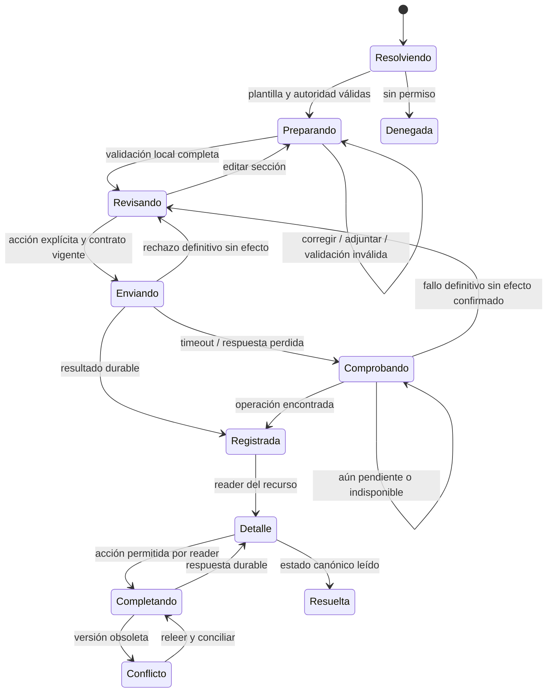

# TASK-1856 — Flow: preparar, enviar y recuperar una solicitud

Contrato detallado 2026-09-09. UI ready: no; sin implementación ni evidencia de runtime.
Wireframe: `docs/ui/wireframes/TASK-1856-client-service-request-and-brief-self-service-ui.md`.
Los nombres de estados de interfaz describen comportamiento; no crean enums canónicos de Delivery.
TASK-1855 debe mapearlos a su contrato versionado antes del primer submit.

## Surface Inventory

R0 lista → R1 preparar → R2 revisar → R3 acuse/detalle → R4 completar → R5 resolución.
Login/selector/contexto: TASK-1834. Entregables/revisión: Delivery y TASK-289. Informes: TASK-1849.
Email/in-app/Teamsbot: Notification Hub y sus dueñas; no producen otra conversación ni estado independiente.

## State and Transition Contract

No hay flecha automática Registrada → Aceptada/En producción. “Comprobando” describe una operación con
resultado incierto, no una segunda solicitud ni un estado editorial visible como éxito.

### F56-01 — Entrada contextual

1. Desde servicio, precargar organización, serviceId, período relacionado y requester desde servidor.
2. Resolver create capability y templateVersion. Si no existen, mostrar lectura/estado pertinente sin form ficticio.
3. Presentar requisitos, campos y política de archivos antes de interacción. No pedir correo/servicio repetidos.
4. Contexto inicial puede proponer objeto existente sólo después de autorizarlo; sanitizar query de origen.
5. Escribir crea estado local del formulario; no genera solicitud remota ni email. No reservar un cupo comercial.
6. Si templateVersion cambia antes de enviar, reconciliar constraints y señalar campos afectados sin vaciar el resto.

### F56-02 — Edición, revisión y vuelta

1. Campos esenciales abiertos, opcionales identificados. Al cambiar tipo, calcular qué información dejaría de
   ser aplicable; advertir antes de descartarla. Conservar base compatible y no enviar campos ocultos obsoletos.
2. “Revisar solicitud” valida todos los grupos; con errores muestra resumen enlazado y enfoca ese resumen.
3. Cada link de error abre grupo necesario y enfoca campo. El texto ya escrito y adjuntos válidos permanecen.
4. Si válido, R2 muestra todo lo que será enviado, incluida fecha solicitada y faltantes opcionales relevantes.
5. “Editar [sección]” vuelve a R1 y a ese campo; no vacía el formulario ni crea un nuevo draft remoto.
6. Al volver a R2, snapshot de revisión se recompone con los valores actuales y templateVersion vigente.
7. Enviar explícitamente inicia la única intención durable. No submit por blur, Enter en textarea o cerrar panel.

### F56-03 — Archivos

| Evento | Estado UI | Efecto autorizado |
|---|---|---|
| Elegir archivo | Seleccionado | Verificación local de constraints; no suficiente para aceptar |
| Iniciar upload | Cargando | Operación de archivos del owner, progreso de bytes real |
| Upload completo | Validando | Esperar veredicto backend; no marcarlo listo por storage 2xx |
| Validación positiva | Disponible | Referencia privada elegible para snapshot |
| Rechazo | Error por archivo | Retirar/reemplazar/reintentar según código permitido |
| Quitar antes de enviar | Retirado del formulario | Limpieza/TTL del owner; no borrado de fuente compartida |
| Revocación antes de command | Revisión requerida | Rechazar referencia, conservar campos restantes |
| Abrir tras recepción | Acceso a archivo | Reautorización por objeto y URL temporal; no URL eterna en historial |

No archivar contenido arbitrario desde URLs pegadas. No previsualizar HTML/SVG u otro contenido activo fuera
de policy. Seleccionar un archivo repetido debe advertir/usar reglas del owner, sin dedupe por nombre solamente.
Si un upload falla después de abandonar la página, el backend resuelve cleanup; la UI no promete rollback de storage.

### F56-04 — Submit e idempotencia

1. Validar client-side para feedback; command revalida todo, incluida autoridad, templateVersion y adjuntos.
2. Crear una idempotency key por intención de envío, antes de la primera llamada. Congelar payload normalizado
   y referencias durante el intento. Deshabilitar repetir submit y mostrar estado persistente.
3. Respuesta durable incluye referencia/resourceId y estado real. Navegar a R3 reemplazando la ruta de envío
   para que Back no recree el POST. Reader confirma el recurso, no un flag local de éxito.
4. Rechazo definitivo sin efecto permite corregir. La política de claves debe distinguir nueva intención tras
   modificar payload de replay exacto; backend posee esa semántica. Nunca reutilizar una key con otro payload.
5. Doble clic, refresh del detalle, Back o reentrada no crean otro recurso. No generar nuevas keys en un loop de retry.
6. Si el command acepta la solicitud pero falla el readback, mostrar referencia confirmada y retry de lectura.
7. Si falla la notificación, mantener la solicitud registrada. El owner reintenta el canal; la UI no repite create.

### F56-05 — Resultado incierto

| Evidencia disponible | Mensaje/acción | Prohibición |
|---|---|---|
| Timeout después de enviar | Comprobando si quedó registrada; misma operación | No afirmar “No se envió” |
| Reconciliación encuentra recurso | Abrir su detalle; mostrar acuse | No crear una solicitud nueva |
| Backend declara fallo definitivo sin efecto | Volver a revisión y permitir retry gobernado | No asumirlo sólo por HTTP del proxy |
| Estado pendiente | Mantener espera y opción Comprobar envío | Sin polling de UI sin límite/backoff definido por owner |
| Reconciliación indisponible | Mantener resultado incierto y referencia de operación segura | No ofrecer Enviar de nuevo con otra key |
| Vuelta tras recarga sin draft | Recuperar recurso/operación por mecanismo autenticado del owner | No reconstruir brief desde URL ni telemetría |

TASK-1855 debe definir contrato de lookup/reconciliación y recuperación tras recarga; si falta, el submit
no está listo para rollout. El payload de brief no se guarda en almacenamiento web para suplir ese gap.
Si existe una referencia de operación local, no equivale a autoridad ni contiene datos del brief; su
persistencia y expiración necesitan contrato explícito. El reader sigue filtrando por actor/contexto.

### F56-06 — Dirty state, sesión y conectividad

| Situación | Comportamiento | Límite comunicado |
|---|---|---|
| Cambiar sección Preparar/Revisar | Preservar estado local | No es un guardado remoto |
| Cancelar, Back interno o cambiar servicio/cuenta | Dialog Seguir editando / Salir sin enviar | Escape/click-away nunca descartan |
| Recargar/cerrar pestaña con dirty | beforeunload donde navegador lo soporte | No garantizar que el navegador muestre el diálogo |
| Sin red antes de enviar | Conservar inputs en pantalla y bloquear envío | Recargar/cerrar puede perderlos; no autosend al volver online |
| Sesión vence en edición | Mostrar aviso, proteger salida y usar login canónico | Si login abandona documento no hay restauración garantizada sin draft durable |
| Sesión vence durante submit | Reconciliar operación al volver autenticado | No ejecutar replay automático del POST por returnTo |
| Permiso revocado | Retirar datos protegidos/caché y bloquear command | Seguridad prevalece sobre conservar un brief no autorizado |
| Dos pestañas | Cada intención separada, commands/versiones como autoridad | No anunciar coordinación automática de drafts inexistente |

Mejora posible: borrador durable con actor/org/TTL y restauración segura. No está contratado como capacidad
existente; si se incorpora en TASK-1855, documentar read/write/discard, retención, conflicto y pruebas antes
de ofrecer “Guardar borrador” o prometer recuperación tras login. V1 mantiene copy honesto de memoria local.

### F56-07 — Completar información y conflicto

1. Abrir detalle actual; leer preguntas, allowedActions y expectedVersion; no confiar en estado del aviso.
2. Si acción sigue vigente, mostrar únicamente campos requeridos/permitidos y contexto de la pregunta.
3. Cliente añade respuesta; conservar referencia al brief original y a la solicitud de información.
4. Enviar mediante command con nueva intención idempotente y expectedVersion de esa edición.
5. Si éxito durable, releer historial y siguiente paso; “Información recibida” no significa aceptación del trabajo.
6. Si conflicto, mostrar estado nuevo y comparar campos del aporte del cliente con versión actual autorizada.
   Preservar aporte local mientras siga permitido; no fusionar automáticamente valores contradictorios.
7. Si la pregunta ya se resolvió o permiso fue retirado, informar y retirar acción; no cambiar expectedVersion
   a la última y reenviar automáticamente para forzar un éxito.
8. Toda respuesta aparece como evento/revisión visible con actor permitido y fecha; notas internas no se proyectan.

### F56-08 — Aviso, lectura y siguiente acción

1. Evento material del agregado produce intención de notificación en sus dueñas (recibida, información requerida,
   respuesta o resolución según policy). Reintentos conservan idempotencia y destinatarios revalidados.
2. Email/in-app/Teamsbot presentan resumen mínimo y CTA a la solicitud, sin links directos permanentes a adjuntos.
3. Deep link pasa por login/contexto y autorización de objeto. GET/scanner/prefetch no crean ni completan nada.
4. Si aviso antiguo dice “Necesita información” pero el objeto ya está resuelto, detalle muestra estado actual
   y una explicación breve; no reabre la pregunta para hacer coincidir el correo.
5. Si otra persona completó el pedido, la actividad visible lo explica sin exponer conversaciones internas.
6. Marcar aviso como leído es una operación del Hub; no equivale a ejecutar el pedido ni a aceptar entregables.
7. Preferencias se administran en su superficie dueña, disponibles como parte del portal base; no pedirlas
   de nuevo en cada formulario ni convertirlas en consentimiento genérico forzado para enviar la solicitud.

## Separación de estados visibles

| Dimensión | Ejemplo | Presentación |
|---|---|---|
| Solicitud | Recibida / necesita información / resuelta | Estado principal del recurso |
| Trabajo de Delivery | Planificado / en producción / entregado, si vinculado | Sección de trabajo relacionado con su propio estado |
| Publicación | Verificada / pendiente de verificar | Sólo en pieza/destino correspondiente |
| Sincronización | Corte anterior / actualización pendiente | Metadato técnico traducido a impacto comprensible |
| Aviso | Enviado/falló/suprimido, si el reader cliente lo permite | No sustituye el estado del pedido |

Los enums definitivos se fijan en TASK-1855; labels frontend no crean transiciones legales. En ausencia
de mapping conocido, mostrar estado seguro y bloquear writes, sin inferir “Recibida” por default.

## Focus and Recovery

- Ruta nueva: foco al h1, no al primer input automáticamente en móvil.
- Revisar: encabezado de revisión; Editar sección: campo específico; submit inválido: resumen y links.
- Pending: botón estable y foco conservado; texto de estado polite. No spinner que elimine su accessible name.
- Acuse: encabezado del detalle/referencia; no toast efímero como único resultado.
- Conflicto: encabezado del mensaje, luego estado actual y aporte conservado; ninguna acción destructiva enfocada.
- Salida: dialog con foco inicial en Seguir editando, trap, Escape conservador y retorno al invocador.
- Refresh del historial: no robar foco al cliente que está leyendo; anunciar elementos nuevos una vez.

## GVC Scenario Plan

Casos R56-01..16 del wireframe. Prueba causal obligatoria: backend persiste create y se pierde la respuesta;
UI reconcilia y termina en exactamente el mismo recurso. Verificar cardinalidad/ledger, no sólo un botón disabled.
Otra prueba obligatoria: dos actores/versiones compiten por completar información; el segundo recibe conflicto
sin perder su aporte ni sobrescribir la primera respuesta. Usar fixtures aislados y API/MCP del mismo command.

Capturas desktop/390 para form, revisión, error, envío incierto, acuse, detalle y conflicto. Evidencia de
teclado/lector y reduced motion. Comprobar no overflow y ausencia de datos privados en URL/captura/logs.
Los avisos reales y su readback pertenecen al piloto autorizado; QA técnica no comunica con clientes.

## Design Decision Log

F56-D1: recibir, aceptar, planificar y entregar son hechos separados.
F56-D2: revisión es local; resourceId sólo existe tras resultado durable.
F56-D3: recovery incierto es parte del contrato backend/UI, no un botón Reintentar genérico.
F56-D4: requests e informes Efeonce Insights usan commands/historiales propios y comparten contexto/destinos.
Pendiente: conciliación de plantilla/limits, operación recuperable, archivos y rutas con TASK-1855/1852;
implementación y GVC. Ninguna casilla funcional se cierra por la existencia de estos documentos.
