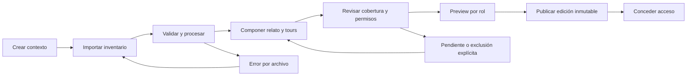
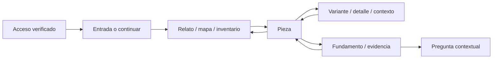

# Rooms — flujos y estados V1

Fecha: 2026-10-07. **Proposed.** [Contrato](../../architecture/rooms/EFEONCE_ROOMS_API_AND_ACCESS_CONTRACT_V1.md) · [Experiencia](../../architecture/rooms/EFEONCE_ROOMS_EXPERIENCE_V1.md).

## Contrato de interacción visual

Todos los flujos consumen el design system **La órbita** según la [dirección visual](../visual-directions/EFEONCE_ROOMS_VISUAL_DIRECTION_V1.md): Bricolage editorial, Poppins funcional, estados y controles canónicos. Anillo/esfera se aplican solo cuando el contrato expresa estado real; el loading no simula una medida. Foco/selección/errores tienen señal adicional al color; no reconstruir componentes desde el theme anterior.

## 1. Autoría a entrega

Guardar borrador no publica. Publicar no invita automáticamente. Una modificación posterior crea borrador y nueva edición; nunca cambia el snapshot emitido.

## 2. Explorar y evaluar

Cada transición guarda origen de retorno dentro de la sesión. Deep link resuelve edición y asset autorizado; si no hay permiso, pide acceso sin revelar contenido protegido. Links obsoletos no redirigen a otra pieza silenciosamente.

## 3. Preparar y presentar

Elegir edición/tour → notas autorizadas → ensayo → preflight real → abrir audiencia → confirmar estado → presentar. Pregunta del comité → abrir evidencia/pieza → inspeccionar → volver al punto del tour. Finalizar cierra sesión de presentación; la sala publicada sigue disponible por sus grants.

Solo una consola controladora activa por sesión en V1; takeover explícito y secuencia monotónica evitan órdenes de dos pestañas. Un ack tardío no revierte la escena nueva. Reconexión solicita snapshot actual, no reproduce toda la cola histórica. Datos privados no viajan por BroadcastChannel.

## 4. Estados que deben existir

| Situación | UI y recuperación |
|---|---|
| Upload en curso | Progreso medido; cancelación; no «ready» anticipado |
| Procesando | Estado por archivo/perfil; puede continuar autoría independiente |
| Error de archivo | Motivo útil redactado, reintentar/reemplazar, referencias preservadas hasta decisión |
| Conflicto de revisión | Comparar revisión actual y cambios propios; no sobrescribir silenciosamente |
| Media cargando | Poster estable y controles de espera; no pantalla negra ambigua |
| Audio bloqueado | Acción visible en audiencia para habilitar; consola informa bloqueo |
| Grant caducado/revocado | Cerrar acceso conforme política y ofrecer vía autorizada de recuperación |
| Consola desconectada | Audiencia conserva escena; reconexión sin saltos automáticos |
| Nueva edición | Aviso y cambio voluntario; tour actual conserva su edición |
| Red degradada | Calidad adaptativa si disponible, retry y límites declarados; no promesa offline |
| Pregunta enviándose | Idempotencia y confirmación real; no duplicar con retry |

## 5. Foco y navegación

Abrir panel mueve foco al encabezado/control adecuado; cerrar vuelve al disparador. Escape cierra el nivel activo, no abandona una sala con cambios sin guardar. Atajos de presentación no capturan teclas en inputs ni interfieren con lectores. Browser Back respeta navegación de exploración; salir de autoría advierte únicamente ante cambios no guardados reales.

## 6. Dependencias y alcance

Wireframes y flujos dependen del mismo modelo edition/asset/grant. Cuestiones de invitación, retención, TTL y regiones pendientes de especificación ejecutable no bloquean esta revisión documental, pero deben resolverse antes del runtime. No incluir notificaciones o mensajes salientes automáticos sin política y autorización explícitas.
